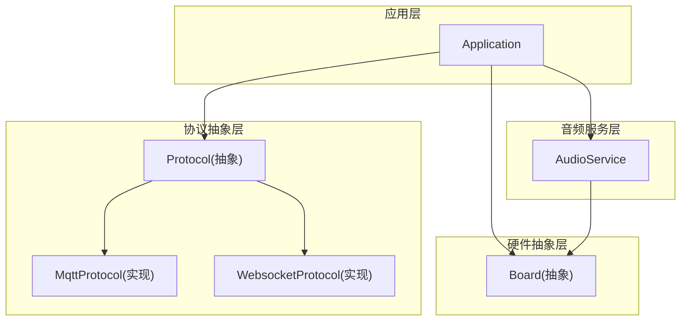
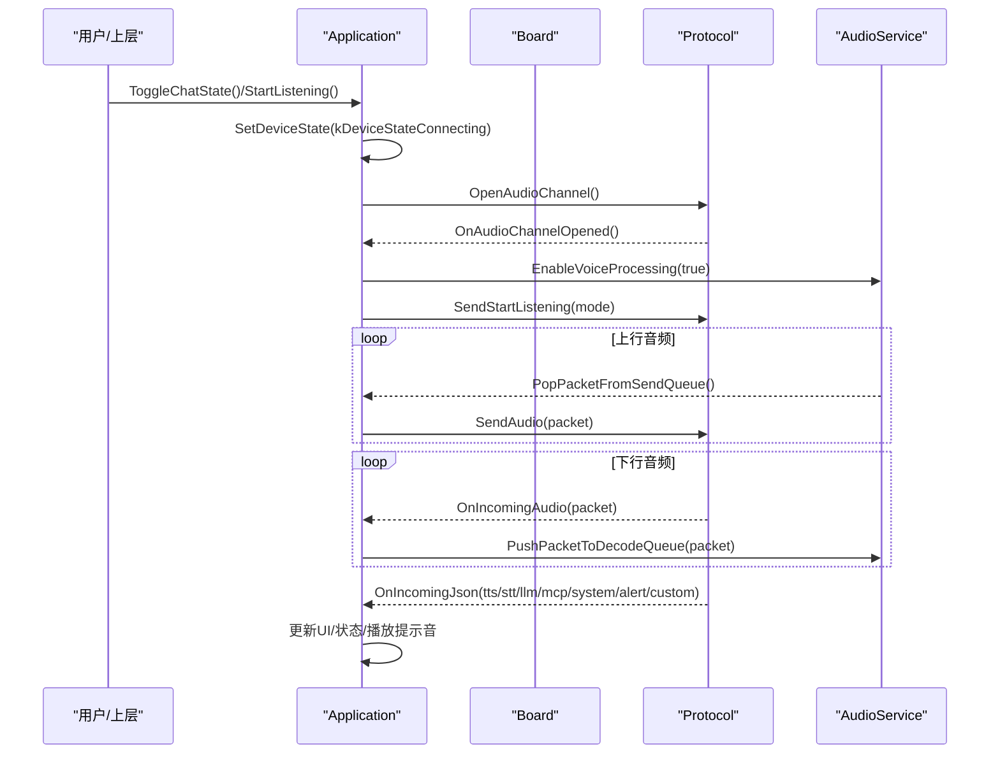
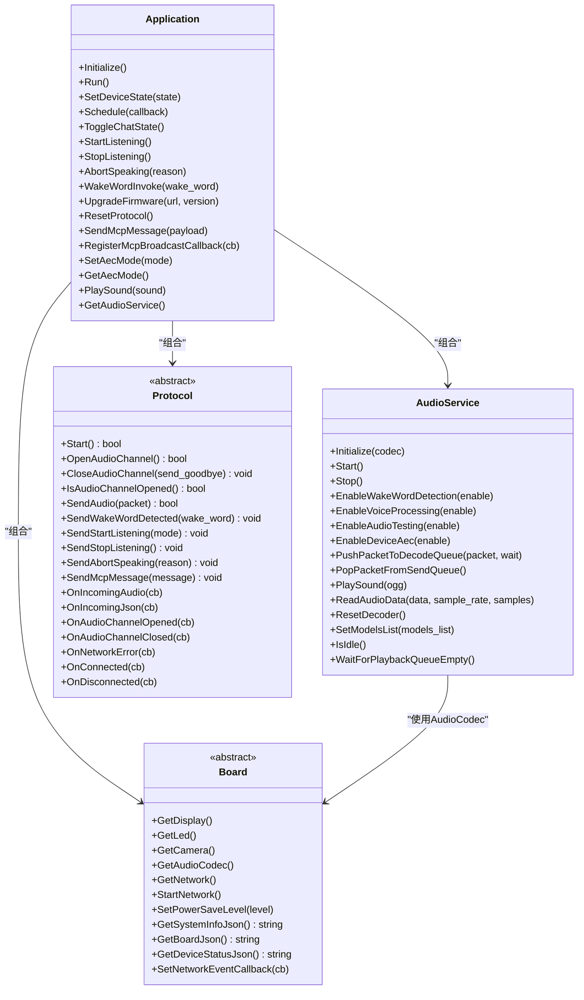

# API参考手册

<cite>
**本文引用的文件**
- [application.h](file://main/application.h)
- [application.cc](file://main/application.cc)
- [audio_service.h](file://main/audio/audio_service.h)
- [audio_service.cc](file://main/audio/audio_service.cc)
- [protocol.h](file://main/protocols/protocol.h)
- [protocol.cc](file://main/protocols/protocol.cc)
- [board.h](file://main/boards/common/board.h)
- [board.cc](file://main/boards/common/board.cc)
</cite>

## 目录
1. [简介](#简介)
2. [项目结构](#项目结构)
3. [核心组件](#核心组件)
4. [架构总览](#架构总览)
5. [详细组件分析](#详细组件分析)
6. [依赖关系分析](#依赖关系分析)
7. [性能与资源特性](#性能与资源特性)
8. [错误码与异常处理指南](#错误码与异常处理指南)
9. [集成示例与最佳实践](#集成示例与最佳实践)
10. [结论](#结论)

## 简介
本手册面向第三方开发者，系统化梳理并文档化设备端的核心API，覆盖以下关键类与接口：Application、AudioService、Protocol、Board。内容包括函数签名、参数说明、返回值定义、数据结构与枚举常量、回调注册与调用机制、错误码与异常处理、以及集成示例与最佳实践。读者无需深入底层即可快速完成集成与二次开发。

## 项目结构
本项目采用分层与模块化组织方式：
- 应用层：Application负责系统初始化、事件循环、状态机驱动、协议生命周期管理、UI与音频联动等。
- 音频服务层：AudioService封装音频采集、编解码（Opus）、VAD/唤醒词、队列调度、功耗管理等。
- 协议抽象层：Protocol提供统一的网络通信抽象，具体实现包括MQTT与WebSocket。
- 硬件抽象层：Board统一对外暴露板级能力（显示、LED、摄像头、网络、电源策略等）。

图表来源
- [application.h:43-176](file://main/application.h#L43-L176)
- [audio_service.h:105-193](file://main/audio/audio_service.h#L105-L193)
- [protocol.h:44-95](file://main/protocols/protocol.h#L44-L95)
- [board.h:49-85](file://main/boards/common/board.h#L49-L85)

章节来源
- [application.h:43-176](file://main/application.h#L43-L176)
- [audio_service.h:105-193](file://main/audio/audio_service.h#L105-L193)
- [protocol.h:44-95](file://main/protocols/protocol.h#L44-L95)
- [board.h:49-85](file://main/boards/common/board.h#L49-L85)

## 核心组件
本节概述四大核心类的职责与对外API要点。

- Application
  - 作用：系统入口、事件循环、状态机、协议与音频协调、OTA升级、MCP消息广播等。
  - 关键API：Initialize、Run、SetDeviceState、Schedule、Alert/DismissAlert、ToggleChatState、StartListening/StopListening、AbortSpeaking、WakeWordInvoke、UpgradeFirmware、ResetProtocol、SendMcpMessage、RegisterMcpBroadcastCallback、SetAecMode/GetAecMode、PlaySound、GetAudioService。
- AudioService
  - 作用：音频采集/播放、Opus编解码、唤醒词检测、语音处理（VAD/AEC）、队列与任务调度、功耗控制。
  - 关键API：Initialize、Start、Stop、EnableWakeWordDetection、EnableVoiceProcessing、EnableAudioTesting、EnableDeviceAec、PushPacketToDecodeQueue、PopPacketFromSendQueue、PlaySound、ReadAudioData、ResetDecoder、SetModelsList、IsIdle、WaitForPlaybackQueueEmpty。
- Protocol
  - 作用：统一网络协议抽象，提供音频通道管理与JSON文本消息收发。
  - 关键API：Start、OpenAudioChannel、CloseAudioChannel、IsAudioChannelOpened、SendAudio、SendWakeWordDetected、SendStartListening、SendStopListening、SendAbortSpeaking、SendMcpMessage；回调：OnIncomingAudio、OnIncomingJson、OnAudioChannelOpened、OnAudioChannelClosed、OnNetworkError、OnConnected、OnDisconnected。
- Board
  - 作用：板级能力抽象，获取显示、LED、摄像头、网络接口、电源策略、系统信息JSON等。
  - 关键API：GetDisplay、GetLed、GetCamera、GetAudioCodec、GetNetwork、StartNetwork、SetPowerSaveLevel、GetSystemInfoJson、GetBoardJson、GetDeviceStatusJson、SetNetworkEventCallback。

章节来源
- [application.h:43-176](file://main/application.h#L43-L176)
- [audio_service.h:105-193](file://main/audio/audio_service.h#L105-L193)
- [protocol.h:44-95](file://main/protocols/protocol.h#L44-L95)
- [board.h:49-85](file://main/boards/common/board.h#L49-L85)

## 架构总览
下图展示从用户交互到网络传输的端到端流程，涵盖状态切换、音频通道建立、数据流与回调。

图表来源
- [application.cc:662-730](file://main/application.cc#L662-L730)
- [application.cc:860-932](file://main/application.cc#L860-L932)
- [application.cc:489-610](file://main/application.cc#L489-L610)
- [audio_service.cc:506-529](file://main/audio/audio_service.cc#L506-L529)
- [protocol.cc:57-79](file://main/protocols/protocol.cc#L57-L79)

## 详细组件分析

### Application 类
- 设计要点
  - 单例模式，内部维护事件组与定时器，主循环等待事件并分发处理。
  - 通过状态机驱动设备状态变化，结合UI与音频服务进行联动。
  - 支持异步激活流程（检查资源版本、固件版本、初始化协议），完成后进入空闲态。
- 关键成员与行为
  - 事件常量：MAIN_EVENT_* 用于跨线程同步。
  - AEC模式：kAecOff/kAecOnDeviceSide/kAecOnServerSide，影响默认监听模式与设备侧AEC开关。
  - 回调与调度：Schedule将回调投递至主任务执行，保证线程安全。
- 重要方法摘要
  - Initialize：初始化显示、音频、网络回调、时钟定时器等。
  - Run：主事件循环，处理网络、状态、音频发送、唤醒词、VAD、定时器等事件。
  - SetDeviceState：请求状态迁移。
  - ToggleChatState/StartListening/StopListening：基于事件的对话控制。
  - AbortSpeaking：中断服务端TTS。
  - WakeWordInvoke：主动触发唤醒词流程。
  - UpgradeFirmware：远程升级固件。
  - ResetProtocol：重置协议资源（关闭音频通道、释放协议对象）。
  - SendMcpMessage/RegisterMcpBroadcastCallback：MCP消息发送与本地广播。
  - SetAecMode/GetAecMode：设置/查询AEC模式。
  - PlaySound：播放提示音。
  - GetAudioService：获取音频服务引用。
- 使用示例（路径）
  - 启动与运行：[application.cc:61-163](file://main/application.cc#L61-L163)、[application.cc:165-259](file://main/application.cc#L165-L259)
  - 打开音频通道与监听：[application.cc:695-730](file://main/application.cc#L695-L730)
  - 唤醒词触发：[application.cc:780-858](file://main/application.cc#L780-L858)
  - 状态变更处理：[application.cc:860-932](file://main/application.cc#L860-L932)
  - 升级固件：[application.cc:972-1022](file://main/application.cc#L972-L1022)
  - MCP消息：[application.cc:1074-1088](file://main/application.cc#L1074-L1088)
  - AEC模式切换：[application.cc:1090-1115](file://main/application.cc#L1090-L1115)

章节来源
- [application.h:43-176](file://main/application.h#L43-L176)
- [application.cc:61-163](file://main/application.cc#L61-L163)
- [application.cc:165-259](file://main/application.cc#L165-L259)
- [application.cc:695-730](file://main/application.cc#L695-L730)
- [application.cc:780-858](file://main/application.cc#L780-L858)
- [application.cc:860-932](file://main/application.cc#L860-L932)
- [application.cc:972-1022](file://main/application.cc#L972-L1022)
- [application.cc:1074-1088](file://main/application.cc#L1074-L1088)
- [application.cc:1090-1115](file://main/application.cc#L1090-L1115)

### AudioService 类
- 设计要点
  - 三任务模型：输入任务（采集+处理）、输出任务（播放）、编解码任务（Opus）。
  - 多队列缓冲：encode/decode/playback/send/testing，配合条件变量与互斥锁实现背压与流量控制。
  - 动态重采样：根据服务器或设备采样率差异自动调整。
  - 唤醒词与语音处理可插拔，支持设备侧AEC。
- 关键数据结构
  - AudioStreamPacket：音频帧（sample_rate/frame_duration/timestamp/payload）。
  - AudioTask：编码任务（type/pcm/timestamp）。
  - DebugStatistics：统计计数（input/decode/encode/playback）。
- 关键方法摘要
  - Initialize/Start/Stop：初始化编解码器、启动任务、停止服务。
  - EnableWakeWordDetection/EnableVoiceProcessing/EnableAudioTesting/EnableDeviceAec：功能开关。
  - PushPacketToDecodeQueue/PopPacketFromSendQueue：入队/出队音频包。
  - PlaySound：解析OGG片段并送入解码队列。
  - ReadAudioData：读取PCM，必要时重采样。
  - ResetDecoder：重置解码器与时间戳队列。
  - SetModelsList：设置模型列表并选择唤醒词实现。
  - IsIdle/WaitForPlaybackQueueEmpty：空闲判断与等待播放队列清空。
- 回调机制
  - AudioServiceCallbacks：on_send_queue_available、on_wake_word_detected、on_vad_change、on_audio_testing_queue_full。
- 使用示例（路径）
  - 初始化与启动：[audio_service.cc:62-167](file://main/audio/audio_service.cc#L62-L167)
  - 输入/输出/编解码任务：[audio_service.cc:230-446](file://main/audio/audio_service.cc#L230-L446)
  - 入队/出队与播放：[audio_service.cc:506-529](file://main/audio/audio_service.cc#L506-L529)、[audio_service.cc:633-654](file://main/audio/audio_service.cc#L633-L654)
  - 唤醒词与语音处理：[audio_service.cc:549-604](file://main/audio/audio_service.cc#L549-L604)
  - 设备AEC：[audio_service.cc:619-627](file://main/audio/audio_service.cc#L619-L627)
  - 模型列表与唤醒词选择：[audio_service.cc:700-726](file://main/audio/audio_service.cc#L700-L726)

章节来源
- [audio_service.h:105-193](file://main/audio/audio_service.h#L105-L193)
- [audio_service.cc:62-167](file://main/audio/audio_service.cc#L62-L167)
- [audio_service.cc:230-446](file://main/audio/audio_service.cc#L230-L446)
- [audio_service.cc:506-529](file://main/audio/audio_service.cc#L506-L529)
- [audio_service.cc:633-654](file://main/audio/audio_service.cc#L633-L654)
- [audio_service.cc:549-604](file://main/audio/audio_service.cc#L549-L604)
- [audio_service.cc:619-627](file://main/audio/audio_service.cc#L619-L627)
- [audio_service.cc:700-726](file://main/audio/audio_service.cc#L700-L726)

### Protocol 类
- 设计要点
  - 纯虚基类，定义音频通道与文本消息的统一接口，具体由MqttProtocol/WebsocketProtocol实现。
  - 通过回调通知上层音频通道状态、网络错误、连接状态与下行数据。
- 关键数据结构与枚举
  - AudioStreamPacket：音频帧结构。
  - BinaryProtocol2/BinaryProtocol3：二进制协议头（供底层实现使用）。
  - AbortReason：中止原因（无/唤醒词检测到）。
  - ListeningMode：监听模式（自动停止/手动停止/实时）。
- 关键方法摘要
  - Start/OpenAudioChannel/CloseAudioChannel/IsAudioChannelOpened/SendAudio：音频通道管理。
  - SendWakeWordDetected/SendStartListening/SendStopListening/SendAbortSpeaking/SendMcpMessage：文本命令。
  - OnIncomingAudio/OnIncomingJson/OnAudioChannelOpened/OnAudioChannelClosed/OnNetworkError/OnConnected/OnDisconnected：回调注册。
- 使用示例（路径）
  - 回调注册与默认实现：[protocol.cc:7-91](file://main/protocols/protocol.cc#L7-L91)
  - 在Application中绑定回调与使用：[application.cc:489-610](file://main/application.cc#L489-L610)

章节来源
- [protocol.h:10-42](file://main/protocols/protocol.h#L10-L42)
- [protocol.h:44-95](file://main/protocols/protocol.h#L44-L95)
- [protocol.cc:7-91](file://main/protocols/protocol.cc#L7-L91)
- [application.cc:489-610](file://main/application.cc#L489-L610)

### Board 类
- 设计要点
  - 单例工厂模式，create_board由具体板级实现提供，统一对外暴露硬件能力。
  - 生成并持久化UUID，提供系统信息与设备状态JSON。
- 关键方法摘要
  - GetDisplay/GetLed/GetCamera/GetAudioCodec/GetNetwork：获取硬件接口。
  - StartNetwork/SetNetworkEventCallback：启动网络与事件回调。
  - SetPowerSaveLevel：设置省电级别（低功耗/均衡/高性能）。
  - GetSystemInfoJson/GetBoardJson/GetDeviceStatusJson：系统/板级/设备状态JSON。
- 使用示例（路径）
  - UUID生成与系统信息JSON：[board.cc:15-46](file://main/boards/common/board.cc#L15-L46)、[board.cc:70-178](file://main/boards/common/board.cc#L70-L178)
  - 在Application中使用：[application.cc:61-163](file://main/application.cc#L61-L163)

章节来源
- [board.h:49-85](file://main/boards/common/board.h#L49-L85)
- [board.cc:15-46](file://main/boards/common/board.cc#L15-L46)
- [board.cc:70-178](file://main/boards/common/board.cc#L70-L178)
- [application.cc:61-163](file://main/application.cc#L61-L163)

## 依赖关系分析
- Application依赖Board以获取硬件能力，依赖AudioService进行音频处理，依赖Protocol进行网络通信。
- AudioService依赖Board提供的AudioCodec进行I/O，依赖唤醒词与语音处理器实现。
- Protocol为抽象层，具体实现由MQTT或WebSocket承担。

图表来源
- [application.h:43-176](file://main/application.h#L43-L176)
- [audio_service.h:105-193](file://main/audio/audio_service.h#L105-L193)
- [protocol.h:44-95](file://main/protocols/protocol.h#L44-L95)
- [board.h:49-85](file://main/boards/common/board.h#L49-L85)

章节来源
- [application.h:43-176](file://main/application.h#L43-L176)
- [audio_service.h:105-193](file://main/audio/audio_service.h#L105-L193)
- [protocol.h:44-95](file://main/protocols/protocol.h#L44-L95)
- [board.h:49-85](file://main/boards/common/board.h#L49-L85)

## 性能与资源特性
- 音频任务与队列
  - 输入/输出/编解码三任务并行，使用条件变量与互斥锁进行同步。
  - 最大队列长度限制防止内存溢出与延迟累积（如MAX_DECODE_PACKETS_IN_QUEUE、MAX_SEND_PACKETS_IN_QUEUE）。
- 重采样与编解码
  - 输入/输出重采样按需启用，避免不必要的CPU开销。
  - Opus编码器/解码器按帧时长配置，支持动态切换采样率与帧长。
- 功耗管理
  - 音频服务周期性检查输入/输出活跃度，长时间无活动则关闭对应I/O以降低功耗。
  - Board支持多级省电策略（LOW_POWER/BALANCED/PERFORMANCE），在连接/通话时提升性能，空闲时降低功耗。
- 超时与恢复
  - Protocol内置超时检测（最近接收时间），超过阈值视为通道超时。
  - 网络断开时自动关闭音频通道，避免资源泄漏。

章节来源
- [audio_service.cc:125-182](file://main/audio/audio_service.cc#L125-L182)
- [audio_service.cc:327-446](file://main/audio/audio_service.cc#L327-L446)
- [audio_service.cc:682-698](file://main/audio/audio_service.cc#L682-L698)
- [protocol.cc:81-91](file://main/protocols/protocol.cc#L81-L91)
- [application.cc:286-297](file://main/application.cc#L286-L297)

## 错误码与异常处理指南
- 协议层错误
  - 网络错误：通过OnNetworkError回调上报，Application捕获后显示告警并置回空闲态。
  - 通道超时：IsTimeout返回true，建议关闭通道并尝试重连。
- 音频服务错误
  - 编解码失败：日志记录错误码，需检查配置（采样率、帧长、缓冲区大小）。
  - 队列满：PushPacketToDecodeQueue在非阻塞模式下返回false，调用方应退避重试或丢弃旧数据。
- 应用层错误
  - 激活失败：CheckNewVersion/Activate失败会重试并提示，最终回到空闲态继续运行。
  - 升级失败：UpgradeFirmware失败会重启音频服务并提示错误，不中断运行。
- 建议
  - 所有回调尽量轻量，耗时操作通过Schedule投递至主任务。
  - 对网络与音频错误进行幂等处理，避免重复告警或状态不一致。

章节来源
- [application.cc:489-610](file://main/application.cc#L489-L610)
- [application.cc:398-471](file://main/application.cc#L398-L471)
- [application.cc:972-1022](file://main/application.cc#L972-L1022)
- [protocol.cc:35-40](file://main/protocols/protocol.cc#L35-L40)
- [audio_service.cc:506-518](file://main/audio/audio_service.cc#L506-L518)

## 集成示例与最佳实践
- 初始化与运行
  - 步骤：创建Board实例 -> 获取Display/AudioCodec -> Application.Initialize -> Application.Run。
  - 参考路径：[application.cc:61-163](file://main/application.cc#L61-L163)
- 发起一次对话
  - 步骤：ToggleChatState或StartListening -> 确保协议已连接 -> 开启语音处理 -> 发送开始监听命令。
  - 参考路径：[application.cc:695-730](file://main/application.cc#L695-L730)、[application.cc:860-932](file://main/application.cc#L860-L932)
- 唤醒词触发
  - 步骤：EnableWakeWordDetection(true) -> 收到on_wake_word_detected回调 -> EncodeWakeWord/PopWakeWordPacket -> 发送唤醒词数据与状态。
  - 参考路径：[audio_service.cc:549-577](file://main/audio/audio_service.cc#L549-L577)、[application.cc:780-858](file://main/application.cc#L780-L858)
- 播放提示音
  - 步骤：PlaySound(OGG片段) -> 内部解析并送入解码队列 -> 输出播放。
  - 参考路径：[audio_service.cc:633-654](file://main/audio/audio_service.cc#L633-L654)
- 设置AEC模式
  - 步骤：SetAecMode -> 若正在通话则关闭音频通道 -> 根据模式启用/禁用设备侧AEC。
  - 参考路径：[application.cc:1090-1115](file://main/application.cc#L1090-L1115)
- 升级固件
  - 步骤：UpgradeFirmware(url, version) -> 关闭音频通道 -> 下载并写入 -> 成功后重启。
  - 参考路径：[application.cc:972-1022](file://main/application.cc#L972-L1022)
- 最佳实践
  - 回调与UI更新：使用Schedule在主任务中更新UI，避免多线程竞争。
  - 资源清理：网络断开或升级前务必关闭音频通道与停止音频服务。
  - 背压控制：当队列接近上限时退避或丢弃旧数据，保持低延迟。
  - 功耗优化：空闲时降低省电级别，通话时提升性能。

章节来源
- [application.cc:61-163](file://main/application.cc#L61-L163)
- [application.cc:695-730](file://main/application.cc#L695-L730)
- [application.cc:780-858](file://main/application.cc#L780-L858)
- [audio_service.cc:633-654](file://main/audio/audio_service.cc#L633-L654)
- [application.cc:1090-1115](file://main/application.cc#L1090-L1115)
- [application.cc:972-1022](file://main/application.cc#L972-L1022)

## 结论
本手册围绕Application、AudioService、Protocol、Board四大核心组件，提供了完整的API参考、数据结构与枚举说明、回调机制、错误处理与性能特性，并结合实际代码路径给出集成示例与最佳实践。第三方开发者可据此快速完成设备端集成与扩展，构建稳定高效的语音交互产品。