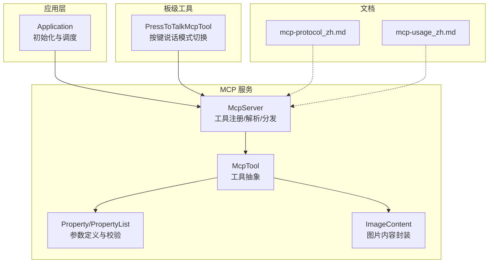
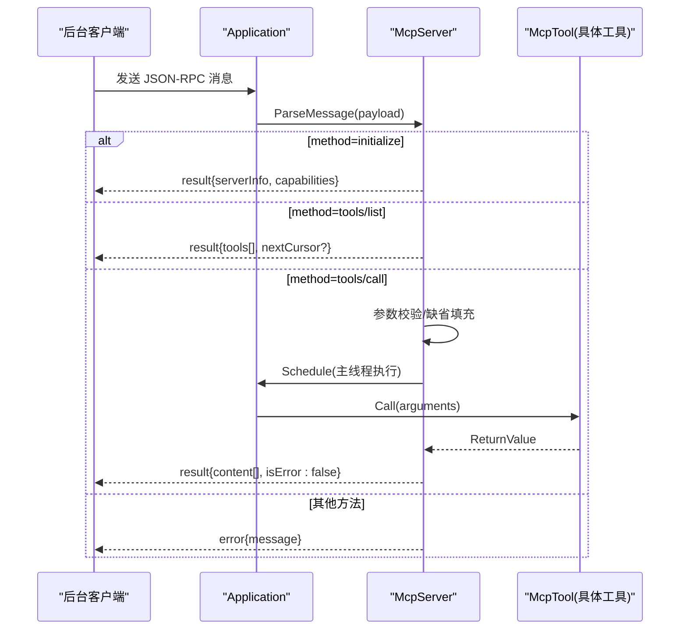
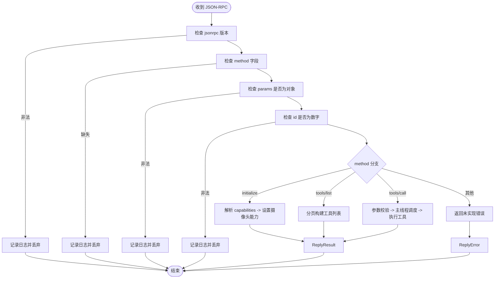
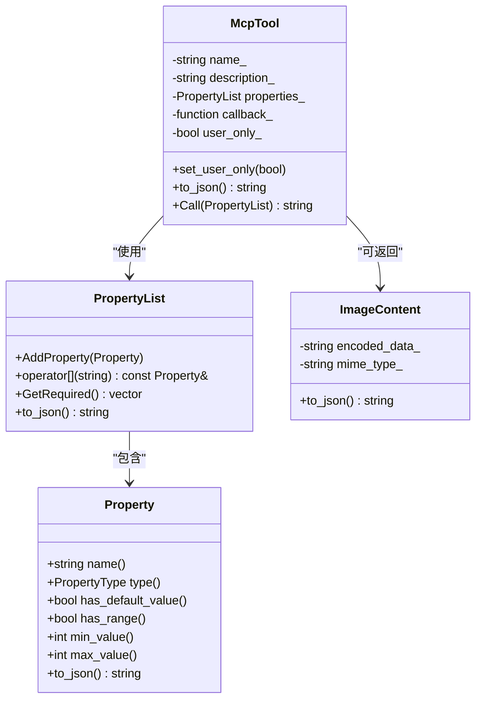
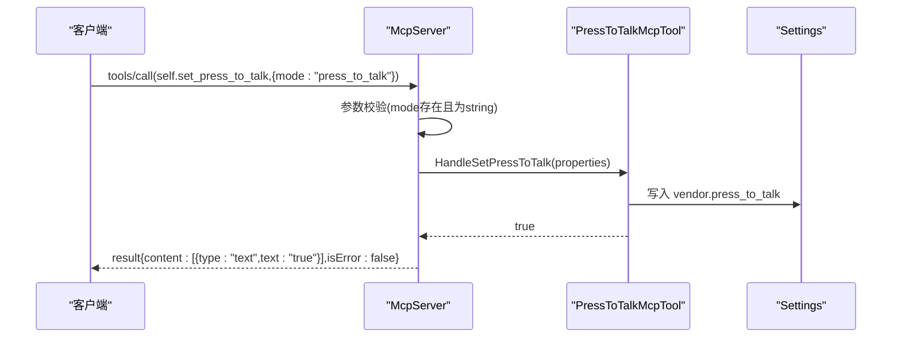
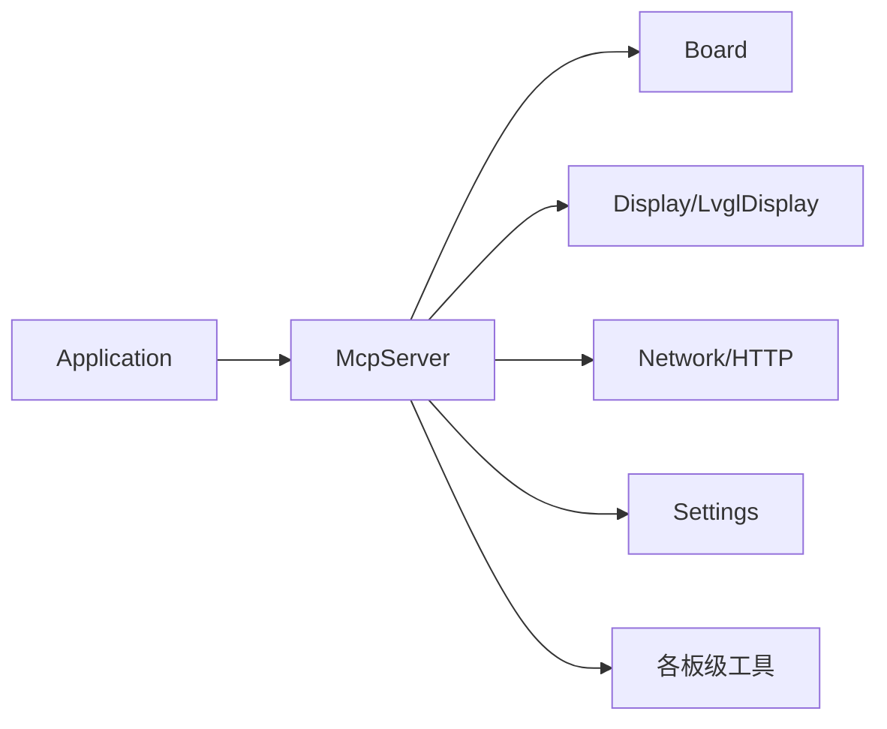

# MCP设备控制API

<cite>
**本文引用的文件**   
- [mcp_server.h](file://main/mcp_server.h)
- [mcp_server.cc](file://main/mcp_server.cc)
- [press_to_talk_mcp_tool.h](file://main/boards/common/press_to_talk_mcp_tool.h)
- [press_to_talk_mcp_tool.cc](file://main/boards/common/press_to_talk_mcp_tool.cc)
- [application.cc](file://main/application.cc)
- [compact_wifi_board.cc](file://main/boards/bread-compact-wifi/compact_wifi_board.cc)
- [mcp-protocol_zh.md](file://docs/mcp-protocol_zh.md)
- [mcp-usage_zh.md](file://docs/mcp-usage_zh.md)
</cite>

## 目录
1. [简介](#简介)
2. [项目结构](#项目结构)
3. [核心组件](#核心组件)
4. [架构总览](#架构总览)
5. [详细组件分析](#详细组件分析)
6. [依赖关系分析](#依赖关系分析)
7. [性能与并发](#性能与并发)
8. [错误处理与参数校验](#错误处理与参数校验)
9. [工具权限管理](#工具权限管理)
10. [内置工具接口规范](#内置工具接口规范)
11. [自定义工具开发指南](#自定义工具开发指南)
12. [故障排查](#故障排查)
13. [结论](#结论)

## 简介
本文件为 MCP（Model Context Protocol）设备控制系统的完整 API 文档，聚焦于：
- McpServer 的工具注册、调用与广播机制
- McpTool 基类设计与扩展方式
- 内置工具的接口规范与使用示例（含 PressToTalk 工具）
- MCP 消息格式、参数校验与错误响应
- 工具权限、并发控制与性能监控建议

## 项目结构
MCP 相关实现集中在 main 目录下，协议说明位于 docs。PressToTalk 工具作为通用板级工具提供。

图表来源
- [mcp_server.h:16-312](file://main/mcp_server.h#L16-L312)
- [mcp_server.cc:33-126](file://main/mcp_server.cc#L33-L126)
- [press_to_talk_mcp_tool.cc:10-29](file://main/boards/common/press_to_talk_mcp_tool.cc#L10-L29)
- [mcp-protocol_zh.md:1-270](file://docs/mcp-protocol_zh.md#L1-L270)
- [mcp-usage_zh.md:1-115](file://docs/mcp-usage_zh.md#L1-L115)

章节来源
- [mcp_server.h:16-312](file://main/mcp_server.h#L16-L312)
- [mcp_server.cc:33-126](file://main/mcp_server.cc#L33-L126)
- [press_to_talk_mcp_tool.cc:10-29](file://main/boards/common/press_to_talk_mcp_tool.cc#L10-L29)
- [mcp-protocol_zh.md:1-270](file://docs/mcp-protocol_zh.md#L1-L270)
- [mcp-usage_zh.md:1-115](file://docs/mcp-usage_zh.md#L1-L115)

## 核心组件
- McpServer：单例服务，负责工具注册、JSON-RPC 请求解析、分页列出工具、参数校验、主线程调度执行与结果/错误回写。
- McpTool：工具抽象，包含名称、描述、输入 Schema、回调函数与“仅用户可见”标记；支持将返回值统一包装为标准 JSON 结构。
- Property/PropertyList：参数类型系统，支持布尔、整数、字符串，具备默认值与范围约束，生成 inputSchema 并参与运行时校验。
- ImageContent：图片内容封装，Base64 编码后以结构化对象输出。

章节来源
- [mcp_server.h:52-206](file://main/mcp_server.h#L52-L206)
- [mcp_server.h:208-312](file://main/mcp_server.h#L208-L312)
- [mcp_server.h:314-342](file://main/mcp_server.h#L314-L342)

## 架构总览
MCP 基于 JSON-RPC 2.0 在基础传输（WebSocket/MQTT）之上承载。设备端通过 McpServer 暴露工具，客户端先 initialize，再 tools/list 发现能力，最后 tools/call 调用。

图表来源
- [mcp_server.cc:350-433](file://main/mcp_server.cc#L350-L433)
- [mcp_server.cc:452-506](file://main/mcp_server.cc#L452-L506)
- [mcp_server.cc:508-560](file://main/mcp_server.cc#L508-L560)
- [mcp-protocol_zh.md:61-195](file://docs/mcp-protocol_zh.md#L61-L195)

## 详细组件分析

### McpServer 类
职责
- 工具注册：AddCommonTools、AddUserOnlyTools、AddTool/AddUserOnlyTool
- 消息解析：ParseMessage(JSON 或字符串)，路由到 initialize/tools/list/tools/call
- 工具列表：GetToolsList 支持分页 cursor 与 withUserTools 过滤
- 工具调用：DoToolCall 完成参数校验、异常捕获、主线程调度与结果封装
- 广播/回复：ReplyResult/ReplyError 通过 Application::SendMcpMessage 发送

关键流程
- 初始化：读取 capabilities.vision.url/token 配置摄像头解释能力
- 工具列表：按最大负载限制裁剪，返回 nextCursor 继续拉取
- 工具调用：严格校验必填参数与类型，缺失则立即返回错误；异常被捕获并转为错误响应

图表来源
- [mcp_server.cc:350-433](file://main/mcp_server.cc#L350-L433)
- [mcp_server.cc:452-506](file://main/mcp_server.cc#L452-L506)
- [mcp_server.cc:508-560](file://main/mcp_server.cc#L508-L560)

章节来源
- [mcp_server.cc:33-126](file://main/mcp_server.cc#L33-L126)
- [mcp_server.cc:128-298](file://main/mcp_server.cc#L128-L298)
- [mcp_server.cc:300-319](file://main/mcp_server.cc#L300-L319)
- [mcp_server.cc:350-433](file://main/mcp_server.cc#L350-L433)
- [mcp_server.cc:452-506](file://main/mcp_server.cc#L452-L506)
- [mcp_server.cc:508-560](file://main/mcp_server.cc#L508-L560)

### McpTool 基类与参数系统
设计要点
- 工具元数据：name、description、inputSchema（由 PropertyList 生成）、user_only 标记
- 参数类型：布尔、整数、字符串；支持默认值与整型范围约束
- 调用封装：Call 将返回值统一包装为 content[] 数组与 isError 标志，支持文本与图片两种内容类型

图表来源
- [mcp_server.h:52-206](file://main/mcp_server.h#L52-L206)
- [mcp_server.h:208-312](file://main/mcp_server.h#L208-L312)
- [mcp_server.h:16-47](file://main/mcp_server.h#L16-L47)

章节来源
- [mcp_server.h:52-206](file://main/mcp_server.h#L52-L206)
- [mcp_server.h:208-312](file://main/mcp_server.h#L208-L312)
- [mcp_server.h:16-47](file://main/mcp_server.h#L16-L47)

### PressToTalk 工具
功能
- 提供 self.set_press_to_talk 工具，用于在“长按说话”和“单击说话”模式间切换
- 状态持久化至 Settings（vendor.press_to_talk），启动时加载

接口
- 名称：self.set_press_to_talk
- 参数：mode（string，取值 press_to_talk 或 click_to_talk）
- 返回：成功返回 true（文本 "true"），失败抛出异常（转换为错误响应）

图表来源
- [press_to_talk_mcp_tool.cc:10-29](file://main/boards/common/press_to_talk_mcp_tool.cc#L10-L29)
- [press_to_talk_mcp_tool.cc:35-57](file://main/boards/common/press_to_talk_mcp_tool.cc#L35-L57)
- [mcp_server.cc:508-560](file://main/mcp_server.cc#L508-L560)

章节来源
- [press_to_talk_mcp_tool.h:8-27](file://main/boards/common/press_to_talk_mcp_tool.h#L8-L27)
- [press_to_talk_mcp_tool.cc:10-57](file://main/boards/common/press_to_talk_mcp_tool.cc#L10-L57)

## 依赖关系分析
- McpServer 依赖 Board、Display、Network、Settings、Application 等子系统以获取硬件能力与网络通道
- 工具注册顺序影响提示缓存命中率：常用工具优先插入
- 工具调用在主线程执行，避免跨任务竞争与资源访问不一致

图表来源
- [mcp_server.cc:33-126](file://main/mcp_server.cc#L33-L126)
- [mcp_server.cc:128-298](file://main/mcp_server.cc#L128-L298)
- [application.cc:96-99](file://main/application.cc#L96-L99)

章节来源
- [mcp_server.cc:33-126](file://main/mcp_server.cc#L33-L126)
- [mcp_server.cc:128-298](file://main/mcp_server.cc#L128-L298)
- [application.cc:96-99](file://main/application.cc#L96-L99)

## 性能与并发
- 工具排序优化：常用工具置于列表前部，提升 prompt cache 命中概率
- 主线程调度：所有工具回调通过 Application::Schedule 在主线程执行，减少锁竞争与上下文切换
- 列表分页：tools/list 按最大负载大小裁剪，返回 nextCursor 分片拉取，避免单次过大响应
- 摄像头截图/预览：涉及网络 I/O 与内存分配，建议在低优先级任务中执行（如相机拍照已降低优先级）

章节来源
- [mcp_server.cc:33-44](file://main/mcp_server.cc#L33-L44)
- [mcp_server.cc:452-506](file://main/mcp_server.cc#L452-L506)
- [mcp_server.cc:550-560](file://main/mcp_server.cc#L550-L560)
- [mcp_server.cc:112-121](file://main/mcp_server.cc#L112-L121)

## 错误处理与参数校验
- 参数校验：
  - 类型匹配：布尔/整数/字符串分别校验
  - 必填项：无默认值的属性必须出现在 arguments 中
  - 范围约束：整型属性支持最小/最大值，越界抛异常
- 错误响应：
  - 参数缺失/类型不合法：直接返回错误
  - 工具回调抛异常：捕获后转为错误响应
  - 未知工具/未实现方法：返回相应错误信息
- 结果封装：
  - 成功：content 数组，元素类型为 text 或 image；isError=false
  - 失败：error.message 携带错误详情

章节来源
- [mcp_server.cc:508-560](file://main/mcp_server.cc#L508-L560)
- [mcp_server.h:272-312](file://main/mcp_server.h#L272-L312)
- [mcp_server.h:79-95](file://main/mcp_server.h#L79-L95)

## 工具权限管理
- 用户专属工具：通过 AddUserOnlyTool 注册，并在 to_json 中添加 annotations.audience=["user"]，tools/list 默认不向 AI 展示
- 过滤策略：tools/list 的 withUserTools 参数控制是否包含用户专属工具
- 典型场景：系统重启、固件升级、屏幕快照上传等敏感操作应设为用户专属

章节来源
- [mcp_server.h:256-262](file://main/mcp_server.h#L256-L262)
- [mcp_server.cc:396-409](file://main/mcp_server.cc#L396-L409)
- [mcp_server.cc:128-170](file://main/mcp_server.cc#L128-L170)

## 内置工具接口规范
以下工具由 McpServer 在启动时自动注册（部分受编译宏与硬件条件影响）。

- self.get_device_status
  - 描述：获取设备实时状态（音频、屏幕、电池、网络等）
  - 参数：无
  - 返回：JSON 对象（设备状态）

- self.audio_speaker.set_volume
  - 描述：设置扬声器音量
  - 参数：volume（integer，0-100）
  - 返回：true（文本 "true"）

- self.screen.set_brightness
  - 描述：设置屏幕亮度
  - 参数：brightness（integer，0-100）
  - 返回：true（文本 "true"）

- self.screen.set_theme
  - 描述：设置主题（light/dark）
  - 参数：theme（string）
  - 返回：true/false

- self.camera.take_photo
  - 描述：拍照并根据问题解释图像
  - 参数：question（string）
  - 返回：JSON 对象（照片信息与解释）

- self.get_system_info
  - 描述：获取系统信息（用户专属）
  - 参数：无
  - 返回：JSON 对象

- self.reboot
  - 描述：重启系统（用户专属）
  - 参数：无
  - 返回：true

- self.upgrade_firmware
  - 描述：从指定 URL 下载并安装固件，完成后重启（用户专属）
  - 参数：url（string）
  - 返回：true

- self.screen.get_info
  - 描述：屏幕信息（宽、高、是否单色）（用户专属）
  - 参数：无
  - 返回：JSON 对象

- self.screen.snapshot
  - 描述：截取屏幕并以 multipart/form-data 上传至指定 URL（用户专属）
  - 参数：url（string），quality（integer，1-100，默认80）
  - 返回：true

- self.screen.preview_image
  - 描述：从 URL 下载图片并在屏幕上预览（用户专属）
  - 参数：url（string）
  - 返回：true

- self.assets.set_download_url
  - 描述：设置资源下载 URL（用户专属）
  - 参数：url（string）
  - 返回：true

- self.set_press_to_talk
  - 描述：切换按键说话模式（press_to_talk / click_to_talk）
  - 参数：mode（string）
  - 返回：true

注意：上述工具的具体行为与可用性取决于硬件与编译选项（例如 LVGL、摄像头、背光等）。

章节来源
- [mcp_server.cc:33-126](file://main/mcp_server.cc#L33-L126)
- [mcp_server.cc:128-298](file://main/mcp_server.cc#L128-L298)
- [press_to_talk_mcp_tool.cc:10-29](file://main/boards/common/press_to_talk_mcp_tool.cc#L10-L29)

## 自定义工具开发指南
步骤
1. 选择注册时机
   - 通用工具：可在板级 InitializeTools 中注册
   - 用户专属工具：使用 AddUserOnlyTool
2. 定义参数
   - 使用 PropertyList 与 Property 声明参数名、类型、默认值与范围
3. 编写回调
   - 回调签名：ReturnValue(const PropertyList&)
   - 返回值支持 bool/int/string/cJSON* 或 ImageContent*
4. 注册工具
   - 使用 AddTool 或 AddUserOnlyTool 注册
5. 测试与验证
   - 通过 tools/list 确认 schema 正确
   - 通过 tools/call 传入参数验证行为与错误路径

参考示例
- 板级工具注册入口：InitializeTools
- 通用工具注册示例：AddTool(...)
- 用户专属工具注册示例：AddUserOnlyTool(...)

章节来源
- [mcp-usage_zh.md:18-59](file://docs/mcp-usage_zh.md#L18-L59)
- [compact_wifi_board.cc:150-165](file://main/boards/bread-compact-wifi/compact_wifi_board.cc#L150-L165)
- [mcp_server.cc:300-319](file://main/mcp_server.cc#L300-L319)

## 故障排查
常见问题
- 参数缺失或类型不匹配：检查 arguments 中的键名与类型是否与 inputSchema 一致
- 未知工具：确认工具名称是否正确，是否在 tools/list 中出现
- 未实现方法：确保 method 为 initialize/tools/list/tools/call
- 工具回调异常：查看日志中的异常信息，定位具体工具逻辑
- 列表过大导致截断：根据 nextCursor 分页拉取

定位手段
- 启用 ESP_LOG 日志，关注 TAG="MCP" 的输出
- 使用 tools/list 的 withUserTools=true 确认用户专属工具是否可用
- 对复杂工具增加更详细的日志输出

章节来源
- [mcp_server.cc:350-433](file://main/mcp_server.cc#L350-L433)
- [mcp_server.cc:508-560](file://main/mcp_server.cc#L508-L560)
- [mcp_server.cc:452-506](file://main/mcp_server.cc#L452-L506)

## 结论
MCP 设备控制系统通过标准化的 JSON-RPC 2.0 接口，实现了灵活、可扩展的设备能力发现与调用。McpServer 提供了完善的工具注册、参数校验、权限控制与错误处理机制；McpTool 与 Property 体系简化了工具开发与维护。结合 PressToTalk 等内置工具，开发者可以快速构建面向物联网的智能设备控制方案。