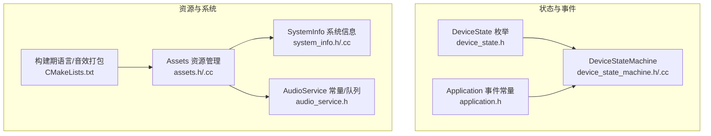
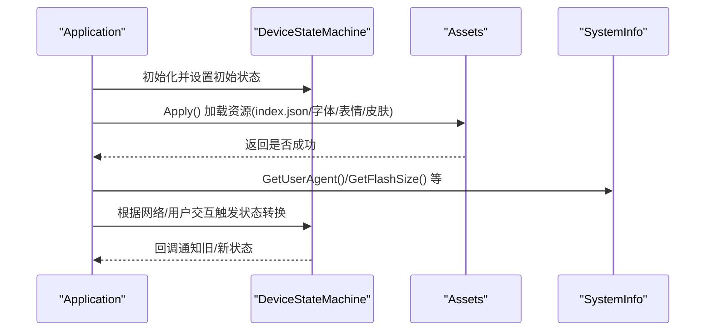
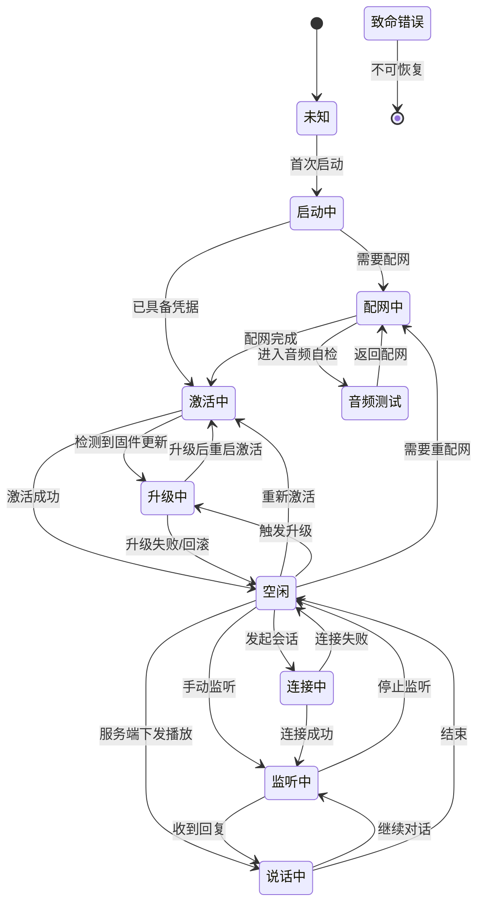
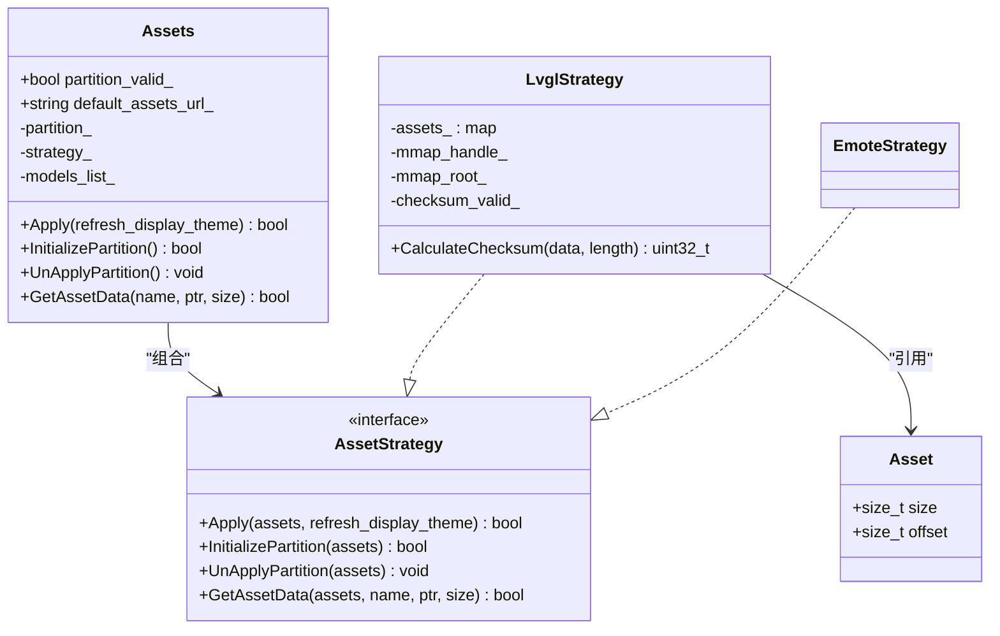
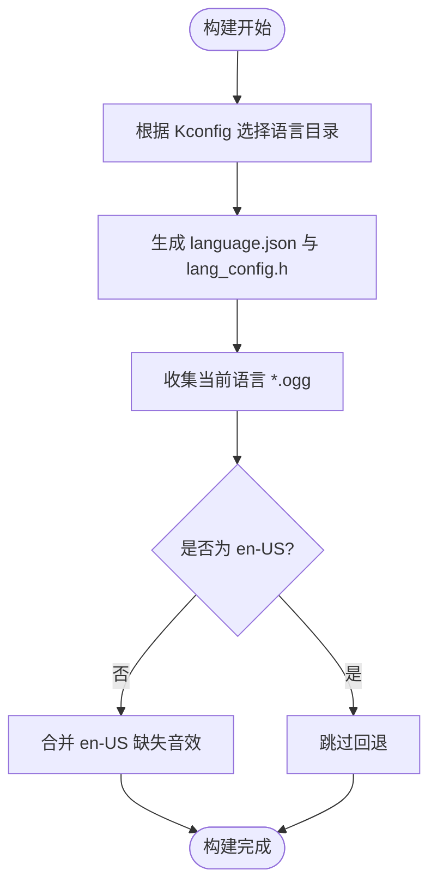
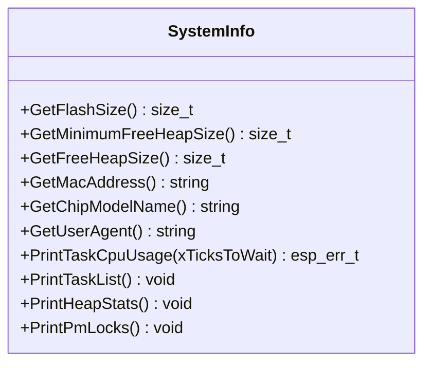
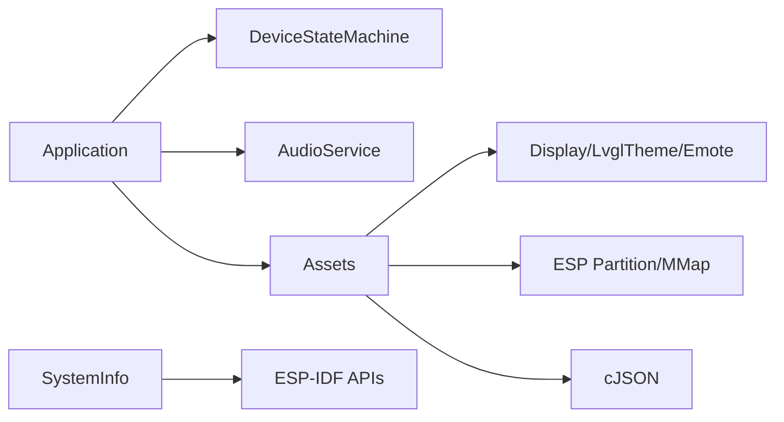

# 数据结构和常量

<cite>
**本文引用的文件**   
- [device_state.h](file://main/device_state.h)
- [device_state_machine.h](file://main/device_state_machine.h)
- [device_state_machine.cc](file://main/device_state_machine.cc)
- [assets.h](file://main/assets.h)
- [assets.cc](file://main/assets.cc)
- [system_info.h](file://main/system_info.h)
- [system_info.cc](file://main/system_info.cc)
- [application.h](file://main/application.h)
- [audio_service.h](file://main/audio\audio_service.h)
- [CMakeLists.txt](file://main/CMakeLists.txt)
</cite>

## 目录
1. [简介](#简介)
2. [项目结构](#项目结构)
3. [核心组件](#核心组件)
4. [架构总览](#架构总览)
5. [详细组件分析](#详细组件分析)
6. [依赖关系分析](#依赖关系分析)
7. [性能与内存特性](#性能与内存特性)
8. [故障排查指南](#故障排查指南)
9. [结论](#结论)
10. [附录：版本兼容与迁移指南](#附录版本兼容与迁移指南)

## 简介
本文件为项目中所有重要数据结构与常量的权威参考，聚焦以下目标：
- 完整记录 DeviceState 枚举的状态值与转换规则
- 深入说明 Assets 资源管理系统的数据结构与加载流程（含语言包、音效文件的组织与回退机制）
- 文档 SystemInfo 系统信息收集的数据模型与方法
- 汇总关键公共常量及其用途
- 提供数据结构版本兼容性与迁移指南，帮助开发者安全演进

## 项目结构
与“数据结构和常量”直接相关的源码主要位于 main 目录下：
- 设备状态机与状态定义：device_state.h, device_state_machine.h/.cc
- 资源管理：assets.h/.cc
- 系统信息：system_info.h/.cc
- 应用事件与音频服务常量：application.h, audio/audio_service.h
- 构建期语言与音效打包策略：main/CMakeLists.txt

图表来源
- [device_state.h:4-16](file://main/device_state.h#L4-L16)
- [device_state_machine.h:17-81](file://main/device_state_machine.h#L17-L81)
- [device_state_machine.cc:34-102](file://main/device_state_machine.cc#L34-L102)
- [assets.h:23-87](file://main/assets.h#L23-L87)
- [assets.cc:22-28](file://main/assets.cc#L22-L28)
- [system_info.h:9-21](file://main/system_info.h#L9-L21)
- [application.h:21-34](file://main/application.h#L21-L34)
- [audio_service.h:39-46](file://main/audio/audio_service.h#L39-L46)
- [CMakeLists.txt:978-1004](file://main/CMakeLists.txt#L978-L1004)

章节来源
- [device_state.h:4-16](file://main/device_state.h#L4-L16)
- [device_state_machine.h:17-81](file://main/device_state_machine.h#L17-L81)
- [device_state_machine.cc:34-102](file://main/device_state_machine.cc#L34-L102)
- [assets.h:23-87](file://main/assets.h#L23-L87)
- [assets.cc:22-28](file://main/assets.cc#L22-L28)
- [system_info.h:9-21](file://main/system_info.h#L9-L21)
- [application.h:21-34](file://main/application.h#L21-L34)
- [audio_service.h:39-46](file://main/audio/audio_service.h#L39-L46)
- [CMakeLists.txt:978-1004](file://main/CMakeLists.txt#L978-L1004)

## 核心组件
本节对关键数据结构与常量进行概览式说明，后续章节将给出更深入的实现细节与图示。

- DeviceState 与状态机
  - 定义了设备的生命周期状态集合，并通过 DeviceStateMachine 严格约束合法转换路径
- Assets 资源管理
  - 通过策略模式支持 LVGL 主题与表情显示两种资源装载方式
  - 维护 index.json 索引，解析字体、表情集、皮肤配置，并加载语音唤醒模型列表
- SystemInfo 系统信息
  - 提供 Flash 容量、堆栈统计、MAC 地址、芯片型号、User-Agent 等系统级查询接口
- 应用与音频常量
  - Application 主事件位域；AudioService 的帧长、队列深度、定时器与事件标志等

章节来源
- [device_state.h:4-16](file://main/device_state.h#L4-L16)
- [device_state_machine.h:17-81](file://main/device_state_machine.h#L17-L81)
- [assets.h:23-87](file://main/assets.h#L23-L87)
- [system_info.h:9-21](file://main/system_info.h#L9-L21)
- [application.h:21-34](file://main/application.h#L21-L34)
- [audio_service.h:39-46](file://main/audio/audio_service.h#L39-L46)

## 架构总览
资源管理与系统信息在启动与应用运行期间被广泛使用，下图展示其与状态机、应用主循环的关系。

图表来源
- [device_state_machine.h:17-81](file://main/device_state_machine.h#L17-L81)
- [assets.cc:214-358](file://main/assets.cc#L214-L358)
- [system_info.cc:18-57](file://main/system_info.cc#L18-L57)
- [application.h:43-176](file://main/application.h#L43-L176)

## 详细组件分析

### DeviceState 枚举与状态转换规则
- 状态值
  - 未知、启动中、配网中、空闲、连接中、监听中、说话中、升级中、激活中、音频测试、致命错误
- 转换规则要点
  - 仅允许从当前状态按预设规则跳转到下一状态
  - 相同状态视为无操作且允许
  - 致命错误态不可再转移
  - 提供字符串化方法用于日志输出
- 典型路径
  - 启动 -> 配网/激活 -> 空闲 -> 连接/监听/说话 -> 空闲
  - 空闲可进入升级或重新配网
  - 音频测试可与配网互转

图表来源
- [device_state_machine.cc:34-102](file://main/device_state_machine.cc#L34-L102)
- [device_state.h:4-16](file://main/device_state.h#L4-L16)

章节来源
- [device_state.h:4-16](file://main/device_state.h#L4-L16)
- [device_state_machine.h:17-81](file://main/device_state_machine.h#L17-L81)
- [device_state_machine.cc:27-32](file://main/device_state_machine.cc#L27-L32)
- [device_state_machine.cc:34-102](file://main/device_state_machine.cc#L34-L102)

### Assets 资源管理系统
- 设计要点
  - 策略模式：LvglStrategy 与 EmoteStrategy 分别适配 LVGL 主题与表情屏
  - 分区映射：LVGL 模式下通过 mmap 映射 assets 分区，校验头部与文件表
  - 索引驱动：index.json 描述字体、表情集、皮肤、语音模型等
- 核心数据结构
  - Asset：资源项大小与偏移
  - mmap_assets_table：分区内单个资源的元数据（名称、尺寸、宽高等）
  - Assets::AssetStrategy 抽象接口及具体实现
- 加载流程
  - InitializePartition：查找分区、mmap、校验长度与校验和、构建资源表
  - Apply：解析 index.json，加载字体、表情集、皮肤，刷新 UI 主题，必要时设置隐藏副标题
  - LoadSrmodelsFromIndex：读取 srmodels 列表并注册到音频服务
- 下载与写入
  - Download：HTTP 流式下载，按扇区擦写，先写负载后写头，完成后重新初始化分区

图表来源
- [assets.h:18-87](file://main/assets.h#L18-L87)
- [assets.cc:22-28](file://main/assets.cc#L22-L28)
- [assets.cc:121-212](file://main/assets.cc#L121-L212)
- [assets.cc:361-426](file://main/assets.cc#L361-L426)

章节来源
- [assets.h:18-87](file://main/assets.h#L18-L87)
- [assets.cc:44-69](file://main/assets.cc#L44-L69)
- [assets.cc:121-212](file://main/assets.cc#L121-L212)
- [assets.cc:214-358](file://main/assets.cc#L214-L358)
- [assets.cc:361-426](file://main/assets.cc#L361-L426)
- [assets.cc:428-615](file://main/assets.cc#L428-L615)

#### 语言包与音效文件组织格式
- 语言选择
  - 通过 Kconfig 选项选择语言目录，如 zh-CN、en-US 等
- 构建期处理
  - 生成 language.json 与 lang_config.h
  - 自动收集当前语言的 *.ogg 音效文件
  - 若当前语言非 en-US，则把缺失的音效回退到 en-US 的同名文件
- 运行时使用
  - 应用层通过音效文件名播放对应 OGG 文件（由 Assets 提供数据访问）

图表来源
- [CMakeLists.txt:978-1004](file://main/CMakeLists.txt#L978-L1004)

章节来源
- [CMakeLists.txt:978-1004](file://main/CMakeLists.txt#L978-L1004)

### SystemInfo 系统信息收集
- 能力清单
  - Flash 容量、最小空闲堆、当前空闲堆
  - MAC 地址（区分以太网/WiFi/P4 平台差异）
  - 芯片型号、User-Agent（包含板卡名与固件版本）
  - 任务 CPU 占用打印、任务列表、堆统计、PM 锁打印
- 数据模型
  - 以静态方法暴露，返回值类型清晰，便于上层统一采集与上报

图表来源
- [system_info.h:9-21](file://main/system_info.h#L9-L21)
- [system_info.cc:18-57](file://main/system_info.cc#L18-L57)

章节来源
- [system_info.h:9-21](file://main/system_info.h#L9-L21)
- [system_info.cc:18-57](file://main/system_info.cc#L18-L57)

### 公共常量与用途
- 应用事件位域（Application）
  - 调度、发送音频、唤醒词检测、VAD 变化、错误、激活完成、时钟滴答、网络连通/断开、聊天切换、开始/停止监听、状态变更等
- 音频服务常量（AudioService）
  - OPUS 帧时长、编解码队列最大任务数、解码/发送队列最大包数、音频测试最大时长、时间戳队列上限
  - 电源超时与检查间隔
  - 事件标志：音频测试运行、唤醒词运行、音频处理器运行、播放队列非空
  - 宏：OPUS 帧时长枚举映射、编码器默认配置

章节来源
- [application.h:21-34](file://main/application.h#L21-L34)
- [audio_service.h:39-76](file://main/audio/audio_service.h#L39-L76)

## 依赖关系分析
- 模块耦合
  - Assets 依赖 Board/Display/LvglTheme/Emote 子系统，负责资源装配与主题刷新
  - SystemInfo 依赖 ESP-IDF 系统 API，提供底层信息查询
  - Application 持有 DeviceStateMachine，驱动状态流转并协调 AudioService
- 外部依赖
  - cJSON 解析 index.json
  - ESP 分区与 SPI Flash mmap
  - FreeRTOS 任务/事件组/定时器

图表来源
- [assets.cc:214-358](file://main/assets.cc#L214-L358)
- [system_info.cc:18-57](file://main/system_info.cc#L18-L57)
- [application.h:43-176](file://main/application.h#L43-L176)

章节来源
- [assets.cc:214-358](file://main/assets.cc#L214-L358)
- [system_info.cc:18-57](file://main/system_info.cc#L18-L57)
- [application.h:43-176](file://main/application.h#L43-L176)

## 性能与内存特性
- Assets(LVGL)
  - 使用 mmap 零拷贝访问资源，降低 RAM 占用
  - 初始化时计算校验和，确保资源完整性
  - 下载过程按扇区擦写，避免一次性大缓冲
- AudioService
  - 双队列（解码/发送）+ 固定帧长，控制内存峰值
  - 事件组驱动任务间同步，减少忙轮询
- SystemInfo
  - 获取堆/任务统计为只读查询，开销可控

[本节为通用性能讨论，不直接分析具体文件]

## 故障排查指南
- 资源分区未找到或校验失败
  - 现象：初始化失败、无法获取 index.json 或资源
  - 定位：查看分区查找与 mmap 结果、校验和比对日志
- 资源版本不支持
  - 现象：提示 assets version 不受支持
  - 处理：升级固件或回退资源包版本
- 下载中断或大小不一致
  - 现象：下载完成但大小不匹配
  - 处理：检查网络稳定性与分区剩余空间
- 状态非法转换
  - 现象：日志提示无效状态转换
  - 处理：检查调用方状态机入口逻辑，遵循转换图

章节来源
- [assets.cc:130-185](file://main/assets.cc#L130-L185)
- [assets.cc:214-236](file://main/assets.cc#L214-L236)
- [assets.cc:428-615](file://main/assets.cc#L428-L615)
- [device_state_machine.cc:108-131](file://main/device_state_machine.cc#L108-L131)

## 结论
- DeviceState 与状态机提供了明确的生命周期与转换边界，有助于稳定控制复杂交互
- Assets 采用策略与索引驱动，兼顾多端显示与可扩展性，配合构建期语言/音效回退策略提升国际化体验
- SystemInfo 提供统一的系统信息采集接口，便于诊断与上报
- 合理运用应用与音频常量，可在保证实时性的同时优化内存占用

[本节为总结性内容，不直接分析具体文件]

## 附录：版本兼容与迁移指南
- Assets 版本兼容
  - index.json 中包含 version 字段，当前固件仅支持特定版本范围；超出范围需升级固件
  - 建议：新增字段时保持向后兼容，并在构建脚本中声明最低固件要求
- 资源分区布局
  - LVGL 模式：分区头部包含文件数量、校验和、长度；随后为资源表与数据段
  - 迁移注意：修改布局时需同步更新校验与解析逻辑
- 语言与音效
  - 新增语言目录需补充 language.json 与必要音效；缺失音效将回退至 en-US
  - 迁移建议：优先完善本地化覆盖，逐步替换 en-US 回退资源
- 状态机扩展
  - 新增状态需在转换表中显式添加合法路径，并提供字符串化支持
  - 迁移建议：在状态变更回调中增加幂等保护，避免重复动作

章节来源
- [assets.cc:214-236](file://main/assets.cc#L214-L236)
- [assets.cc:130-185](file://main/assets.cc#L130-L185)
- [CMakeLists.txt:978-1004](file://main/CMakeLists.txt#L978-L1004)
- [device_state_machine.cc:34-102](file://main/device_state_machine.cc#L34-L102)