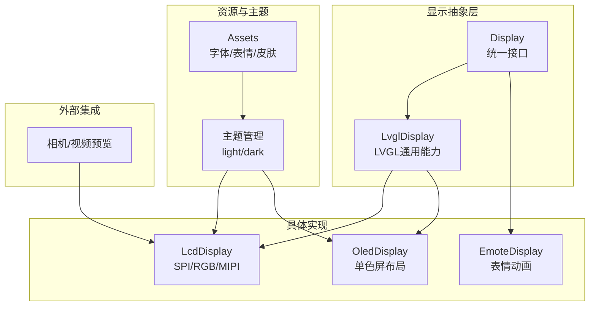
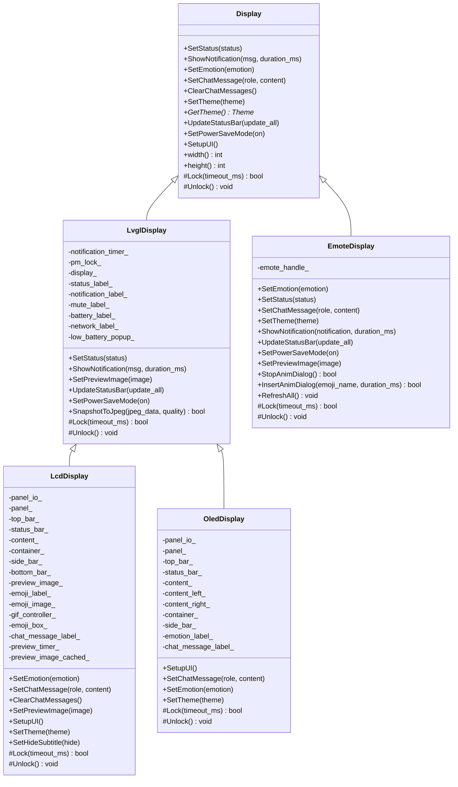
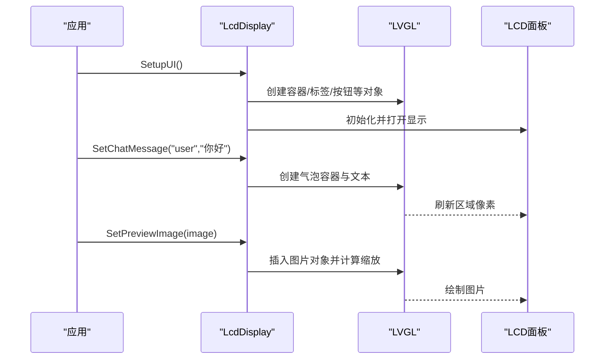
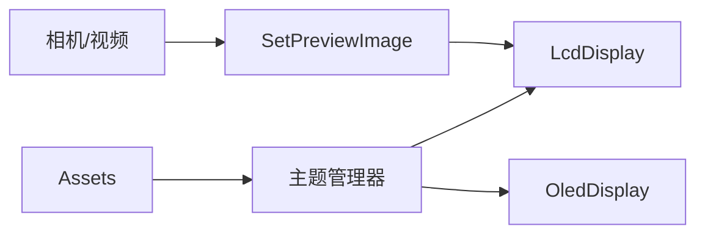

# 显示系统API

<cite>
**本文引用的文件**   
- [display.h](file://main/display/display.h)
- [display.cc](file://main/display/display.cc)
- [lvgl_display.h](file://main/display/lvgl_display/lvgl_display.h)
- [lvgl_display.cc](file://main/display/lvgl_display/lvgl_display.cc)
- [lcd_display.h](file://main/display/lcd_display.h)
- [lcd_display.cc](file://main/display/lcd_display.cc)
- [oled_display.h](file://main/display/oled_display.h)
- [oled_display.cc](file://main/display/oled_display.cc)
- [emote_display.h](file://main/display/emote_display.h)
- [emote_display.cc](file://main/display/emote_display.cc)
- [assets.cc](file://main/assets.cc)
- [mcp_server.cc](file://main/mcp_server.cc)
- [esp32_camera.cc](file://main/boards/common/esp32_camera.cc)
- [esp_video.cc](file://main/boards/common/esp_video.cc)
</cite>

## 目录
1. [简介](#简介)
2. [项目结构](#项目结构)
3. [核心组件](#核心组件)
4. [架构总览](#架构总览)
5. [详细组件分析](#详细组件分析)
6. [依赖关系分析](#依赖关系分析)
7. [性能与内存优化](#性能与内存优化)
8. [故障排查指南](#故障排查指南)
9. [结论](#结论)
10. [附录：主题与资源加载](#附录主题与资源加载)

## 简介
本文件为“显示系统”的完整API文档，覆盖以下要点：
- Display基类的设计模式与虚函数接口
- LCD、OLED、表情（Emote）三种显示实现
- LVGL集成接口、UI组件创建与渲染优化方法
- 字体加载、图片显示、动画效果等高级功能
- 主题定制、多分辨率适配与触摸交互的实现指南
- 显示性能分析与内存使用优化建议

## 项目结构
显示子系统位于 main/display 目录下，采用分层与继承的组织方式：
- 抽象层：Display 定义统一接口；LvglDisplay 提供LVGL通用能力
- 具体实现层：LcdDisplay/OledDisplay/EmoteDisplay 分别对应LCD、OLED与表情屏
- 资源与主题：Assets 负责从打包资源中加载字体、表情、皮肤并刷新显示主题
- 外部集成：相机/视频预览通过 LvglDisplay::SetPreviewImage 将图像推送到屏幕

图表来源
- [display.h:28-61](file://main/display/display.h#L28-L61)
- [lvgl_display.h:15-50](file://main/display/lvgl_display/lvgl_display.h#L15-L50)
- [lcd_display.h:17-83](file://main/display/lcd_display.h#L17-L83)
- [oled_display.h:10-39](file://main/display/oled_display.h#L10-L39)
- [emote_display.h:12-40](file://main/display/emote_display.h#L12-L40)
- [assets.cc:214-358](file://main/assets.cc#L214-L358)

章节来源
- [display.h:28-61](file://main/display/display.h#L28-L61)
- [lvgl_display.h:15-50](file://main/display/lvgl_display/lvgl_display.h#L15-L50)
- [lcd_display.h:17-83](file://main/display/lcd_display.h#L17-L83)
- [oled_display.h:10-39](file://main/display/oled_display.h#L10-L39)
- [emote_display.h:12-40](file://main/display/emote_display.h#L12-L40)
- [assets.cc:214-358](file://main/assets.cc#L214-L358)

## 核心组件
- Display 基类
  - 职责：定义统一的显示接口（状态、通知、表情、聊天消息、主题、电源管理等），并提供线程安全的锁守卫
  - 关键接口：SetStatus、ShowNotification、SetEmotion、SetChatMessage、ClearChatMessages、SetTheme、UpdateStatusBar、SetPowerSaveMode、SetupUI
  - 同步机制：Lock/Unlock 由子类实现，DisplayLockGuard 自动RAII加解锁
- LvglDisplay 扩展
  - 职责：在Display基础上增加LVGL相关能力（通知定时器、电量/网络图标更新、截图转JPEG、预览图占位）
  - 关键接口：SetStatus、ShowNotification、UpdateStatusBar、SetPreviewImage、SnapshotToJpeg、SetPowerSaveMode
- LcdDisplay
  - 职责：基于LVGL的彩色LCD实现，支持SPI/RGB/MIPI面板，构建顶部栏、状态栏、聊天区、表情区、预览图等
  - 特性：主题注册与切换、GIF控制器、预览图缓存与定时隐藏、消息气泡样式与滚动
- OledDisplay
  - 职责：针对小尺寸单色屏的LVGL实现，提供128x64与128x32两种布局，简化UI元素
- EmoteDisplay
  - 职责：非LVGL的表情屏驱动，封装表情动画引擎，映射状态/消息到表情事件

章节来源
- [display.h:28-61](file://main/display/display.h#L28-L61)
- [display.cc:23-61](file://main/display/display.cc#L23-L61)
- [lvgl_display.h:15-50](file://main/display/lvgl_display/lvgl_display.h#L15-L50)
- [lvgl_display.cc:72-275](file://main/display/lvgl_display/lvgl_display.cc#L72-L275)
- [lcd_display.h:17-83](file://main/display/lcd_display.h#L17-L83)
- [lcd_display.cc:25-800](file://main/display/lcd_display.cc#L25-L800)
- [oled_display.h:10-39](file://main/display/oled_display.h#L10-L39)
- [oled_display.cc:83-409](file://main/display/oled_display.cc#L83-L409)
- [emote_display.h:12-40](file://main/display/emote_display.h#L12-L40)
- [emote_display.cc:118-250](file://main/display/emote_display.cc#L118-L250)

## 架构总览
显示系统采用“抽象接口 + 平台适配 + 资源主题”的分层架构。上层应用通过Display/LvglDisplay调用显示能力，底层根据硬件选择具体实现。

图表来源
- [display.h:28-61](file://main/display/display.h#L28-L61)
- [lvgl_display.h:15-50](file://main/display/lvgl_display/lvgl_display.h#L15-L50)
- [lcd_display.h:17-83](file://main/display/lcd_display.h#L17-L83)
- [oled_display.h:10-39](file://main/display/oled_display.h#L10-L39)
- [emote_display.h:12-40](file://main/display/emote_display.h#L12-L40)

## 详细组件分析

### Display 基类与锁机制
- 设计要点
  - 所有显示操作需通过 Lock/Unlock 保护，避免多线程访问LVGL对象造成竞态
  - DisplayLockGuard 在构造时尝试获取锁，析构时释放，确保异常安全
- 默认行为
  - 多数虚函数提供空实现或日志输出，便于无屏或调试环境运行
- 主题持久化
  - SetTheme 会将主题名称写入Settings，重启后恢复

章节来源
- [display.h:28-61](file://main/display/display.h#L28-L61)
- [display.cc:23-61](file://main/display/display.cc#L23-L61)

### LvglDisplay 通用能力
- 通知与状态
  - ShowNotification 会临时隐藏状态文本，并在指定时长后恢复
  - UpdateStatusBar 周期性更新静音、电量、网络图标，空闲时显示时间
- 截图导出
  - SnapshotToJpeg 启用LVGL快照功能，将当前屏幕转换为JPEG数据流
- 电源管理
  - SetPowerSaveMode 进入/退出省电模式时切换表情与清空消息

章节来源
- [lvgl_display.cc:72-275](file://main/display/lvgl_display/lvgl_display.cc#L72-L275)

### LcdDisplay（SPI/RGB/MIPI）
- 初始化与LVGL端口
  - SPI/RGB/MIPI三类构造函数分别配置不同的LVGL端口与缓冲区策略
  - RGB路径开启双缓冲与直接模式以提升刷新效率
- UI布局
  - 顶部栏（网络/静音/电池）、状态栏（居中文字/通知）、内容区（聊天气泡）、表情区、底部栏
  - 聊天消息按角色区分气泡颜色与对齐方式，系统消息可折叠合并
- 预览图与GIF
  - SetPreviewImage 将图片放入气泡容器，计算缩放比例以适配屏幕
  - GIF控制器用于动态表情展示
- 主题与字体
  - InitializeLcdThemes 注册 light/dark 主题，设置背景、文本、气泡、边框、低电量颜色及字体
  - 主题切换通过 SetTheme 触发界面重绘

图表来源
- [lcd_display.cc:92-284](file://main/display/lcd_display.cc#L92-L284)
- [lcd_display.cc:354-498](file://main/display/lcd_display.cc#L354-L498)
- [lcd_display.cc:504-698](file://main/display/lcd_display.cc#L504-L698)
- [lcd_display.cc:700-782](file://main/display/lcd_display.cc#L700-L782)

章节来源
- [lcd_display.h:17-83](file://main/display/lcd_display.h#L17-L83)
- [lcd_display.cc:25-800](file://main/display/lcd_display.cc#L25-L800)

### OledDisplay（单色屏）
- 布局策略
  - 128x64：顶部图标栏+居中状态栏+左右分栏（左侧表情、右侧消息）
  - 128x32：左侧表情+右侧纵向信息（状态/通知/图标/消息）
- 文本滚动
  - 长文本使用循环滚动动画提升可读性
- 主题
  - 仅注册 dark 主题，适配单色屏对比度需求

章节来源
- [oled_display.h:10-39](file://main/display/oled_display.h#L10-L39)
- [oled_display.cc:83-409](file://main/display/oled_display.cc#L83-L409)

### EmoteDisplay（表情屏）
- 动画引擎
  - 通过 emote_init 初始化表情引擎，设置帧率、缓冲区大小、回调函数
  - OnFlushCallback 将渲染结果写入LCD面板
- 状态映射
  - SetStatus/SetChatMessage/ShowNotification 将系统状态与消息映射为表情事件
- 控制接口
  - StopAnimDialog/InsertAnimDialog/RefreshAll 提供动画播放控制

章节来源
- [emote_display.h:12-40](file://main/display/emote_display.h#L12-L40)
- [emote_display.cc:118-250](file://main/display/emote_display.cc#L118-L250)

## 依赖关系分析
- 组件耦合
  - LcdDisplay/OledDisplay 强依赖 LVGL 与 esp_lcd_port
  - EmoteDisplay 弱依赖LVGL，主要依赖表情引擎与面板驱动
- 资源与主题
  - Assets 解析 index.json，动态注入字体、表情集合、皮肤背景图，并触发显示主题刷新
- 外部集成
  - 相机/视频预览通过 LvglDisplay::SetPreviewImage 推送图像至屏幕

图表来源
- [assets.cc:214-358](file://main/assets.cc#L214-L358)
- [esp32_camera.cc:90-117](file://main/boards/common/esp32_camera.cc#L90-L117)
- [esp_video.cc:731-760](file://main/boards/common/esp_video.cc#L731-L760)

章节来源
- [assets.cc:214-358](file://main/assets.cc#L214-L358)
- [esp32_camera.cc:90-117](file://main/boards/common/esp32_camera.cc#L90-L117)
- [esp_video.cc:731-760](file://main/boards/common/esp_video.cc#L731-L760)

## 性能与内存优化
- LVGL端口与缓冲区
  - SPI路径：单缓冲，buffer_size=宽度×行数（如20行），适合带宽受限场景
  - RGB路径：双缓冲+直接模式，减少撕裂，提高刷新率
  - MIPI路径：软件旋转开关，按需调整
- 图像缓存
  - PSRAM可用时启用LVGL图像缓存（2MB或512KB），加速PNG解码与重复显示
- 内存分配
  - 预览图优先使用PSRAM分配，降低主存压力
  - 截图转JPEG采用回调式编码器，避免一次性大内存块
- 刷新策略
  - 状态栏每10秒更新一次网络图标，避免频繁I/O
  - 低电量弹窗仅在时钟tick事件中检查，减少不必要的UI更新

章节来源
- [lcd_display.cc:116-284](file://main/display/lcd_display.cc#L116-L284)
- [lvgl_display.cc:113-219](file://main/display/lvgl_display/lvgl_display.cc#L113-L219)
- [lvgl_display.cc:234-275](file://main/display/lvgl_display/lvgl_display.cc#L234-L275)
- [esp32_camera.cc:90-117](file://main/boards/common/esp32_camera.cc#L90-L117)

## 故障排查指南
- 常见问题
  - 未调用SetupUI即更新状态/消息：会记录警告日志并丢弃更新
  - 主题未生效：确认主题已注册且当前设备支持该主题
  - 预览图不显示：检查图像尺寸是否为0，或内存分配是否失败
  - 低电量提示不出现：确认电量读取成功且处于放电状态
- 定位手段
  - 查看ESP_LOG日志输出，关注“Display”、“LcdDisplay”、“OledDisplay”、“EmoteDisplay”标签
  - 使用 SnapshotToJpeg 导出当前屏幕，验证UI树是否正确
  - 通过MCP工具切换主题，验证主题切换流程

章节来源
- [lvgl_display.cc:72-111](file://main/display/lvgl_display/lvgl_display.cc#L72-L111)
- [lcd_display.cc:354-362](file://main/display/lcd_display.cc#L354-L362)
- [lcd_display.cc:504-514](file://main/display/lcd_display.cc#L504-L514)
- [lvgl_display.cc:234-275](file://main/display/lvgl_display/lvgl_display.cc#L234-L275)

## 结论
显示系统通过清晰的抽象与分层，实现了多类型屏幕的统一接入与高效渲染。LVGL作为图形后端，结合主题系统与资源加载机制，提供了良好的可扩展性与用户体验。针对不同硬件（SPI/RGB/MIPI/OLED/表情屏）的差异化实现，兼顾了性能与功耗。

## 附录：主题与资源加载
- 主题注册与切换
  - LcdDisplay 初始化时注册 light/dark 主题，设置背景、文本、气泡、边框、低电量颜色与字体
  - OledDisplay 仅注册 dark 主题，适配单色屏
  - 运行时可通过 MCP 工具调用 self.screen.set_theme 切换主题
- 资源加载
  - Assets 解析 index.json，加载 text_font、emoji_collection、skin（含背景图）
  - 刷新主题时，若检测到 hide_subtitle 配置，则控制LCD隐藏字幕
- 自定义主题
  - 通过 LvglThemeManager 注册新主题，设置颜色与字体，再调用 Display::SetTheme 应用

章节来源
- [lcd_display.cc:25-63](file://main/display/lcd_display.cc#L25-L63)
- [oled_display.cc:26-37](file://main/display/oled_display.cc#L26-L37)
- [mcp_server.cc:80-98](file://main/mcp_server.cc#L80-L98)
- [assets.cc:214-358](file://main/assets.cc#L214-L358)