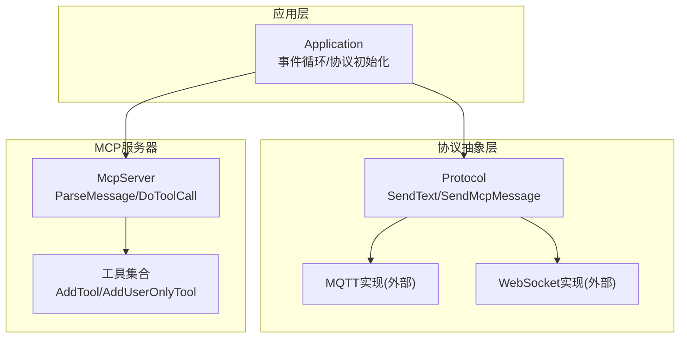
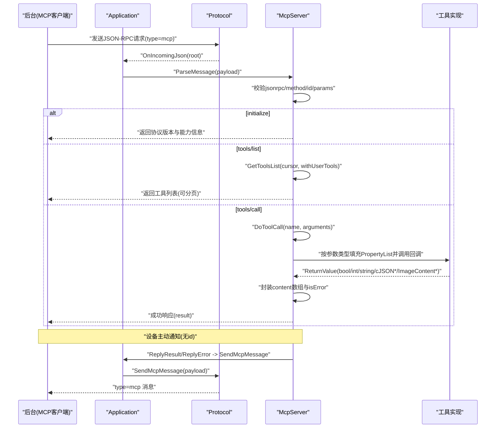
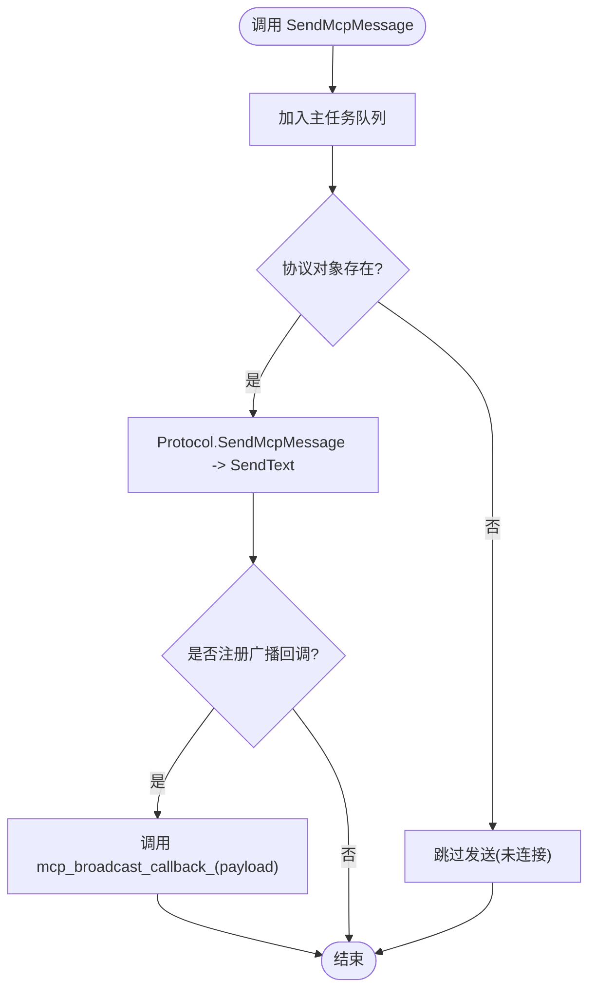
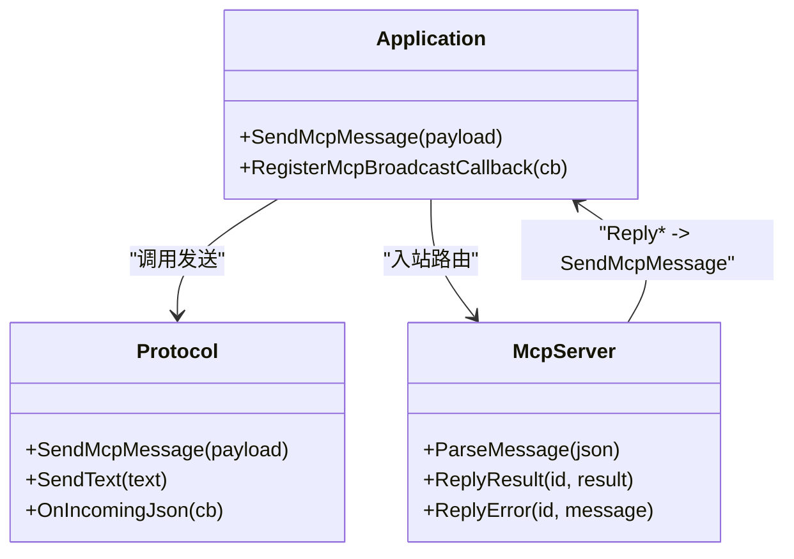
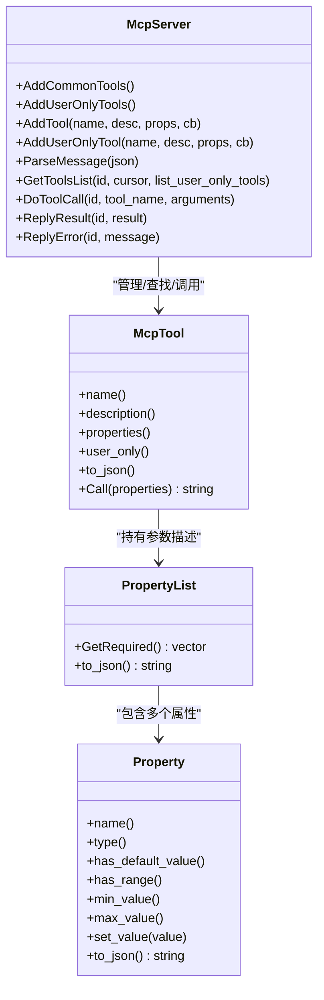
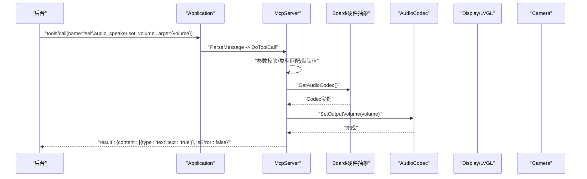
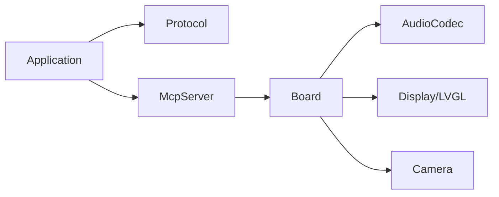

# MCP通信API

<cite>
**本文引用的文件**   
- [mcp_server.h](file://main/mcp_server.h)
- [mcp_server.cc](file://main/mcp_server.cc)
- [application.h](file://main/application.h)
- [application.cc](file://main/application.cc)
- [protocol.h](file://main/protocols/protocol.h)
- [protocol.cc](file://main/protocols/protocol.cc)
- [mcp-protocol_zh.md](file://docs/mcp-protocol_zh.md)
- [press_to_talk_mcp_tool.h](file://main/boards/common/press_to_talk_mcp_tool.h)
</cite>

## 目录
1. [简介](#简介)
2. [项目结构](#项目结构)
3. [核心组件](#核心组件)
4. [架构总览](#架构总览)
5. [详细组件分析](#详细组件分析)
6. [依赖关系分析](#依赖关系分析)
7. [性能与资源特性](#性能与资源特性)
8. [故障排查指南](#故障排查指南)
9. [结论](#结论)
10. [附录：使用示例与最佳实践](#附录使用示例与最佳实践)

## 简介
本文件面向在ESP32设备上实现MCP（Model Context Protocol）通信的开发者，聚焦以下目标：
- 深入记录 SendMcpMessage() 消息发送方法与 RegisterMcpBroadcastCallback() 广播回调注册机制
- 详细说明MCP协议的消息格式、传输机制与错误处理策略
- 解释从LLM请求到硬件执行的端到端工具调用流程
- 说明MCP协议的版本兼容性、消息序列化与反序列化过程
- 提供自定义工具注册与调用的实际使用示例

## 项目结构
MCP相关代码主要分布在应用层、协议抽象层与MCP服务器模块中：
- 应用层：Application 负责事件循环、协议初始化、MCP消息路由与发送
- 协议抽象层：Protocol 定义统一的文本消息发送接口，具体由MQTT/WebSocket实现
- MCP服务器：McpServer 负责解析JSON-RPC请求、工具发现与执行、结果封装与返回

图表来源
- [application.cc:473-610](file://main/application.cc#L473-L610)
- [protocol.cc:75-79](file://main/protocols/protocol.cc#L75-L79)
- [mcp_server.cc:350-433](file://main/mcp_server.cc#L350-L433)

章节来源
- [application.cc:473-610](file://main/application.cc#L473-L610)
- [protocol.cc:75-79](file://main/protocols/protocol.cc#L75-L79)
- [mcp_server.cc:350-433](file://main/mcp_server.cc#L350-L433)

## 核心组件
- Application::SendMcpMessage(payload)
  - 将JSON-RPC负载包装为“type=mcp”的顶层消息并通过底层协议发送
  - 同时触发本地广播回调（若已注册），便于UI或调试模块监听
- Application::RegisterMcpBroadcastCallback(callback)
  - 注册一个接收所有MCP出站消息的回调，用于日志、审计或本地显示
- McpServer
  - 解析JSON-RPC请求（initialize/tools/list/tools/call等）
  - 维护工具列表，支持分页与用户可见性控制
  - 调度工具执行并封装标准响应
- Protocol::SendMcpMessage(payload)
  - 将payload封装为包含session_id/type/payload的标准消息体，再调用SendText进行传输

章节来源
- [application.h:110-113](file://main/application.h#L110-L113)
- [application.cc:1074-1088](file://main/application.cc#L1074-L1088)
- [protocol.h:74-75](file://main/protocols/protocol.h#L74-L75)
- [protocol.cc:75-79](file://main/protocols/protocol.cc#L75-L79)
- [mcp_server.h:314-342](file://main/mcp_server.h#L314-L342)
- [mcp_server.cc:350-433](file://main/mcp_server.cc#L350-L433)

## 架构总览
下图展示从后台发起MCP请求到设备侧执行工具的完整链路，以及设备主动通知的路径。

图表来源
- [application.cc:521-607](file://main/application.cc#L521-L607)
- [mcp_server.cc:350-433](file://main/mcp_server.cc#L350-L433)
- [mcp_server.cc:435-450](file://main/mcp_server.cc#L435-L450)
- [protocol.cc:75-79](file://main/protocols/protocol.cc#L75-L79)

## 详细组件分析

### 组件A：MCP消息发送与广播（Application）
- SendMcpMessage(payload)
  - 线程安全：通过主任务Schedule执行，确保与协议栈交互安全
  - 发送路径：Application -> Protocol::SendMcpMessage -> SendText -> 底层传输
  - 广播路径：若已注册回调，则在同一主任务上下文中触发，便于UI/日志同步更新
- RegisterMcpBroadcastCallback(callback)
  - 设置全局回调函数指针，供SendMcpMessage在发送后统一分发

图表来源
- [application.cc:1074-1088](file://main/application.cc#L1074-L1088)
- [protocol.cc:75-79](file://main/protocols/protocol.cc#L75-L79)

章节来源
- [application.h:110-113](file://main/application.h#L110-L113)
- [application.cc:1074-1088](file://main/application.cc#L1074-L1088)
- [protocol.cc:75-79](file://main/protocols/protocol.cc#L75-L79)

### 组件B：MCP协议消息格式与传输（Protocol）
- 消息封装
  - 外层：{ session_id, type:"mcp", payload }
  - 内层：JSON-RPC 2.0 负载 { jsonrpc, method, params, id/result/error }
- 传输机制
  - 通过Protocol::SendText经由MQTT或WebSocket发送
  - 入站消息经OnIncomingJson回调进入Application，再路由至McpServer

图表来源
- [protocol.h:74-75](file://main/protocols/protocol.h#L74-L75)
- [protocol.cc:75-79](file://main/protocols/protocol.cc#L75-L79)
- [application.cc:521-607](file://main/application.cc#L521-L607)
- [mcp_server.cc:435-450](file://main/mcp_server.cc#L435-L450)

章节来源
- [protocol.h:74-75](file://main/protocols/protocol.h#L74-L75)
- [protocol.cc:75-79](file://main/protocols/protocol.cc#L75-L79)
- [application.cc:521-607](file://main/application.cc#L521-L607)

### 组件C：MCP服务器与工具系统（McpServer）
- 方法解析
  - initialize：返回协议版本与服务器信息；解析capabilities（如vision.url/token）
  - tools/list：支持cursor分页与withUserTools开关
  - tools/call：参数校验、类型匹配、默认值处理、异常捕获
- 工具注册
  - AddTool / AddUserOnlyTool：声明式注册，支持布尔/整数/字符串参数及范围约束
  - 工具返回值：bool/int/string/cJSON*/ImageContent*，统一封装为content数组
- 错误处理
  - 缺失字段/非法类型/未知工具/超出范围等，均返回JSON-RPC error

图表来源
- [mcp_server.h:208-342](file://main/mcp_server.h#L208-L342)
- [mcp_server.cc:300-319](file://main/mcp_server.cc#L300-L319)
- [mcp_server.cc:350-433](file://main/mcp_server.cc#L350-L433)
- [mcp_server.cc:452-506](file://main/mcp_server.cc#L452-L506)
- [mcp_server.cc:508-560](file://main/mcp_server.cc#L508-L560)

章节来源
- [mcp_server.h:208-342](file://main/mcp_server.h#L208-L342)
- [mcp_server.cc:300-319](file://main/mcp_server.cc#L300-L319)
- [mcp_server.cc:350-433](file://main/mcp_server.cc#L350-L433)
- [mcp_server.cc:452-506](file://main/mcp_server.cc#L452-L506)
- [mcp_server.cc:508-560](file://main/mcp_server.cc#L508-L560)

### 组件D：端到端工具调用流程（LLM请求到硬件执行）
- 入口：后台通过tools/call发起调用
- 解析：McpServer校验并构造PropertyList
- 执行：在主任务上下文调用工具回调，访问Board/AudioCodec/Display/Camera等硬件抽象
- 返回：统一封装为content数组，isError=false；异常则返回error

图表来源
- [mcp_server.cc:508-560](file://main/mcp_server.cc#L508-L560)
- [mcp_server.cc:55-64](file://main/mcp_server.cc#L55-L64)

章节来源
- [mcp_server.cc:508-560](file://main/mcp_server.cc#L508-L560)
- [mcp_server.cc:55-64](file://main/mcp_server.cc#L55-L64)

## 依赖关系分析
- Application依赖Protocol进行网络收发，并在收到type=mcp时交由McpServer处理
- McpServer依赖Board及其子系统（AudioCodec、Backlight、Display、Camera）实现工具逻辑
- 工具注册采用组合模式，避免强耦合；通过PropertyList/Property描述输入Schema，便于前端/LLM理解

图表来源
- [application.cc:473-610](file://main/application.cc#L473-L610)
- [mcp_server.cc:33-126](file://main/mcp_server.cc#L33-L126)

章节来源
- [application.cc:473-610](file://main/application.cc#L473-L610)
- [mcp_server.cc:33-126](file://main/mcp_server.cc#L33-L126)

## 性能与资源特性
- 常用工具前置：AddCommonTools将高频工具置于列表前部，利于提示缓存命中，降低首字延迟
- 工具调用在主任务执行：避免并发竞争，保证UI/音频/网络状态一致性
- 工具列表分页：防止单次响应过大导致传输失败；nextCursor驱动分页拉取
- 图像内容：ImageContent内部Base64编码，适合JSON传输但体积较大，建议仅在必要时使用

章节来源
- [mcp_server.cc:33-44](file://main/mcp_server.cc#L33-L44)
- [mcp_server.cc:452-506](file://main/mcp_server.cc#L452-L506)
- [mcp_server.h:16-47](file://main/mcp_server.h#L16-L47)

## 故障排查指南
- JSON-RPC校验失败
  - 现象：缺少method/id/params或jsonrpc非2.0
  - 定位：查看McpServer::ParseMessage中的校验分支与日志
- 参数不合法或缺失
  - 现象：tools/call返回Missing valid argument或越界异常
  - 定位：检查Property范围与默认值设置，确认arguments键名与类型
- 未知工具
  - 现象：Unknown tool
  - 定位：确认工具名称唯一且已注册（注意用户可见性开关）
- 发送失败
  - 现象：SendMcpMessage未发出
  - 定位：检查协议对象是否初始化、网络连接状态；确认RegisterMcpBroadcastCallback是否被覆盖
- 超时与断线
  - 现象：通道超时或断开
  - 定位：Protocol::IsTimeout检测；结合网络事件回调处理重连与状态恢复

章节来源
- [mcp_server.cc:350-433](file://main/mcp_server.cc#L350-L433)
- [mcp_server.cc:508-560](file://main/mcp_server.cc#L508-L560)
- [protocol.cc:81-90](file://main/protocols/protocol.cc#L81-L90)
- [application.cc:1074-1088](file://main/application.cc#L1074-L1088)

## 结论
MCP在本项目中以JSON-RPC 2.0为核心，依托Application与Protocol完成消息路由与传输，McpServer提供工具发现与执行能力。SendMcpMessage与RegisterMcpBroadcastCallback为设备侧主动通知与本地观测提供了统一出口。通过清晰的Schema描述与分页机制，系统在资源受限环境下仍能提供稳定高效的工具调用体验。

## 附录：使用示例与最佳实践

### 协议版本与兼容性
- 服务端返回的协议版本固定为“2024-11-05”，客户端应据此判断能力集
- 工具列表支持withUserTools参数，区分AI可见与仅用户可见的工具

章节来源
- [mcp_server.cc:391-395](file://main/mcp_server.cc#L391-L395)
- [mcp-protocol_zh.md:89-106](file://docs/mcp-protocol_zh.md#L89-L106)

### 消息序列化与反序列化
- 入站：Protocol.OnIncomingJson -> Application -> McpServer.ParseMessage
- 出站：McpServer.ReplyResult/ReplyError -> Application.SendMcpMessage -> Protocol.SendMcpMessage -> SendText

章节来源
- [application.cc:521-607](file://main/application.cc#L521-L607)
- [mcp_server.cc:435-450](file://main/mcp_server.cc#L435-L450)
- [protocol.cc:75-79](file://main/protocols/protocol.cc#L75-L79)

### 自定义工具注册与调用示例
- 注册方式
  - 使用McpServer::AddTool或AddUserOnlyTool声明工具名称、描述、参数Schema与回调
  - 推荐命名风格：模块.功能（如 self.dog.forward）
- 参数类型
  - 支持布尔、整数、字符串；整数可配置最小/最大值与默认值
- 返回值
  - bool/int/string/cJSON*（将被序列化为文本）/ImageContent*（图片内容）
- 参考示例
  - 按键说话模式工具类：PressToTalkMcpTool（封装状态持久化与MCP回调）

章节来源
- [mcp-usage_zh.md:18-59](file://docs/mcp-usage_zh.md#L18-L59)
- [press_to_talk_mcp_tool.h:1-29](file://main/boards/common/press_to_talk_mcp_tool.h#L1-L29)
- [mcp_server.h:58-206](file://main/mcp_server.h#L58-L206)
- [mcp_server.cc:300-319](file://main/mcp_server.cc#L300-L319)

### 典型调用序列（tools/call）
- 步骤
  - 获取工具列表（tools/list，必要时分页）
  - 调用工具（tools/call，携带name与arguments）
  - 处理成功/失败响应（result.content数组与isError，或error.message）
- 注意事项
  - 参数键名需与Schema一致
  - 整数参数需在范围内
  - 用户可见工具需显式开启withUserTools

章节来源
- [mcp-protocol_zh.md:108-195](file://docs/mcp-protocol_zh.md#L108-L195)
- [mcp_server.cc:452-506](file://main/mcp_server.cc#L452-L506)
- [mcp_server.cc:508-560](file://main/mcp_server.cc#L508-L560)