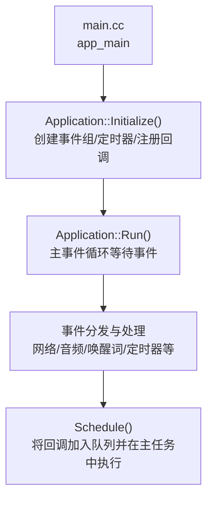
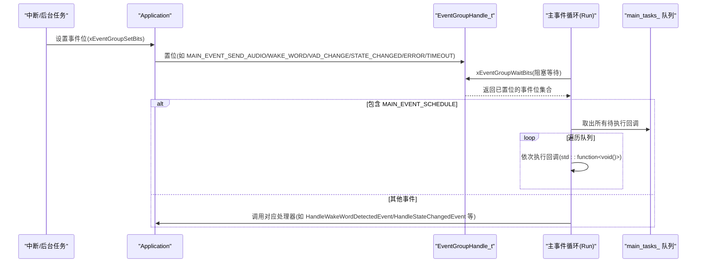
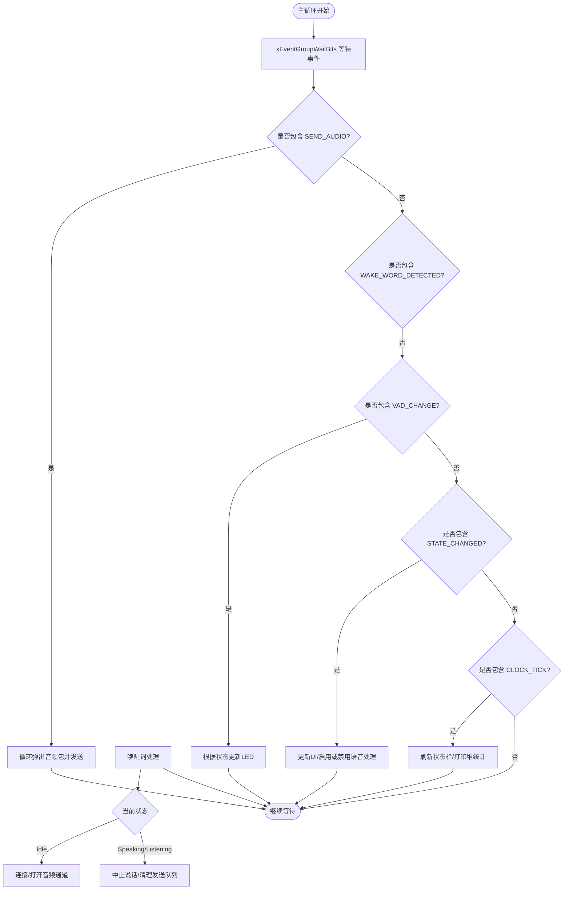
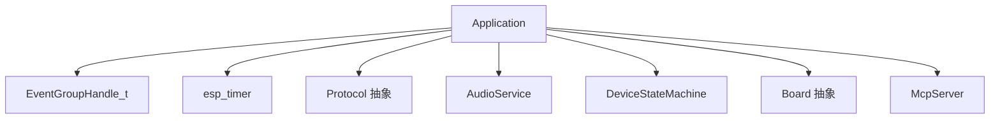

# 任务调度与事件处理API

<cite>
**本文引用的文件**   
- [main.cc](file://main/main.cc)
- [application.h](file://main/application.h)
- [application.cc](file://main/application.cc)
- [device_state_machine.h](file://main/device_state_machine.h)
- [button.cc](file://main/boards/common/button.cc)
</cite>

## 目录
1. [简介](#简介)
2. [项目结构](#项目结构)
3. [核心组件](#核心组件)
4. [架构总览](#架构总览)
5. [详细组件分析](#详细组件分析)
6. [依赖关系分析](#依赖关系分析)
7. [性能考虑](#性能考虑)
8. [故障排查指南](#故障排查指南)
9. [结论](#结论)
10. [附录](#附录)

## 简介
本文件聚焦于设备侧的任务调度与事件处理API，围绕以下目标展开：
- 深入解析 Schedule() 方法的回调机制，包括 std::function<void()> 的入参语义、线程安全保证与执行时机。
- 详细说明主事件类型（如 MAIN_EVENT_SCHEDULE、MAIN_EVENT_SEND_AUDIO、MAIN_EVENT_WAKE_WORD_DETECTED 等）的触发条件与处理方式。
- 解释 EventGroupHandle_t 的工作机制与事件优先级管理策略。
- 提供事件驱动编程示例、调试技巧与性能优化建议。

## 项目结构
应用入口在 main.cc，负责初始化 NVS 并启动 Application；Application 内部维护 FreeRTOS 事件组、定时器、状态机以及音频服务，并通过 Run() 循环统一处理各类事件。



图示来源
- [main.cc:14-29](file://main/main.cc#L14-L29)
- [application.cc:23-47](file://main/application.cc#L23-L47)
- [application.cc:165-259](file://main/application.cc#L165-L259)
- [application.cc:934-940](file://main/application.cc#L934-L940)

章节来源
- [main.cc:14-29](file://main/main.cc#L14-L29)
- [application.h:43-176](file://main/application.h#L43-L176)
- [application.cc:165-259](file://main/application.cc#L165-L259)

## 核心组件
- Application：应用核心类，封装事件组、定时器、协议、状态机、音频服务等，并提供 Schedule() 跨线程调度能力。
- DeviceStateMachine：设备状态机，提供严格的状态转换与监听回调。
- Button：通用按键抽象，演示了如何在硬件中断回调中通过 std::function 注册业务逻辑。

章节来源
- [application.h:43-176](file://main/application.h#L43-L176)
- [device_state_machine.h:17-81](file://main/device_state_machine.h#L17-L81)
- [button.cc:44-125](file://main/boards/common/button.cc#L44-L125)

## 架构总览
下图展示了从各子系统到主事件循环的事件流，以及 Schedule() 在主任务中的执行路径。



图示来源
- [application.cc:77-91](file://main/application.cc#L77-L91)
- [application.cc:165-259](file://main/application.cc#L165-L259)
- [application.cc:934-940](file://main/application.cc#L934-L940)

## 详细组件分析

### 事件系统与事件类型
- 事件定义位于 application.h，使用位标志表示不同事件源。
- 事件由多个子系统通过 xEventGroupSetBits 置位，主循环通过 xEventGroupWaitBits 统一等待与分发。

主要事件及触发点（节选）：
- MAIN_EVENT_SEND_AUDIO：音频发送队列有数据时置位，用于批量发送音频包。
- MAIN_EVENT_WAKE_WORD_DETECTED：检测到唤醒词时置位，进入唤醒流程。
- MAIN_EVENT_VAD_CHANGE：语音活动检测变化时置位，用于LED状态更新。
- MAIN_EVENT_STATE_CHANGED：设备状态变更时置位，用于UI与音频处理联动。
- MAIN_EVENT_NETWORK_CONNECTED/DISCONNECTED：网络连接状态变化。
- MAIN_EVENT_ERROR：网络错误时置位，进行错误提示与状态复位。
- MAIN_EVENT_CLOCK_TICK：周期性定时器触发，刷新状态栏与打印堆信息。
- MAIN_EVENT_TOGGLE_CHAT/START_LISTENING/STOP_LISTENING：用户交互或上层控制触发的聊天/监听切换。
- MAIN_EVENT_ACTIVATION_DONE：激活流程完成，进入空闲态。
- MAIN_EVENT_SCHEDULE：将回调推入主任务队列，由主任务执行。

章节来源
- [application.h:21-35](file://main/application.h#L21-L35)
- [application.cc:77-91](file://main/application.cc#L77-L91)
- [application.cc:165-259](file://main/application.cc#L165-L259)

#### 事件处理流程图（部分关键事件）


图示来源
- [application.cc:220-257](file://main/application.cc#L220-L257)
- [application.cc:780-858](file://main/application.cc#L780-L858)
- [application.cc:860-932](file://main/application.cc#L860-L932)

### Schedule() 方法详解
- 作用：将任意 std::function<void()> 回调安全地投递到主任务队列，确保在主任务上下文中执行。
- 线程安全：通过互斥量保护 main_tasks_ 队列，避免并发写入；随后置位 MAIN_EVENT_SCHEDULE 唤醒主循环。
- 执行时机：主循环在处理 MAIN_EVENT_SCHEDULE 时，会一次性移动出队列中的所有回调并顺序执行。
- 适用场景：从任意线程（中断上下文除外）发起对UI、协议、状态机等共享资源的访问。

```mermaid
classDiagram
class Application {
-mutex_ : std : : mutex
-main_tasks_ : std : : deque<std : : function<void()>>
-event_group_ : EventGroupHandle_t
+Schedule(callback) void
+Run() void
}
Application : "持有事件组与任务队列"
```

图示来源
- [application.h:125-176](file://main/application.h#L125-L176)
- [application.cc:934-940](file://main/application.cc#L934-L940)
- [application.cc:165-259](file://main/application.cc#L165-L259)

章节来源
- [application.h:77-80](file://main/application.h#L77-L80)
- [application.cc:934-940](file://main/application.cc#L934-L940)
- [application.cc:239-246](file://main/application.cc#L239-L246)

### 事件组 EventGroupHandle_t 工作机制与优先级
- 工作模式：
  - 多源异步事件通过 xEventGroupSetBits 置位。
  - 主循环通过 xEventGroupWaitBits 阻塞等待一组事件，返回已置位的位集。
  - 主循环按位判断并分发到具体处理器。
- 优先级管理：
  - 主任务优先级被显式设置为较高值，以确保事件处理的实时性。
  - 定时器回调采用 ESP_TIMER_TASK 派发方式，直接置位事件，不阻塞主循环。
- 注意事项：
  - 事件为“位”组合，同一轮次可能同时收到多个事件，需分别处理。
  - 事件仅作为通知，实际处理逻辑应在主循环中完成，避免在中断或高延迟路径中做重操作。

章节来源
- [application.cc:165-186](file://main/application.cc#L165-L186)
- [application.cc:36-47](file://main/application.cc#L36-L47)

### 关键事件的处理细节

#### MAIN_EVENT_SEND_AUDIO
- 触发条件：音频服务发送队列可用时，回调置位该事件。
- 处理方式：主循环循环弹出音频包并通过协议发送，直到队列为空或发送失败。

章节来源
- [application.cc:77-79](file://main/application.cc#L77-L79)
- [application.cc:220-226](file://main/application.cc#L220-L226)

#### MAIN_EVENT_WAKE_WORD_DETECTED
- 触发条件：音频服务检测到唤醒词时置位。
- 处理方式：
  - 若处于空闲态：编码唤醒词片段，必要时建立音频通道，然后进入监听模式。
  - 若正在说话或监听：中止说话、清理发送队列，并根据配置播放提示音并重新进入监听。
  - 若处于激活阶段：回到空闲态以重启激活检查。

章节来源
- [application.cc:80-82](file://main/application.cc#L80-L82)
- [application.cc:228-230](file://main/application.cc#L228-L230)
- [application.cc:780-858](file://main/application.cc#L780-L858)

#### MAIN_EVENT_VAD_CHANGE
- 触发条件：语音活动检测变化（开始/结束说话）。
- 处理方式：当处于监听态时，更新LED状态以反映VAD变化。

章节来源
- [application.cc:83-85](file://main/application.cc#L83-L85)
- [application.cc:232-237](file://main/application.cc#L232-L237)

#### MAIN_EVENT_STATE_CHANGED
- 触发条件：设备状态机发生有效转换后，监听器置位该事件。
- 处理方式：
  - 重置时钟计数。
  - 更新UI（状态文本、表情、聊天消息）。
  - 根据新状态启用/禁用语音处理与唤醒词检测。
  - 在特定状态下发送“开始监听”命令或重置解码器。

章节来源
- [application.cc:89-91](file://main/application.cc#L89-L91)
- [application.cc:204-206](file://main/application.cc#L204-L206)
- [application.cc:860-932](file://main/application.cc#L860-L932)

#### MAIN_EVENT_NETWORK_CONNECTED / MAIN_EVENT_NETWORK_DISCONNECTED
- 触发条件：网络层回调报告连接/断开。
- 处理方式：
  - 连接：若处于启动或配网阶段，则进入激活流程；刷新UI。
  - 断开：若处于连接/监听/说话态，关闭音频通道；刷新UI。

章节来源
- [application.cc:102-156](file://main/application.cc#L102-L156)
- [application.cc:192-198](file://main/application.cc#L192-L198)
- [application.cc:261-297](file://main/application.cc#L261-L297)

#### MAIN_EVENT_ERROR
- 触发条件：协议层网络错误回调。
- 处理方式：将设备状态复位到空闲，并弹出错误提示。

章节来源
- [application.cc:493-496](file://main/application.cc#L493-L496)
- [application.cc:187-190](file://main/application.cc#L187-L190)

#### MAIN_EVENT_CLOCK_TICK
- 触发条件：周期性定时器（1秒周期）触发。
- 处理方式：刷新状态栏，每10秒打印一次堆统计用于调试。

章节来源
- [application.cc:36-47](file://main/application.cc#L36-L47)
- [application.cc:248-257](file://main/application.cc#L248-L257)

#### MAIN_EVENT_TOGGLE_CHAT / START_LISTENING / STOP_LISTENING
- 触发条件：用户交互或上层控制接口调用。
- 处理方式：
  - ToggleChat：根据当前状态决定进入音频测试、打开/关闭音频通道或中止说话。
  - StartListening：进入监听态，必要时打开音频通道。
  - StopListening：停止监听并回到空闲态。

章节来源
- [application.cc:662-672](file://main/application.cc#L662-L672)
- [application.cc:674-778](file://main/application.cc#L674-L778)

#### MAIN_EVENT_ACTIVATION_DONE
- 触发条件：激活任务完成。
- 处理方式：进入空闲态，显示版本信息，释放OTA资源，降低功耗等级，并安排播放成功提示音。

章节来源
- [application.cc:336-338](file://main/application.cc#L336-L338)
- [application.cc:299-321](file://main/application.cc#L299-L321)

### 回调函数编写规范与线程安全
- 跨线程访问：任何需要访问UI、协议或状态机的代码，都应通过 Schedule() 提交到主任务执行。
- 轻量原则：回调应尽可能短小，避免阻塞；耗时操作应拆分为多次 Schedule 或放入后台任务。
- 捕获语义：使用 lambda 捕获必要变量时，注意生命周期与拷贝开销，优先使用移动语义减少复制。
- 幂等与重试：对网络相关回调应具备幂等性与重试策略，防止重复处理导致状态不一致。
- 日志与可观测性：在关键路径添加日志，便于定位问题。

章节来源
- [application.cc:934-940](file://main/application.cc#L934-L940)
- [application.cc:489-607](file://main/application.cc#L489-L607)

### 事件驱动编程示例（基于仓库现有用法）
- 按钮点击回调：在硬件中断回调中调用注册的 std::function，适合快速响应。
- 网络事件回调：在网络层回调中置位事件，由主循环处理UI与状态。
- 音频事件回调：音频服务在队列可用或检测到唤醒词时置位事件，主循环统一处理。

章节来源
- [button.cc:44-125](file://main/boards/common/button.cc#L44-L125)
- [application.cc:77-91](file://main/application.cc#L77-L91)
- [application.cc:102-156](file://main/application.cc#L102-L156)

## 依赖关系分析
- Application 依赖：
  - FreeRTOS 事件组与任务系统（事件等待与任务优先级）。
  - esp_timer 定时器（周期性事件）。
  - Protocol 抽象（网络与音频通道）。
  - AudioService（音频采集/播放/唤醒词检测）。
  - DeviceStateMachine（状态管理与监听）。
- 外部集成点：
  - Board 抽象（显示、LED、网络、电源管理等）。
  - McpServer（工具发现与调用）。



图示来源
- [application.h:125-176](file://main/application.h#L125-L176)
- [application.cc:23-47](file://main/application.cc#L23-L47)
- [application.cc:473-610](file://main/application.cc#L473-L610)

章节来源
- [application.h:125-176](file://main/application.h#L125-L176)
- [application.cc:473-610](file://main/application.cc#L473-L610)

## 性能考虑
- 事件批处理：SEND_AUDIO 事件采用循环弹出并发送，减少频繁事件切换带来的开销。
- 主任务优先级：提升主任务优先级，确保事件及时响应。
- 定时器派发：ESP_TIMER_TASK 派发方式避免阻塞主循环。
- 回调最小化：Schedule 的回调应保持轻量，避免长耗时操作。
- 状态切换节流：在状态变更时集中更新UI与音频处理，避免重复刷新。

[本节为通用指导，无需源码引用]

## 故障排查指南
- 常见问题定位：
  - 事件未触发：检查相应回调是否正确置位事件位。
  - 回调未执行：确认 Schedule 是否被调用且 MAIN_EVENT_SCHEDULE 被主循环处理。
  - 状态异常：查看状态机转换是否合法，监听器是否被正确注册。
  - 网络错误：关注 MAIN_EVENT_ERROR 的提示信息与状态复位逻辑。
- 调试技巧：
  - 利用 CLOCK_TICK 定期打印堆统计，观察内存占用趋势。
  - 在关键回调中添加日志，记录事件位与状态变化。
  - 使用 LED 与显示状态辅助定位时序问题。

章节来源
- [application.cc:187-190](file://main/application.cc#L187-L190)
- [application.cc:248-257](file://main/application.cc#L248-L257)
- [application.cc:860-932](file://main/application.cc#L860-L932)

## 结论
本项目的任务调度与事件处理体系以 FreeRTOS 事件组为核心，结合定时器与状态机，实现了高内聚、低耦合的事件驱动架构。Schedule() 提供了跨线程调度的安全通道，使各子系统能够以一致的方式与主循环协作。遵循回调轻量、幂等与可观测性的规范，可有效提升系统的稳定性与可维护性。

[本节为总结，无需源码引用]

## 附录
- 事件位定义参考：application.h 中的 MAIN_EVENT_* 宏。
- 主循环事件分发参考：application.cc 的 Run() 方法。
- 状态机参考：device_state_machine.h 的 DeviceStateMachine 类。

章节来源
- [application.h:21-35](file://main/application.h#L21-L35)
- [application.cc:165-259](file://main/application.cc#L165-L259)
- [device_state_machine.h:17-81](file://main/device_state_machine.h#L17-L81)