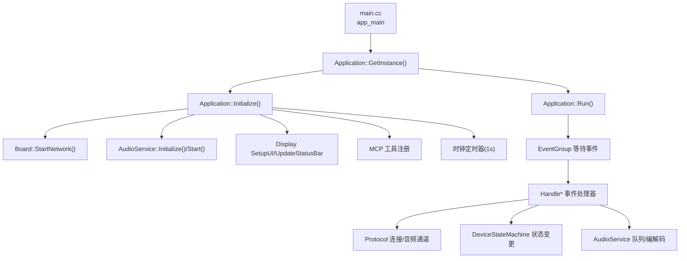
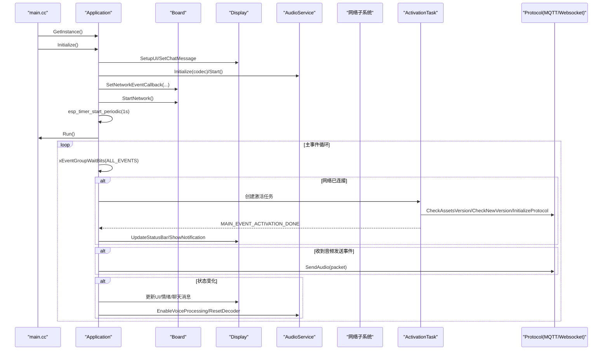
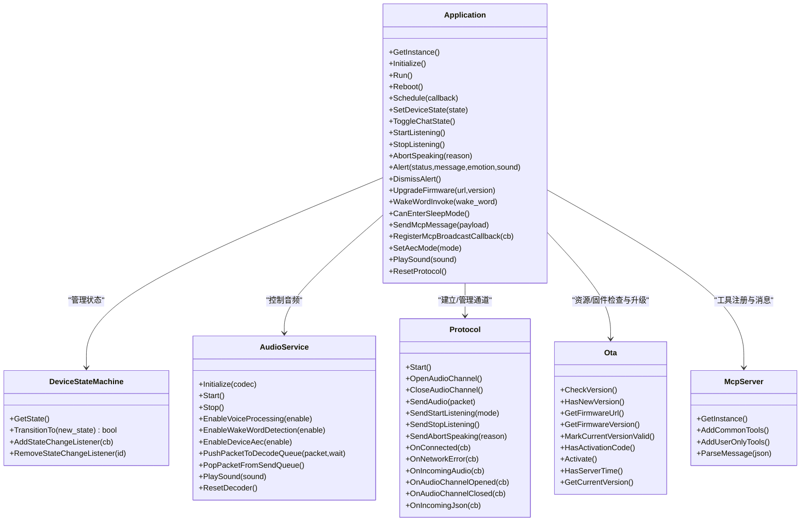

# 应用生命周期管理API

<cite>
**本文引用的文件**   
- [main.cc](file://main/main.cc)
- [application.h](file://main/application.h)
- [application.cc](file://main/application.cc)
- [device_state_machine.h](file://main/device_state_machine.h)
- [audio_service.h](file://main/audio/audio_service.h)
</cite>

## 目录
1. [简介](#简介)
2. [项目结构](#项目结构)
3. [核心组件](#核心组件)
4. [架构总览](#架构总览)
5. [详细组件分析](#详细组件分析)
6. [依赖关系分析](#依赖关系分析)
7. [性能与资源特性](#性能与资源特性)
8. [故障排查指南](#故障排查指南)
9. [结论](#结论)
10. [附录：函数签名与使用示例](#附录函数签名与使用示例)

## 简介
本文件面向开发者，系统化梳理应用生命周期管理 API，重点覆盖 Application 类的核心方法：Initialize()、Run()、Reboot()，以及单例入口 GetInstance()。文档还详细说明启动时显示、音频、网络等模块的初始化顺序，事件驱动的主循环机制，以及与协议层、状态机、音频服务的交互方式。同时提供线程安全注意事项、最佳实践和常见问题的定位思路。

## 项目结构
应用由 main 入口创建并运行 Application 实例，Application 负责设备状态机、事件组、定时器、协议对象、音频服务等的生命周期管理。关键文件如下：
- main.cc：系统入口，初始化 NVS，获取 Application 单例，调用 Initialize 与 Run。
- application.h/cc：Application 类定义与实现，包含事件处理、协议初始化、激活流程、重启逻辑等。
- device_state_machine.h：设备状态机，提供严格的状态转换与监听回调。
- audio_service.h：音频服务，封装采集/编码/解码/播放任务及队列。

图表来源
- [main.cc:14-29](file://main/main.cc#L14-L29)
- [application.h:43-176](file://main/application.h#L43-L176)
- [application.cc:61-163](file://main/application.cc#L61-L163)
- [application.cc:165-259](file://main/application.cc#L165-L259)

章节来源
- [main.cc:14-29](file://main/main.cc#L14-L29)
- [application.h:43-176](file://main/application.h#L43-L176)
- [application.cc:61-163](file://main/application.cc#L61-L163)
- [application.cc:165-259](file://main/application.cc#L165-L259)

## 核心组件
- Application：应用生命周期与事件调度中心，维护设备状态、协议对象、音频服务、OTA、MCP 工具等。
- DeviceStateMachine：受控的设备状态机，保证状态转换合法性并提供监听回调。
- AudioService：音频采集、处理、编码、解码、播放的多任务管线，提供队列与回调接口。
- Protocol（MQTT/WebSocket）：通过 OTA 配置选择具体协议实现，负责连接、鉴权、音频通道与消息分发。

章节来源
- [application.h:43-176](file://main/application.h#L43-L176)
- [device_state_machine.h:17-81](file://main/device_state_machine.h#L17-L81)
- [audio_service.h:105-193](file://main/audio/audio_service.h#L105-L193)

## 架构总览
下图展示从系统启动到主事件循环的关键路径，包括异步网络、激活任务、协议初始化与 UI/音频联动。

图表来源
- [main.cc:14-29](file://main/main.cc#L14-L29)
- [application.cc:61-163](file://main/application.cc#L61-L163)
- [application.cc:165-259](file://main/application.cc#L165-L259)
- [application.cc:261-338](file://main/application.cc#L261-L338)
- [application.cc:473-610](file://main/application.cc#L473-L610)

## 详细组件分析

### Application 类与单例模式
- 单例入口
  - 使用静态局部变量实现线程安全的单例构造，返回引用。
  - 删除拷贝构造与赋值操作，避免意外复制。
- 主要职责
  - 初始化显示、音频、网络回调、MCP 工具、时钟定时器。
  - 启动异步网络，进入主事件循环。
  - 在激活任务中完成资源检查、版本升级、协议初始化。
  - 统一的事件分发与调度（Schedule），确保跨线程访问安全。

章节来源
- [application.h:43-51](file://main/application.h#L43-L51)
- [application.cc:23-47](file://main/application.cc#L23-L47)

#### 初始化流程 Initialize()
- 设置设备状态为“启动中”。
- 初始化显示 UI，打印用户代理信息。
- 初始化并启动音频服务，注册音频回调（发送队列可用、唤醒词检测、VAD 变化）。
- 添加状态机监听，将状态变化转为事件。
- 启动 1 秒周期定时器用于状态栏刷新与调试输出。
- 注册 MCP 通用工具与用户专属工具。
- 注册网络事件回调（扫描、连接、断开、蜂窝模组错误等），并异步启动网络。
- 立即刷新状态栏以反映当前网络状态。

章节来源
- [application.cc:61-163](file://main/application.cc#L61-L163)

#### 主事件循环 Run()
- 提升主任务优先级，定义所有关注的事件位。
- 无限循环等待事件，按事件类型分发处理：
  - 错误事件：重置状态并弹出提示。
  - 网络事件：连接/断开处理，必要时关闭音频通道。
  - 激活完成：释放 OTA 对象、降低功耗、播放成功音。
  - 状态变化：根据新状态控制 UI、LED、音频处理开关。
  - 切换对话/开始/停止监听：根据当前状态打开或关闭音频通道、发送指令。
  - 音频发送：从发送队列取包并通过协议发送。
  - 唤醒词检测：触发唤醒流程或中断正在进行的会话。
  - VAD 变化：在监听状态下联动 LED。
  - 定时任务：执行 Schedule 队列中的回调；每 10 秒打印堆统计。

章节来源
- [application.cc:165-259](file://main/application.cc#L165-L259)

#### 重启功能 Reboot()
- 若存在打开的音频通道则先关闭。
- 释放协议对象，停止音频服务。
- 短暂延时后调用底层重启。

章节来源
- [application.cc:959-970](file://main/application.cc#L959-L970)

#### 激活与协议初始化
- ActivationTask：创建 OTA 对象，检查资源版本与固件版本，初始化协议，完成后通知主循环。
- CheckAssetsVersion：仅在首次检查，支持下载并应用资源包。
- CheckNewVersion：带重试退避的版本检查，支持在线升级与激活码流程。
- InitializeProtocol：根据 OTA 配置选择 MQTT 或 WebSocket，注册连接、网络错误、音频通道、JSON 消息等回调，并启动协议。

章节来源
- [application.cc:323-338](file://main/application.cc#L323-L338)
- [application.cc:340-396](file://main/application.cc#L340-L396)
- [application.cc:398-471](file://main/application.cc#L398-L471)
- [application.cc:473-610](file://main/application.cc#L473-L610)

#### 事件与状态机交互
- 状态机提供 TransitionTo 与监听器，Application 在多处调用以驱动 UI、音频与协议行为。
- 状态变化事件在主循环中被消费，统一更新 UI、LED、音频处理开关。

章节来源
- [device_state_machine.h:17-81](file://main/device_state_machine.h#L17-L81)
- [application.cc:860-932](file://main/application.cc#L860-L932)

#### 线程安全与调度
- Schedule：将回调入队并在主循环中执行，避免跨线程直接访问共享资源。
- 事件组：各子模块通过事件位通知主循环，解耦并发。
- 定时器：1 秒周期事件用于 UI 刷新与周期性调试输出。

章节来源
- [application.cc:934-940](file://main/application.cc#L934-L940)
- [application.cc:165-259](file://main/application.cc#L165-L259)

### 音频服务 AudioService
- 多任务管线：输入任务、输出任务、Opus 编解码任务，配合多个队列缓冲 PCM/Opus 数据。
- 对外接口：初始化/启动/停止、语音处理开关、唤醒词检测开关、AEC 开关、播放音效、队列读写等。
- 与 Application 协作：
  - Initialize 阶段注入 Codec 并启动。
  - 回调事件（发送队列可用、唤醒词检测、VAD 变化）转化为 Application 事件。
  - 在状态变化时启用/禁用语音处理、重置解码器、播放提示音。

章节来源
- [audio_service.h:105-193](file://main/audio/audio_service.h#L105-L193)
- [application.cc:61-163](file://main/application.cc#L61-L163)
- [application.cc:860-932](file://main/application.cc#L860-L932)

### 设备状态机 DeviceStateMachine
- 原子状态存储，互斥保护监听器列表。
- 提供合法转换校验与监听器机制，Application 据此驱动 UI/音频/协议行为。

章节来源
- [device_state_machine.h:17-81](file://main/device_state_machine.h#L17-L81)

## 依赖关系分析
- Application 依赖：
  - Board：获取显示、音频、网络能力与电源策略。
  - AudioService：音频采集/编解码/播放。
  - Protocol：网络通信与音频通道。
  - Ota：资源与固件版本检查、升级。
  - McpServer：工具注册与消息解析。
  - DeviceStateMachine：状态管理与监听。
- 事件与调度：
  - EventGroup：跨任务事件同步。
  - esp_timer：周期事件驱动 UI 刷新与调试。

图表来源
- [application.h:43-176](file://main/application.h#L43-L176)
- [application.cc:61-163](file://main/application.cc#L61-L163)
- [application.cc:473-610](file://main/application.cc#L473-L610)
- [device_state_machine.h:17-81](file://main/device_state_machine.h#L17-L81)
- [audio_service.h:105-193](file://main/audio/audio_service.h#L105-L193)

章节来源
- [application.h:43-176](file://main/application.h#L43-L176)
- [application.cc:61-163](file://main/application.cc#L61-L163)
- [application.cc:473-610](file://main/application.cc#L473-L610)
- [device_state_machine.h:17-81](file://main/device_state_machine.h#L17-L81)
- [audio_service.h:105-193](file://main/audio/audio_service.h#L105-L193)

## 性能与资源特性
- 主任务优先级提升，确保事件响应及时。
- 网络/激活阶段临时提升功耗等级以降低延迟，完成后恢复低功耗。
- 音频队列长度与帧时长有明确上限，避免内存抖动与阻塞。
- 定时器每 10 秒打印堆统计，便于监控内存占用。
- 建议：
  - 避免在回调中执行耗时操作，尽量使用 Schedule 转交主循环。
  - 长耗时任务拆分为可中断的小段，定期检查设备状态以便快速退出。
  - 合理设置 AEC 模式，减少回声的同时兼顾 CPU 负载。

[本节为通用指导，不直接分析具体文件]

## 故障排查指南
- 无法进入空闲态或频繁报错
  - 检查错误事件是否被正确设置与处理，确认 last_error_message_ 内容。
  - 查看状态机转换是否合法，必要时增加日志。
- 网络断开导致通话异常
  - 确认 HandleNetworkDisconnectedEvent 是否正确关闭音频通道并刷新 UI。
- 唤醒词无效或误触发
  - 检查音频回调 on_wake_word_detected 是否触发，确认 ContinueWakeWordInvoke 分支逻辑。
- 升级失败
  - 查看 UpgradeFirmware 返回值与 Alert 提示，确认网络与 URL 可达性。
- 重启后未恢复
  - 确认 Reboot 前是否关闭了音频通道与协议对象，避免资源泄漏。

章节来源
- [application.cc:165-259](file://main/application.cc#L165-L259)
- [application.cc:286-297](file://main/application.cc#L286-L297)
- [application.cc:972-1022](file://main/application.cc#L972-L1022)
- [application.cc:959-970](file://main/application.cc#L959-L970)

## 结论
Application 作为应用的核心控制器，通过事件组与状态机协调显示、音频、网络与协议层，形成稳定可靠的生命周期管理。Initialize 负责资源准备与异步启动，Run 承担事件分发与业务编排，Reboot 提供安全重启路径。遵循线程安全与调度规范，可有效避免竞态与死锁，提升系统稳定性与用户体验。

[本节为总结，不直接分析具体文件]

## 附录：函数签名与使用示例

### 单例与生命周期
- 获取单例
  - 签名：static Application& GetInstance()
  - 说明：返回全局唯一实例引用，内部使用静态局部变量保证构造线程安全。
  - 使用示例：auto& app = Application::GetInstance();
- 初始化
  - 签名：void Initialize()
  - 说明：初始化显示、音频、网络回调、MCP 工具、定时器，并异步启动网络。
  - 使用示例：app.Initialize();
- 主循环
  - 签名：void Run()
  - 说明：永不返回，持续等待并处理事件。
  - 使用示例：app.Run();
- 重启
  - 签名：void Reboot()
  - 说明：关闭音频通道、释放协议、停止音频服务后重启。
  - 使用示例：app.Reboot();

章节来源
- [application.h:43-65](file://main/application.h#L43-L65)
- [application.cc:61-163](file://main/application.cc#L61-L163)
- [application.cc:165-259](file://main/application.cc#L165-L259)
- [application.cc:959-970](file://main/application.cc#L959-L970)

### 状态与交互
- 设置设备状态
  - 签名：bool SetDeviceState(DeviceState state)
  - 说明：尝试进行状态转换，返回是否成功。
- 切换对话/开始/停止监听
  - 签名：void ToggleChatState(), void StartListening(), void StopListening()
  - 说明：通过事件触发主循环处理，线程安全。
- 中止说话
  - 签名：void AbortSpeaking(AbortReason reason)
  - 说明：向协议发送中止命令并标记中止标志。
- 提示与清除提示
  - 签名：void Alert(const char* status, const char* message, const char* emotion = "", const std::string_view& sound = ""), void DismissAlert()
  - 说明：更新 UI 状态、情绪、聊天消息并可播放声音。

章节来源
- [application.h:67-114](file://main/application.h#L67-L114)
- [application.cc:662-778](file://main/application.cc#L662-L778)
- [application.cc:942-948](file://main/application.cc#L942-L948)
- [application.cc:642-660](file://main/application.cc#L642-L660)

### 调度与协议
- 调度回调
  - 签名：void Schedule(std::function<void()>&& callback)
  - 说明：将回调加入主循环队列，保证线程安全执行。
- 重置协议
  - 签名：void ResetProtocol()
  - 说明：关闭音频通道并释放协议对象，供任意任务调用。
- 升级固件
  - 签名：bool UpgradeFirmware(const std::string& url, const std::string& version = "")
  - 说明：下载并升级固件，成功后重启。
- 唤醒词调用
  - 签名：void WakeWordInvoke(const std::string& wake_word)
  - 说明：根据当前状态发起唤醒流程或中断现有会话。
- 进入睡眠判断
  - 签名：bool CanEnterSleepMode()
  - 说明：仅当空闲且无活跃通道与音频任务时允许休眠。
- MCP 广播与消息
  - 签名：void RegisterMcpBroadcastCallback(std::function<void(const std::string&)>)
  - 签名：void SendMcpMessage(const std::string& payload)
  - 说明：注册本地广播回调，发送 MCP 消息（自动调度至主循环）。
- AEC 模式
  - 签名：void SetAecMode(AecMode mode), AecMode GetAecMode() const
  - 说明：设置设备端/服务端/关闭 AEC，必要时关闭音频通道。
- 播放音效
  - 签名：void PlaySound(const std::string_view& sound)
  - 说明：通过音频服务播放指定音效。

章节来源
- [application.cc:934-940](file://main/application.cc#L934-940)
- [application.cc:1121-1130](file://main/application.cc#L1121-L1130)
- [application.cc:972-1022](file://main/application.cc#L972-L1022)
- [application.cc:1024-1055](file://main/application.cc#L1024-L1055)
- [application.cc:1057-1072](file://main/application.cc#L1057-L1072)
- [application.cc:1074-1088](file://main/application.cc#L1074-L1088)
- [application.cc:1090-1115](file://main/application.cc#L1090-L1115)
- [application.cc:1117-1119](file://main/application.cc#L1117-L1119)

### 启动资源初始化顺序（概览）
- 显示：SetupUI -> SetChatMessage -> UpdateStatusBar
- 音频：Initialize(codec) -> Start() -> SetCallbacks
- 网络：SetNetworkEventCallback -> StartNetwork（异步）
- 定时器：esp_timer_start_periodic(1s)
- MCP：AddCommonTools/AddUserOnlyTools
- 激活任务：CheckAssetsVersion -> CheckNewVersion -> InitializeProtocol -> 通知主循环

章节来源
- [application.cc:61-163](file://main/application.cc#L61-L163)
- [application.cc:323-338](file://main/application.cc#L323-L338)
- [application.cc:340-396](file://main/application.cc#L340-L396)
- [application.cc:398-471](file://main/application.cc#L398-L471)
- [application.cc:473-610](file://main/application.cc#L473-L610)