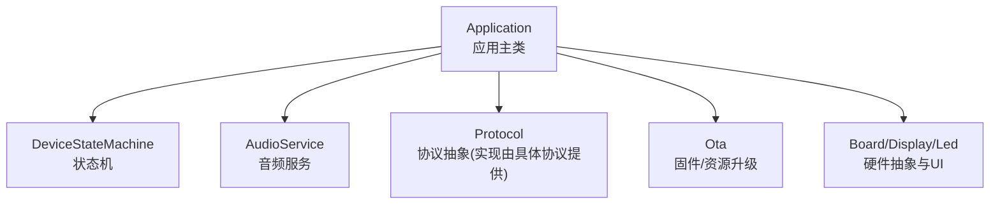
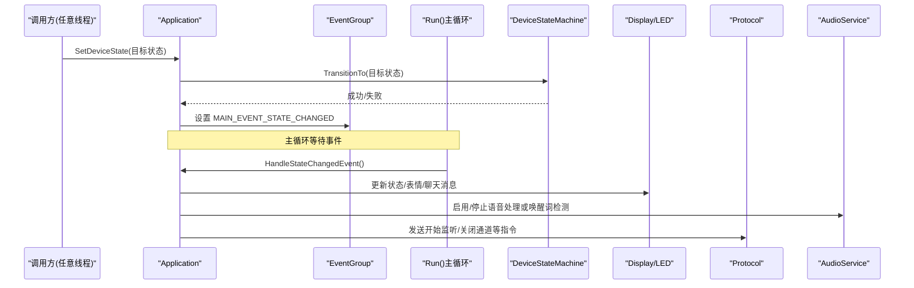
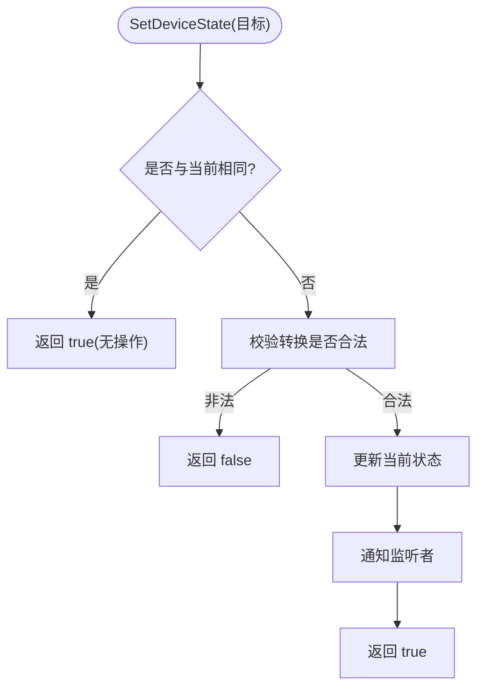
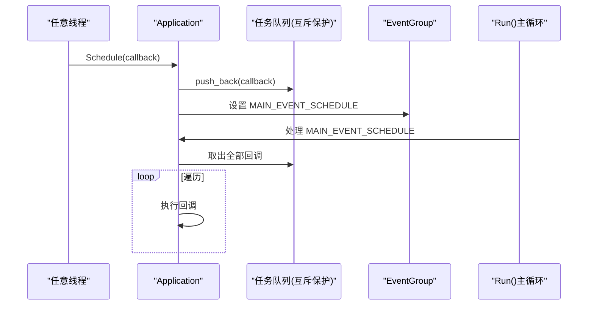
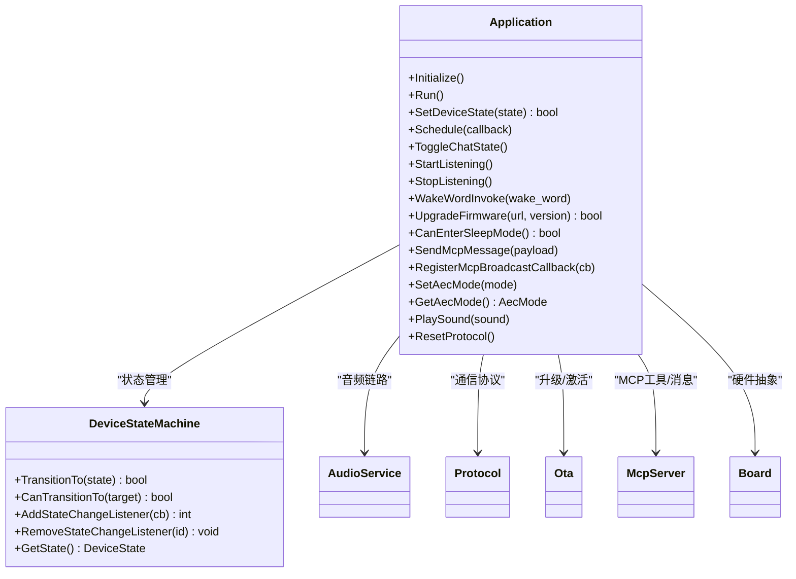

# 核心API接口

<cite>
**本文引用的文件**   
- [application.h](file://main/application.h)
- [application.cc](file://main/application.cc)
- [device_state.h](file://main/device_state.h)
- [device_state_machine.h](file://main/device_state_machine.h)
- [device_state_machine.cc](file://main/device_state_machine.cc)
</cite>

## 目录
1. [简介](#简介)
2. [项目结构](#项目结构)
3. [核心组件](#核心组件)
4. [架构总览](#架构总览)
5. [详细组件分析](#详细组件分析)
6. [依赖关系分析](#依赖关系分析)
7. [性能与线程安全](#性能与线程安全)
8. [故障排查指南](#故障排查指南)
9. [结论](#结论)

## 简介
本文件聚焦于设备应用层的核心API，围绕 Application 类提供完整、可操作的接口文档。内容覆盖：
- Application 的初始化、运行、状态管理、任务调度等关键方法
- 设备状态枚举 DeviceState 及其转换机制
- 事件驱动的主循环与回调机制
- 线程安全注意事项与最佳实践

## 项目结构
与核心API直接相关的源文件位于 main 目录下，包含应用主类、状态机与状态定义。

图表来源
- [application.h:43-176](file://main/application.h#L43-L176)
- [device_state_machine.h:17-81](file://main/device_state_machine.h#L17-L81)

章节来源
- [application.h:1-194](file://main/application.h#L1-L194)
- [device_state.h:1-18](file://main/device_state.h#L1-L18)
- [device_state_machine.h:1-84](file://main/device_state_machine.h#L1-L84)

## 核心组件
- Application：应用入口与协调器，负责初始化、主循环、事件分发、状态切换、任务调度、协议生命周期管理、OTA升级、唤醒词处理、MCP消息广播等。
- DeviceStateMachine：严格的状态机，维护当前状态、合法转换规则与变更回调。
- DeviceState：设备状态枚举，用于描述设备所处阶段（如空闲、连接中、监听、说话、升级等）。

章节来源
- [application.h:43-176](file://main/application.h#L43-L176)
- [device_state_machine.h:17-81](file://main/device_state_machine.h#L17-L81)
- [device_state.h:4-16](file://main/device_state.h#L4-L16)

## 架构总览
Application 通过 FreeRTOS EventGroup 将来自不同线程的事件汇聚到主循环统一处理；通过互斥量保护的任务队列实现跨线程的“在主任务中执行”的回调机制。状态机保证状态转换的合法性，并在转换时触发事件通知主循环更新UI与音频链路。

图表来源
- [application.cc:165-259](file://main/application.cc#L165-L259)
- [application.cc:860-932](file://main/application.cc#L860-L932)
- [device_state_machine.cc:108-131](file://main/device_state_machine.cc#L108-L131)

## 详细组件分析

### Application 类公共接口
以下列出所有对外暴露的公共方法，并给出参数、返回值与行为说明。为避免泄露实现细节，不展示代码片段，仅标注源码位置。

- Initialize()
  - 作用：初始化显示、音频服务、网络事件回调、时钟定时器、MCP工具注册；启动异步网络流程。
  - 线程：应在单例创建后尽早调用一次。
  - 参考路径：[application.cc:61-163](file://main/application.cc#L61-L163)

- Run()
  - 作用：主事件循环，阻塞等待事件，按优先级处理网络、状态变化、音频发送、唤醒词、VAD、定时器等事件。
  - 线程：在独立的高优先级任务中运行，永不返回。
  - 参考路径：[application.cc:165-259](file://main/application.cc#L165-L259)

- GetDeviceState()
  - 作用：获取当前设备状态。
  - 返回值：DeviceState
  - 参考路径：[application.h:67](file://main/application.h#L67)

- IsVoiceDetected()
  - 作用：查询是否检测到语音。
  - 返回值：bool
  - 参考路径：[application.h:68](file://main/application.h#L68)

- SetDeviceState(DeviceState state)
  - 作用：请求状态转换，内部委托给状态机进行合法性校验与切换。
  - 参数：目标状态
  - 返回值：bool 转换是否成功
  - 参考路径：[application.h:74](file://main/application.h#L74), [application.cc:57-59](file://main/application.cc#L57-L59)

- Schedule(std::function<void()>&& callback)
  - 作用：将回调入队，确保在主任务上下文中执行，线程安全。
  - 参数：可调用对象（移动语义）
  - 返回值：无
  - 参考路径：[application.h:79](file://main/application.h#L79), [application.cc:934-940](file://main/application.cc#L934-L940)

- Alert(const char* status, const char* message, const char* emotion = "", const std::string_view& sound = "")
  - 作用：弹出系统提示（状态、消息、表情、可选音效）。
  - 参考路径：[application.h:84](file://main/application.h#L84), [application.cc:642-651](file://main/application.cc#L642-L651)

- DismissAlert()
  - 作用：清除提示，恢复待机界面（仅在空闲态生效）。
  - 参考路径：[application.h:85](file://main/application.h#L85), [application.cc:653-660](file://main/application.cc#L653-L660)

- AbortSpeaking(AbortReason reason)
  - 作用：中断正在进行的TTS播放，向协议层发送中止命令。
  - 参考路径：[application.h:87](file://main/application.h#L87), [application.cc:942-948](file://main/application.cc#L942-L948)

- ToggleChatState() / StartListening() / StopListening()
  - 作用：以事件方式切换对话状态、开始/停止监听，线程安全。
  - 参考路径：[application.h:93-105](file://main/application.h#L93-L105), [application.cc:662-778](file://main/application.cc#L662-L778)

- Reboot()
  - 作用：关闭音频通道、释放协议、停止音频服务并重启设备。
  - 参考路径：[application.h:107](file://main/application.h#L107), [application.cc:959-970](file://main/application.cc#L959-L970)

- WakeWordInvoke(const std::string& wake_word)
  - 作用：根据当前状态处理唤醒词触发（可能打开音频通道、发送唤醒词数据、进入监听等）。
  - 参考路径：[application.h:108](file://main/application.h#L108), [application.cc:1024-1055](file://main/application.cc#L1024-L1055)

- UpgradeFirmware(const std::string& url, const std::string& version = "")
  - 作用：在线升级固件，支持进度回调与失败回退。
  - 参考路径：[application.h:109](file://main/application.h#L109), [application.cc:972-1022](file://main/application.cc#L972-L1022)

- CanEnterSleepMode()
  - 作用：判断是否可以进入睡眠模式（需空闲且无活跃会话）。
  - 参考路径：[application.h:110](file://main/application.h#L110), [application.cc:1057-1072](file://main/application.cc#L1057-L1072)

- SendMcpMessage(const std::string& payload)
  - 作用：发送MCP消息（在主任务中执行，线程安全），同时触发本地广播回调。
  - 参考路径：[application.h:111](file://main/application.h#L111), [application.cc:1078-1088](file://main/application.cc#L1078-L1088)

- RegisterMcpBroadcastCallback(std::function<void(const std::string&)> callback)
  - 作用：注册MCP广播回调，接收同进程内其他模块的MCP消息。
  - 参考路径：[application.h:112](file://main/application.h#L112), [application.cc:1074-1076](file://main/application.cc#L1074-L1076)

- SetAecMode(AecMode mode) / GetAecMode()
  - 作用：设置/获取回声消除模式（设备端/服务端/关闭），改变后会关闭已打开的音频通道。
  - 参考路径：[application.h:113-114](file://main/application.h#L113-L114), [application.cc:1090-1115](file://main/application.cc#L1090-L1115)

- PlaySound(const std::string_view& sound)
  - 作用：播放提示音。
  - 参考路径：[application.h:115](file://main/application.h#L115), [application.cc:1117-1119](file://main/application.cc#L1117-L1119)

- GetAudioService()
  - 作用：获取音频服务引用，便于高级控制。
  - 参考路径：[application.h:116](file://main/application.h#L116)

- ResetProtocol()
  - 作用：线程安全地重置协议资源（关闭音频通道、释放协议对象）。
  - 参考路径：[application.h:123](file://main/application.h#L123), [application.cc:1121-1130](file://main/application.cc#L1121-L1130)

使用示例（概念性步骤）
- 初始化与运行
  - 获取单例：Application::GetInstance()
  - 调用 Initialize() 完成子系统初始化
  - 调用 Run() 进入主循环
  - 参考路径：[application.h:45-65](file://main/application.h#L45-L65), [application.cc:61-163](file://main/application.cc#L61-L163), [application.cc:165-259](file://main/application.cc#L165-L259)

- 发起对话
  - 调用 ToggleChatState() 或在空闲态调用 StartListening()
  - 监听状态变化，必要时调用 StopListening() 结束
  - 参考路径：[application.h:93-105](file://main/application.h#L93-L105), [application.cc:662-778](file://main/application.cc#L662-L778)

- 唤醒词触发
  - 调用 WakeWordInvoke("唤醒词")
  - 参考路径：[application.h:108](file://main/application.h#L108), [application.cc:1024-1055](file://main/application.cc#L1024-L1055)

- 升级固件
  - 调用 UpgradeFirmware(url, version)
  - 参考路径：[application.h:109](file://main/application.h#L109), [application.cc:972-1022](file://main/application.cc#L972-L1022)

- 设置AEC模式
  - 调用 SetAecMode(kAecOnDeviceSide | kAecOnServerSide | kAecOff)
  - 参考路径：[application.h:113-114](file://main/application.h#L113-L114), [application.cc:1090-1115](file://main/application.cc#L1090-L1115)

章节来源
- [application.h:43-176](file://main/application.h#L43-L176)
- [application.cc:57-59](file://main/application.cc#L57-L59)
- [application.cc:61-163](file://main/application.cc#L61-L163)
- [application.cc:165-259](file://main/application.cc#L165-L259)
- [application.cc:642-660](file://main/application.cc#L642-L660)
- [application.cc:662-778](file://main/application.cc#L662-L778)
- [application.cc:934-940](file://main/application.cc#L934-L940)
- [application.cc:942-948](file://main/application.cc#L942-L948)
- [application.cc:959-970](file://main/application.cc#L959-L970)
- [application.cc:972-1022](file://main/application.cc#L972-L1022)
- [application.cc:1024-1055](file://main/application.cc#L1024-L1055)
- [application.cc:1057-1072](file://main/application.cc#L1057-L1072)
- [application.cc:1074-1088](file://main/application.cc#L1074-L1088)
- [application.cc:1090-1115](file://main/application.cc#L1090-L1115)
- [application.cc:1117-1130](file://main/application.cc#L1117-L1130)

### 设备状态管理与转换机制
- DeviceState 枚举值
  - 未知、启动中、配网中、空闲、连接中、监听中、说话中、升级中、激活中、音频测试、致命错误
  - 参考路径：[device_state.h:4-16](file://main/device_state.h#L4-L16)

- 状态转换规则（摘要）
  - 未知 -> 启动中
  - 启动中 -> 配网中 或 激活中
  - 配网中 -> 激活中 或 音频测试
  - 音频测试 -> 配网中
  - 激活中 -> 升级中 或 空闲 或 配网中
  - 升级中 -> 空闲 或 激活中
  - 空闲 -> 连接中 或 监听中 或 说话中 或 激活中 或 升级中 或 配网中
  - 连接中 -> 空闲 或 监听中
  - 监听中 -> 说话中 或 空闲
  - 说话中 -> 监听中 或 空闲
  - 致命错误：不可转出
  - 参考路径：[device_state_machine.cc:34-102](file://main/device_state_machine.cc#L34-L102)

- 状态变更事件
  - 状态机在成功转换后，会通知所有注册的监听者；Application 在 Initialize 中注册监听，将 MAIN_EVENT_STATE_CHANGED 投递至主循环，从而更新UI与音频链路。
  - 参考路径：[device_state_machine.cc:148-161](file://main/device_state_machine.cc#L148-L161), [application.cc:88-91](file://main/application.cc#L88-L91), [application.cc:204-206](file://main/application.cc#L204-L206), [application.cc:860-932](file://main/application.cc#L860-L932)

图表来源
- [device_state_machine.cc:108-131](file://main/device_state_machine.cc#L108-L131)

章节来源
- [device_state.h:4-16](file://main/device_state.h#L4-L16)
- [device_state_machine.h:17-81](file://main/device_state_machine.h#L17-L81)
- [device_state_machine.cc:34-102](file://main/device_state_machine.cc#L34-L102)
- [device_state_machine.cc:108-131](file://main/device_state_machine.cc#L108-L131)
- [application.cc:88-91](file://main/application.cc#L88-L91)
- [application.cc:204-206](file://main/application.cc#L204-L206)
- [application.cc:860-932](file://main/application.cc#L860-L932)

### 任务调度系统 Schedule() 与回调机制
- 设计要点
  - 任何线程均可调用 Schedule()，将回调推入受互斥保护的队列，并通过事件组通知主循环。
  - 主循环在收到 MAIN_EVENT_SCHEDULE 后，批量取出队列中的回调并依次执行，确保所有UI与协议相关操作在主任务上下文执行。
  - 参考路径：[application.h:79](file://main/application.h#L79), [application.cc:934-940](file://main/application.cc#L934-L940), [application.cc:239-246](file://main/application.cc#L239-L246)

- 典型用法
  - 从非主线程更新UI、修改状态、发送协议消息等，均应通过 Schedule() 提交。
  - 参考路径：[application.cc:373-379](file://main/application.cc#L373-L379), [application.cc:998-1004](file://main/application.cc#L998-L1004)

图表来源
- [application.cc:934-940](file://main/application.cc#L934-L940)
- [application.cc:239-246](file://main/application.cc#L239-L246)

章节来源
- [application.h:79](file://main/application.h#L79)
- [application.cc:934-940](file://main/application.cc#L934-L940)
- [application.cc:239-246](file://main/application.cc#L239-L246)

## 依赖关系分析
- Application 依赖
  - Board/Display/Led：用于UI与硬件交互
  - AudioService：音频采集/播放、VAD、唤醒词、编码/解码队列
  - Protocol：抽象协议接口（MQTT/Websocket 实现）
  - Ota：版本检查、激活码、固件升级
  - McpServer：MCP工具与消息路由
  - FreeRTOS：EventGroup、Task、Timer、Mutex

图表来源
- [application.h:43-176](file://main/application.h#L43-L176)
- [device_state_machine.h:17-81](file://main/device_state_machine.h#L17-L81)

章节来源
- [application.h:43-176](file://main/application.h#L43-L176)
- [device_state_machine.h:17-81](file://main/device_state_machine.h#L17-L81)

## 性能与线程安全
- 线程模型
  - 主循环 Run() 为高优先级任务，集中处理事件与UI更新。
  - 所有需要访问UI或协议的方法应通过 Schedule() 提交，避免竞态条件。
  - 参考路径：[application.cc:165-167](file://main/application.cc#L165-L167), [application.cc:934-940](file://main/application.cc#L934-L940)

- 事件聚合
  - 使用 EventGroup 聚合多源事件，减少忙轮询与上下文切换开销。
  - 参考路径：[application.cc:169-185](file://main/application.cc#L169-L185)

- 电源与延迟
  - 连接/说话期间提升性能等级以降低延迟；空闲/待机降低功耗。
  - 参考路径：[application.cc:504-519](file://main/application.cc#L504-L519), [application.cc:281-297](file://main/application.cc#L281-L297)

- 建议
  - 避免在回调中执行耗时操作，必要时再次 Schedule() 分片执行。
  - 对共享状态读写尽量集中在主任务或通过互斥保护。
  - 升级/重启前务必关闭音频通道与协议，防止资源泄漏。

[本节为通用指导，无需特定文件来源]

## 故障排查指南
- 常见错误与定位
  - 无效状态转换：查看日志中“Invalid state transition”提示，确认调用顺序是否符合状态机规则。
    - 参考路径：[device_state_machine.cc:117-121](file://main/device_state_machine.cc#L117-L121)
  - 网络错误：当协议层上报网络错误时，主循环会切换到空闲并弹出错误提示。
    - 参考路径：[application.cc:187-190](file://main/application.cc#L187-L190), [application.cc:493-496](file://main/application.cc#L493-L496)
  - 升级失败：若升级失败，音频服务会重启并继续运行，请检查URL与网络连通性。
    - 参考路径：[application.cc:1006-1013](file://main/application.cc#L1006-L1013)
  - 唤醒词未触发：检查唤醒词检测开关与AFE配置，以及是否在监听态被禁用。
    - 参考路径：[application.cc:899-906](file://main/application.cc#L899-L906)

- 快速自检清单
  - 是否先调用 Initialize() 再调用 Run()？
  - 是否通过 Schedule() 从非主线程更新UI/协议？
  - 状态转换是否符合状态机规则？
  - 升级前是否关闭了音频通道？

章节来源
- [device_state_machine.cc:117-121](file://main/device_state_machine.cc#L117-L121)
- [application.cc:187-190](file://main/application.cc#L187-L190)
- [application.cc:493-496](file://main/application.cc#L493-L496)
- [application.cc:1006-1013](file://main/application.cc#L1006-L1013)
- [application.cc:899-906](file://main/application.cc#L899-L906)

## 结论
Application 作为系统的核心协调器，通过严格的状态机与事件驱动模型，将音频、网络、UI与升级等子系统有机整合。遵循本文档提供的接口规范与线程安全最佳实践，可在多任务环境下稳定地构建语音交互体验。