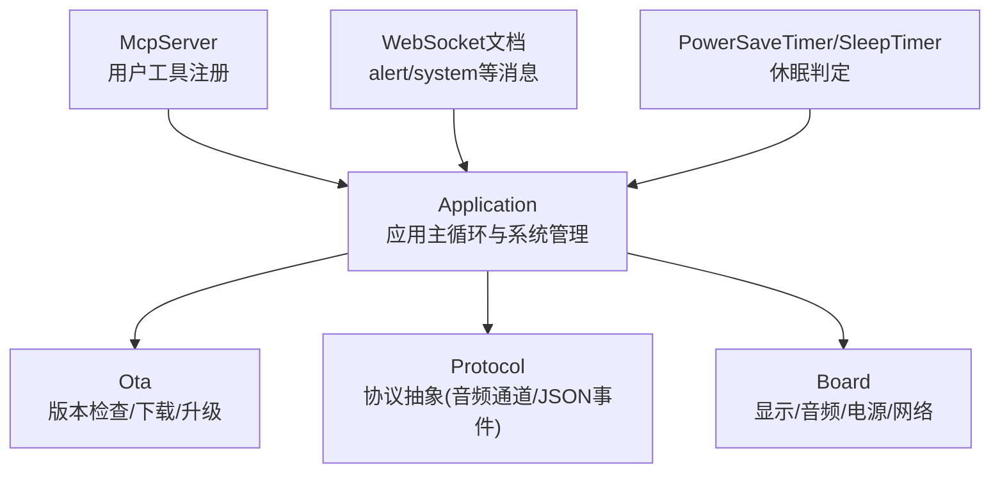
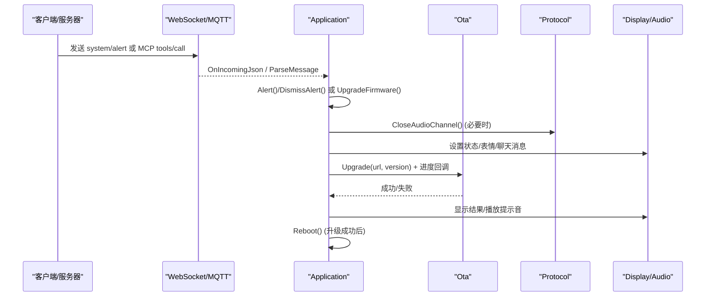
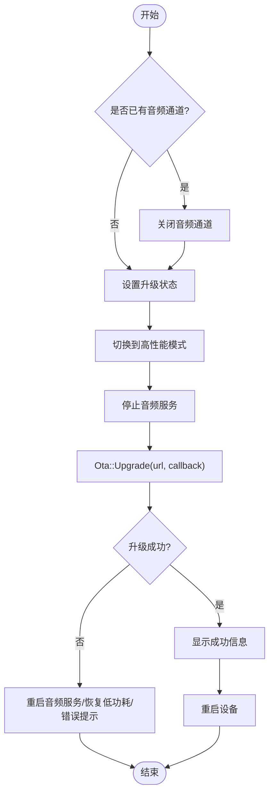
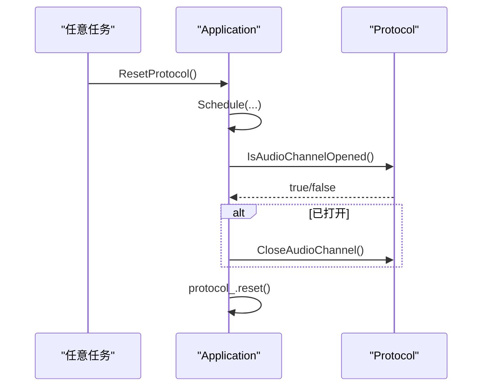
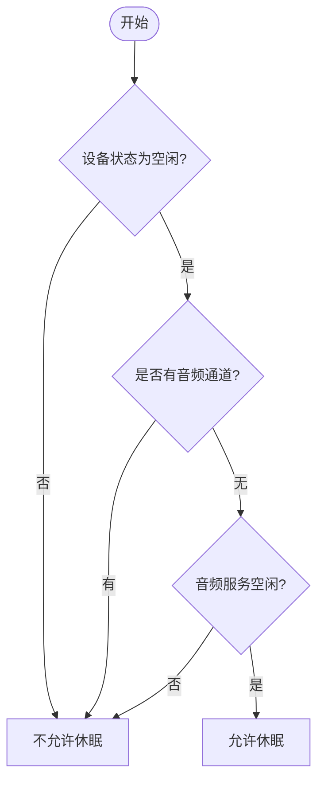
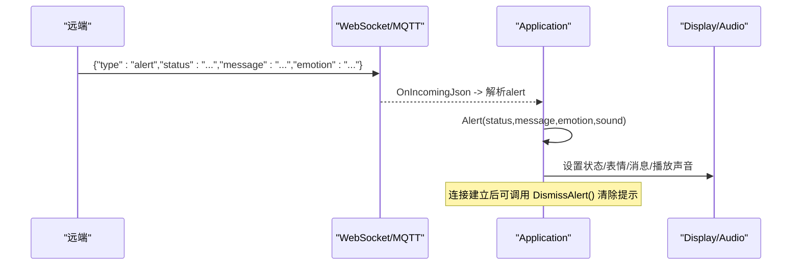
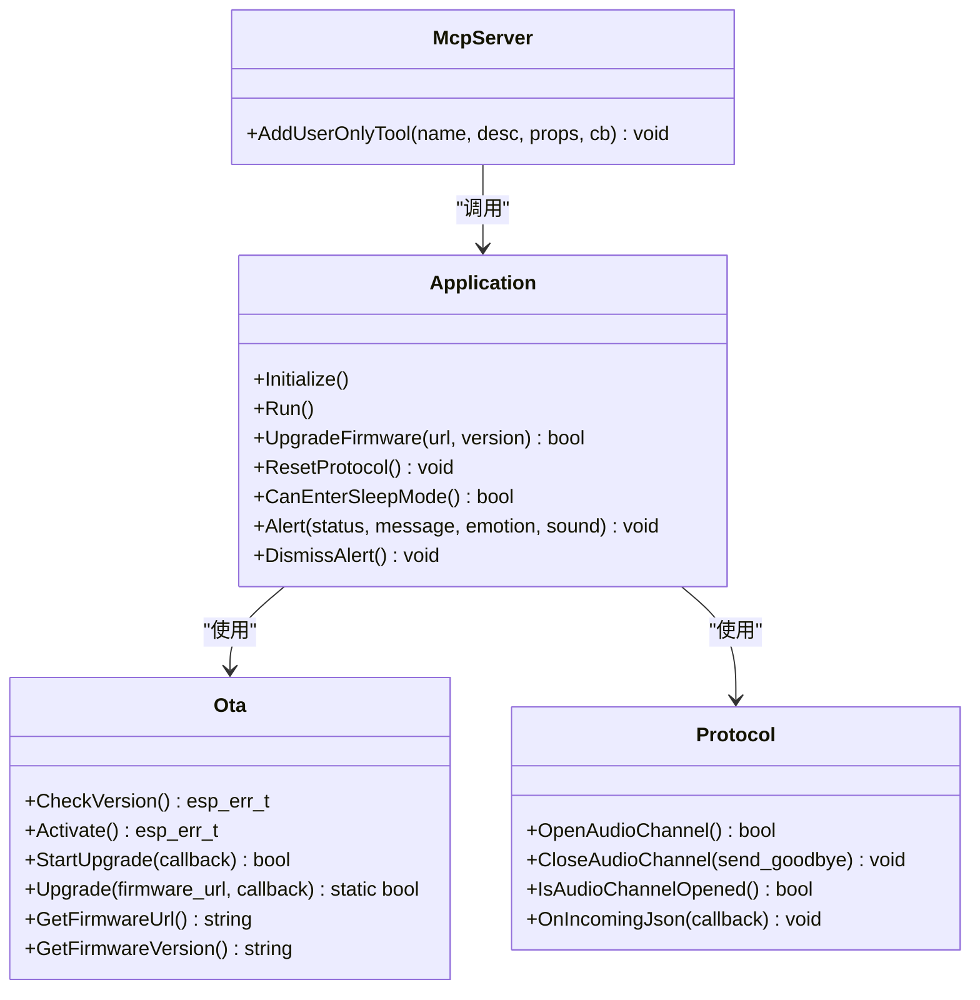

# 系统管理API

<cite>
**本文引用的文件**   
- [application.h](file://main/application.h)
- [application.cc](file://main/application.cc)
- [ota.h](file://main/ota.h)
- [protocol.h](file://main/protocols/protocol.h)
- [mcp_server.cc](file://main/mcp_server.cc)
- [websocket.md](file://docs/websocket.md)
- [power_save_timer.cc](file://main/boards/common/power_save_timer.cc)
- [sleep_timer.cc](file://main/boards/common/sleep_timer.cc)
</cite>

## 目录
1. [简介](#简介)
2. [项目结构](#项目结构)
3. [核心组件](#核心组件)
4. [架构总览](#架构总览)
5. [详细组件分析](#详细组件分析)
6. [依赖关系分析](#依赖关系分析)
7. [性能与电源管理](#性能与电源管理)
8. [故障排除指南](#故障排除指南)
9. [结论](#结论)
10. [附录：API定义](#附录api定义)

## 简介
本文件面向系统管理与运维，聚焦以下能力：
- 固件升级：通过 UpgradeFirmware() 指定固件URL与版本，提供下载进度反馈与失败恢复策略。
- 协议资源重置：ResetProtocol() 的调用时机、清理范围与线程安全保证。
- 休眠条件检查：CanEnterSleepMode() 的判断逻辑与使用场景。
- 状态提示机制：Alert()/DismissAlert() 的触发来源（含远程消息）、UI与音频联动。
- 资源释放策略、异常恢复机制与电源管理考虑。
- 最佳实践与常见问题排查。

## 项目结构
系统管理相关能力集中在应用层 Application 中，并通过 MCP 工具暴露给上层控制面；OTA 负责固件版本检查与下载；协议抽象用于关闭/打开音频通道与网络错误回调；电源管理由板级模块与定时器驱动。

图示来源
- [application.h:43-124](file://main/application.h#L43-L124)
- [application.cc:970-1132](file://main/application.cc#L970-L1132)
- [ota.h:10-56](file://main/ota.h#L10-L56)
- [protocol.h:44-95](file://main/protocols/protocol.h#L44-L95)
- [mcp_server.cc:150-169](file://main/mcp_server.cc#L150-L169)
- [websocket.md:274-290](file://docs/websocket.md#L274-L290)
- [power_save_timer.cc:63-63](file://main/boards/common/power_save_timer.cc#L63-L63)
- [sleep_timer.cc:67-67](file://main/boards/common/sleep_timer.cc#L67-L67)

章节来源
- [application.h:43-124](file://main/application.h#L43-L124)
- [application.cc:970-1132](file://main/application.cc#L970-L1132)
- [ota.h:10-56](file://main/ota.h#L10-L56)
- [protocol.h:44-95](file://main/protocols/protocol.h#L44-L95)
- [mcp_server.cc:150-169](file://main/mcp_server.cc#L150-L169)
- [websocket.md:274-290](file://docs/websocket.md#L274-L290)
- [power_save_timer.cc:63-63](file://main/boards/common/power_save_timer.cc#L63-L63)
- [sleep_timer.cc:67-67](file://main/boards/common/sleep_timer.cc#L67-L67)

## 核心组件
- Application：系统主控制器，封装设备状态机、事件分发、协议生命周期、升级流程、休眠判断、提示与资源释放。
- Ota：版本检查、激活、固件下载与安装接口，提供进度回调与版本信息查询。
- Protocol：协议抽象，统一音频通道与JSON消息处理，供具体实现（如MQTT/WebSocket）复用。
- McpServer：将系统管理能力以“用户工具”形式暴露，支持远程调用升级、重启等。
- 电源与休眠：PowerSaveTimer/SleepTimer 基于 CanEnterSleepMode() 决定是否进入低功耗。

章节来源
- [application.h:43-124](file://main/application.h#L43-L124)
- [ota.h:10-56](file://main/ota.h#L10-L56)
- [protocol.h:44-95](file://main/protocols/protocol.h#L44-L95)
- [mcp_server.cc:150-169](file://main/mcp_server.cc#L150-L169)
- [power_save_timer.cc:63-63](file://main/boards/common/power_save_timer.cc#L63-L63)
- [sleep_timer.cc:67-67](file://main/boards/common/sleep_timer.cc#L67-L67)

## 架构总览
系统管理API的关键路径如下：
- 远程侧通过 WebSocket/MQTT 发送 system/alert 或 MCP tools/call 指令。
- Application 解析并调度到对应方法（UpgradeFirmware/Alert/ResetProtocol 等）。
- 升级过程由 Ota::Upgrade 执行，回调进度更新UI。
- 协议资源在连接断开、配置切换或主动重置时进行清理。
- 休眠判定由定时器周期性调用 CanEnterSleepMode() 决定。

图示来源
- [application.cc:574-610](file://main/application.cc#L574-L610)
- [application.cc:641-660](file://main/application.cc#L641-L660)
- [application.cc:970-1022](file://main/application.cc#L970-L1022)
- [websocket.md:274-290](file://docs/websocket.md#L274-L290)
- [mcp_server.cc:150-169](file://main/mcp_server.cc#L150-L169)

## 详细组件分析

### 固件升级 API：UpgradeFirmware(url, version)
- 入口与参数
  - URL：固件二进制下载地址，字符串类型。
  - Version：可选版本号，用于显示与日志；为空时按“手动升级”处理。
- 行为与流程
  - 若存在已打开的音频通道，先关闭。
  - 进入升级状态，提升功耗等级，停止音频服务。
  - 调用 Ota::Upgrade 执行下载与安装，回调进度（百分比与速度），通过 UI 展示。
  - 失败：重启音频服务、恢复低功耗、弹出错误提示，返回 false。
  - 成功：显示成功信息，短暂延时后重启设备，返回 true。
- 进度监控
  - 通过回调中的 progress 与 speed 字段，定时刷新UI文本。
- 典型调用路径
  - 自动：CheckNewVersion() 发现新版本后调用。
  - 手动：MCP 工具 self.upgrade_firmware 传入 url 参数。

图示来源
- [application.cc:970-1022](file://main/application.cc#L970-L1022)
- [ota.h:23-29](file://main/ota.h#L23-L29)

章节来源
- [application.cc:970-1022](file://main/application.cc#L970-L1022)
- [ota.h:23-29](file://main/ota.h#L23-L29)
- [mcp_server.cc:150-169](file://main/mcp_server.cc#L150-L169)

### 协议资源重置：ResetProtocol()
- 功能
  - 关闭当前音频通道（若已打开）。
  - 释放协议对象，使后续可重新初始化。
- 线程安全
  - 通过 Schedule 在主任务队列中执行，避免跨任务竞争。
- 调用时机
  - 网络配置模式退出、重连前、或需要彻底重建协议上下文时。
  - 代码中在网络事件处理分支会调用 ResetProtocol()。

图示来源
- [application.cc:1121-1130](file://main/application.cc#L1121-L1130)
- [application.h:119-123](file://main/application.h#L119-L123)

章节来源
- [application.cc:1121-1130](file://main/application.cc#L1121-L1130)
- [application.h:119-123](file://main/application.h#L119-L123)

### 休眠条件检查：CanEnterSleepMode()
- 判断逻辑
  - 设备必须处于空闲态。
  - 无正在使用的音频通道。
  - 音频服务空闲。
- 使用方式
  - 电源/睡眠定时器周期性调用，满足条件则允许进入低功耗。

图示来源
- [application.cc:1057-1072](file://main/application.cc#L1057-L1072)
- [power_save_timer.cc:63-63](file://main/boards/common/power_save_timer.cc#L63-L63)
- [sleep_timer.cc:67-67](file://main/boards/common/sleep_timer.cc#L67-L67)

章节来源
- [application.cc:1057-1072](file://main/application.cc#L1057-L1072)
- [power_save_timer.cc:63-63](file://main/boards/common/power_save_timer.cc#L63-L63)
- [sleep_timer.cc:67-67](file://main/boards/common/sleep_timer.cc#L67-L67)

### 状态提示机制：Alert()/DismissAlert()
- Alert(status, message, emotion, sound)
  - 设置屏幕状态、表情与聊天消息，并可播放提示音。
  - 可由本地事件或远端 alert 消息触发。
- DismissAlert()
  - 当设备处于空闲态时，清除状态/表情/聊天消息，恢复待机界面。
- 远端触发
  - WebSocket/MQTT 的 alert 消息包含 status/message/emotion 字段，被解析后调用 Alert。

图示来源
- [application.cc:583-591](file://main/application.cc#L583-L591)
- [application.cc:641-660](file://main/application.cc#L641-L660)
- [websocket.md:274-290](file://docs/websocket.md#L274-L290)

章节来源
- [application.cc:583-591](file://main/application.cc#L583-L591)
- [application.cc:641-660](file://main/application.cc#L641-L660)
- [websocket.md:274-290](file://docs/websocket.md#L274-L290)

## 依赖关系分析
- Application 依赖：
  - Ota：获取版本信息与执行升级。
  - Protocol：音频通道与JSON事件处理。
  - Board：显示、音频、电源与网络能力。
  - McpServer：对外暴露系统管理工具。
- 外部消息来源：
  - WebSocket/MQTT 的 alert/system 消息。
  - MCP tools/call 的 self.upgrade_firmware 工具。

图示来源
- [application.h:43-124](file://main/application.h#L43-L124)
- [ota.h:10-56](file://main/ota.h#L10-L56)
- [protocol.h:44-95](file://main/protocols/protocol.h#L44-L95)
- [mcp_server.cc:150-169](file://main/mcp_server.cc#L150-L169)

章节来源
- [application.h:43-124](file://main/application.h#L43-L124)
- [ota.h:10-56](file://main/ota.h#L10-L56)
- [protocol.h:44-95](file://main/protocols/protocol.h#L44-L95)
- [mcp_server.cc:150-169](file://main/mcp_server.cc#L150-L169)

## 性能与电源管理
- 升级期间
  - 切换到高性能模式，确保下载与写入稳定。
  - 暂停音频服务，避免I/O冲突。
- 正常会话
  - 音频通道打开时提升性能，关闭后恢复低功耗。
- 休眠策略
  - 仅在空闲且无活动通道与音频任务时允许休眠。
  - 电源/睡眠定时器依据 CanEnterSleepMode() 决策。

章节来源
- [application.cc:970-1022](file://main/application.cc#L970-L1022)
- [application.cc:504-519](file://main/application.cc#L504-L519)
- [application.cc:1057-1072](file://main/application.cc#L1057-L1072)
- [power_save_timer.cc:63-63](file://main/boards/common/power_save_timer.cc#L63-L63)
- [sleep_timer.cc:67-67](file://main/boards/common/sleep_timer.cc#L67-L67)

## 故障排除指南
- 升级失败
  - 现象：显示错误提示，音频服务恢复运行，设备继续工作。
  - 排查：确认URL可达、存储空间充足、网络稳定；查看日志中的错误码与重试次数。
- 无法进入休眠
  - 现象：长时间不进入低功耗。
  - 排查：确认设备非空闲态、无音频通道、音频服务未忙碌；检查唤醒源或后台任务。
- 协议资源泄漏
  - 现象：频繁断连后状态异常。
  - 排查：在断连或配置切换处调用 ResetProtocol()，确保协议对象被释放并重建。
- 提示未清除
  - 现象：屏幕一直显示告警。
  - 排查：连接建立后应调用 DismissAlert()；或在空闲态下自动恢复。

章节来源
- [application.cc:970-1022](file://main/application.cc#L970-L1022)
- [application.cc:1121-1130](file://main/application.cc#L1121-L1130)
- [application.cc:641-660](file://main/application.cc#L641-L660)

## 结论
系统管理API围绕 Application 提供统一的升级、协议重置、休眠判断与提示机制。通过 MCP 与 WebSocket/MQTT 的消息通道，可在远端完成设备维护与状态管理。遵循本文的最佳实践与排障建议，可有效提升系统的稳定性与可维护性。

## 附录：API定义

### 固件升级：self.upgrade_firmware（MCP 工具）
- 名称：self.upgrade_firmware
- 描述：从指定URL下载并安装固件，完成后重启设备。
- 参数
  - url：字符串，固件二进制文件的下载地址。
- 返回值：布尔值，表示是否成功提交升级任务。
- 说明
  - 内部调用 Application::UpgradeFirmware(url)。
  - 升级过程中可通过进度回调更新UI。
  - 成功后设备将重启。

章节来源
- [mcp_server.cc:150-169](file://main/mcp_server.cc#L150-L169)
- [application.cc:970-1022](file://main/application.cc#L970-L1022)

### 系统命令：system.reboot（WebSocket/MQTT）
- 类型：system
- 命令：reboot
- 作用：重启设备。
- 示例字段：session_id、type、command。

章节来源
- [websocket.md:261-273](file://docs/websocket.md#L261-L273)
- [application.cc:574-582](file://main/application.cc#L574-L582)

### 告警消息：alert（WebSocket/MQTT）
- 类型：alert
- 字段
  - status：短标题，显示于屏幕状态栏。
  - message：详细信息，显示于聊天区域。
  - emotion：情绪图标，影响UI表情。
- 行为：调用 Alert() 设置UI与可选提示音。

章节来源
- [websocket.md:274-290](file://docs/websocket.md#L274-L290)
- [application.cc:583-591](file://main/application.cc#L583-L591)
- [application.cc:641-660](file://main/application.cc#L641-L660)

### 协议重置：ResetProtocol()
- 作用：关闭音频通道并释放协议对象。
- 线程安全：通过主任务队列调度执行。
- 适用场景：网络配置切换、重连前、异常恢复。

章节来源
- [application.cc:1121-1130](file://main/application.cc#L1121-L1130)
- [application.h:119-123](file://main/application.h#L119-L123)

### 休眠条件：CanEnterSleepMode()
- 条件
  - 设备空闲。
  - 无音频通道。
  - 音频服务空闲。
- 用途：电源/睡眠定时器据此决定是否进入低功耗。

章节来源
- [application.cc:1057-1072](file://main/application.cc#L1057-L1072)
- [power_save_timer.cc:63-63](file://main/boards/common/power_save_timer.cc#L63-L63)
- [sleep_timer.cc:67-67](file://main/boards/common/sleep_timer.cc#L67-L67)