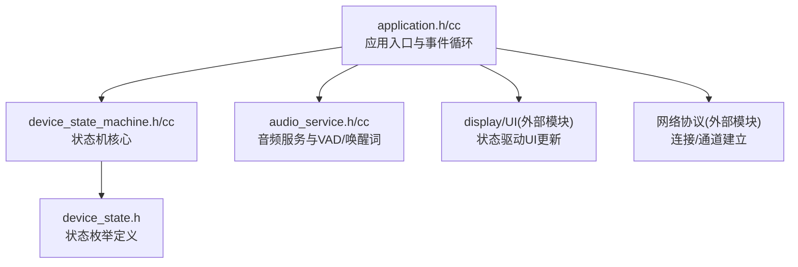
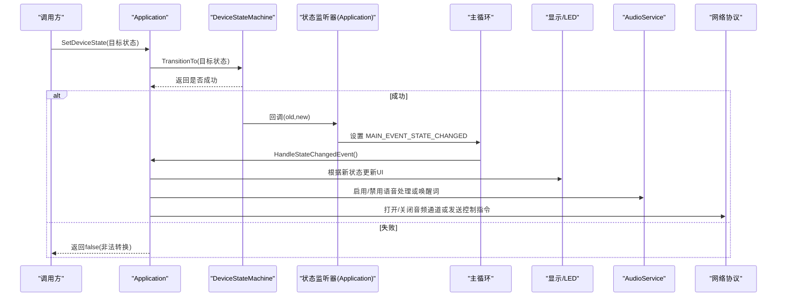
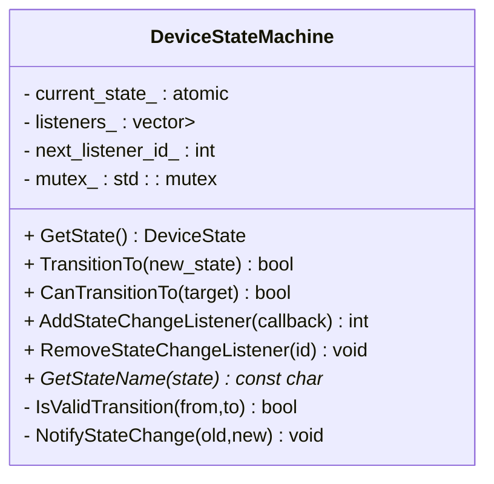
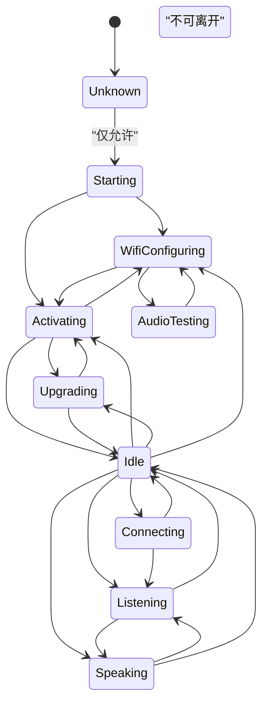
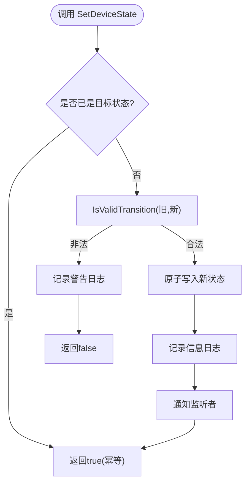
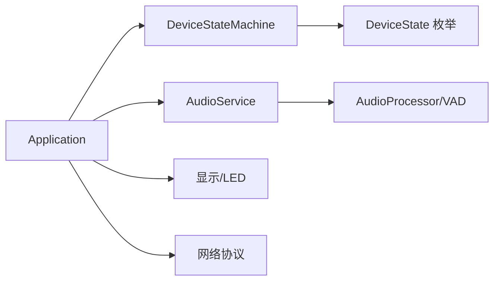

# 设备状态管理API

<cite>
**本文引用的文件列表**
- [device_state.h](file://main/device_state.h)
- [device_state_machine.h](file://main/device_state_machine.h)
- [device_state_machine.cc](file://main/device_state_machine.cc)
- [application.h](file://main/application.h)
- [application.cc](file://main/application.cc)
- [audio_service.h](file://main/audio/audio_service.h)
- [audio_service.cc](file://main/audio/audio_service.cc)
</cite>

## 目录
1. [简介](#简介)
2. [项目结构](#项目结构)
3. [核心组件](#核心组件)
4. [架构总览](#架构总览)
5. [详细组件分析](#详细组件分析)
6. [依赖关系分析](#依赖关系分析)
7. [性能与并发特性](#性能与并发特性)
8. [故障排查指南](#故障排查指南)
9. [结论](#结论)
10. [附录：最佳实践与常见场景](#附录最佳实践与常见场景)

## 简介
本文件面向开发者，系统化梳理设备状态管理API的设计与实现，覆盖以下要点：
- DeviceState枚举的所有状态值及其业务含义
- 状态机工作原理、合法转换规则与错误处理策略
- SetDeviceState()调用方式与验证机制
- GetDeviceState()查询接口与IsVoiceDetected()语音检测功能
- 事件处理机制（状态变更回调、主循环事件分发）
- 典型使用场景与最佳实践

## 项目结构
与设备状态管理相关的核心代码位于 main 目录下，关键文件如下：
- 状态定义：device_state.h
- 状态机实现：device_state_machine.h / device_state_machine.cc
- 应用层封装：application.h / application.cc
- 语音检测能力：audio_service.h / audio_service.cc

图表来源
- [application.h:1-194](file://main/application.h#L1-L194)
- [application.cc:50-249](file://main/application.cc#L50-L249)
- [device_state_machine.h:1-84](file://main/device_state_machine.h#L1-L84)
- [device_state_machine.cc:1-162](file://main/device_state_machine.cc#L1-L162)
- [device_state.h:1-18](file://main/device_state.h#L1-L18)
- [audio_service.h:1-195](file://main/audio/audio_service.h#L1-L195)
- [audio_service.cc:91-124](file://main/audio/audio_service.cc#L91-L124)

章节来源
- [device_state.h:1-18](file://main/device_state.h#L1-L18)
- [device_state_machine.h:1-84](file://main/device_state_machine.h#L1-L84)
- [device_state_machine.cc:1-162](file://main/device_state_machine.cc#L1-L162)
- [application.h:1-194](file://main/application.h#L1-L194)
- [application.cc:50-249](file://main/application.cc#L50-L249)
- [audio_service.h:1-195](file://main/audio/audio_service.h#L1-L195)
- [audio_service.cc:91-124](file://main/audio/audio_service.cc#L91-L124)

## 核心组件
- 状态枚举 DeviceState：集中定义所有设备状态常量，作为状态机的唯一数据源。
- 状态机 DeviceStateMachine：负责状态存储、合法性校验、原子切换与观察者通知。
- 应用层 Application：对外暴露 SetDeviceState()/GetDeviceState()/IsVoiceDetected() 等便捷API，并订阅状态变化以驱动UI与音频/网络流程。
- 音频服务 AudioService：提供 IsVoiceDetected() 的底层实现，基于VAD结果维护 voice_detected_ 标志位。

章节来源
- [device_state.h:4-16](file://main/device_state.h#L4-L16)
- [device_state_machine.h:17-81](file://main/device_state_machine.h#L17-L81)
- [device_state_machine.cc:34-102](file://main/device_state_machine.cc#L34-L102)
- [application.h:67-75](file://main/application.h#L67-L75)
- [audio_service.h:116](file://main/audio/audio_service.h#L116)
- [audio_service.cc:105-110](file://main/audio/audio_service.cc#L105-L110)

## 架构总览
状态机采用“单一事实来源”设计：当前状态由 DeviceStateMachine 内部原子变量保存；所有状态变更必须通过 TransitionTo() 进行，并在成功时触发观察者回调；Application 在初始化阶段注册回调，将状态变化转换为事件，在主循环中统一处理，从而联动UI、音频和网络子系统。

图表来源
- [application.cc:56-59](file://main/application.cc#L56-L59)
- [device_state_machine.cc:108-131](file://main/device_state_machine.cc#L108-L131)
- [application.cc:88-91](file://main/application.cc#L88-L91)
- [application.cc:204-206](file://main/application.cc#L204-L206)
- [application.cc:876-931](file://main/application.cc#L876-L931)

## 详细组件分析

### 状态枚举与语义
- kDeviceStateUnknown：未知初始态，仅允许进入 Starting。
- kDeviceStateStarting：启动阶段，可进入 WiFi配置 或 激活。
- kDeviceStateWifiConfiguring：WiFi配网中，可进入 激活 或 音频测试。
- kDeviceStateAudioTesting：音频自检，可回退至 WiFi配置。
- kDeviceStateActivating：激活流程，可进入 升级、空闲 或 回退至 WiFi配置。
- kDeviceStateUpgrading：固件升级，可进入 空闲 或 激活。
- kDeviceStateIdle：空闲态，是交互的核心枢纽，可进入 连接、监听、说话、激活、升级、WiFi配置。
- kDeviceStateConnecting：连接中，成功进入 监听，失败回到 空闲。
- kDeviceStateListening：监听中，可进入 说话 或 空闲。
- kDeviceStateSpeaking：说话中，可进入 监听 或 空闲。
- kDeviceStateFatalError：致命错误态，不可再转换出该状态。

章节来源
- [device_state.h:4-16](file://main/device_state.h#L4-L16)
- [device_state_machine.cc:34-102](file://main/device_state_machine.cc#L34-L102)

### 状态机类与方法
- GetState()：线程安全地读取当前状态。
- CanTransitionTo(target)：在不改变状态的前提下判断是否允许转换。
- TransitionTo(new_state)：执行一次带校验的状态切换，成功后记录日志并通知监听者。
- AddStateChangeListener()/RemoveStateChangeListener()：注册/移除状态变更回调。
- GetStateName(state)：用于日志输出的状态名映射。

图表来源
- [device_state_machine.h:17-81](file://main/device_state_machine.h#L17-L81)
- [device_state_machine.cc:24-32](file://main/device_state_machine.cc#L24-L32)
- [device_state_machine.cc:108-131](file://main/device_state_machine.cc#L108-L131)
- [device_state_machine.cc:133-161](file://main/device_state_machine.cc#L133-L161)

章节来源
- [device_state_machine.h:17-81](file://main/device_state_machine.h#L17-L81)
- [device_state_machine.cc:108-131](file://main/device_state_machine.cc#L108-L131)

### 状态转换图（基于实现）

图表来源
- [device_state_machine.cc:34-102](file://main/device_state_machine.cc#L34-L102)

### SetDeviceState() 调用方式与验证机制
- 调用入口：Application::SetDeviceState() 直接委托给 state_machine_.TransitionTo()。
- 验证机制：TransitionTo() 内部先判断新旧状态是否相同（幂等），随后调用 IsValidTransition() 校验；若非法则记录警告并返回 false；合法则原子写入新状态、记录日志并触发观察者回调。
- 线程模型：状态为原子变量，避免竞态；观察者回调在 TransitionTo() 调用上下文中同步执行，随后 Application 通过事件组将状态变更投递到主循环统一处理。

图表来源
- [application.cc:56-59](file://main/application.cc#L56-L59)
- [device_state_machine.cc:108-131](file://main/device_state_machine.cc#L108-L131)
- [device_state_machine.cc:34-102](file://main/device_state_machine.cc#L34-L102)

章节来源
- [application.cc:56-59](file://main/application.cc#L56-L59)
- [device_state_machine.cc:108-131](file://main/device_state_machine.cc#L108-L131)

### GetDeviceState() 查询接口
- 行为：直接返回状态机中的当前状态，线程安全。
- 用途：在多处逻辑分支中用于决策，例如唤醒词处理、VAD联动、错误恢复等。

章节来源
- [application.h:67](file://main/application.h#L67)
- [device_state_machine.h:29](file://main/device_state_machine.h#L29)

### IsVoiceDetected() 语音检测功能
- 路径：Application::IsVoiceDetected() -> AudioService::IsVoiceDetected() -> 成员变量 voice_detected_。
- 更新时机：AudioProcessor 的 VAD 输出回调会更新 voice_detected_，并通过 on_vad_change 回调上报；Application 在收到 MAIN_EVENT_VAD_CHANGE 后，若处于监听态，会驱动LED等外设响应。
- 注意：IsVoiceDetected() 反映的是最近一次VAD结果，属于瞬时状态，适合用于短时逻辑判断。

章节来源
- [application.h:68](file://main/application.h#L68)
- [audio_service.h:116](file://main/audio/audio_service.h#L116)
- [audio_service.cc:105-110](file://main/audio/audio_service.cc#L105-L110)
- [application.cc:232-237](file://main/application.cc#L232-L237)

### 事件处理机制与状态联动
- 状态变更回调：在 Initialize() 中注册，一旦状态机发生转换，即设置 MAIN_EVENT_STATE_CHANGED。
- 主循环处理：Run() 等待事件，当检测到 MAIN_EVENT_STATE_CHANGED 时，调用 HandleStateChangedEvent()，在该函数内根据新状态：
  - 更新UI文本与表情
  - 控制音频处理开关（EnableVoiceProcessing）
  - 控制唤醒词检测开关（EnableWakeWordDetection）
  - 必要时发送协议命令（如开始监听）
- 其他事件：网络事件、唤醒词检测、VAD变化、定时器等均通过事件组分发，保证单线程顺序处理，避免竞争。

章节来源
- [application.cc:88-91](file://main/application.cc#L88-L91)
- [application.cc:165-249](file://main/application.cc#L165-L249)
- [application.cc:876-931](file://main/application.cc#L876-L931)

### 错误处理策略
- 非法状态转换：TransitionTo() 记录警告日志并返回 false，调用方可据此采取重试或降级策略。
- 致命错误态：kDeviceStateFatalError 不允许任何出边，系统应在此状态下停止常规交互，等待外部干预或重启。
- 运行时错误：主循环捕获 MAIN_EVENT_ERROR 后将状态复位为空闲，并弹出告警提示。

章节来源
- [device_state_machine.cc:117-121](file://main/device_state_machine.cc#L117-L121)
- [device_state_machine.cc:95-97](file://main/device_state_machine.cc#L95-L97)
- [application.cc:187-190](file://main/application.cc#L187-L190)

## 依赖关系分析
- Application 依赖 DeviceStateMachine 完成状态管理，依赖 AudioService 获取语音检测结果。
- DeviceStateMachine 依赖 DeviceState 枚举与 ESP-IDF 日志。
- AudioService 依赖音频编解码与VAD/WakeWord模块，向 Application 提供 IsVoiceDetected() 与相关事件。

图表来源
- [application.h:1-194](file://main/application.h#L1-L194)
- [device_state_machine.h:1-84](file://main/device_state_machine.h#L1-L84)
- [audio_service.h:1-195](file://main/audio/audio_service.h#L1-L195)

章节来源
- [application.h:1-194](file://main/application.h#L1-L194)
- [device_state_machine.h:1-84](file://main/device_state_machine.h#L1-L84)
- [audio_service.h:1-195](file://main/audio/audio_service.h#L1-L195)

## 性能与并发特性
- 原子状态：current_state_ 使用原子类型，读操作无锁，写操作在 TransitionTo() 中串行化，避免竞态。
- 观察者通知：NotifyStateChange() 拷贝回调列表后逐个调用，减少持有互斥锁的时间，降低阻塞风险。
- 主循环事件：所有跨模块副作用（UI、音频、网络）均在主循环中顺序执行，避免多线程复杂同步。
- 建议：在状态回调中避免耗时操作；如需长时间任务，使用 Application::Schedule() 提交到主循环。

[本节为通用指导，不直接分析具体文件]

## 故障排查指南
- 现象：状态无法切换到预期目标
  - 检查当前状态与目标状态是否符合转换规则
  - 查看状态机日志（警告级别）确认是否被判定为非法转换
- 现象：进入监听态后无语音检测反馈
  - 确认 EnableVoiceProcessing(true) 已调用
  - 检查 IsVoiceDetected() 返回值与 LED 联动是否正常
- 现象：异常后设备卡死
  - 检查是否进入 FatalError 态（不可自动恢复）
  - 观察主循环是否仍在处理事件

章节来源
- [device_state_machine.cc:117-121](file://main/device_state_machine.cc#L117-L121)
- [application.cc:232-237](file://main/application.cc#L232-L237)
- [device_state_machine.cc:95-97](file://main/device_state_machine.cc#L95-L97)

## 结论
本状态管理方案通过“强约束的状态机+观察者模式+主循环事件分发”，实现了清晰、可追踪且线程安全的设备状态流转。结合 IsVoiceDetected() 提供的实时语音检测能力，上层可在监听/说话等交互态下做出快速响应。遵循本文的最佳实践与常见场景示例，可有效提升系统的稳定性与可维护性。

[本节为总结性内容，不直接分析具体文件]

## 附录：最佳实践与常见场景

### 最佳实践
- 始终通过 SetDeviceState() 发起状态变更，不要直接修改内部状态。
- 在状态回调中只做轻量操作，耗时任务使用 Schedule() 提交。
- 对非法转换做防御性处理，必要时回退到空闲态并提示用户。
- 在监听态开启语音处理，在说话态按需关闭，避免资源冲突。
- 使用 IsVoiceDetected() 做短时判断，不做长期状态依据。

[本节为通用指导，不直接分析具体文件]

### 常见使用场景示例（步骤说明）
- 唤醒词触发并进入对话
  1) 空闲态检测到唤醒词
  2) 若未建立音频通道，则请求连接到连接态
  3) 连接成功后进入监听态，发送开始监听指令，启用语音处理
  4) 服务端返回TTS后进入说话态，播放完成后回到监听态
- 手动按键开始/结束对话
  1) 空闲态请求进入监听态
  2) 监听过程中可中断说话或主动结束，回到空闲态
- 网络断开恢复
  1) 监听/说话态检测到网络断开，清理资源并回到空闲态
  2) 网络重连后重新走激活/连接流程

章节来源
- [application.cc:781-813](file://main/application.cc#L781-L813)
- [application.cc:876-931](file://main/application.cc#L876-L931)
- [application.cc:187-190](file://main/application.cc#L187-L190)