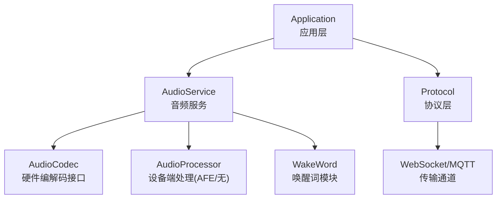
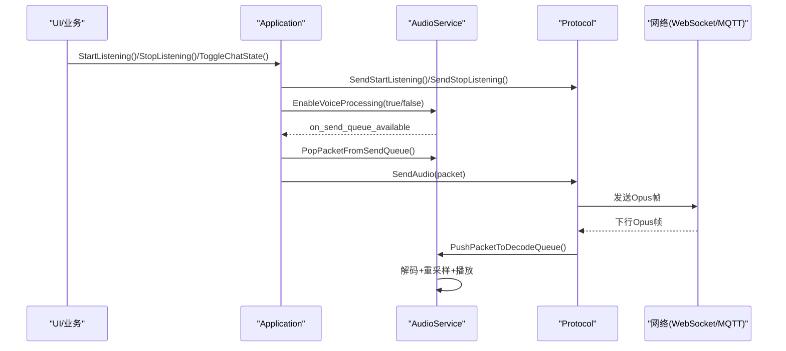
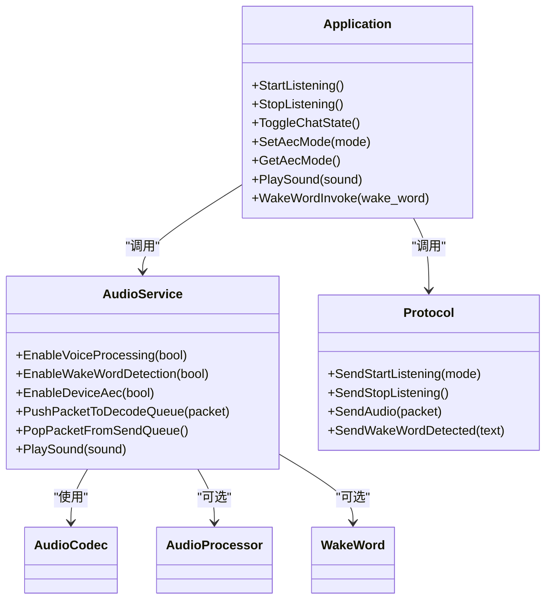

# 音频控制API

<cite>
**本文引用的文件列表**
- [application.h](file://main/application.h)
- [application.cc](file://main/application.cc)
- [audio_service.h](file://main/audio/audio_service.h)
- [audio_service.cc](file://main/audio/audio_service.cc)
- [protocol.cc](file://main/protocols/protocol.cc)
- [websocket.md](file://docs/websocket.md)
- [afe_audio_processor.cc](file://main/audio/processors/afe_audio_processor.cc)
- [no_audio_processor.cc](file://main/audio/processors/no_audio_processor.cc)
</cite>

## 目录
1. [简介](#简介)
2. [项目结构](#项目结构)
3. [核心组件](#核心组件)
4. [架构总览](#架构总览)
5. [详细组件分析](#详细组件分析)
6. [依赖关系分析](#依赖关系分析)
7. [性能与调优建议](#性能与调优建议)
8. [故障排查指南](#故障排查指南)
9. [结论](#结论)
10. [附录：使用示例与最佳实践](#附录使用示例与最佳实践)

## 简介
本文件面向开发者，系统化梳理并记录小智 ESP32 项目的“音频控制 API”，重点覆盖以下能力：
- 监听控制：StartListening()、StopListening()、ToggleChatState()
- 回声消除模式：AecMode 枚举（kAecOff、kAecOnDeviceSide、kAecOnServerSide）的配置与切换
- 音效播放：PlaySound()
- 唤醒词调用：WakeWordInvoke()
- 音频服务集成方式、监听模式配置选项、音频资源加载机制
- 完整使用示例与性能调优建议

## 项目结构
本项目将“应用层状态机”、“音频服务”、“协议层”解耦。音频控制 API 主要位于 Application 层，内部委托 AudioService 完成编解码、任务调度、队列管理、设备 AEC 开关等；协议层负责向服务器发送 listen/start/stop 等 JSON 指令。

图表来源
- [application.h:85-125](file://main/application.h#L85-L125)
- [audio_service.h:105-136](file://main/audio/audio_service.h#L105-L136)
- [protocol.cc:57-74](file://main/protocols/protocol.cc#L57-L74)

章节来源
- [application.h:85-125](file://main/application.h#L85-L125)
- [audio_service.h:105-136](file://main/audio/audio_service.h#L105-L136)
- [protocol.cc:57-74](file://main/protocols/protocol.cc#L57-L74)

## 核心组件
- Application：对外暴露音频控制 API，维护设备状态机，协调音频服务与协议层。
- AudioService：封装音频采集、编码、解码、播放、唤醒词检测、设备 AEC 开关、OGG 音效播放等。
- Protocol：封装与服务器交互的 JSON 消息（listen start/stop、abort、wake word detected）。

章节来源
- [application.h:85-125](file://main/application.h#L85-L125)
- [audio_service.h:105-136](file://main/audio/audio_service.h#L105-L136)
- [protocol.cc:57-74](file://main/protocols/protocol.cc#L57-L74)

## 架构总览
下图展示从上层 API 到音频数据流与网络消息的整体流程。

图表来源
- [application.cc:666-778](file://main/application.cc#L666-L778)
- [audio_service.cc:506-529](file://main/audio/audio_service.cc#L506-L529)
- [protocol.cc:57-74](file://main/protocols/protocol.cc#L57-L74)

## 详细组件分析

### 监听控制 API
- StartListening()
  - 作用：进入或恢复“监听中”状态，必要时打开音频通道，发送 listen start 消息，启动设备端语音处理。
  - 行为要点：
    - 若处于空闲且未建立音频通道，则先切换到连接态，异步打开通道后再设置监听模式。
    - 若正在说话，先中止 TTS，再进入监听。
    - 在监听态下，根据默认监听模式选择自动停止或实时模式。
  - 关键路径参考：[application.cc:732-763](file://main/application.cc#L732-L763)

- StopListening()
  - 作用：结束当前监听，发送 listen stop 消息，回到空闲态。
  - 关键路径参考：[application.cc:765-778](file://main/application.cc#L765-L778)

- ToggleChatState()
  - 作用：事件驱动的聊天状态切换。空闲时尝试打开通道并进入监听；说话时中止 TTS；监听中关闭音频通道。
  - 关键路径参考：[application.cc:662-711](file://main/application.cc#L662-L711)

- 监听模式与默认策略
  - 默认监听模式由 AecMode 决定：当 AecMode 为 kAecOff 时，默认采用“自动停止”模式；否则采用“实时”模式。
  - 参考：[application.cc:955-957](file://main/application.cc#L955-L957)

- 协议侧消息
  - SendStartListening(mode) 会生成 type=listen, state=start, mode=auto/manual/realtime 的 JSON。
  - SendStopListening() 会生成 type=listen, state=stop 的 JSON。
  - 参考：[protocol.cc:57-74](file://main/protocols/protocol.cc#L57-L74)、[websocket.md:156-171](file://docs/websocket.md#L156-L171)

章节来源
- [application.cc:662-778](file://main/application.cc#L662-L778)
- [protocol.cc:57-74](file://main/protocols/protocol.cc#L57-L74)
- [websocket.md:156-171](file://docs/websocket.md#L156-L171)

### 回声消除模式 AecMode
- 枚举定义
  - kAecOff：关闭设备端 AEC，默认监听模式为“自动停止”。
  - kAecOnDeviceSide：启用设备端 AEC（需要 AFE 支持），默认监听模式为“实时”。
  - kAecOnServerSide：不启用设备端 AEC，交由服务端处理，默认监听模式为“实时”。
  - 参考：[application.h:37-41](file://main/application.h#L37-L41)

- 初始化默认值
  - 通过编译宏 CONFIG_USE_DEVICE_AEC / CONFIG_USE_SERVER_AEC 决定初始 aec_mode_。
  - 参考：[application.cc:26-34](file://main/application.cc#L26-L34)

- 运行时切换
  - SetAecMode(mode)：更新 aec_mode_，调度执行：
    - 关闭/开启设备端 AEC（调用 AudioService::EnableDeviceAec）。
    - 显示通知提示。
    - 若已有音频通道，则关闭以生效新策略。
  - 参考：[application.cc:1090-1115](file://main/application.cc#L1090-L1115)

- 设备端 AEC 实现
  - AudioService::EnableDeviceAec(enable) 会确保处理器已初始化，然后转发给具体处理器。
  - AfeAudioProcessor::EnableDeviceAec(enable)：在支持的设备上启用/禁用 AEC，同时切换 VAD 开关。
  - NoAudioProcessor::EnableDeviceAec(enable)：不支持，打印错误日志。
  - 参考：
    - [audio_service.cc:619-627](file://main/audio/audio_service.cc#L619-L627)
    - [afe_audio_processor.cc:189-201](file://main/audio/processors/afe_audio_processor.cc#L189-L201)
    - [no_audio_processor.cc:67-71](file://main/audio/processors/no_audio_processor.cc#L67-L71)

章节来源
- [application.h:37-41](file://main/application.h#L37-L41)
- [application.cc:26-34](file://main/application.cc#L26-L34)
- [application.cc:1090-1115](file://main/application.cc#L1090-L1115)
- [audio_service.cc:619-627](file://main/audio/audio_service.cc#L619-L627)
- [afe_audio_processor.cc:189-201](file://main/audio/processors/afe_audio_processor.cc#L189-L201)
- [no_audio_processor.cc:67-71](file://main/audio/processors/no_audio_processor.cc#L67-L71)

### PlaySound() 音效播放
- 入口
  - Application::PlaySound(sound) 直接转发至 AudioService::PlaySound(sound)。
  - 参考：[application.cc:1117-1119](file://main/application.cc#L1117-L1119)

- 内部流程
  - 若输出未启用，则先启用输出。
  - 使用 OggDemuxer 解析内嵌 OGG 资源，回调中将 Opus 帧打包入解码队列。
  - 解码任务取出后按目标采样率解码并重采样，最终写入播放器。
  - 参考：[audio_service.cc:633-654](file://main/audio/audio_service.cc#L633-L654)

- 典型触发点
  - 激活成功、进入监听、唤醒词打断等场景会播放提示音。
  - 参考：
    - [application.cc:318-321](file://main/application.cc#L318-L321)
    - [application.cc:810-813](file://main/application.cc#L810-L813)
    - [application.cc:908-912](file://main/application.cc#L908-L912)

章节来源
- [application.cc:1117-1119](file://main/application.cc#L1117-L1119)
- [audio_service.cc:633-654](file://main/audio/audio_service.cc#L633-L654)
- [application.cc:318-321](file://main/application.cc#L318-L321)
- [application.cc:810-813](file://main/application.cc#L810-L813)
- [application.cc:908-912](file://main/application.cc#L908-L912)

### WakeWordInvoke() 唤醒词调用
- 入口
  - Application::WakeWordInvoke(wake_word)：用于外部主动触发唤醒流程（例如按键或 UI 操作）。
  - 参考：[application.cc:1024-1055](file://main/application.cc#L1024-L1055)

- 自动唤醒流程
  - 当本地唤醒词检测到触发时，AudioService 回调 Application，后者根据当前状态：
    - 空闲：编码唤醒片段，必要时打开音频通道，继续 ContinueWakeWordInvoke。
    - 说话/监听：中止当前 TTS，清理发送队列，重新进入监听并播放提示音。
  - 参考：
    - [application.cc:780-824](file://main/application.cc#L780-L824)
    - [application.cc:826-858](file://main/application.cc#L826-L858)

- 唤醒词模块
  - AudioService 根据模型清单动态选择 AFE 或自定义唤醒词实现，并在检测到唤醒词时回调上层。
  - 参考：
    - [audio_service.cc:700-726](file://main/audio/audio_service.cc#L700-L726)
    - [wake_word.h:11-24](file://main/audio/wake_word.h#L11-L24)

- 协议侧上报
  - 可选择发送 wake word 的 Opus 片段与服务端进行声纹校验，随后发送“检测到唤醒词”的 JSON。
  - 参考：[protocol.cc:51-55](file://main/protocols/protocol.cc#L51-L55)

章节来源
- [application.cc:780-858](file://main/application.cc#L780-L858)
- [application.cc:1024-1055](file://main/application.cc#L1024-L1055)
- [audio_service.cc:700-726](file://main/audio/audio_service.cc#L700-L726)
- [wake_word.h:11-24](file://main/audio/wake_word.h#L11-L24)
- [protocol.cc:51-55](file://main/protocols/protocol.cc#L51-L55)

### 音频服务集成与任务模型
- 任务划分
  - 输入任务：读取麦克风 PCM，喂给唤醒词/语音处理器。
  - 输出任务：从播放队列取 PCM 输出到扬声器。
  - 编解码任务：对上行 PCM 进行 Opus 编码放入发送队列；对下行 Opus 解码放入播放队列。
  - 参考：[audio_service.cc:125-167](file://main/audio/audio_service.cc#L125-L167)

- 队列与背压
  - 发送/解码/播放队列均有上限，避免内存暴涨；编码器/解码器任务受队列长度保护。
  - 参考：
    - [audio_service.h:40-46](file://main/audio/audio_service.h#L40-L46)
    - [audio_service.cc:327-446](file://main/audio/audio_service.cc#L327-L446)

- 电源管理
  - 周期性检查最近 I/O 时间，长时间无活动则关闭输入/输出以降低功耗。
  - 参考：[audio_service.cc:682-698](file://main/audio/audio_service.cc#L682-L698)

章节来源
- [audio_service.cc:125-167](file://main/audio/audio_service.cc#L125-L167)
- [audio_service.h:40-46](file://main/audio/audio_service.h#L40-L46)
- [audio_service.cc:327-446](file://main/audio/audio_service.cc#L327-L446)
- [audio_service.cc:682-698](file://main/audio/audio_service.cc#L682-L698)

## 依赖关系分析
- Application 依赖 AudioService 提供音频能力，依赖 Protocol 进行网络通信。
- AudioService 依赖 AudioCodec（硬件抽象）、AudioProcessor（可选 AFE）、WakeWord（唤醒词实现）。
- Protocol 仅关注 JSON 消息与传输，不关心音频细节。

图表来源
- [application.h:85-125](file://main/application.h#L85-L125)
- [audio_service.h:105-136](file://main/audio/audio_service.h#L105-L136)
- [protocol.cc:57-74](file://main/protocols/protocol.cc#L57-L74)

章节来源
- [application.h:85-125](file://main/application.h#L85-L125)
- [audio_service.h:105-136](file://main/audio/audio_service.h#L105-L136)
- [protocol.cc:57-74](file://main/protocols/protocol.cc#L57-L74)

## 性能与调优建议
- 合理选择 AecMode
  - 有 AFE 支持且环境噪声较大时，优先使用 kAecOnDeviceSide，可降低误检并提升远讲质量。
  - 在无 AFE 或需服务端统一处理时，使用 kAecOnServerSide。
  - 参考：[application.cc:1090-1115](file://main/application.cc#L1090-L1115)

- 监听模式匹配
  - kAecOff 默认“自动停止”，适合简单对话；实时模式更适合连续对话与低延迟场景。
  - 参考：[application.cc:955-957](file://main/application.cc#L955-L957)

- 队列与缓冲
  - 保持发送/解码/播放队列容量适中，避免阻塞或丢包。
  - 参考：[audio_service.h:40-46](file://main/audio/audio_service.h#L40-L46)

- 采样率与重采样
  - 设备输出采样率与服务器不一致时会触发重采样，尽量保持一致以减少失真。
  - 参考：[application.cc:504-510](file://main/application.cc#L504-L510)

- 唤醒词与语音处理互斥
  - 在切换唤醒词与语音处理时，AudioService 会重置输入重采样器以避免缓存溢出。
  - 参考：[audio_service.cc:563-576](file://main/audio/audio_service.cc#L563-L576)

- 电源管理
  - 长时间无 I/O 会自动关闭输入/输出，降低功耗；频繁唤醒可考虑调整超时阈值或保持 duplex 时的 TX 时钟。
  - 参考：[audio_service.cc:682-698](file://main/audio/audio_service.cc#L682-L698)

## 故障排查指南
- 无法进入监听
  - 检查是否已初始化协议与音频服务；确认音频通道是否打开。
  - 参考：[application.cc:732-763](file://main/application.cc#L732-L763)

- 听不到提示音
  - 确认输出已启用；检查 OGG 资源是否存在；查看解码队列是否被填满。
  - 参考：[audio_service.cc:633-654](file://main/audio/audio_service.cc#L633-L654)

- 唤醒词无效
  - 确认唤醒词模型已加载；检查是否在运行唤醒词检测；核对回调链路。
  - 参考：[audio_service.cc:700-726](file://main/audio/audio_service.cc#L700-L726)

- AEC 切换无效
  - 确认设备是否支持设备端 AEC；切换后会关闭音频通道，需重新建立。
  - 参考：[application.cc:1090-1115](file://main/application.cc#L1090-L1115)

章节来源
- [application.cc:732-763](file://main/application.cc#L732-L763)
- [audio_service.cc:633-654](file://main/audio/audio_service.cc#L633-L654)
- [audio_service.cc:700-726](file://main/audio/audio_service.cc#L700-L726)
- [application.cc:1090-1115](file://main/application.cc#L1090-L1115)

## 结论
本 API 围绕 Application 层提供简洁易用的音频控制接口，结合 AudioService 的多任务与队列模型，以及 Protocol 层的标准化 JSON 消息，实现了稳定的端到端语音交互体验。通过 AecMode 灵活切换回声消除策略，配合合理的监听模式与资源管理，可在不同硬件与网络环境下获得良好效果。

## 附录：使用示例与最佳实践
- 基本流程
  - 初始化：创建并启动 AudioService，注册回调，启动协议。
  - 开始对话：调用 StartListening()；如需手动停止，调用 StopListening()。
  - 切换回声消除：调用 SetAecMode(kAecOnDeviceSide/kAecOnServerSide/kAecOff)。
  - 播放提示音：调用 PlaySound("...")。
  - 唤醒词触发：调用 WakeWordInvoke("唤醒词文本")。

- 注意事项
  - 切换 AecMode 会关闭现有音频通道，需等待重新建立。
  - 自动停止模式下，注意网络抖动可能导致 STOP 到达较晚，系统会在进入监听前等待播放队列清空。
  - 唤醒词检测与语音处理切换时，输入重采样器会被重置，避免缓冲区溢出。

- 参考路径
  - 监听控制：[application.cc:662-778](file://main/application.cc#L662-L778)
  - AEC 切换：[application.cc:1090-1115](file://main/application.cc#L1090-L1115)
  - 音效播放：[audio_service.cc:633-654](file://main/audio/audio_service.cc#L633-L654)
  - 唤醒词调用：[application.cc:1024-1055](file://main/application.cc#L1024-L1055)