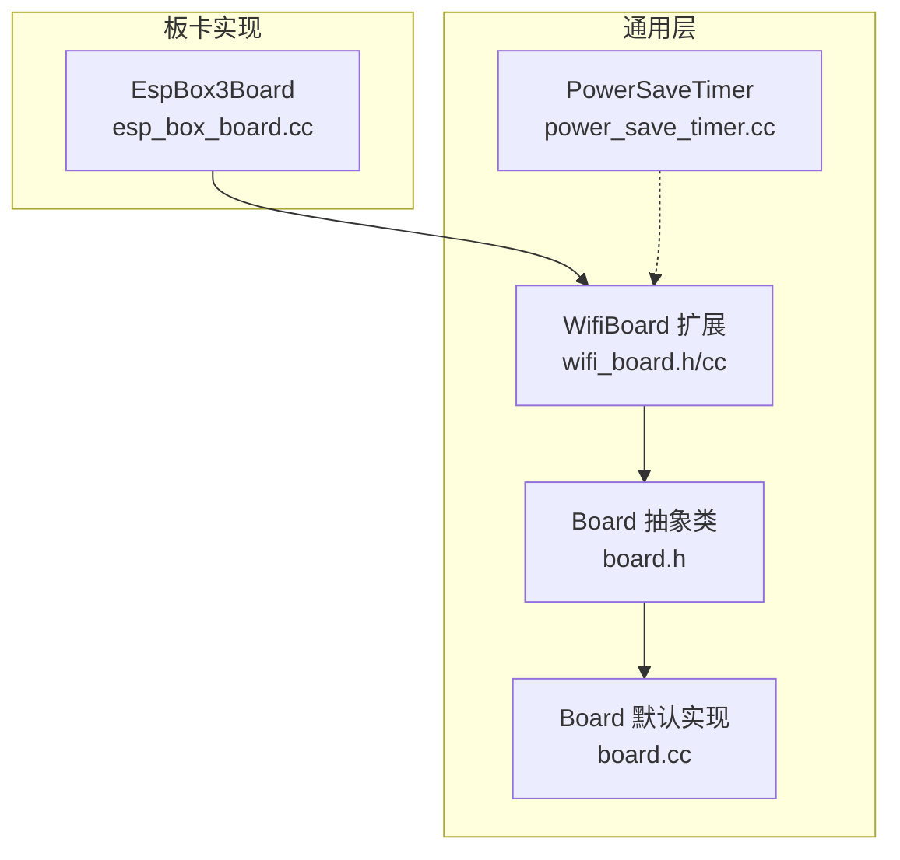
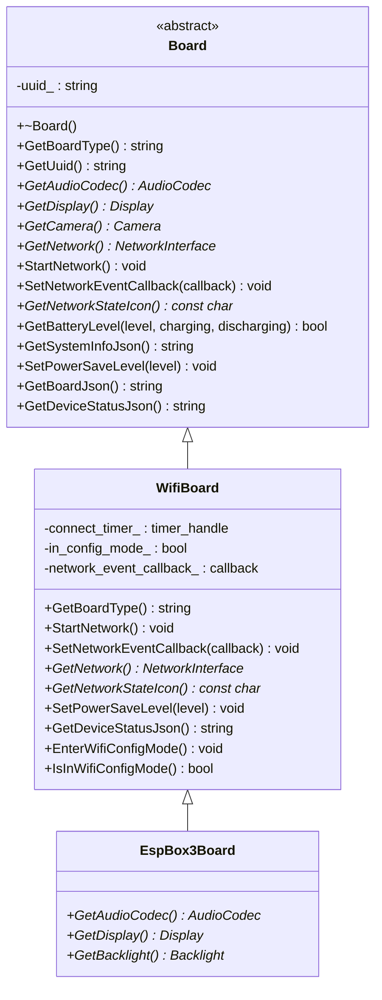
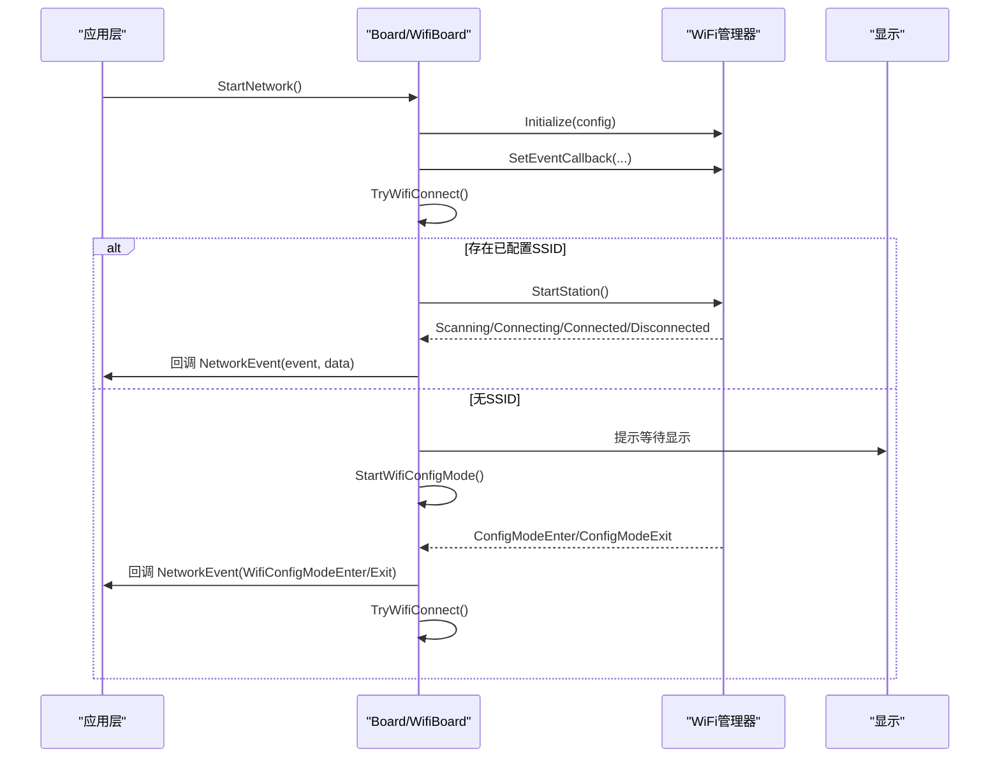
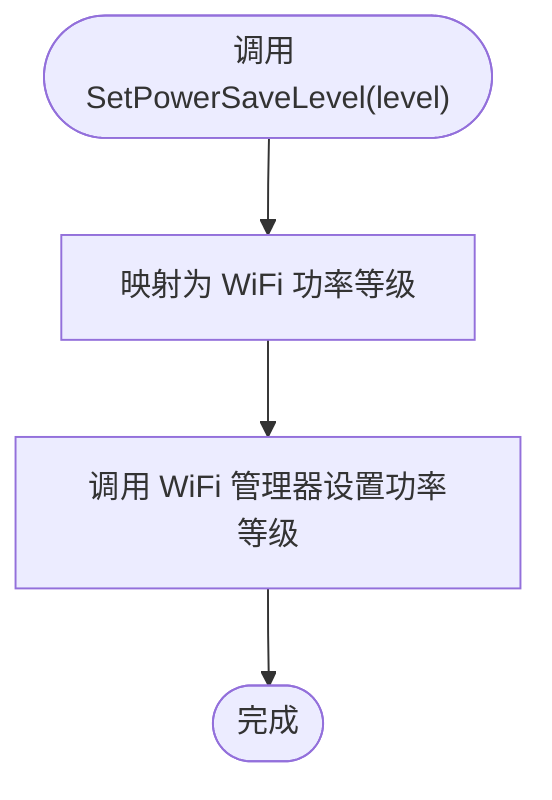
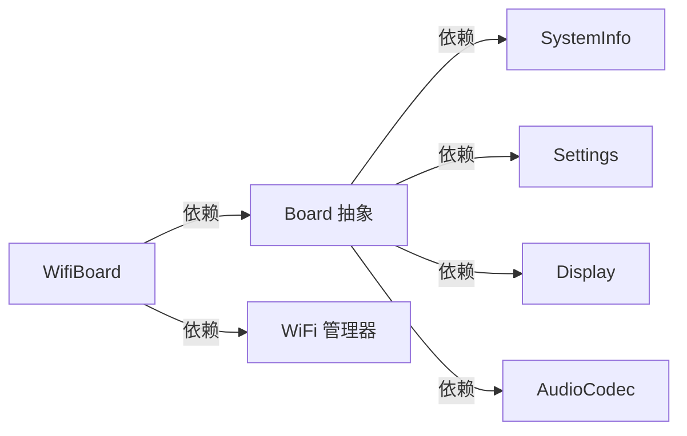

# Board基础接口

<cite>
**本文引用的文件列表**
- [board.h](file://main/boards/common/board.h)
- [board.cc](file://main/boards/common/board.cc)
- [wifi_board.h](file://main/boards/common/wifi_board.h)
- [wifi_board.cc](file://main/boards/common/wifi_board.cc)
- [esp_box_board.cc](file://main/boards/esp-box/esp_box_board.cc)
- [power_save_timer.cc](file://main/boards/common/power_save_timer.cc)
</cite>

## 目录
1. [简介](#简介)
2. [项目结构](#项目结构)
3. [核心组件](#核心组件)
4. [架构总览](#架构总览)
5. [详细组件分析](#详细组件分析)
6. [依赖关系分析](#依赖关系分析)
7. [性能与功耗考量](#性能与功耗考量)
8. [故障排查指南](#故障排查指南)
9. [结论](#结论)
10. [附录](#附录)

## 简介
本文件面向希望基于该代码库进行硬件适配的开发者，系统化梳理 Board 基础接口的抽象设计、关键虚函数、设备生命周期管理、工厂模式与单例模式的使用方式，并深入说明网络事件回调机制、电源管理模式及最佳实践。文档同时给出错误处理与异常情况的策略建议，帮助快速完成新板卡适配与集成。

## 项目结构
Board 基础接口位于通用层，具体板卡实现通过继承与宏注册的方式接入系统：
- 通用抽象与默认实现：main/boards/common/board.{h,cc}
- WiFi 网络能力扩展：main/boards/common/wifi_board.{h,cc}
- 示例板卡实现（ESP BOX）：main/boards/esp-box/esp_box_board.cc
- 电源保存计时器（配合电源策略使用）：main/boards/common/power_save_timer.cc

图示来源
- [board.h:49-85](file://main/boards/common/board.h#L49-L85)
- [board.cc:15-46](file://main/boards/common/board.cc#L15-L46)
- [wifi_board.h:9-67](file://main/boards/common/wifi_board.h#L9-L67)
- [wifi_board.cc:284-299](file://main/boards/common/wifi_board.cc#L284-L299)
- [esp_box_board.cc:38-174](file://main/boards/esp-box/esp_box_board.cc#L38-L174)
- [power_save_timer.cc:10-28](file://main/boards/common/power_save_timer.cc#L10-L28)

章节来源
- [board.h:1-93](file://main/boards/common/board.h#L1-L93)
- [board.cc:1-179](file://main/boards/common/board.cc#L1-L179)
- [wifi_board.h:1-70](file://main/boards/common/wifi_board.h#L1-L70)
- [wifi_board.cc:1-358](file://main/boards/common/wifi_board.cc#L1-L358)
- [esp_box_board.cc:1-175](file://main/boards/esp-box/esp_box_board.cc#L1-L175)
- [power_save_timer.cc:1-117](file://main/boards/common/power_save_timer.cc#L1-L117)

## 核心组件
- Board 抽象类：定义所有板卡的统一接口，包括类型标识、UUID、音频编解码器、显示、摄像头、网络、电源管理等。
- WifiBoard：在 Board 基础上提供 WiFi 连接、配网模式、网络状态图标、设备状态 JSON 等能力。
- 具体板卡（如 EspBox3Board）：继承自 WifiBoard，实现 GetAudioCodec、GetDisplay、GetBacklight 等硬件相关方法，并通过 DECLARE_BOARD 宏注册到工厂。

章节来源
- [board.h:49-85](file://main/boards/common/board.h#L49-L85)
- [wifi_board.h:9-67](file://main/boards/common/wifi_board.h#L9-L67)
- [esp_box_board.cc:38-174](file://main/boards/esp-box/esp_box_board.cc#L38-L174)

## 架构总览
Board 采用“抽象 + 默认实现 + 子类覆盖”的分层设计，结合工厂模式与单例模式，使上层应用无需关心具体硬件细节即可访问统一的设备能力。

图示来源
- [board.h:49-85](file://main/boards/common/board.h#L49-L85)
- [wifi_board.h:9-67](file://main/boards/common/wifi_board.h#L9-L67)
- [esp_box_board.cc:38-174](file://main/boards/esp-box/esp_box_board.cc#L38-L174)

## 详细组件分析

### Board 抽象类与关键虚函数
- 设计要点
  - 单例获取：GetInstance() 返回全局唯一实例，内部通过 create_board() 工厂函数构造具体 Board 对象。
  - 纯虚接口：GetBoardType()、GetAudioCodec()、GetNetwork()、StartNetwork()、GetNetworkStateIcon()、SetPowerSaveLevel()、GetBoardJson()、GetDeviceStatusJson() 必须由具体板卡实现。
  - 可选接口：GetUuid()、GetDisplay()、GetCamera()、GetLed()、GetTemperature()、GetBatteryLevel()、GetSystemInfoJson() 提供默认实现或空实现，便于轻量板卡快速适配。
- UUID 生成与持久化
  - 首次启动时生成 UUID v4 并写入 Settings；后续启动直接读取，保证设备唯一性。
- 系统信息 JSON
  - 聚合语言、Flash 大小、最小空闲堆、MAC、芯片信息、应用版本、分区表、OTA 分区、显示参数以及板卡自定义 JSON。

章节来源
- [board.h:49-85](file://main/boards/common/board.h#L49-L85)
- [board.cc:15-46](file://main/boards/common/board.cc#L15-L46)
- [board.cc:70-178](file://main/boards/common/board.cc#L70-L178)

### 工厂模式与单例模式
- 工厂模式
  - 每个具体板卡通过 DECLARE_BOARD(BOARD_CLASS_NAME) 宏导出 create_board()，由 Board::GetInstance() 调用以创建实例。
- 单例模式
  - Board::GetInstance() 使用静态局部指针确保全局唯一，避免重复构造与资源竞争。

章节来源
- [board.h:62-65](file://main/boards/common/board.h#L62-L65)
- [board.h:87-90](file://main/boards/common/board.h#L87-L90)
- [esp_box_board.cc:174-175](file://main/boards/esp-box/esp_box_board.cc#L174-L175)

### 网络事件回调机制与 NetworkEvent 枚举
- 事件类型
  - Scanning、Connecting、Connected、Disconnected、WifiConfigModeEnter、WifiConfigModeExit，以及蜂窝调制解调器相关事件（ModemDetecting、ModemErrorNoSim、ModemErrorRegDenied、ModemErrorInitFailed、ModemErrorTimeout）。
- 回调注册
  - SetNetworkEventCallback(NetworkEventCallback) 允许上层订阅网络事件，数据字段包含 SSID 等附加信息。
- WiFi 流程
  - StartNetwork() 初始化 WiFi 管理器，设置事件转发至 OnNetworkEvent()，根据是否有已配置 SSID 决定尝试连接或进入配网模式。
  - 超时处理：若连接超时则停止站点并进入配网模式。
  - 配网模式：支持热点配网、Blufi 配网、声学配网等多种方式，并在退出后自动重试连接。

图示来源
- [wifi_board.cc:52-104](file://main/boards/common/wifi_board.cc#L52-L104)
- [wifi_board.cc:106-145](file://main/boards/common/wifi_board.cc#L106-L145)
- [wifi_board.cc:159-197](file://main/boards/common/wifi_board.cc#L159-L197)
- [board.h:20-44](file://main/boards/common/board.h#L20-L44)

章节来源
- [board.h:20-44](file://main/boards/common/board.h#L20-L44)
- [wifi_board.h:49-56](file://main/boards/common/wifi_board.h#L49-L56)
- [wifi_board.cc:52-145](file://main/boards/common/wifi_board.cc#L52-L145)
- [wifi_board.cc:159-197](file://main/boards/common/wifi_board.cc#L159-L197)

### PowerSaveLevel 电源管理模式与 SetPowerSaveLevel()
- 模式定义
  - LOW_POWER：最大省电（最低功耗）
  - BALANCED：中等省电（平衡）
  - PERFORMANCE：不省电（最高性能）
- 行为映射
  - WifiBoard::SetPowerSaveLevel() 将 Board 级电源级别映射为 WiFi 层的功率等级，并调用 WiFi 管理器设置。
- 与系统省电联动
  - PowerSaveTimer 可周期性检查空闲时长，触发 CPU 降频、轻睡眠、关闭唤醒词检测与音频输入等动作，达到整体省电目标。

图示来源
- [board.h:36-40](file://main/boards/common/board.h#L36-L40)
- [wifi_board.cc:284-299](file://main/boards/common/wifi_board.cc#L284-L299)
- [power_save_timer.cc:10-28](file://main/boards/common/power_save_timer.cc#L10-L28)

章节来源
- [board.h:36-40](file://main/boards/common/board.h#L36-L40)
- [wifi_board.cc:284-299](file://main/boards/common/wifi_board.cc#L284-L299)
- [power_save_timer.cc:30-104](file://main/boards/common/power_save_timer.cc#L30-L104)

### 设备生命周期管理与最佳实践
- 启动阶段
  - Board 构造函数中加载或生成 UUID 并持久化；Display/Led 默认返回空实现，避免未实现功能导致崩溃。
- 网络阶段
  - StartNetwork() 异步发起连接，通过回调通知上层；超时自动进入配网模式；配网成功后自动重试连接。
- 运行阶段
  - 通过 GetDeviceStatusJson() 汇总音频音量、屏幕亮度、电池、网络信号强度、芯片温度等信息，便于监控与诊断。
- 关机/休眠
  - 结合 PowerSaveTimer 与 PM 配置，可在空闲时降低 CPU 频率、启用轻睡眠，必要时请求关机。

章节来源
- [board.cc:15-46](file://main/boards/common/board.cc#L15-L46)
- [wifi_board.cc:52-104](file://main/boards/common/wifi_board.cc#L52-L104)
- [wifi_board.cc:301-357](file://main/boards/common/wifi_board.cc#L301-L357)
- [power_save_timer.cc:30-104](file://main/boards/common/power_save_timer.cc#L30-L104)

### 具体板卡实现示例（ESP BOX）
- 继承关系
  - EspBox3Board 继承自 WifiBoard，覆写 GetAudioCodec()、GetDisplay()、GetBacklight() 等方法，完成 I2C/SPI 外设初始化、按钮绑定、背光恢复等。
- 工厂注册
  - 文件末尾使用 DECLARE_BOARD(EspBox3Board) 注册，使 Board::GetInstance() 能正确构造该板卡实例。

章节来源
- [esp_box_board.cc:38-174](file://main/boards/esp-box/esp_box_board.cc#L38-L174)
- [esp_box_board.cc:174-175](file://main/boards/esp-box/esp_box_board.cc#L174-L175)

## 依赖关系分析
- 耦合与内聚
  - Board 仅暴露稳定接口，具体硬件细节下沉到子类；WifiBoard 封装 WiFi 相关逻辑，提高内聚性。
- 外部依赖
  - WiFi 管理器、Settings、SystemInfo、Display、AudioCodec 等模块通过 Board 抽象被上层透明访问。
- 潜在循环依赖
  - 当前结构未见明显循环依赖；如需新增网络类型（如以太网），应遵循相同抽象与回调转发模式。

图示来源
- [board.cc:70-178](file://main/boards/common/board.cc#L70-L178)
- [wifi_board.cc:268-282](file://main/boards/common/wifi_board.cc#L268-L282)

章节来源
- [board.cc:70-178](file://main/boards/common/board.cc#L70-L178)
- [wifi_board.cc:268-282](file://main/boards/common/wifi_board.cc#L268-L282)

## 性能与功耗考量
- 网络侧
  - 合理设置 PowerSaveLevel，在弱网或低交互场景切换到低功耗模式，减少射频功耗。
- 系统侧
  - 利用 PowerSaveTimer 在空闲时降低 CPU 频率、启用轻睡眠，关闭不必要的音频输入与唤醒词检测，显著降低功耗。
- 显示与背光
  - 通过 GetBacklight()->brightness() 动态调整亮度，结合屏幕尺寸与主题选择，平衡可视性与能耗。

[本节为通用指导，不涉及具体文件分析]

## 故障排查指南
- 无法连接 WiFi
  - 检查是否已配置 SSID；若无，确认是否进入配网模式；查看超时回调是否触发并进入配网。
- 配网失败
  - 确认热点/Blufi/声学配网路径是否可用；检查回调中 WifiConfigModeExit 是否触发并自动重试连接。
- 设备状态 JSON 缺失字段
  - 若 GetBatteryLevel()/GetTemperature() 返回 false，对应字段不会出现在 JSON 中，属正常情况。
- 电源模式无效
  - 确认 SetPowerSaveLevel() 调用链是否正确映射到 WiFi 层；检查 PowerSaveTimer 是否被启用且未被设置项禁用。

章节来源
- [wifi_board.cc:151-157](file://main/boards/common/wifi_board.cc#L151-L157)
- [wifi_board.cc:159-197](file://main/boards/common/wifi_board.cc#L159-L197)
- [wifi_board.cc:301-357](file://main/boards/common/wifi_board.cc#L301-L357)
- [power_save_timer.cc:30-40](file://main/boards/common/power_save_timer.cc#L30-L40)

## 结论
Board 基础接口通过清晰的抽象与分层设计，实现了跨硬件的统一访问模型。借助工厂模式与单例模式，上层应用可以安全地获取并使用设备能力；网络事件回调与电源管理模式提供了良好的可扩展性与能效控制。按照本文的最佳实践与故障排查建议，可高效完成新板卡适配与系统集成。

[本节为总结性内容，不涉及具体文件分析]

## 附录

### API 速查（Board 关键方法）
- GetBoardType()：返回板卡类型字符串（例如 “wifi”）。
- GetUuid()：返回设备唯一标识（首次生成并持久化）。
- GetAudioCodec()：返回音频编解码器实例（必须实现）。
- GetDisplay()：返回显示实例（默认返回空实现）。
- GetCamera()：返回摄像头实例（默认返回 nullptr）。
- GetNetwork()：返回网络接口实例（必须实现）。
- StartNetwork()：启动网络连接（必须实现）。
- SetNetworkEventCallback(callback)：注册网络事件回调。
- GetNetworkStateIcon()：返回当前网络状态图标（必须实现）。
- GetBatteryLevel(level, charging, discharging)：查询电池电量与充放电状态（可选）。
- GetSystemInfoJson()：返回系统信息 JSON（含芯片、应用、分区、显示等）。
- SetPowerSaveLevel(level)：设置电源管理模式（必须实现）。
- GetBoardJson()：返回板卡自定义 JSON（必须实现）。
- GetDeviceStatusJson()：返回设备运行状态 JSON（必须实现）。

章节来源
- [board.h:49-85](file://main/boards/common/board.h#L49-L85)
- [board.cc:70-178](file://main/boards/common/board.cc#L70-L178)
- [wifi_board.cc:301-357](file://main/boards/common/wifi_board.cc#L301-L357)

### 工厂与单例使用要点
- 在板卡文件中实现具体类并覆写必要虚函数。
- 在文件末尾添加 DECLARE_BOARD(YourBoardClass) 以注册工厂。
- 通过 Board::GetInstance() 获取全局实例，避免手动 new/delete。

章节来源
- [board.h:62-65](file://main/boards/common/board.h#L62-L65)
- [board.h:87-90](file://main/boards/common/board.h#L87-L90)
- [esp_box_board.cc:174-175](file://main/boards/esp-box/esp_box_board.cc#L174-L175)