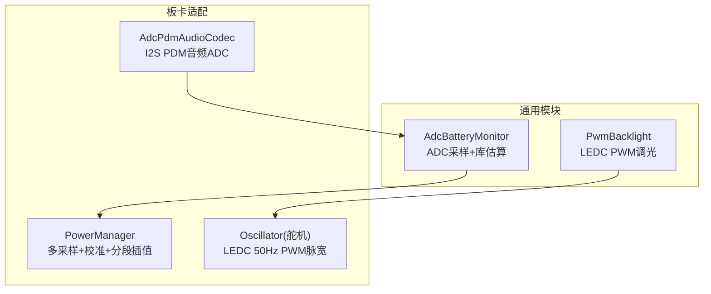
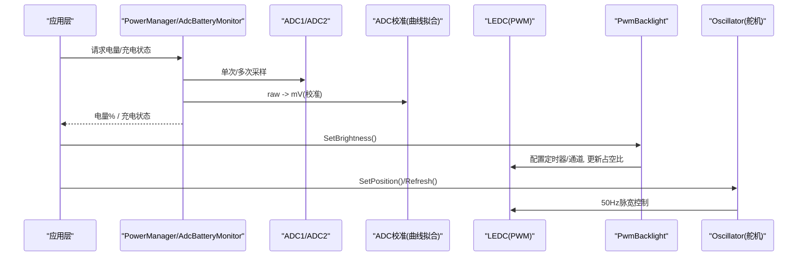
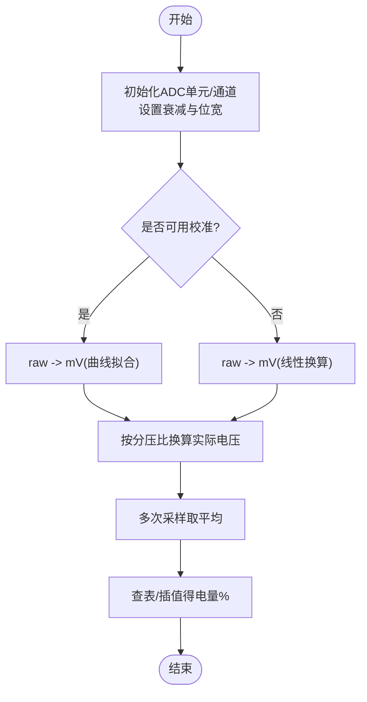
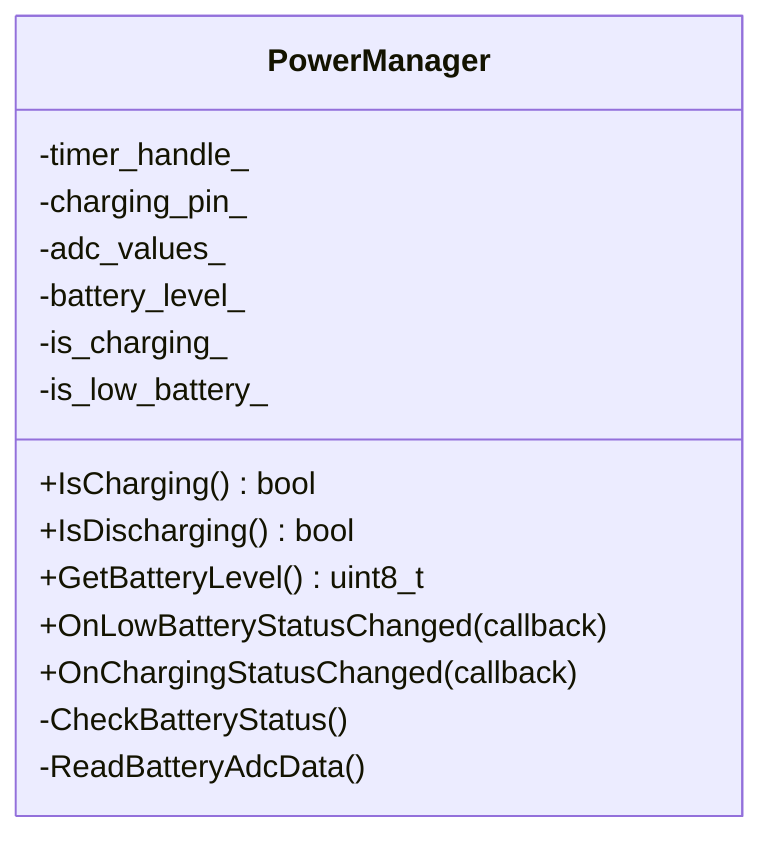
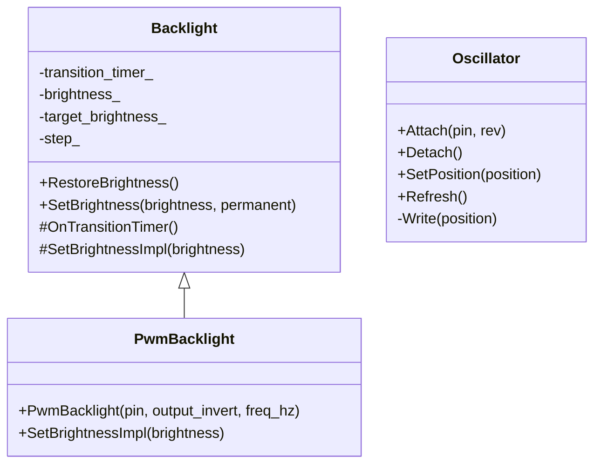
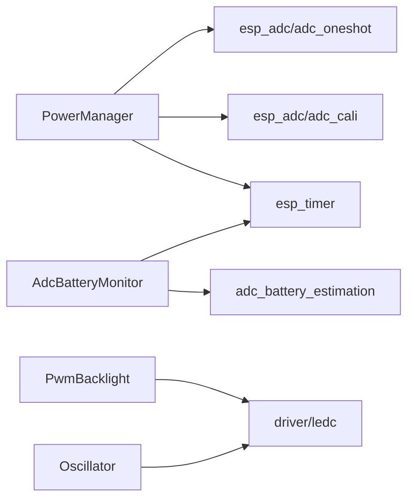

# ADC和PWM接口

<cite>
**本文引用的文件**   
- [adc_battery_monitor.h](file://main\boards\common\adc_battery_monitor.h)
- [adc_battery_monitor.cc](file://main\boards\common\adc_battery_monitor.cc)
- [backlight.h](file://main\boards\common\backlight.h)
- [backlight.cc](file://main\boards\common\backlight.cc)
- [power_manager.h](file://main\boards\esp32s3-korvo2-v3-rndis\power_manager.h)
- [sy6970.cc](file://main\boards\common\sy6970.cc)
- [oscillator.h](file://main\boards\electron-bot\oscillator.h)
- [oscillator.cc](file://main\boards\electron-bot\oscillator.cc)
- [adc_pdm_audio_codec.cc](file://main\boards\esp-hi\adc_pdm_audio_codec.cc)
- [adc_pdm_audio_codec.cc](file://main\boards\esp-sensairshuttle\adc_pdm_audio_codec.cc)
</cite>

## 目录
1. [简介](#简介)
2. [项目结构](#项目结构)
3. [核心组件](#核心组件)
4. [架构总览](#架构总览)
5. [详细组件分析](#详细组件分析)
6. [依赖关系分析](#依赖关系分析)
7. [性能与功耗优化](#性能与功耗优化)
8. [故障排查指南](#故障排查指南)
9. [结论](#结论)
10. [附录：使用示例与最佳实践](#附录使用示例与最佳实践)

## 简介
本文件面向ADC（模拟信号采集）与PWM（数字信号输出）的底层硬件接口，结合仓库中现有实现，系统化说明以下主题：
- ADC读取的配置参数、采样精度与校准方法
- 电池电压监测的实现原理与电量计算算法
- PWM输出配置、频率调节与占空比控制
- 传感器数据读取、电机/舵机控制与LED调光的具体用法
- ADC噪声滤波、PWM精度优化与功耗管理实践

## 项目结构
本项目在“板级通用模块”与“具体板卡适配”两个层面提供ADC/PWM能力：
- 通用模块
  - ADC电池监控：基于ESP-IDF ADC单通道采样与曲线拟合校准，封装为统一API
  - PWM背光：基于LEDC定时器/通道，支持渐变亮度与持久化设置
- 板卡适配
  - 电源管理：独立PowerManager实现多采样平滑、分压换算、分段线性插值电量估算
  - 音频ADC：通过audio codec + I2S PDM路径进行麦克风采样
  - LEDC驱动舵机：以固定周期PWM脉宽控制伺服角度

图表来源
- [adc_battery_monitor.h:1-31](file://main\boards\common\adc_battery_monitor.h#L1-L31)
- [adc_battery_monitor.cc:1-116](file://main\boards\common\adc_battery_monitor.cc#L1-L116)
- [backlight.h:1-37](file://main\boards\common\backlight.h#L1-L37)
- [backlight.cc:1-122](file://main\boards\common\backlight.cc#L1-L122)
- [power_manager.h:1-250](file://main\boards\esp32s3-korvo2-v3-rndis\power_manager.h#L1-L250)
- [oscillator.h:1-83](file://main\boards\electron-bot\oscillator.h#L1-L83)
- [oscillator.cc:1-149](file://main\boards\electron-bot\oscillator.cc#L1-L149)
- [adc_pdm_audio_codec.cc:1-69](file://main\boards\esp-hi\adc_pdm_audio_codec.cc#L1-L69)

章节来源
- [adc_battery_monitor.h:1-31](file://main\boards\common\adc_battery_monitor.h#L1-L31)
- [adc_battery_monitor.cc:1-116](file://main\boards\common\adc_battery_monitor.cc#L1-L116)
- [backlight.h:1-37](file://main\boards\common\backlight.h#L1-L37)
- [backlight.cc:1-122](file://main\boards\common\backlight.cc#L1-L122)
- [power_manager.h:1-250](file://main\boards\esp32s3-korvo2-v3-rndis\power_manager.h#L1-L250)
- [oscillator.h:1-83](file://main\boards\electron-bot\oscillator.h#L1-L83)
- [oscillator.cc:1-149](file://main\boards\electron-bot\oscillator.cc#L1-L149)
- [adc_pdm_audio_codec.cc:1-69](file://main\boards\esp-hi\adc_pdm_audio_codec.cc#L1-L69)

## 核心组件
- AdcBatteryMonitor：封装ADC单元、通道、衰减、位宽与充电检测回调，周期性获取容量百分比
- PowerManager：独立于通用模块的电源管理实现，包含多次采样、ADC校准、分压换算、分段线性插值电量估算与低电量事件
- PwmBacklight：基于LEDC的背光PWM控制器，支持渐变过渡与持久化保存
- Oscillator：基于LEDC的舵机控制，固定50Hz周期，按角度映射到微秒脉宽
- AdcPdmAudioCodec：通过audio codec + I2S PDM路径完成麦克风ADC采样

章节来源
- [adc_battery_monitor.h:1-31](file://main\boards\common\adc_battery_monitor.h#L1-L31)
- [adc_battery_monitor.cc:1-116](file://main\boards\common\adc_battery_monitor.cc#L1-L116)
- [power_manager.h:1-250](file://main\boards\esp32s3-korvo2-v3-rndis\power_manager.h#L1-L250)
- [backlight.h:1-37](file://main\boards\common\backlight.h#L1-L37)
- [backlight.cc:1-122](file://main\boards\common\backlight.cc#L1-L122)
- [oscillator.h:1-83](file://main\boards\electron-bot\oscillator.h#L1-L83)
- [oscillator.cc:1-149](file://main\boards\electron-bot\oscillator.cc#L1-L149)
- [adc_pdm_audio_codec.cc:1-69](file://main\boards\esp-hi\adc_pdm_audio_codec.cc#L1-L69)

## 架构总览
下图展示ADC/PWM在系统中的角色与交互：上层应用通过通用或板级接口访问ADC/PWM；电池电量由ADC采样并经校准与分压换算后得到；背光与舵机通过LEDC输出不同频率与分辨率的PWM。

图表来源
- [power_manager.h:57-141](file://main\boards\esp32s3-korvo2-v3-rndis\power_manager.h#L57-L141)
- [adc_battery_monitor.cc:18-55](file://main\boards\common\adc_battery_monitor.cc#L18-L55)
- [backlight.cc:84-121](file://main\boards\common\backlight.cc#L84-L121)
- [oscillator.cc:61-88](file://main\boards\electron-bot\oscillator.cc#L61-L88)

## 详细组件分析

### ADC读取：配置参数、采样精度与校准
- 采样单元与通道
  - 使用ADC1/ADC2的单通道一次性采样接口，典型通道如ADC_CHANNEL_5
  - 可复用外部已创建的ADC句柄，避免重复初始化
- 衰减与位宽
  - 衰减档位常用ADC_ATTEN_DB_12，覆盖更宽输入范围
  - 位宽设置为ADC_BITWIDTH_12，对应满量程4095
- 校准
  - 优先启用曲线拟合校准方案，将raw转换为mV
  - 若校准失败则回退至线性换算
- 分压换算
  - 根据硬件分压网络比例乘以系数得到实际电池电压
- 多采样平滑
  - 多次采样取平均，降低瞬时噪声影响
- 定时任务
  - 使用系统定时器周期性触发采样与状态检查

图表来源
- [power_manager.h:172-208](file://main\boards\esp32s3-korvo2-v3-rndis\power_manager.h#L172-L208)
- [power_manager.h:57-141](file://main\boards\esp32s3-korvo2-v3-rndis\power_manager.h#L57-L141)
- [adc_battery_monitor.cc:18-55](file://main\boards\common\adc_battery_monitor.cc#L18-L55)

章节来源
- [power_manager.h:172-208](file://main\boards\esp32s3-korvo2-v3-rndis\power_manager.h#L172-L208)
- [power_manager.h:57-141](file://main\boards\esp32s3-korvo2-v3-rndis\power_manager.h#L57-L141)
- [adc_battery_monitor.cc:18-55](file://main\boards\common\adc_battery_monitor.cc#L18-L55)

### 电池电压监测与电量计算
- 充电状态检测
  - 可通过GPIO电平或专用电源芯片寄存器判断
  - 当电量达到上限时，屏蔽“充电中”状态显示
- 电量计算
  - 采用分段线性插值：定义若干电压点与对应百分比，对当前平均电压进行区间定位并插值
  - 常见区间示例：3.5V~4.2V映射0%~100%
- 低电量告警
  - 当电量低于阈值时触发回调通知上层

图表来源
- [power_manager.h:12-249](file://main\boards\esp32s3-korvo2-v3-rndis\power_manager.h#L12-L249)

章节来源
- [power_manager.h:32-141](file://main\boards\esp32s3-korvo2-v3-rndis\power_manager.h#L32-L141)
- [power_manager.h:225-248](file://main\boards\esp32s3-korvo2-v3-rndis\power_manager.h#L225-L248)

### PWM输出：配置、频率与占空比控制
- 背光PWM（PwmBacklight）
  - 定时器：低频模式，10bit分辨率，默认约25kHz
  - 通道：绑定GPIO，支持输出反转
  - 占空比：0~100映射到0~1023，支持渐变过渡与持久化保存
- 舵机PWM（Oscillator）
  - 定时器：低频模式，13bit分辨率，固定50Hz周期
  - 脉宽：角度映射到微秒脉宽（例如500us~2500us），通过LEDC更新比较值

图表来源
- [backlight.h:10-36](file://main\boards\common\backlight.h#L10-L36)
- [backlight.cc:84-121](file://main\boards\common\backlight.cc#L84-L121)
- [oscillator.h:22-81](file://main\boards\electron-bot\oscillator.h#L22-L81)
- [oscillator.cc:61-88](file://main\boards\electron-bot\oscillator.cc#L61-L88)

章节来源
- [backlight.h:10-36](file://main\boards\common\backlight.h#L10-L36)
- [backlight.cc:84-121](file://main\boards\common\backlight.cc#L84-L121)
- [oscillator.h:22-81](file://main\boards\electron-bot\oscillator.h#L22-L81)
- [oscillator.cc:61-88](file://main\boards\electron-bot\oscillator.cc#L61-L88)

### 音频ADC（I2S PDM）
- 通过audio codec抽象层创建ADC数据接口，配置采样率、格式、单位与衰减、位宽
- 使用I2S PDM TX时钟配置，必要时动态重配时钟以匹配目标采样率
- 适用于板载MEMS麦克风等PDM数字麦克风

章节来源
- [adc_pdm_audio_codec.cc:39-69](file://main\boards\esp-hi\adc_pdm_audio_codec.cc#L39-L69)
- [adc_pdm_audio_codec.cc:167-201](file://main\boards\esp-hi\adc_pdm_audio_codec.cc#L167-L201)
- [adc_pdm_audio_codec.cc:39-69](file://main\boards\esp-sensairshuttle\adc_pdm_audio_codec.cc#L39-L69)

## 依赖关系分析
- 组件耦合
  - PowerManager依赖ESP-IDF ADC与校准库，内部持有定时器与队列用于平滑
  - AdcBatteryMonitor依赖第三方adc_battery_estimation库，同时可选GPIO充电检测
  - PwmBacklight与Oscillator均依赖LEDC外设
- 外部依赖
  - ESP-IDF驱动：driver/gpio, driver/ledc, esp_adc/adc_oneshot, esp_adc/adc_cali
  - 系统服务：esp_timer
  - 第三方库：adc_battery_estimation

图表来源
- [power_manager.h:1-250](file://main\boards\esp32s3-korvo2-v3-rndis\power_manager.h#L1-L250)
- [adc_battery_monitor.h:1-31](file://main\boards\common\adc_battery_monitor.h#L1-L31)
- [backlight.h:1-37](file://main\boards\common\backlight.h#L1-L37)
- [oscillator.h:1-83](file://main\boards\electron-bot\oscillator.h#L1-L83)

章节来源
- [power_manager.h:1-250](file://main\boards\esp32s3-korvo2-v3-rndis\power_manager.h#L1-L250)
- [adc_battery_monitor.h:1-31](file://main\boards\common\adc_battery_monitor.h#L1-L31)
- [backlight.h:1-37](file://main\boards\common\backlight.h#L1-L37)
- [oscillator.h:1-83](file://main\boards\electron-bot\oscillator.h#L1-L83)

## 性能与功耗优化
- ADC噪声滤波
  - 多次采样取平均（如10次）
  - 启用曲线拟合校准，减少非线性误差
  - 合理选择衰减档位，避免饱和与量化噪声
- PWM精度优化
  - 背光使用较高频率（如25kHz）与10bit分辨率，兼顾听感与能耗
  - 舵机使用固定50Hz与足够分辨率，确保脉宽映射稳定
- 功耗管理
  - 降低ADC采样频率与次数
  - 关闭未使用的LEDC通道
  - 利用定时器周期性调度，空闲时进入低功耗

[本节为通用指导，不直接分析具体文件]

## 故障排查指南
- ADC读数异常
  - 确认衰减与位宽配置与实际输入范围匹配
  - 检查校准是否成功，失败时回退线性换算
  - 验证分压电阻网络与换算系数
- 电量显示跳变
  - 增加采样次数与滑动窗口长度
  - 调整分段插值区间，贴合实际电池放电曲线
- PWM无输出或啸叫
  - 检查LEDC定时器频率与分辨率是否合适
  - 确认GPIO复用与引脚分配正确
- 充电状态不稳定
  - 区分GPIO检测与电源芯片寄存器检测
  - 电量满时屏蔽“充电中”状态，避免误报

章节来源
- [power_manager.h:57-141](file://main\boards\esp32s3-korvo2-v3-rndis\power_manager.h#L57-L141)
- [power_manager.h:225-248](file://main\boards\esp32s3-korvo2-v3-rndis\power_manager.h#L225-L248)
- [backlight.cc:84-121](file://main\boards\common\backlight.cc#L84-L121)

## 结论
本项目在通用与板级两个层面提供了完善的ADC与PWM能力：
- ADC侧通过多采样、校准与分压换算，实现了稳定的电池电压与电量估算
- PWM侧通过LEDC分别满足背光调光与舵机控制的差异化需求
- 借助定时器与回调机制，系统具备良好的可扩展性与实时性

[本节为总结，不直接分析具体文件]

## 附录：使用示例与最佳实践

### 传感器数据读取（ADC）
- 初始化ADC单元与通道，设置衰减与位宽
- 可选：创建曲线拟合校准句柄
- 周期性读取raw，经校准与分压换算得到实际电压
- 多采样平滑后用于后续处理（如电量估算、环境传感）

章节来源
- [power_manager.h:172-208](file://main\boards\esp32s3-korvo2-v3-rndis\power_manager.h#L172-L208)
- [power_manager.h:57-141](file://main\boards\esp32s3-korvo2-v3-rndis\power_manager.h#L57-L141)

### 电池电压监测与电量计算
- 使用PowerManager或AdcBatteryMonitor统一接口
- 根据硬件分压比换算实际电压
- 采用分段线性插值计算电量百分比
- 监听低电量与充电状态变化回调

章节来源
- [power_manager.h:96-141](file://main\boards\esp32s3-korvo2-v3-rndis\power_manager.h#L96-L141)
- [power_manager.h:225-248](file://main\boards\esp32s3-korvo2-v3-rndis\power_manager.h#L225-L248)
- [adc_battery_monitor.cc:90-116](file://main\boards\common\adc_battery_monitor.cc#L90-L116)

### 电机与舵机控制（PWM）
- 舵机控制：使用Oscillator类，Attach到指定GPIO，设置角度并通过Refresh更新
- 步进/直流电机：通常由MCU驱动板接收UART/总线指令，本项目示例通过串口发送控制字

章节来源
- [oscillator.h:22-81](file://main\boards\electron-bot\oscillator.h#L22-L81)
- [oscillator.cc:106-149](file://main\boards\electron-bot\oscillator.cc#L106-L149)

### LED调光（PWM）
- 使用PwmBacklight设置目标亮度，支持渐变过渡与持久化保存
- 可根据场景调整频率与分辨率，平衡听感与能耗

章节来源
- [backlight.h:30-36](file://main\boards\common\backlight.h#L30-L36)
- [backlight.cc:46-82](file://main\boards\common\backlight.cc#L46-L82)
- [backlight.cc:115-121](file://main\boards\common\backlight.cc#L115-L121)

### 其他参考：电源芯片电量估算
- 通过I2C读取SY6970寄存器，计算电池电压与目标充电电压，进而估算电量百分比

章节来源
- [sy6970.cc:28-61](file://main\boards\common\sy6970.cc#L28-L61)