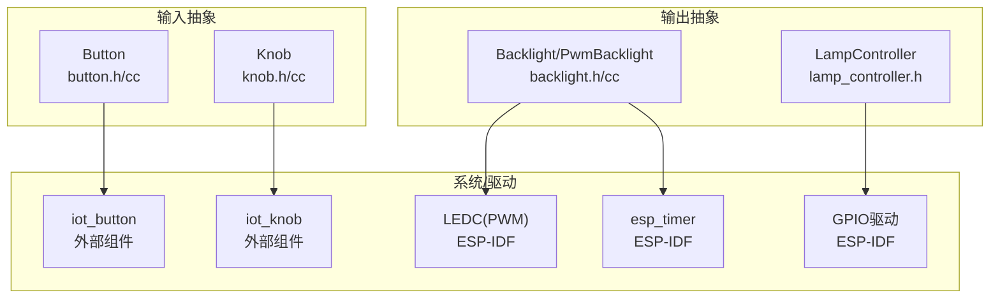
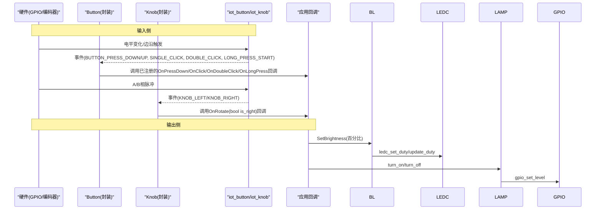
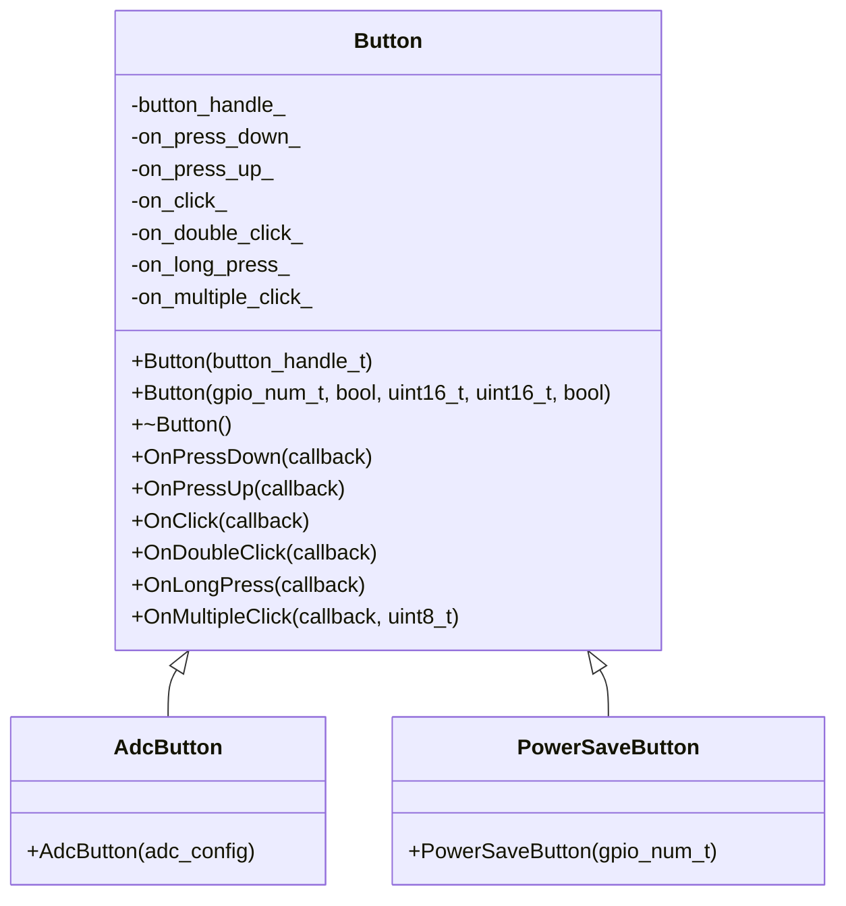
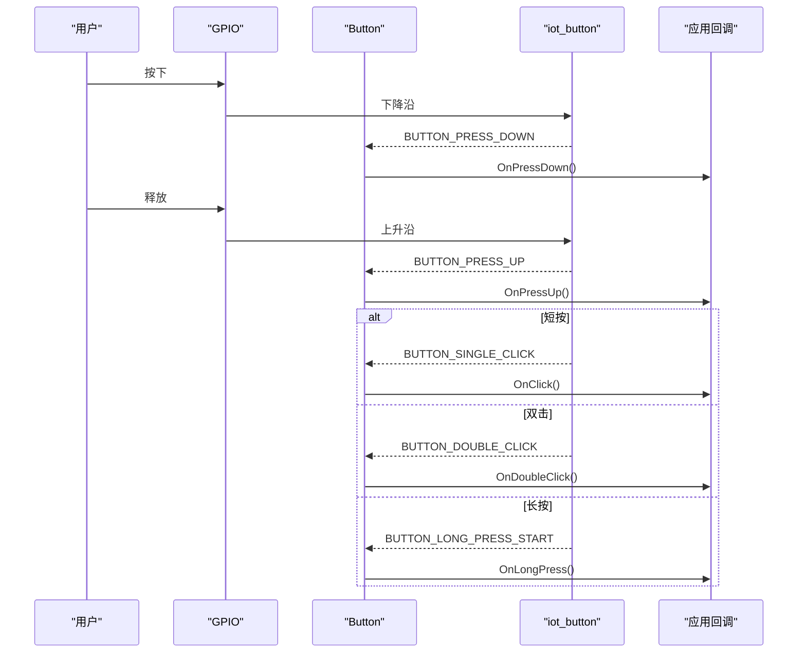
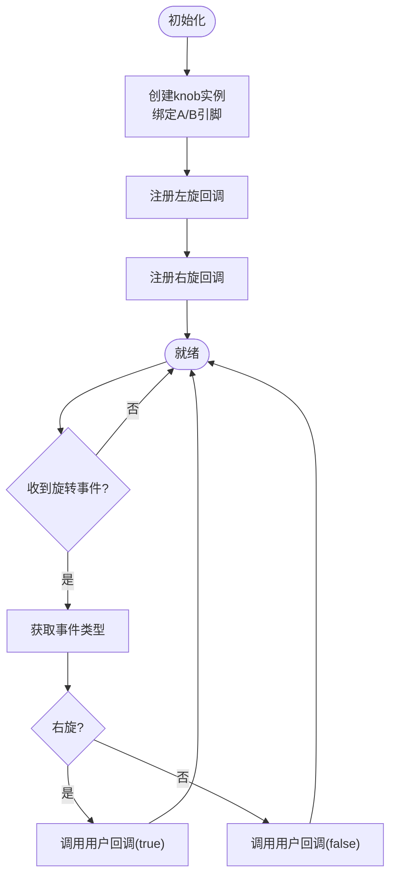
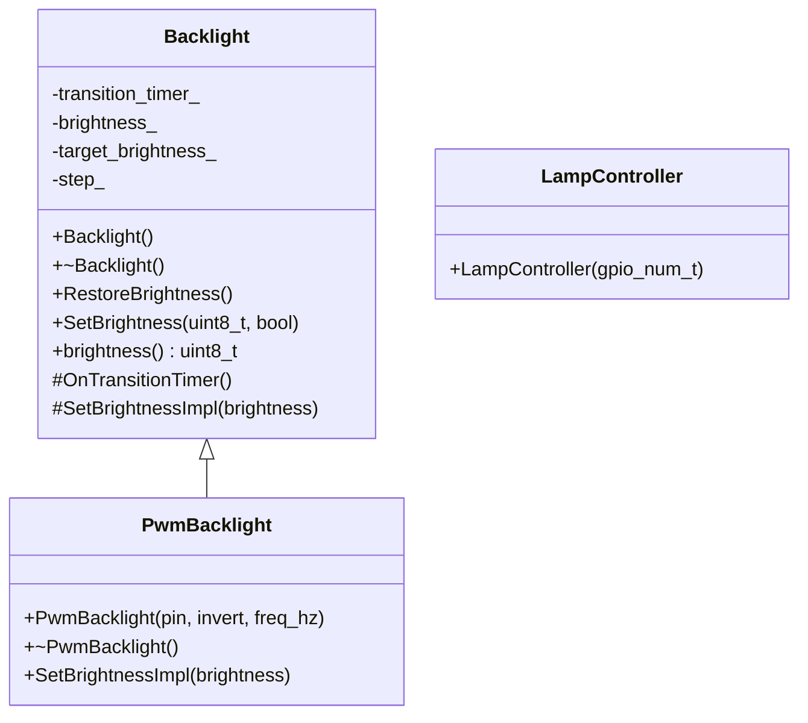
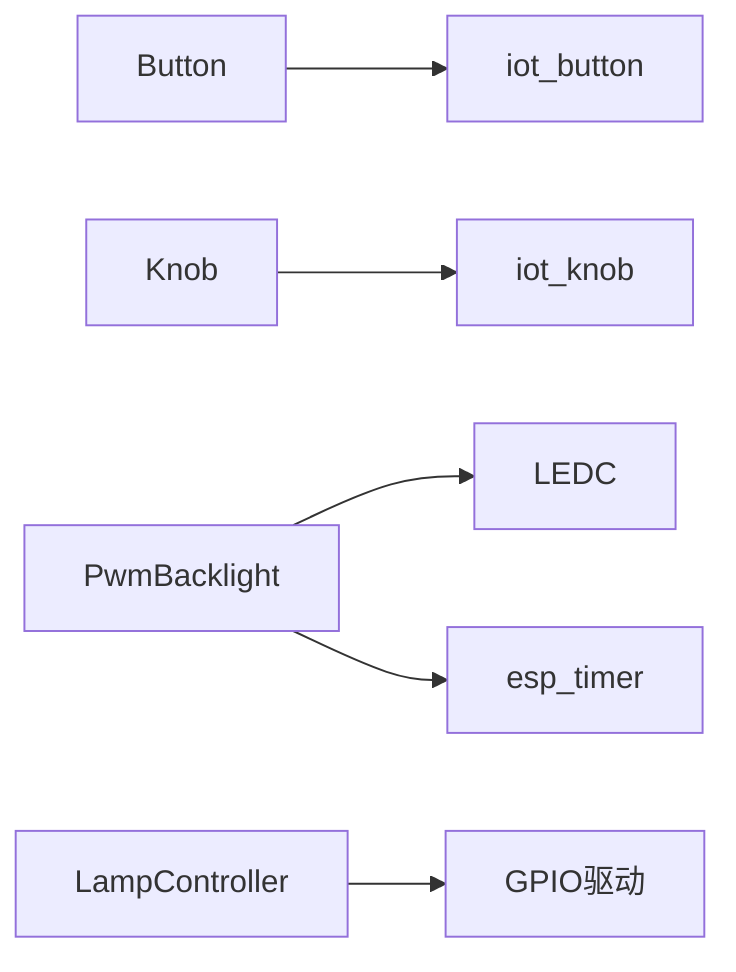

# GPIO控制接口

<cite>
**本文引用的文件**   
- [button.h](file://main/boards/common/button.h)
- [button.cc](file://main/boards/common/button.cc)
- [knob.h](file://main/boards/common/knob.h)
- [knob.cc](file://main/boards/common/knob.cc)
- [backlight.h](file://main/boards/common/backlight.h)
- [backlight.cc](file://main/boards/common/backlight.cc)
- [lamp_controller.h](file://main/boards/common/lamp_controller.h)
- [gpio_manager.h](file://main/boards/jiuchuan-s3/gpio_manager.h)
</cite>

## 目录
1. [简介](#简介)
2. [项目结构](#项目结构)
3. [核心组件](#核心组件)
4. [架构总览](#架构总览)
5. [详细组件分析](#详细组件分析)
6. [依赖关系分析](#依赖关系分析)
7. [性能与功耗考虑](#性能与功耗考虑)
8. [故障排查指南](#故障排查指南)
9. [结论](#结论)
10. [附录：使用示例与最佳实践](#附录使用示例与最佳实践)

## 简介
本文件面向嵌入式开发者，系统化梳理本项目中GPIO输入（按键、旋钮）与输出（PWM调光、LED状态指示）的抽象接口设计、中断处理与事件回调机制。文档重点覆盖：
- 按键检测（Button）抽象接口：短按、长按、双击、多次点击等事件；去抖动与时间阈值配置；ADC按键支持。
- 旋钮输入（Knob）抽象接口：旋转方向检测与回调；基于ESP-IDF iot_knob的实现。
- GPIO引脚配置与中断处理：输入上拉/下拉、输出模式、中断类型与优先级说明。
- 异步事件处理：通过定时器与任务派发实现平滑过渡与低耦合回调。
- 输出控制示例：PWM背光调光、GPIO开关控制灯源。

## 项目结构
与GPIO控制相关的关键代码集中在以下位置：
- 通用输入抽象：按钮与旋钮封装位于 boards/common 下
- 输出控制抽象：背光与灯控封装位于 boards/common 下
- 部分板级GPIO管理工具：如 jiuchuan-s3 下的 gpio_manager.h

图表来源
- [button.h:1-50](file://main/boards/common/button.h#L1-L50)
- [button.cc:1-125](file://main/boards/common/button.cc#L1-L125)
- [knob.h:1-25](file://main/boards/common/knob.h#L1-L25)
- [knob.cc:1-52](file://main/boards/common/knob.cc#L1-L52)
- [backlight.h:1-37](file://main/boards/common/backlight.h#L1-L37)
- [backlight.cc:1-122](file://main/boards/common/backlight.cc#L1-L122)
- [lamp_controller.h:1-49](file://main/boards/common/lamp_controller.h#L1-L49)

章节来源
- [button.h:1-50](file://main/boards/common/button.h#L1-L50)
- [button.cc:1-125](file://main/boards/common/button.cc#L1-L125)
- [knob.h:1-25](file://main/boards/common/knob.h#L1-L25)
- [knob.cc:1-52](file://main/boards/common/knob.cc#L1-L52)
- [backlight.h:1-37](file://main/boards/common/backlight.h#L1-L37)
- [backlight.cc:1-122](file://main/boards/common/backlight.cc#L1-L122)
- [lamp_controller.h:1-49](file://main/boards/common/lamp_controller.h#L1-L49)

## 核心组件
- Button：对ESP-IDF iot_button的轻量封装，提供短按、长按、双击、多次点击等事件回调注册；支持GPIO与ADC两种按键源；内部通过库完成去抖与时间阈值判定。
- Knob：对ESP-IDF iot_knob的封装，提供顺时针/逆时针旋转回调；底层由硬件或软件解码A/B相脉冲。
- Backlight/PwmBacklight：基于LEDC的PWM调光抽象，提供渐变过渡与持久化亮度保存；适用于背光或可调光LED。
- LampController：GPIO输出开关控制封装，暴露MCP工具以远程开关灯。

章节来源
- [button.h:11-49](file://main/boards/common/button.h#L11-L49)
- [button.cc:21-125](file://main/boards/common/button.cc#L21-L125)
- [knob.h:9-23](file://main/boards/common/knob.h#L9-L23)
- [knob.cc:5-52](file://main/boards/common/knob.cc#L5-L52)
- [backlight.h:10-36](file://main/boards/common/backlight.h#L10-L36)
- [backlight.cc:84-122](file://main/boards/common/backlight.cc#L84-L122)
- [lamp_controller.h:7-45](file://main/boards/common/lamp_controller.h#L7-L45)

## 架构总览
下图展示从物理输入到应用层回调的整体流程，以及输出控制的调用路径。

图表来源
- [button.cc:44-125](file://main/boards/common/button.cc#L44-L125)
- [knob.cc:19-52](file://main/boards/common/knob.cc#L19-L52)
- [backlight.cc:84-122](file://main/boards/common/backlight.cc#L84-L122)
- [lamp_controller.h:28-44](file://main/boards/common/lamp_controller.h#L28-L44)

## 详细组件分析

### 按键抽象（Button）
- 功能要点
  - 支持GPIO与ADC两种按键源；ADC按键在具备SOC ADC支持的平台上可用。
  - 事件类型：按下、抬起、单击、双击、长按开始、多次点击。
  - 去抖动与时间阈值：由底层 iot_button 负责，上层通过构造参数设置长按/短按时长。
  - 低功耗模式：可启用enable_power_save以降低休眠唤醒开销。
- 关键API
  - 构造函数：支持直接传入button_handle或GPIO引脚及参数。
  - 回调注册：OnPressDown/OnPressUp/OnClick/OnDoubleClick/OnLongPress/OnMultipleClick。
- 数据流
  - 硬件边沿 -> iot_button -> Button::OnXxx -> 用户回调。
- 复杂度与性能
  - 事件分发为O(1)，回调执行时间与业务逻辑相关；建议避免在回调中执行耗时操作。

图表来源
- [button.h:11-49](file://main/boards/common/button.h#L11-L49)
- [button.cc:8-42](file://main/boards/common/button.cc#L8-L42)

章节来源
- [button.h:11-49](file://main/boards/common/button.h#L11-L49)
- [button.cc:21-125](file://main/boards/common/button.cc#L21-L125)

#### 按键事件时序（示例）

图表来源
- [button.cc:44-125](file://main/boards/common/button.cc#L44-L125)

### 旋钮抽象（Knob）
- 功能要点
  - 基于A/B相编码器的旋转检测，向上/向下旋转分别映射为右旋/左旋。
  - 通过 iot_knob 创建实例并注册左右旋转回调，回调内转发至用户函数。
- 关键API
  - 构造函数：传入A/B引脚号。
  - OnRotate：注册回调，参数bool表示是否右旋。
- 数据流
  - 编码器脉冲 -> iot_knob -> Knob::knob_callback -> 用户OnRotate回调。

图表来源
- [knob.cc:5-52](file://main/boards/common/knob.cc#L5-L52)

章节来源
- [knob.h:9-23](file://main/boards/common/knob.h#L9-L23)
- [knob.cc:5-52](file://main/boards/common/knob.cc#L5-L52)

### PWM调光与LED状态指示
- PwmBacklight
  - 使用LEDC外设产生PWM，默认10位分辨率（0-1023），频率可配置以避免电感啸叫。
  - 提供SetBrightness(百分比)接口，内部通过定时器周期性步进实现平滑渐变。
  - 支持持久化保存亮度值，重启后恢复。
- LampController
  - 将指定GPIO配置为输出，并提供开/关与状态查询的MCP工具接口。

图表来源
- [backlight.h:10-36](file://main/boards/common/backlight.h#L10-L36)
- [backlight.cc:84-122](file://main/boards/common/backlight.cc#L84-L122)
- [lamp_controller.h:7-45](file://main/boards/common/lamp_controller.h#L7-L45)

章节来源
- [backlight.h:10-36](file://main/boards/common/backlight.h#L10-L36)
- [backlight.cc:10-122](file://main/boards/common/backlight.cc#L10-L122)
- [lamp_controller.h:7-45](file://main/boards/common/lamp_controller.h#L7-L45)

## 依赖关系分析
- 输入侧
  - Button依赖iot_button库进行去抖、计时与事件识别；支持GPIO与ADC两种驱动。
  - Knob依赖iot_knob库进行正交解码与事件上报。
- 输出侧
  - PwmBacklight依赖ESP-IDF的LEDC与esp_timer实现PWM与平滑过渡。
  - LampController直接操作GPIO输出。
- 板级GPIO管理
  - 某些板级模块提供统一的GPIO配置与访问封装（如jiuchuan-s3的GpioManager），用于集中管理与日志记录。

图表来源
- [button.cc:21-36](file://main/boards/common/button.cc#L21-L36)
- [knob.cc:5-32](file://main/boards/common/knob.cc#L5-L32)
- [backlight.cc:84-122](file://main/boards/common/backlight.cc#L84-L122)
- [lamp_controller.h:18-26](file://main/boards/common/lamp_controller.h#L18-L26)
- [gpio_manager.h:29-56](file://main/boards/jiuchuan-s3/gpio_manager.h#L29-L56)

章节来源
- [button.cc:21-36](file://main/boards/common/button.cc#L21-L36)
- [knob.cc:5-32](file://main/boards/common/knob.cc#L5-L32)
- [backlight.cc:84-122](file://main/boards/common/backlight.cc#L84-L122)
- [lamp_controller.h:18-26](file://main/boards/common/lamp_controller.h#L18-L26)
- [gpio_manager.h:29-56](file://main/boards/jiuchuan-s3/gpio_manager.h#L29-L56)

## 性能与功耗考虑
- 按键去抖与时间阈值
  - 短按/长按时长由构造参数传入，具体去抖算法由iot_button实现；合理设置阈值可减少误触发。
- 回调执行环境
  - 回调在库的事件处理路径中被调用，应避免阻塞与长时间运算；必要时通过队列或定时器将工作转移到任务上下文。
- PWM调光
  - 使用较高频率可降低电感啸叫风险；10位分辨率足以满足多数场景；渐变过渡通过定时器周期更新，避免频繁调用底层API。
- 低功耗
  - Button支持enable_power_save选项，有助于降低休眠唤醒成本；结合SleepTimer可实现轻/深睡眠策略（参考sleep_timer相关实现）。

[本节为通用指导，不直接分析具体文件]

## 故障排查指南
- 按键无响应
  - 检查GPIO引脚是否正确配置为上拉/下拉或外部电路是否提供有效电平。
  - 确认short_press_time与long_press_time设置是否合理。
  - 若使用ADC按键，需确保平台支持ADC且adc_config正确。
- 旋钮无旋转事件
  - 确认A/B引脚接线顺序与极性；检查是否成功创建knob实例并注册回调。
- 背光不亮或亮度异常
  - 检查LEDC通道与定时器是否配置成功；确认输出极性invert设置是否符合硬件。
  - 验证亮度值范围与持久化存储是否正常。
- GPIO输出无效
  - 确认GPIO模式为输出且初始电平符合预期；检查是否存在其他模块占用该引脚。

章节来源
- [button.cc:21-36](file://main/boards/common/button.cc#L21-L36)
- [knob.cc:12-32](file://main/boards/common/knob.cc#L12-L32)
- [backlight.cc:84-122](file://main/boards/common/backlight.cc#L84-L122)
- [lamp_controller.h:18-26](file://main/boards/common/lamp_controller.h#L18-L26)

## 结论
本项目通过Button与Knob两个抽象层，将底层ESP-IDF的按键与编码器能力封装为简洁易用的回调式API；同时提供PwmBacklight与LampController两类输出抽象，覆盖常见的调光与开关控制需求。整体设计遵循“低耦合、高内聚”的原则，便于在不同板型间复用与扩展。

[本节为总结性内容，不直接分析具体文件]

## 附录：使用示例与最佳实践

### 示例一：GPIO按键短按/长按/双击
- 步骤
  - 构造Button对象，传入GPIO引脚与激活电平、短按/长按阈值。
  - 注册OnClick、OnLongPress、OnDoubleClick回调。
  - 在回调中执行业务逻辑（如切换模式、进入菜单等）。
- 参考路径
  - [button.h:11-22](file://main/boards/common/button.h#L11-L22)
  - [button.cc:83-107](file://main/boards/common/button.cc#L83-L107)

### 示例二：ADC按键（多键复用）
- 步骤
  - 在支持ADC的平台上，使用AdcButton并传入adc_config。
  - 注册各事件回调，利用电压分压区分不同按键。
- 参考路径
  - [button.h:36-41](file://main/boards/common/button.h#L36-L41)
  - [button.cc:8-16](file://main/boards/common/button.cc#L8-L16)

### 示例三：旋钮旋转调节音量/亮度
- 步骤
  - 构造Knob对象，传入A/B引脚。
  - 注册OnRotate回调，根据布尔参数判断方向并调整目标值。
- 参考路径
  - [knob.h:9-14](file://main/boards/common/knob.h#L9-L14)
  - [knob.cc:41-52](file://main/boards/common/knob.cc#L41-L52)

### 示例四：PWM背光调光
- 步骤
  - 构造PwmBacklight对象，指定引脚、输出极性与频率。
  - 调用SetBrightness(百分比)设置目标亮度；如需持久化，传入permanent=true。
- 参考路径
  - [backlight.h:30-36](file://main/boards/common/backlight.h#L30-L36)
  - [backlight.cc:84-122](file://main/boards/common/backlight.cc#L84-L122)

### 示例五：GPIO开关控制灯源
- 步骤
  - 构造LampController对象，指定控制引脚。
  - 通过MCP工具调用turn_on/turn_off/get_state进行远程控制。
- 参考路径
  - [lamp_controller.h:13-44](file://main/boards/common/lamp_controller.h#L13-L44)

### 最佳实践
- 回调轻量化：避免在回调中执行阻塞I/O或复杂计算，必要时投递到任务队列。
- 合理阈值：根据机械按键特性与噪声环境调整短按/长按阈值。
- 电源管理：启用enable_power_save并结合SleepTimer实现节能策略。
- 输出安全：在修改GPIO前确认当前状态，避免冲突与闪烁。

[本节为通用指导，不直接分析具体文件]