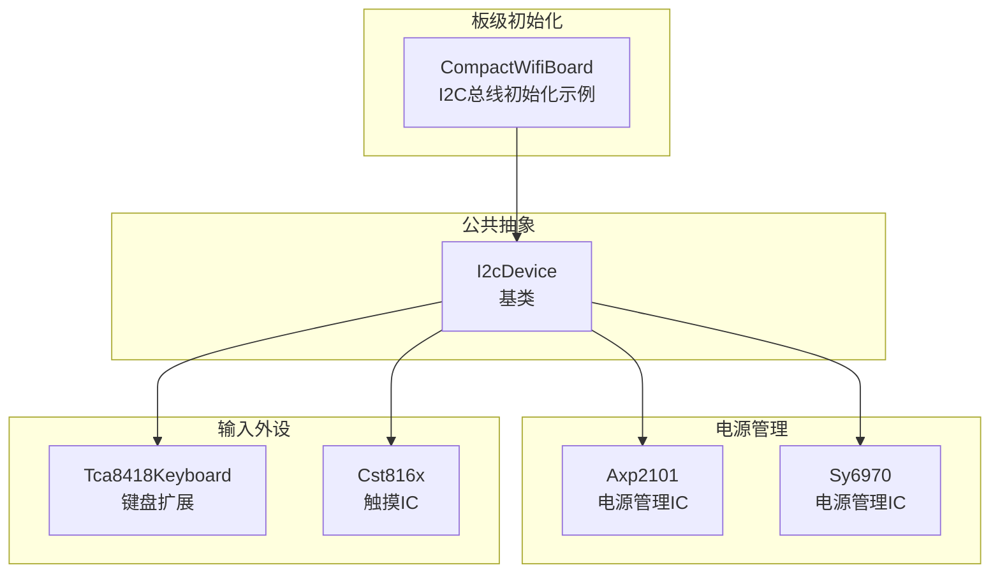
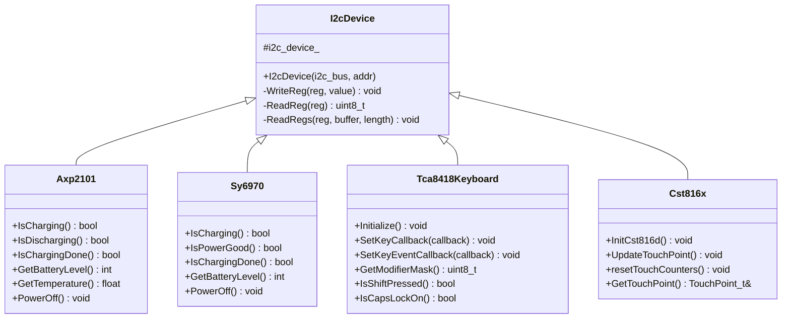
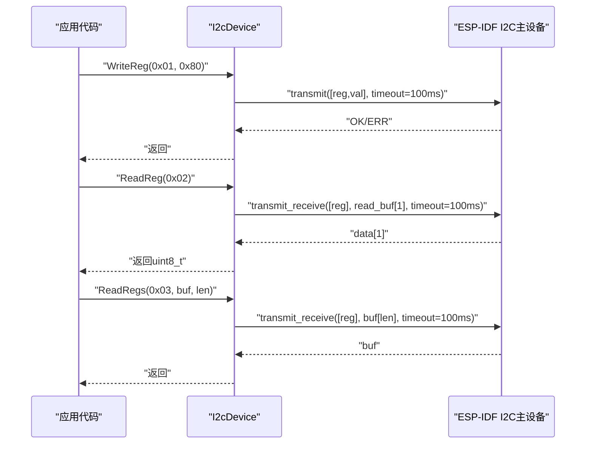
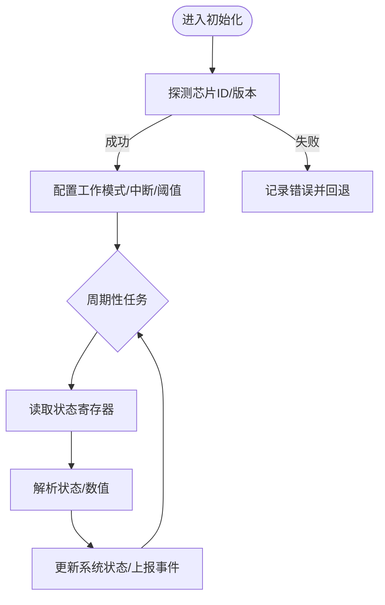
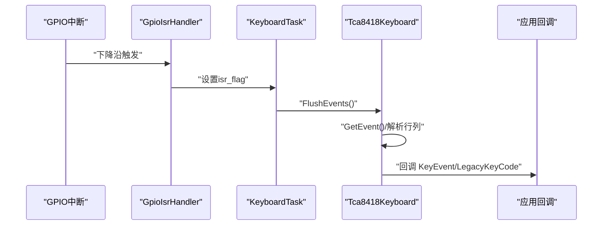
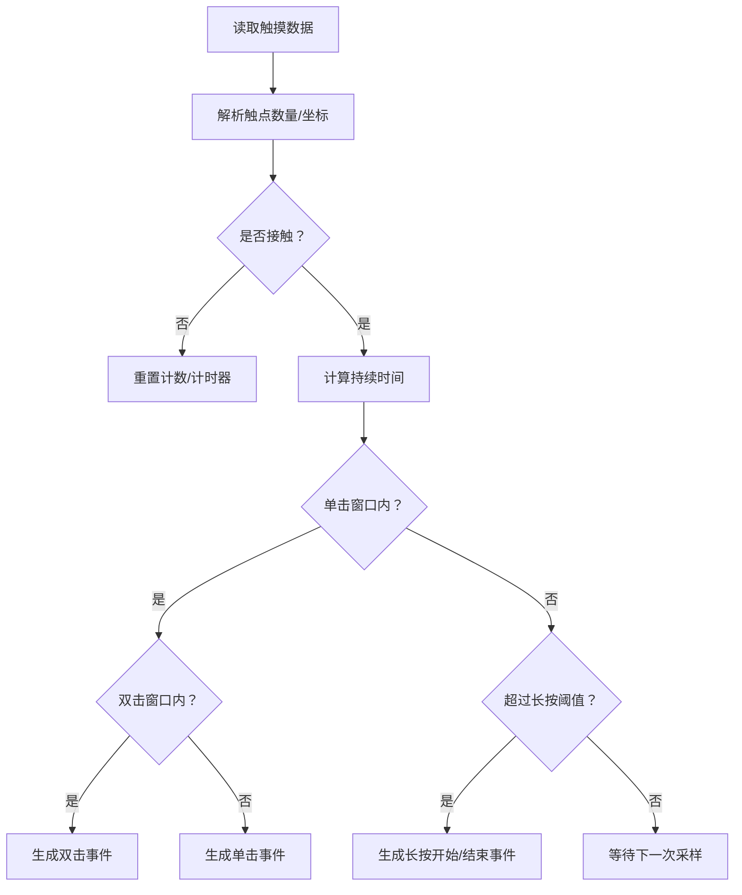
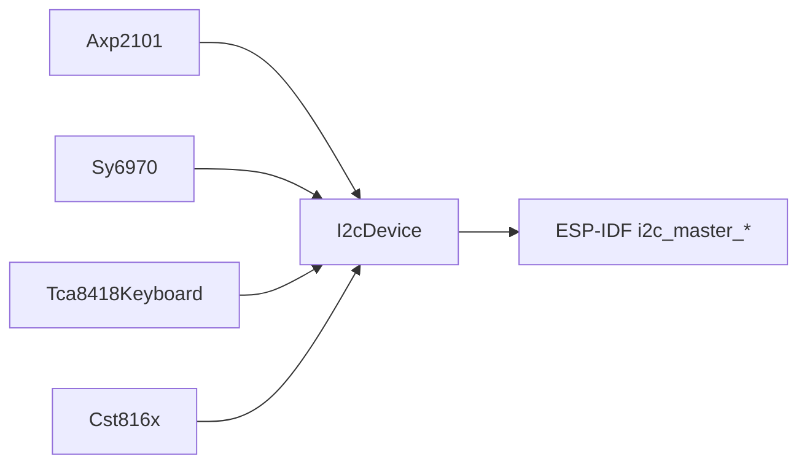

# I2C设备接口

<cite>
**本文引用的文件**   
- [i2c_device.h](file://main/boards/common/i2c_device.h)
- [i2c_device.cc](file://main/boards/common/i2c_device.cc)
- [axp2101.h](file://main/boards/common/axp2101.h)
- [sy6970.h](file://main/boards/common/sy6970.h)
- [tca8418_keyboard.h](file://main/boards/m5stack-cardputer-adv/tca8418_keyboard.h)
- [cst816x.h](file://main/boards/xingzhi-metal-1.54-wifi/cst816x.h)
- [compact_wifi_board.cc](file://main/boards/bread-compact-wifi/compact_wifi_board.cc)
</cite>

## 目录
1. [简介](#简介)
2. [项目结构](#项目结构)
3. [核心组件](#核心组件)
4. [架构总览](#架构总览)
5. [详细组件分析](#详细组件分析)
6. [依赖关系分析](#依赖关系分析)
7. [性能与可靠性](#性能与可靠性)
8. [故障排查指南](#故障排查指南)
9. [结论](#结论)
10. [附录：示例与最佳实践](#附录示例与最佳实践)

## 简介
本文件面向需要在ESP-IDF平台上开发I2C外设驱动的工程人员，系统化梳理I2C设备抽象层的设计与使用方式。重点包括：
- I2cDevice基类的设计与通用I2C操作接口（WriteReg、ReadReg、ReadRegs）
- I2C总线初始化配置、设备地址设置与通信参数
- 基于I2cDevice的派生类实现范式（以电源管理、键盘扩展、触摸IC为例）
- 错误处理机制、超时与重试策略建议
- 测试方法与调试技巧

## 项目结构
I2C设备抽象位于公共模块中，具体板级或外设驱动通过继承该抽象进行实现。典型组织如下：
- 公共I2C抽象：main/boards/common/i2c_device.{h,cc}
- 电源管理IC驱动：main/boards/common/axp2101.h、sy6970.h
- 键盘扩展驱动：main/boards/m5stack-cardputer-adv/tca8418_keyboard.h
- 触摸IC驱动：main/boards/xingzhi-metal-1.54-wifi/cst816x.h
- 板级I2C总线初始化示例：main/boards/bread-compact-wifi/compact_wifi_board.cc

图表来源
- [i2c_device.h:6-16](file://main/boards/common/i2c_device.h#L6-L16)
- [axp2101.h:6-18](file://main/boards/common/axp2101.h#L6-L18)
- [sy6970.h:6-19](file://main/boards/common/sy6970.h#L6-L19)
- [tca8418_keyboard.h:116-153](file://main/boards/m5stack-cardputer-adv/tca8418_keyboard.h#L116-L153)
- [cst816x.h:28-88](file://main/boards/xingzhi-metal-1.54-wifi/cst816x.h#L28-L88)
- [compact_wifi_board.cc:35-49](file://main/boards/bread-compact-wifi/compact_wifi_board.cc#L35-L49)

章节来源
- [i2c_device.h:1-19](file://main/boards/common/i2c_device.h#L1-L19)
- [i2c_device.cc:1-35](file://main/boards/common/i2c_device.cc#L1-L35)
- [compact_wifi_board.cc:35-49](file://main/boards/bread-compact-wifi/compact_wifi_board.cc#L35-L49)

## 核心组件
本节聚焦I2cDevice基类的API设计与行为约定。

- 构造与设备注册
  - 构造函数接收I2C总线句柄与7位设备地址，内部完成设备节点创建与校验。
  - 默认SCL速度为400kHz，ACK检查开启。

- 寄存器读写接口
  - WriteReg(reg, value)：单字节写寄存器。
  - ReadReg(reg)：单字节读寄存器。
  - ReadRegs(reg, buffer, length)：连续多字节读寄存器。

- 错误处理
  - 所有底层传输调用均使用统一错误检查宏，失败时抛出异常并终止当前流程。

- 超时控制
  - 传输超时固定为100ms（单位取决于底层API语义），适用于常规低速I2C设备。

章节来源
- [i2c_device.h:6-16](file://main/boards/common/i2c_device.h#L6-L16)
- [i2c_device.cc:8-35](file://main/boards/common/i2c_device.cc#L8-L35)

## 架构总览
I2cDevice作为统一的I2C访问抽象，屏蔽了底层ESP-IDF I2C主设备的差异，向上提供简洁的寄存器访问方法。各外设驱动通过继承该基类，封装自身寄存器定义与业务逻辑。

图表来源
- [i2c_device.h:6-16](file://main/boards/common/i2c_device.h#L6-L16)
- [axp2101.h:6-18](file://main/boards/common/axp2101.h#L6-L18)
- [sy6970.h:6-19](file://main/boards/common/sy6970.h#L6-L19)
- [tca8418_keyboard.h:116-153](file://main/boards/m5stack-cardputer-adv/tca8418_keyboard.h#L116-L153)
- [cst816x.h:28-88](file://main/boards/xingzhi-metal-1.54-wifi/cst816x.h#L28-L88)

## 详细组件分析

### I2cDevice基类
- 设计要点
  - 将“总线+设备地址”组合为一个可复用的设备句柄，避免上层重复配置。
  - 暴露最小化的寄存器访问API，便于派生类专注业务逻辑。
- 关键行为
  - 构造阶段完成设备注册；失败由错误检查宏上报。
  - 写寄存器采用“先写寄存器地址，再写数据”的两段式传输。
  - 读寄存器采用“写寄存器地址后切换为读”的组合传输。
  - 连续读支持任意长度缓冲。

图表来源
- [i2c_device.cc:22-35](file://main/boards/common/i2c_device.cc#L22-L35)

章节来源
- [i2c_device.h:6-16](file://main/boards/common/i2c_device.h#L6-L16)
- [i2c_device.cc:8-35](file://main/boards/common/i2c_device.cc#L8-L35)

### 电源管理IC驱动（Axp2101 / Sy6970）
- 共同点
  - 均继承自I2cDevice，通过寄存器读取状态位与数值，转换为高层语义（充电状态、电量、温度等）。
- 差异化
  - Axp2101提供温度获取能力；Sy6970提供电源良好标志与目标电压查询等。

图表来源
- [axp2101.h:6-18](file://main/boards/common/axp2101.h#L6-L18)
- [sy6970.h:6-19](file://main/boards/common/sy6970.h#L6-L19)

章节来源
- [axp2101.h:6-18](file://main/boards/common/axp2101.h#L6-L18)
- [sy6970.h:6-19](file://main/boards/common/sy6970.h#L6-L19)

### 键盘扩展驱动（TCA8418）
- 特性
  - 基于I2C矩阵键盘控制器，支持中断触发与按键事件回调。
  - 维护修饰键状态与大小写锁定状态，并提供HID兼容键码映射。
- 交互流程
  - 初始化矩阵与中断 → GPIO中断服务程序置位标志 → 后台任务轮询事件寄存器 → 解析行列坐标 → 映射为键事件 → 回调通知上层。

图表来源
- [tca8418_keyboard.h:116-153](file://main/boards/m5stack-cardputer-adv/tca8418_keyboard.h#L116-L153)

章节来源
- [tca8418_keyboard.h:116-153](file://main/boards/m5stack-cardputer-adv/tca8418_keyboard.h#L116-L153)

### 触摸IC驱动（CST816X）
- 特性
  - 支持多点触控基础信息读取与手势识别（单击、双击、长按）。
  - 内置阈值表用于不同区域的事件判定，包含音量调节长按自动步进。
- 数据处理
  - 周期刷新触摸点 → 计算时间差判断长按/双击 → 根据坐标匹配阈值区域 → 生成事件。

图表来源
- [cst816x.h:28-88](file://main/boards/xingzhi-metal-1.54-wifi/cst816x.h#L28-L88)

章节来源
- [cst816x.h:28-88](file://main/boards/xingzhi-metal-1.54-wifi/cst816x.h#L28-L88)

## 依赖关系分析
- 外部依赖
  - ESP-IDF I2C主设备驱动（i2c_master_bus_*、i2c_master_transmit*）
  - ESP日志与错误检查宏（esp_log.h、ESP_ERROR_CHECK）
- 耦合与内聚
  - I2cDevice仅依赖底层I2C主设备API，内聚性强，易于替换底层实现。
  - 派生类仅依赖I2cDevice提供的寄存器访问，不直接触碰底层I2C细节。

图表来源
- [i2c_device.cc:1-35](file://main/boards/common/i2c_device.cc#L1-L35)
- [axp2101.h:6-18](file://main/boards/common/axp2101.h#L6-L18)
- [sy6970.h:6-19](file://main/boards/common/sy6970.h#L6-L19)
- [tca8418_keyboard.h:116-153](file://main/boards/m5stack-cardputer-adv/tca8418_keyboard.h#L116-L153)
- [cst816x.h:28-88](file://main/boards/xingzhi-metal-1.54-wifi/cst816x.h#L28-L88)

章节来源
- [i2c_device.cc:1-35](file://main/boards/common/i2c_device.cc#L1-L35)

## 性能与可靠性
- 传输速率
  - 默认SCL为400kHz，满足大多数传感器与外设需求。若需更高吞吐，可在派生类中按需调整设备级速度（注意总线共享场景下的兼容性）。
- 超时与重试
  - 当前实现固定100ms超时。对于不稳定链路或高噪声环境，建议在派生类中封装带重试的读写方法，并在失败时记录诊断信息。
- 并发与中断
  - 对需要实时响应的设备（如键盘、触摸），建议结合中断与后台任务，避免阻塞主循环。
- 内存与缓冲区
  - 连续读时确保传入缓冲区足够大，避免越界；必要时在派生类中进行边界检查。

[本节为通用指导，无需特定文件引用]

## 故障排查指南
- 常见问题定位
  - 设备未响应：检查I2C总线初始化是否正确、引脚复用与上拉电阻、设备地址是否为7位。
  - 读写失败：确认寄存器地址与数据宽度，核对时序与ACK要求。
  - 超时频繁：降低总线速率、增加延时、检查供电与信号完整性。
- 日志与断言
  - 利用ESP_ERROR_CHECK与日志标签快速定位失败位置。
  - 构造阶段的断言可帮助尽早发现设备注册失败。
- 建议的诊断步骤
  - 使用示波器或逻辑分析仪抓取SCL/SDA波形，验证起始/停止条件与ACK。
  - 在派生类中增加“探测序列”，启动时读取已知寄存器值进行自检。
  - 对关键路径增加重试与降级策略，提升鲁棒性。

章节来源
- [i2c_device.cc:8-20](file://main/boards/common/i2c_device.cc#L8-L20)

## 结论
I2cDevice提供了稳定、简洁的I2C访问抽象，配合派生类可实现多种外设驱动的快速落地。通过合理的总线初始化、错误处理与重试策略，可以在复杂硬件环境中获得良好的可靠性与可维护性。

[本节为总结，无需特定文件引用]

## 附录：示例与最佳实践

### I2C总线初始化与设备地址设置
- 总线初始化
  - 参考板级示例中的I2C总线初始化流程，配置端口、引脚、时钟源、上拉与队列深度等。
- 设备地址
  - 构造I2cDevice派生类实例时传入7位设备地址；确保与器件手册一致。
- 通信参数
  - 默认400kHz可满足多数场景；如需变更，可在派生类中按设备要求调整。

章节来源
- [compact_wifi_board.cc:35-49](file://main/boards/bread-compact-wifi/compact_wifi_board.cc#L35-L49)
- [i2c_device.cc:8-20](file://main/boards/common/i2c_device.cc#L8-L20)

### 继承I2cDevice实现新设备驱动的模板
- 步骤概览
  - 新建派生类头文件，声明构造函数与对外API。
  - 在构造函数中调用基类构造，传入总线句柄与设备地址。
  - 在成员函数中使用WriteReg/ReadReg/ReadRegs完成寄存器访问。
  - 在初始化流程中加入设备探测与自检。
- 注意事项
  - 合理划分初始化、运行期与清理生命周期。
  - 对可能失败的I2C操作增加重试与错误上报。
  - 对高频访问路径考虑缓存与去抖。

章节来源
- [i2c_device.h:6-16](file://main/boards/common/i2c_device.h#L6-L16)
- [i2c_device.cc:22-35](file://main/boards/common/i2c_device.cc#L22-L35)

### 错误处理、超时与重试策略
- 错误处理
  - 使用ESP_ERROR_CHECK捕获底层错误；在派生类中可将错误转为更友好的状态码或异常。
- 超时
  - 当前固定100ms；对慢速设备或长链场景可适当延长。
- 重试
  - 在派生类中封装带次数限制的重试循环，并在每次失败时记录日志与时间戳。

章节来源
- [i2c_device.cc:22-35](file://main/boards/common/i2c_device.cc#L22-L35)

### 测试方法与调试技巧
- 单元测试
  - 针对派生类的关键方法进行隔离测试，模拟I2C返回值覆盖成功/失败分支。
- 集成测试
  - 在真实硬件上执行完整初始化流程，验证设备可达性与功能正确性。
- 调试技巧
  - 启用ESP日志，输出关键路径的状态与耗时。
  - 使用逻辑分析仪观察I2C波形，定位时序问题。
  - 对中断驱动的设备，验证中断触发频率与事件丢失情况。

[本节为通用指导，无需特定文件引用]