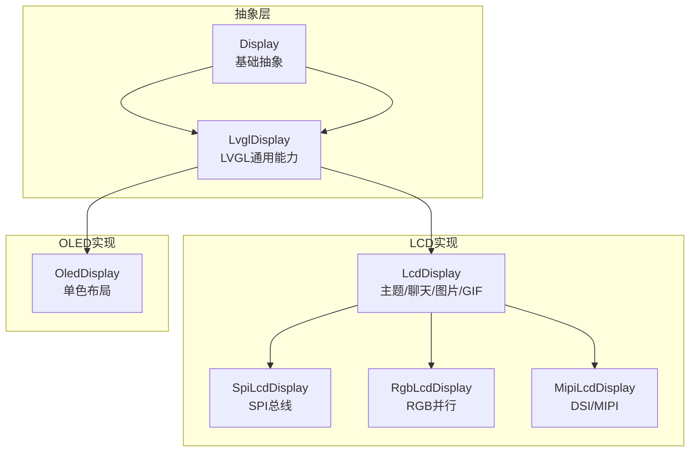
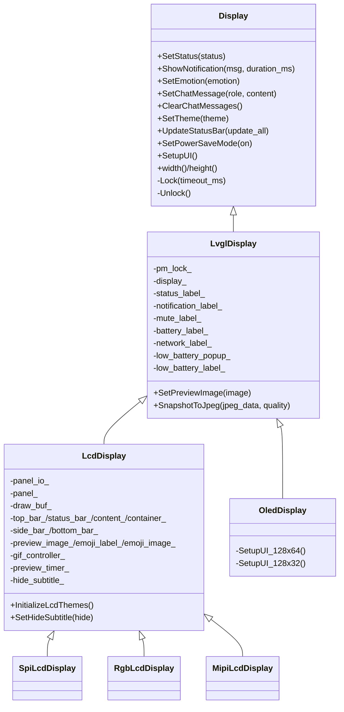
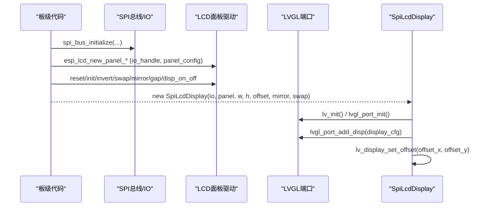
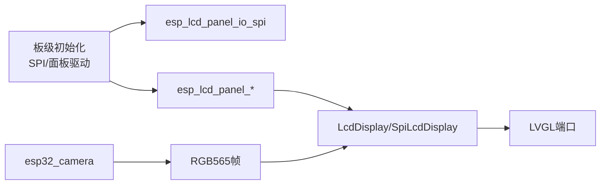

# SPI显示接口

<cite>
**本文引用的文件**   
- [display.h](file://main/display/display.h)
- [lvgl_display.h](file://main/display/lvgl_display/lvgl_display.h)
- [lvgl_display.cc](file://main/display/lvgl_display/lvgl_display.cc)
- [lcd_display.h](file://main/display/lcd_display.h)
- [lcd_display.cc](file://main/display/lcd_display.cc)
- [oled_display.h](file://main/display/oled_display.h)
- [oled_display.cc](file://main/display/oled_display.cc)
- [atoms3r_echo_base.cc](file://main/boards/atoms3r-echo-base/atoms3r_echo_base.cc)
- [esp-sensairshuttle.cc](file://main/boards/esp-sensairshuttle/esp-sensairshuttle.cc)
- [esp32_camera.cc](file://main/boards/common/esp32_camera.cc)
- [emoji_display.h](file://main/boards/esp-hi/emoji_display.h)
- [emoji_display.cc](file://main/boards/esp-hi/emoji_display.cc)
</cite>

## 目录
1. [简介](#简介)
2. [项目结构](#项目结构)
3. [核心组件](#核心组件)
4. [架构总览](#架构总览)
5. [详细组件分析](#详细组件分析)
6. [依赖关系分析](#依赖关系分析)
7. [性能与内存优化](#性能与内存优化)
8. [故障排查指南](#故障排查指南)
9. [结论](#结论)
10. [附录：SPI配置与分辨率适配](#附录spi配置与分辨率适配)

## 简介
本文件面向ESP32平台上的SPI LCD/OLED显示子系统，提供从抽象接口到具体驱动实现的完整API文档。内容覆盖：
- 显示控制器抽象与初始化流程（SPI、RGB、MIPI）
- LVGL端口集成、像素缓冲区与刷新策略
- 图形绘制、文本渲染、图像预览与GIF动画
- 多分辨率屏幕适配与色彩深度配置
- 自定义UI组件、动画效果与触摸交互示例
- 性能优化、内存管理与常见问题定位

## 项目结构
显示子系统位于 main/display 目录，采用分层设计：
- 顶层抽象：Display/LvglDisplay
- 具体实现：LcdDisplay（含Spi/Rgb/Mipi子类）、OledDisplay
- 板级SPI初始化与面板驱动在 boards 下各板文件中完成

图表来源
- [display.h:28-61](file://main/display/display.h#L28-L61)
- [lvgl_display.h:15-50](file://main/display/lvgl_display/lvgl_display.h#L15-L50)
- [lcd_display.h:17-83](file://main/display/lcd_display.h#L17-L83)
- [oled_display.h:10-39](file://main/display/oled_display.h#L10-L39)

章节来源
- [display.h:28-61](file://main/display/display.h#L28-L61)
- [lvgl_display.h:15-50](file://main/display/lvgl_display/lvgl_display.h#L15-L50)
- [lcd_display.h:17-83](file://main/display/lcd_display.h#L17-L83)
- [oled_display.h:10-39](file://main/display/oled_display.h#L10-L39)

## 核心组件
- Display：统一显示抽象，定义状态、通知、表情、聊天消息、主题、锁等接口
- LvglDisplay：基于LVGL的通用显示能力（状态栏、通知、电量/网络图标、截图转JPEG、省电模式）
- LcdDisplay：彩色LCD UI框架（顶部栏、状态栏、聊天区、图片预览、GIF控制器、主题管理）
- SpiLcdDisplay/RgbLcdDisplay/MipiLcdDisplay：不同总线类型的LCD实现，负责LVGL端口与面板参数配置
- OledDisplay：单色OLED UI（128x64/128x32两种布局），滚动字幕与表情图标

章节来源
- [display.h:28-61](file://main/display/display.h#L28-L61)
- [lvgl_display.h:15-50](file://main/display/lvgl_display/lvgl_display.h#L15-L50)
- [lvgl_display.cc:18-70](file://main/display/lvgl_display/lvgl_display.cc#L18-L70)
- [lcd_display.h:17-83](file://main/display/lcd_display.h#L17-L83)
- [lcd_display.cc:25-90](file://main/display/lcd_display.cc#L25-L90)
- [oled_display.h:10-39](file://main/display/oled_display.h#L10-L39)
- [oled_display.cc:20-81](file://main/display/oled_display.cc#L20-L81)

## 架构总览
显示系统通过“抽象接口 + LVGL封装 + 具体总线实现”的分层方式，屏蔽底层SPI/RGB/MIPI差异，向上提供一致的UI API。

图表来源
- [display.h:28-61](file://main/display/display.h#L28-L61)
- [lvgl_display.h:15-50](file://main/display/lvgl_display/lvgl_display.h#L15-L50)
- [lcd_display.h:17-83](file://main/display/lcd_display.h#L17-L83)
- [oled_display.h:10-39](file://main/display/oled_display.h#L10-L39)

## 详细组件分析

### 抽象接口与线程安全
- 所有UI更新需通过 DisplayLockGuard 获取LVGL端口锁，避免多线程竞争
- SetupUI 仅允许调用一次，重复调用会被忽略并记录警告
- 若未先调用 SetupUI 即调用 SetStatus/SetChatMessage 等，会记录警告且可能丢失更新

章节来源
- [display.h:64-77](file://main/display/display.h#L64-L77)
- [lvgl_display.cc:72-88](file://main/display/lvgl_display/lvgl_display.cc#L72-L88)
- [lcd_display.cc:354-361](file://main/display/lcd_display.cc#L354-L361)
- [oled_display.cc:83-96](file://main/display/oled_display.cc#L83-L96)

### SPI LCD 初始化与LVGL端口
- 板级初始化SPI总线与IO（CS/DC/SCLK/MOSI），创建 esp_lcd_panel_io_spi
- 根据面板型号选择驱动（如ST7789/GC9A01/ILI9341等），设置复位、颜色顺序、位深
- 调用 esp_lcd_panel_reset/init/invert_color/swap_xy/mirror/set_gap/disp_on_off
- 在 LcdDisplay::SpiLcdDisplay 中初始化LVGL库与端口，注册显示驱动，配置buffer大小、旋转、字节序、DMA等

图表来源
- [atoms3r_echo_base.cc:238-276](file://main/boards/atoms3r-echo-base/atoms3r_echo_base.cc#L238-L276)
- [atoms3r_echo_base.cc:373-395](file://main/boards/atoms3r-echo-base/atoms3r_echo_base.cc#L373-L395)
- [lcd_display.cc:92-172](file://main/display/lcd_display.cc#L92-L172)

章节来源
- [atoms3r_echo_base.cc:238-276](file://main/boards/atoms3r-echo-base/atoms3r_echo_base.cc#L238-L276)
- [atoms3r_echo_base.cc:373-395](file://main/boards/atoms3r-echo-base/atoms3r_echo_base.cc#L373-L395)
- [lcd_display.cc:92-172](file://main/display/lcd_display.cc#L92-L172)

### RGB/MIPI LCD 初始化要点
- RGB：启用双缓冲、直接模式、防撕裂；使用 lvgl_port_add_disp_rgb
- MIPI：支持软件旋转、较大buffer；使用 lvgl_port_add_disp_dsi
- 三者均支持 offset/mirror/swap_xy 以适配不同模组安装方向

章节来源
- [lcd_display.cc:176-233](file://main/display/lcd_display.cc#L176-L233)
- [lcd_display.cc:235-284](file://main/display/lcd_display.cc#L235-L284)

### OLED 显示与布局
- 单色模式，buffer大小为整屏像素数
- 根据高度选择128x64或128x32布局，分别构建顶部栏/状态栏/内容区
- 支持长文本循环滚动与低电量弹窗提示

章节来源
- [oled_display.cc:20-81](file://main/display/oled_display.cc#L20-L81)
- [oled_display.cc:168-298](file://main/display/oled_display.cc#L168-L298)
- [oled_display.cc:300-385](file://main/display/oled_display.cc#L300-L385)

### 主题与字体
- LcdDisplay 内置 light/dark 主题，注册至主题管理器
- 通过 LvglBuiltInFont 注入文本/图标/大图标字体
- OledDisplay 默认 dark 主题，适配单色显示

章节来源
- [lcd_display.cc:25-63](file://main/display/lcd_display.cc#L25-L63)
- [oled_display.cc:26-37](file://main/display/oled_display.cc#L26-L37)

### 聊天消息与气泡布局
- 按角色区分用户/助手/系统消息气泡样式与对齐
- 自动限制最大消息数量，超出则删除最旧消息并滚动到底部
- 支持清空消息并恢复启动Logo

章节来源
- [lcd_display.cc:504-698](file://main/display/lcd_display.cc#L504-L698)
- [lcd_display.cc:784-800](file://main/display/lcd_display.cc#L784-L800)

### 图像预览与GIF动画
- 图像预览：计算缩放比例以适应屏幕，插入气泡容器，事件回调释放资源
- GIF：通过 LvglGif 控制器播放，析构时停止并清理对象
- 相机/视频帧可转换为RGB565并通过 SetPreviewImage 展示

章节来源
- [lcd_display.cc:700-782](file://main/display/lcd_display.cc#L700-L782)
- [lcd_display.cc:286-343](file://main/display/lcd_display.cc#L286-L343)
- [esp32_camera.cc:90-117](file://main/boards/common/esp32_camera.cc#L90-L117)

### 状态栏、通知与截图
- 状态栏：静音/电池/网络图标动态更新，空闲时显示时间
- 通知：定时隐藏通知并恢复状态文本
- 截图：将当前屏幕快照为RGB565，交换字节序后编码为JPEG

章节来源
- [lvgl_display.cc:113-219](file://main/display/lvgl_display/lvgl_display.cc#L113-L219)
- [lvgl_display.cc:94-111](file://main/display/lvgl_display/lvgl_display.cc#L94-L111)
- [lvgl_display.cc:234-274](file://main/display/lvgl_display/lvgl_display.cc#L234-L274)

### 动画与表情（非LVGL路径）
- 通过 anim_player 播放.aaf格式表情动画，回调中将色块写入面板
- EmojiWidget 暴露 SetEmotion/SetStatus 接口，便于上层控制

章节来源
- [emoji_display.h:18-53](file://main/boards/esp-hi/emoji_display.h#L18-L53)
- [emoji_display.cc:31-98](file://main/boards/esp-hi/emoji_display.cc#L31-L98)

## 依赖关系分析
- 显示抽象与LVGL解耦：Display/LvglDisplay 不感知具体总线
- 具体实现依赖 ESP-IDF esp_lcd 与 lvgl_port
- 板级代码负责SPI/RGB/MIPI总线与面板驱动的实例化
- 相机/视频模块通过 LvglDisplay::SetPreviewImage 与显示层对接

图表来源
- [atoms3r_echo_base.cc:238-276](file://main/boards/atoms3r-echo-base/atoms3r_echo_base.cc#L238-L276)
- [lcd_display.cc:92-172](file://main/display/lcd_display.cc#L92-L172)
- [esp32_camera.cc:90-117](file://main/boards/common/esp32_camera.cc#L90-L117)

章节来源
- [atoms3r_echo_base.cc:238-276](file://main/boards/atoms3r-echo-base/atoms3r_echo_base.cc#L238-L276)
- [lcd_display.cc:92-172](file://main/display/lcd_display.cc#L92-L172)
- [esp32_camera.cc:90-117](file://main/boards/common/esp32_camera.cc#L90-L117)

## 性能与内存优化
- 缓冲区策略
  - SPI：单缓冲，buffer_size=宽度×行高（例如20行），适合小屏
  - RGB：双缓冲+直接模式，提升流畅度
  - MIPI：较大buffer，支持软件旋转
- PSRAM图像缓存：根据PSRAM容量启用LVGL图像缓存，降低PNG解码开销
- 刷新策略：优先局部刷新，必要时全刷；避免频繁创建/销毁LVGL对象
- 字节序与DMA：正确设置 swap_bytes/buff_dma，减少CPU拷贝
- 电源管理：使用PM锁在关键区域保持APB频率，避免卡顿

章节来源
- [lcd_display.cc:116-172](file://main/display/lcd_display.cc#L116-L172)
- [lcd_display.cc:196-233](file://main/display/lcd_display.cc#L196-L233)
- [lcd_display.cc:248-284](file://main/display/lcd_display.cc#L248-L284)
- [lvgl_display.cc:34-40](file://main/display/lvgl_display/lvgl_display.cc#L34-L40)

## 故障排查指南
- 现象：调用 SetStatus/SetChatMessage 前未调用 SetupUI
  - 处理：确保应用初始化阶段先调用 SetupUI，否则消息可能被丢弃
- 现象：屏幕无显示或花屏
  - 检查：SPI时钟、CS/DC引脚、面板复位时序、颜色顺序与位深配置
- 现象：画面翻转/镜像错误
  - 检查：swap_xy/mirror_x/mirror_y 与偏移 offset_x/offset_y 是否与硬件一致
- 现象：内存不足导致崩溃
  - 处理：减小buffer尺寸、关闭不必要的动画、启用PSRAM缓存、避免一次性加载大图
- 现象：低电量提示不消失
  - 检查：UpdateStatusBar 是否周期性调用，低电量弹窗标志位是否正确切换

章节来源
- [lvgl_display.cc:72-88](file://main/display/lvgl_display/lvgl_display.cc#L72-L88)
- [atoms3r_echo_base.cc:246-256](file://main/boards/atoms3r-echo-base/atoms3r_echo_base.cc#L246-L256)
- [lcd_display.cc:169-172](file://main/display/lcd_display.cc#L169-L172)
- [lvgl_display.cc:179-193](file://main/display/lvgl_display/lvgl_display.cc#L179-L193)

## 结论
该显示子系统通过清晰的抽象与LVGL封装，提供了跨SPI/RGB/MIPI的统一UI能力。配合主题、气泡布局、图像预览与GIF动画，可满足多种分辨率与色彩深度的需求。通过合理的缓冲区与刷新策略，可在资源受限平台上获得稳定流畅的体验。

## 附录：SPI配置与分辨率适配
- SPI总线与IO配置
  - 主机号、SCLK/MOSI/CS/DC引脚、SPI模式、pclk_hz、队列深度、命令/参数位宽
  - 典型值：pclk_hz=40MHz，trans_queue_depth=10，cmd/param=8bit
- 面板驱动与初始化
  - 复位延时、颜色端序（BGR/RGB）、位深（16bit）
  - 常用命令：invert_color、swap_xy、mirror、set_gap、disp_on_off
- LVGL端口配置
  - buffer_size、double_buffer、hres/vres、rotation、color_format（RGB565）、flags（buff_dma/swap_bytes/full_refresh/direct_mode）
- 分辨率适配
  - 通过 offset_x/offset_y 补偿模组装配偏差
  - 通过 swap_xy/mirror_x/mirror_y 适配横竖屏与安装方向
- 示例参考
  - SPI初始化与面板驱动：见 atoms3r_echo_base.cc、esp-sensairshuttle.cc
  - LVGL端口添加显示：见 lcd_display.cc 中 Spi/Rgb/Mipi 构造函数

章节来源
- [esp-sensairshuttle.cc:232-263](file://main/boards/esp-sensairshuttle/esp-sensairshuttle.cc#L232-L263)
- [atoms3r_echo_base.cc:238-276](file://main/boards/atoms3r-echo-base/atoms3r_echo_base.cc#L238-L276)
- [atoms3r_echo_base.cc:373-395](file://main/boards/atoms3r-echo-base/atoms3r_echo_base.cc#L373-L395)
- [lcd_display.cc:137-172](file://main/display/lcd_display.cc#L137-L172)
- [lcd_display.cc:196-233](file://main/display/lcd_display.cc#L196-L233)
- [lcd_display.cc:248-284](file://main/display/lcd_display.cc#L248-L284)