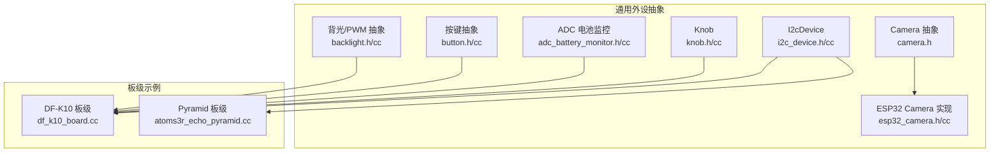
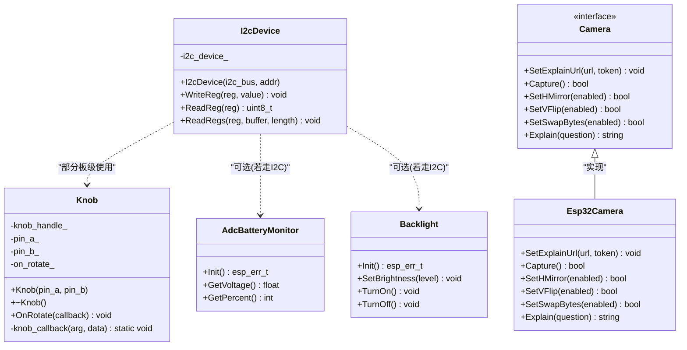
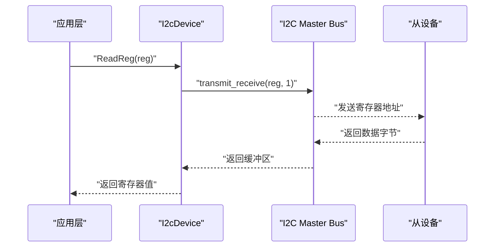
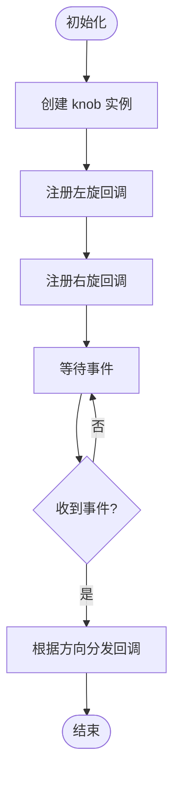
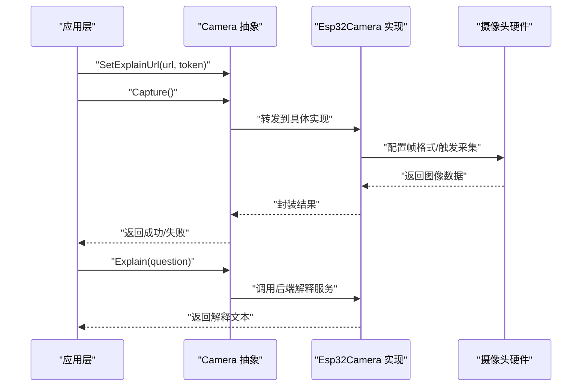
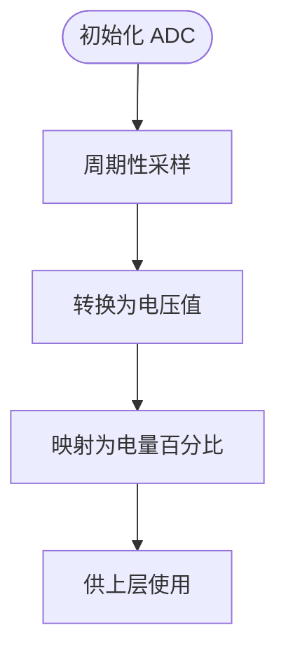
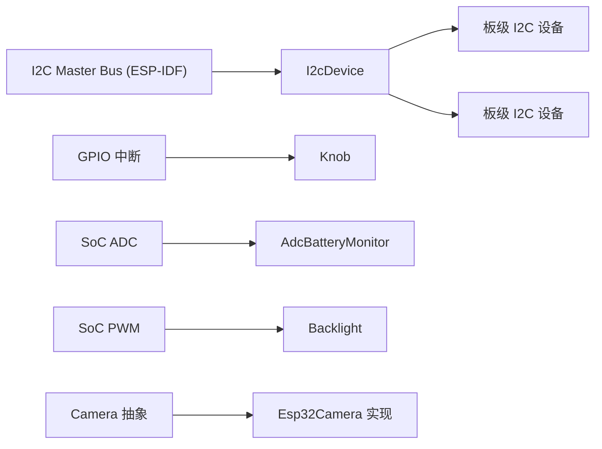

# 外设驱动接口

<cite>
**本文引用的文件**   
- [i2c_device.h](file://main/boards/common/i2c_device.h)
- [i2c_device.cc](file://main/boards/common/i2c_device.cc)
- [knob.h](file://main/boards/common/knob.h)
- [knob.cc](file://main/boards/common/knob.cc)
- [camera.h](file://main/boards/common/camera.h)
- [esp32_camera.h](file://main/boards/common/esp32_camera.h)
- [esp32_camera.cc](file://main/boards/common/esp32_camera.cc)
- [adc_battery_monitor.h](file://main/boards/common/adc_battery_monitor.h)
- [adc_battery_monitor.cc](file://main/boards/common/adc_battery_monitor.cc)
- [button.h](file://main/boards/common/button.h)
- [button.cc](file://main/boards/common/button.cc)
- [backlight.h](file://main/boards/common/backlight.h)
- [backlight.cc](file://main/boards/common/backlight.cc)
- [df_k10_board.cc](file://main/boards/df-k10/df_k10_board.cc)
- [atoms3r_echo_pyramid.cc](file://main/boards/atoms3r-echo-pyramid/atoms3r_echo_pyramid.cc)
</cite>

## 目录
1. [简介](#简介)
2. [项目结构](#项目结构)
3. [核心组件](#核心组件)
4. [架构总览](#架构总览)
5. [详细组件分析](#详细组件分析)
6. [依赖关系分析](#依赖关系分析)
7. [性能与资源考量](#性能与资源考量)
8. [故障排查指南](#故障排查指南)
9. [结论](#结论)
10. [附录](#附录)

## 简介
本文件面向外设驱动开发者，系统化梳理并文档化以下能力：
- I2C 设备抽象层设计与通用读写接口
- GPIO 控制、按键检测、旋钮输入等用户交互接口
- 摄像头接口设计与图像采集流程
- ADC 读取、PWM 输出、SPI 通信等底层硬件操作 API
- 外设初始化配置、中断处理与异步回调模式
- 测试方法与调试技巧（含 I2C 扫描、寄存器探测、日志定位）

## 项目结构
本项目将通用外设抽象放在 boards/common 下，具体板级实现位于各 board 目录中。I2C 抽象、旋钮、摄像头、ADC、GPIO 扩展等均在 common 提供统一接口，便于跨板复用。



图示来源
- [i2c_device.h:1-18](file://main/boards/common/i2c_device.h#L1-L18)
- [i2c_device.cc:1-35](file://main/boards/common/i2c_device.cc#L1-L35)
- [knob.h:1-25](file://main/boards/common/knob.h#L1-L25)
- [knob.cc:1-52](file://main/boards/common/knob.cc#L1-L52)
- [camera.h:1-16](file://main/boards/common/camera.h#L1-L16)
- [esp32_camera.h](file://main/boards/common/esp32_camera.h)
- [esp32_camera.cc](file://main/boards/common/esp32_camera.cc)
- [adc_battery_monitor.h](file://main/boards/common/adc_battery_monitor.h)
- [adc_battery_monitor.cc](file://main/boards/common/adc_battery_monitor.cc)
- [button.h](file://main/boards/common/button.h)
- [button.cc](file://main/boards/common/button.cc)
- [backlight.h](file://main/boards/common/backlight.h)
- [backlight.cc](file://main/boards/common/backlight.cc)
- [df_k10_board.cc:56-82](file://main/boards/df-k10/df_k10_board.cc#L56-L82)
- [atoms3r_echo_pyramid.cc:80-118](file://main/boards/atoms3r-echo-pyramid/atoms3r_echo_pyramid.cc#L80-L118)

章节来源
- [i2c_device.h:1-18](file://main/boards/common/i2c_device.h#L1-L18)
- [i2c_device.cc:1-35](file://main/boards/common/i2c_device.cc#L1-L35)
- [knob.h:1-25](file://main/boards/common/knob.h#L1-L25)
- [knob.cc:1-52](file://main/boards/common/knob.cc#L1-L52)
- [camera.h:1-16](file://main/boards/common/camera.h#L1-L16)
- [df_k10_board.cc:56-82](file://main/boards/df-k10/df_k10_board.cc#L56-L82)
- [atoms3r_echo_pyramid.cc:80-118](file://main/boards/atoms3r-echo-pyramid/atoms3r_echo_pyramid.cc#L80-L118)

## 核心组件
本节聚焦通用外设抽象层的职责边界与对外 API，帮助快速上手与集成。

- I2C 设备抽象层
  - 目标：屏蔽 ESP-IDF I2C Master 细节，提供统一的单字节/多字节读写接口
  - 关键能力：设备注册、寄存器写、寄存器读、连续读
  - 典型用法：在板级初始化时创建 I2C 总线，再为每个从设备构造 I2cDevice 实例

- 旋钮输入
  - 目标：基于编码器引脚 A/B 的旋转事件，向上层暴露方向回调
  - 关键能力：构造、销毁、注册旋转回调（左/右）

- 摄像头抽象
  - 目标：定义跨实现的相机能力集（镜像/翻转、捕获、解释等）
  - 关键能力：设置解释 URL、触发捕获、镜像/翻转开关、可选字节交换、文本解释

- ADC 读取（以电池监控为例）
  - 目标：封装 ADC 采样与电压换算，提供上层易用的电量/电压查询

- GPIO 控制与背光/PWM
  - 目标：通过 GPIO 或 PWM 控制外设（如背光），提供开关与亮度调节

- SPI 通信（板级示例）
  - 目标：展示如何在板级初始化 SPI 主机，用于 LCD 等高速外设

章节来源
- [i2c_device.h:1-18](file://main/boards/common/i2c_device.h#L1-L18)
- [i2c_device.cc:1-35](file://main/boards/common/i2c_device.cc#L1-L35)
- [knob.h:1-25](file://main/boards/common/knob.h#L1-L25)
- [knob.cc:1-52](file://main/boards/common/knob.cc#L1-L52)
- [camera.h:1-16](file://main/boards/common/camera.h#L1-L16)
- [adc_battery_monitor.h](file://main/boards/common/adc_battery_monitor.h)
- [adc_battery_monitor.cc](file://main/boards/common/adc_battery_monitor.cc)
- [backlight.h](file://main/boards/common/backlight.h)
- [backlight.cc](file://main/boards/common/backlight.cc)
- [df_k10_board.cc:56-82](file://main/boards/df-k10/df_k10_board.cc#L56-L82)

## 架构总览
下图展示了 I2C 抽象层与上层组件的关系，以及典型调用路径。



图示来源
- [i2c_device.h:1-18](file://main/boards/common/i2c_device.h#L1-L18)
- [i2c_device.cc:1-35](file://main/boards/common/i2c_device.cc#L1-L35)
- [knob.h:1-25](file://main/boards/common/knob.h#L1-L25)
- [knob.cc:1-52](file://main/boards/common/knob.cc#L1-L52)
- [camera.h:1-16](file://main/boards/common/camera.h#L1-L16)
- [esp32_camera.h](file://main/boards/common/esp32_camera.h)
- [esp32_camera.cc](file://main/boards/common/esp32_camera.cc)
- [adc_battery_monitor.h](file://main/boards/common/adc_battery_monitor.h)
- [adc_battery_monitor.cc](file://main/boards/common/adc_battery_monitor.cc)
- [backlight.h](file://main/boards/common/backlight.h)
- [backlight.cc](file://main/boards/common/backlight.cc)

## 详细组件分析

### I2C 设备抽象层
- 设计要点
  - 基于 ESP-IDF I2C Master Bus 的设备句柄封装
  - 默认 7bit 地址、400kHz 速率，支持单次写、单次读、连续读
  - 错误处理采用 ESP_ERROR_CHECK，便于快速定位失败点
- 关键接口
  - 构造函数：绑定 I2C 总线与设备地址
  - WriteReg：寄存器写
  - ReadReg：寄存器读
  - ReadRegs：连续读多个寄存器
- 典型时序（寄存器读）



图示来源
- [i2c_device.cc:27-31](file://main/boards/common/i2c_device.cc#L27-L31)

- 连续读时序（多寄存器）

```mermaid
sequenceDiagram
participant App as "应用层"
participant Dev as "I2cDevice"
participant Bus as "I2C Master Bus"
participant Slave as "从设备"
App->>Dev : "ReadRegs(reg, buf, len)"
Dev->>Bus : "transmit_receive(reg, 1; buf, len)"
Bus-->>Slave : "发送起始寄存器地址"
Slave-->>Bus : "连续返回 len 个字节"
Bus-->>Dev : "填充缓冲区"
Dev-->>App : "完成"
```

图示来源
- [i2c_device.cc:33-35](file://main/boards/common/i2c_device.cc#L33-L35)

- 使用建议
  - 先通过 i2c_master_probe 扫描总线地址，确认设备在线
  - 对敏感寄存器进行“写后读回”校验
  - 批量读优先使用 ReadRegs，减少总线往返

章节来源
- [i2c_device.h:1-18](file://main/boards/common/i2c_device.h#L1-L18)
- [i2c_device.cc:1-35](file://main/boards/common/i2c_device.cc#L1-L35)
- [atoms3r_echo_pyramid.cc:586-614](file://main/boards/atoms3r-echo-pyramid/atoms3r_echo_pyramid.cc#L586-L614)

### 旋钮输入（编码器）
- 设计要点
  - 基于 iot_knob 库，监听 A/B 相位的边沿变化
  - 通过回调上报旋转方向（左/右）
- 关键接口
  - 构造：传入 A/B 引脚
  - OnRotate：注册回调函数
  - 析构：释放资源
- 事件流



图示来源
- [knob.cc:5-32](file://main/boards/common/knob.cc#L5-L32)
- [knob.cc:41-52](file://main/boards/common/knob.cc#L41-L52)

章节来源
- [knob.h:1-25](file://main/boards/common/knob.h#L1-L25)
- [knob.cc:1-52](file://main/boards/common/knob.cc#L1-L52)

### 摄像头接口与采集流程
- 接口设计
  - Camera 抽象定义了跨实现的统一能力：设置解释 URL、触发捕获、水平/垂直镜像、可选字节交换、文本解释
- 典型采集流程



图示来源
- [camera.h:1-16](file://main/boards/common/camera.h#L1-L16)
- [esp32_camera.h](file://main/boards/common/esp32_camera.h)
- [esp32_camera.cc](file://main/boards/common/esp32_camera.cc)

章节来源
- [camera.h:1-16](file://main/boards/common/camera.h#L1-L16)
- [esp32_camera.h](file://main/boards/common/esp32_camera.h)
- [esp32_camera.cc](file://main/boards/common/esp32_camera.cc)

### ADC 读取（电池监控）
- 设计要点
  - 封装 ADC 通道配置、采样、分压换算与百分比估算
- 典型流程



章节来源
- [adc_battery_monitor.h](file://main/boards/common/adc_battery_monitor.h)
- [adc_battery_monitor.cc](file://main/boards/common/adc_battery_monitor.cc)

### GPIO 控制与背光/PWM
- 设计要点
  - 通过 GPIO 或 PWM 控制外设状态与亮度
  - 提供开关与亮度调节的统一接口
- 典型用法
  - 初始化背光模块
  - 设置亮度等级
  - 开/关背光

章节来源
- [backlight.h](file://main/boards/common/backlight.h)
- [backlight.cc](file://main/boards/common/backlight.cc)

### SPI 通信（板级示例）
- 设计要点
  - 在板级初始化 SPI 主机，配置时钟、MOSI/MISO、最大传输大小等
- 参考实现位置
  - 初始化 SPI 主机的示例在 DF-K10 板级文件中

章节来源
- [df_k10_board.cc:56-65](file://main/boards/df-k10/df_k10_board.cc#L56-L65)

### 按键检测
- 设计要点
  - 通过 GPIO 中断或轮询方式检测按键事件
  - 向上层暴露去抖后的短按/长按等事件
- 参考实现位置
  - 通用按键抽象位于 button.h/cc

章节来源
- [button.h](file://main/boards/common/button.h)
- [button.cc](file://main/boards/common/button.cc)

## 依赖关系分析
- I2C 抽象层依赖 ESP-IDF I2C Master Bus；上层组件通过 I2cDevice 访问从设备
- 旋钮依赖 iot_knob 库，内部使用 GPIO 中断
- 摄像头抽象由具体实现（如 ESP32 Camera）承载，遵循统一接口
- ADC 与背光分别依赖 SoC 的 ADC 与 PWM 外设



图示来源
- [i2c_device.cc:1-20](file://main/boards/common/i2c_device.cc#L1-L20)
- [knob.cc:1-20](file://main/boards/common/knob.cc#L1-L20)
- [adc_battery_monitor.h](file://main/boards/common/adc_battery_monitor.h)
- [backlight.h](file://main/boards/common/backlight.h)
- [camera.h:1-16](file://main/boards/common/camera.h#L1-L16)
- [esp32_camera.h](file://main/boards/common/esp32_camera.h)

章节来源
- [i2c_device.cc:1-20](file://main/boards/common/i2c_device.cc#L1-L20)
- [knob.cc:1-20](file://main/boards/common/knob.cc#L1-L20)
- [camera.h:1-16](file://main/boards/common/camera.h#L1-L16)

## 性能与资源考量
- I2C
  - 速率：默认 400kHz，适合大多数传感器与音频编解码器
  - 批量读：优先使用 ReadRegs 降低总线开销
  - 超时与重试：结合 ESP_ERROR_CHECK 与外部重试策略提升鲁棒性
- 旋钮
  - 中断驱动，CPU 占用低；注意消抖与回调执行时间
- 摄像头
  - 捕获过程可能涉及 DMA 与帧缓冲，需关注内存峰值
  - 镜像/翻转在硬件层面完成可减少 CPU 负担
- ADC
  - 采样频率与分辨率权衡；分压网络精度影响电量估算
- PWM/背光
  - 频率与占空比影响功耗与显示效果；避免高频切换造成闪烁

[本节为通用指导，不直接分析具体文件]

## 故障排查指南
- I2C 设备不可达
  - 使用 i2c_master_probe 扫描总线地址，确认设备响应
  - 检查 SDA/SCL 上拉电阻与连线
  - 核对设备地址位长（7bit/10bit）与速度匹配
- 寄存器读写异常
  - 先写后读回验证；对比数据手册期望值
  - 检查是否需要在读前写入寄存器地址指针
- 旋钮无响应
  - 确认 A/B 引脚分配与硬件接线
  - 检查回调是否被正确注册
- 摄像头无法捕获
  - 检查电源与时钟配置
  - 确认镜像/翻转参数与像素格式
- ADC 读数漂移
  - 增加采样平滑与滤波
  - 校准分压系数与参考电压
- 背光不亮或闪烁
  - 检查 PWM 频率与占空比范围
  - 确认 GPIO 复用与使能

章节来源
- [atoms3r_echo_pyramid.cc:586-614](file://main/boards/atoms3r-echo-pyramid/atoms3r_echo_pyramid.cc#L586-L614)
- [i2c_device.cc:22-35](file://main/boards/common/i2c_device.cc#L22-L35)
- [knob.cc:19-32](file://main/boards/common/knob.cc#L19-L32)

## 结论
通过 I2C 抽象层、旋钮、摄像头、ADC、GPIO/PWM 与 SPI 等通用接口，本项目实现了跨板可复用的外设驱动体系。上层业务只需面向稳定接口开发，无需关心底层差异。配合完善的调试手段与性能优化建议，可显著提升开发与维护效率。

[本节为总结性内容，不直接分析具体文件]

## 附录
- 初始化清单（建议）
  - 系统时钟与电源域
  - I2C 总线与设备枚举
  - GPIO 中断与旋钮
  - ADC 通道与采样周期
  - PWM 通道与背光策略
  - SPI 主机与外设挂载
  - 摄像头初始化与参数配置
- 常用调试命令
  - I2C 扫描：遍历 0x00-0x7F，打印在线地址
  - 寄存器快照：启动前后对比关键寄存器
  - 日志级别：提高日志等级以获取更详细信息

[本节为补充信息，不直接分析具体文件]