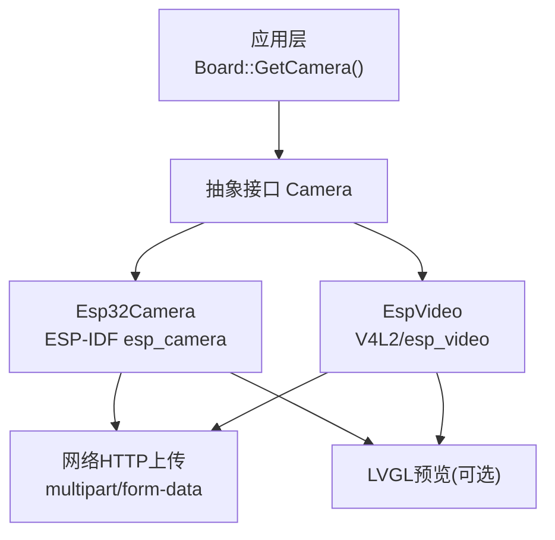
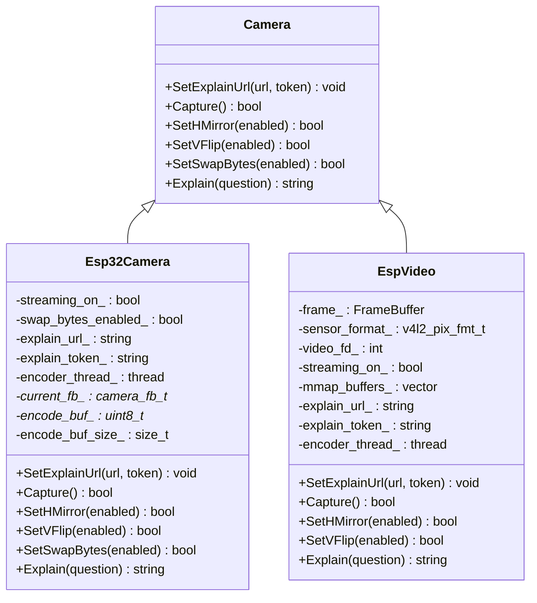
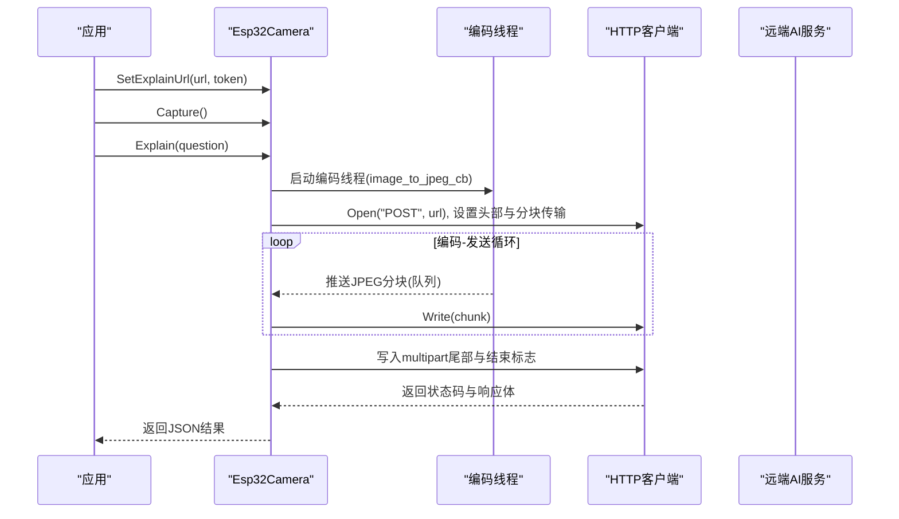
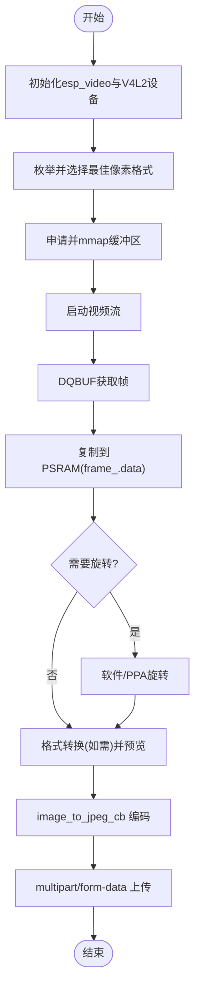
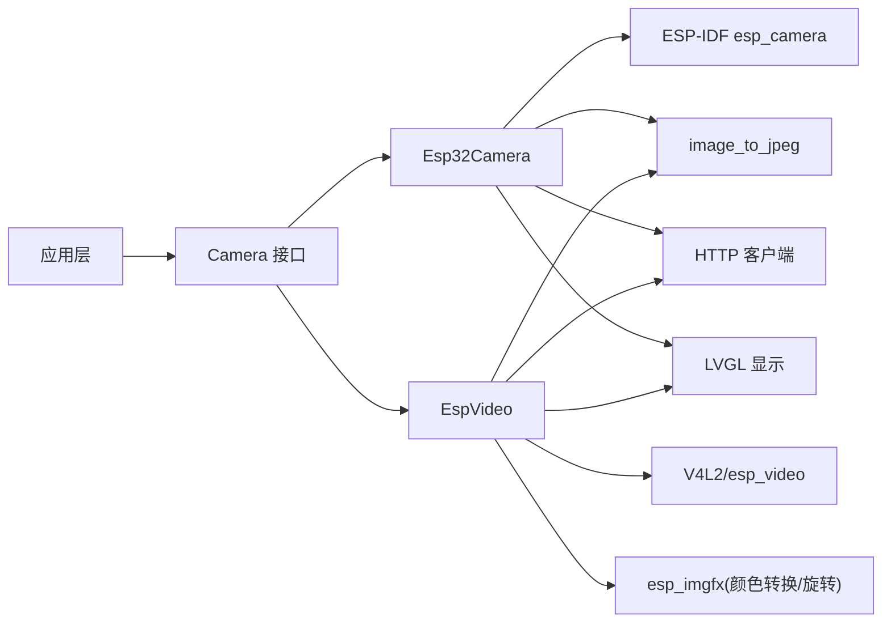

# 摄像头接口

<cite>
**本文引用的文件**   
- [camera.h](file://main/boards/common/camera.h)
- [esp32_camera.h](file://main/boards/common/esp32_camera.h)
- [esp32_camera.cc](file://main/boards/common/esp32_camera.cc)
- [esp_video.h](file://main/boards/common/esp_video.h)
- [esp_video.cc](file://main/boards/common/esp_video.cc)
- [atk_dnesp32s3.cc](file://main/boards/atk-dnesp32s3/atk_dnesp32s3.cc)
- [df_s3_ai_cam.cc](file://main/boards/df-s3-ai-cam/df_s3_ai_cam.cc)
</cite>

## 目录
1. [简介](#简介)
2. [项目结构](#项目结构)
3. [核心组件](#核心组件)
4. [架构总览](#架构总览)
5. [详细组件分析](#详细组件分析)
6. [依赖关系分析](#依赖关系分析)
7. [性能与内存优化](#性能与内存优化)
8. [故障排查指南](#故障排查指南)
9. [结论](#结论)
10. [附录：板级适配与配置差异](#附录板级适配与配置差异)

## 简介
本文件面向 ESP32 系列设备的摄像头子系统，提供统一的抽象层 API 与两套具体实现：基于 ESP-IDF esp_camera 的 Esp32Camera 和基于 V4L2/esp_video 的 EspVideo。文档覆盖以下主题：
- 摄像头抽象层设计与图像采集流程
- ESP32 摄像头初始化、分辨率与帧率控制要点
- 图像格式转换、JPEG 压缩与内存管理策略
- 拍照、图像预处理（镜像/翻转/旋转）、以及“解释”（上传到远端 AI）的完整调用链
- 不同板级的硬件适配与配置差异
- 性能优化、内存泄漏防护与异常恢复方案

## 项目结构
摄像头相关代码集中在 boards/common 下的通用实现与各板级初始化示例中：
- 抽象接口：camera.h
- ESP-IDF 摄像头驱动封装：esp32_camera.{h,cc}
- V4L2/esp_video 摄像头封装：esp_video.{h,cc}
- 板级初始化示例：atk-dnesp32s3、df-s3-ai-cam 等

图表来源
- [camera.h:6-14](file://main/boards/common/camera.h#L6-L14)
- [esp32_camera.h:22-44](file://main/boards/common/esp32_camera.h#L22-L44)
- [esp_video.h:21-53](file://main/boards/common/esp_video.h#L21-L53)

章节来源
- [camera.h:1-16](file://main/boards/common/camera.h#L1-L16)
- [esp32_camera.h:1-45](file://main/boards/common/esp32_camera.h#L1-L45)
- [esp_video.h:1-54](file://main/boards/common/esp_video.h#L1-L54)

## 核心组件
- 抽象接口 Camera
  - 统一能力：设置解释服务URL与令牌、捕获一帧、水平/垂直翻转、字节序交换（可选）、将当前帧发送到远端进行AI解释并返回结果。
- 具体实现
  - Esp32Camera：基于 ESP-IDF esp_camera，支持 RGB565/YUV/JPEG 等像素格式，内部维护编码缓冲与预览数据，使用 image_to_jpeg_cb 进行 JPEG 编码并通过 HTTP multipart 流式上传。
  - EspVideo：基于 V4L2/esp_video，通过 ioctl 枚举并选择最佳像素格式，mmap 获取帧缓冲，支持旋转（软件或 PPA 硬件），同样使用 image_to_jpeg_cb 编码并 HTTP 上传。

章节来源
- [camera.h:6-14](file://main/boards/common/camera.h#L6-L14)
- [esp32_camera.h:22-44](file://main/boards/common/esp32_camera.h#L22-L44)
- [esp_video.h:21-53](file://main/boards/common/esp_video.h#L21-L53)

## 架构总览
摄像头子系统采用“抽象接口 + 多后端实现”的分层设计，上层仅依赖 Camera 接口；底层分别对接 ESP-IDF 摄像头栈与 V4L2 视频设备栈。两者在“解释”流程中共享相同的编码与上传策略。

图表来源
- [camera.h:6-14](file://main/boards/common/camera.h#L6-L14)
- [esp32_camera.h:22-44](file://main/boards/common/esp32_camera.h#L22-L44)
- [esp_video.h:21-53](file://main/boards/common/esp_video.h#L21-L53)

## 详细组件分析

### 抽象接口 Camera
- 职责
  - 屏蔽底层差异，向上暴露一致的拍照、翻转、字节序交换与“解释”能力。
- 关键方法
  - SetExplainUrl：设置远端解释服务的 URL 与认证令牌。
  - Capture：拉取最新帧，必要时做格式转换与预览准备。
  - SetHMirror/SetVFlip：控制传感器镜像/翻转。
  - SetSwapBytes：针对某些平台交换像素字节序（默认无操作）。
  - Explain：对当前帧进行 JPEG 编码并通过 HTTP multipart 上传，返回服务器响应。

章节来源
- [camera.h:6-14](file://main/boards/common/camera.h#L6-L14)

### Esp32Camera（ESP-IDF 摄像头）
- 初始化
  - 调用 esp_camera_init 完成驱动初始化，记录传感器信息，标记 streaming_on_。
- 捕获流程
  - 丢弃旧帧以保障实时性，获取最新 frame buffer。
  - 若为 RGB565，可复制到专用编码缓冲并可按配置交换字节序；同时可选地生成 LVGL 预览图。
- 编码与上传
  - 启动独立线程，根据当前帧格式映射到 V4L2 像素格式常量，调用 image_to_jpeg_cb 分块编码。
  - 主线程构建 multipart/form-data 请求体，边接收编码块边写入 HTTP 连接，完成后读取响应并清理资源。
- 错误处理
  - 未设置解释 URL/令牌、无帧、队列创建失败、编码器失败、HTTP 状态非 200 等均抛出异常并记录日志。
- 内存管理
  - 编码缓冲与 JPEG 分块均分配于 PSRAM，避免堆碎片；析构时释放编码缓冲并归还帧缓冲、反初始化驱动。

图表来源
- [esp32_camera.cc:20-36](file://main/boards/common/esp32_camera.cc#L20-L36)
- [esp32_camera.cc:59-130](file://main/boards/common/esp32_camera.cc#L59-L130)
- [esp32_camera.cc:155-322](file://main/boards/common/esp32_camera.cc#L155-L322)

章节来源
- [esp32_camera.h:22-44](file://main/boards/common/esp32_camera.h#L22-L44)
- [esp32_camera.cc:20-52](file://main/boards/common/esp32_camera.cc#L20-L52)
- [esp32_camera.cc:59-130](file://main/boards/common/esp32_camera.cc#L59-L130)
- [esp32_camera.cc:155-322](file://main/boards/common/esp32_camera.cc#L155-L322)

### EspVideo（V4L2/esp_video）
- 初始化
  - 调用 esp_video_init 后打开 /dev/videoX 设备，查询能力与当前格式，枚举支持的像素格式并选择最优项（考虑旋转与硬件编码器可用性）。
  - 申请并 mmap 缓冲区，入队并启动流；ISP 场景下后台预热若干帧后再置 streaming_on_。
- 捕获流程
  - 从内核出队一个帧缓冲，复制至 PSRAM 中的 frame_.data，并根据 sensor_format_ 处理大小端与 YUV422P 兼容问题。
  - 可选旋转：在无 PPA 时使用 esp_imgfx_rotate，或在 PPA 上走硬件旋转；YUYV 需先转 RGB888 再旋转。
  - 预览：将 YUV/RGB24 转换为 RGB565 后交给 LVGL 显示；若允许 JPEG 输入则直接解码为 RGB 显示。
- 编码与上传
  - 与 Esp32Camera 一致：独立线程 image_to_jpeg_cb 编码，主线程构造 multipart 请求并流式发送。
- 错误处理
  - 设备打开/IOCTL 失败、格式不支持、内存分配失败、编码器失败、HTTP 非 200 等均记录日志并抛异常。
- 内存管理
  - 所有大对象优先分配在 PSRAM；析构时停止流、munmap 所有映射、关闭 fd、反初始化驱动。

图表来源
- [esp_video.cc:98-162](file://main/boards/common/esp_video.cc#L98-L162)
- [esp_video.cc:167-267](file://main/boards/common/esp_video.cc#L167-L267)
- [esp_video.cc:277-363](file://main/boards/common/esp_video.cc#L277-L363)
- [esp_video.cc:388-841](file://main/boards/common/esp_video.cc#L388-L841)
- [esp_video.cc:900-1041](file://main/boards/common/esp_video.cc#L900-L1041)

章节来源
- [esp_video.h:21-53](file://main/boards/common/esp_video.h#L21-L53)
- [esp_video.cc:98-162](file://main/boards/common/esp_video.cc#L98-L162)
- [esp_video.cc:167-267](file://main/boards/common/esp_video.cc#L167-L267)
- [esp_video.cc:277-363](file://main/boards/common/esp_video.cc#L277-L363)
- [esp_video.cc:388-841](file://main/boards/common/esp_video.cc#L388-L841)
- [esp_video.cc:900-1041](file://main/boards/common/esp_video.cc#L900-L1041)

## 依赖关系分析
- 模块耦合
  - Camera 接口解耦上层业务与底层驱动。
  - Esp32Camera 依赖 ESP-IDF esp_camera、img_converters、jpg/image_to_jpeg、LVGL 显示、系统信息与网络抽象。
  - EspVideo 依赖 esp_video、V4L2 头、esp_imgfx（颜色转换/旋转）、jpg/jpeg_to_image、LVGL 显示、系统信息与网络抽象。
- 外部依赖
  - 网络抽象 Board::GetNetwork()->CreateHttp(...) 用于上传。
  - 显示抽象 Board::GetDisplay() 用于预览。
- 潜在环路与风险
  - 编码线程与主线程通过队列通信，注意队列销毁与线程 join 顺序，避免悬挂引用。
  - 大量 PSRAM 分配需关注碎片与对齐要求（如 16 字节对齐）。

图表来源
- [esp32_camera.cc:9-16](file://main/boards/common/esp32_camera.cc#L9-L16)
- [esp_video.cc:13-26](file://main/boards/common/esp_video.cc#L13-L26)

章节来源
- [esp32_camera.cc:9-16](file://main/boards/common/esp32_camera.cc#L9-L16)
- [esp_video.cc:13-26](file://main/boards/common/esp_video.cc#L13-L26)

## 性能与内存优化
- 编码与传输
  - 使用 image_to_jpeg_cb 回调分块编码，结合 HTTP chunked 传输，降低峰值内存占用。
  - JPEG 质量参数固定为 80，兼顾体积与质量；可根据场景调整。
- 内存布局
  - 编码缓冲与 JPEG 分块优先分配在 PSRAM，减少 SRAM 压力；部分路径要求 16 字节对齐。
  - RGB565 路径预分配 encode_buf_，避免重复分配；必要时交换字节序以满足目标端期望。
- 预览优化
  - 仅在 RGB565 路径生成预览；其他格式按需转换或直接跳过，减少额外拷贝。
- 并发与同步
  - 编码线程与主线程通过 FreeRTOS 队列通信；确保队列容量足够（例如 40 条目）以避免阻塞。
- 建议
  - 在高负载场景下，适当降低分辨率或帧率，或启用硬件旋转（PPA）以减少 CPU 占用。
  - 监控任务栈水位与剩余堆空间，定位潜在溢出与碎片问题。

[本节为通用指导，不直接分析具体文件]

## 故障排查指南
- 常见错误与定位
  - 初始化失败：检查 esp_camera_init/esp_video_init 返回值与日志。
  - 无法打开设备：确认 /dev/videoX 存在且权限正确；调试模式会打印可用设备列表。
  - 格式不支持：查看枚举输出与选择的像素格式；必要时调整配置开关。
  - 编码失败：检查 image_to_jpeg_cb 返回值与队列是否收到终止标记。
  - 上传失败：检查 HTTP 状态码与网络连通性；确认 URL/Token 已设置。
- 资源泄漏防护
  - 析构路径必须归还帧缓冲、释放编码缓冲、停止流、munmap、关闭 fd、反初始化驱动。
  - 异常分支中确保队列清空与线程 join，避免悬挂指针与未释放内存。
- 日志与调试
  - 开启摄像头调试宏以提升日志级别；必要时打印 FOURCC 与缓冲区首段内容辅助定位。

章节来源
- [esp32_camera.cc:20-52](file://main/boards/common/esp32_camera.cc#L20-L52)
- [esp_video.cc:98-162](file://main/boards/common/esp_video.cc#L98-L162)
- [esp_video.cc:365-381](file://main/boards/common/esp_video.cc#L365-L381)
- [esp_video.cc:900-1041](file://main/boards/common/esp_video.cc#L900-L1041)

## 结论
本摄像头子系统通过统一的 Camera 抽象，兼容 ESP-IDF 与 V4L2 两种后端，提供了稳定的拍照、预处理与“解释”能力。其编码与上传采用分块策略，配合 PSRAM 分配与必要的格式转换/旋转，能在资源受限的 ESP32 平台上实现高效可靠的图像采集与远程分析。

[本节为总结性内容，不直接分析具体文件]

## 附录：板级适配与配置差异
- 典型初始化流程（V4L2/esp_video）
  - 配置 SCCB/I2C、DVP 引脚与时钟频率，组装 esp_video_init_config_t，交由 EspVideo 完成后续流程。
  - 依据传感器型号设置镜像/翻转参数。
- 参考实现
  - atk-dnesp32s3：构建 dvp/sccb 配置并 new EspVideo。
  - df-s3-ai-cam：构建 dvp/sccb 配置并 new EspVideo，按 OV3660/OV2640 设置翻转与镜像。

章节来源
- [atk_dnesp32s3.cc:150-183](file://main/boards/atk-dnesp32s3/atk_dnesp32s3.cc#L150-L183)
- [df_s3_ai_cam.cc:40-84](file://main/boards/df-s3-ai-cam/df_s3_ai_cam.cc#L40-L84)