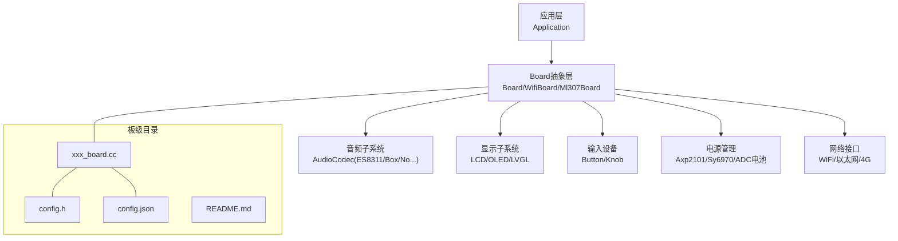
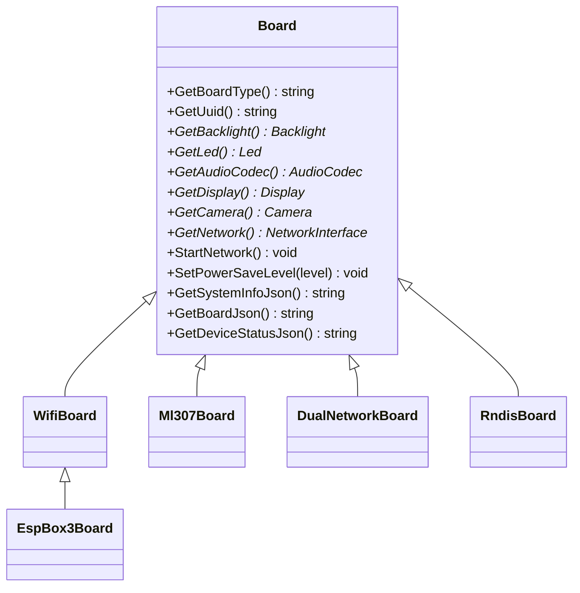
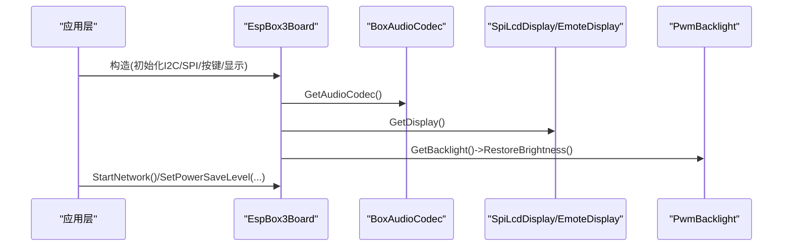
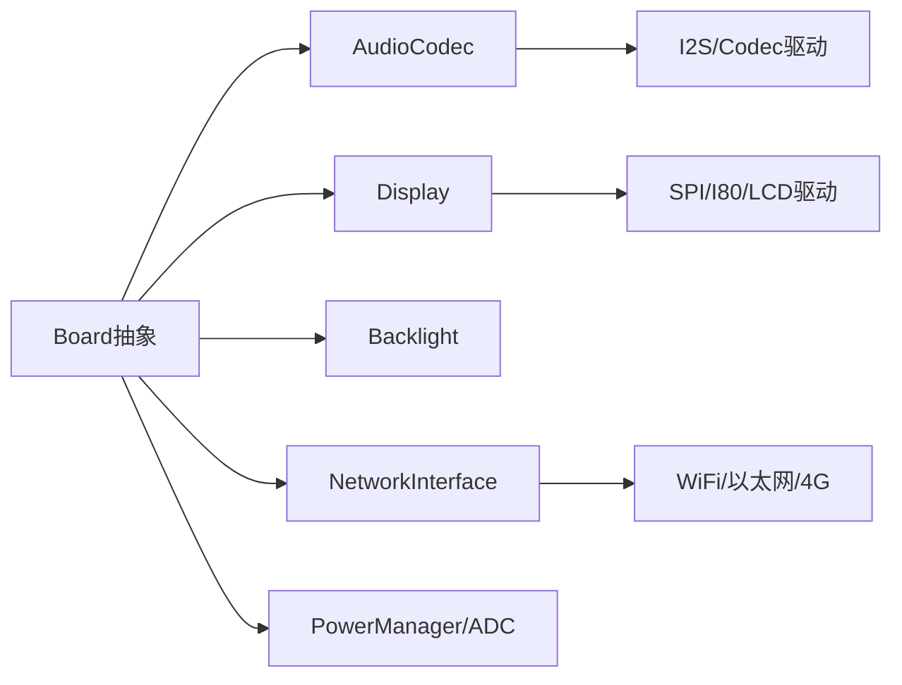

# 板级开发指南

<cite>
**本文引用的文件**   
- [custom-board.md](file://docs/custom-board.md)
- [board.h](file://main/boards/common/board.h)
- [board.cc](file://main/boards/common/board.cc)
- [CMakeLists.txt](file://main/CMakeLists.txt)
- [Kconfig.projbuild](file://main/Kconfig.projbuild)
- [esp_box_board.cc](file://main/boards/esp-box/esp_box_board.cc)
- [esp-box/config.h](file://main/boards/esp-box/config.h)
- [esp-box/config.json](file://main/boards/esp-box/config.json)
- [lichuang-c3-dev/config.h](file://main/boards/lichuang-c3-dev/config.h)
- [lichuang-c3-dev/config.json](file://main/boards/lichuang-c3-dev/config.json)
</cite>

## 目录
1. [简介](#简介)
2. [项目结构](#项目结构)
3. [核心组件](#核心组件)
4. [架构总览](#架构总览)
5. [详细组件分析](#详细组件分析)
6. [依赖关系分析](#依赖关系分析)
7. [性能与功耗考量](#性能与功耗考量)
8. [故障排查指南](#故障排查指南)
9. [结论](#结论)
10. [附录](#附录)

## 简介
本指南面向需要在小智AI语音助手项目中新增或适配新硬件板卡的工程师，提供从“零到一”的完整流程：如何创建板级目录、定义引脚与资源、实现Board类及其虚函数、配置构建系统（Kconfig与CMake）、编写配置文件（config.h与config.json），以及如何进行音频、显示、网络等外设集成。文档同时给出常见问题的定位方法与稳定性验证建议，帮助快速完成高质量板级适配。

## 项目结构
每个板卡通常位于 main/boards/<厂商>/<板名>/ 或 main/boards/<板名>/ 下，典型包含：
- xxx_board.cc：板级初始化与胶水代码
- config.h：引脚映射与板级宏定义
- config.json：构建目标与sdkconfig追加项
- README.md：板卡说明与注意事项

图表来源
- [custom-board.md:11-20](file://docs/custom-board.md#L11-L20)
- [board.h:49-85](file://main/boards/common/board.h#L49-L85)

章节来源
- [custom-board.md:11-20](file://docs/custom-board.md#L11-L20)

## 核心组件
- Board抽象基类：定义统一的硬件能力访问点，如音频、显示、背光、摄像头、网络、电量、系统信息等。
- 具体Board实现：继承自WifiBoard/Ml307Board/DualNetworkBoard/RndisBoard等，负责I2C/SPI/I2S等外设初始化与回调注册。
- 构建系统：通过Kconfig选择板型，CMake根据配置动态加入源文件并设置字体/表情集等编译期常量。
- 配置文件：
  - config.h：集中声明引脚、采样率、显示尺寸、镜像/翻转、背光极性、编解码器地址等。
  - config.json：指定target芯片、固件名称及sdkconfig_append追加项（分区表、语言、唤醒词开关等）。

章节来源
- [board.h:49-85](file://main/boards/common/board.h#L49-L85)
- [board.cc:15-23](file://main/boards/common/board.cc#L15-L23)
- [custom-board.md:34-107](file://docs/custom-board.md#L34-L107)
- [custom-board.md:283-330](file://docs/custom-board.md#L283-L330)

## 架构总览
下图展示了从应用层到具体板级实现的调用链与依赖关系。

图表来源
- [board.h:49-85](file://main/boards/common/board.h#L49-L85)
- [esp_box_board.cc:38-174](file://main/boards/esp-box/esp_box_board.cc#L38-L174)

## 详细组件分析

### Board类与虚函数实现要点
- 必须实现的关键虚函数：
  - GetAudioCodec：返回具体音频编解码器实例（如Es8311AudioCodec、BoxAudioCodec等）
  - GetDisplay：返回显示驱动实例（SpiLcdDisplay/EmoteDisplay等）
  - GetBacklight：返回背光控制实例（PwmBacklight等）
  - GetNetwork/StartNetwork/SetPowerSaveLevel/GetBoardJson/GetDeviceStatusJson：由具体网络类型基类或子类实现
- 可选增强：
  - GetBatteryLevel/GetTemperature：若板载PMIC或传感器支持则覆盖默认实现
  - SetNetworkEventCallback：用于上报联网事件（扫描/连接/断开/配网模式等）
- 生命周期：
  - 构造函数中完成I2C/SPI/I2S等总线与外设初始化，注册按键回调，必要时恢复背光亮度
  - 使用DECLARE_BOARD宏注册工厂方法，供运行时动态创建

章节来源
- [board.h:49-85](file://main/boards/common/board.h#L49-L85)
- [esp_box_board.cc:139-174](file://main/boards/esp-box/esp_box_board.cc#L139-L174)

### 配置文件结构与参数说明

#### config.h（引脚与硬件参数）
- 音频相关：
  - 输入/输出采样率、I2S引脚（MCLK/WS/BCLK/DIN/DOUT）
  - PA控制引脚、I2C SDA/SCL、编解码器地址（ES8311/ES7210等）
  - 是否启用参考通道（双麦降噪/AEC场景）
- 显示相关：
  - SPI引脚（CS/DC/SCK/MOSI）、分辨率、镜像/翻转、偏移量、背光引脚与极性
- 输入与指示：
  - 开机键、音量加减键、内置LED引脚
- 示例参考路径：
  - [esp-box/config.h](file://main/boards/esp-box/config.h)
  - [lichuang-c3-dev/config.h](file://main/boards/lichuang-c3-dev/config.h)

章节来源
- [esp-box/config.h:1-42](file://main/boards/esp-box/config.h#L1-L42)
- [lichuang-c3-dev/config.h:1-46](file://main/boards/lichuang-c3-dev/config.h#L1-L46)

#### config.json（构建与打包）
- target：目标芯片（esp32/esp32s3/esp32c3/esp32c6/esp32p4等）
- builds数组：
  - name：固件包名（通常与目录一致）
  - sdkconfig_append：追加的sdkconfig宏（Flash大小、分区表、语言、唤醒词开关等）
- 示例参考路径：
  - [esp-box/config.json](file://main/boards/esp-box/config.json)
  - [lichuang-c3-dev/config.json](file://main/boards/lichuang-c3-dev/config.json)

章节来源
- [esp-box/config.json:1-9](file://main/boards/esp-box/config.json#L1-L9)
- [lichuang-c3-dev/config.json:1-14](file://main/boards/lichuang-c3-dev/config.json#L1-L14)

### 构建系统集成（Kconfig与CMake）
- Kconfig：在choice BOARD_TYPE中添加新板选项，并通过depends on限制目标芯片；可附加屏幕类型、OLED/LCD型号等细分选择。
- CMake：根据CONFIG_BOARD_TYPE_*分支设置BOARD_TYPE、MANUFACTURER、BUILTIN_TEXT_FONT、BUILTIN_ICON_FONT、DEFAULT_EMOJI_COLLECTION等变量，从而决定源码收集与资源打包。
- 参考路径：
  - [Kconfig.projbuild](file://main/Kconfig.projbuild)
  - [CMakeLists.txt](file://main/CMakeLists.txt)

章节来源
- [Kconfig.projbuild:146-210](file://main/Kconfig.projbuild#L146-L210)
- [CMakeLists.txt:116-127](file://main/CMakeLists.txt#L116-L127)

### 板级适配示例：ESP-BOX（含复杂音频与显示）
- 初始化顺序：
  - I2C总线（音频编解码器）
  - SPI总线（LCD面板）
  - LCD驱动初始化（ILI9341自定义命令序列）
  - 按键绑定（单击切换对话状态，双击切换AEC模式）
  - 背光恢复
- 关键虚函数：
  - GetAudioCodec：返回BoxAudioCodec（支持ES8311+ES7210阵列麦克风）
  - GetDisplay：返回SpiLcdDisplay或EmoteDisplay（取决于配置）
  - GetBacklight：返回PwmBacklight
- 参考路径：
  - [esp_box_board.cc](file://main/boards/esp-box/esp_box_board.cc)
  - [esp-box/config.h](file://main/boards/esp-box/config.h)
  - [esp-box/config.json](file://main/boards/esp-box/config.json)

图表来源
- [esp_box_board.cc:139-174](file://main/boards/esp-box/esp_box_board.cc#L139-L174)

章节来源
- [esp_box_board.cc:1-174](file://main/boards/esp-box/esp_box_board.cc#L1-L174)

### 简单示例：最小化LED控制（概念性流程）
- 步骤概览：
  - 新建板目录与config.h（仅定义必要GPIO）
  - 实现Board类，GetLed返回单灯或GPIO LED实例
  - 在Kconfig与CMake中注册该板
  - 构建并烧录，验证LED闪烁逻辑
- 说明：此流程为通用思路，不涉及具体代码片段，实际可参考现有简单板卡实现风格。

[本节为概念性说明，不直接分析具体文件]

### 复杂示例：音频系统接入（多路输入/输出与AEC）
- 要点：
  - 正确配置I2S与PA引脚、I2C地址、参考通道开关
  - 选择合适的AudioCodec（ES8311/ES8374/ES8388/ES8389/Box/No/Dummy）
  - 若需要双麦降噪/AEC，确保参考通道与算法开关匹配
- 参考路径：
  - [esp-box/config.h](file://main/boards/esp-box/config.h)
  - [esp_box_board.cc](file://main/boards/esp-box/esp_box_board.cc)

章节来源
- [esp-box/config.h:1-42](file://main/boards/esp-box/config.h#L1-L42)
- [esp_box_board.cc:147-162](file://main/boards/esp-box/esp_box_board.cc#L147-L162)

### 显示系统接入（SPI/QSPI/RGB/I80）
- 要点：
  - 初始化SPI/I80总线与Panel IO
  - 配置LCD驱动（ST7789/ILI9341/GC9A01等）与自定义初始化命令
  - 设置像素格式、颜色序、镜像/翻转、偏移
- 参考路径：
  - [esp_box_board.cc:92-136](file://main/boards/esp-box/esp_box_board.cc#L92-L136)

章节来源
- [esp_box_board.cc:92-136](file://main/boards/esp-box/esp_box_board.cc#L92-L136)

### 网络与电源管理
- 网络：
  - WiFi：基于WifiBoard，处理配网与连接事件
  - 4G：基于Ml307Board/Nt26Board，处理SIM检测、注册失败等事件
  - 以太网：基于EthernetBoard（特定板卡）
- 电源：
  - PMIC（Axp2101/Sy6970）、ADC电池监测、省电定时器
- 参考路径：
  - [custom-board.md:427-445](file://docs/custom-board.md#L427-L445)

章节来源
- [custom-board.md:427-445](file://docs/custom-board.md#L427-L445)

## 依赖关系分析
- 组件耦合：
  - Board作为统一入口，聚合AudioCodec/Display/Backlight/Network等子模块
  - 具体Board实现依赖各外设驱动与平台库（ESP-IDF）
- 外部依赖：
  - ESP-IDF驱动（I2C/SPI/I2S/LCD/Codec）
  - LVGL（图形界面）
  - 协议栈（WebSocket/MQTT/UDP）
- 潜在循环依赖：
  - 避免在Board构造中强依赖尚未初始化的子系统；按“总线→外设→上层回调”的顺序初始化

图表来源
- [board.h:49-85](file://main/boards/common/board.h#L49-L85)
- [custom-board.md:398-445](file://docs/custom-board.md#L398-L445)

章节来源
- [board.h:49-85](file://main/boards/common/board.h#L49-L85)
- [custom-board.md:398-445](file://docs/custom-board.md#L398-L445)

## 性能与功耗考量
- 音频：
  - 合理选择采样率与通道数；开启AEC时注意CPU占用与内存缓冲
  - 使用合适的Codec与DMA传输，减少中断开销
- 显示：
  - 调整SPI时钟与帧缓冲大小，平衡刷新率与带宽
  - 合理使用镜像/翻转与局部刷新策略
- 电源：
  - 利用PowerSaveLevel与SleepTimer降低空闲功耗
  - 对非必要外设进行按需上电/断电
- 网络：
  - 合理设置重连与超时策略，避免频繁握手导致功耗飙升

[本节为通用指导，不直接分析具体文件]

## 故障排查指南
- 显示异常：
  - 检查SPI配置、颜色反转、镜像/翻转、复位引脚时序
- 无音频：
  - 核对I2S接线、PA使能引脚、I2C地址与寄存器配置
- 无法连接WiFi：
  - 确认SSID/密码、配网流程与服务器可达性
- 无法到达服务器：
  - 校验WebSocket/MQTT端点配置与证书/代理设置
- 参考路径：
  - [custom-board.md:462-468](file://docs/custom-board.md#L462-L468)

章节来源
- [custom-board.md:462-468](file://docs/custom-board.md#L462-L468)

## 结论
通过遵循本指南的流程与最佳实践，开发者可以高效完成新板级的适配工作：从引脚与资源配置、Board类实现、构建系统集成，到音频/显示/网络/电源等子系统对接。建议在迭代过程中采用“先点亮显示、再打通音频、最后全栈联调”的策略，并结合日志与工具进行问题定位与稳定性验证。

[本节为总结性内容，不直接分析具体文件]

## 附录

### 常用宏与字段速查
- config.h关键字段：
  - AUDIO_INPUT_SAMPLE_RATE / AUDIO_OUTPUT_SAMPLE_RATE
  - AUDIO_I2S_GPIO_MCLK / WS / BCLK / DIN / DOUT
  - AUDIO_CODEC_PA_PIN / I2C_SDA / I2C_SCL / ES8311_ADDR / ES7210_ADDR
  - DISPLAY_WIDTH / HEIGHT / MIRROR_X/Y / SWAP_XY / OFFSET_X/Y
  - DISPLAY_BACKLIGHT_PIN / OUTPUT_INVERT
  - BOOT_BUTTON_GPIO / VOLUME_UP_DOWN_GPIO / BUILTIN_LED_GPIO
- config.json关键字段：
  - target / builds[].name / builds[].sdkconfig_append

章节来源
- [esp-box/config.h:1-42](file://main/boards/esp-box/config.h#L1-L42)
- [lichuang-c3-dev/config.h:1-46](file://main/boards/lichuang-c3-dev/config.h#L1-L46)
- [esp-box/config.json:1-9](file://main/boards/esp-box/config.json#L1-L9)
- [lichuang-c3-dev/config.json:1-14](file://main/boards/lichuang-c3-dev/config.json#L1-L14)

### 构建与发布流程
- 手动方式：
  - idf.py set-target → fullclean → menuconfig选择板型 → build/flash/monitor
- 脚本方式（推荐）：
  - python scripts/release.py <board-directory>
- 参考路径：
  - [custom-board.md:331-371](file://docs/custom-board.md#L331-L371)

章节来源
- [custom-board.md:331-371](file://docs/custom-board.md#L331-L371)