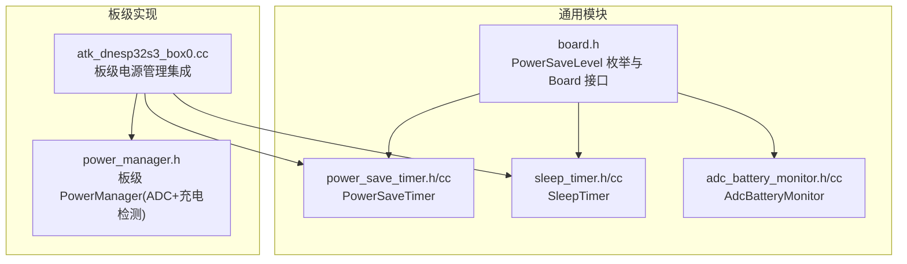
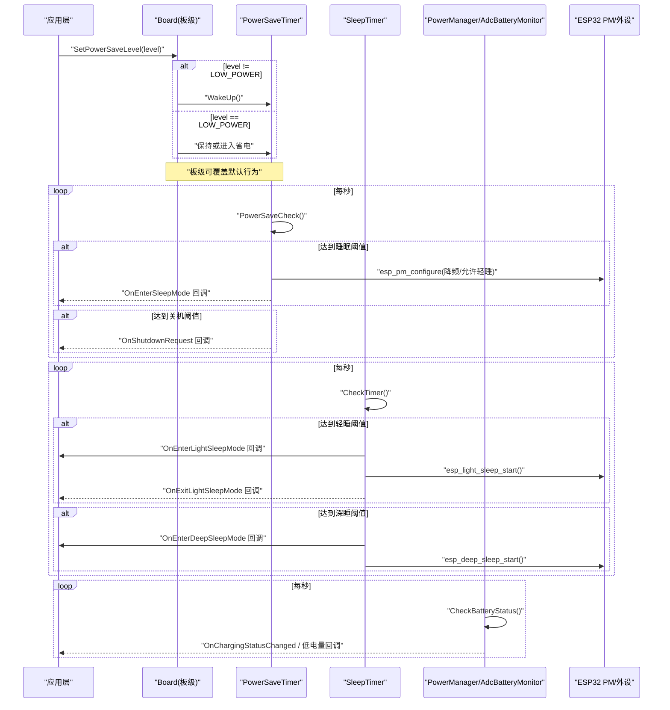
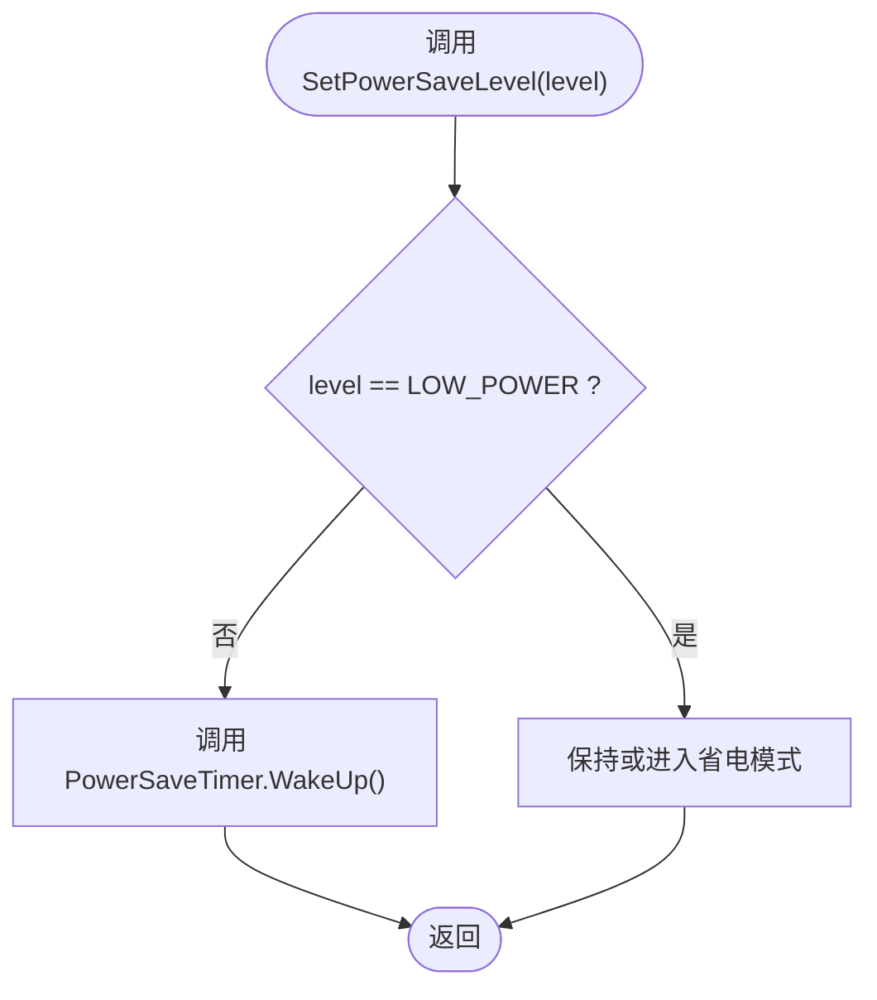
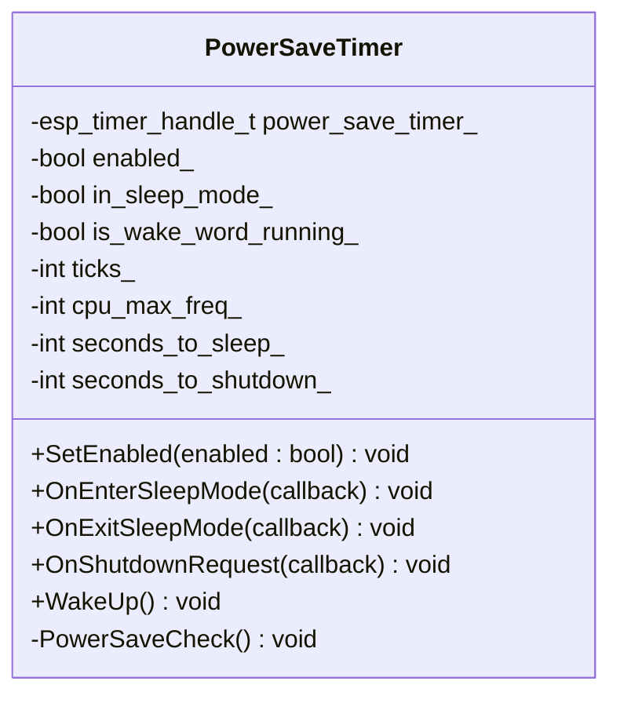
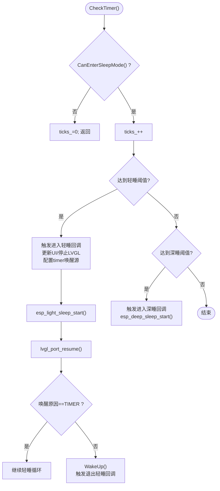
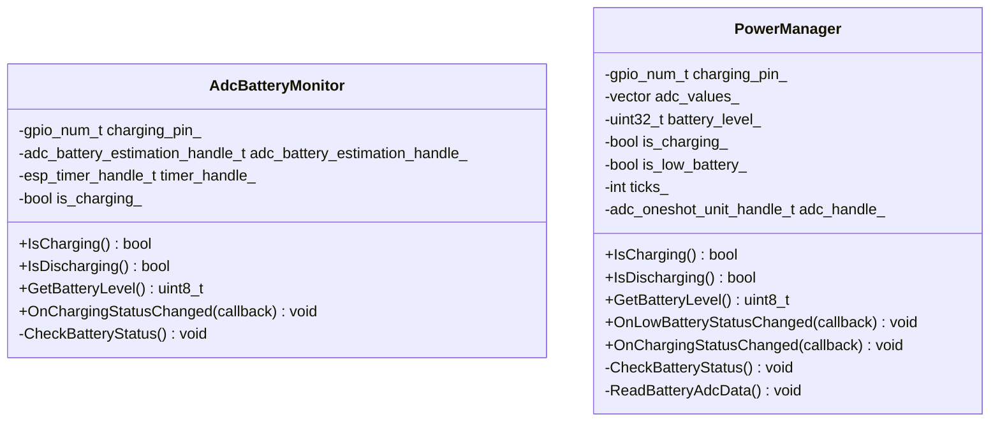
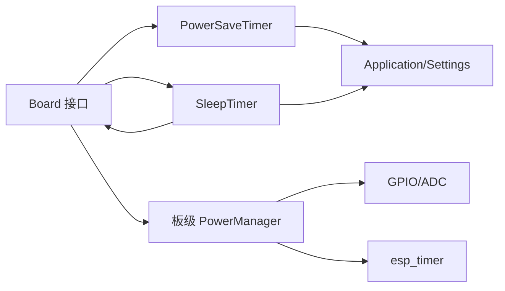

# 电源管理接口

<cite>
**本文引用的文件**   
- [board.h](file://main/boards/common/board.h)
- [power_save_timer.h](file://main/boards/common/power_save_timer.h)
- [power_save_timer.cc](file://main/boards/common/power_save_timer.cc)
- [sleep_timer.h](file://main/boards/common/sleep_timer.h)
- [sleep_timer.cc](file://main/boards/common/sleep_timer.cc)
- [adc_battery_monitor.h](file://main/boards/common/adc_battery_monitor.h)
- [adc_battery_monitor.cc](file://main/boards/common/adc_battery_monitor.cc)
- [atk_dnesp32s3_box0.cc](file://main/boards/atk-dnesp32s3-box0/atk_dnesp32s3_box0.cc)
- [power_manager.h](file://main/boards/atk-dnesp32s3-box0/power_manager.h)
</cite>

## 目录
1. [简介](#简介)
2. [项目结构](#项目结构)
3. [核心组件](#核心组件)
4. [架构总览](#架构总览)
5. [详细组件分析](#详细组件分析)
6. [依赖关系分析](#依赖关系分析)
7. [性能考虑](#性能考虑)
8. [故障排查指南](#故障排查指南)
9. [结论](#结论)
10. [附录：板级配置与调优示例](#附录板级配置与调优示例)

## 简介
本文件为电源管理接口的完整API文档，聚焦以下目标：
- PowerSaveLevel 电源管理模式与 SetPowerSaveLevel() 方法的行为说明
- 低功耗定时器（PowerSaveTimer）、睡眠定时器（SleepTimer）与电池监控（AdcBatteryMonitor/PowerManager）的接口设计
- 电源状态检测与电量计算方法
- 休眠唤醒机制、功耗优化策略与最佳实践
- 不同板级的电源管理配置示例与性能调优指南

## 项目结构
电源管理相关代码主要分布在通用模块与各板级实现中：
- 通用模块
  - 电源模式枚举与Board抽象接口定义
  - 低功耗定时器与睡眠定时器
  - ADC电池监控库封装
- 板级实现
  - 以 atk-dnesp32s3-box0 为例，展示如何组合使用上述组件并实现 SetPowerSaveLevel()

图表来源
- [board.h:35-40](file://main/boards/common/board.h#L35-L40)
- [power_save_timer.h:8-34](file://main/boards/common/power_save_timer.h#L8-L34)
- [power_save_timer.cc:10-28](file://main/boards/common/power_save_timer.cc#L10-L28)
- [sleep_timer.h:8-32](file://main/boards/common/sleep_timer.h#L8-L32)
- [sleep_timer.cc:14-27](file://main/boards/common/sleep_timer.cc#L14-L27)
- [adc_battery_monitor.h:9-28](file://main/boards/common/adc_battery_monitor.h#L9-L28)
- [adc_battery_monitor.cc:3-55](file://main/boards/common/adc_battery_monitor.cc#L3-L55)
- [atk_dnesp32s3_box0.cc:380-385](file://main/boards/atk-dnesp32s3-box0/atk_dnesp32s3_box0.cc#L380-L385)
- [power_manager.h:10-26](file://main/boards/atk-dnesp32s3-box0/power_manager.h#L10-L26)

章节来源
- [board.h:35-40](file://main/boards/common/board.h#L35-L40)
- [power_save_timer.h:8-34](file://main/boards/common/power_save_timer.h#L8-L34)
- [power_save_timer.cc:10-28](file://main/boards/common/power_save_timer.cc#L10-L28)
- [sleep_timer.h:8-32](file://main/boards/common/sleep_timer.h#L8-L32)
- [sleep_timer.cc:14-27](file://main/boards/common/sleep_timer.cc#L14-L27)
- [adc_battery_monitor.h:9-28](file://main/boards/common/adc_battery_monitor.h#L9-L28)
- [adc_battery_monitor.cc:3-55](file://main/boards/common/adc_battery_monitor.cc#L3-L55)
- [atk_dnesp32s3_box0.cc:380-385](file://main/boards/atk-dnesp32s3-box0/atk_dnesp32s3_box0.cc#L380-L385)
- [power_manager.h:10-26](file://main/boards/atk-dnesp32s3-box0/power_manager.h#L10-L26)

## 核心组件
- PowerSaveLevel 与 Board::SetPowerSaveLevel()
  - PowerSaveLevel 定义了三种模式：LOW_POWER、BALANCED、PERFORMANCE
  - Board 抽象接口提供 SetPowerSaveLevel(level)，由具体板级实现决定行为
- PowerSaveTimer（低功耗定时器）
  - 周期性检查空闲时长，进入“省电模式”（降低CPU频率、关闭音频输入、可选关闭唤醒词检测），并可触发关机回调
  - WakeUp() 恢复至高性能模式并恢复之前状态
- SleepTimer（睡眠定时器）
  - 支持轻睡（light sleep）与深睡（deep sleep）两种休眠路径
  - 可注册进入/退出轻睡与进入深睡的回调
- AdcBatteryMonitor（ADC电池监控）
  - 基于 adc_battery_estimation 库进行电压采样与容量估算
  - 支持可选的硬件充电检测引脚，提供 IsCharging()/IsDischarging()/GetBatteryLevel()
- 板级 PowerManager（atk-dnesp32s3-box0）
  - 通过GPIO读取充电状态，结合ADC采样与插值算法计算电量百分比
  - 提供低电量阈值回调与定时任务驱动

章节来源
- [board.h:35-40](file://main/boards/common/board.h#L35-L40)
- [power_save_timer.h:8-34](file://main/boards/common/power_save_timer.h#L8-L34)
- [power_save_timer.cc:62-133](file://main/boards/common/power_save_timer.cc#L62-L133)
- [sleep_timer.h:8-32](file://main/boards/common/sleep_timer.h#L8-L32)
- [sleep_timer.cc:66-134](file://main/boards/common/sleep_timer.cc#L66-L134)
- [adc_battery_monitor.h:9-28](file://main/boards/common/adc_battery_monitor.h#L9-L28)
- [adc_battery_monitor.cc:68-116](file://main/boards/common/adc_battery_monitor.cc#L68-L116)
- [power_manager.h:10-193](file://main/boards/atk-dnesp32s3-box0/power_manager.h#L10-L193)

## 架构总览
下图展示了上层应用通过 Board 接口设置电源模式后，各组件如何协作完成功耗控制与休眠唤醒。

图表来源
- [atk_dnesp32s3_box0.cc:380-385](file://main/boards/atk-dnesp32s3-box0/atk_dnesp32s3_box0.cc#L380-L385)
- [power_save_timer.cc:62-133](file://main/boards/common/power_save_timer.cc#L62-L133)
- [sleep_timer.cc:66-134](file://main/boards/common/sleep_timer.cc#L66-L134)
- [power_manager.h:27-125](file://main/boards/atk-dnesp32s3-box0/power_manager.h#L27-L125)
- [adc_battery_monitor.cc:108-116](file://main/boards/common/adc_battery_monitor.cc#L108-L116)

## 详细组件分析

### PowerSaveLevel 与 SetPowerSaveLevel()
- 模式定义
  - LOW_POWER：最大节能（最低功耗）
  - BALANCED：中等节能（平衡）
  - PERFORMANCE：不节能（最高性能）
- 接口契约
  - Board::SetPowerSaveLevel(PowerSaveLevel level) 为虚函数，由板级实现
  - 典型行为：当 level 不为 LOW_POWER 时，调用 PowerSaveTimer::WakeUp() 退出省电；否则维持或进入省电
- 板级示例
  - atk-dnesp32s3-box0 在 SetPowerSaveLevel 中非 LOW_POWER 时唤醒，并委托父类处理其他逻辑

图表来源
- [board.h:35-40](file://main/boards/common/board.h#L35-L40)
- [atk_dnesp32s3_box0.cc:380-385](file://main/boards/atk-dnesp32s3-box0/atk_dnesp32s3_box0.cc#L380-L385)

章节来源
- [board.h:35-40](file://main/boards/common/board.h#L35-L40)
- [atk_dnesp32s3_box0.cc:380-385](file://main/boards/atk-dnesp32s3-box0/atk_dnesp32s3_box0.cc#L380-L385)

### 低功耗定时器 PowerSaveTimer
- 关键能力
  - SetEnabled(true/false)：启用/禁用省电计时器，内部会读取设置项决定是否生效
  - OnEnterSleepMode/OnExitSleepMode/OnShutdownRequest：注册进入/退出省电与关机请求回调
  - WakeUp()：重置计数、退出省电、恢复CPU频率与唤醒词检测等
  - PowerSaveCheck()：每秒检查，累计ticks，到达阈值则进入省电或触发关机回调
- 省电动作
  - 关闭音频输入、暂停唤醒词检测（若运行中）
  - 通过 esp_pm_configure 调整 CPU 最大频率并允许轻睡
- 退出省电
  - 恢复CPU频率、重新开启唤醒词检测（若之前运行）
  - 触发退出回调

图表来源
- [power_save_timer.h:8-34](file://main/boards/common/power_save_timer.h#L8-L34)
- [power_save_timer.cc:10-28](file://main/boards/common/power_save_timer.cc#L10-L28)
- [power_save_timer.cc:62-133](file://main/boards/common/power_save_timer.cc#L62-L133)

章节来源
- [power_save_timer.h:8-34](file://main/boards/common/power_save_timer.h#L8-L34)
- [power_save_timer.cc:30-48](file://main/boards/common/power_save_timer.cc#L30-L48)
- [power_save_timer.cc:62-133](file://main/boards/common/power_save_timer.cc#L62-L133)

### 睡眠定时器 SleepTimer
- 关键能力
  - SetEnabled(true/false)：启用/禁用睡眠计时器
  - OnEnterLightSleepMode/OnExitLightSleepMode/OnEnterDeepSleepMode：注册轻睡/深睡回调
  - WakeUp()：重置计数、退出轻睡状态
  - CheckTimer()：每秒检查，累计ticks，到达阈值则进入轻睡或深睡
- 轻睡流程
  - 更新UI状态栏、停止LVGL端口、配置定时器唤醒源、进入 esp_light_sleep_start()
  - 根据唤醒原因判断是否继续循环轻睡
- 深睡流程
  - 触发深睡回调后直接 esp_deep_sleep_start()

图表来源
- [sleep_timer.h:8-32](file://main/boards/common/sleep_timer.h#L8-L32)
- [sleep_timer.cc:66-134](file://main/boards/common/sleep_timer.cc#L66-L134)

章节来源
- [sleep_timer.h:8-32](file://main/boards/common/sleep_timer.h#L8-L32)
- [sleep_timer.cc:34-52](file://main/boards/common/sleep_timer.cc#L34-L52)
- [sleep_timer.cc:66-134](file://main/boards/common/sleep_timer.cc#L66-L134)

### 电池监控：AdcBatteryMonitor 与板级 PowerManager
- AdcBatteryMonitor（通用）
  - 初始化：配置ADC单元/通道、分压电阻参数、可选充电检测GPIO
  - 工作：周期性读取容量与充电状态，支持回调通知
  - 接口：IsCharging()/IsDischarging()/GetBatteryLevel()/OnChargingStatusChanged()
- 板级 PowerManager（atk-dnesp32s3-box0）
  - 充电检测：通过GPIO电平判断充电状态
  - 电量计算：多次ADC采样取平均，按分段表线性插值得到百分比
  - 低电量阈值：低于设定阈值触发回调
  - 定时任务：每1秒执行一次状态检查

图表来源
- [adc_battery_monitor.h:9-28](file://main/boards/common/adc_battery_monitor.h#L9-L28)
- [adc_battery_monitor.cc:68-116](file://main/boards/common/adc_battery_monitor.cc#L68-L116)
- [power_manager.h:10-193](file://main/boards/atk-dnesp32s3-box0/power_manager.h#L10-L193)

章节来源
- [adc_battery_monitor.h:9-28](file://main/boards/common/adc_battery_monitor.h#L9-L28)
- [adc_battery_monitor.cc:3-55](file://main/boards/common/adc_battery_monitor.cc#L3-L55)
- [adc_battery_monitor.cc:68-116](file://main/boards/common/adc_battery_monitor.cc#L68-L116)
- [power_manager.h:27-125](file://main/boards/atk-dnesp32s3-box0/power_manager.h#L27-L125)

### 休眠唤醒机制与电源状态检测
- 唤醒源
  - 按键外部中断（EXT0）：用于从深睡唤醒
  - 定时器：轻睡周期唤醒
  - 应用交互：按钮点击、屏幕唤醒等
- 电源状态检测
  - 充电状态：GPIO电平或adc_battery_estimation库
  - 供电来源：USB/电池切换检测
  - 低电量：阈值比较与回调
- 唤醒流程要点
  - 退出省电：恢复CPU频率、恢复音频输入与唤醒词检测
  - 退出轻睡：恢复LVGL、刷新UI状态栏
  - 退出深睡：根据唤醒原因恢复系统状态

章节来源
- [power_save_timer.cc:106-133](file://main/boards/common/power_save_timer.cc#L106-L133)
- [sleep_timer.cc:88-123](file://main/boards/common/sleep_timer.cc#L88-L123)
- [power_manager.h:27-125](file://main/boards/atk-dnesp32s3-box0/power_manager.h#L27-L125)

## 依赖关系分析
- 组件耦合
  - Board 抽象接口解耦了上层与应用对电源模式的调用
  - PowerSaveTimer/SleepTimer 依赖 Application/Settings/Board 提供的状态与资源
  - 板级 PowerManager 依赖 GPIO/ADC 与 esp_timer
- 外部依赖
  - ESP-IDF PM 子系统（esp_pm）
  - ESP-IDF 定时器（esp_timer）
  - ESP-IDF 睡眠（esp_sleep）
  - ADC 单片采样（adc_oneshot）与电池估算库（adc_battery_estimation）

图表来源
- [board.h:49-85](file://main/boards/common/board.h#L49-L85)
- [power_save_timer.cc:62-133](file://main/boards/common/power_save_timer.cc#L62-L133)
- [sleep_timer.cc:66-134](file://main/boards/common/sleep_timer.cc#L66-L134)
- [power_manager.h:127-167](file://main/boards/atk-dnesp32s3-box0/power_manager.h#L127-L167)

章节来源
- [board.h:49-85](file://main/boards/common/board.h#L49-L85)
- [power_save_timer.cc:62-133](file://main/boards/common/power_save_timer.cc#L62-L133)
- [sleep_timer.cc:66-134](file://main/boards/common/sleep_timer.cc#L66-L134)
- [power_manager.h:127-167](file://main/boards/atk-dnesp32s3-box0/power_manager.h#L127-L167)

## 性能考虑
- 合理设置省电与睡眠阈值
  - 根据产品交互预期调整 seconds_to_sleep 与 seconds_to_light_sleep/seconds_to_deep_sleep
- 避免频繁唤醒
  - 轻睡唤醒间隔不宜过短，确保能显著降低功耗
- 音频与唤醒词
  - 进入省电前关闭音频输入与唤醒词检测，退出后再恢复，减少无效功耗
- CPU频率策略
  - 省电模式下降低 max_freq_mhz，必要时允许轻睡；退出时恢复到高性能
- 电池采样
  - 采用多采样平均与分段插值，提高精度；在充电状态变化时立即重采

[本节为通用指导，无需特定文件引用]

## 故障排查指南
- 无法进入省电/睡眠
  - 检查 Settings 中的 sleep_mode 开关是否被禁用
  - 确认 Application.CanEnterSleepMode() 返回true
- 唤醒后未恢复功能
  - 检查 OnExitSleepMode/OnExitLightSleepMode 回调是否执行
  - 确认 esp_pm_configure 已恢复正确频率
- 电量显示异常
  - 校准分压电阻参数与ADC衰减
  - 检查充电检测引脚电平与接线
- 低电量误报/漏报
  - 调整低电量阈值与采样间隔
  - 增加去抖与数据队列长度

章节来源
- [power_save_timer.cc:30-48](file://main/boards/common/power_save_timer.cc#L30-L48)
- [sleep_timer.cc:34-52](file://main/boards/common/sleep_timer.cc#L34-L52)
- [power_manager.h:112-125](file://main/boards/atk-dnesp32s3-box0/power_manager.h#L112-L125)

## 结论
本项目通过统一的 Board 接口与模块化定时器/监控组件，实现了灵活的电源管理方案。PowerSaveLevel 与 SetPowerSaveLevel() 提供了高层控制点，PowerSaveTimer 与 SleepTimer 分别负责“省电模式”和“休眠模式”，AdcBatteryMonitor/板级 PowerManager 负责电量与充电状态检测。配合合理的阈值与回调策略，可在不同板级上达成良好的续航与体验平衡。

[本节为总结性内容，无需特定文件引用]

## 附录：板级配置与调优示例
- atk-dnesp32s3-box0
  - 初始化顺序：先初始化板级电源管理（GPIO/充电检测），再创建 PowerManager 与 PowerSaveTimer
  - 充电状态联动：充电时禁用省电计时器，放电时启用
  - 省电回调：进入省电时降低背光亮度，退出时恢复
  - 关机流程：电池供电下，停止电池检测定时器、拉低控制引脚、关闭系统电源
  - SetPowerSaveLevel：非 LOW_POWER 时唤醒，并委托父类处理

章节来源
- [atk_dnesp32s3_box0.cc:43-120](file://main/boards/atk-dnesp32s3-box0/atk_dnesp32s3_box0.cc#L43-L120)
- [atk_dnesp32s3_box0.cc:122-163](file://main/boards/atk-dnesp32s3-box0/atk_dnesp32s3_box0.cc#L122-L163)
- [atk_dnesp32s3_box0.cc:380-385](file://main/boards/atk-dnesp32s3-box0/atk_dnesp32s3_box0.cc#L380-L385)