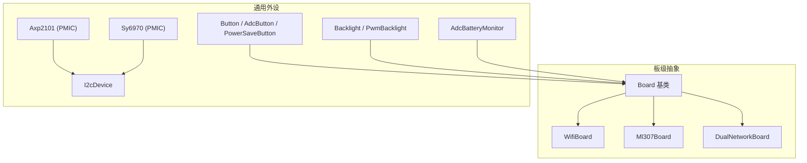
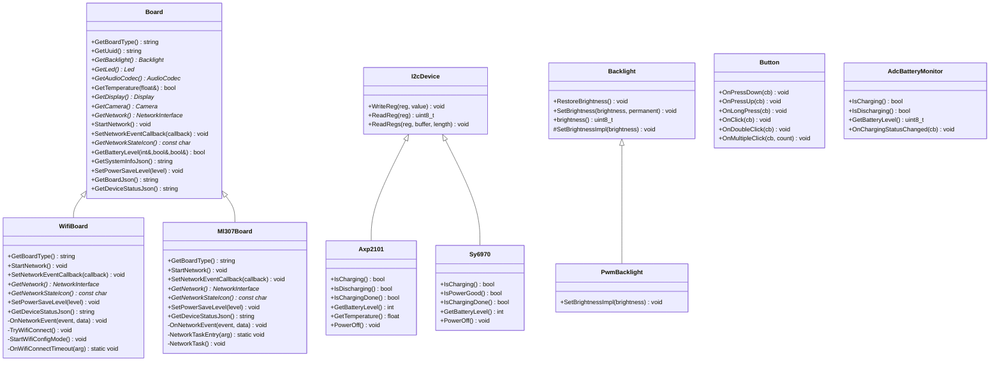
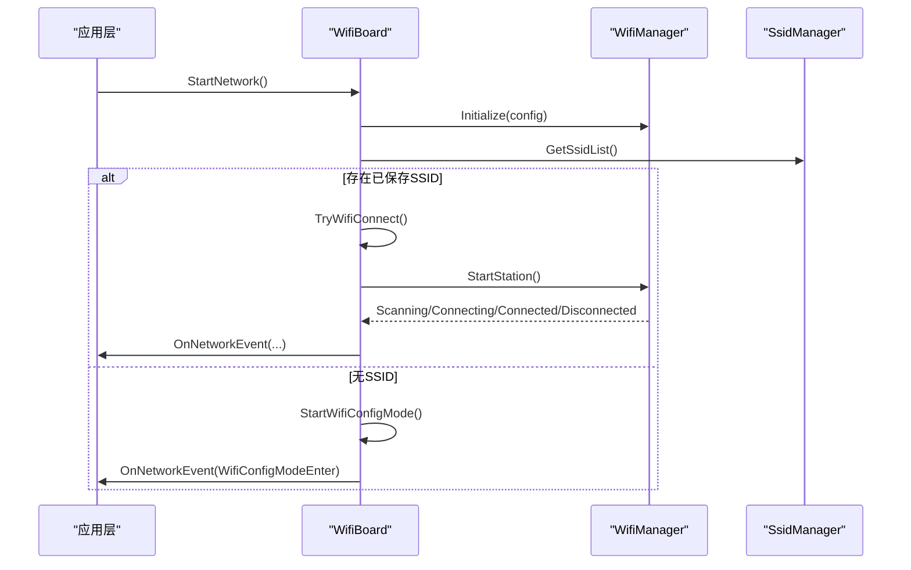
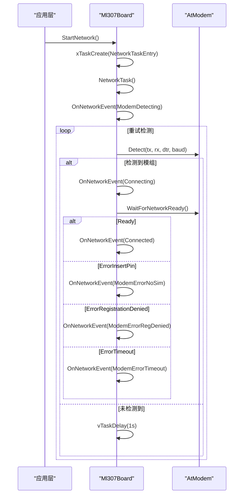
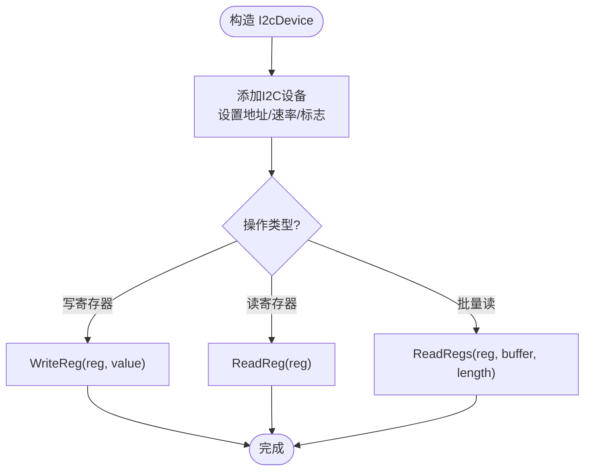
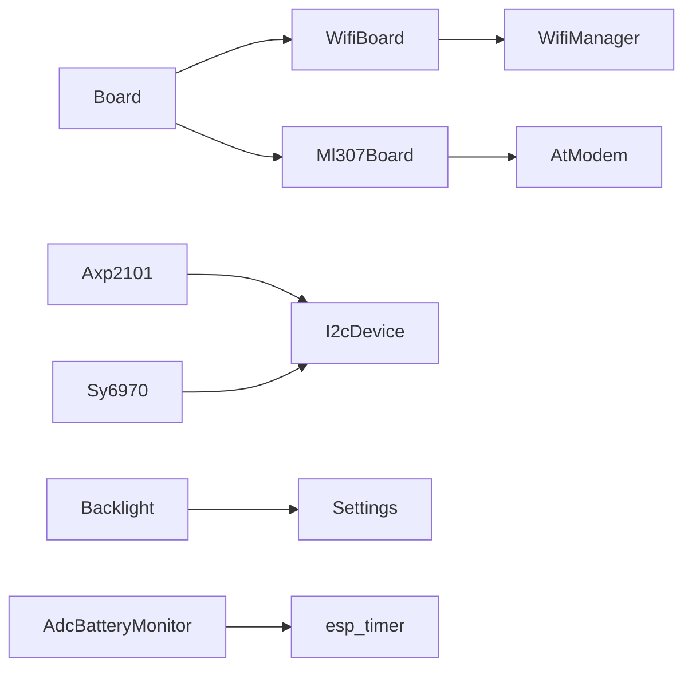

# 硬件抽象API

<cite>
**本文引用的文件**   
- [board.h](file://main/boards/common/board.h)
- [board.cc](file://main/boards/common/board.cc)
- [wifi_board.h](file://main/boards/common/wifi_board.h)
- [wifi_board.cc](file://main/boards/common/wifi_board.cc)
- [ml307_board.h](file://main/boards/common/ml307_board.h)
- [ml307_board.cc](file://main/boards/common/ml307_board.cc)
- [i2c_device.h](file://main/boards/common/i2c_device.h)
- [i2c_device.cc](file://main/boards/common/i2c_device.cc)
- [adc_battery_monitor.h](file://main/boards/common/adc_battery_monitor.h)
- [adc_battery_monitor.cc](file://main/boards/common/adc_battery_monitor.cc)
- [button.h](file://main/boards/common/button.h)
- [button.cc](file://main/boards/common/button.cc)
- [backlight.h](file://main/boards/common/backlight.h)
- [backlight.cc](file://main/boards/common/backlight.cc)
- [axp2101.h](file://main/boards/common/axp2101.h)
- [axp2101.cc](file://main/boards/common/axp2101.cc)
- [sy6970.h](file://main/boards/common/sy6970.h)
- [dual_network_board.h](file://main/boards/common/dual_network_board.h)
</cite>

## 目录
1. [简介](#简介)
2. [项目结构](#项目结构)
3. [核心组件](#核心组件)
4. [架构总览](#架构总览)
5. [详细组件分析](#详细组件分析)
6. [依赖关系分析](#依赖关系分析)
7. [性能与功耗考虑](#性能与功耗考虑)
8. [故障排查指南](#故障排查指南)
9. [结论](#结论)
10. [附录：新板适配开发指南](#附录新板适配开发指南)

## 简介
本文件面向硬件抽象层（HAL）的完整API文档，聚焦于Board基类的设计模式与虚函数接口，覆盖网络抽象、电源管理、显示控制等能力；深入对比WiFiBoard与ML307Board两类网络实现差异；并系统化梳理I2C设备接口、GPIO按键、ADC电量监测等底层操作API。文末提供新板级适配的开发指南，包括配置文件结构与引脚映射方法，以及硬件兼容性测试与调试建议。

## 项目结构
本项目将“板级抽象”集中在 common 目录下，通过统一的 Board 基类对外暴露一致的接口，具体网络类型（如 WiFi、蜂窝 ML307）以派生类实现差异化逻辑。同时提供通用外设驱动封装（I2C、背光、按键、ADC电量估算等），便于各板卡复用。

图表来源
- [board.h:49-85](file://main/boards/common/board.h#L49-L85)
- [wifi_board.h:9-67](file://main/boards/common/wifi_board.h#L9-L67)
- [ml307_board.h:9-36](file://main/boards/common/ml307_board.h#L9-L36)
- [dual_network_board.h:16-46](file://main/boards/common/dual_network_board.h#L16-L46)
- [i2c_device.h:6-16](file://main/boards/common/i2c_device.h#L6-L16)
- [backlight.h:10-36](file://main/boards/common/backlight.h#L10-L36)
- [adc_battery_monitor.h:9-28](file://main/boards/common/adc_battery_monitor.h#L9-L28)
- [button.h:11-47](file://main/boards/common/button.h#L11-L47)
- [axp2101.h:6-18](file://main/boards/common/axp2101.h#L6-L18)
- [sy6970.h:6-19](file://main/boards/common/sy6970.h#L6-L19)

章节来源
- [board.h:49-85](file://main/boards/common/board.h#L49-L85)
- [wifi_board.h:9-67](file://main/boards/common/wifi_board.h#L9-L67)
- [ml307_board.h:9-36](file://main/boards/common/ml307_board.h#L9-L36)
- [dual_network_board.h:16-46](file://main/boards/common/dual_network_board.h#L16-L46)
- [i2c_device.h:6-16](file://main/boards/common/i2c_device.h#L6-L16)
- [backlight.h:10-36](file://main/boards/common/backlight.h#L10-L36)
- [adc_battery_monitor.h:9-28](file://main/boards/common/adc_battery_monitor.h#L9-L28)
- [button.h:11-47](file://main/boards/common/button.h#L11-L47)
- [axp2101.h:6-18](file://main/boards/common/axp2101.h#L6-L18)
- [sy6970.h:6-19](file://main/boards/common/sy6970.h#L6-L19)

## 核心组件
- Board 基类
  - 职责：定义跨所有板卡的统一接口，包括网络抽象、音频编解码器、显示、摄像头、LED、背光、电池温度、系统信息JSON、电源策略等。
  - 关键虚函数：GetBoardType、GetAudioCodec、GetNetwork、StartNetwork、SetNetworkEventCallback、GetNetworkStateIcon、SetPowerSaveLevel、GetBoardJson、GetDeviceStatusJson。
  - 默认实现：GetDisplay、GetCamera、GetLed、GetBatteryLevel、GetTemperature、GetSystemInfoJson 提供基础或空实现，子类按需覆盖。
  - 工厂宏：DECLARE_BOARD 用于注册具体板卡实例创建。

- WifiBoard
  - 职责：基于 Wi-Fi 的网络接入与配置流程，支持热点/蓝牙配网/声学配网等多种方式，提供连接超时与事件回调。
  - 关键特性：异步 StartNetwork、OnNetworkEvent 转发、EnterWifiConfigMode、GetNetworkStateIcon 基于RSSI分级图标。

- Ml307Board
  - 职责：基于 AT 指令的蜂窝模块（ML307）初始化、注册网络、状态上报与错误处理。
  - 关键特性：独立任务 NetworkTask 完成检测与注册，事件包含 SIM/注册拒绝/超时等细分错误码。

- I2cDevice
  - 职责：封装 ESP-IDF I2C Master 设备读写寄存器接口，供 PMIC、传感器等使用。

- Backlight/PwmBacklight
  - 职责：背光亮度渐变控制，持久化保存亮度值，PWM 输出控制。

- Button/AdcButton/PowerSaveButton
  - 职责：GPIO/ADC 按键抽象，支持单击、双击、长按、多次点击等事件回调。

- AdcBatteryMonitor
  - 职责：基于 ADC 分压与可选充电引脚，周期性估算电量与充放电状态，并提供状态变更回调。

- Axp2101/Sy6970
  - 职责：PMIC 驱动，读取电量、温度、充电状态，执行关机等操作。

章节来源
- [board.h:49-85](file://main/boards/common/board.h#L49-L85)
- [board.cc:15-46](file://main/boards/common/board.cc#L15-L46)
- [wifi_board.h:9-67](file://main/boards/common/wifi_board.h#L9-L67)
- [ml307_board.h:9-36](file://main/boards/common/ml307_board.h#L9-L36)
- [i2c_device.h:6-16](file://main/boards/common/i2c_device.h#L6-L16)
- [backlight.h:10-36](file://main/boards/common/backlight.h#L10-L36)
- [button.h:11-47](file://main/boards/common/button.h#L11-L47)
- [adc_battery_monitor.h:9-28](file://main/boards/common/adc_battery_monitor.h#L9-L28)
- [axp2101.h:6-18](file://main/boards/common/axp2101.h#L6-L18)
- [sy6970.h:6-19](file://main/boards/common/sy6970.h#L6-L19)

## 架构总览
Board 作为顶层抽象，向上为应用提供一致的设备能力视图；向下通过不同网络实现（Wi-Fi/蜂窝/以太网等）与外设驱动（I2C/PMIC/ADC/背光/按键）协作。

图表来源
- [board.h:49-85](file://main/boards/common/board.h#L49-L85)
- [wifi_board.h:9-67](file://main/boards/common/wifi_board.h#L9-L67)
- [ml307_board.h:9-36](file://main/boards/common/ml307_board.h#L9-L36)
- [i2c_device.h:6-16](file://main/boards/common/i2c_device.h#L6-L16)
- [backlight.h:10-36](file://main/boards/common/backlight.h#L10-L36)
- [button.h:11-47](file://main/boards/common/button.h#L11-L47)
- [adc_battery_monitor.h:9-28](file://main/boards/common/adc_battery_monitor.h#L9-L28)
- [axp2101.h:6-18](file://main/boards/common/axp2101.h#L6-L18)
- [sy6970.h:6-19](file://main/boards/common/sy6970.h#L6-L19)

## 详细组件分析

### Board 基类设计与虚函数接口
- 设计要点
  - 单例访问：GetInstance 通过 create_board 工厂函数返回具体板卡实例。
  - UUID 生成：首次启动生成并持久化，便于设备识别。
  - 系统信息聚合：GetSystemInfoJson 汇总芯片、分区、OTA、显示等信息，最终拼接 GetBoardJson。
  - 可扩展性：新增外设或功能时，优先在 Board 增加虚函数，保持上层调用稳定。

- 关键接口说明
  - 网络相关：GetNetwork、StartNetwork、SetNetworkEventCallback、GetNetworkStateIcon、SetPowerSaveLevel
  - 媒体与显示：GetAudioCodec、GetDisplay、GetCamera、GetBacklight、GetLed
  - 系统与电源：GetBatteryLevel、GetTemperature、GetBoardJson、GetDeviceStatusJson

章节来源
- [board.h:49-85](file://main/boards/common/board.h#L49-L85)
- [board.cc:15-46](file://main/boards/common/board.cc#L15-L46)
- [board.cc:70-178](file://main/boards/common/board.cc#L70-L178)

### 网络抽象：WifiBoard 与 Ml307Board 的差异
- 共同点
  - 均继承自 Board，实现统一网络事件回调 SetNetworkEventCallback。
  - 均提供 GetBoardJson 与 GetDeviceStatusJson 输出当前网络相关信息。
  - 均实现 SetPowerSaveLevel 以适配平台省电策略。

- 差异点
  - 连接模型
    - WifiBoard：基于 Wi-Fi Manager，支持多种配网方式（热点/蓝牙/声学），具备连接超时自动进入配置模式的机制。
    - Ml307Board：基于 AT 调制解调器，独立任务进行模组检测与网络注册，细化错误类型（无SIM、注册拒绝、超时）。
  - 状态图标
    - WifiBoard：依据 RSSI 阈值选择信号强度图标。
    - Ml307Board：依据 CSQ 指标选择信号强度图标。
  - 资源生命周期
    - WifiBoard：使用定时器管理连接超时，并在成功连接后释放配网资源。
    - Ml307Board：通过 FreeRTOS 任务完成阻塞式检测与等待，完成后删除任务。

图表来源
- [wifi_board.cc:52-104](file://main/boards/common/wifi_board.cc#L52-L104)
- [wifi_board.cc:106-145](file://main/boards/common/wifi_board.cc#L106-L145)
- [wifi_board.cc:159-197](file://main/boards/common/wifi_board.cc#L159-L197)

图表来源
- [ml307_board.cc:67-132](file://main/boards/common/ml307_board.cc#L67-L132)
- [ml307_board.cc:134-141](file://main/boards/common/ml307_board.cc#L134-L141)

章节来源
- [wifi_board.h:9-67](file://main/boards/common/wifi_board.h#L9-L67)
- [wifi_board.cc:48-104](file://main/boards/common/wifi_board.cc#L48-L104)
- [wifi_board.cc:106-197](file://main/boards/common/wifi_board.cc#L106-L197)
- [ml307_board.h:9-36](file://main/boards/common/ml307_board.h#L9-L36)
- [ml307_board.cc:20-132](file://main/boards/common/ml307_board.cc#L20-L132)

### I2C 设备接口
- 设计目标：屏蔽底层 I2C Master 细节，提供寄存器读写便捷接口。
- 主要方法
  - WriteReg(reg, value)：写单个寄存器。
  - ReadReg(reg)：读单个寄存器。
  - ReadRegs(reg, buffer, length)：连续读多个寄存器。
- 典型用法：PMIC（Axp2101、Sy6970）通过该接口读取电量、温度、充电状态等。

图表来源
- [i2c_device.cc:8-35](file://main/boards/common/i2c_device.cc#L8-L35)

章节来源
- [i2c_device.h:6-16](file://main/boards/common/i2c_device.h#L6-L16)
- [i2c_device.cc:8-35](file://main/boards/common/i2c_device.cc#L8-L35)
- [axp2101.h:6-18](file://main/boards/common/axp2101.h#L6-L18)
- [axp2101.cc:9-41](file://main/boards/common/axp2101.cc#L9-L41)
- [sy6970.h:6-19](file://main/boards/common/sy6970.h#L6-L19)

### GPIO 控制与按键抽象
- Button 抽象
  - 支持 GPIO 与 ADC 两种输入源。
  - 事件回调：按下、抬起、长按、单击、双击、多次点击。
  - 低功耗选项：PowerSaveButton 启用省电模式。
- 使用建议
  - 短按/长按时间根据交互需求配置。
  - 对于多键复用场景，可结合 ADC 分压链路与 AdcButton。

章节来源
- [button.h:11-47](file://main/boards/common/button.h#L11-L47)
- [button.cc:18-125](file://main/boards/common/button.cc#L18-L125)

### ADC 读取与电量估算
- AdcBatteryMonitor
  - 输入：ADC 单元/通道、分压电阻上下阻值、可选充电检测引脚。
  - 功能：周期定时检查充放电状态变化，估算剩余电量百分比。
  - 回调：OnChargingStatusChanged 通知外部状态变更。
- 适用场景：电池供电设备，需低开销地获取电量与充电状态。

章节来源
- [adc_battery_monitor.h:9-28](file://main/boards/common/adc_battery_monitor.h#L9-L28)
- [adc_battery_monitor.cc:3-116](file://main/boards/common/adc_battery_monitor.cc#L3-L116)

### 显示控制与背光
- Backlight 抽象
  - 提供 RestoreBrightness 恢复上次亮度，SetBrightness 平滑过渡到目标亮度。
  - 持久化：亮度值保存到 Settings，重启后恢复。
- PwmBacklight 实现
  - 基于 LEDC PWM 输出，支持反相输出与频率配置。
- 显示集成
  - Board::GetDisplay 返回显示对象，WifiBoard/Ml307Board 的 GetDeviceStatusJson 会包含屏幕主题与亮度信息。

章节来源
- [backlight.h:10-36](file://main/boards/common/backlight.h#L10-L36)
- [backlight.cc:10-122](file://main/boards/common/backlight.cc#L10-L122)
- [board.cc:158-171](file://main/boards/common/board.cc#L158-L171)
- [wifi_board.cc:301-357](file://main/boards/common/wifi_board.cc#L301-L357)
- [ml307_board.cc:186-270](file://main/boards/common/ml307_board.cc#L186-L270)

### 电源管理与 PMIC 驱动
- Axp2101
  - 能力：充电/放电判断、充满判定、电量百分比、温度读取、关机控制。
- Sy6970
  - 能力：充电/放电/充满判断、电量读取、掉电保护等。
- 与 Board 的关系
  - 板卡可在 GetBatteryLevel/GetTemperature 中调用 PMIC 或 ADC 估算结果，向上层提供统一接口。

章节来源
- [axp2101.h:6-18](file://main/boards/common/axp2101.h#L6-L18)
- [axp2101.cc:9-41](file://main/boards/common/axp2101.cc#L9-L41)
- [sy6970.h:6-19](file://main/boards/common/sy6970.h#L6-L19)

## 依赖关系分析
- 组件耦合
  - Board 与网络实现（WifiBoard/Ml307Board）松耦合，通过虚函数与事件回调解耦。
  - I2cDevice 被 PMIC 驱动复用，降低重复代码。
  - Backlight/Button/AdcBatteryMonitor 作为通用外设，被具体板卡组合使用。
- 外部依赖
  - Wi-Fi 栈与配网库（WifiManager、SsidManager、Blufi 等）。
  - AT 调制解调器库（AtModem）。
  - ESP-IDF 驱动（I2C、LEDC、ESP-Timer、FreeRTOS）。

图表来源
- [board.h:49-85](file://main/boards/common/board.h#L49-L85)
- [wifi_board.cc:52-104](file://main/boards/common/wifi_board.cc#L52-L104)
- [ml307_board.cc:67-132](file://main/boards/common/ml307_board.cc#L67-L132)
- [i2c_device.cc:8-35](file://main/boards/common/i2c_device.cc#L8-L35)
- [backlight.cc:32-44](file://main/boards/common/backlight.cc#L32-L44)
- [adc_battery_monitor.cc:44-55](file://main/boards/common/adc_battery_monitor.cc#L44-L55)

章节来源
- [board.h:49-85](file://main/boards/common/board.h#L49-L85)
- [wifi_board.cc:52-104](file://main/boards/common/wifi_board.cc#L52-L104)
- [ml307_board.cc:67-132](file://main/boards/common/ml307_board.cc#L67-L132)
- [i2c_device.cc:8-35](file://main/boards/common/i2c_device.cc#L8-L35)
- [backlight.cc:32-44](file://main/boards/common/backlight.cc#L32-L44)
- [adc_battery_monitor.cc:44-55](file://main/boards/common/adc_battery_monitor.cc#L44-L55)

## 性能与功耗考虑
- Wi-Fi 省电
  - WifiBoard::SetPowerSaveLevel 映射到 Wi-Fi 省电级别，建议在非活跃期切换至低功耗模式。
- 蜂窝省电
  - Ml307Board::SetPowerSaveLevel 预留扩展位，可按模组能力实现休眠/唤醒策略。
- 背光节能
  - 利用 Backlight 渐变与持久化，避免频繁全亮导致功耗上升。
- ADC 采样
  - AdcBatteryMonitor 使用定时器周期检查，合理设置采样间隔以降低 CPU 占用。

[本节为通用指导，不直接分析具体文件]

## 故障排查指南
- Wi-Fi 无法连接
  - 检查是否进入配置模式（IsInWifiConfigMode），确认是否有已保存 SSID。
  - 关注 OnNetworkEvent 中的 Scanning/Connecting/Connected/Disconnected 日志。
- 蜂窝模组异常
  - 观察 ModemDetecting/ModemErrorNoSim/ModemErrorRegDenied/ModemErrorTimeout 事件。
  - 确认 TX/RX/DTR 引脚接线与波特率配置。
- 电量显示异常
  - 校验分压电阻参数与 ADC 衰减配置。
  - 若提供充电引脚，确认电平有效性与回调路径。
- 背光不亮或闪烁
  - 检查 PWM 引脚与频率配置，确认输出反相设置是否符合硬件。

章节来源
- [wifi_board.cc:106-145](file://main/boards/common/wifi_board.cc#L106-L145)
- [ml307_board.cc:31-65](file://main/boards/common/ml307_board.cc#L31-L65)
- [adc_battery_monitor.cc:68-116](file://main/boards/common/adc_battery_monitor.cc#L68-L116)
- [backlight.cc:84-122](file://main/boards/common/backlight.cc#L84-L122)

## 结论
Board 抽象层通过统一的虚函数接口屏蔽了不同网络与外设实现的差异，使上层应用能够以一致的方式访问设备能力。WifiBoard 与 Ml307Board 分别针对 Wi-Fi 与蜂窝场景提供了完善的连接、配置与状态反馈机制。配合 I2C、PMIC、ADC、背光与按键等通用驱动，开发者可以快速适配新板卡并复用既有能力。

[本节为总结性内容，不直接分析具体文件]

## 附录：新板适配开发指南

### 新建板卡步骤
- 创建板卡目录与文件
  - 在 boards 下新建板卡目录，包含 config.h、config.json、<board>.cc 等。
  - 在 <board>.cc 中实现具体板卡类，继承自合适的网络基类（如 WifiBoard 或 Ml307Board）。
- 实现必要接口
  - 覆盖 GetBoardType、GetBoardJson、GetDeviceStatusJson。
  - 如需自定义音频/显示/摄像头，覆盖对应 Get* 方法。
  - 实现 SetPowerSaveLevel 以满足功耗策略。
- 注册板卡
  - 使用 DECLARE_BOARD 宏导出 create_board 工厂函数。

章节来源
- [board.h:87-92](file://main/boards/common/board.h#L87-L92)

### 配置文件结构（config.json）
- 常见字段
  - type：板卡类型标识（如 wifi、ml307）。
  - name：板卡名称。
  - display：屏幕分辨率、类型等。
  - audio：音频编解码器配置。
  - network：网络相关参数（如 Wi-Fi 频段、蜂窝 APN 等）。
  - pins：引脚映射表（GPIO/I2C/ADC/PWM 等）。
- 语言版本
  - 可维护多语言配置（如 config.json 与 config_en.json）。

[本节为概念性说明，不直接分析具体文件]

### 引脚映射方法
- GPIO
  - 按键、指示灯、复位、充电检测等使用 gpio_num_t 描述。
- I2C
  - 指定总线句柄与设备地址，供 PMIC/传感器使用。
- ADC
  - 指定 ADC 单元与通道，结合分压电阻计算电压。
- PWM
  - 背光与电机等使用 LEDC 通道与频率配置。

章节来源
- [i2c_device.h:6-16](file://main/boards/common/i2c_device.h#L6-L16)
- [adc_battery_monitor.h:9-28](file://main/boards/common/adc_battery_monitor.h#L9-L28)
- [backlight.h:30-36](file://main/boards/common/backlight.h#L30-L36)

### 双网络板卡（可选）
- DualNetworkBoard
  - 支持在 Wi-Fi 与 ML307 之间动态切换，内部维护当前活动板卡指针。
  - 从 Settings 加载/保存网络类型，提供 SwitchNetworkType 接口。

章节来源
- [dual_network_board.h:16-46](file://main/boards/common/dual_network_board.h#L16-L46)

### 硬件兼容性测试与调试工具
- 网络连通性
  - Wi-Fi：验证扫描、连接、配网流程；记录 RSSI 与信道。
  - 蜂窝：验证模组检测、注册、CSQ 变化与错误事件。
- 外设功能
  - I2C：枚举设备地址，读写寄存器验证。
  - ADC：读取分压电压并与万用表比对。
  - 背光：验证亮度渐变与持久化。
  - 按键：验证单击/双击/长按行为。
- 日志与诊断
  - 使用 ESP_LOG 输出关键事件。
  - 通过 GetSystemInfoJson/GetDeviceStatusJson 收集运行态信息。

[本节为通用指导，不直接分析具体文件]