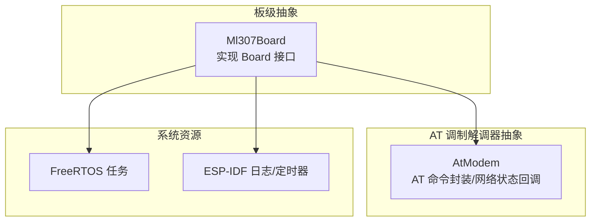
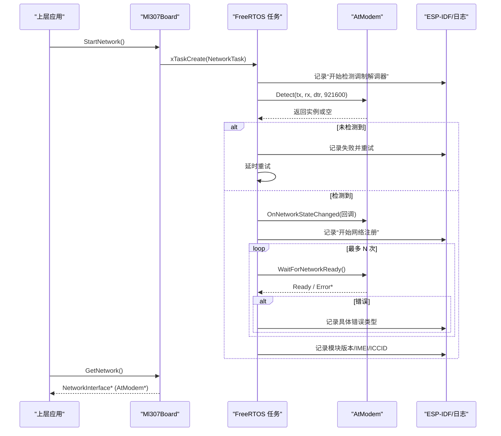
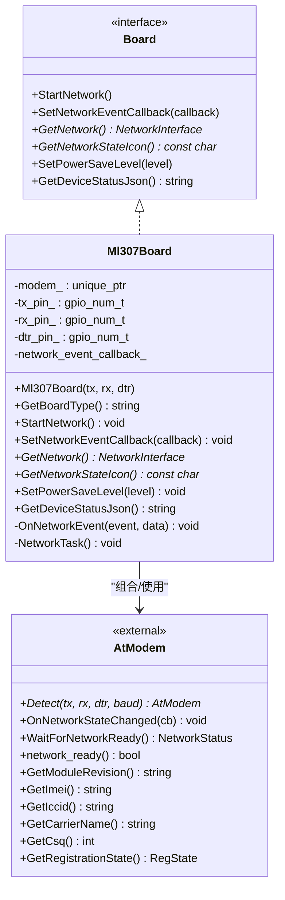
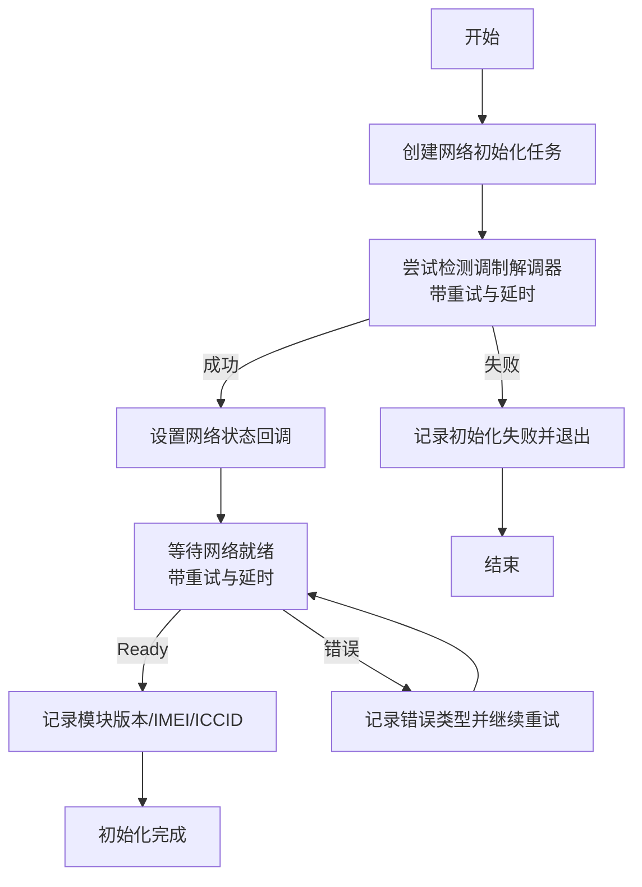
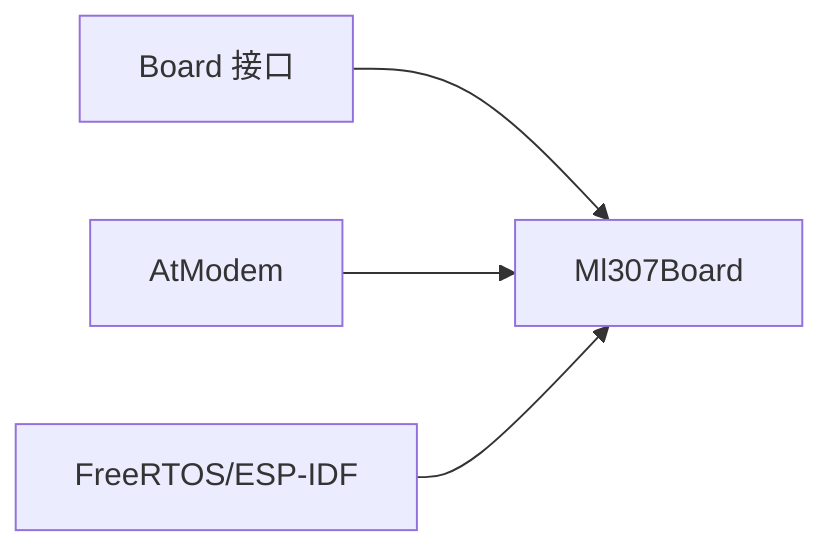

# ML307 4G网络接口

<cite>
**本文引用的文件**
- [ml307_board.h](file://main/boards/common/ml307_board.h)
- [ml307_board.cc](file://main/boards/common/ml307_board.cc)
</cite>

## 目录
1. [简介](#简介)
2. [项目结构](#项目结构)
3. [核心组件](#核心组件)
4. [架构总览](#架构总览)
5. [详细组件分析](#详细组件分析)
6. [依赖关系分析](#依赖关系分析)
7. [性能与功耗考虑](#性能与功耗考虑)
8. [故障诊断指南](#故障诊断指南)
9. [结论](#结论)
10. [附录：API参考](#附录api参考)

## 简介
本文件面向使用 ML307 4G 模块的嵌入式设备，提供完整的 4G 网络接口文档。重点围绕 Ml307Board 类的设计与实现，覆盖以下主题：
- 4G 模块初始化流程（AT 调制解调器检测、注册等待）
- AT 指令通信抽象与事件回调机制
- SIM 卡管理与认证错误处理
- 网络连接建立过程、数据收发入口与状态监控
- 信号强度检测与运营商信息获取
- APN 配置与网络参数设置说明
- 电源管理、休眠唤醒与数据传输优化建议
- 连接故障诊断与性能调优实践

## 项目结构
ML307 4G 网络能力由通用板级抽象层中的 Ml307Board 实现，位于 common 目录下，对外暴露 Board 接口，向上层应用提供统一的网络接入点。

图示来源
- [ml307_board.h:9-36](file://main/boards/common/ml307_board.h#L9-L36)
- [ml307_board.cc:67-141](file://main/boards/common/ml307_board.cc#L67-L141)

章节来源
- [ml307_board.h:1-38](file://main/boards/common/ml307_board.h#L1-L38)
- [ml307_board.cc:1-271](file://main/boards/common/ml307_board.cc#L1-L271)

## 核心组件
- Ml307Board：基于 Board 接口的 4G 板级实现，负责：
  - 启动异步网络初始化任务
  - 通过 AtModem 进行 AT 调制解调器检测与网络注册
  - 上报网络事件（检测中、连接中、已连接、断开、各类错误）
  - 查询信号强度并映射为图标
  - 输出设备状态 JSON（包含运营商、CSQ、IMEI、ICCID、注册状态等）
- AtModem：AT 调制解调器抽象层（外部库），提供：
  - 串口检测与连接
  - 网络就绪等待与状态回调
  - 模块版本、IMEI、ICCID、运营商名称、CSQ、注册状态等查询

章节来源
- [ml307_board.h:9-36](file://main/boards/common/ml307_board.h#L9-L36)
- [ml307_board.cc:27-65](file://main/boards/common/ml307_board.cc#L27-L65)
- [ml307_board.cc:143-179](file://main/boards/common/ml307_board.cc#L143-L179)

## 架构总览
Ml307Board 在 FreeRTOS 任务中执行网络初始化流程，调用 AtModem 完成 AT 探测、注册等待与状态回调；上层通过 Board::GetNetwork() 获得 NetworkInterface 指针以进行后续数据收发。

图示来源
- [ml307_board.cc:67-141](file://main/boards/common/ml307_board.cc#L67-L141)
- [ml307_board.cc:143-145](file://main/boards/common/ml307_board.cc#L143-L145)

## 详细组件分析

### Ml307Board 类设计与职责
- 成员与接口
  - 内部持有 AtModem 智能指针，保存 TX/RX/DTR GPIO 引脚
  - 提供 SetNetworkEventCallback 用于接收网络事件
  - StartNetwork 创建独立任务执行初始化
  - GetNetwork 返回底层 NetworkInterface 指针供上层使用
  - GetNetworkStateIcon 根据 CSQ 返回信号图标
  - GetDeviceStatusJson 汇总音频、屏幕、电池、网络等信息
- 关键行为
  - 网络事件统一经 OnNetworkEvent 分发，既打印日志又回调上层
  - 网络就绪后读取模块版本、IMEI、ICCID 并记录
  - 信号强度按 CSQ 分段映射到不同图标

图示来源
- [ml307_board.h:9-36](file://main/boards/common/ml307_board.h#L9-L36)
- [ml307_board.cc:27-65](file://main/boards/common/ml307_board.cc#L27-L65)
- [ml307_board.cc:143-179](file://main/boards/common/ml307_board.cc#L143-L179)

章节来源
- [ml307_board.h:9-36](file://main/boards/common/ml307_board.h#L9-L36)
- [ml307_board.cc:27-65](file://main/boards/common/ml307_board.cc#L27-L65)
- [ml307_board.cc:143-179](file://main/boards/common/ml307_board.cc#L143-L179)

### 4G 模块初始化与 AT 通信流程
- 异步初始化
  - StartNetwork 创建 FreeRTOS 任务，避免阻塞主流程
  - 任务内循环尝试 AtModem::Detect，带最大重试次数与间隔
- 网络注册
  - 设置网络状态变化回调（连接/断开）
  - 循环调用 WaitForNetworkReady，区分无 SIM、拒绝注册、超时等错误
  - 成功后记录模块版本、IMEI、ICCID
- 事件上报
  - 所有阶段均通过 OnNetworkEvent 触发日志与上层回调

图示来源
- [ml307_board.cc:67-141](file://main/boards/common/ml307_board.cc#L67-L141)

章节来源
- [ml307_board.cc:67-141](file://main/boards/common/ml307_board.cc#L67-L141)

### 网络连接建立与数据收发机制
- 连接建立
  - 通过 AtModem 完成网络注册，注册成功后 network_ready() 为真
  - 上层通过 Board::GetNetwork() 获取 NetworkInterface 指针（即 AtModem*）
- 数据收发
  - 上层应使用返回的 NetworkInterface 提供的标准网络接口进行 TCP/UDP 收发
  - 注意：在初始化过程中避免频繁发送 AT 查询，以免阻塞接收任务

章节来源
- [ml307_board.cc:143-145](file://main/boards/common/ml307_board.cc#L143-L145)
- [ml307_board.cc:90-98](file://main/boards/common/ml307_board.cc#L90-L98)

### 错误处理逻辑
- 错误分类
  - 无 SIM 卡：ErrorInsertPin -> ModemErrorNoSim
  - 注册被拒：ErrorRegistrationDenied -> ModemErrorRegDenied
  - 操作超时：ErrorTimeout -> ModemErrorTimeout
  - 初始化失败：无法检测到调制解调器 -> ModemErrorInitFailed
- 处理方式
  - 统一通过 OnNetworkEvent 上报，便于 UI 显示与上层恢复策略

章节来源
- [ml307_board.cc:31-65](file://main/boards/common/ml307_board.cc#L31-L65)
- [ml307_board.cc:105-123](file://main/boards/common/ml307_board.cc#L105-L123)

### 4G 网络状态监控、信号强度与运营商信息
- 状态监控
  - 通过 OnNetworkStateChanged 回调感知连接/断开
  - GetNetworkStateIcon 依据 CSQ 返回信号图标
- 信号强度
  - CSQ 取值范围映射为弱/一般/良好/强/未知
- 运营商信息
  - GetBoardJson 中包含运营商名称字段
  - GetDeviceStatusJson 中亦包含 carrier 与 signal 描述

章节来源
- [ml307_board.cc:90-98](file://main/boards/common/ml307_board.cc#L90-L98)
- [ml307_board.cc:147-166](file://main/boards/common/ml307_board.cc#L147-L166)
- [ml307_board.cc:168-179](file://main/boards/common/ml307_board.cc#L168-L179)
- [ml307_board.cc:247-263](file://main/boards/common/ml307_board.cc#L247-L263)

### SIM 卡认证、APN 配置与网络参数设置
- SIM 卡认证
  - 若模块报告无 SIM 或 PIN 相关错误，将触发 ModemErrorNoSim 事件
- APN 与网络参数
  - 当前实现未显式暴露 APN 配置接口；如需自定义 APN，应在 AtModem 层扩展或通过模块 AT 命令进行配置
  - 建议在 AtModem 层增加 SetApn 等方法，并在初始化流程中按需调用

章节来源
- [ml307_board.cc:105-118](file://main/boards/common/ml307_board.cc#L105-L118)

### 电源管理、休眠唤醒与数据传输优化
- 电源管理
  - SetPowerSaveLevel 目前为空实现（TODO），可在 AtModem 层结合模块省电模式进行扩展
- 休眠唤醒
  - 可结合 DTR/MRDY/SRDY 等引脚中断，配合 AtModem 的事件机制实现低功耗唤醒
- 传输优化
  - 避免在初始化阶段频繁查询运营商/CSQ，减少阻塞风险
  - 合理设置重连退避与超时时间，降低网络抖动影响

章节来源
- [ml307_board.cc:181-184](file://main/boards/common/ml307_board.cc#L181-L184)
- [ml307_board.cc:90-98](file://main/boards/common/ml307_board.cc#L90-L98)

## 依赖关系分析
- 直接依赖
  - Board 接口：定义统一板级抽象
  - AtModem：AT 调制解调器抽象，封装串口与 AT 交互
  - FreeRTOS/ESP-IDF：任务、定时器、日志等系统服务
- 耦合与内聚
  - Ml307Board 仅依赖 Board 与 AtModem 两个高层抽象，内聚性良好
  - 网络事件集中处理，利于扩展与测试

图示来源
- [ml307_board.h:4-6](file://main/boards/common/ml307_board.h#L4-L6)
- [ml307_board.cc:6-11](file://main/boards/common/ml307_board.cc#L6-L11)

章节来源
- [ml307_board.h:4-6](file://main/boards/common/ml307_board.h#L4-L6)
- [ml307_board.cc:6-11](file://main/boards/common/ml307_board.cc#L6-L11)

## 性能与功耗考虑
- 初始化耗时
  - 调制解调器检测与网络注册存在多次重试，建议根据现场环境调整重试次数与时延
- 事件回调开销
  - 网络状态回调应避免长时间阻塞，必要时采用队列/标志位异步处理
- 信号查询频率
  - 仅在需要时查询 CSQ/运营商，避免高频 AT 命令造成阻塞
- 功耗优化
  - 在空闲期进入低功耗模式，利用 DTR/MRDY/SRDY 中断快速唤醒
  - 结合 SetPowerSaveLevel 扩展模块省电策略

[本节为通用指导，不直接分析具体文件]

## 故障诊断指南
- 常见问题定位
  - 无法检测到调制解调器：检查 TX/RX/DTR 接线与波特率，确认供电稳定
  - 无 SIM 卡：确认 SIM 插入方向与接触良好，SIM 是否欠费/锁定
  - 注册被拒：检查 APN 是否正确、运营商是否允许接入
  - 超时：检查天线与信号质量，适当增大超时与重试次数
- 日志与事件
  - 关注 OnNetworkEvent 输出的事件类型与日志级别
  - 使用 GetDeviceStatusJson 获取实时网络状态与信号等级
- 恢复策略
  - 对可恢复错误（如超时）实施指数退避重连
  - 对不可恢复错误（如无 SIM）提示用户并停止频繁重试

章节来源
- [ml307_board.cc:31-65](file://main/boards/common/ml307_board.cc#L31-L65)
- [ml307_board.cc:168-179](file://main/boards/common/ml307_board.cc#L168-L179)
- [ml307_board.cc:186-270](file://main/boards/common/ml307_board.cc#L186-L270)

## 结论
Ml307Board 提供了简洁稳定的 4G 网络接入抽象，借助 AtModem 完成 AT 通信与网络状态管理，并通过统一事件机制向上传递状态与错误。当前实现已覆盖初始化、注册、状态监控与基础诊断；APN 配置与电源管理可在 AtModem 层进一步扩展以满足更多场景需求。

[本节为总结性内容，不直接分析具体文件]

## 附录：API参考
- 构造与类型
  - Ml307Board(gpio_num_t tx_pin, gpio_num_t rx_pin, gpio_num_t dtr_pin = GPIO_NUM_NC)
  - GetBoardType() -> "ml307"
- 网络控制
  - StartNetwork()：异步启动网络初始化
  - SetNetworkEventCallback(callback)：注册网络事件回调
  - GetNetwork()：返回 NetworkInterface*（底层为 AtModem*）
- 状态与诊断
  - GetNetworkStateIcon()：根据 CSQ 返回信号图标
  - GetDeviceStatusJson()：返回设备状态 JSON（含网络、音频、屏幕、电池等）
- 电源管理
  - SetPowerSaveLevel(level)：当前为空实现，预留扩展

章节来源
- [ml307_board.h:26-36](file://main/boards/common/ml307_board.h#L26-L36)
- [ml307_board.cc:23-25](file://main/boards/common/ml307_board.cc#L23-L25)
- [ml307_board.cc:134-145](file://main/boards/common/ml307_board.cc#L134-L145)
- [ml307_board.cc:147-179](file://main/boards/common/ml307_board.cc#L147-L179)
- [ml307_board.cc:181-184](file://main/boards/common/ml307_board.cc#L181-L184)
- [ml307_board.cc:186-270](file://main/boards/common/ml307_board.cc#L186-L270)