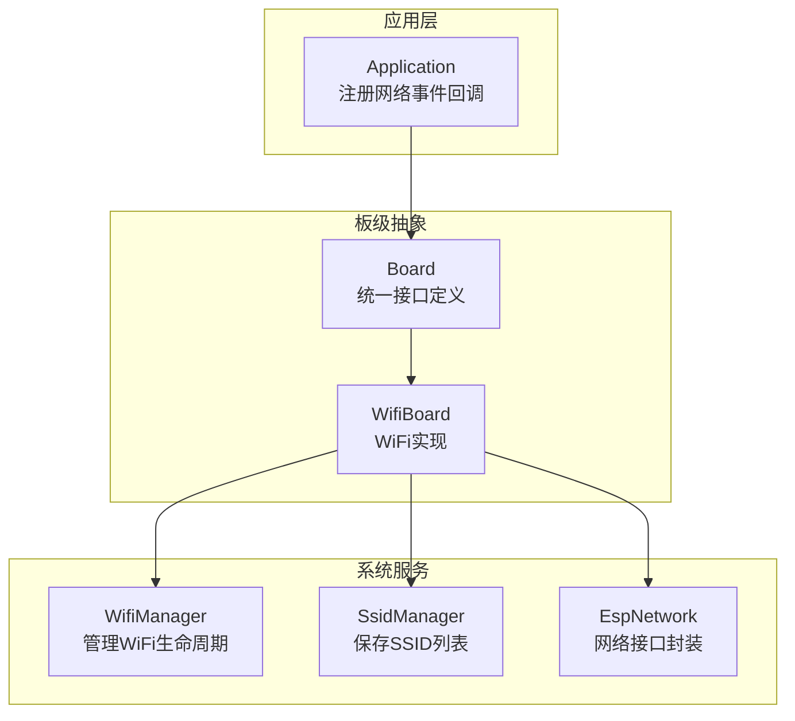
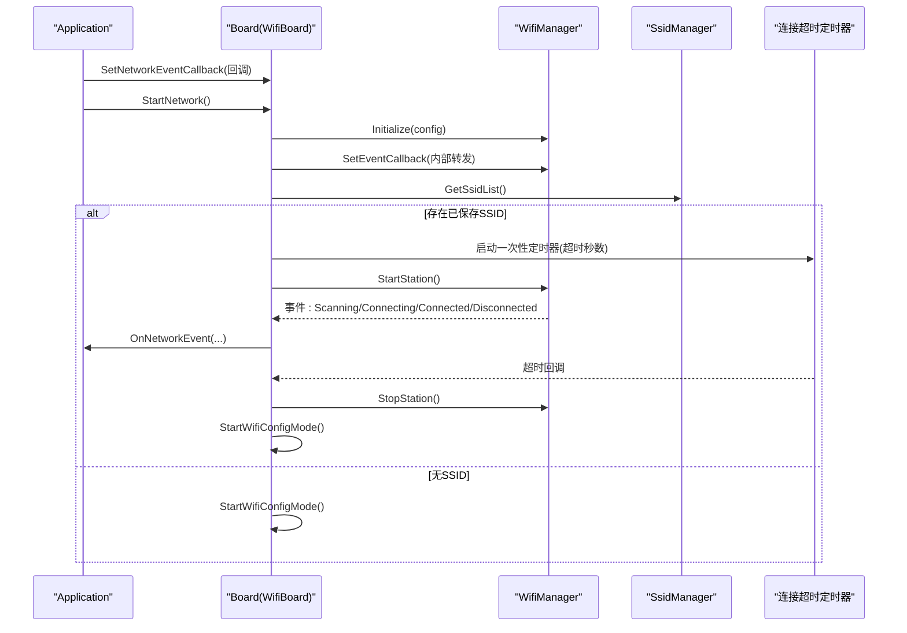
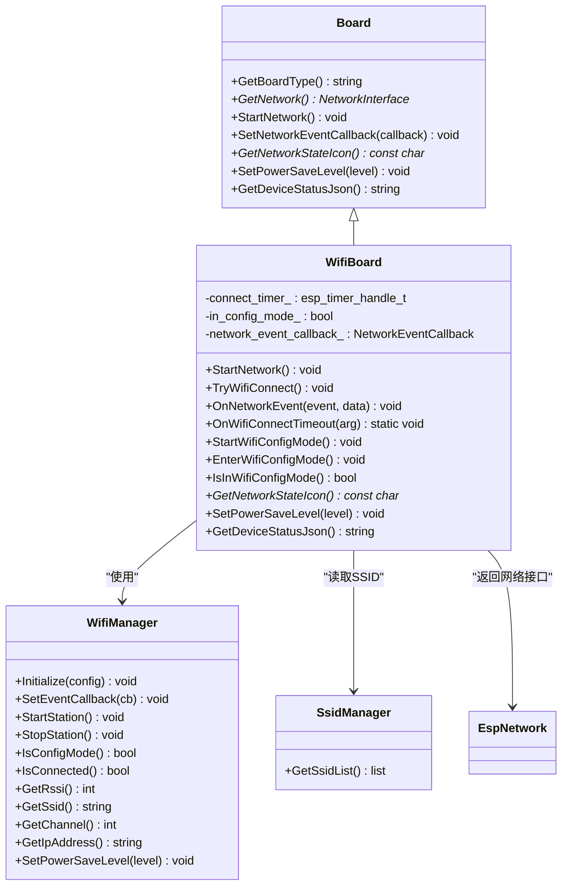
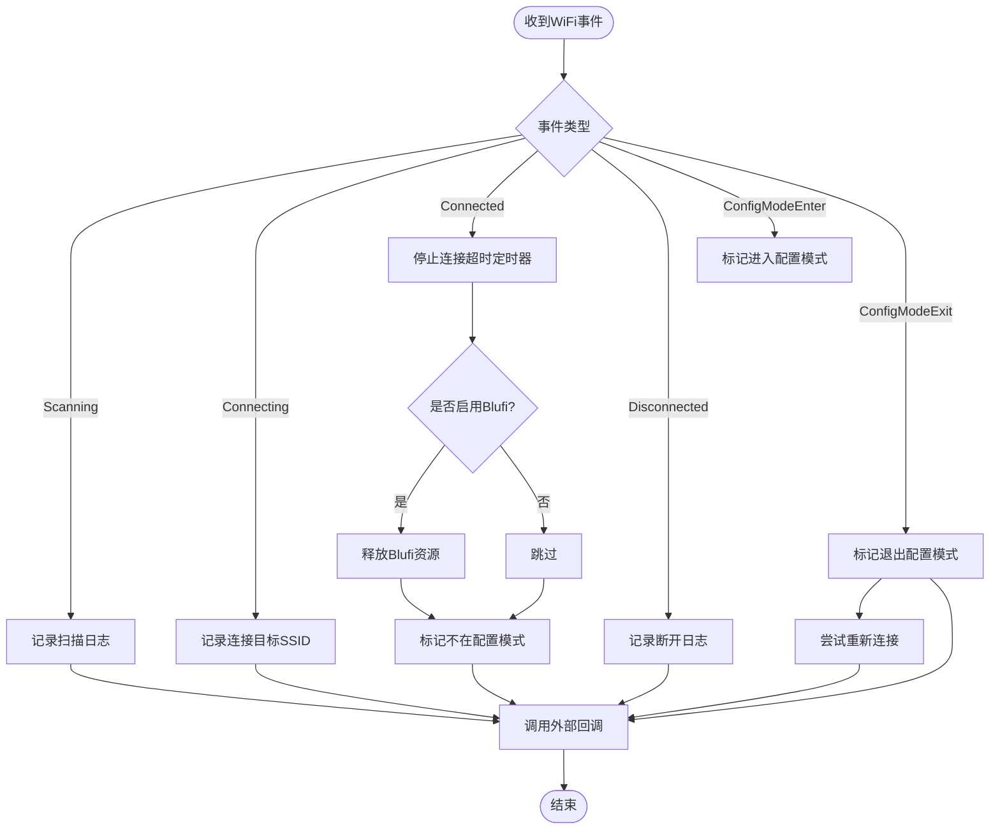
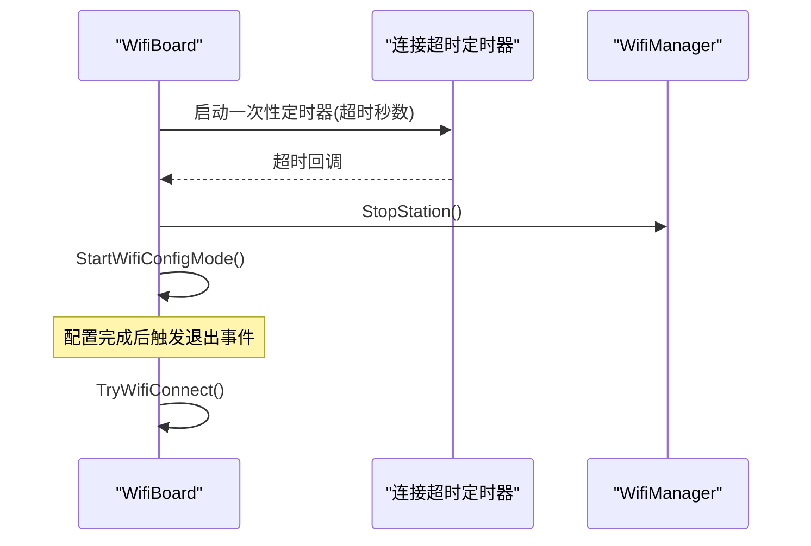
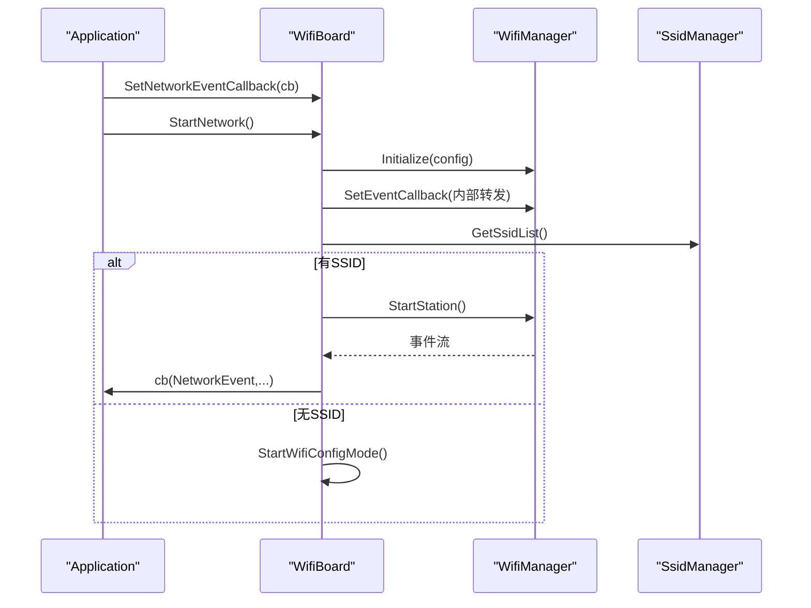
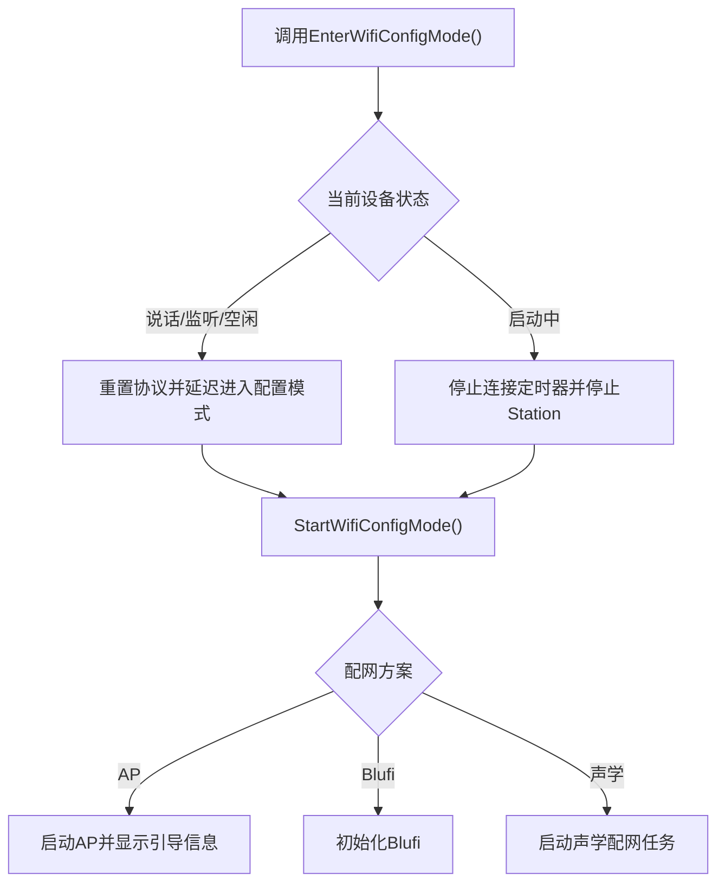
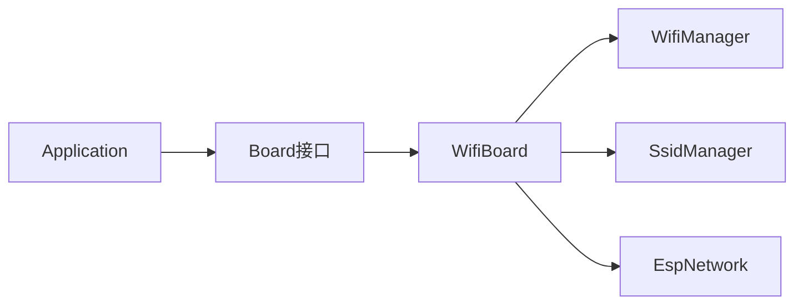

# WiFi网络接口

<cite>
**本文引用的文件**   
- [wifi_board.h](file://main/boards/common/wifi_board.h)
- [wifi_board.cc](file://main/boards/common/wifi_board.cc)
- [board.h](file://main/boards/common/board.h)
- [application.cc](file://main/application.cc)
</cite>

## 目录
1. [简介](#简介)
2. [项目结构](#项目结构)
3. [核心组件](#核心组件)
4. [架构总览](#架构总览)
5. [详细组件分析](#详细组件分析)
6. [依赖关系分析](#依赖关系分析)
7. [性能与功耗优化](#性能与功耗优化)
8. [故障排除指南](#故障排除指南)
9. [结论](#结论)
10. [附录：API参考](#附录api参考)

## 简介
本文件面向开发者，系统化梳理并文档化 WiFi 网络接口的实现与使用方式。重点围绕 WifiBoard 类，覆盖以下能力：
- WiFi 连接管理与自动重连机制
- 配置模式（AP/Blufi/声学配网）的启动与退出
- 网络连接事件处理（OnNetworkEvent）、连接超时回调、异步启动流程
- 配置模式入口（EnterWifiConfigMode）与状态检查（IsInWifiConfigMode）
- 网络事件回调设置（SetNetworkEventCallback）与连接状态图标获取（GetNetworkStateIcon）
- 信号强度监控、安全认证相关要点、功耗优化策略
- 常见问题排查与性能调优最佳实践

## 项目结构
WiFi 网络接口位于通用板级抽象层中，通过 Board 抽象统一对外暴露网络能力，具体 WiFi 实现由 WifiBoard 提供。应用层通过 Application 注册网络事件回调，驱动 UI 与上层协议栈。

图表来源
- [wifi_board.h:1-70](file://main/boards/common/wifi_board.h#L1-L70)
- [wifi_board.cc:52-104](file://main/boards/common/wifi_board.cc#L52-L104)
- [board.h:49-85](file://main/boards/common/board.h#L49-L85)

章节来源
- [wifi_board.h:1-70](file://main/boards/common/wifi_board.h#L1-L70)
- [wifi_board.cc:1-104](file://main/boards/common/wifi_board.cc#L1-L104)
- [board.h:1-93](file://main/boards/common/board.h#L1-L93)

## 核心组件
- Board 抽象：定义统一的网络接口与事件回调类型，屏蔽底层差异。
- WifiBoard：基于 WifiManager/SsidManager/EspNetwork 实现 WiFi 连接、配置模式、事件转发、状态图标与功耗控制。
- Application：在初始化阶段为 Board 设置网络事件回调，根据事件更新 UI 与触发后续流程（如激活）。

章节来源
- [board.h:18-44](file://main/boards/common/board.h#L18-L44)
- [wifi_board.h:9-67](file://main/boards/common/wifi_board.h#L9-L67)
- [application.cc:101-163](file://main/application.cc#L101-L163)

## 架构总览
下图展示了从应用启动到 WiFi 连接完成的关键时序，包括异步启动、事件回调、超时处理与配置模式切换。

图表来源
- [application.cc:101-163](file://main/application.cc#L101-L163)
- [wifi_board.cc:52-104](file://main/boards/common/wifi_board.cc#L52-L104)
- [wifi_board.cc:151-157](file://main/boards/common/wifi_board.cc#L151-L157)

## 详细组件分析

### WifiBoard 类设计
- 职责
  - 初始化并接管 WiFi 生命周期（扫描、连接、断开、配置模式）
  - 将底层 WiFi 事件转换为统一 NetworkEvent 并通知上层
  - 提供配置模式入口与状态查询
  - 提供网络状态图标与设备状态 JSON
  - 支持功耗等级设置

- 关键成员与方法
  - connect_timer_：连接超时定时器句柄
  - in_config_mode_：当前是否处于配置模式
  - network_event_callback_：外部网络事件回调
  - StartNetwork()：异步启动网络，初始化管理器并尝试连接或进入配置模式
  - TryWifiConnect()：根据 SsidManager 是否有 SSID 决定连接或进入配置模式
  - OnNetworkEvent()：内部事件处理与对外回调转发
  - OnWifiConnectTimeout()：连接超时回调，停止 Station 并进入配置模式
  - StartWifiConfigMode()：进入配置模式（AP/Blufi/声学），切换设备状态
  - EnterWifiConfigMode()：线程安全的配置模式入口，必要时等待语音任务结束
  - IsInWifiConfigMode()：查询是否处于配置模式
  - GetNetworkStateIcon()：根据配置模式/连接状态/RSSI 返回图标
  - SetPowerSaveLevel()：映射 PowerSaveLevel 到 WiFi 功耗等级

图表来源
- [wifi_board.h:9-67](file://main/boards/common/wifi_board.h#L9-L67)
- [wifi_board.cc:52-104](file://main/boards/common/wifi_board.cc#L52-L104)
- [board.h:49-85](file://main/boards/common/board.h#L49-L85)

章节来源
- [wifi_board.h:1-70](file://main/boards/common/wifi_board.h#L1-L70)
- [wifi_board.cc:1-358](file://main/boards/common/wifi_board.cc#L1-L358)
- [board.h:1-93](file://main/boards/common/board.h#L1-L93)

### 网络连接事件处理（OnNetworkEvent）
- 作用：将底层 WiFi 事件（扫描、连接、连接成功、断开、进入/退出配置模式）转换为统一 NetworkEvent，并调用外部回调。
- 行为要点：
  - Connected：停止连接超时定时器，释放 Blufi 资源（若启用），标记不在配置模式。
  - Disconnected：记录日志，供上层处理。
  - WifiConfigModeEnter/Exit：维护 in_config_mode_ 标志；退出后自动尝试重新连接。
  - 最终调用 network_event_callback_ 通知上层。

图表来源
- [wifi_board.cc:106-145](file://main/boards/common/wifi_board.cc#L106-L145)

章节来源
- [wifi_board.cc:106-145](file://main/boards/common/wifi_board.cc#L106-L145)

### 连接超时回调与自动重连机制
- 超时处理：当连接超过设定时间未成功，停止 Station 并进入配置模式，提示用户进行配网。
- 自动重连：配置模式退出后，自动再次尝试连接（TryWifiConnect）。
- 超时参数：连接超时秒数常量定义于实现文件中。

图表来源
- [wifi_board.cc:26-27](file://main/boards/common/wifi_board.cc#L26-L27)
- [wifi_board.cc:151-157](file://main/boards/common/wifi_board.cc#L151-L157)
- [wifi_board.cc:131-136](file://main/boards/common/wifi_board.cc#L131-L136)

章节来源
- [wifi_board.cc:26-27](file://main/boards/common/wifi_board.cc#L26-L27)
- [wifi_board.cc:151-157](file://main/boards/common/wifi_board.cc#L151-L157)
- [wifi_board.cc:131-136](file://main/boards/common/wifi_board.cc#L131-L136)

### 异步启动流程（StartNetwork）
- 初始化 WifiManager（SSID前缀、语言等）
- 设置统一事件回调（内部转发至 OnNetworkEvent）
- 尝试连接或进入配置模式（TryWifiConnect）
- 上层通过 SetNetworkEventCallback 接收事件，用于 UI 提示与状态同步

图表来源
- [application.cc:101-163](file://main/application.cc#L101-L163)
- [wifi_board.cc:52-104](file://main/boards/common/wifi_board.cc#L52-L104)

章节来源
- [application.cc:101-163](file://main/application.cc#L101-L163)
- [wifi_board.cc:52-104](file://main/boards/common/wifi_board.cc#L52-L104)

### 配置模式（EnterWifiConfigMode / StartWifiConfigMode / IsInWifiConfigMode）
- EnterWifiConfigMode：线程安全，可在任意任务调用。若设备处于说话/监听/空闲状态，会先重置协议并延迟进入配置模式，避免打断音频通道。
- StartWifiConfigMode：切换到“正在配网”状态，依据编译选项选择 AP/Blufi/声学配网方案，并给出提示。
- IsInWifiConfigMode：直接委托给 WifiManager 查询是否处于配置模式。

图表来源
- [wifi_board.cc:199-238](file://main/boards/common/wifi_board.cc#L199-L238)
- [wifi_board.cc:159-197](file://main/boards/common/wifi_board.cc#L159-L197)
- [wifi_board.cc:240-242](file://main/boards/common/wifi_board.cc#L240-L242)

章节来源
- [wifi_board.cc:199-238](file://main/boards/common/wifi_board.cc#L199-L238)
- [wifi_board.cc:159-197](file://main/boards/common/wifi_board.cc#L159-L197)
- [wifi_board.cc:240-242](file://main/boards/common/wifi_board.cc#L240-L242)

### 网络事件回调设置（SetNetworkEventCallback）
- 用途：允许上层（Application）订阅网络事件，用于 UI 提示、状态同步与业务逻辑。
- 行为：WifiBoard 内部在 OnNetworkEvent 末尾调用该回调，确保所有事件均能上报。

章节来源
- [wifi_board.cc:147-149](file://main/boards/common/wifi_board.cc#L147-L149)
- [application.cc:101-156](file://main/application.cc#L101-L156)

### 连接状态图标获取（GetNetworkStateIcon）
- 规则：
  - 配置模式：返回“配置模式”图标
  - 未连接：返回“无WiFi”图标
  - 已连接：根据 RSSI 阈值返回强/一般/弱图标
- 输出：返回指向静态字符串的指针，供 UI 渲染。

章节来源
- [wifi_board.cc:249-266](file://main/boards/common/wifi_board.cc#L249-L266)

### 信号强度监控与状态JSON
- 信号强度：通过 WifiManager::GetRssi 获取，结合阈值判断图标与信号等级。
- 设备状态 JSON：包含网络类型、SSID、信号等级、MAC 等信息，便于远程诊断。

章节来源
- [wifi_board.cc:268-282](file://main/boards/common/wifi_board.cc#L268-L282)
- [wifi_board.cc:301-357](file://main/boards/common/wifi_board.cc#L301-L357)

### WiFi 安全认证说明
- 认证类型：由底层 WifiManager 与 ESP-IDF 负责处理（WPA/WPA2/WPA3 等），上层无需显式指定。
- 建议：
  - 优先使用 WPA2/WPA3 加密网络
  - 避免使用开放网络或弱密码
  - 企业环境建议使用 802.1X 或 RADIUS（需平台支持）

[本节为通用指导，不直接分析具体文件]

## 依赖关系分析
- 模块耦合
  - WifiBoard 依赖 WifiManager、SsidManager、EspNetwork
  - Application 依赖 Board 抽象，通过回调解耦事件处理
- 外部依赖
  - FreeRTOS 定时器与任务
  - ESP-IDF 网络栈与 Wi-Fi 驱动
  - 可选 Blufi 与声学配网模块

图表来源
- [application.cc:101-163](file://main/application.cc#L101-L163)
- [wifi_board.cc:52-104](file://main/boards/common/wifi_board.cc#L52-L104)

章节来源
- [application.cc:101-163](file://main/application.cc#L101-L163)
- [wifi_board.cc:52-104](file://main/boards/common/wifi_board.cc#L52-L104)

## 性能与功耗优化
- 功耗等级设置
  - 通过 SetPowerSaveLevel 映射到 WifiManager 的功耗级别（低功耗/均衡/高性能）
  - 场景建议：
    - 电池供电且低交互：LOW_POWER
    - 常规使用：BALANCED
    - 高吞吐/低时延：PERFORMANCE
- 连接超时与重试
  - 合理设置连接超时时间，避免长时间阻塞
  - 配置模式退出后自动重连，提升用户体验
- 资源释放
  - 连接成功后释放 Blufi 资源，减少内存占用
- 状态刷新频率
  - 通过事件驱动更新 UI，避免轮询带来的额外功耗

章节来源
- [wifi_board.cc:284-299](file://main/boards/common/wifi_board.cc#L284-L299)
- [wifi_board.cc:106-117](file://main/boards/common/wifi_board.cc#L106-L117)

## 故障排除指南
- 无法连接或频繁断开
  - 检查 SSID 是否正确保存（SsidManager）
  - 观察连接超时是否触发（默认超时秒数）
  - 查看 RSSI 是否过低导致不稳定
- 无法进入配置模式
  - 确认设备状态是否允许（启动中/说话/监听/空闲）
  - 检查是否已在其他任务占用 Wi-Fi 资源
- 配网后仍无法联网
  - 确认路由器认证类型与密码
  - 查看设备状态 JSON 中的 IP/信道/信号信息
- 蓝牙配网（Blufi）相关问题
  - 连接成功后确保 Blufi 资源被释放
  - 检查是否启用了 Blufi 编译选项

章节来源
- [wifi_board.cc:26-27](file://main/boards/common/wifi_board.cc#L26-L27)
- [wifi_board.cc:199-238](file://main/boards/common/wifi_board.cc#L199-L238)
- [wifi_board.cc:268-282](file://main/boards/common/wifi_board.cc#L268-L282)
- [wifi_board.cc:106-117](file://main/boards/common/wifi_board.cc#L106-L117)

## 结论
WifiBoard 以 Board 抽象为基础，提供了完整的 WiFi 连接管理、事件驱动、配置模式与功耗控制能力。通过统一的事件回调与状态图标，上层可轻松构建一致的用户体验。结合合理的超时与重试策略、功耗等级设置以及问题定位手段，可在多种硬件与应用场景中稳定运行。

## 附录：API参考
- 网络事件枚举（NetworkEvent）
  - Scanning：网络扫描中
  - Connecting：正在连接（data=SSID/网络名）
  - Connected：连接成功（data=SSID/网络名）
  - Disconnected：断开连接
  - WifiConfigModeEnter：进入配置模式
  - WifiConfigModeExit：退出配置模式
- 回调类型（NetworkEventCallback）
  - 签名：void(NetworkEvent event, const std::string& data)
- Board 接口（部分）
  - StartNetwork()：异步启动网络
  - SetNetworkEventCallback(callback)：设置网络事件回调
  - GetNetworkStateIcon()：获取网络状态图标
  - SetPowerSaveLevel(level)：设置功耗等级
  - GetDeviceStatusJson()：获取设备状态 JSON
- WifiBoard 扩展方法
  - EnterWifiConfigMode()：进入配置模式（线程安全）
  - IsInWifiConfigMode()：是否处于配置模式

章节来源
- [board.h:18-44](file://main/boards/common/board.h#L18-L44)
- [board.h:77-84](file://main/boards/common/board.h#L77-L84)
- [wifi_board.h:49-66](file://main/boards/common/wifi_board.h#L49-L66)
- [wifi_board.cc:147-149](file://main/boards/common/wifi_board.cc#L147-L149)
- [wifi_board.cc:249-266](file://main/boards/common/wifi_board.cc#L249-L266)
- [wifi_board.cc:284-299](file://main/boards/common/wifi_board.cc#L284-L299)
- [wifi_board.cc:301-357](file://main/boards/common/wifi_board.cc#L301-L357)