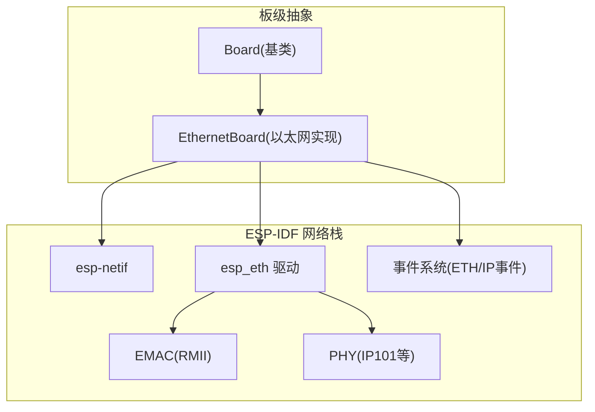
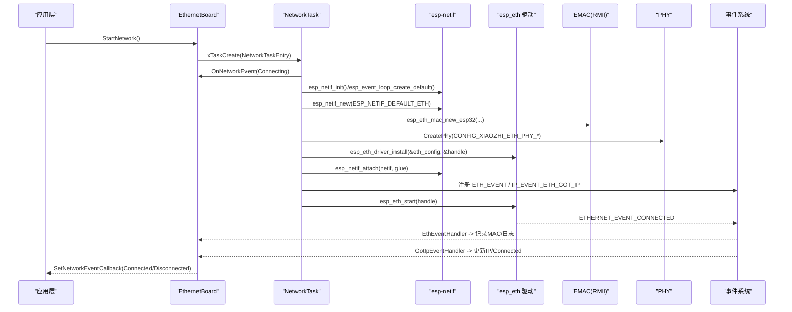
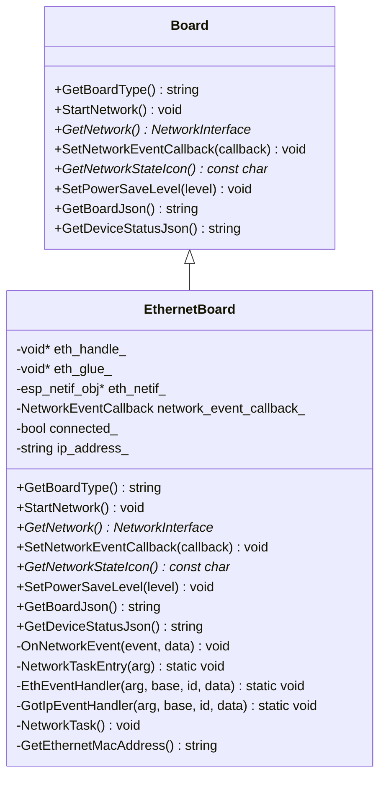
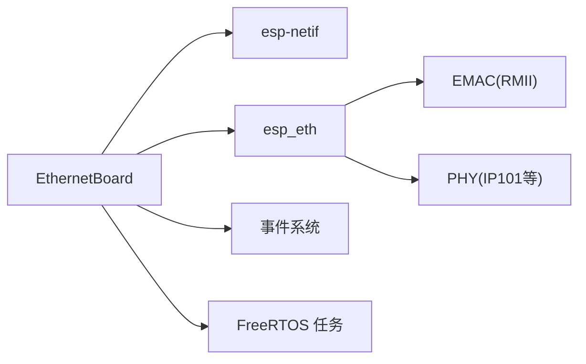

# 以太网网络接口

<cite>
**本文引用的文件**   
- [ethernet_board.h](file://main/boards/common/ethernet_board.h)
- [ethernet_board.cc](file://main/boards/common/ethernet_board.cc)
- [board.h](file://main/boards/common/board.h)
- [Kconfig.projbuild](file://main/Kconfig.projbuild)
</cite>

## 目录
1. [简介](#简介)
2. [项目结构](#项目结构)
3. [核心组件](#核心组件)
4. [架构总览](#架构总览)
5. [详细组件分析](#详细组件分析)
6. [依赖关系分析](#依赖关系分析)
7. [性能与功耗考量](#性能与功耗考量)
8. [故障诊断与排错指南](#故障诊断与排错指南)
9. [结论](#结论)
10. [附录](#附录)

## 简介
本文件面向使用 ESP-IDF 的以太网网络接口，聚焦 EthernetBoard 类的实现与集成方式。内容涵盖：
- 以太网 PHY 驱动选择与初始化（SMI/MDC-MDIO、RMII 时钟与数据引脚）
- IP 地址分配流程（DHCP 默认启用）、静态 IP 配置方法
- 网络栈与事件模型（esp-netif、ETH_EVENT、IP_EVENT）
- 链路状态检测、连接质量监控与断线恢复机制
- MAC 地址获取与设备信息上报
- 协议支持范围与 IPv6 兼容性说明
- 中断与 DMA 缓冲区相关参数
- 调试方法与性能分析建议

## 项目结构
本项目将以太网能力封装为 Board 层抽象，EthernetBoard 继承自 Board，负责以太网驱动的创建、事件处理与上层网络接口暴露。

图示来源
- [ethernet_board.h:8-39](file://main/boards/common/ethernet_board.h#L8-L39)
- [ethernet_board.cc:75-151](file://main/boards/common/ethernet_board.cc#L75-L151)

章节来源
- [ethernet_board.h:8-39](file://main/boards/common/ethernet_board.h#L8-L39)
- [board.h:49-85](file://main/boards/common/board.h#L49-L85)

## 核心组件
- EthernetBoard：提供以太网启动、事件回调、网络接口返回、设备状态 JSON 生成等能力。
- Board 基类：定义统一的网络事件回调类型、网络接口抽象与电源管理接口。
- Kconfig 配置项：用于选择 PHY 型号、设置 MDC/MDIO、PHY 地址与复位引脚等。

章节来源
- [ethernet_board.h:8-39](file://main/boards/common/ethernet_board.h#L8-L39)
- [board.h:42-44](file://main/boards/common/board.h#L42-L44)
- [Kconfig.projbuild:629-665](file://main/Kconfig.projbuild#L629-L665)

## 架构总览
EthernetBoard 在独立任务中完成网络栈初始化、MAC/PHY 创建、驱动安装与 netif 绑定，并通过事件回调对外发布连接状态。

图示来源
- [ethernet_board.cc:65-151](file://main/boards/common/ethernet_board.cc#L65-L151)
- [ethernet_board.cc:153-196](file://main/boards/common/ethernet_board.cc#L153-L196)

## 详细组件分析

### EthernetBoard 类设计
- 成员变量
  - eth_handle_/eth_glue_/eth_netif_：保存以太网驱动句柄、netif glue 与 netif 实例
  - network_event_callback_：统一网络事件回调
  - connected_/ip_address_：连接状态与已分配 IP
- 关键方法
  - StartNetwork：创建并启动网络任务
  - NetworkTask：初始化网络栈、创建 MAC/PHY、安装驱动、绑定 netif、注册事件、启动驱动
  - EthEventHandler/GotIpEventHandler：处理链路上下、IP 获取等事件
  - GetNetwork：返回 EspNetwork 实例供上层使用
  - GetDeviceStatusJson/GetBoardJson：输出设备与网络状态
  - SetPowerSaveLevel：当前为空实现（可扩展）

图示来源
- [board.h:49-85](file://main/boards/common/board.h#L49-L85)
- [ethernet_board.h:8-39](file://main/boards/common/ethernet_board.h#L8-L39)

章节来源
- [ethernet_board.h:8-39](file://main/boards/common/ethernet_board.h#L8-L39)
- [ethernet_board.cc:57-221](file://main/boards/common/ethernet_board.cc#L57-L221)

### 以太网 PHY 驱动与 EMAC/RMII 配置
- PHY 选择
  - 通过 Kconfig 选择 PHY 型号（如 IP101），并在运行时根据宏创建对应 PHY 实例
- EMAC 配置
  - SMI 总线：MDC/MDIO GPIO 由配置项指定
  - 接口模式：RMII
  - 时钟模式：外部时钟输入（可配置 GPIO）
  - DMA 突发长度：可配置（示例中设置为 32）
  - 中断优先级：可配置
  - RMII 数据引脚：TX_EN/TXD0/TXD1/CRS_DV/RXD0/RXD1 可通过条件编译配置
- 驱动安装与启动
  - 创建 MAC 与 PHY 后，组合为 esp_eth_config_t 并安装驱动
  - 创建 netif glue 并 attach 到 esp-netif
  - 注册 ETH_EVENT 与 IP_EVENT_ETH_GOT_IP 事件处理器
  - 调用 esp_eth_start 启动链路协商

章节来源
- [ethernet_board.cc:24-55](file://main/boards/common/ethernet_board.cc#L24-L55)
- [ethernet_board.cc:100-151](file://main/boards/common/ethernet_board.cc#L100-L151)
- [Kconfig.projbuild:629-665](file://main/Kconfig.projbuild#L629-L665)

### IP 地址分配与网络栈配置
- DHCP 客户端
  - 代码未显式配置静态 IP，默认走 DHCP 流程；当收到 IP_EVENT_ETH_GOT_IP 时更新 IP 并触发 Connected 事件
- 静态 IP 配置方法
  - 可在 esp_netif_set_ip_info 或创建 netif 前设置静态 IP 策略（需结合具体平台 API）
  - 若需要固定 IP，建议在 netif 创建后、esp_eth_start 之前进行配置
- 事件驱动
  - ETH_EVENT：链路连接/断开、启动/停止
  - IP_EVENT_ETH_GOT_IP：成功获取 IP（IPv4）

章节来源
- [ethernet_board.cc:184-196](file://main/boards/common/ethernet_board.cc#L184-L196)
- [ethernet_board.cc:142-151](file://main/boards/common/ethernet_board.cc#L142-L151)

### 链路状态检测、连接质量与故障恢复
- 链路状态
  - ETHERNET_EVENT_CONNECTED：记录 MAC 并打印日志
  - ETHERNET_EVENT_DISCONNECTED：清除 IP、置位 disconnected 并触发 Disconnected 事件
- 连接质量监控
  - 当前未实现速率/丢包/延迟统计；可在事件处理器中扩展读取 PHY 寄存器或统计计数
- 故障恢复机制
  - 当前未内置自动重连逻辑；可在上层监听 Disconnected 后重启网络任务或重新调用 esp_eth_start

章节来源
- [ethernet_board.cc:153-182](file://main/boards/common/ethernet_board.cc#L153-L182)

### MAC 地址配置与设备信息上报
- MAC 地址
  - 通过系统 API 读取以太网 MAC 并格式化为字符串
- 设备状态 JSON
  - 包含网络类型、连接状态、IP、MAC 等信息，便于远程查看

章节来源
- [ethernet_board.cc:227-244](file://main/boards/common/ethernet_board.cc#L227-L244)
- [ethernet_board.cc:251-302](file://main/boards/common/ethernet_board.cc#L251-L302)

### 网络协议支持与 IPv6 兼容性
- 协议支持
  - 基于 esp-netif 与 lwIP，默认支持 TCP/UDP/HTTP/WebSocket/MQTT 等上层协议
- IPv6
  - 代码未显式禁用 IPv6；是否启用取决于 IDF 配置与 DHCPv6/SLAAC 行为
  - 如需强制仅 IPv4，可在网络栈配置中调整

章节来源
- [ethernet_board.cc:75-151](file://main/boards/common/ethernet_board.cc#L75-L151)

### 中断与 DMA 缓冲区优化
- 中断
  - EMAC 中断优先级可通过配置项设置
- DMA 缓冲
  - 可配置 DMA 突发长度（示例中为 32），影响吞吐与内存占用
- 时钟与引脚
  - RMII 时钟源与数据引脚可通过配置项适配不同硬件布局

章节来源
- [ethernet_board.cc:32-55](file://main/boards/common/ethernet_board.cc#L32-L55)

### 功耗管理
- 当前 SetPowerSaveLevel 为空实现，未对以太网做低功耗控制
- 可扩展点
  - 在空闲时降低 PHY 功率模式、关闭不必要外设、调整中断优先级等

章节来源
- [ethernet_board.cc:247-249](file://main/boards/common/ethernet_board.cc#L247-L249)

## 依赖关系分析
- 模块耦合
  - EthernetBoard 依赖 esp-netif、esp_eth、事件系统与 FreeRTOS 任务
  - 通过 Board 抽象向上层屏蔽底层差异
- 外部依赖
  - ESP-IDF 网络栈与以太网驱动
  - Kconfig 构建期配置决定 PHY 型号与引脚映射

图示来源
- [ethernet_board.cc:75-151](file://main/boards/common/ethernet_board.cc#L75-L151)

章节来源
- [ethernet_board.cc:75-151](file://main/boards/common/ethernet_board.cc#L75-L151)

## 性能与功耗考量
- 吞吐优化
  - 合理设置 DMA 突发长度与中断优先级
  - 避免在主循环中频繁阻塞操作，利用事件回调异步处理
- 内存与缓存
  - 注意 lwIP 与以太网驱动缓冲区大小，避免堆碎片
- 功耗
  - 在无数据时考虑 PHY 节能模式与中断休眠策略（需在后续版本扩展）

[本节为通用指导，不直接分析具体文件]

## 故障诊断与排错指南
- 常见问题定位
  - 初始化失败：检查 esp_netif_init、esp_event_loop_create_default、esp_netif_new 返回值
  - MAC/PHY 创建失败：核对 MDC/MDIO、PHY 地址与复位引脚配置
  - 驱动安装/启动失败：确认 RMII 时钟与数据引脚映射
  - 无法获取 IP：检查路由器 DHCP 服务与网线连通性
- 日志与事件
  - 关注 Connecting/Connected/Disconnected 事件序列
  - 观察 ETHERNET_EVENT_* 与 IP_EVENT_ETH_GOT_IP 事件
- 工具与方法
  - 串口日志：查看各阶段错误码与 MAC/IP 信息
  - 抓包：在交换机侧抓取以太网帧验证握手过程
  - 状态查询：通过 GetDeviceStatusJson 获取当前网络状态

章节来源
- [ethernet_board.cc:75-151](file://main/boards/common/ethernet_board.cc#L75-L151)
- [ethernet_board.cc:153-196](file://main/boards/common/ethernet_board.cc#L153-L196)
- [ethernet_board.cc:251-302](file://main/boards/common/ethernet_board.cc#L251-L302)

## 结论
EthernetBoard 以简洁的事件驱动模型封装了以太网驱动与网络栈的初始化流程，提供了稳定的连接状态上报与基础的设备状态查询能力。当前实现默认使用 DHCP 获取 IPv4 地址，未内置自动重连与功耗控制。针对生产环境，建议在上层补充断线重连、连接质量监控与 IPv6 策略配置，并根据硬件特性调优 DMA 与中断参数以获得更佳性能与功耗表现。

[本节为总结性内容，不直接分析具体文件]

## 附录

### 配置项速查（Kconfig）
- XIAOZHI_ETH_PHY_MODEL：选择 PHY 型号（如 IP101）
- XIAOZHI_ETH_MDC_GPIO：SMI MDC 引脚
- XIAOZHI_ETH_MDIO_GPIO：SMI MDIO 引脚
- XIAOZHI_ETH_PHY_ADDR：PHY 地址（-1 表示自动探测）
- XIAOZHI_ETH_PHY_RST_GPIO：PHY 复位引脚

章节来源
- [Kconfig.projbuild:629-665](file://main/Kconfig.projbuild#L629-L665)

### 事件与状态对照
- Connecting：开始初始化与启动
- Connected：成功获取 IP 并完成链路建立
- Disconnected：链路断开或驱动停止

章节来源
- [board.h:20-33](file://main/boards/common/board.h#L20-L33)
- [ethernet_board.cc:198-216](file://main/boards/common/ethernet_board.cc#L198-L216)