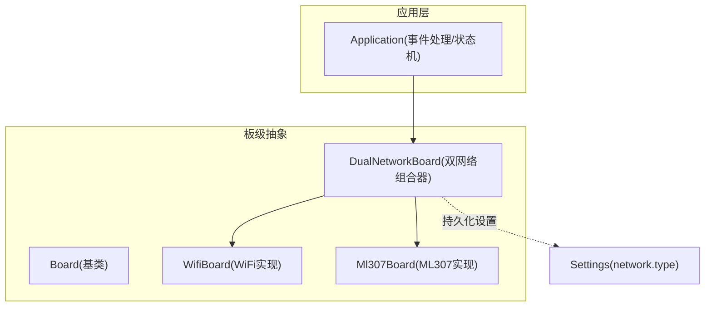
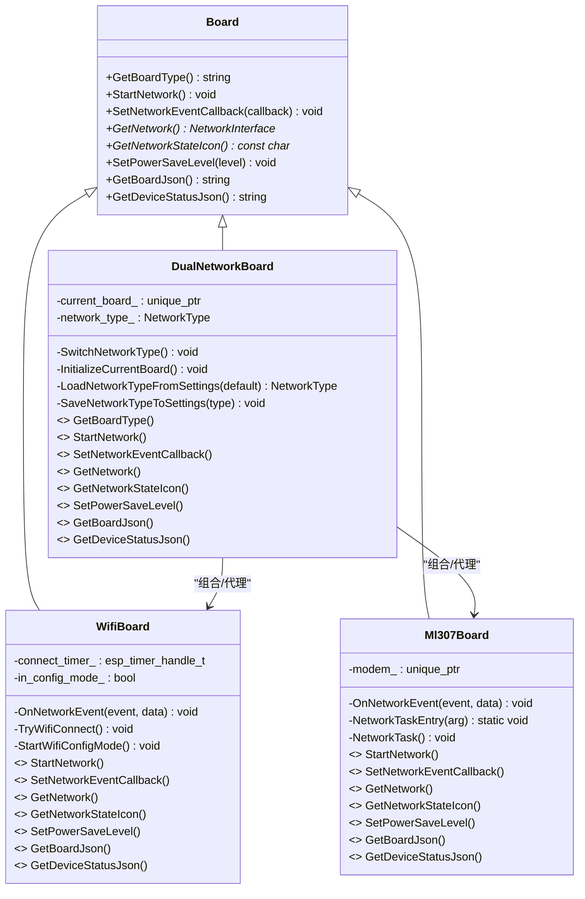
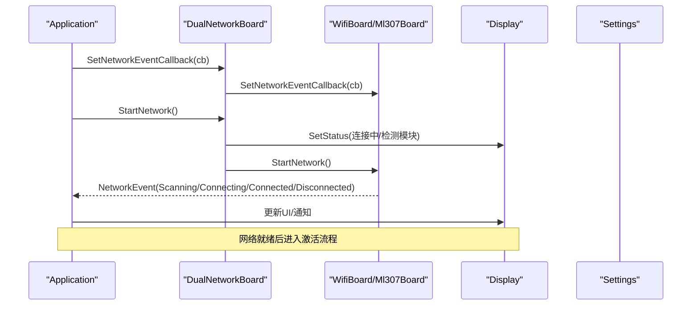
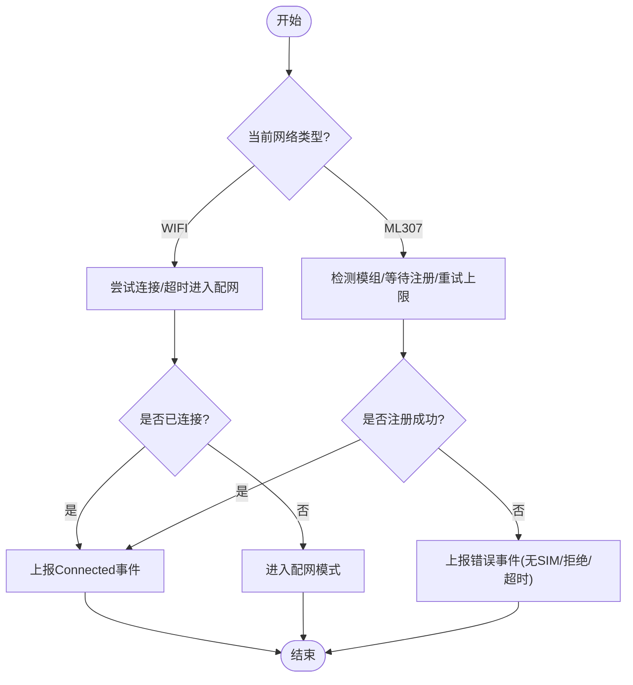
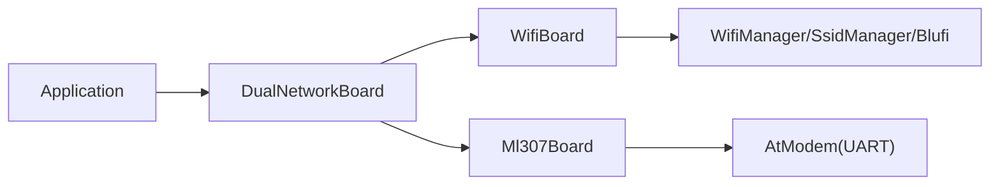

# 双网络支持

<cite>
**本文引用的文件**   
- [dual_network_board.h](file://main/boards/common/dual_network_board.h)
- [dual_network_board.cc](file://main/boards/common/dual_network_board.cc)
- [wifi_board.h](file://main/boards/common/wifi_board.h)
- [wifi_board.cc](file://main/boards/common/wifi_board.cc)
- [ml307_board.h](file://main/boards/common/ml307_board.h)
- [ml307_board.cc](file://main/boards/common/ml307_board.cc)
- [board.h](file://main/boards/common/board.h)
- [application.cc](file://main/application.cc)
</cite>

## 目录
1. [简介](#简介)
2. [项目结构](#项目结构)
3. [核心组件](#核心组件)
4. [架构总览](#架构总览)
5. [详细组件分析](#详细组件分析)
6. [依赖关系分析](#依赖关系分析)
7. [性能与资源优化](#性能与资源优化)
8. [故障排查指南](#故障排查指南)
9. [结论](#结论)
10. [附录：配置与最佳实践](#附录配置与最佳实践)

## 简介
本文件面向需要在设备上同时支持 WiFi 与 ML307（蜂窝）两种网络路径的开发者，提供“双网络支持”的完整 API 与设计说明。重点围绕 DualNetworkBoard 类的设计模式、主备切换逻辑、网络优先级管理、健康检查与自动切换机制、配置方法、触发条件与回退策略、状态同步、连接池与资源分配优化，以及数据完整性与服务连续性保障进行系统化阐述，并给出部署与故障恢复的最佳实践。

## 项目结构
双网络能力由一个统一的板级抽象层 Board 派生实现，DualNetworkBoard 作为组合器，根据持久化配置选择当前活动网络栈（WiFi 或 ML307），并将上层调用透明转发至具体实现。

图表来源
- [board.h:49-85](file://main/boards/common/board.h#L49-L85)
- [dual_network_board.h:16-58](file://main/boards/common/dual_network_board.h#L16-L58)
- [dual_network_board.cc:10-43](file://main/boards/common/dual_network_board.cc#L10-L43)
- [wifi_board.h:9-67](file://main/boards/common/wifi_board.h#L9-L67)
- [ml307_board.h:9-36](file://main/boards/common/ml307_board.h#L9-L36)
- [application.cc:100-163](file://main/application.cc#L100-L163)

章节来源
- [board.h:49-85](file://main/boards/common/board.h#L49-L85)
- [dual_network_board.h:16-58](file://main/boards/common/dual_network_board.h#L16-L58)
- [dual_network_board.cc:10-43](file://main/boards/common/dual_network_board.cc#L10-L43)
- [wifi_board.h:9-67](file://main/boards/common/wifi_board.h#L9-L67)
- [ml307_board.h:9-36](file://main/boards/common/ml307_board.h#L9-L36)
- [application.cc:100-163](file://main/application.cc#L100-L163)

## 核心组件
- DualNetworkBoard：组合器，负责从 Settings 读取网络类型、初始化对应子板卡、将 Board 接口透明转发到当前活动网络实现，并提供手动切换入口。
- WifiBoard：基于 Wi-Fi Manager 的异步连接流程，包含超时进入配网模式、RSSI 信号强度图标映射、设备状态 JSON 输出等。
- Ml307Board：基于 AT 调制解调器的异步注册流程，包含模组检测、网络注册重试、CSQ 信号强度图标映射、设备状态 JSON 输出等。
- Application：订阅网络事件，驱动 UI 提示与系统状态机流转，并在网络断开时关闭音频通道以维护一致性。

章节来源
- [dual_network_board.h:16-58](file://main/boards/common/dual_network_board.h#L16-L58)
- [dual_network_board.cc:10-98](file://main/boards/common/dual_network_board.cc#L10-L98)
- [wifi_board.h:9-67](file://main/boards/common/wifi_board.h#L9-L67)
- [wifi_board.cc:52-157](file://main/boards/common/wifi_board.cc#L52-L157)
- [ml307_board.h:9-36](file://main/boards/common/ml307_board.h#L9-L36)
- [ml307_board.cc:67-141](file://main/boards/common/ml307_board.cc#L67-L141)
- [application.cc:100-163](file://main/application.cc#L100-L163)

## 架构总览
DualNetworkBoard 采用“组合+代理转发”的模式，屏蔽底层网络差异，向上暴露统一 Board 接口；Application 通过统一的 NetworkEvent 回调与状态机协调 UI 与协议层行为。

图表来源
- [board.h:49-85](file://main/boards/common/board.h#L49-L85)
- [dual_network_board.h:16-58](file://main/boards/common/dual_network_board.h#L16-L58)
- [dual_network_board.cc:10-98](file://main/boards/common/dual_network_board.cc#L10-L98)
- [wifi_board.h:9-67](file://main/boards/common/wifi_board.h#L9-L67)
- [ml307_board.h:9-36](file://main/boards/common/ml307_board.h#L9-L36)

## 详细组件分析

### DualNetworkBoard 设计与实现
- 设计模式
  - 组合模式：持有当前活动网络实现的唯一指针，运行时动态选择。
  - 代理转发：所有 Board 接口均委托给 current_board_，对外保持统一契约。
- 启动与初始化
  - 构造时从 Settings 读取 network.type，默认优先使用 ML307。
  - 仅初始化当前网络类型的子板卡，避免不必要的资源占用。
- 切换与持久化
  - SwitchNetworkType 会更新 Settings、显示通知、延时后触发系统重启，以便按新配置重新初始化。
- 事件与状态
  - 网络事件回调直接转发至当前活动网络实现。
  - 网络状态图标、JSON 信息均由当前活动网络实现提供。

图表来源
- [dual_network_board.cc:64-78](file://main/boards/common/dual_network_board.cc#L64-L78)
- [application.cc:100-163](file://main/application.cc#L100-L163)
- [wifi_board.cc:52-87](file://main/boards/common/wifi_board.cc#L52-L87)
- [ml307_board.cc:134-141](file://main/boards/common/ml307_board.cc#L134-L141)

章节来源
- [dual_network_board.h:16-58](file://main/boards/common/dual_network_board.h#L16-L58)
- [dual_network_board.cc:10-98](file://main/boards/common/dual_network_board.cc#L10-L98)

### 网络健康检查与自动切换机制
- 健康检查
  - WiFi：通过 WifiManager 的事件回调与连接超时定时器判断连接状态；无 SSID 或超时则进入配网模式。
  - ML307：在独立任务中执行模组检测与网络注册，带最大重试次数与错误分类（无SIM、拒绝注册、初始化失败、超时）。
- 自动切换
  - 当前代码未内置“在线热切换”逻辑。SwitchNetworkType 通过持久化保存目标网络并重启设备，从而在新生命周期加载新的网络栈。
  - 若需在线切换，可在 Application 的网络断开事件中增加策略：记录断线次数/时长阈值，达到阈值后调用 SwitchNetworkType 并重启。

图表来源
- [wifi_board.cc:89-157](file://main/boards/common/wifi_board.cc#L89-L157)
- [ml307_board.cc:67-141](file://main/boards/common/ml307_board.cc#L67-L141)
- [dual_network_board.cc:45-57](file://main/boards/common/dual_network_board.cc#L45-L57)

章节来源
- [wifi_board.cc:89-157](file://main/boards/common/wifi_board.cc#L89-L157)
- [ml307_board.cc:67-141](file://main/boards/common/ml307_board.cc#L67-L141)
- [dual_network_board.cc:45-57](file://main/boards/common/dual_network_board.cc#L45-L57)

### 网络优先级管理与配置方法
- 优先级
  - 默认优先级：ML307（Settings 默认值 1 表示 ML307）。
  - 可通过修改 Settings 中的 network.type 指定首选网络：0 为 WIFI，1 为 ML307。
- 配置方法
  - 首次上电：若无 WiFi 配置，将自动进入配网模式；完成配网后重启并尝试连接。
  - 运行时切换：调用 SwitchNetworkType 写入 Settings 并重启，下次启动按新优先级初始化。

章节来源
- [dual_network_board.cc:23-33](file://main/boards/common/dual_network_board.cc#L23-L33)
- [dual_network_board.cc:45-57](file://main/boards/common/dual_network_board.cc#L45-L57)
- [wifi_board.cc:89-104](file://main/boards/common/wifi_board.cc#L89-L104)

### 网络状态同步与事件模型
- 事件流
  - 底层网络实现通过 OnNetworkEvent 生成统一事件，再经 SetNetworkEventCallback 回调至 Application。
  - Application 根据事件更新 UI 通知、设置事件标志位，进而驱动状态机（如激活流程）。
- 状态图标
  - WiFi：依据 RSSI 返回不同图标（强/一般/弱/无）。
  - ML307：依据 CSQ 返回不同图标（强/好/一般/弱/无）。

章节来源
- [application.cc:100-163](file://main/application.cc#L100-L163)
- [wifi_board.cc:249-266](file://main/boards/common/wifi_board.cc#L249-L266)
- [ml307_board.cc:147-166](file://main/boards/common/ml307_board.cc#L147-L166)

### 连接池管理与资源分配优化
- 连接对象
  - WiFi：通过静态 EspNetwork 实例提供网络接口，避免重复创建。
  - ML307：通过 AtModem 实例提供网络接口，内部维护串口与AT会话。
- 资源释放
  - WiFi 连接成功后释放 Blufi 资源，避免占用。
  - 各网络实现均在析构或停止流程中清理定时器/任务等资源。
- 建议
  - 避免频繁切换网络导致连接对象反复创建销毁。
  - 合理设置连接超时与重试次数，平衡功耗与可用性。

章节来源
- [wifi_board.cc:244-247](file://main/boards/common/wifi_board.cc#L244-L247)
- [ml307_board.cc:143-145](file://main/boards/common/ml307_board.cc#L143-L145)
- [wifi_board.cc:111-117](file://main/boards/common/wifi_board.cc#L111-L117)

### 数据完整性与服务连续性保证
- 断开保护
  - 当收到 Disconnected 事件时，Application 主动关闭音频通道，防止在不可用链路上继续发送数据，确保协议一致性。
- 重连与恢复
  - WiFi：超时进入配网模式，用户完成配置后自动重试连接。
  - ML307：带重试上限的注册流程，错误分类清晰，便于上层告警与诊断。
- 切换期间的服务连续性
  - 当前实现通过重启完成切换，切换期间服务短暂中断。若需零中断切换，需在 Application 层实现“双栈并行+无缝迁移”的策略（见附录最佳实践）。

章节来源
- [application.cc:286-297](file://main/application.cc#L286-L297)
- [wifi_board.cc:151-157](file://main/boards/common/wifi_board.cc#L151-L157)
- [ml307_board.cc:104-123](file://main/boards/common/ml307_board.cc#L104-L123)

## 依赖关系分析
- 组件耦合
  - DualNetworkBoard 对 Board 抽象低耦合，对具体实现（WifiBoard/Ml307Board）通过组合隔离变化。
  - Application 仅依赖 Board 的统一事件与接口，不感知具体网络类型。
- 外部依赖
  - WiFi 依赖 WifiManager、SsidManager、Blufi（可选）、Acoustic Provisioning（可选）。
  - ML307 依赖 AtModem 与 UART 驱动。
- 潜在循环依赖
  - 未发现循环依赖；事件回调单向流向 Application。

图表来源
- [application.cc:100-163](file://main/application.cc#L100-L163)
- [dual_network_board.cc:10-43](file://main/boards/common/dual_network_board.cc#L10-L43)
- [wifi_board.cc:52-87](file://main/boards/common/wifi_board.cc#L52-L87)
- [ml307_board.cc:67-141](file://main/boards/common/ml307_board.cc#L67-L141)

章节来源
- [application.cc:100-163](file://main/application.cc#L100-L163)
- [dual_network_board.cc:10-43](file://main/boards/common/dual_network_board.cc#L10-L43)
- [wifi_board.cc:52-87](file://main/boards/common/wifi_board.cc#L52-L87)
- [ml307_board.cc:67-141](file://main/boards/common/ml307_board.cc#L67-L141)

## 性能与资源优化
- 异步初始化
  - WiFi 与 ML307 均采用异步方式启动网络，避免阻塞主线程。
- 超时与重试
  - WiFi 连接超时进入配网；ML307 注册带重试上限，避免无限等待。
- 电源管理
  - WiFi 支持低功耗等级设置；ML307 预留扩展点。
- 建议
  - 在网络不稳定场景下，适当增大重试间隔与上限，减少频繁唤醒带来的功耗。
  - 在电量敏感设备中，结合电池监控与功率策略，动态调整网络探测频率。

章节来源
- [wifi_board.cc:52-87](file://main/boards/common/wifi_board.cc#L52-L87)
- [ml307_board.cc:67-141](file://main/boards/common/ml307_board.cc#L67-L141)
- [wifi_board.cc:284-299](file://main/boards/common/wifi_board.cc#L284-L299)

## 故障排查指南
- 常见问题定位
  - 无法连接 WiFi：检查是否存在有效 SSID；观察是否进入配网模式；查看 RSSI 与信道信息。
  - ML307 无法注册：确认 SIM 卡插入与运营商状态；关注错误事件（无SIM/拒绝注册/初始化失败/超时）。
  - 切换无效：确认 Settings 中 network.type 是否写入成功；确认重启后是否按新配置初始化。
- 日志与诊断
  - 使用 ESP_LOG 输出关键节点（模组检测、注册、连接、断开）。
  - 通过 GetBoardJson/GetDeviceStatusJson 获取设备与网络状态快照。
- 恢复策略
  - WiFi：引导用户完成配网后自动重试。
  - ML307：根据错误类型提示用户（插卡、欠费、信号差等），必要时引导切换网络并重试。

章节来源
- [wifi_board.cc:89-157](file://main/boards/common/wifi_board.cc#L89-L157)
- [ml307_board.cc:67-141](file://main/boards/common/ml307_board.cc#L67-L141)
- [application.cc:100-163](file://main/application.cc#L100-L163)

## 结论
DualNetworkBoard 通过组合与代理转发实现了 WiFi 与 ML307 的统一接入面，配合 Application 的事件驱动与状态机，提供了稳定的网络接入体验。当前版本以“重启式切换”为主，具备清晰的配置方法与完善的健康检查与错误分类。若需更高可用性，可在应用层叠加在线切换策略与双栈并行方案，以实现更平滑的服务连续性。

## 附录：配置与最佳实践

### 配置项与默认值
- Settings 命名空间：network
- 键名：type
- 取值：
  - 0：WIFI
  - 1：ML307（默认）

章节来源
- [dual_network_board.cc:23-33](file://main/boards/common/dual_network_board.cc#L23-L33)

### 切换触发条件与回退策略（建议）
- 触发条件
  - 连续 N 次连接失败或长时间无 IP。
  - 信号质量低于阈值（WiFi RSSI 或 ML307 CSQ）。
  - 用户手动触发（SwitchNetworkType）。
- 回退策略
  - 先尝试在当前网络进行有限次重连；失败后切换到备用网络。
  - 切换后保留原网络状态一段时间，若备用网络稳定再完全迁移会话。

[本节为概念性建议，无需源码引用]

### 在线热切换与数据完整性（建议）
- 双栈并行
  - 同时维持两条网络链路，主用链路承载业务，备用链路保持轻量心跳。
- 会话迁移
  - 在切换窗口内缓冲上行数据，待新链路就绪后补发；下行侧按序列号去重合并。
- 幂等与重试
  - 关键消息携带幂等键，服务端支持重复提交安全。
- 观测与告警
  - 统计切换耗时、丢包率、重传率，设定阈值告警。

[本节为概念性建议，无需源码引用]

### 部署与运维建议
- 出厂默认优先使用 ML307，确保在无 WiFi 环境下仍可工作。
- 生产环境开启详细的网络事件日志，便于问题回溯。
- 定期巡检设备网络状态 JSON，识别弱信号与异常断线。

[本节为概念性建议，无需源码引用]