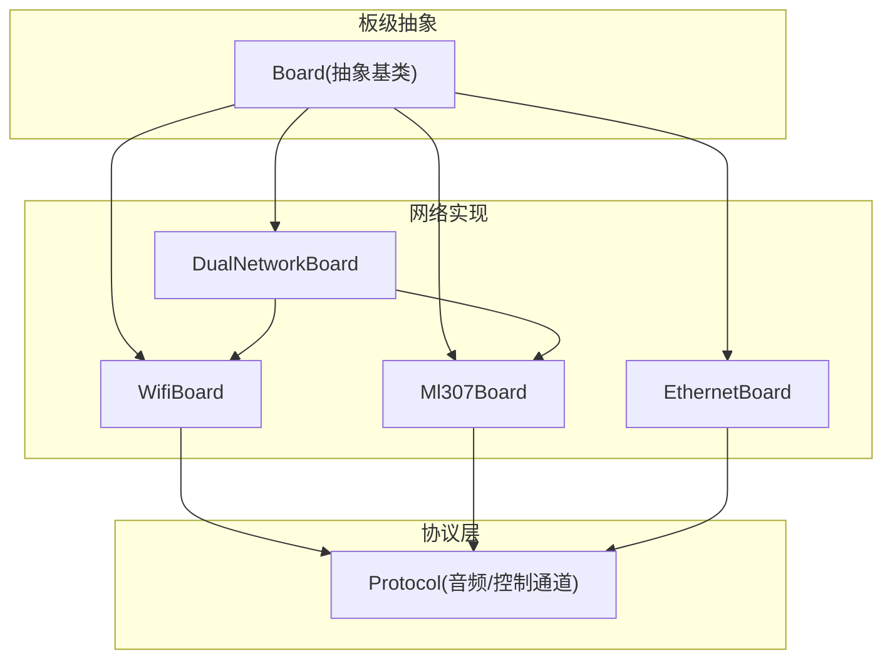
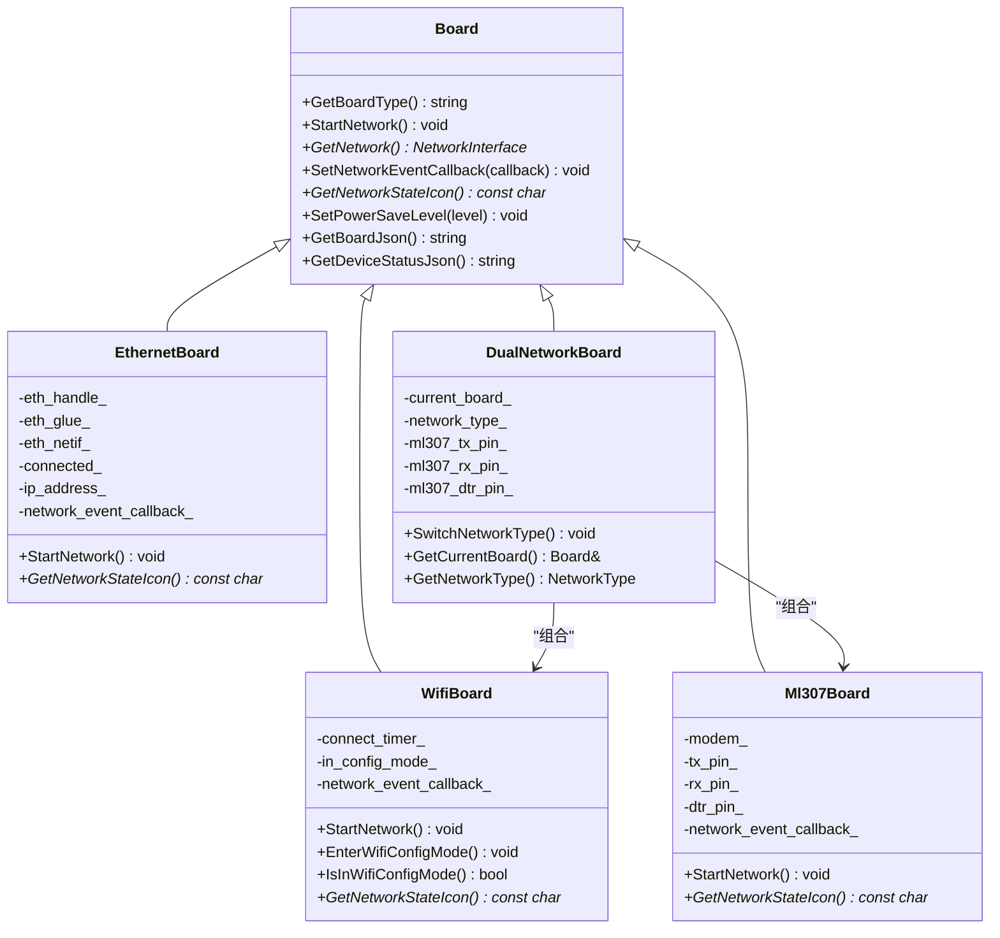
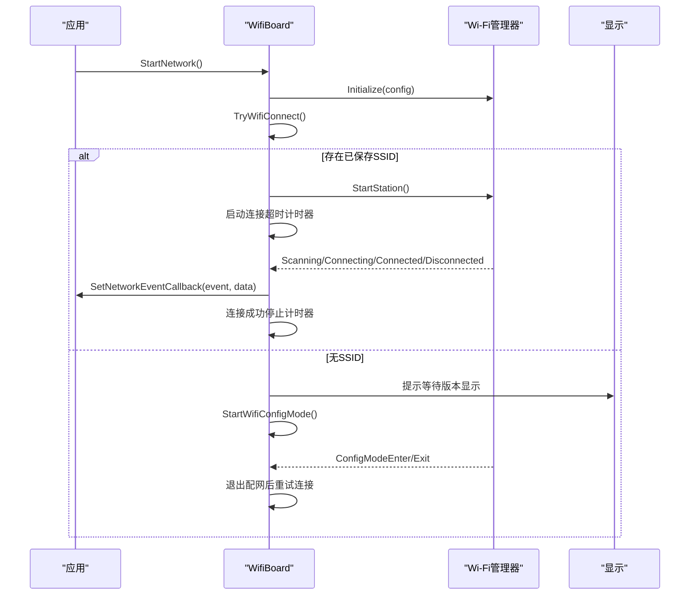
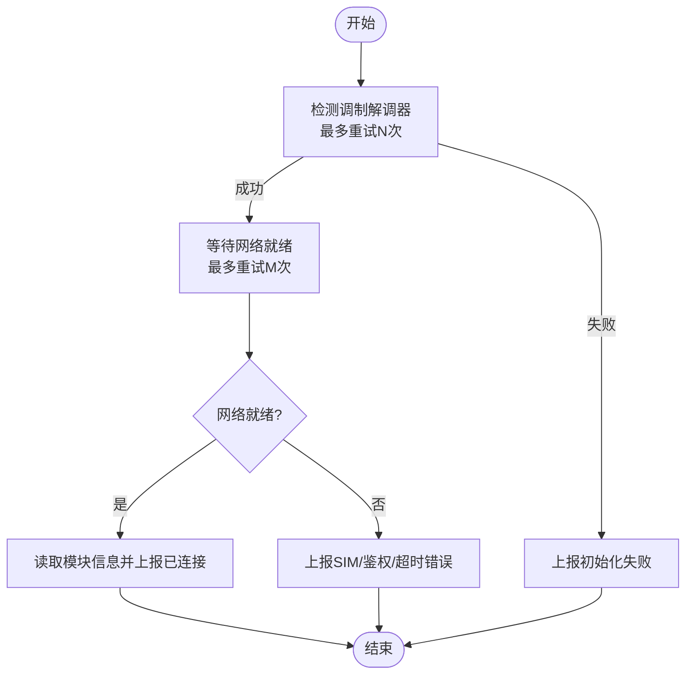
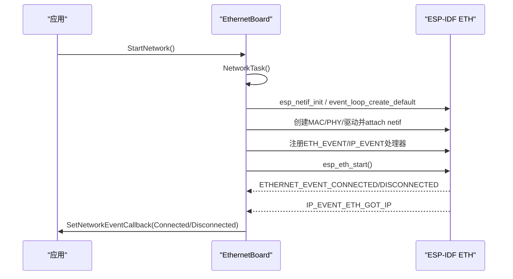
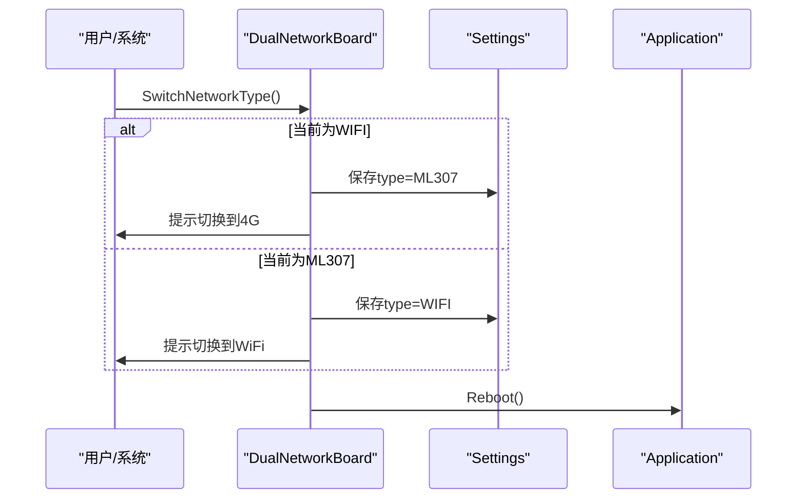
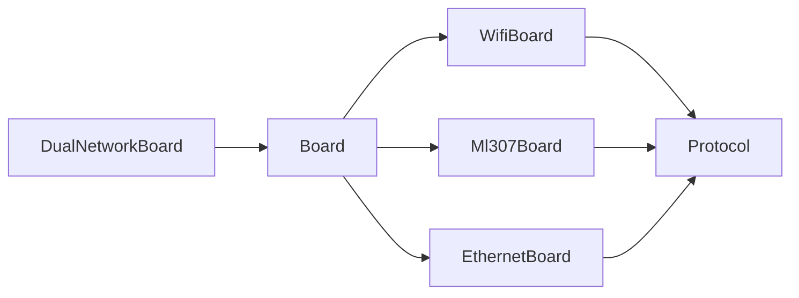

# 网络接口适配

<cite>
**本文引用的文件**   
- [board.h](file://main/boards/common/board.h)
- [wifi_board.h](file://main/boards/common/wifi_board.h)
- [wifi_board.cc](file://main/boards/common/wifi_board.cc)
- [ml307_board.h](file://main/boards/common/ml307_board.h)
- [ml307_board.cc](file://main/boards/common/ml307_board.cc)
- [ethernet_board.h](file://main/boards/common/ethernet_board.h)
- [ethernet_board.cc](file://main/boards/common/ethernet_board.cc)
- [dual_network_board.h](file://main/boards/common/dual_network_board.h)
- [dual_network_board.cc](file://main/boards/common/dual_network_board.cc)
- [protocol.h](file://main/protocols/protocol.h)
</cite>

## 目录
1. [简介](#简介)
2. [项目结构](#项目结构)
3. [核心组件](#核心组件)
4. [架构总览](#架构总览)
5. [详细组件分析](#详细组件分析)
6. [依赖关系分析](#依赖关系分析)
7. [性能与可靠性优化](#性能与可靠性优化)
8. [故障排查指南](#故障排查指南)
9. [结论](#结论)
10. [附录：配置与安全要点](#附录配置与安全要点)

## 简介
本文件面向“网络接口适配层”的API文档，聚焦于不同网络类型（WiFi、ML307蜂窝、以太网）的实现差异与统一抽象。文档覆盖以下主题：
- NetworkInterface抽象类与具体驱动实现模式
- WiFiBoard、Ml307Board、EthernetBoard的差异与职责边界
- 网络连接状态管理、自动重连机制与事件处理
- 双网络支持 DualNetworkBoard 的原理与切换逻辑
- 网络配置方法、认证机制与安全连接设置
- 性能优化与故障恢复最佳实践

## 项目结构
网络适配层位于 boards/common 目录下，采用统一的 Board 抽象基类，提供一致的启动、事件回调、网络获取与电源管理等接口；各网络类型通过各自 Board 子类封装底层驱动细节。

图表来源
- [board.h:49-85](file://main/boards/common/board.h#L49-L85)
- [wifi_board.h:9-67](file://main/boards/common/wifi_board.h#L9-L67)
- [ml307_board.h:9-36](file://main/boards/common/ml307_board.h#L9-L36)
- [ethernet_board.h:8-39](file://main/boards/common/ethernet_board.h#L8-L39)
- [dual_network_board.h:16-58](file://main/boards/common/dual_network_board.h#L16-L58)
- [protocol.h:44-95](file://main/protocols/protocol.h#L44-L95)

章节来源
- [board.h:49-85](file://main/boards/common/board.h#L49-L85)

## 核心组件
- Board 抽象基类
  - 定义统一接口：StartNetwork、GetNetwork、SetNetworkEventCallback、GetNetworkStateIcon、SetPowerSaveLevel、GetBoardJson、GetDeviceStatusJson 等
  - 提供设备能力访问（显示、背光、电池、温度等）
- 网络事件模型
  - 统一枚举 NetworkEvent，涵盖扫描、连接、已连接、断开、配网进入/退出、蜂窝调制解调器相关错误等
  - 使用函数对象回调 NetworkEventCallback 将事件上抛给上层
- 具体网络 Board
  - WifiBoard：基于 Wi-Fi 管理器，异步连接、超时进入配网、信号强度图标映射
  - Ml307Board：AT 调制解调器初始化、注册网络、CSQ 信号强度映射
  - EthernetBoard：ESP-IDF ETH 驱动、netif 绑定、IP 获取事件
  - DualNetworkBoard：在 WiFi 与 ML307 之间选择并代理所有 Board 接口，支持持久化切换

章节来源
- [board.h:20-44](file://main/boards/common/board.h#L20-L44)
- [board.h:49-85](file://main/boards/common/board.h#L49-L85)
- [wifi_board.h:9-67](file://main/boards/common/wifi_board.h#L9-L67)
- [ml307_board.h:9-36](file://main/boards/common/ml307_board.h#L9-L36)
- [ethernet_board.h:8-39](file://main/boards/common/ethernet_board.h#L8-L39)
- [dual_network_board.h:16-58](file://main/boards/common/dual_network_board.h#L16-L58)

## 架构总览
整体采用“Board 抽象 + 多网络实现 + 可选双网桥接”的分层设计。上层通过 Board 实例发起网络启动与事件订阅，协议层通过 GetNetwork() 获取底层网络接口进行数据面通信。

图表来源
- [board.h:49-85](file://main/boards/common/board.h#L49-L85)
- [wifi_board.h:9-67](file://main/boards/common/wifi_board.h#L9-L67)
- [ml307_board.h:9-36](file://main/boards/common/ml307_board.h#L9-L36)
- [ethernet_board.h:8-39](file://main/boards/common/ethernet_board.h#L8-L39)
- [dual_network_board.h:16-58](file://main/boards/common/dual_network_board.h#L16-L58)

## 详细组件分析

### WifiBoard 分析与流程
- 职责
  - 初始化 Wi-Fi 管理器，设置统一事件回调
  - 尝试连接或进入配网模式（热点/Blufi/声学）
  - 连接超时后进入配网模式
  - 根据连接状态与信号强度返回图标
- 关键流程
  - StartNetwork -> TryWifiConnect -> (有SSID则连接，无则配网)
  - OnNetworkEvent 转发至外部回调
  - 超时回调 OnWifiConnectTimeout 触发配网
- 自动重连
  - 配网退出后再次尝试连接
  - 连接成功停止超时计时器

图表来源
- [wifi_board.cc:52-104](file://main/boards/common/wifi_board.cc#L52-L104)
- [wifi_board.cc:106-145](file://main/boards/common/wifi_board.cc#L106-L145)
- [wifi_board.cc:151-157](file://main/boards/common/wifi_board.cc#L151-L157)
- [wifi_board.cc:159-197](file://main/boards/common/wifi_board.cc#L159-L197)

章节来源
- [wifi_board.h:9-67](file://main/boards/common/wifi_board.h#L9-L67)
- [wifi_board.cc:52-104](file://main/boards/common/wifi_board.cc#L52-L104)
- [wifi_board.cc:106-145](file://main/boards/common/wifi_board.cc#L106-L145)
- [wifi_board.cc:151-157](file://main/boards/common/wifi_board.cc#L151-L157)
- [wifi_board.cc:159-197](file://main/boards/common/wifi_board.cc#L159-L197)

### Ml307Board 分析与流程
- 职责
  - 通过 AT 命令检测调制解调器并建立网络
  - 监听网络就绪回调，上报连接/断开事件
  - 根据 CSQ 值映射信号强度图标
- 关键流程
  - StartNetwork 创建任务执行 NetworkTask
  - NetworkTask 循环检测调制解调器，注册网络，打印模块信息
  - OnNetworkEvent 转发至外部回调
- 自动重连
  - 检测到网络断开时回调 Disconnected，上层可据此触发重连策略

图表来源
- [ml307_board.cc:67-132](file://main/boards/common/ml307_board.cc#L67-L132)
- [ml307_board.cc:134-141](file://main/boards/common/ml307_board.cc#L134-L141)
- [ml307_board.cc:31-65](file://main/boards/common/ml307_board.cc#L31-L65)

章节来源
- [ml307_board.h:9-36](file://main/boards/common/ml307_board.h#L9-L36)
- [ml307_board.cc:67-132](file://main/boards/common/ml307_board.cc#L67-L132)
- [ml307_board.cc:134-141](file://main/boards/common/ml307_board.cc#L134-L141)
- [ml307_board.cc:31-65](file://main/boards/common/ml307_board.cc#L31-L65)

### EthernetBoard 分析与流程
- 职责
  - 初始化 esp-netif、ETH MAC/PHY、安装驱动并绑定 netif
  - 注册以太网事件与 IP 获取事件
  - 维护连接状态与 IP 地址，上报连接/断开事件
- 关键流程
  - StartNetwork 创建任务执行 NetworkTask
  - NetworkTask 完成驱动初始化并启动 ETH
  - EthEventHandler/GotIpEventHandler 更新状态并触发回调

图表来源
- [ethernet_board.cc:65-151](file://main/boards/common/ethernet_board.cc#L65-L151)
- [ethernet_board.cc:153-196](file://main/boards/common/ethernet_board.cc#L153-L196)
- [ethernet_board.cc:198-216](file://main/boards/common/ethernet_board.cc#L198-L216)

章节来源
- [ethernet_board.h:8-39](file://main/boards/common/ethernet_board.h#L8-L39)
- [ethernet_board.cc:65-151](file://main/boards/common/ethernet_board.cc#L65-L151)
- [ethernet_board.cc:153-196](file://main/boards/common/ethernet_board.cc#L153-L196)
- [ethernet_board.cc:198-216](file://main/boards/common/ethernet_board.cc#L198-L216)

### DualNetworkBoard 分析与切换逻辑
- 职责
  - 根据 Settings 中的 type 字段决定当前活动网络（WIFI 或 ML307）
  - 组合对应 Board 实例，代理所有 Board 接口
  - 提供 SwitchNetworkType 切换并重启以生效
- 切换流程
  - 写入 Settings -> 显示通知 -> 延时 -> 调用 Application::Reboot()

图表来源
- [dual_network_board.cc:45-57](file://main/boards/common/dual_network_board.cc#L45-L57)
- [dual_network_board.cc:23-33](file://main/boards/common/dual_network_board.cc#L23-L33)
- [dual_network_board.h:16-58](file://main/boards/common/dual_network_board.h#L16-L58)

章节来源
- [dual_network_board.h:16-58](file://main/boards/common/dual_network_board.h#L16-L58)
- [dual_network_board.cc:10-21](file://main/boards/common/dual_network_board.cc#L10-L21)
- [dual_network_board.cc:23-33](file://main/boards/common/dual_network_board.cc#L23-L33)
- [dual_network_board.cc:45-57](file://main/boards/common/dual_network_board.cc#L45-L57)

### 网络事件与状态管理
- 统一事件模型
  - NetworkEvent 包含通用与蜂窝专用事件，便于上层统一处理
- 事件分发
  - 各 Board 内部 OnNetworkEvent 负责日志与转发到外部回调
- 状态图标
  - WifiBoard 依据 RSSI 分级返回图标
  - Ml307Board 依据 CSQ 分级返回图标
  - EthernetBoard 依据连接标志返回图标

章节来源
- [board.h:20-44](file://main/boards/common/board.h#L20-L44)
- [wifi_board.cc:249-266](file://main/boards/common/wifi_board.cc#L249-L266)
- [ml307_board.cc:147-166](file://main/boards/common/ml307_board.cc#L147-L166)
- [ethernet_board.cc:223-225](file://main/boards/common/ethernet_board.cc#L223-L225)

### 协议层集成点
- 协议层通过 Board::GetNetwork() 获取底层网络接口，用于打开音频通道、发送消息、监听网络错误等
- 典型回调包括 OnConnected/OnDisconnected/OnNetworkError 等

章节来源
- [protocol.h:44-95](file://main/protocols/protocol.h#L44-L95)

## 依赖关系分析
- 耦合与内聚
  - Board 抽象保持高内聚，具体网络实现低耦合
  - DualNetworkBoard 仅依赖 Board 接口，对具体实现透明
- 外部依赖
  - WifiBoard 依赖 Wi-Fi 管理器与可选 Blufi/声学配网
  - Ml307Board 依赖 AT 调制解调器库
  - EthernetBoard 依赖 ESP-IDF ETH/netif 子系统
- 潜在循环依赖
  - 通过回调与事件机制避免直接循环引用

图表来源
- [board.h:49-85](file://main/boards/common/board.h#L49-L85)
- [dual_network_board.h:16-58](file://main/boards/common/dual_network_board.h#L16-L58)
- [protocol.h:44-95](file://main/protocols/protocol.h#L44-L95)

章节来源
- [board.h:49-85](file://main/boards/common/board.h#L49-L85)
- [dual_network_board.h:16-58](file://main/boards/common/dual_network_board.h#L16-L58)
- [protocol.h:44-95](file://main/protocols/protocol.h#L44-L95)

## 性能与可靠性优化
- 连接与重连
  - WiFi 连接超时进入配网，配网退出后自动重试；建议在上层结合指数退避策略
  - 蜂窝网络注册失败按最大重试次数回退，建议在应用层增加更长的重试周期与告警
  - 以太网链路断开需由上层感知并重建会话
- 功耗管理
  - 通过 SetPowerSaveLevel 调整 Wi-Fi 省电级别；蜂窝与以太网暂不实现或空实现
- 资源释放
  - WiFi 配网完成后释放 Blufi 资源，避免占用
- 状态上报
  - 利用 GetDeviceStatusJson 聚合音频、屏幕、电池、网络、芯片温度等信息，便于监控与诊断

章节来源
- [wifi_board.cc:111-117](file://main/boards/common/wifi_board.cc#L111-L117)
- [wifi_board.cc:284-299](file://main/boards/common/wifi_board.cc#L284-L299)
- [ml307_board.cc:181-184](file://main/boards/common/ml307_board.cc#L181-L184)
- [ethernet_board.cc:247-249](file://main/boards/common/ethernet_board.cc#L247-L249)

## 故障排查指南
- 常见问题定位
  - WiFi 无法连接：检查是否进入配网模式、是否存在可用 SSID、超时是否触发
  - 蜂窝无 SIM/鉴权失败：关注 ModemErrorNoSim/ModemErrorRegDenied 事件
  - 以太网未获取 IP：检查 PHY/MAC 初始化、事件回调是否触发
- 日志与状态
  - 使用各 Board 的 GetBoardJson/GetDeviceStatusJson 输出结构化信息
  - 观察网络事件回调，确认状态机流转是否符合预期

章节来源
- [wifi_board.cc:106-145](file://main/boards/common/wifi_board.cc#L106-L145)
- [ml307_board.cc:31-65](file://main/boards/common/ml307_board.cc#L31-L65)
- [ethernet_board.cc:198-216](file://main/boards/common/ethernet_board.cc#L198-L216)
- [wifi_board.cc:268-282](file://main/boards/common/wifi_board.cc#L268-L282)
- [ml307_board.cc:168-179](file://main/boards/common/ml307_board.cc#L168-L179)
- [ethernet_board.cc:236-245](file://main/boards/common/ethernet_board.cc#L236-L245)

## 结论
该适配层通过 Board 抽象统一了不同网络的接入方式，借助事件模型与状态图标实现了良好的可观测性。DualNetworkBoard 提供了灵活的切换能力，配合 Settings 持久化与重启生效，满足多场景部署需求。上层应结合事件与状态 JSON 完善重连、告警与运维能力。

## 附录：配置与安全要点
- 网络配置方法
  - WiFi：支持热点配网、Blufi 配网、声学配网三种方式，默认在无 SSID 或超时时进入配网
  - 蜂窝：通过 AT 调制解调器自动注册网络，无需手动配网
  - 以太网：静态或 DHCP 取决于平台配置，代码中通过事件获取 IP
- 认证机制
  - WiFi：由 Wi-Fi 管理器负责 SSID/密码存储与连接
  - 蜂窝：由运营商 SIM 卡鉴权
  - 以太网：通常无认证，依赖链路层与上层安全
- 安全连接设置
  - 上层协议层负责 TLS/证书等安全传输，网络适配层仅提供连通性与状态
- 电源与性能
  - 通过 SetPowerSaveLevel 调节 Wi-Fi 功耗；蜂窝与以太网暂未暴露细粒度控制

章节来源
- [wifi_board.cc:159-197](file://main/boards/common/wifi_board.cc#L159-L197)
- [ml307_board.cc:67-132](file://main/boards/common/ml307_board.cc#L67-L132)
- [ethernet_board.cc:65-151](file://main/boards/common/ethernet_board.cc#L65-L151)
- [protocol.h:44-95](file://main/protocols/protocol.h#L44-L95)