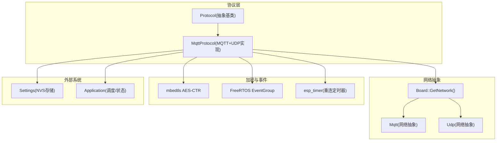
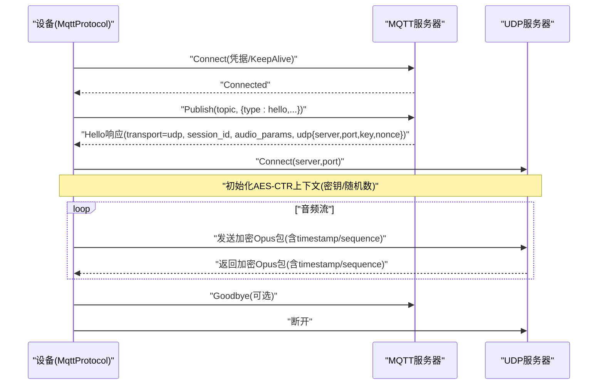
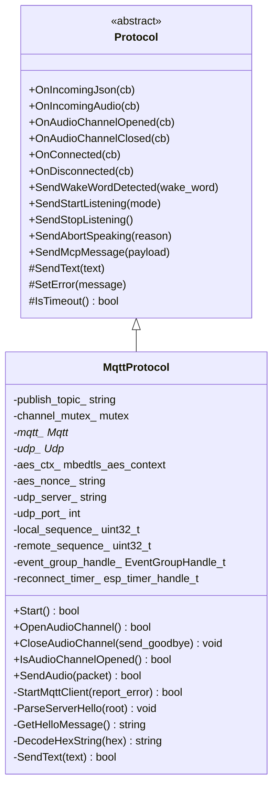
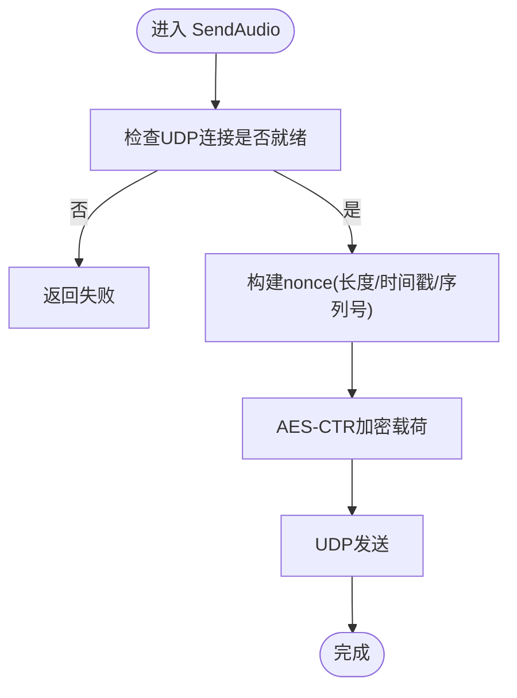
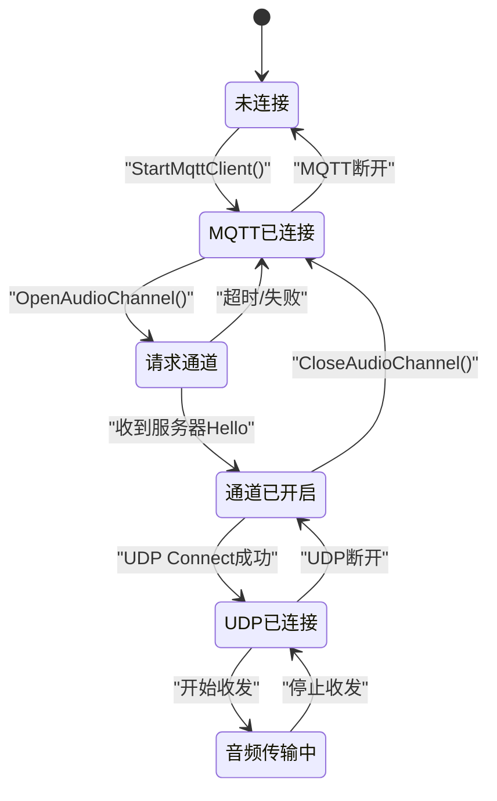
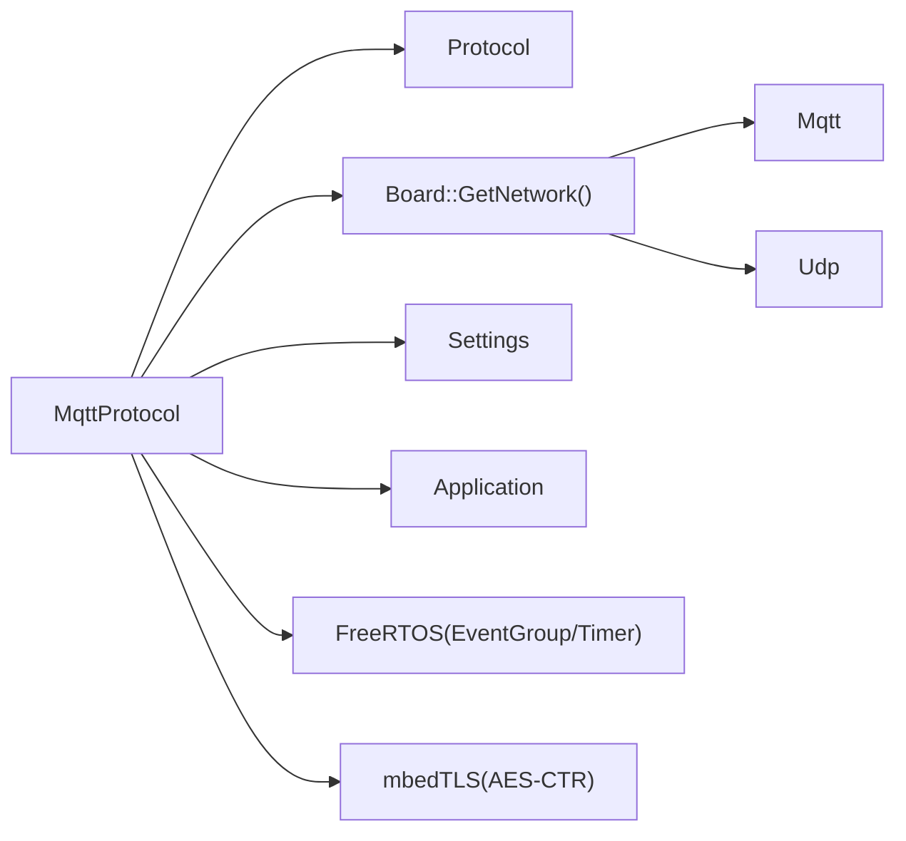

# MQTT协议API

<cite>
**本文引用的文件**
- [mqtt_protocol.h](file://main/protocols/mqtt_protocol.h)
- [mqtt_protocol.cc](file://main/protocols/mqtt_protocol.cc)
- [protocol.h](file://main/protocols/protocol.h)
- [protocol.cc](file://main/protocols/protocol.cc)
- [mqtt-udp_zh.md](file://docs/mqtt-udp_zh.md)
- [audio_debug_server.py](file://scripts/audio_debug_server.py)
</cite>

## 目录
1. [简介](#简介)
2. [项目结构](#项目结构)
3. [核心组件](#核心组件)
4. [架构总览](#架构总览)
5. [详细组件分析](#详细组件分析)
6. [依赖关系分析](#依赖关系分析)
7. [性能与优化](#性能与优化)
8. [故障排查指南](#故障排查指南)
9. [结论](#结论)
10. [附录](#附录)

## 简介
本文件面向使用“MQTT+UDP混合协议”的开发者，系统性说明设备端 MqttProtocol 类的实现架构、控制通道与数据通道的协同机制、主题订阅发布模式、QoS 与消息持久化现状、UDP 音频传输的安全与可靠性策略，以及连接配置、认证与安全通信方法。同时提供调试工具使用、消息监控与性能分析方法，帮助快速定位问题并优化端到端体验。

## 项目结构
本项目在 main/protocols 下实现了统一的协议抽象层 Protocol，并在其之上实现了基于 MQTT 的控制通道与 UDP 的数据通道组合方案。文档侧提供了协议规范说明，脚本侧提供了简易的 UDP 接收工具用于验证与调试。

图示来源
- [mqtt_protocol.h:26-62](file://main/protocols/mqtt_protocol.h#L26-L62)
- [mqtt_protocol.cc:59-152](file://main/protocols/mqtt_protocol.cc#L59-L152)
- [protocol.h:44-95](file://main/protocols/protocol.h#L44-L95)

章节来源
- [mqtt_protocol.h:1-66](file://main/protocols/mqtt_protocol.h#L1-L66)
- [mqtt_protocol.cc:1-390](file://main/protocols/mqtt_protocol.cc#L1-L390)
- [protocol.h:1-99](file://main/protocols/protocol.h#L1-L99)
- [protocol.cc:1-91](file://main/protocols/protocol.cc#L1-L91)
- [mqtt-udp_zh.md:1-393](file://docs/mqtt-udp_zh.md#L1-L393)

## 核心组件
- Protocol 抽象基类：定义统一接口（打开/关闭音频通道、发送音频、文本消息回调、连接/断开回调、超时检测等），并提供通用 JSON 控制消息封装（如 listen、abort、mcp）。
- MqttProtocol：实现基于 MQTT 的控制通道与基于 UDP 的音频通道；负责 Hello 协商、AES-CTR 加解密、序列号管理、自动重连、错误上报与超时判定。

章节来源
- [protocol.h:44-95](file://main/protocols/protocol.h#L44-L95)
- [protocol.cc:35-91](file://main/protocols/protocol.cc#L35-L91)
- [mqtt_protocol.h:26-62](file://main/protocols/mqtt_protocol.h#L26-L62)
- [mqtt_protocol.cc:59-152](file://main/protocols/mqtt_protocol.cc#L59-L152)

## 架构总览
MQTT 作为控制面，承载会话建立、能力协商、指令下发与状态同步；UDP 作为数据面，承载实时 Opus 音频流，采用 AES-CTR 加密，并通过时间戳与序列号保证时序与防重放。

图示来源
- [mqtt_protocol.cc:215-295](file://main/protocols/mqtt_protocol.cc#L215-L295)
- [mqtt_protocol.cc:297-366](file://main/protocols/mqtt_protocol.cc#L297-L366)
- [mqtt_protocol.cc:166-190](file://main/protocols/mqtt_protocol.cc#L166-L190)
- [mqtt_protocol.cc:243-287](file://main/protocols/mqtt_protocol.cc#L243-L287)

## 详细组件分析

### MqttProtocol 类设计
- 职责边界
  - 控制面：通过 MQTT 完成连接、订阅/发布、Hello 协商、会话生命周期管理。
  - 数据面：通过 UDP 收发加密音频帧，维护本地/远端序列号与时间戳。
  - 安全：使用 mbedTLS AES-CTR 对音频载荷进行加解密。
  - 可靠性：事件组等待 Hello 响应；定时器驱动断线重连；超时检测标记通道不可用。
- 关键成员
  - publish_topic_：MQTT 发布主题（从设置读取）
  - mqtt_/udp_：网络抽象对象
  - aes_ctx_/aes_nonce_：AES 上下文与随机数
  - udp_server_/udp_port_：UDP 服务端地址与端口
  - local_sequence_/remote_sequence_：双向序列号
  - event_group_handle_/reconnect_timer_：事件与定时任务
- 关键方法
  - Start()/StartMqttClient()：创建并连接 MQTT，注册连接/断开/消息回调
  - OpenAudioChannel()：发送 hello，解析服务器 hello，建立 UDP 连接
  - SendAudio()：构造 nonce，AES-CTR 加密后通过 UDP 发送
  - CloseAudioChannel()：清理 UDP，必要时发送 goodbye
  - IsAudioChannelOpened()：综合判断通道可用性

图示来源
- [protocol.h:44-95](file://main/protocols/protocol.h#L44-L95)
- [mqtt_protocol.h:26-62](file://main/protocols/mqtt_protocol.h#L26-L62)

章节来源
- [mqtt_protocol.h:26-62](file://main/protocols/mqtt_protocol.h#L26-L62)
- [mqtt_protocol.cc:59-152](file://main/protocols/mqtt_protocol.cc#L59-L152)
- [mqtt_protocol.cc:215-295](file://main/protocols/mqtt_protocol.cc#L215-L295)
- [mqtt_protocol.cc:297-366](file://main/protocols/mqtt_protocol.cc#L297-L366)
- [mqtt_protocol.cc:166-190](file://main/protocols/mqtt_protocol.cc#L166-L190)
- [mqtt_protocol.cc:243-287](file://main/protocols/mqtt_protocol.cc#L243-L287)

### MQTT 控制通道与主题模型
- 连接与心跳
  - 从 Settings 读取 endpoint、client_id、username、password、keepalive、publish_topic。
  - 默认端口为 8883（TLS），支持 host:port 形式。
  - 断线后通过定时器延迟重连，空闲态才触发。
- 主题与消息
  - 客户端仅向 publish_topic_ 发布消息；服务器回推的消息由 OnMessage 分发。
  - 特殊类型：
    - type="hello"：协商 transport、session_id、audio_params、udp 参数。
    - type="goodbye"：会话结束，避免 ping-pong 不回发 goodbye。
  - 其他业务消息透传给上层 on_incoming_json_ 处理。
- QoS 与持久化
  - 当前实现未显式设置 QoS 级别，也未启用消息持久化或离线队列。
  - 若需 QoS 或持久化，需在底层 Mqtt 抽象中扩展相应 API 并在 Publish 时传入。

章节来源
- [mqtt_protocol.cc:59-152](file://main/protocols/mqtt_protocol.cc#L59-L152)
- [mqtt_protocol.cc:100-132](file://main/protocols/mqtt_protocol.cc#L100-L132)
- [mqtt_protocol.cc:154-164](file://main/protocols/mqtt_protocol.cc#L154-L164)
- [mqtt-udp_zh.md:61-174](file://docs/mqtt-udp_zh.md#L61-L174)

### UDP 音频通道与加密
- 握手与参数协商
  - 客户端发送 hello，包含版本、transport、features、audio_params。
  - 服务器返回 hello，包含 session_id、audio_params、udp{server,port,key,nonce}。
- 数据包格式与加密
  - 明文头部字段：type、flags、payload_len、ssrc、timestamp、sequence。
  - 载荷为 Opus 编码后的字节流。
  - 使用 AES-CTR 加密，nonce 由 key 与 nonce 拼接并填充 timestamp/sequence 等信息。
- 序列号与丢包处理
  - 发送端单调递增 local_sequence_。
  - 接收端校验 sequence 连续性，拒绝过期包，记录异常但继续处理后续包。
  - 未实现应用层重传或 FEC，属于尽力而为的实时传输。
- 分片与重组
  - 当前实现按固定帧大小发送，未见应用层分片/重组逻辑。
  - 若需更大负载或跨 MTU 分片，应在应用层增加分片头与重组缓冲。

图示来源
- [mqtt_protocol.cc:166-190](file://main/protocols/mqtt_protocol.cc#L166-L190)
- [mqtt_protocol.cc:243-287](file://main/protocols/mqtt_protocol.cc#L243-L287)

章节来源
- [mqtt_protocol.cc:297-366](file://main/protocols/mqtt_protocol.cc#L297-L366)
- [mqtt_protocol.cc:243-287](file://main/protocols/mqtt_protocol.cc#L243-L287)
- [mqtt-udp_zh.md:176-224](file://docs/mqtt-udp_zh.md#L176-L224)

### 状态机与会话生命周期

图示来源
- [mqtt_protocol.cc:215-295](file://main/protocols/mqtt_protocol.cc#L215-L295)
- [mqtt_protocol.cc:185-213](file://main/protocols/mqtt_protocol.cc#L185-L213)
- [mqtt-udp_zh.md:226-256](file://docs/mqtt-udp_zh.md#L226-L256)

章节来源
- [mqtt_protocol.cc:215-295](file://main/protocols/mqtt_protocol.cc#L215-L295)
- [mqtt-udp_zh.md:226-256](file://docs/mqtt-udp_zh.md#L226-L256)

### 配置项与认证授权
- 必要配置（来自 Settings）
  - endpoint：MQTT 服务器地址（可带端口，默认8883）
  - client_id：客户端标识
  - username/password：用户名密码
  - keepalive：心跳间隔（秒）
  - publish_topic：发布主题
- 安全通信
  - MQTT：建议启用 TLS（端口 8883）
  - UDP：AES-CTR 加密，key/nonce 由服务器在 Hello 响应中下发
- 认证授权
  - 基于用户名/密码；如需更细粒度鉴权，可在服务器端实现

章节来源
- [mqtt_protocol.cc:65-83](file://main/protocols/mqtt_protocol.cc#L65-L83)
- [mqtt_protocol.cc:134-152](file://main/protocols/mqtt_protocol.cc#L134-L152)
- [mqtt-udp_zh.md:259-320](file://docs/mqtt-udp_zh.md#L259-L320)

### 调试工具与消息监控
- 日志输出
  - 模块标签 TAG="MQTT"，关键路径均有 ESP_LOGI/E/W 输出，便于串口抓取。
- 简易 UDP 接收器
  - scripts/audio_debug_server.py 监听本机 8000 端口，将收到的数据写入 WAV 文件，适合快速验证音频链路。
- 消息监控建议
  - 在 OnMessage 回调中对 JSON 做结构化打印（注意脱敏）。
  - 统计序列号跳变、解密失败次数、超时次数，辅助定位网络抖动与丢包。

章节来源
- [mqtt_protocol.cc:100-132](file://main/protocols/mqtt_protocol.cc#L100-L132)
- [audio_debug_server.py:1-55](file://scripts/audio_debug_server.py#L1-L55)

## 依赖关系分析
- 内部依赖
  - Protocol：统一接口与通用逻辑（超时、错误上报、JSON 消息封装）
  - Board::GetNetwork()：动态创建 Mqtt/Udp 实例
  - Settings：持久化配置
  - Application：调度与设备状态
  - FreeRTOS：EventGroup、Timer
  - mbedTLS：AES-CTR
- 外部依赖
  - MQTT Broker（支持 TLS）
  - UDP 媒体服务器（返回加密音频）

图示来源
- [mqtt_protocol.h:5-19](file://main/protocols/mqtt_protocol.h#L5-L19)
- [mqtt_protocol.cc:1-11](file://main/protocols/mqtt_protocol.cc#L1-L11)
- [protocol.h:1-25](file://main/protocols/protocol.h#L1-L25)

章节来源
- [mqtt_protocol.h:5-19](file://main/protocols/mqtt_protocol.h#L5-L19)
- [mqtt_protocol.cc:1-11](file://main/protocols/mqtt_protocol.cc#L1-L11)
- [protocol.h:1-25](file://main/protocols/protocol.h#L1-L25)

## 性能与优化
- 并发与锁
  - 使用互斥锁保护 UDP 发送路径，避免多线程竞争。
- 内存与对象生命周期
  - 智能指针管理网络对象；析构时停止定时器、释放资源。
- 网络与实时性
  - UDP 直传降低开销；序列号与时间戳保障时序。
  - 未实现应用层重传/FEC，适用于低延迟场景。
- 可扩展点
  - 在底层 Mqtt 抽象中增加 QoS 与持久化选项。
  - 在应用层增加 UDP 分片/重组与丢包补偿策略（如选择性重传、前向纠错）。

[本节为通用指导，不直接分析具体文件]

## 故障排查指南
- 常见问题
  - 无法连接 MQTT：检查 endpoint、端口、证书与网络连通性。
  - Hello 超时：确认服务器返回的 transport 是否为 udp，且包含 udp 字段。
  - 音频无声：确认 UDP 可达、端口正确、AES key/nonce 一致、防火墙放行。
  - 乱序/丢包：观察序列号告警日志，评估网络质量。
- 定位手段
  - 查看模块日志（TAG="MQTT"）。
  - 使用 UDP 接收器脚本保存音频文件，对比两端采样率与声道数。
  - 统计 last_incoming_time_ 变化，结合 IsTimeout 判断通道是否超时。

章节来源
- [mqtt_protocol.cc:100-132](file://main/protocols/mqtt_protocol.cc#L100-L132)
- [mqtt_protocol.cc:215-295](file://main/protocols/mqtt_protocol.cc#L215-L295)
- [protocol.cc:81-91](file://main/protocols/protocol.cc#L81-L91)
- [audio_debug_server.py:1-55](file://scripts/audio_debug_server.py#L1-L55)

## 结论
该实现以 MQTT 为控制面、UDP 为数据面，结合 AES-CTR 加密与序列号机制，在保证低延迟的同时兼顾基本安全性。当前未实现 QoS 与消息持久化，亦无应用层分片/重组与丢包恢复。对于高可靠需求，建议在底层扩展 QoS/持久化，并在应用层引入分片/重组与丢包补偿策略。

[本节为总结性内容，不直接分析具体文件]

## 附录

### API 速查（函数级）
- 启动与生命周期
  - Start()：启动 MQTT 客户端
  - OpenAudioChannel()：发起 Hello 协商并建立 UDP 通道
  - CloseAudioChannel(send_goodbye=true)：关闭通道，可选择发送 goodbye
  - IsAudioChannelOpened()：通道可用性判断
- 数据与控制
  - SendAudio(packet)：发送加密音频帧
  - SendText(text)：通过 MQTT 发布文本消息
  - 回调注册：OnIncomingJson/OnIncomingAudio/OnAudioChannelOpened/Closed/Connected/Disconnected
- 内部辅助
  - StartMqttClient(report_error=false)
  - ParseServerHello(root)
  - GetHelloMessage()
  - DecodeHexString(hex_string)

章节来源
- [mqtt_protocol.h:26-62](file://main/protocols/mqtt_protocol.h#L26-L62)
- [mqtt_protocol.cc:59-152](file://main/protocols/mqtt_protocol.cc#L59-L152)
- [mqtt_protocol.cc:166-190](file://main/protocols/mqtt_protocol.cc#L166-L190)
- [mqtt_protocol.cc:215-295](file://main/protocols/mqtt_protocol.cc#L215-L295)
- [protocol.h:58-79](file://main/protocols/protocol.h#L58-L79)