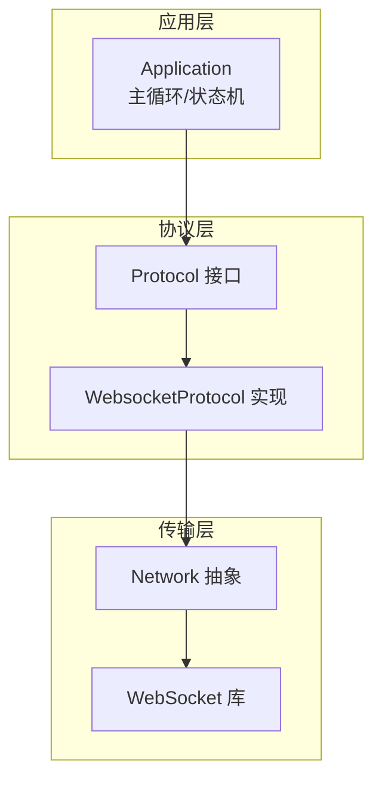
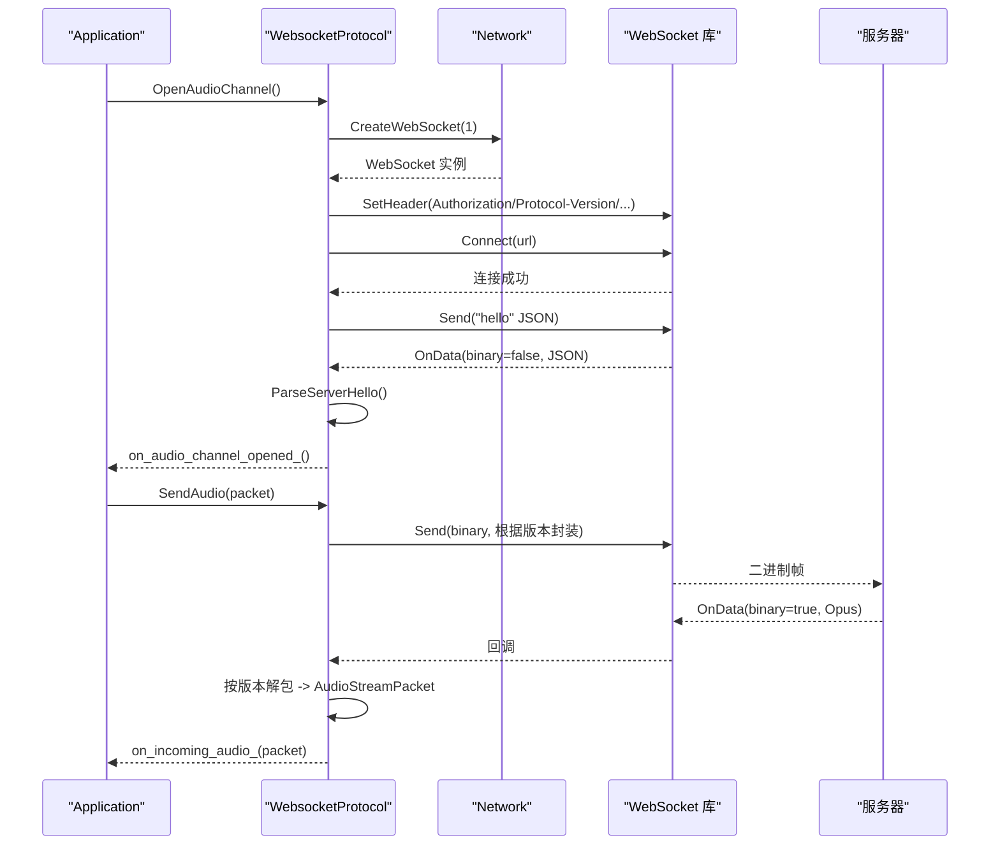
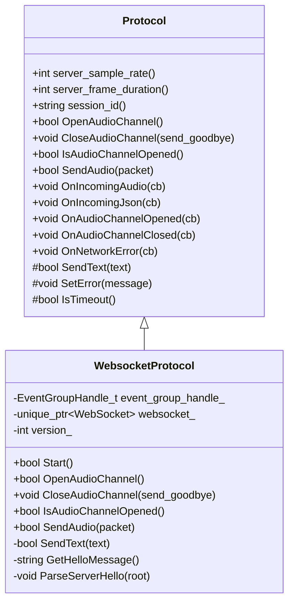
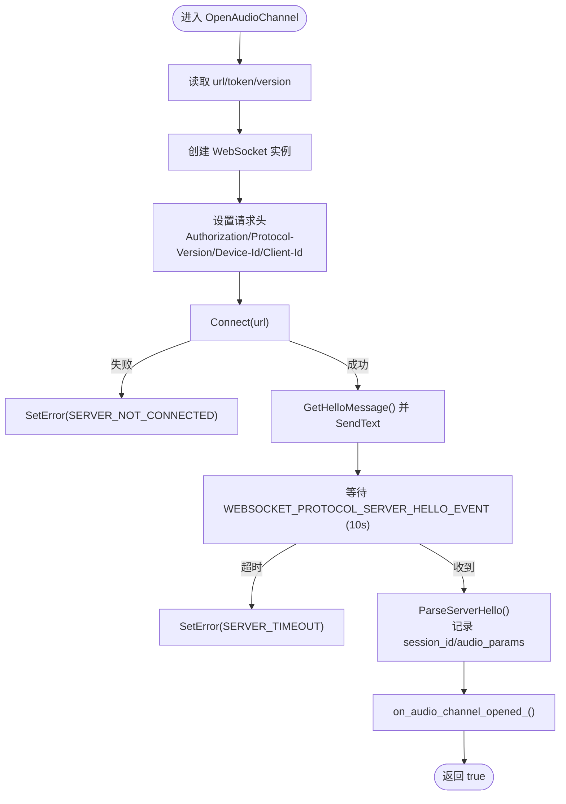
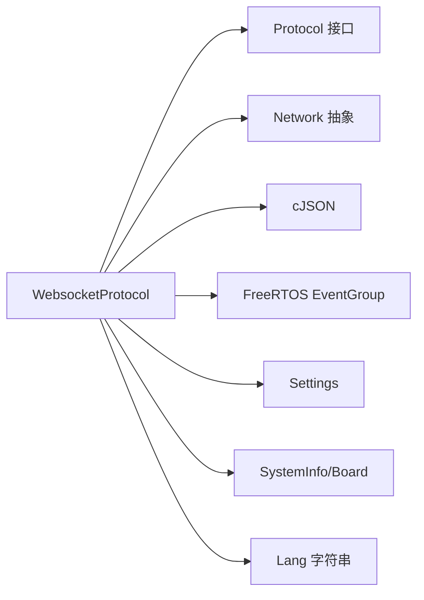
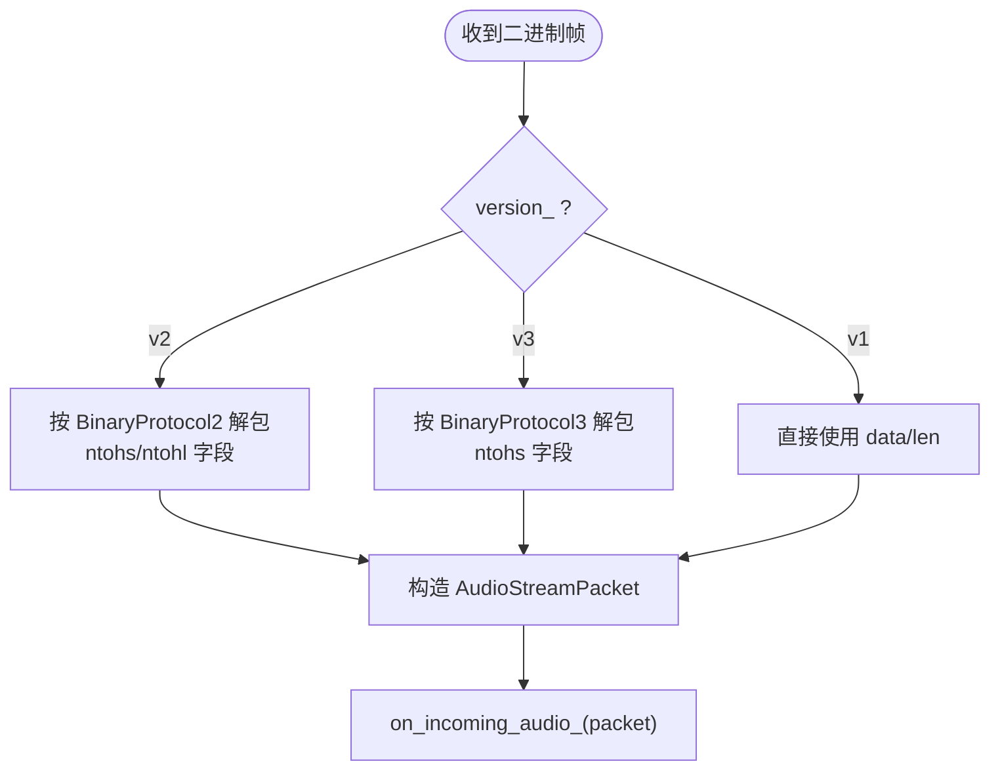

# WebSocket协议API

<cite>
**本文引用的文件**   
- [websocket_protocol.h](file://main/protocols/websocket_protocol.h)
- [websocket_protocol.cc](file://main/protocols/websocket_protocol.cc)
- [protocol.h](file://main/protocols/protocol.h)
- [application.h](file://main/application.h)
- [websocket.md](file://docs/websocket.md)
- [websocket_zh.md](file://docs/websocket_zh.md)
</cite>

## 目录
1. [简介](#简介)
2. [项目结构](#项目结构)
3. [核心组件](#核心组件)
4. [架构总览](#架构总览)
5. [详细组件分析](#详细组件分析)
6. [依赖关系分析](#依赖关系分析)
7. [性能与资源特性](#性能与资源特性)
8. [配置参数说明](#配置参数说明)
9. [连接状态管理与心跳检测](#连接状态管理与心跳检测)
10. [错误处理与重连机制](#错误处理与重连机制)
11. [二进制帧封装与解包流程](#二进制帧封装与解包流程)
12. [调试工具与常见问题排查](#调试工具与常见问题排查)
13. [结论](#结论)

## 简介
本文件面向设备端实现者，系统化梳理基于 ESP-IDF 的 WebSocket 通信协议。重点围绕 WebsocketProtocol 类的实现细节，涵盖连接建立、消息收发、错误处理与重连策略；详细说明二进制帧版本协商、类型标识与负载数据处理；并给出连接状态管理、心跳检测与网络异常恢复的实现建议与示例路径。同时提供调试方法与常见问题排查指南，帮助快速定位问题。

## 项目结构
WebSocket 相关代码位于 main/protocols 目录，遵循“协议抽象 + 具体实现”的分层设计：
- Protocol 抽象接口定义通用能力（音频通道、文本消息、回调注册等）
- WebsocketProtocol 基于底层 WebSocket 库实现具体协议
- Application 作为上层应用编排状态机与事件循环，调用协议进行会话控制

图表来源
- [websocket_protocol.h:13-32](file://main/protocols/websocket_protocol.h#L13-L32)
- [protocol.h:44-95](file://main/protocols/protocol.h#L44-L95)
- [application.h:125-176](file://main/application.h#L125-L176)

章节来源
- [websocket_protocol.h:1-35](file://main/protocols/websocket_protocol.h#L1-L35)
- [protocol.h:1-99](file://main/protocols/protocol.h#L1-L99)
- [application.h:1-194](file://main/application.h#L1-L194)

## 核心组件
- Protocol 抽象接口
  - 统一音频通道生命周期：OpenAudioChannel/CloseAudioChannel/IsAudioChannelOpened
  - 音频发送：SendAudio
  - 文本发送：SendText（虚函数，由具体协议实现）
  - 回调注册：OnIncomingAudio/OnIncomingJson/OnAudioChannelOpened/Closed/OnNetworkError/OnConnected/OnDisconnected
  - 公共成员：server_sample_rate/server_frame_duration/session_id/超时判断/错误标记
- WebsocketProtocol 实现
  - 使用 EventGroup 等待服务器 hello
  - 通过 Network->CreateWebSocket 创建连接，设置请求头（Authorization/Protocol-Version/Device-Id/Client-Id）
  - 解析 JSON 文本与二进制音频帧，按版本 v1/v2/v3 处理
  - 握手阶段：发送客户端 hello，等待服务器 hello，记录 session_id 与 audio_params
- Application 应用层
  - 维护设备状态机与事件循环，协调协议与音频服务
  - 提供 StartListening/StopListening/ToggleChatState 等入口

章节来源
- [protocol.h:10-95](file://main/protocols/protocol.h#L10-L95)
- [websocket_protocol.h:13-32](file://main/protocols/websocket_protocol.h#L13-L32)
- [websocket_protocol.cc:83-201](file://main/protocols/websocket_protocol.cc#L83-L201)
- [application.h:43-176](file://main/application.h#L43-L176)

## 架构总览
从应用到传输的整体交互如下：

图表来源
- [websocket_protocol.cc:83-201](file://main/protocols/websocket_protocol.cc#L83-L201)
- [websocket_protocol.cc:112-166](file://main/protocols/websocket_protocol.cc#L112-L166)
- [websocket_protocol.cc:28-58](file://main/protocols/websocket_protocol.cc#L28-L58)
- [protocol.h:44-95](file://main/protocols/protocol.h#L44-L95)

## 详细组件分析

### WebsocketProtocol 类
- 职责
  - 负责 WebSocket 连接的建立、握手、文本与二进制数据收发、错误上报与通道状态判定
- 关键方法
  - OpenAudioChannel：读取配置（url/token/version），创建 WebSocket，设置请求头，Connect，发送客户端 hello，等待服务器 hello，触发打开回调
  - SendAudio：按版本 v1/v2/v3 封装二进制帧并发送
  - SendText：发送文本（如 hello、业务 JSON）
  - CloseAudioChannel：释放连接
  - IsAudioChannelOpened：综合连接状态、错误标志与超时判断
- 内部状态
  - event_group_handle_：用于同步等待服务器 hello
  - websocket_：底层 WebSocket 实例
  - version_：当前二进制协议版本（默认 1）
  - 继承自 Protocol 的成员：session_id_/server_sample_rate_/server_frame_duration_/error_occurred_/last_incoming_time_

图表来源
- [protocol.h:44-95](file://main/protocols/protocol.h#L44-L95)
- [websocket_protocol.h:13-32](file://main/protocols/websocket_protocol.h#L13-L32)

章节来源
- [websocket_protocol.h:13-32](file://main/protocols/websocket_protocol.h#L13-L32)
- [websocket_protocol.cc:15-26](file://main/protocols/websocket_protocol.cc#L15-L26)
- [websocket_protocol.cc:74-81](file://main/protocols/websocket_protocol.cc#L74-L81)

### 握手与消息分发流程
- 客户端 hello
  - 构造 JSON，包含 type/version/features/transport/audio_params
  - 通过 SendText 发送
- 服务器 hello
  - 校验 transport=websocket，记录 session_id，解析 audio_params（sample_rate/frame_duration）
  - 设置事件组位，唤醒等待线程
- 后续消息
  - 文本 JSON：交由 on_incoming_json_ 回调
  - 二进制音频：按版本解包为 AudioStreamPacket，交由 on_incoming_audio_ 回调

图表来源
- [websocket_protocol.cc:83-201](file://main/protocols/websocket_protocol.cc#L83-L201)
- [websocket_protocol.cc:203-226](file://main/protocols/websocket_protocol.cc#L203-L226)
- [websocket_protocol.cc:228-254](file://main/protocols/websocket_protocol.cc#L228-L254)

章节来源
- [websocket_protocol.cc:83-201](file://main/protocols/websocket_protocol.cc#L83-L201)
- [websocket_protocol.cc:203-226](file://main/protocols/websocket_protocol.cc#L203-L226)
- [websocket_protocol.cc:228-254](file://main/protocols/websocket_protocol.cc#L228-L254)

## 依赖关系分析
- WebsocketProtocol 依赖
  - Protocol 抽象接口（音频通道、回调、文本发送、错误与超时）
  - Network 抽象（通过 Board::GetInstance().GetNetwork()->CreateWebSocket）
  - cJSON（JSON 构建与解析）
  - FreeRTOS EventGroup（同步等待服务器 hello）
- 外部集成点
  - Settings（读取 url/token/version）
  - SystemInfo/Board（获取 MAC/UUID）
  - Lang（错误信息字符串）

图表来源
- [websocket_protocol.cc:1-11](file://main/protocols/websocket_protocol.cc#L1-L11)
- [websocket_protocol.cc:83-111](file://main/protocols/websocket_protocol.cc#L83-L111)
- [websocket_protocol.cc:112-166](file://main/protocols/websocket_protocol.cc#L112-L166)

章节来源
- [websocket_protocol.cc:1-11](file://main/protocols/websocket_protocol.cc#L1-L11)
- [websocket_protocol.cc:83-111](file://main/protocols/websocket_protocol.cc#L83-L111)

## 性能与资源特性
- 内存与拷贝
  - 二进制帧在发送前会分配临时 buffer 并按版本填充头部，随后直接发送，避免多次拷贝
  - 接收侧将 payload 复制到 vector<uint8_t> 再交给上层，便于异步处理
- 时间戳与字节序
  - v2 版本包含毫秒级时间戳，便于服务端 AEC；字段采用网络字节序转换
- 超时与心跳
  - 每次收到数据都会更新 last_incoming_time_，结合 IsTimeout 可判定链路是否存活
  - 建议在应用层增加周期性心跳任务，主动发送轻量文本或 ping 帧以维持长连接

[本节为通用指导，不直接分析具体文件]

## 配置参数说明
- 存储键名（来自 Settings）
  - url：WebSocket 服务器地址（含 scheme/host/port/path）
  - token：鉴权令牌（若不含空格会自动添加 Bearer 前缀）
  - version：二进制协议版本（1/2/3），默认 1
- 请求头
  - Authorization：Bearer <token>
  - Protocol-Version：与 hello.version 一致
  - Device-Id：设备 MAC 地址
  - Client-Id：软件 UUID
- 音频参数（hello.audio_params）
  - format：opus
  - sample_rate：16000（上行），下行可能为 24000
  - channels：1
  - frame_duration：OPUS_FRAME_DURATION_MS（通常 60ms）

章节来源
- [websocket_protocol.cc:83-111](file://main/protocols/websocket_protocol.cc#L83-L111)
- [websocket_protocol.cc:203-226](file://main/protocols/websocket_protocol.cc#L203-L226)
- [websocket.md:83-92](file://docs/websocket.md#L83-L92)
- [websocket_zh.md:82-91](file://docs/websocket_zh.md#L82-L91)

## 连接状态管理与心跳检测
- 连接状态
  - IsAudioChannelOpened：当 websocket_ 非空、已连接、无错误且未超时时返回 true
  - OnDisconnected：断开时触发 on_audio_channel_closed_ 回调
- 心跳检测建议
  - 在 Application 中启动定时器，定期检查 last_incoming_time_ 与 IsTimeout
  - 若超时，主动关闭并重试连接；或在协议层扩展 Ping/Pong 文本帧
  - 参考路径：
    - 超时判定与最后接收时间：[protocol.h:86-95](file://main/protocols/protocol.h#L86-L95)
    - 连接断开回调：[websocket_protocol.cc:168-173](file://main/protocols/websocket_protocol.cc#L168-L173)
    - 应用层事件循环与状态机：[application.h:125-176](file://main/application.h#L125-L176)

章节来源
- [websocket_protocol.cc:74-76](file://main/protocols/websocket_protocol.cc#L74-L76)
- [websocket_protocol.cc:168-173](file://main/protocols/websocket_protocol.cc#L168-L173)
- [protocol.h:86-95](file://main/protocols/protocol.h#L86-L95)
- [application.h:125-176](file://main/application.h#L125-L176)

## 错误处理与重连机制
- 连接失败
  - Connect 失败：SetError(SERVER_NOT_CONNECTED)
  - 等待服务器 hello 超时：SetError(SERVER_TIMEOUT)
- 文本发送失败
  - SendText 失败：SetError(SERVER_ERROR)
- 断开处理
  - OnDisconnected 触发后，通知上层 on_audio_channel_closed_，应用层可据此执行重试逻辑
- 重连建议
  - 在 Application 的事件循环中监听网络断开/错误事件，延迟指数退避后重新调用 OpenAudioChannel
  - 保持 session_id 复用或按业务策略重建会话

章节来源
- [websocket_protocol.cc:175-194](file://main/protocols/websocket_protocol.cc#L175-L194)
- [websocket_protocol.cc:60-72](file://main/protocols/websocket_protocol.cc#L60-L72)
- [websocket_protocol.cc:168-173](file://main/protocols/websocket_protocol.cc#L168-L173)

## 二进制帧封装与解包流程
- 版本选择
  - 通过 settings.version 决定 v1/v2/v3；v1 为原始 Opus，v2/v3 带元数据
- 发送封装（SendAudio）
  - v2：BinaryProtocol2（version/type/reserved/timestamp/payload_size/payload[]），timestamp 使用 packet->timestamp
  - v3：BinaryProtocol3（type/reserved/payload_size/payload[]）
  - v1：直接发送 payload
- 接收解包（OnData binary=true）
  - v2：反序列化 BinaryProtocol2，提取 timestamp 与 payload_size，构造 AudioStreamPacket
  - v3：反序列化 BinaryProtocol3，提取 payload_size，构造 AudioStreamPacket（timestamp 置 0）
  - v1：直接使用 data/len 构造 AudioStreamPacket

图表来源
- [websocket_protocol.cc:28-58](file://main/protocols/websocket_protocol.cc#L28-L58)
- [websocket_protocol.cc:112-147](file://main/protocols/websocket_protocol.cc#L112-L147)
- [protocol.h:17-31](file://main/protocols/protocol.h#L17-L31)

章节来源
- [websocket_protocol.cc:28-58](file://main/protocols/websocket_protocol.cc#L28-L58)
- [websocket_protocol.cc:112-147](file://main/protocols/websocket_protocol.cc#L112-L147)
- [protocol.h:17-31](file://main/protocols/protocol.h#L17-L31)

## 调试工具与常见问题排查
- 抓包与日志
  - 使用 Wireshark 抓取 WebSocket 流量，过滤 ws/wss，查看握手与文本/二进制帧
  - 启用 ESP_LOGE/ESP_LOGI 输出，关注 TAG="WS" 的日志
- 常见错误
  - 无法连接：检查 url、token、防火墙/NAT、证书（wss）
  - 握手失败：确认服务器 hello 包含 transport=websocket 与正确的 audio_params
  - 文本发送失败：检查 Authorization 格式（自动补全 Bearer）、网络连通性
  - 二进制帧乱码：核对版本与字节序转换是否正确
- 断线重连
  - 观察 OnDisconnected 回调是否触发，应用层是否执行重试
  - 检查心跳与超时策略是否合理
- 参考文档
  - 协议规范与示例：[websocket.md](file://docs/websocket.md)、[websocket_zh.md](file://docs/websocket_zh.md)

章节来源
- [websocket_protocol.cc:175-194](file://main/protocols/websocket_protocol.cc#L175-L194)
- [websocket_protocol.cc:60-72](file://main/protocols/websocket_protocol.cc#L60-L72)
- [websocket.md:402-440](file://docs/websocket.md#L402-L440)
- [websocket_zh.md:369-406](file://docs/websocket_zh.md#L369-L406)

## 结论
WebsocketProtocol 在 Protocol 抽象之上实现了完整的 WebSocket 会话管理：支持多版本二进制音频帧、灵活的 JSON 文本消息、完善的握手与错误处理。通过合理的配置与心跳策略，可在不稳定网络环境下保持稳定通信。建议在上层 Application 中完善重连与心跳逻辑，并结合抓包与日志进行高效排障。