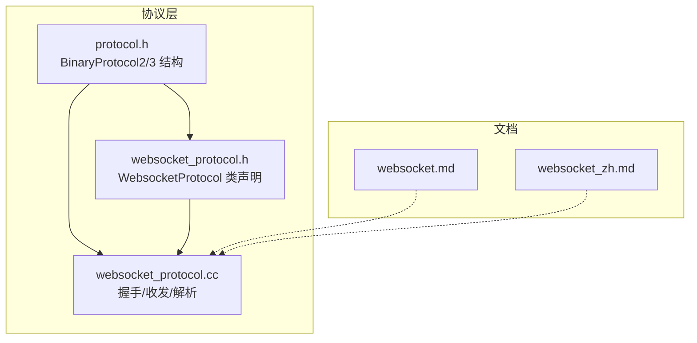
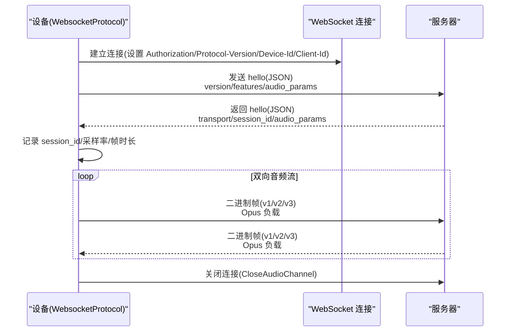
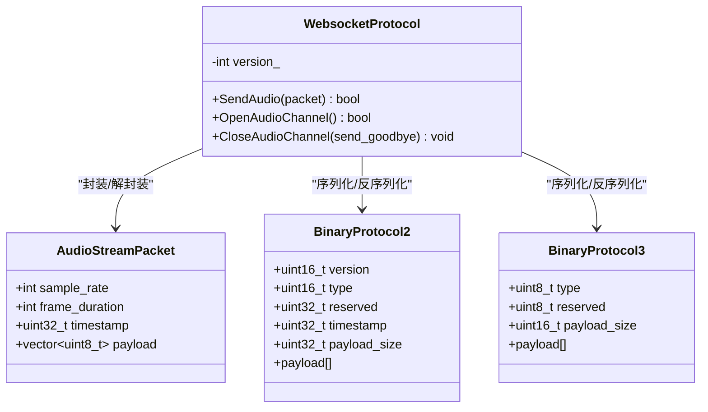
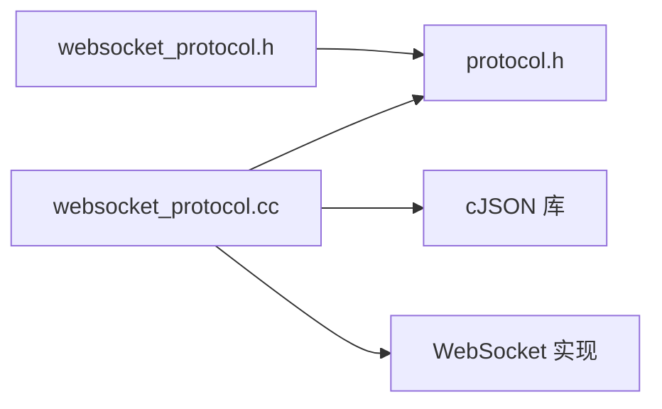

# 二进制协议规范

<cite>
**本文引用的文件**   
- [protocol.h](file://main/protocols/protocol.h)
- [websocket_protocol.h](file://main/protocols/websocket_protocol.h)
- [websocket_protocol.cc](file://main/protocols/websocket_protocol.cc)
- [websocket.md](file://docs/websocket.md)
- [websocket_zh.md](file://docs/websocket_zh.md)
</cite>

## 目录
1. [简介](#简介)
2. [项目结构](#项目结构)
3. [核心组件](#核心组件)
4. [架构总览](#架构总览)
5. [详细组件分析](#详细组件分析)
6. [依赖关系分析](#依赖关系分析)
7. [性能与流量控制](#性能与流量控制)
8. [故障排查指南](#故障排查指南)
9. [结论](#结论)
10. [附录：序列化/反序列化工具与示例](#附录序列化反序列化工具与示例)

## 简介
本规范聚焦于设备与服务器之间基于 WebSocket 的二进制音频帧格式，重点说明 BinaryProtocol2 与 BinaryProtocol3 的字节布局、字段含义、版本兼容性与升级迁移策略。同时覆盖 JSON 控制消息（如 hello、listen、tts、stt、mcp 等）的语义与交互流程，并给出时间戳同步机制、序列号管理思路与流量控制建议。文档面向实现者与维护者，既提供高层概览，也包含代码级细节与图示。

## 项目结构
与二进制协议相关的核心代码位于 protocols 目录，文档定义位于 docs 目录。关键文件如下：
- 协议结构与接口定义：main/protocols/protocol.h
- WebSocket 协议实现：main/protocols/websocket_protocol.{h,cc}
- 协议文档（中英文）：docs/websocket.md、docs/websocket_zh.md

**图表来源**
- [protocol.h:17-31](file://main/protocols/protocol.h#L17-L31)
- [websocket_protocol.h:13-32](file://main/protocols/websocket_protocol.h#L13-L32)
- [websocket_protocol.cc:28-58](file://main/protocols/websocket_protocol.cc#L28-L58)
- [websocket.md:96-126](file://docs/websocket.md#L96-L126)
- [websocket_zh.md:102-124](file://docs/websocket_zh.md#L102-L124)

**章节来源**
- [protocol.h:17-31](file://main/protocols/protocol.h#L17-L31)
- [websocket_protocol.h:13-32](file://main/protocols/websocket_protocol.h#L13-L32)
- [websocket_protocol.cc:28-58](file://main/protocols/websocket_protocol.cc#L28-L58)
- [websocket.md:96-126](file://docs/websocket.md#L96-L126)
- [websocket_zh.md:102-124](file://docs/websocket_zh.md#L102-L124)

## 核心组件
- AudioStreamPacket：封装单帧音频数据，包含采样率、帧时长、时间戳与负载。
- BinaryProtocol2：带版本、类型、保留位、毫秒时间戳与负载长度的二进制帧头。
- BinaryProtocol3：轻量版帧头，仅含类型、保留位与负载长度。
- WebsocketProtocol：实现握手、文本 JSON 分发、二进制音频帧发送/接收与版本适配。

要点：
- 版本选择通过配置项 version 决定使用 v1（裸 Opus）、v2（带时间戳元数据）或 v3（轻量头）。
- 二进制帧在网络传输中按网络字节序编码；JSON 控制消息以 UTF-8 文本传输。
- 服务端 hello 可回传 audio_params（sample_rate、frame_duration），设备据此调整解码与播放参数。

**章节来源**
- [protocol.h:10-31](file://main/protocols/protocol.h#L10-L31)
- [websocket_protocol.cc:28-58](file://main/protocols/websocket_protocol.cc#L28-L58)
- [websocket_protocol.cc:112-146](file://main/protocols/websocket_protocol.cc#L112-L146)
- [websocket_protocol.cc:228-254](file://main/protocols/websocket_protocol.cc#L228-L254)

## 架构总览
WebSocket 通道承载两类数据：
- 文本 JSON：用于握手、状态机控制、MCP 指令等。
- 二进制音频：Opus 编码帧，按版本选择不同帧头或直接透传。

**图表来源**
- [websocket_protocol.cc:83-101](file://main/protocols/websocket_protocol.cc#L83-L101)
- [websocket_protocol.cc:182-201](file://main/protocols/websocket_protocol.cc#L182-L201)
- [websocket_protocol.cc:203-226](file://main/protocols/websocket_protocol.cc#L203-L226)
- [websocket_protocol.cc:228-254](file://main/protocols/websocket_protocol.cc#L228-L254)

## 详细组件分析

### 二进制帧格式与字节布局
- BinaryProtocol2（网络字节序）
  - version: uint16_t，协议版本
  - type: uint16_t，消息类型（当前音频为 0）
  - reserved: uint32_t，保留
  - timestamp: uint32_t，毫秒时间戳（用于服务端 AEC）
  - payload_size: uint32_t，负载长度（字节）
  - payload[]: 变长负载（Opus 帧）
- BinaryProtocol3（网络字节序）
  - type: uint8_t，消息类型
  - reserved: uint8_t，保留
  - payload_size: uint16_t，负载长度（字节）
  - payload[]: 变长负载（Opus 帧）

注意：
- 发送时，version_ 写入 v2 的 version 字段；type 固定为 0（音频）。
- v3 不携带时间戳，timestamp 在内部统一置 0。
- 所有多字节整数均按网络字节序转换。

**图表来源**
- [protocol.h:10-31](file://main/protocols/protocol.h#L10-L31)
- [websocket_protocol.h:13-32](file://main/protocols/websocket_protocol.h#L13-L32)
- [websocket_protocol.cc:28-58](file://main/protocols/websocket_protocol.cc#L28-L58)
- [websocket_protocol.cc:112-146](file://main/protocols/websocket_protocol.cc#L112-L146)

**章节来源**
- [protocol.h:17-31](file://main/protocols/protocol.h#L17-L31)
- [websocket_protocol.cc:28-58](file://main/protocols/websocket_protocol.cc#L28-L58)
- [websocket_protocol.cc:112-146](file://main/protocols/websocket_protocol.cc#L112-L146)
- [websocket.md:103-125](file://docs/websocket.md#L103-L125)
- [websocket_zh.md:102-124](file://docs/websocket_zh.md#L102-L124)

### JSON 控制消息类型与语义
- 设备→服务器
  - hello：能力协商与音频参数声明（version、features、transport、audio_params）。
  - listen：开始/停止监听，state 可为 start/stop/detect，mode 可为 auto/manual/realtime。
  - abort：中断 TTS 或会话，reason 可为 wake_word_detected 等。
  - mcp：物联网控制，payload 遵循 JSON-RPC 2.0。
- 服务器→设备
  - hello：确认 transport=websocket，可选下发 session_id 与 audio_params。
  - stt：语音识别结果。
  - tts：TTS 生命周期（start/stop/sentence_start）。
  - llm：表情/情绪更新。
  - system：系统命令（如 reboot）。
  - alert/custom：提示或自定义消息。

握手时序与参数对齐：
- 设备发送 hello 后等待服务器 hello，超时则报错。
- 服务器 hello 中的 audio_params 会覆盖本地默认采样率与帧时长。

**章节来源**
- [websocket_protocol.cc:203-226](file://main/protocols/websocket_protocol.cc#L203-L226)
- [websocket_protocol.cc:228-254](file://main/protocols/websocket_protocol.cc#L228-L254)
- [websocket.md:129-307](file://docs/websocket.md#L129-L307)
- [websocket_zh.md:128-292](file://docs/websocket_zh.md#L128-L292)

### 时间戳同步机制
- v2 帧携带 timestamp（毫秒），用于服务端 AEC 等需要时间对齐的场景。
- 设备侧在 v2 路径下将 packet->timestamp 原样写入帧头；v3 路径下 timestamp 置 0。
- 建议在设备端采用稳定时钟源生成单调递增的时间戳，并在握手阶段与服务端对齐参考时间（例如以首个帧时间为基准）。

**章节来源**
- [protocol.h:17-24](file://main/protocols/protocol.h#L17-L24)
- [websocket_protocol.cc:33-44](file://main/protocols/websocket_protocol.cc#L33-L44)
- [websocket_protocol.cc:115-127](file://main/protocols/websocket_protocol.cc#L115-L127)

### 序列号管理与丢包处理
- WebSocket 本身具备可靠传输，无需应用层序列号。
- 若需跨链路（如 UDP/MQTT+UDP）进行防重放与乱序检测，可参考 MQTT+UDP 文档中的序列号与时间戳设计思路（单调递增、期望值校验、容错告警）。

**章节来源**
- [websocket_protocol.cc:28-58](file://main/protocols/websocket_protocol.cc#L28-L58)

### 流量控制策略
- 应用层建议：
  - 基于滑动窗口或令牌桶限制上行速率，避免拥塞。
  - 下行 TTS 播放缓冲与自适应码率切换，结合 server_sample_rate 与 frame_duration 动态调节。
  - 当处于 listening 状态时忽略下行音频，避免冲突。
- 错误恢复：
  - 握手失败或超时触发网络错误回调。
  - 断线后自动重试或回到空闲态。

**章节来源**
- [websocket_protocol.cc:112-146](file://main/protocols/websocket_protocol.cc#L112-L146)
- [websocket_protocol.cc:168-173](file://main/protocols/websocket_protocol.cc#L168-L173)
- [websocket.md:402-440](file://docs/websocket.md#L402-L440)

## 依赖关系分析
- WebsocketProtocol 依赖 Protocol 抽象接口与底层 WebSocket 实现。
- 二进制帧序列化/反序列化直接操作 protocol.h 中定义的 struct。
- JSON 解析使用 cJSON，hello 解析后更新 session_id、server_sample_rate、server_frame_duration。

**图表来源**
- [websocket_protocol.cc:1-11](file://main/protocols/websocket_protocol.cc#L1-L11)
- [websocket_protocol.h:1-10](file://main/protocols/websocket_protocol.h#L1-L10)
- [protocol.h:1-9](file://main/protocols/protocol.h#L1-L9)

**章节来源**
- [websocket_protocol.cc:1-11](file://main/protocols/websocket_protocol.cc#L1-L11)
- [websocket_protocol.h:1-10](file://main/protocols/websocket_protocol.h#L1-L10)
- [protocol.h:1-9](file://main/protocols/protocol.h#L1-L9)

## 性能与流量控制
- 帧大小与延迟：frame_duration 通常为 60ms，可根据带宽与 CPU 能力调整。
- 采样率：上行 16kHz，下行可能为 24kHz，设备需在解码后进行重采样。
- 内存与拷贝：序列化时一次性分配帧头+负载，减少多次拷贝开销。
- 网络拥塞：结合应用层限速与缓冲策略，避免突发导致抖动。

[本节为通用指导，不直接分析具体文件]

## 故障排查指南
- 握手失败：检查 URL、Authorization、Protocol-Version 与 hello 匹配逻辑。
- 未收到服务器 hello：确认超时时间与网络连通性。
- 音频无声：核对 server_sample_rate 与 frame_duration 是否被正确更新。
- 乱序/丢包：WebSocket 可靠，若出现异常优先检查上层业务逻辑与缓冲区。
- 日志定位：关注“Missing message type”、“Failed to connect”、“Server timeout”等关键日志。

**章节来源**
- [websocket_protocol.cc:175-194](file://main/protocols/websocket_protocol.cc#L175-L194)
- [websocket_protocol.cc:160-166](file://main/protocols/websocket_protocol.cc#L160-L166)
- [websocket.md:402-440](file://docs/websocket.md#L402-L440)

## 结论
本协议在 WebSocket 之上以 JSON 控制面与二进制音频面协同工作，支持三种二进制帧版本以适应不同场景（裸 Opus、带时间戳元数据、轻量头）。通过 hello 协商与 session_id 管理，可实现稳定的会话控制与扩展能力（如 MCP）。建议在生产环境完善握手校验、时间戳对齐、流量控制与错误恢复策略，确保端到端体验。

[本节为总结，不直接分析具体文件]

## 附录：序列化/反序列化工具与示例
以下工具函数与示例可直接用于实现 v2/v3 帧的编解码。为避免泄露实现细节，此处仅提供函数签名与调用路径指引，完整实现请参考对应源码位置。

- 发送端（设备→服务器）
  - 构造 v2 帧
    - 参考路径：[websocket_protocol.cc:33-44](file://main/protocols/websocket_protocol.cc#L33-L44)
    - 输入：AudioStreamPacket（含 timestamp、payload）
    - 输出：已序列化的字符串（含 BinaryProtocol2 头）
  - 构造 v3 帧
    - 参考路径：[websocket_protocol.cc:45-54](file://main/protocols/websocket_protocol.cc#L45-L54)
    - 输入：AudioStreamPacket（不含 timestamp）
    - 输出：已序列化的字符串（含 BinaryProtocol3 头）
  - 发送
    - 参考路径：[websocket_protocol.cc:28-58](file://main/protocols/websocket_protocol.cc#L28-L58)

- 接收端（服务器→设备）
  - 解析 v2 帧
    - 参考路径：[websocket_protocol.cc:115-127](file://main/protocols/websocket_protocol.cc#L115-L127)
    - 步骤：读取 version/type/timestamp/payload_size → 拷贝 payload → 构造 AudioStreamPacket
  - 解析 v3 帧
    - 参考路径：[websocket_protocol.cc:128-138](file://main/protocols/websocket_protocol.cc#L128-L138)
    - 步骤：读取 type/payload_size → 拷贝 payload → 构造 AudioStreamPacket（timestamp 置 0）
  - 转发到上层
    - 参考路径：[websocket_protocol.cc:112-146](file://main/protocols/websocket_protocol.cc#L112-L146)

- 握手与参数协商
  - 构建客户端 hello
    - 参考路径：[websocket_protocol.cc:203-226](file://main/protocols/websocket_protocol.cc#L203-L226)
  - 解析服务端 hello
    - 参考路径：[websocket_protocol.cc:228-254](file://main/protocols/websocket_protocol.cc#L228-L254)

- 版本兼容性建议
  - 向后兼容：新设备应能降级至旧版本（v1/v2），旧设备不应解析未知字段。
  - 向前兼容：新增字段应标记为可选，未知字段需忽略。
  - 升级迁移：
    - 从 v2 迁移到 v3：移除时间戳字段，简化头部，降低开销。
    - 从 v1 迁移到 v2/v3：引入帧头与类型标识，便于未来扩展。
    - 协商策略：在 hello 中声明支持的 binary_version 列表，服务端择优回复。

**章节来源**
- [websocket_protocol.cc:28-58](file://main/protocols/websocket_protocol.cc#L28-L58)
- [websocket_protocol.cc:112-146](file://main/protocols/websocket_protocol.cc#L112-L146)
- [websocket_protocol.cc:203-226](file://main/protocols/websocket_protocol.cc#L203-L226)
- [websocket_protocol.cc:228-254](file://main/protocols/websocket_protocol.cc#L228-L254)
- [websocket.md:96-126](file://docs/websocket.md#L96-L126)
- [websocket_zh.md:102-124](file://docs/websocket_zh.md#L102-L124)