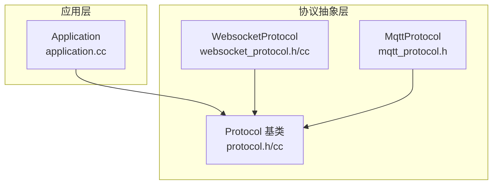
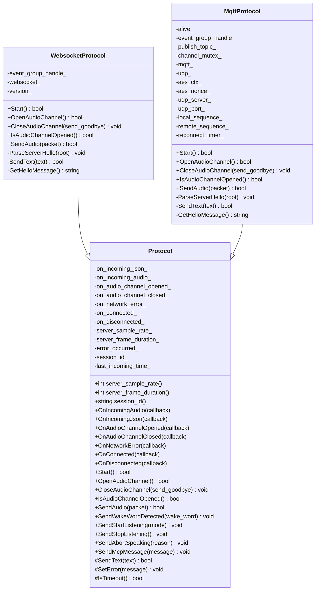
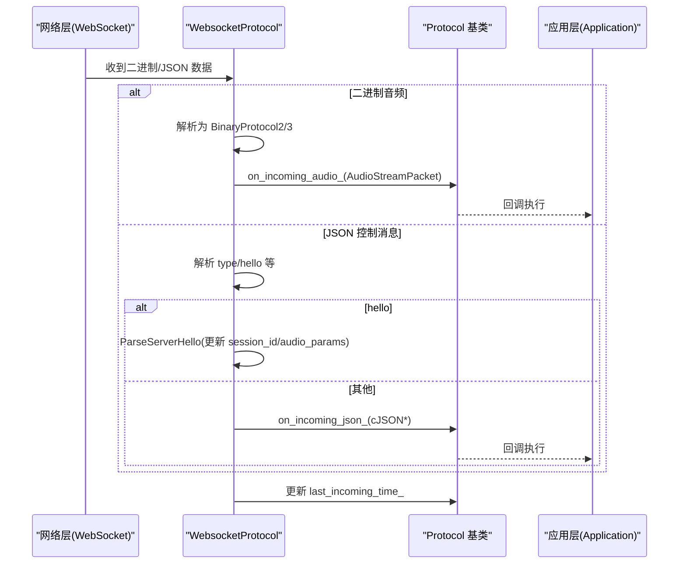
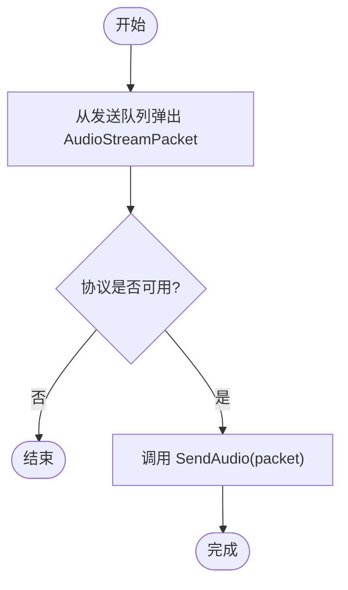
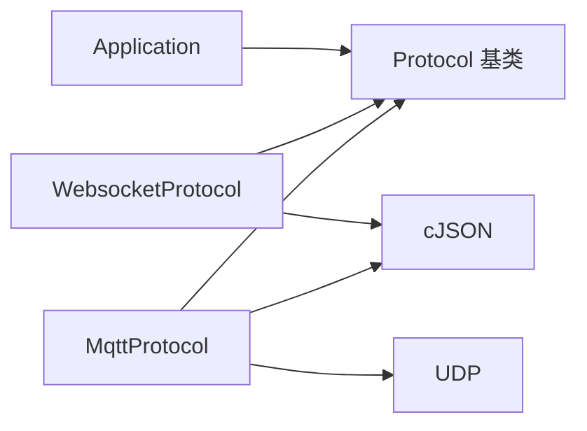

# 协议抽象层

<cite>
**本文引用的文件**   
- [protocol.h](file://main/protocols/protocol.h)
- [protocol.cc](file://main/protocols/protocol.cc)
- [websocket_protocol.h](file://main/protocols/websocket_protocol.h)
- [websocket_protocol.cc](file://main/protocols/websocket_protocol.cc)
- [mqtt_protocol.h](file://main/protocols/mqtt_protocol.h)
- [application.cc](file://main/application.cc)
</cite>

## 目录
1. [简介](#简介)
2. [项目结构](#项目结构)
3. [核心组件](#核心组件)
4. [架构总览](#架构总览)
5. [详细组件分析](#详细组件分析)
6. [依赖关系分析](#依赖关系分析)
7. [性能与扩展性考虑](#性能与扩展性考虑)
8. [故障排查指南](#故障排查指南)
9. [结论](#结论)
10. [附录：协议扩展开发指南](#附录协议扩展开发指南)

## 简介
本文件围绕“协议抽象层”展开，聚焦 Protocol 基类的设计模式、虚函数接口与回调机制，系统说明音频流处理、JSON 消息处理、网络连接管理等核心能力。文档同时给出 AudioStreamPacket 结构体、BinaryProtocol2 与 BinaryProtocol3 帧格式定义，解释监听模式枚举与中断原因枚举的使用场景，并提供基于 Protocol 的自定义协议扩展指南。

## 项目结构
协议抽象层位于 main/protocols 目录，包含：
- 抽象基类与通用实现：protocol.h / protocol.cc
- WebSocket 具体实现：websocket_protocol.h / websocket_protocol.cc
- MQTT 具体实现（头文件）：mqtt_protocol.h
- 应用层集成示例：application.cc（事件循环中调用协议发送音频等）

图表来源
- [protocol.h:44-95](file://main/protocols/protocol.h#L44-L95)
- [websocket_protocol.h:13-32](file://main/protocols/websocket_protocol.h#L13-L32)
- [mqtt_protocol.h:26-62](file://main/protocols/mqtt_protocol.h#L26-L62)
- [application.cc:220-226](file://main/application.cc#L220-L226)

章节来源
- [protocol.h:1-99](file://main/protocols/protocol.h#L1-L99)
- [protocol.cc:1-91](file://main/protocols/protocol.cc#L1-L91)
- [websocket_protocol.h:1-35](file://main/protocols/websocket_protocol.h#L1-L35)
- [websocket_protocol.cc:115-168](file://main/protocols/websocket_protocol.cc#L115-L168)
- [mqtt_protocol.h:1-66](file://main/protocols/mqtt_protocol.h#L1-L66)
- [application.cc:220-226](file://main/application.cc#L220-L226)

## 核心组件
- Protocol 抽象类：定义统一的音视频通道生命周期管理、文本/二进制数据发送、超时检测与错误上报、以及回调注册接口。
- AudioStreamPacket：封装音频帧元数据与载荷，供上层统一消费。
- BinaryProtocol2/BinaryProtocol3：二进制音频帧的两种头部格式，用于高效传输 OPUS 等编码数据。
- WebsocketProtocol/MqttProtocol：基于不同传输层的协议实现，负责握手、编解码、重连与心跳等细节。

章节来源
- [protocol.h:10-31](file://main/protocols/protocol.h#L10-L31)
- [protocol.h:44-95](file://main/protocols/protocol.h#L44-L95)
- [websocket_protocol.h:13-32](file://main/protocols/websocket_protocol.h#L13-L32)
- [mqtt_protocol.h:26-62](file://main/protocols/mqtt_protocol.h#L26-L62)

## 架构总览
Protocol 采用“模板方法 + 回调”的组合模式：
- 模板方法：公共流程在基类中实现（如构造 JSON 控制消息、超时判断），具体传输细节由子类实现（SendText/SendAudio）。
- 回调：通过 OnIncoming* 系列接口将网络侧事件异步回传给上层。

图表来源
- [protocol.h:44-95](file://main/protocols/protocol.h#L44-L95)
- [websocket_protocol.h:13-32](file://main/protocols/websocket_protocol.h#L13-L32)
- [mqtt_protocol.h:26-62](file://main/protocols/mqtt_protocol.h#L26-L62)

## 详细组件分析

### Protocol 抽象类 API 与设计要点
- 设计模式
  - 模板方法：公共逻辑（如构建 listen/abort/mcp 控制消息、超时检测）集中在基类；具体传输由 SendText/SendAudio 等纯虚函数交由子类实现。
  - 回调驱动：通过 OnIncoming* 系列接口将网络事件以 std::function 形式注入，解耦底层 I/O 与上层业务。
- 关键虚函数接口
  - 生命周期：Start/OpenAudioChannel/CloseAudioChannel/IsAudioChannelOpened
  - 数据面：SendAudio（二进制音频）、SendText（受保护，由子类实现）
  - 控制面：SendWakeWordDetected/SendStartListening/SendStopListening/SendAbortSpeaking/SendMcpMessage
  - 状态与错误：OnConnected/OnDisconnected/OnAudioChannelOpened/OnAudioChannelClosed/OnNetworkError
- 音频参数与会话
  - server_sample_rate_/server_frame_duration_：由服务器 hello 协商后写入，作为默认值下发给音频编码器/播放器。
  - session_id_：会话标识，随控制消息下发至服务端。
- 超时与错误
  - last_incoming_time_ 记录最近一次入站时间，IsTimeout 用于判定长连接空闲超时。
  - SetError 设置错误标志并触发 on_network_error_ 回调。

章节来源
- [protocol.h:44-95](file://main/protocols/protocol.h#L44-L95)
- [protocol.cc:35-91](file://main/protocols/protocol.cc#L35-L91)

### 数据结构定义

#### AudioStreamPacket
- 字段
  - sample_rate：采样率（由服务器协商或默认值提供）
  - frame_duration：帧时长（毫秒）
  - timestamp：时间戳（部分协议版本携带）
  - payload：音频载荷（OPUS 等编码字节）
- 用途
  - 作为音频通道的统一数据单元，被上层音频服务与播放管线消费。

章节来源
- [protocol.h:10-15](file://main/protocols/protocol.h#L10-L15)

#### BinaryProtocol2 帧格式
- 字段
  - version：协议版本号
  - type：消息类型（例如 0 表示音频，1 表示 JSON）
  - reserved：保留位
  - timestamp：毫秒级时间戳（用于服务端 AEC 对齐）
  - payload_size：载荷长度（字节）
  - payload[]：变长载荷
- 特性
  - 紧凑打包（packed），便于在网络层直接映射到内存块进行解析。

章节来源
- [protocol.h:17-24](file://main/protocols/protocol.h#L17-L24)

#### BinaryProtocol3 帧格式
- 字段
  - type：消息类型
  - reserved：保留位
  - payload_size：载荷长度（字节）
  - payload[]：变长载荷
- 特性
  - 更精简的头部，适合高吞吐场景。

章节来源
- [protocol.h:26-31](file://main/protocols/protocol.h#L26-L31)

### 枚举与使用场景

#### ListeningMode（监听模式）
- kListeningModeAutoStop：自动停止（语音活动检测 VAD 结束后自动结束）
- kListeningModeManualStop：手动停止（用户主动停止）
- kListeningModeRealtime：实时模式（需要 AEC 支持，低延迟双向通话）
- 使用位置
  - 设备进入对话时，根据策略选择模式并通过 SendStartListening 通知服务端。

章节来源
- [protocol.h:38-42](file://main/protocols/protocol.h#L38-L42)
- [protocol.cc:57-69](file://main/protocols/protocol.cc#L57-L69)
- [application.cc:695-711](file://main/application.cc#L695-L711)

#### AbortReason（中断原因）
- kAbortReasonNone：无特殊原因
- kAbortReasonWakeWordDetected：唤醒词检测到，需打断当前说话
- 使用位置
  - 当唤醒词命中时，调用 SendAbortSpeaking 告知服务端中止当前 TTS 输出。

章节来源
- [protocol.h:33-36](file://main/protocols/protocol.h#L33-L36)
- [protocol.cc:42-49](file://main/protocols/protocol.cc#L42-L49)

### 回调机制与事件处理

#### 回调注册
- OnIncomingAudio：注册音频帧回调，接收 AudioStreamPacket
- OnIncomingJson：注册 JSON 控制消息回调，接收 cJSON 根节点
- OnAudioChannelOpened/OnAudioChannelClosed：音频通道打开/关闭回调
- OnConnected/OnDisconnected：连接建立/断开回调
- OnNetworkError：网络错误回调

章节来源
- [protocol.h:58-64](file://main/protocols/protocol.h#L58-L64)
- [protocol.cc:7-33](file://main/protocols/protocol.cc#L7-L33)

#### 事件分发流程（WebSocket 为例）

图表来源
- [websocket_protocol.cc:115-168](file://main/protocols/websocket_protocol.cc#L115-L168)
- [websocket_protocol.cc:150-168](file://main/protocols/websocket_protocol.cc#L150-L168)
- [websocket_protocol.cc:228-254](file://main/protocols/websocket_protocol.cc#L228-L254)

章节来源
- [websocket_protocol.cc:115-168](file://main/protocols/websocket_protocol.cc#L115-L168)
- [websocket_protocol.cc:150-168](file://main/protocols/websocket_protocol.cc#L150-L168)
- [websocket_protocol.cc:228-254](file://main/protocols/websocket_protocol.cc#L228-L254)

### 音频流处理路径
- 上行（设备→服务端）
  - 应用层从音频队列取出 AudioStreamPacket，调用 protocol_->SendAudio 发送。
- 下行（服务端→设备）
  - 网络层收到二进制帧，按版本解析为 AudioStreamPacket，通过 on_incoming_audio_ 回调交给上层。

图表来源
- [application.cc:220-226](file://main/application.cc#L220-L226)
- [protocol.h:70](file://main/protocols/protocol.h#L70)

章节来源
- [application.cc:220-226](file://main/application.cc#L220-L226)
- [protocol.h:70](file://main/protocols/protocol.h#L70)

### 控制消息与握手
- 客户端 Hello
  - 描述传输方式、支持的特性（如 AEC、MCP）、音频参数（格式、采样率、声道、帧时长）。
- 服务端 Hello
  - 返回 session_id、audio_params（sample_rate、frame_duration）等，客户端据此更新内部参数。
- 控制命令
  - listen start/stop、abort、mcp 等，均由基类组装 JSON 并通过 SendText 发送。

章节来源
- [websocket_protocol.cc:203-226](file://main/protocols/websocket_protocol.cc#L203-L226)
- [websocket_protocol.cc:228-254](file://main/protocols/websocket_protocol.cc#L228-L254)
- [protocol.cc:51-79](file://main/protocols/protocol.cc#L51-L79)

## 依赖关系分析
- 耦合与内聚
  - Protocol 仅暴露稳定接口，内部通过 protected 虚函数与回调降低耦合。
  - WebsocketProtocol/MqttProtocol 各自封装传输细节，内聚性强。
- 外部依赖
  - cJSON：JSON 解析与生成
  - FreeRTOS EventGroup：同步等待握手结果
  - 网络库：WebSocket/MQTT/UDP（MQTT 实现中使用 UDP 承载音频）
- 潜在循环依赖
  - 通过回调与事件组避免直接循环引用，保持层次清晰。

图表来源
- [websocket_protocol.h:1-35](file://main/protocols/websocket_protocol.h#L1-L35)
- [mqtt_protocol.h:1-66](file://main/protocols/mqtt_protocol.h#L1-L66)
- [application.cc:220-226](file://main/application.cc#L220-L226)

章节来源
- [websocket_protocol.h:1-35](file://main/protocols/websocket_protocol.h#L1-L35)
- [mqtt_protocol.h:1-66](file://main/protocols/mqtt_protocol.h#L1-L66)
- [application.cc:220-226](file://main/application.cc#L220-L226)

## 性能与扩展性考虑
- 零拷贝与内存复用
  - 二进制帧直接映射到结构体指针解析，减少拷贝开销。
- 超时与保活
  - IsTimeout 基于 steady_clock 计算空闲时长，可结合心跳/保活策略提升稳定性。
- 可扩展性
  - 新增协议只需继承 Protocol，实现 SendText/SendAudio 等虚函数，并在合适时机触发回调即可。

[本节为通用指导，不直接分析具体文件]

## 故障排查指南
- 常见问题定位
  - 握手失败：检查 GetHelloMessage 与 ParseServerHello 的参数匹配（transport、audio_params）。
  - 超时断开：关注 IsTimeout 日志与 last_incoming_time_ 更新点。
  - 网络错误：查看 SetError 触发的 on_network_error_ 回调信息。
- 建议步骤
  - 打印握手报文与解析结果
  - 校验网络层 OnDisconnected 回调链路
  - 确认 Listen/Abort/MCP 控制消息是否成功发出

章节来源
- [websocket_protocol.cc:175-201](file://main/protocols/websocket_protocol.cc#L175-L201)
- [websocket_protocol.cc:228-254](file://main/protocols/websocket_protocol.cc#L228-L254)
- [protocol.cc:35-40](file://main/protocols/protocol.cc#L35-L40)
- [protocol.cc:81-91](file://main/protocols/protocol.cc#L81-L91)

## 结论
Protocol 抽象层通过清晰的虚函数接口与回调机制，将音频流与控制消息的处理解耦于具体传输层，既保证了多协议实现的统一性，又具备良好的扩展性与可维护性。配合 BinaryProtocol2/3 的高效帧格式与完善的超时/错误处理，能够满足低功耗设备对低延迟、高可靠的通信需求。

[本节为总结性内容，不直接分析具体文件]

## 附录：协议扩展开发指南

### 继承 Protocol 的步骤
- 新建类继承自 Protocol，实现以下虚函数：
  - Start/OpenAudioChannel/CloseAudioChannel/IsAudioChannelOpened
  - SendAudio（二进制音频发送）
  - SendText（文本/JSON 控制消息发送，protected 虚函数）
- 在合适的时机触发回调：
  - 收到二进制音频帧：构造 AudioStreamPacket 并调用 on_incoming_audio_
  - 收到 JSON 控制消息：解析后调用 on_incoming_json_
  - 连接/断开/通道打开/关闭/错误：分别调用对应回调
- 可选：实现握手流程（如 hello 交换），更新 session_id_ 与 audio_params。

章节来源
- [protocol.h:66-75](file://main/protocols/protocol.h#L66-L75)
- [protocol.h:77-95](file://main/protocols/protocol.h#L77-L95)
- [websocket_protocol.cc:115-168](file://main/protocols/websocket_protocol.cc#L115-L168)
- [websocket_protocol.cc:203-254](file://main/protocols/websocket_protocol.cc#L203-L254)

### 最佳实践
- 线程安全：回调可能在网络线程触发，注意与主线程交互时使用事件组或任务调度。
- 资源清理：析构前确保释放网络句柄、定时器与事件组。
- 错误恢复：实现重试与退避策略，避免雪崩式重连。
- 日志与诊断：在关键路径添加必要日志，便于问题定位。

[本节为通用指导，不直接分析具体文件]