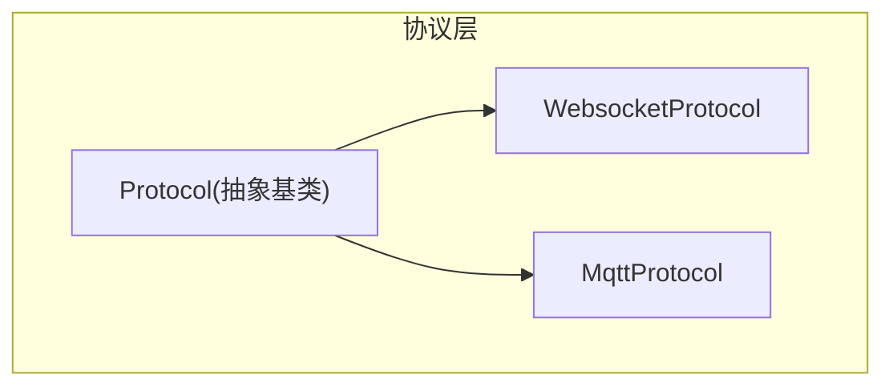
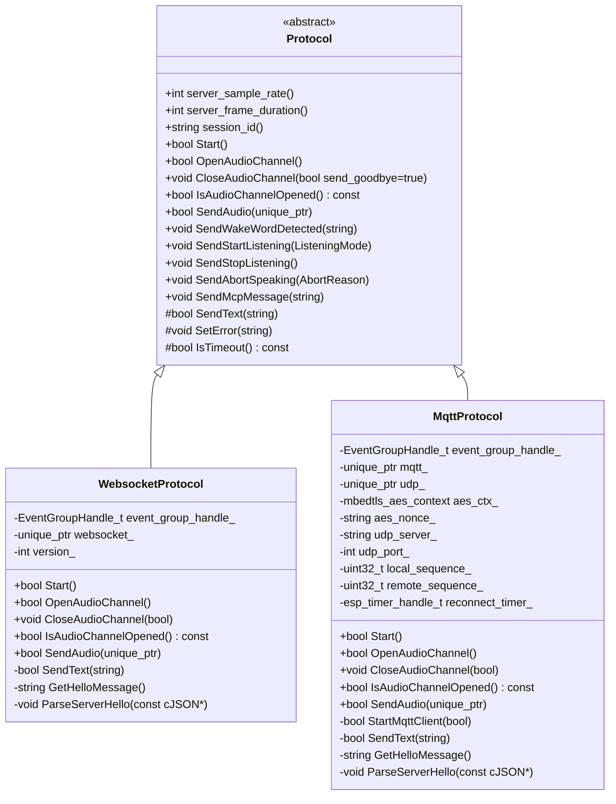
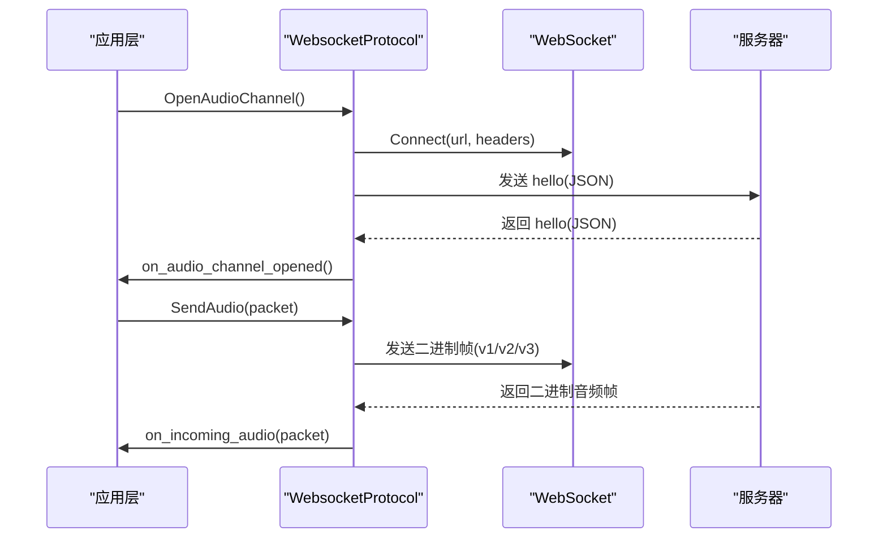
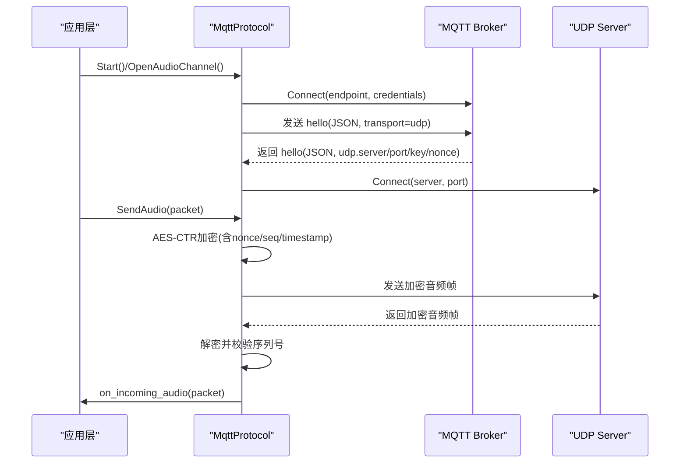
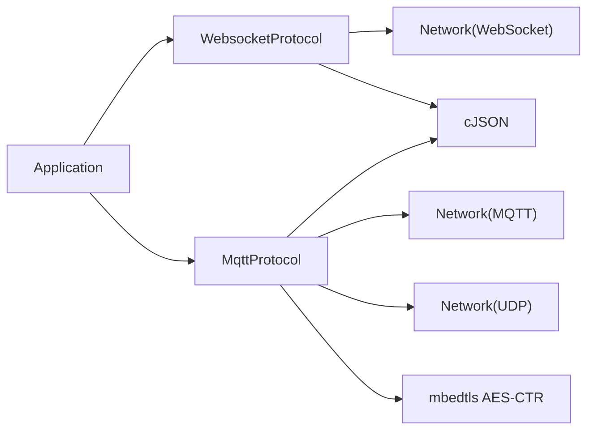

# 通信协议API

<cite>
**本文引用的文件**   
- [protocol.h](file://main/protocols/protocol.h)
- [protocol.cc](file://main/protocols/protocol.cc)
- [websocket_protocol.h](file://main/protocols/websocket_protocol.h)
- [websocket_protocol.cc](file://main/protocols/websocket_protocol.cc)
- [mqtt_protocol.h](file://main/protocols/mqtt_protocol.h)
- [mqtt_protocol.cc](file://main/protocols/mqtt_protocol.cc)
- [websocket.md](file://docs/websocket.md)
- [mqtt-udp.md](file://docs/mqtt-udp.md)
</cite>

## 目录
1. [简介](#简介)
2. [项目结构](#项目结构)
3. [核心组件](#核心组件)
4. [架构总览](#架构总览)
5. [详细组件分析](#详细组件分析)
6. [依赖关系分析](#依赖关系分析)
7. [性能与调优](#性能与调优)
8. [故障排查指南](#故障排查指南)
9. [结论](#结论)
10. [附录：二进制帧格式与消息类型](#附录二进制帧格式与消息类型)

## 简介
本文件为通信协议层的完整API文档，聚焦于Protocol基类的设计模式与虚函数接口，并深入对比WebSocketProtocol与MQTTProtocol的实现差异。文档涵盖二进制协议帧格式、JSON消息类型定义、数据序列化方法、网络连接管理、重连机制、错误处理策略、协议选择配置、连接参数设置与性能调优建议，以及协议调试工具与抓包分析方法。

## 项目结构
协议层位于 main/protocols 目录下，包含统一的抽象基类与两种具体实现：
- Protocol 基类：定义音频通道生命周期、文本/二进制发送、事件回调与超时检测等通用能力。
- WebsocketProtocol：基于WebSocket的纯文本+二进制传输实现。
- MqttProtocol：基于MQTT控制面 + UDP数据面的混合实现，提供AES-CTR加密的UDP音频通道。

图表来源
- [protocol.h:44-95](file://main/protocols/protocol.h#L44-L95)
- [websocket_protocol.h:13-32](file://main/protocols/websocket_protocol.h#L13-L32)
- [mqtt_protocol.h:26-62](file://main/protocols/mqtt_protocol.h#L26-L62)

章节来源
- [protocol.h:1-99](file://main/protocols/protocol.h#L1-L99)
- [websocket_protocol.h:1-35](file://main/protocols/websocket_protocol.h#L1-L35)
- [mqtt_protocol.h:1-66](file://main/protocols/mqtt_protocol.h#L1-L66)

## 核心组件
- Protocol 基类
  - 统一接口：Start、OpenAudioChannel、CloseAudioChannel、IsAudioChannelOpened、SendAudio、SendText（虚）、SendWakeWordDetected、SendStartListening、SendStopListening、SendAbortSpeaking、SendMcpMessage。
  - 事件回调：OnIncomingJson、OnIncomingAudio、OnAudioChannelOpened、OnAudioChannelClosed、OnNetworkError、OnConnected、OnDisconnected。
  - 公共状态：server_sample_rate_、server_frame_duration_、session_id_、error_occurred_、last_incoming_time_。
  - 默认实现：SetError、IsTimeout、以及若干JSON命令封装（listen/abort/wake_word/mcp）。
- WebsocketProtocol
  - 通过WebSocket建立双向通道；文本承载JSON，二进制承载Opus音频。
  - 支持三种二进制版本：v1原始Opus、v2带元数据、v3轻量头。
  - Hello握手协商会话ID与音频参数。
- MqttProtocol
  - 使用MQTT作为控制面，UDP作为实时音频面。
  - 在Hello响应中获取UDP服务器地址、端口、AES密钥与非随机数，初始化AES-CTR上下文。
  - 对上行音频进行AES-CTR加密并通过UDP发送；下行解密后交由上层处理。
  - 具备MQTT自动重连与定时器调度。

章节来源
- [protocol.h:44-95](file://main/protocols/protocol.h#L44-L95)
- [protocol.cc:35-90](file://main/protocols/protocol.cc#L35-L90)
- [websocket_protocol.cc:83-255](file://main/protocols/websocket_protocol.cc#L83-L255)
- [mqtt_protocol.cc:55-390](file://main/protocols/mqtt_protocol.cc#L55-L390)

## 架构总览
整体采用“抽象基类 + 多实现”的策略，上层应用仅依赖Protocol接口，运行时根据配置选择WebSocket或MQTT+UDP方案。

图表来源
- [protocol.h:44-95](file://main/protocols/protocol.h#L44-L95)
- [websocket_protocol.h:13-32](file://main/protocols/websocket_protocol.h#L13-L32)
- [mqtt_protocol.h:26-62](file://main/protocols/mqtt_protocol.h#L26-L62)

## 详细组件分析

### Protocol 基类设计
- 设计模式
  - 模板方法：将通用流程（如超时检测、错误上报）放在基类，具体网络细节由子类实现。
  - 观察者模式：通过回调注册接收JSON、音频、连接状态变化等事件。
- 关键虚函数与职责
  - Start：启动协议实例（例如MQTT客户端初始化）。
  - OpenAudioChannel：打开音频通道（WebSocket直连或MQTT协商UDP）。
  - CloseAudioChannel：关闭音频通道（可选择是否发送告别消息）。
  - IsAudioChannelOpened：判断通道可用性（结合错误标志与超时）。
  - SendAudio：发送音频帧（按协议版本序列化）。
  - SendText：发送文本消息（JSON），由子类实现底层传输。
- 默认行为
  - SetError：标记错误并触发网络错误回调。
  - IsTimeout：基于最近一次入站时间计算超时（默认120秒）。
  - 常用JSON命令封装：listen/start/stop/detect、abort、wake word、mcp。

章节来源
- [protocol.h:44-95](file://main/protocols/protocol.h#L44-L95)
- [protocol.cc:35-90](file://main/protocols/protocol.cc#L35-L90)

### WebSocketProtocol 实现要点
- 连接与握手
  - 从配置读取URL、Token、版本；设置Authorization、Protocol-Version、Device-Id、Client-Id等请求头。
  - 发送hello消息，等待服务器hello响应，解析session_id与audio_params。
- 音频收发
  - 上行：根据version_选择v1/v2/v3二进制封装或直接发送原始Opus。
  - 下行：区分binary/text；binary走音频路径，text走JSON分发。
- 事件与超时
  - OnData更新last_incoming_time_；IsAudioChannelOpened综合连接状态、错误标志与超时判定。
- 二进制协议版本
  - v1：直接Opus帧。
  - v2：BinaryProtocol2（含timestamp、payload_size等）。
  - v3：BinaryProtocol3（轻量头）。

图表来源
- [websocket_protocol.cc:83-201](file://main/protocols/websocket_protocol.cc#L83-L201)
- [websocket_protocol.cc:28-72](file://main/protocols/websocket_protocol.cc#L28-L72)
- [websocket_protocol.cc:112-166](file://main/protocols/websocket_protocol.cc#L112-L166)

章节来源
- [websocket_protocol.cc:15-255](file://main/protocols/websocket_protocol.cc#L15-L255)
- [websocket.md:1-531](file://docs/websocket.md#L1-L531)

### MqttProtocol 实现要点
- 控制面（MQTT）
  - 连接Broker（支持TLS端口），订阅/发布主题，处理断开重连（定时器调度）。
  - Hello交换：设备发送transport=udp的hello，服务器返回UDP端点与AES密钥/Nonce。
- 数据面（UDP）
  - 上行：构造nonce（包含长度、时间戳、序列号），AES-CTR加密Opus帧，通过UDP发送。
  - 下行：校验type、长度、序列号，AES-CTR解密，组装AudioStreamPacket并回调。
- 安全与可靠性
  - AES-CTR加密、序列号单调递增、丢弃旧包、记录警告但不中断流。
  - MQTT断开时自动重连；收到goodbye时避免ping-pong，不回复告别。

图表来源
- [mqtt_protocol.cc:55-152](file://main/protocols/mqtt_protocol.cc#L55-L152)
- [mqtt_protocol.cc:215-295](file://main/protocols/mqtt_protocol.cc#L215-L295)
- [mqtt_protocol.cc:166-190](file://main/protocols/mqtt_protocol.cc#L166-L190)
- [mqtt_protocol.cc:243-287](file://main/protocols/mqtt_protocol.cc#L243-L287)

章节来源
- [mqtt_protocol.cc:13-390](file://main/protocols/mqtt_protocol.cc#L13-L390)
- [mqtt-udp.md:1-410](file://docs/mqtt-udp.md#L1-L410)

## 依赖关系分析
- 外部库与系统服务
  - cJSON：JSON解析与构建。
  - mbedtls：AES-CTR加解密（MQTT方案）。
  - FreeRTOS：事件组、定时器、任务调度。
  - ESP-IDF网络栈：WebSocket/MQTT/UDP抽象。
- 模块耦合
  - 两个协议均依赖Board::GetInstance().GetNetwork()创建具体网络对象。
  - 两者都依赖Settings读取配置项。
  - 两者都依赖Application进行状态管理与任务调度（MQTT更明显）。

图表来源
- [websocket_protocol.cc:94-111](file://main/protocols/websocket_protocol.cc#L94-L111)
- [mqtt_protocol.cc:81-98](file://main/protocols/mqtt_protocol.cc#L81-L98)
- [mqtt_protocol.cc:355-365](file://main/protocols/mqtt_protocol.cc#L355-L365)

章节来源
- [websocket_protocol.cc:83-111](file://main/protocols/websocket_protocol.cc#L83-L111)
- [mqtt_protocol.cc:55-98](file://main/protocols/mqtt_protocol.cc#L55-L98)

## 性能与调优
- 协议选择
  - 低延迟优先：MQTT+UDP（UDP面低延迟，但需穿透防火墙/NAT）。
  - 部署简便优先：WebSocket（单通道，易穿越防火墙）。
- 音频参数
  - 采样率：设备侧通常16kHz，服务端可能24kHz（下行）。
  - 帧时长：默认60ms，影响延迟与带宽。
- 二进制版本
  - v1：最小开销，适合稳定链路。
  - v2：携带timestamp，便于服务端AEC对齐。
  - v3：轻量头，减少开销。
- 并发与锁
  - MQTT方案在UDP发送处加互斥锁保护，避免并发冲突。
- 内存与资源
  - 使用智能指针管理网络对象与音频包，及时释放加密上下文。
- 网络优化
  - 复用UDP连接；合理包大小；序列号连续性检查降低乱序影响。

章节来源
- [websocket.md:310-331](file://docs/websocket.md#L310-L331)
- [mqtt-udp.md:339-359](file://docs/mqtt-udp.md#L339-L359)
- [mqtt_protocol.cc:166-190](file://main/protocols/mqtt_protocol.cc#L166-L190)

## 故障排查指南
- 常见问题定位
  - 连接失败：检查URL/endpoint、认证信息、端口可达性。
  - 握手超时：确认服务器hello响应字段transport与audio_params。
  - 音频不可用：检查IsAudioChannelOpened返回值、错误标志与超时。
  - 解密失败（MQTT）：核对key/nonce、序列号连续性。
- 日志与断点
  - 关注ESP_LOGE/ESP_LOGI输出，尤其是“Failed to connect”、“Missing message type”、“Invalid audio packet size/type”。
  - 在OnData/OnMessage回调处打点，验证JSON结构与二进制帧长度。
- 抓包与分析
  - WebSocket：使用浏览器开发者工具或Wireshark过滤ws/wss，查看文本帧与二进制帧。
  - MQTT：使用MQTT.fx/MQTT Explorer观察topic与消息体；配合Wireshark抓取TCP流量。
  - UDP：Wireshark过滤UDP端口，检查type=0x01、payload_len、timestamp、sequence字段，验证AES-CTR解密。
- 恢复策略
  - WebSocket：断开后回到空闲态，必要时重新OpenAudioChannel。
  - MQTT：自动重连；若收到goodbye则关闭UDP通道且不回发告别。

章节来源
- [websocket_protocol.cc:168-194](file://main/protocols/websocket_protocol.cc#L168-L194)
- [mqtt_protocol.cc:85-132](file://main/protocols/mqtt_protocol.cc#L85-L132)
- [mqtt-udp.md:235-240](file://docs/mqtt-udp.md#L235-L240)

## 结论
本协议层以Protocol抽象为核心，提供一致的音频通道生命周期与事件模型。WebSocket方案简单可靠，适合大多数场景；MQTT+UDP方案在低延迟与安全性上更具优势，适用于对实时性要求高的语音交互。通过合理的配置与调优，可在不同网络环境下获得稳定的体验。

## 附录：二进制帧格式与消息类型

### 二进制协议帧格式
- BinaryProtocol2
  - 字段：version、type、reserved、timestamp、payload_size、payload[]。
  - 用途：携带timestamp，便于服务端AEC对齐。
- BinaryProtocol3
  - 字段：type、reserved、payload_size、payload[]。
  - 用途：轻量头，减少开销。
- v1：无额外头部，直接Opus帧。

章节来源
- [protocol.h:17-31](file://main/protocols/protocol.h#L17-L31)
- [websocket.md:100-127](file://docs/websocket.md#L100-L127)

### JSON消息类型（节选）
- 设备->服务器
  - hello：声明能力与音频参数。
  - listen：start/stop/detect，mode:auto/manual/realtime。
  - abort：中止TTS或语音通道，reason可包含wake_word_detected。
  - mcp：IoT控制载荷（JSON-RPC 2.0）。
- 服务器->设备
  - hello：确认transport、分配session_id、协商audio_params。
  - stt：识别结果。
  - tts：start/stop/sentence_start。
  - llm：表情/情绪更新。
  - system：reboot等系统指令。
  - alert：UI告警提示。
  - custom：可选自定义消息。

章节来源
- [websocket.md:129-307](file://docs/websocket.md#L129-L307)
- [mqtt-udp.md:124-190](file://docs/mqtt-udp.md#L124-L190)

### 协议选择与配置
- WebSocket
  - 配置项：url、token、version。
  - 请求头：Authorization、Protocol-Version、Device-Id、Client-Id。
- MQTT+UDP
  - 配置项：endpoint、client_id、username、password、keepalive、publish_topic。
  - 音频参数：format=opus、sample_rate、channels、frame_duration。
  - UDP安全：key/nonce（十六进制字符串），AES-CTR加密。

章节来源
- [websocket_protocol.cc:84-111](file://main/protocols/websocket_protocol.cc#L84-L111)
- [mqtt_protocol.cc:65-72](file://main/protocols/mqtt_protocol.cc#L65-L72)
- [mqtt-udp.md:276-295](file://docs/mqtt-udp.md#L276-L295)

### 连接参数与性能调优清单
- 连接参数
  - WebSocket：URL、Token、版本、设备标识。
  - MQTT：Broker地址与端口、凭据、KeepAlive、发布主题。
- 性能调优
  - 选择合适的二进制版本（v1/v2/v3）。
  - 调整帧时长与采样率平衡延迟与带宽。
  - 确保UDP端口可达，必要时配置NAT/防火墙规则。
  - 监控序列号连续性与解密失败率。

章节来源
- [websocket.md:426-436](file://docs/websocket.md#L426-L436)
- [mqtt-udp.md:339-359](file://docs/mqtt-udp.md#L339-L359)