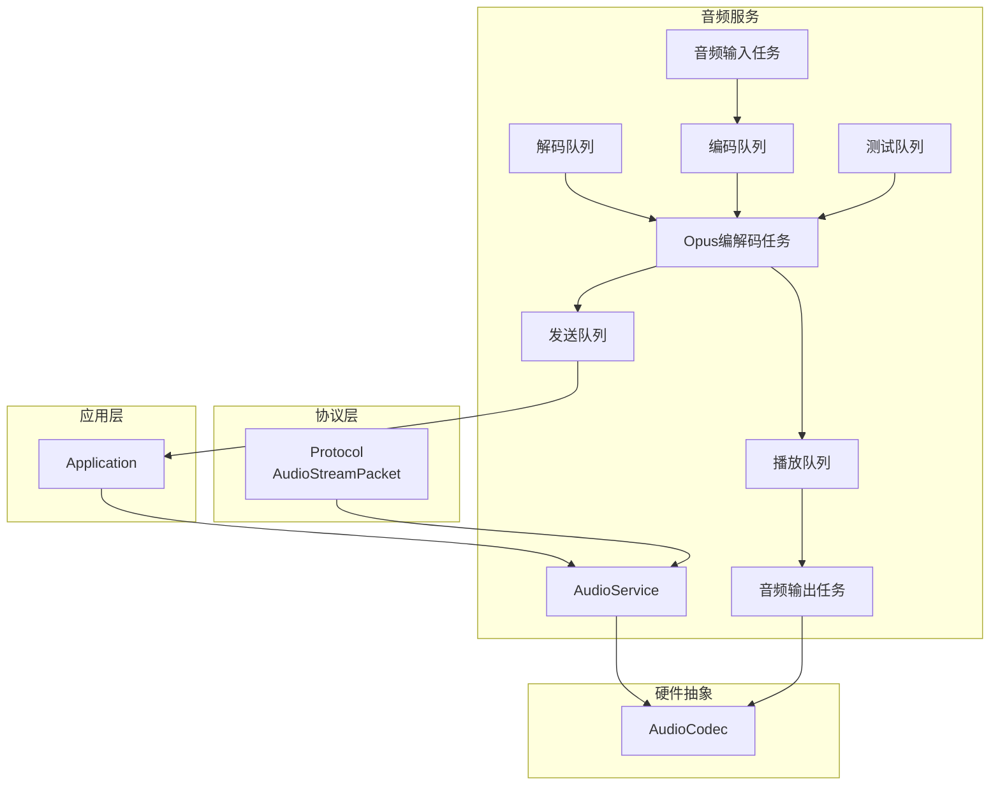
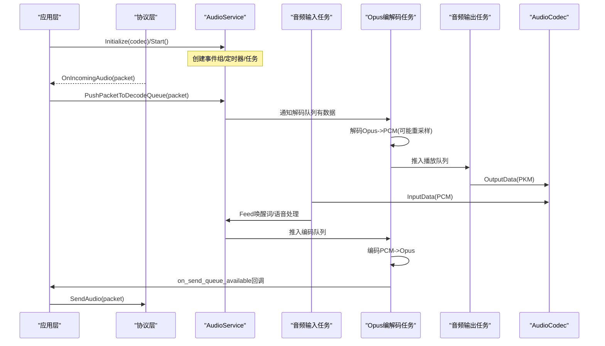
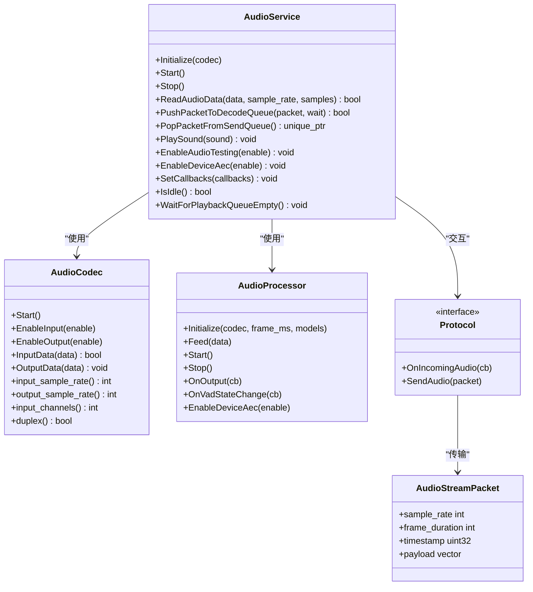

# AudioService核心API

<cite>
**本文引用的文件**
- [audio_service.h](file://main/audio/audio_service.h)
- [audio_service.cc](file://main/audio/audio_service.cc)
- [protocol.h](file://main/protocols/protocol.h)
- [application.cc](file://main/application.cc)
- [audio_codec.h](file://main/audio/audio_codec.h)
- [audio_processor.h](file://main/audio/audio_processor.h)
</cite>

## 目录
1. [简介](#简介)
2. [项目结构](#项目结构)
3. [核心组件](#核心组件)
4. [架构总览](#架构总览)
5. [详细组件分析](#详细组件分析)
6. [依赖关系分析](#依赖关系分析)
7. [性能与资源特性](#性能与资源特性)
8. [故障排查指南](#故障排查指南)
9. [结论](#结论)
10. [附录：关键接口速查](#附录关键接口速查)

## 简介
本文件面向开发者，系统化梳理 AudioService 核心类的 API、初始化流程、任务管理与生命周期控制，并详细说明音频采集、播放、数据包处理等关键接口的使用方法。文档还覆盖数据格式、采样率配置、缓冲区管理策略，以及测试模式、设备回声消除等高级功能的配置与使用示例，并提供状态监控与调试统计信息的获取方法。

## 项目结构
AudioService 位于 main/audio 目录下，负责：
- 音频输入/输出任务调度
- Opus 编解码
- 唤醒词检测与语音处理管线
- 网络侧音频包入队/出队
- 本地音效播放（OGG）
- 电源管理与静音保护

图表来源
- [audio_service.h:105-193](file://main/audio/audio_service.h#L105-L193)
- [audio_service.cc:125-167](file://main/audio/audio_service.cc#L125-L167)
- [protocol.h:10-15](file://main/protocols/protocol.h#L10-L15)

章节来源
- [audio_service.h:1-195](file://main/audio/audio_service.h#L1-L195)
- [audio_service.cc:1-735](file://main/audio/audio_service.cc#L1-L735)
- [protocol.h:1-99](file://main/protocols/protocol.h#L1-L99)

## 核心组件
- AudioService：音频服务核心类，封装输入/输出任务、Opus编解码、队列缓冲、事件组与定时器，提供对外API。
- AudioCodec：硬件I2S/编解码器抽象，提供输入/输出数据读写、通道能力查询。
- AudioProcessor：语音处理管线（如AEC、降噪、VAD），可插拔实现。
- WakeWord：唤醒词检测模块，支持多种后端实现。
- Protocol/AudioStreamPacket：网络协议与音频包结构定义。

章节来源
- [audio_service.h:105-193](file://main/audio/audio_service.h#L105-L193)
- [audio_codec.h:17-59](file://main/audio/audio_codec.h#L17-L59)
- [audio_processor.h:11-24](file://main/audio/audio_processor.h#L11-L24)
- [protocol.h:10-15](file://main/protocols/protocol.h#L10-L15)

## 架构总览
AudioService 采用三任务并行模型：
- 音频输入任务：从 Codec 读取PCM，按需重采样至16kHz，喂给唤醒词或语音处理器，并将处理结果推入编码队列。
- Opus编解码任务：从编码队列取PCM进行Opus编码，推入发送队列；从解码队列取Opus包解码为PCM，必要时重采样到设备输出采样率，推入播放队列。
- 音频输出任务：从播放队列取PCM写入Codec。

图表来源
- [audio_service.cc:125-167](file://main/audio/audio_service.cc#L125-L167)
- [audio_service.cc:230-288](file://main/audio/audio_service.cc#L230-L288)
- [audio_service.cc:327-446](file://main/audio/audio_service.cc#L327-L446)
- [audio_service.cc:290-325](file://main/audio/audio_service.cc#L290-L325)
- [application.cc:498-502](file://main/application.cc#L498-L502)

## 详细组件分析

### 初始化与生命周期
- Initialize(AudioCodec* codec)
  - 启动Codec，打开Opus解码器与编码器，根据Codec输入/输出采样率配置重采样器。
  - 初始化语音处理器与唤醒词回调，注册电源管理定时器。
- Start()
  - 启动三个任务：音频输入、音频输出、Opus编解码。
  - 启动周期性定时器用于电源状态检查。
- Stop()
  - 停止定时器，置停止标志，清空所有队列并唤醒等待者。

章节来源
- [audio_service.cc:62-123](file://main/audio/audio_service.cc#L62-L123)
- [audio_service.cc:125-167](file://main/audio/audio_service.cc#L125-L167)
- [audio_service.cc:169-182](file://main/audio/audio_service.cc#L169-L182)

### 任务管理机制
- 事件组控制：AS_EVENT_AUDIO_TESTING_RUNNING、AS_EVENT_WAKE_WORD_RUNNING、AS_EVENT_AUDIO_PROCESSOR_RUNNING、AS_EVENT_PLAYBACK_NOT_EMPTY。
- 条件变量+互斥锁协调多队列：audio_encode_queue_、audio_decode_queue_、audio_playback_queue_、audio_send_queue_、audio_testing_queue_。
- 任务优先级与核心绑定：输入任务高优先级，输出任务中优先级，Opus任务低优先级但较大栈空间。

章节来源
- [audio_service.h:50-54](file://main/audio/audio_service.h#L50-L54)
- [audio_service.cc:125-167](file://main/audio/audio_service.cc#L125-L167)
- [audio_service.cc:327-446](file://main/audio/audio_service.cc#L327-L446)

### 音频采集接口 ReadAudioData()
- 功能：从Codec读取PCM，自动启用输入通道；若请求采样率与设备不一致则进行重采样；更新最后输入时间与统计计数；可选将原始数据送入调试器。
- 参数：data（输出PCM缓冲）、sample_rate（期望采样率）、samples（期望帧样本数）。
- 返回值：成功true，失败false。
- 注意：内部会按设备输入声道数调整缓冲大小；双声道时会在测试路径下抽取左声道。

章节来源
- [audio_service.cc:184-228](file://main/audio/audio_service.cc#L184-L228)
- [audio_service.cc:230-288](file://main/audio/audio_service.cc#L230-L288)

### 音频播放接口 PlaySound()
- 功能：播放一段内嵌的OGG音频流，通过OggDemuxer解析后以AudioStreamPacket形式入队解码。
- 行为：若输出未启用，先启用输出；解析完成后调用PushPacketToDecodeQueue(true)阻塞式入队。
- 适用场景：提示音、系统音效等短音频。

章节来源
- [audio_service.cc:633-654](file://main/audio/audio_service.cc#L633-L654)

### 数据包处理接口
- PushPacketToDecodeQueue(std::unique_ptr<AudioStreamPacket>, bool wait=false)
  - 将远端Opus包入队解码；当队列满且wait=true时等待可用空间，否则立即返回false。
- PopPacketFromSendQueue()
  - 非阻塞地从发送队列取一个已编码的Opus包供上层发送；空则返回nullptr。

章节来源
- [audio_service.cc:506-529](file://main/audio/audio_service.cc#L506-L529)

### 高级功能
- EnableAudioTesting(bool enable)
  - 开启/关闭音频测试模式。开启后输入任务将采集到的PCM编码后放入测试队列；关闭时将测试队列内容迁移到解码队列进行回放。
- EnableDeviceAec(bool enable)
  - 启用/禁用设备端AEC（需语音处理器支持）。若尚未初始化处理器，则在此处完成初始化。
- EnableWakeWordDetection(bool enable) / EnableVoiceProcessing(bool enable)
  - 分别控制唤醒词与语音处理管线的启停；切换时会重置输入重采样器以避免缓存溢出。

章节来源
- [audio_service.cc:606-627](file://main/audio/audio_service.cc#L606-L627)
- [audio_service.cc:549-604](file://main/audio/audio_service.cc#L549-L604)

### 数据格式、采样率与缓冲区策略
- 数据格式
  - PCM：int16_t，单声道为主；双声道在测试路径下抽取左声道。
  - 网络/解码：AudioStreamPacket，包含sample_rate、frame_duration、timestamp、payload(Opus字节)。
- 采样率
  - 编码固定16kHz；解码采样率由服务端协商，动态重建解码器并重采样到设备输出采样率。
- 帧时长
  - 默认OPUS_FRAME_DURATION_MS=60ms；编码器/解码器均按此帧长工作。
- 队列容量上限
  - 解码队列最大包数：MAX_DECODE_PACKETS_IN_QUEUE = 2400 / OPUS_FRAME_DURATION_MS
  - 发送队列最大包数：MAX_SEND_PACKETS_IN_QUEUE = 2400 / OPUS_FRAME_DURATION_MS
  - 编码任务队列最大任务数：MAX_ENCODE_TASKS_IN_QUEUE = 2
  - 播放任务队列最大任务数：MAX_PLAYBACK_TASKS_IN_QUEUE = 2
  - 测试队列最大时长：AUDIO_TESTING_MAX_DURATION_MS = 10000ms
- 时间戳与服务器AEC
  - 输出任务记录播放时间戳，编码任务从timestamp_queue_取出作为上行包的时间戳，用于服务器端AEC对齐。

章节来源
- [audio_service.h:39-46](file://main/audio/audio_service.h#L39-L46)
- [audio_service.cc:448-482](file://main/audio/audio_service.cc#L448-L482)
- [audio_service.cc:327-446](file://main/audio/audio_service.cc#L327-L446)
- [audio_service.cc:290-325](file://main/audio/audio_service.cc#L290-L325)
- [protocol.h:10-15](file://main/protocols/protocol.h#L10-L15)

### 状态监控与调试统计
- 状态查询
  - IsIdle()：判断各队列是否全部为空。
  - WaitForPlaybackQueueEmpty()：阻塞等待播放相关队列清空。
  - IsWakeWordRunning()/IsAudioProcessorRunning()：基于事件组位判断运行态。
  - IsVoiceDetected()：VAD说话检测结果。
- 回调机制
  - SetCallbacks(AudioServiceCallbacks&)：注册on_send_queue_available、on_wake_word_detected、on_vad_change、on_audio_testing_queue_full等回调。
- 调试统计
  - DebugStatistics：input_count、decode_count、encode_count、playback_count（当前版本未暴露直接读取接口，可在扩展中增加getter）。

章节来源
- [audio_service.h:78-83](file://main/audio/audio_service.h#L78-L83)
- [audio_service.h:98-103](file://main/audio/audio_service.h#L98-L103)
- [audio_service.cc:656-680](file://main/audio/audio_service.cc#L656-L680)
- [audio_service.cc:629-631](file://main/audio/audio_service.cc#L629-L631)

### 典型使用示例（步骤说明）
- 初始化与启动
  - 在应用初始化阶段获取AudioCodec实例，调用AudioService.Initialize(codec)，随后调用Start()。
  - 设置回调：on_send_queue_available触发后，主循环应调用PopPacketFromSendQueue()并通过协议层发送。
- 接收远端音频
  - 协议层收到OnIncomingAudio(packet)后，调用PushPacketToDecodeQueue(packet, false)入队。
- 本地采集与发送
  - 输入任务自动从Codec读取PCM，经唤醒词/语音处理后入编码队列；Opus任务编码后入发送队列，应用层拉取发送。
- 播放本地音效
  - 调用PlaySound(ogg_data_view)，内部自动解析并推入解码队列。
- 开启测试模式
  - 在特定模式下调用EnableAudioTesting(true)，结束后调用EnableAudioTesting(false)回放测试录音。
- 设备端AEC
  - 调用EnableDeviceAec(true)启用设备端AEC（需要语音处理器支持）。

章节来源
- [application.cc:71-86](file://main/application.cc#L71-L86)
- [application.cc:498-502](file://main/application.cc#L498-L502)
- [audio_service.cc:606-627](file://main/audio/audio_service.cc#L606-L627)
- [audio_service.cc:633-654](file://main/audio/audio_service.cc#L633-L654)

## 依赖关系分析
- AudioService 依赖
  - AudioCodec：底层I2S/编解码器抽象，提供输入/输出能力与参数查询。
  - AudioProcessor：语音处理管线（AEC、降噪、VAD等）。
  - WakeWord：唤醒词检测后端。
  - Protocol/AudioStreamPacket：网络音频包结构与协议回调。
- 外部库
  - ESP-IDF FreeRTOS：任务、事件组、定时器、条件变量。
  - ESP Opus编解码：esp_opus_enc/dec。
  - 重采样：esp_ae_rate_cvt。

图表来源
- [audio_service.h:105-193](file://main/audio/audio_service.h#L105-L193)
- [audio_codec.h:17-59](file://main/audio/audio_codec.h#L17-L59)
- [audio_processor.h:11-24](file://main/audio/audio_processor.h#L11-L24)
- [protocol.h:10-15](file://main/protocols/protocol.h#L10-L15)

章节来源
- [audio_service.h:105-193](file://main/audio/audio_service.h#L105-L193)
- [audio_codec.h:17-59](file://main/audio/audio_codec.h#L17-L59)
- [audio_processor.h:11-24](file://main/audio/audio_processor.h#L11-L24)
- [protocol.h:10-15](file://main/protocols/protocol.h#L10-L15)

## 性能与资源特性
- 任务栈与优先级
  - 输入任务：较高优先级，确保实时采集。
  - 输出任务：中等优先级，保证播放流畅。
  - Opus任务：较低优先级但分配更大栈空间，避免编解码溢出。
- 队列与背压
  - 编码/播放任务队列长度限制为2，防止突发积压导致延迟抖动。
  - 解码/发送队列长度受2400ms窗口限制，避免内存暴涨。
- 动态重采样
  - 输入重采样至16kHz；输出根据服务端采样率动态重建解码器，并在必要时重采样到设备输出采样率。
- 电源管理
  - 无输入/输出超过阈值时自动关闭对应通道，降低功耗；全关闭时停止定时器。

章节来源
- [audio_service.cc:125-167](file://main/audio/audio_service.cc#L125-L167)
- [audio_service.cc:682-698](file://main/audio/audio_service.cc#L682-L698)
- [audio_service.h:39-46](file://main/audio/audio_service.h#L39-L46)

## 故障排查指南
- 常见问题定位
  - 解码失败：检查SetDecodeSampleRate是否正确重建解码器，确认服务端sample_rate/frame_duration。
  - 编码失败：确认输入PCM帧长等于encoder_frame_size_（16kHz×60ms）。
  - 播放卡顿：检查播放队列是否长期不空，确认输出任务未被阻塞。
  - 回环啸叫/回声：确认是否启用设备端AEC或服务器端AEC，核对时间戳传递链路。
- 日志与回调
  - 关注ESP_LOGE/ESP_LOGW输出的错误码与提示信息。
  - 利用on_send_queue_available回调及时拉取发送队列，避免堆积。
- 恢复操作
  - ResetDecoder()：重置解码器状态并清空相关队列，适用于会话切换或异常恢复。
  - WaitForPlaybackQueueEmpty()：在切换模式前等待播放队列清空，避免串音。

章节来源
- [audio_service.cc:448-482](file://main/audio/audio_service.cc#L448-L482)
- [audio_service.cc:668-680](file://main/audio/audio_service.cc#L668-L680)
- [audio_service.cc:327-446](file://main/audio/audio_service.cc#L327-L446)

## 结论
AudioService 提供了完整的端到端音频处理能力，涵盖采集、处理、编解码、网络收发与播放，具备完善的任务调度、队列缓冲与电源管理策略。通过清晰的API与回调机制，上层应用可以灵活集成唤醒词、语音处理与AEC等功能，满足多场景下的实时语音交互需求。

## 附录：关键接口速查
- 初始化与生命周期
  - Initialize(AudioCodec*)
  - Start()
  - Stop()
- 采集与播放
  - ReadAudioData(vector<int16_t>&, int, int) -> bool
  - PlaySound(string_view)
- 数据包处理
  - PushPacketToDecodeQueue(unique_ptr<AudioStreamPacket>, bool) -> bool
  - PopPacketFromSendQueue() -> unique_ptr<AudioStreamPacket>
- 高级功能
  - EnableAudioTesting(bool)
  - EnableDeviceAec(bool)
  - EnableWakeWordDetection(bool)
  - EnableVoiceProcessing(bool)
- 状态与调试
  - IsIdle() -> bool
  - WaitForPlaybackQueueEmpty()
  - SetCallbacks(AudioServiceCallbacks&)
  - IsVoiceDetected() -> bool
  - IsWakeWordRunning() -> bool
  - IsAudioProcessorRunning() -> bool

章节来源
- [audio_service.h:110-135](file://main/audio/audio_service.h#L110-L135)
- [audio_service.cc:184-228](file://main/audio/audio_service.cc#L184-L228)
- [audio_service.cc:506-529](file://main/audio/audio_service.cc#L506-L529)
- [audio_service.cc:606-627](file://main/audio/audio_service.cc#L606-L627)
- [audio_service.cc:656-680](file://main/audio/audio_service.cc#L656-L680)