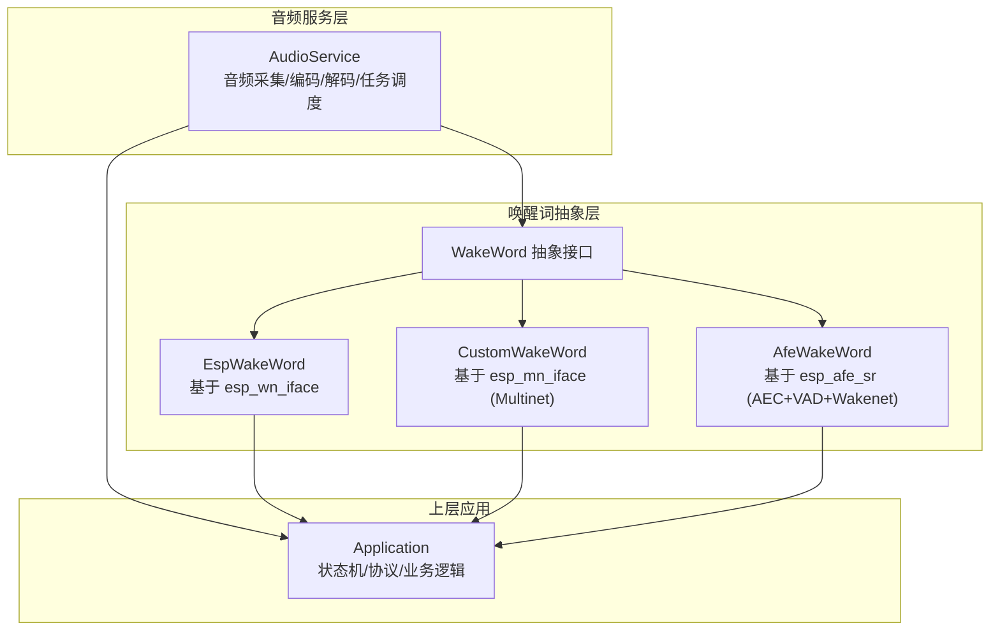
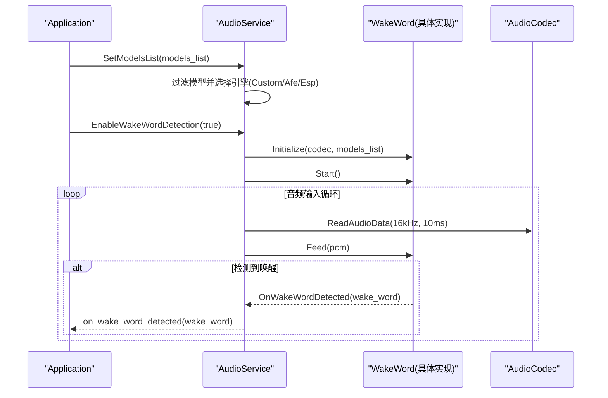
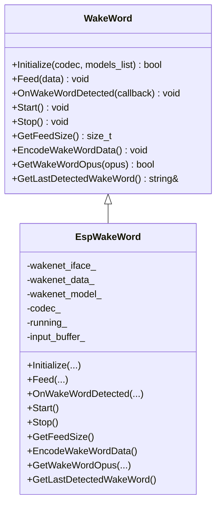
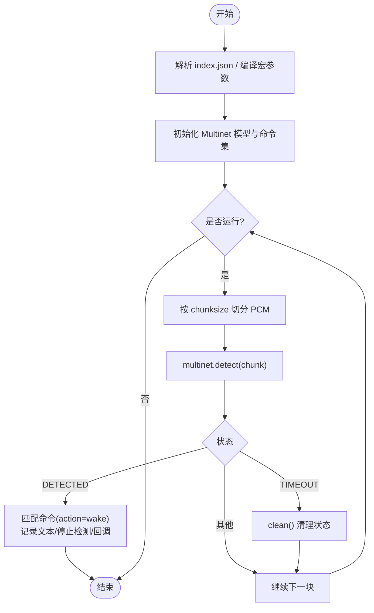
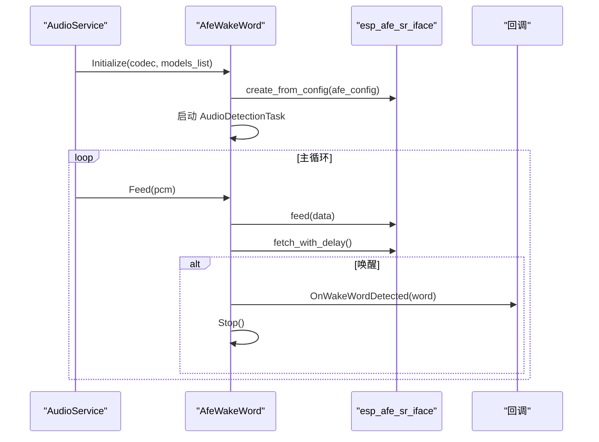
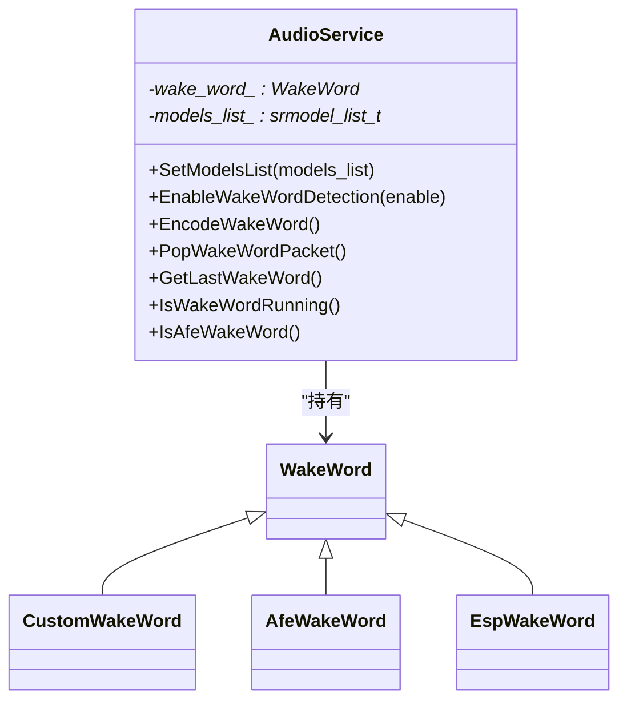
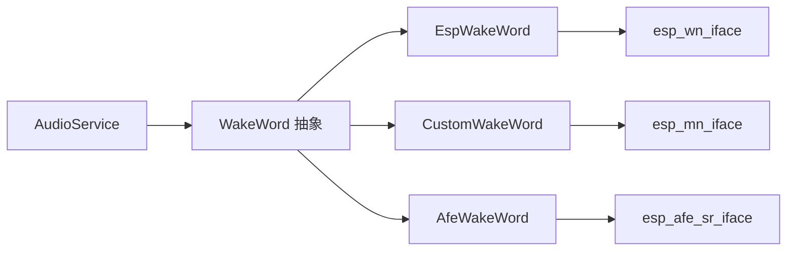

# 唤醒词检测API

<cite>
**本文引用的文件**   
- [wake_word.h](file://main/audio/wake_word.h)
- [esp_wake_word.h](file://main/audio/wake_words/esp_wake_word.h)
- [esp_wake_word.cc](file://main/audio/wake_words/esp_wake_word.cc)
- [custom_wake_word.h](file://main/audio/wake_words/custom_wake_word.h)
- [custom_wake_word.cc](file://main/audio/wake_words/custom_wake_word.cc)
- [afe_wake_word.h](file://main/audio/wake_words/afe_wake_word.h)
- [afe_wake_word.cc](file://main/audio/wake_words/afe_wake_word.cc)
- [audio_service.h](file://main/audio/audio_service.h)
- [audio_service.cc](file://main/audio/audio_service.cc)
- [application.cc](file://main/application.cc)
</cite>

## 目录
1. [简介](#简介)
2. [项目结构](#项目结构)
3. [核心组件](#核心组件)
4. [架构总览](#架构总览)
5. [详细组件分析](#详细组件分析)
6. [依赖关系分析](#依赖关系分析)
7. [性能与功耗考量](#性能与功耗考量)
8. [故障排查指南](#故障排查指南)
9. [结论](#结论)
10. [附录：自定义引擎开发指南](#附录自定义引擎开发指南)

## 简介
本文件为唤醒词检测系统的完整API文档，面向开发者提供统一的抽象接口、多种引擎实现（ESP Wake Word、Custom Wake Word、AFE Wake Word）的配置与使用方法，并深入说明模型加载、管理与切换机制。同时给出灵敏度调节、误触发处理与性能优化的最佳实践，以及自定义唤醒词引擎的开发指南。

## 项目结构
唤醒词相关代码位于 audio 模块下，包含统一抽象接口 WakeWord 及三种具体实现；AudioService 负责音频采集、任务调度与唤醒词引擎的创建与生命周期管理；Application 在检测到唤醒词后驱动后续流程。

图表来源
- [audio_service.h:105-195](file://main/audio/audio_service.h#L105-L195)
- [audio_service.cc:700-726](file://main/audio/audio_service.cc#L700-L726)
- [wake_word.h:11-24](file://main/audio/wake_word.h#L11-L24)
- [esp_wake_word.h:17-43](file://main/audio/wake_words/esp_wake_word.h#L17-L43)
- [custom_wake_word.h:20-69](file://main/audio/wake_words/custom_wake_word.h#L20-L69)
- [afe_wake_word.h:22-60](file://main/audio/wake_words/afe_wake_word.h#L22-L60)

章节来源
- [audio_service.h:105-195](file://main/audio/audio_service.h#L105-L195)
- [audio_service.cc:700-726](file://main/audio/audio_service.cc#L700-L726)
- [wake_word.h:11-24](file://main/audio/wake_word.h#L11-L24)

## 核心组件
- WakeWord 抽象接口：定义初始化、数据喂入、回调注册、启停、分片大小查询、唤醒片段编码与获取等统一方法。
- EspWakeWord：基于 esp_wn_iface 的轻量级唤醒实现，适合非S3/P4平台或仅使用Wakenet的场景。
- CustomWakeWord：基于 esp_mn_iface 的多命令识别（Multinet），支持语言、阈值、命令列表配置，可输出唤醒片段OPUS。
- AfeWakeWord：基于 esp_afe_sr 的完整前端链路（AEC/VAD/Wakenet），内置独立检测任务，适合S3/P4平台的高性能场景。
- AudioService：统一管理音频输入/输出、编码器/解码器、任务队列，并根据模型类型动态选择具体唤醒引擎。

章节来源
- [wake_word.h:11-24](file://main/audio/wake_word.h#L11-L24)
- [esp_wake_word.h:17-43](file://main/audio/wake_words/esp_wake_word.h#L17-L43)
- [custom_wake_word.h:20-69](file://main/audio/wake_words/custom_wake_word.h#L20-L69)
- [afe_wake_word.h:22-60](file://main/audio/wake_words/afe_wake_word.h#L22-L60)
- [audio_service.h:105-195](file://main/audio/audio_service.h#L105-L195)

## 架构总览
AudioService 根据可用模型自动选择唤醒引擎：若存在 Multinet 模型则优先 CustomWakeWord；否则若存在 Wakenet 模型则选择对应实现（S3/P4 使用 AfeWakeWord，其他平台使用 EspWakeWord）。音频输入任务按事件标志位将PCM帧分别喂给唤醒引擎和语音处理器，并在检测到唤醒时通过回调通知上层。

图表来源
- [audio_service.cc:700-726](file://main/audio/audio_service.cc#L700-L726)
- [audio_service.cc:549-577](file://main/audio/audio_service.cc#L549-L577)
- [audio_service.cc:230-288](file://main/audio/audio_service.cc#L230-L288)
- [application.cc:781-812](file://main/application.cc#L781-L812)

## 详细组件分析

### WakeWord 抽象接口
- Initialize(AudioCodec*, srmodel_list_t*)：完成引擎初始化，加载模型、创建内部句柄、设置采样率/分片大小等。
- Feed(const std::vector<int16_t>&)：周期性喂入PCM数据，内部按模型要求分片检测。
- OnWakeWordDetected(callback)：注册检测结果回调，回调中传入最终显示的唤醒词文本。
- Start()/Stop()：控制检测运行态，清理缓冲或停止任务。
- GetFeedSize()：返回模型期望的分片大小（样本数），用于上游对齐读取。
- EncodeWakeWordData()/GetWakeWordOpus(opus)：可选地编码唤醒片段为OPUS，供上层发送。
- GetLastDetectedWakeWord()：获取最近一次检测到的唤醒词文本。

章节来源
- [wake_word.h:11-24](file://main/audio/wake_word.h#L11-L24)

### EspWakeWord（ESP Wake Word）
- 模型加载：若无外部模型列表，默认从“model”路径初始化；若有多个模型，取第一个。
- 检测模式：使用 DET_MODE_95 作为默认检测模式。
- 双声道处理：当输入为立体声时，仅取左声道数据。
- 结果回调：检测到唤醒后更新 last_detected_wake_word_ 并调用回调。
- 编码能力：当前未实现唤醒片段编码，EncodeWakeWordData 为空，GetWakeWordOpus 返回 false。

图表来源
- [wake_word.h:11-24](file://main/audio/wake_word.h#L11-L24)
- [esp_wake_word.h:17-43](file://main/audio/wake_words/esp_wake_word.h#L17-L43)
- [esp_wake_word.cc:17-44](file://main/audio/wake_words/esp_wake_word.cc#L17-L44)
- [esp_wake_word.cc:62-96](file://main/audio/wake_words/esp_wake_word.cc#L62-L96)
- [esp_wake_word.cc:98-110](file://main/audio/wake_words/esp_wake_word.cc#L98-L110)

章节来源
- [esp_wake_word.h:17-43](file://main/audio/wake_words/esp_wake_word.h#L17-L43)
- [esp_wake_word.cc:17-44](file://main/audio/wake_words/esp_wake_word.cc#L17-L44)
- [esp_wake_word.cc:62-96](file://main/audio/wake_words/esp_wake_word.cc#L62-L96)
- [esp_wake_word.cc:98-110](file://main/audio/wake_words/esp_wake_word.cc#L98-L110)

### CustomWakeWord（Custom Wake Word）
- 模型加载：支持从 index.json 解析 multinet_model 配置（language、duration、threshold、commands），也可通过编译宏 CONFIG_CUSTOM_WAKE_WORD 注入默认命令。
- 命令注册：通过 esp_mn_commands_add/update 注册命令集，支持 action 字段区分“wake”等动作。
- 检测流程：按 chunksize 切分输入，调用 detect 获取结果；若命中且 action 为 wake，则触发回调并停止检测。
- 唤醒片段编码：后台任务将约2秒PCM累积为OPUS包，并通过条件变量同步返回。
- 灵敏度与超时：threshold 控制灵敏度；timeout 会清理状态避免残留。

图表来源
- [custom_wake_word.cc:37-82](file://main/audio/wake_words/custom_wake_word.cc#L37-L82)
- [custom_wake_word.cc:85-129](file://main/audio/wake_words/custom_wake_word.cc#L85-L129)
- [custom_wake_word.cc:146-200](file://main/audio/wake_words/custom_wake_word.cc#L146-L200)
- [custom_wake_word.cc:209-216](file://main/audio/wake_words/custom_wake_word.cc#L209-L216)
- [custom_wake_word.cc:218-293](file://main/audio/wake_words/custom_wake_word.cc#L218-L293)

章节来源
- [custom_wake_word.h:20-69](file://main/audio/wake_words/custom_wake_word.h#L20-L69)
- [custom_wake_word.cc:37-82](file://main/audio/wake_words/custom_wake_word.cc#L37-L82)
- [custom_wake_word.cc:85-129](file://main/audio/wake_words/custom_wake_word.cc#L85-L129)
- [custom_wake_word.cc:146-200](file://main/audio/wake_words/custom_wake_word.cc#L146-L200)
- [custom_wake_word.cc:209-216](file://main/audio/wake_words/custom_wake_word.cc#L209-L216)
- [custom_wake_word.cc:218-293](file://main/audio/wake_words/custom_wake_word.cc#L218-L293)

### AfeWakeWord（AFE Wake Word）
- 模型加载：遍历模型列表，筛选出 Wakenet 模型并解析其支持的唤醒词列表（以分号分隔）。
- AFE 配置：根据输入通道与参考通道构建输入格式字符串，启用 AEC 与高性能模式，分配PSRAM内存。
- 检测任务：独立任务持续 fetch_with_delay，存储唤醒片段PCM，并在 wakeup_state==WAKENET_DETECTED 时停止检测并回调。
- 编码能力：同 CustomWakeWord，后台任务将PCM编码为OPUS并通过条件变量返回。

图表来源
- [afe_wake_word.cc:38-90](file://main/audio/wake_words/afe_wake_word.cc#L38-L90)
- [afe_wake_word.cc:110-126](file://main/audio/wake_words/afe_wake_word.cc#L110-L126)
- [afe_wake_word.cc:135-161](file://main/audio/wake_words/afe_wake_word.cc#L135-L161)
- [afe_wake_word.cc:172-253](file://main/audio/wake_words/afe_wake_word.cc#L172-L253)

章节来源
- [afe_wake_word.h:22-60](file://main/audio/wake_words/afe_wake_word.h#L22-L60)
- [afe_wake_word.cc:38-90](file://main/audio/wake_words/afe_wake_word.cc#L38-L90)
- [afe_wake_word.cc:110-126](file://main/audio/wake_words/afe_wake_word.cc#L110-L126)
- [afe_wake_word.cc:135-161](file://main/audio/wake_words/afe_wake_word.cc#L135-L161)
- [afe_wake_word.cc:172-253](file://main/audio/wake_words/afe_wake_word.cc#L172-L253)

### AudioService 集成与模型切换
- 模型选择策略：
  - S3/P4：优先 CustomWakeWord（存在 Multinet 模型），其次 AfeWakeWord（存在 Wakenet 模型）。
  - 其他平台：使用 EspWakeWord（存在 Wakenet 模型）。
- 生命周期：
  - SetModelsList：选择并构造具体引擎，注册回调。
  - EnableWakeWordDetection：首次初始化引擎，Start/Stop 控制运行，重置重采样器以避免跨模式缓冲区溢出。
  - AudioInputTask：按事件标志位将PCM喂给唤醒引擎与语音处理器。
  - 回调链：引擎回调 -> AudioService.on_wake_word_detected -> Application 处理。

图表来源
- [audio_service.h:105-195](file://main/audio/audio_service.h#L105-L195)
- [audio_service.cc:700-726](file://main/audio/audio_service.cc#L700-L726)
- [audio_service.cc:549-577](file://main/audio/audio_service.cc#L549-L577)
- [audio_service.cc:230-288](file://main/audio/audio_service.cc#L230-L288)

章节来源
- [audio_service.h:105-195](file://main/audio/audio_service.h#L105-L195)
- [audio_service.cc:700-726](file://main/audio/audio_service.cc#L700-L726)
- [audio_service.cc:549-577](file://main/audio/audio_service.cc#L549-L577)
- [audio_service.cc:230-288](file://main/audio/audio_service.cc#L230-L288)

## 依赖关系分析
- 平台差异：
  - S3/P4：可使用 AFE 与 Multinet，具备更高性能与更丰富的功能（AEC、VAD、多命令）。
  - 其他平台：仅支持 Wakenet（EspWakeWord），功能相对精简。
- 资源与任务：
  - CustomWakeWord/AfeWakeWord 均使用独立任务进行OPUS编码，避免阻塞主检测流。
  - AfeWakeWord 使用 FreeRTOS EventGroup 控制检测任务启停。
- 回调与状态：
  - 所有引擎均通过函数指针回调上报唤醒词文本，AudioService 将其转发至 Application。

图表来源
- [audio_service.cc:700-726](file://main/audio/audio_service.cc#L700-L726)
- [esp_wake_word.h:17-43](file://main/audio/wake_words/esp_wake_word.h#L17-L43)
- [custom_wake_word.h:20-69](file://main/audio/wake_words/custom_wake_word.h#L20-L69)
- [afe_wake_word.h:22-60](file://main/audio/wake_words/afe_wake_word.h#L22-L60)

章节来源
- [audio_service.cc:700-726](file://main/audio/audio_service.cc#L700-L726)

## 性能与功耗考量
- 分片大小对齐：通过 GetFeedSize 确保上游读取与模型期望一致，避免重采样器缓存溢出与丢帧。
- 任务隔离：编码任务使用静态栈与SPIRAM分配，降低主线程压力。
- 事件控制：AfeWakeWord 使用 EventGroup 精确控制检测任务启停，减少无效计算。
- 电源管理：AudioService 周期检查输入/输出空闲，关闭Codec以降低功耗；睡眠定时器可在进入休眠前禁用唤醒检测。
- 建议：
  - 在噪声环境适当提高 threshold（CustomWakeWord）或调整 DET_MODE（EspWakeWord）以降低误触。
  - 使用 AFE 模式（S3/P4）开启 AEC/VAD，提升远场鲁棒性。
  - 合理设置 OPUS 帧长与码率，平衡延迟与带宽。

[本节为通用指导，不直接分析具体文件]

## 故障排查指南
- 模型未找到：
  - 现象：Initialize 失败，日志提示无模型或多模型警告。
  - 处理：确认模型路径与名称，确保 index.json 或编译宏正确。
- 双声道输入导致检测异常：
  - 现象：喂入数据未按左声道抽取。
  - 处理：各引擎已对双声道做左声道抽取，检查上游是否重复抽取或混音。
- 唤醒片段编码失败：
  - 现象：GetWakeWordOpus 返回空或编码错误。
  - 处理：检查编码器打开与帧尺寸获取，确认 SPIRAM 分配成功。
- 回调未触发：
  - 现象：上层未收到 on_wake_word_detected。
  - 处理：确认 AudioService 已注册回调，且引擎处于运行态（Start 已调用）。

章节来源
- [esp_wake_word.cc:17-44](file://main/audio/wake_words/esp_wake_word.cc#L17-L44)
- [custom_wake_word.cc:85-129](file://main/audio/wake_words/custom_wake_word.cc#L85-L129)
- [afe_wake_word.cc:38-90](file://main/audio/wake_words/afe_wake_word.cc#L38-L90)
- [audio_service.cc:549-577](file://main/audio/audio_service.cc#L549-L577)

## 结论
本系统通过 WakeWord 抽象接口屏蔽了不同引擎的差异，AudioService 根据平台与模型自动选择最优实现，并提供一致的 API 与回调机制。CustomWakeWord 与 AfeWakeWord 支持唤醒片段编码，便于网络传输；EspWakeWord 适用于轻量场景。结合灵敏度调节、误触发处理与性能优化策略，可在多平台上获得稳定高效的唤醒体验。

[本节为总结，不直接分析具体文件]

## 附录：自定义引擎开发指南
- 继承 WakeWord 接口：
  - 实现 Initialize：加载模型、创建句柄、设置采样率与分片大小。
  - 实现 Feed：按模型要求的 chunksize 切分输入，执行检测逻辑。
  - 实现 OnWakeWordDetected：保存 last_detected_wake_word_ 并调用回调。
  - 实现 Start/Stop：控制运行态与缓冲清理。
  - 实现 GetFeedSize：返回模型期望分片大小。
  - 可选实现 EncodeWakeWordData/GetWakeWordOpus：如需上传唤醒片段，建议使用独立任务编码 OPUS。
- 音频预处理与特征提取：
  - 若使用 AFE，需遵循 afe_config_init 的输入格式与 AEC/VAD 配置。
  - 若使用 Multinet，需准备 commands 列表与 language/duration/threshold 配置。
  - 若使用 Wakenet，需保证输入采样率与分片大小匹配。
- 检测结果回调：
  - 在检测到唤醒后，立即停止检测并回调，避免重复触发。
  - 若需要二次确认，可在回调中引入短时窗口统计或置信度门限。
- 灵敏度与误触发处理：
  - 调整 threshold（Multinet）或检测模式（Wakenet）。
  - 增加上下文验证（如短时静音检测、前后帧一致性）。
- 性能优化：
  - 使用独立任务进行编码与后处理。
  - 合理设置队列长度与帧时长，避免阻塞。
  - 利用 PSRAM 存放中间缓冲，降低堆碎片风险。

章节来源
- [wake_word.h:11-24](file://main/audio/wake_word.h#L11-L24)
- [custom_wake_word.cc:37-82](file://main/audio/wake_words/custom_wake_word.cc#L37-L82)
- [custom_wake_word.cc:218-293](file://main/audio/wake_words/custom_wake_word.cc#L218-L293)
- [afe_wake_word.cc:38-90](file://main/audio/wake_words/afe_wake_word.cc#L38-L90)
- [esp_wake_word.cc:17-44](file://main/audio/wake_words/esp_wake_word.cc#L17-L44)