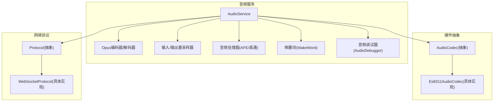
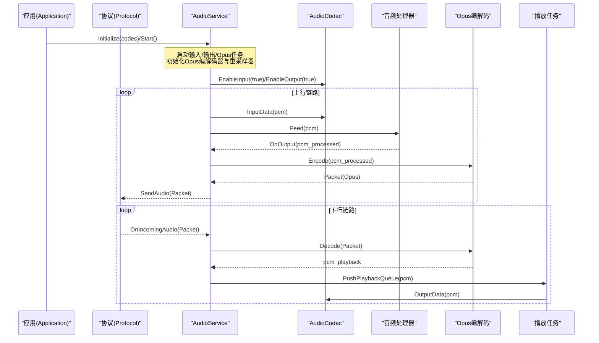
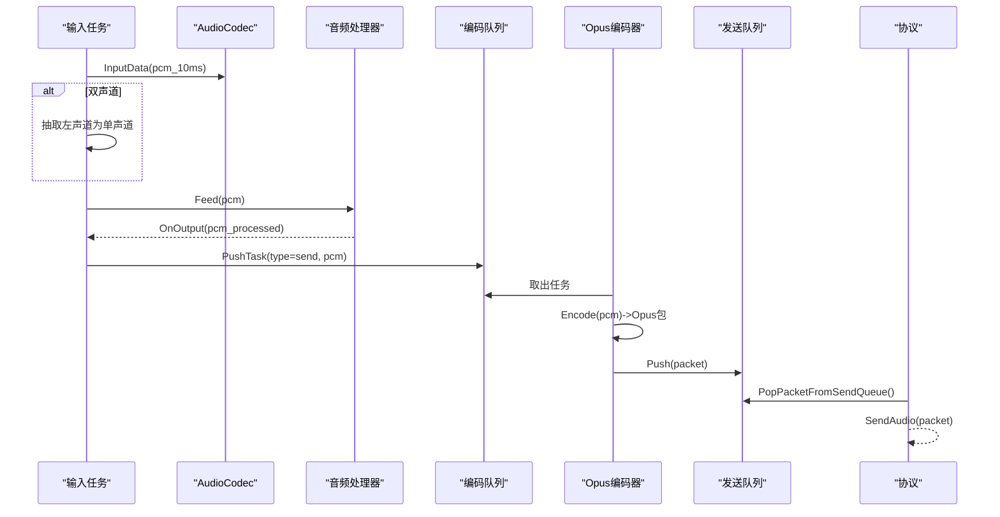
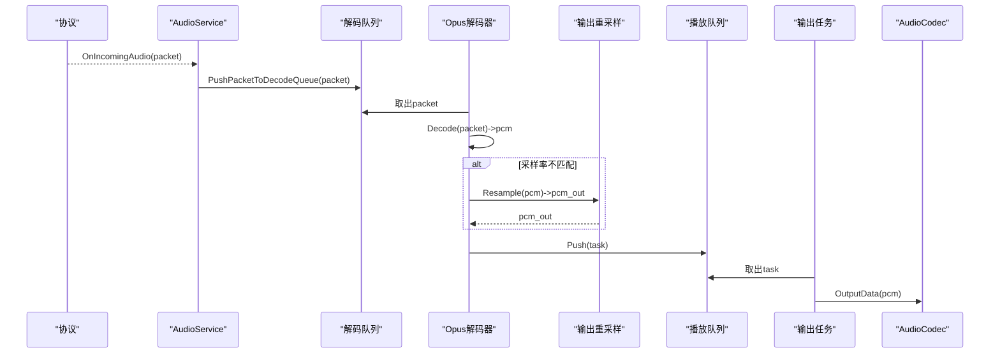
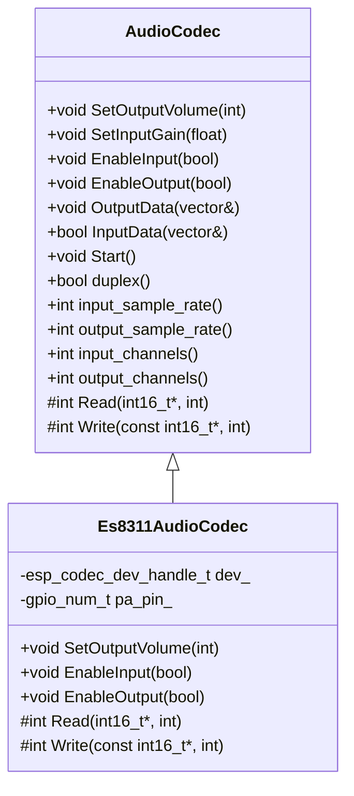
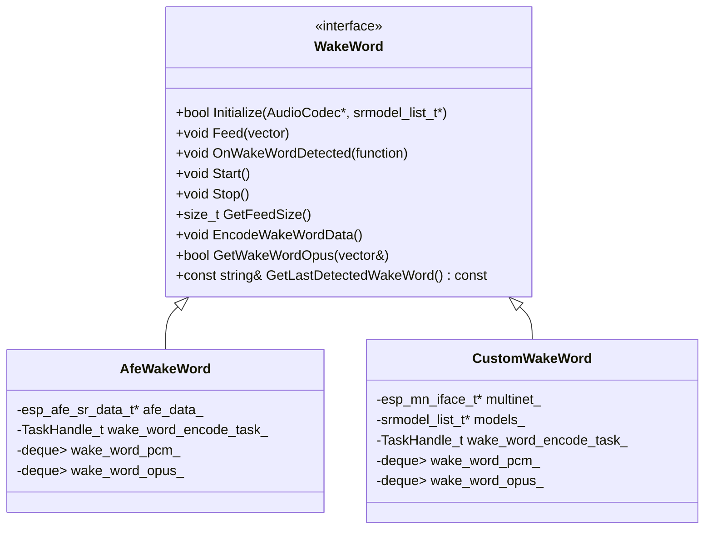
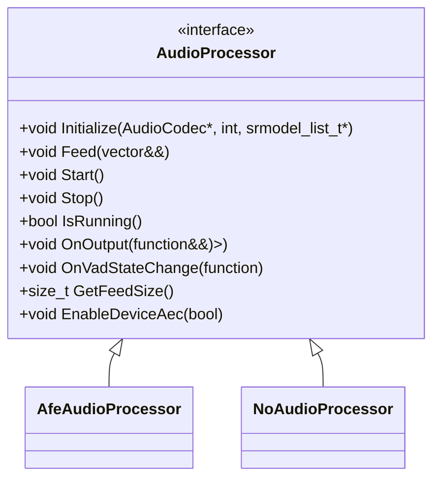
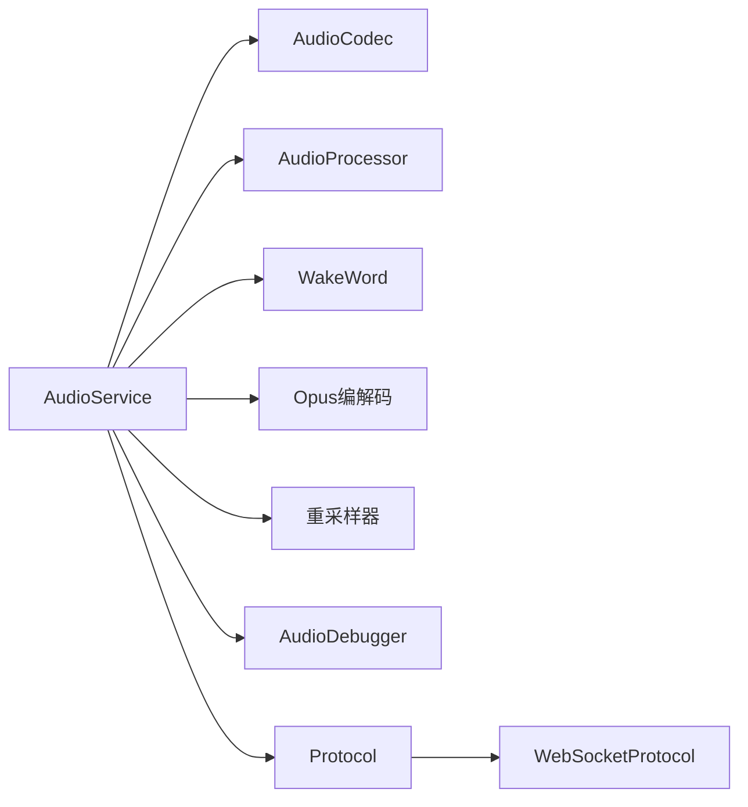

# 音频处理API

<cite>
**本文引用的文件**   
- [audio_service.h](file://main\audio\audio_service.h)
- [audio_service.cc](file://main\audio\audio_service.cc)
- [audio_codec.h](file://main\audio\audio_codec.h)
- [es8311_audio_codec.h](file://main\audio\codecs\es8311_audio_codec.h)
- [es8311_audio_codec.cc](file://main\audio\codecs\es8311_audio_codec.cc)
- [wake_word.h](file://main\audio\wake_word.h)
- [afe_wake_word.h](file://main\audio\wake_words\afe_wake_word.h)
- [custom_wake_word.h](file://main\audio\wake_words\custom_wake_word.h)
- [audio_processor.h](file://main\audio\audio_processor.h)
- [afe_audio_processor.h](file://main\audio\processors\afe_audio_processor.h)
- [no_audio_processor.h](file://main\audio\processors\no_audio_processor.h)
- [audio_debugger.h](file://main\audio\processors\audio_debugger.h)
- [protocol.h](file://main\protocols\protocol.h)
- [websocket_protocol.cc](file://main\protocols\websocket_protocol.cc)
- [application.cc](file://main\application.cc)
</cite>

## 目录
1. [简介](#简介)
2. [项目结构](#项目结构)
3. [核心组件](#核心组件)
4. [架构总览](#架构总览)
5. [详细组件分析](#详细组件分析)
6. [依赖关系分析](#依赖关系分析)
7. [性能与优化建议](#性能与优化建议)
8. [故障排查指南](#故障排查指南)
9. [结论](#结论)
10. [附录：数据格式与配置](#附录数据格式与配置)

## 简介
本文件为音频处理系统的完整API文档，聚焦以下能力：
- AudioService类对外接口：音频采集、播放、VAD检测、回声消除（设备侧/服务器侧）、唤醒词检测、音频测试等。
- 音频编解码器抽象AudioCodec的设计与具体实现注册方式（以ES8311为例）。
- 唤醒词检测WakeWord接口的设计模式与扩展方式（AfeWakeWord、CustomWakeWord）。
- 音频流处理的数据格式、采样率配置与缓冲区管理策略。
- 音频调试工具与性能优化建议。

## 项目结构
音频子系统位于 main/audio 下，围绕“采集->处理->编码->发送”和“接收->解码->播放”两条主路径组织；唤醒词与语音处理器作为可选模块接入。

图表来源
- [audio_service.h:105-195](file://main\audio\audio_service.h#L105-L195)
- [audio_service.cc:62-167](file://main\audio\audio_service.cc#L62-L167)
- [audio_codec.h:17-59](file://main\audio\audio_codec.h#L17-L59)
- [es8311_audio_codec.h:13-40](file://main\audio\codecs\es8311_audio_codec.h#L13-L40)
- [protocol.h:44-95](file://main\protocols\protocol.h#L44-L95)
- [websocket_protocol.cc:115-137](file://main\protocols\websocket_protocol.cc#L115-L137)

章节来源
- [audio_service.h:105-195](file://main\audio\audio_service.h#L105-L195)
- [audio_service.cc:62-167](file://main\audio\audio_service.cc#L62-L167)
- [audio_codec.h:17-59](file://main\audio\audio_codec.h#L17-L59)
- [es8311_audio_codec.h:13-40](file://main\audio\codecs\es8311_audio_codec.h#L13-L40)
- [protocol.h:44-95](file://main\protocols\protocol.h#L44-L95)
- [websocket_protocol.cc:115-137](file://main\protocols\websocket_protocol.cc#L115-L137)

## 核心组件
- AudioService：音频I/O编排中心，负责任务调度、队列缓冲、编解码、重采样、VAD/AEC开关、唤醒词集成与回调分发。
- AudioCodec：硬件音频抽象层，屏蔽不同Codec差异，提供统一输入/输出接口与参数查询。
- WakeWord：唤醒词检测抽象接口，支持多后端实现（AfeWakeWord、CustomWakeWord），由AudioService按模型列表动态选择。
- AudioProcessor：语音处理抽象（含VAD、AEC等），可切换为AFE实现或直通实现。
- Protocol：网络音频通道抽象，定义上行/下行音频包格式与事件回调。

章节来源
- [audio_service.h:105-195](file://main\audio\audio_service.h#L105-L195)
- [audio_codec.h:17-59](file://main\audio\audio_codec.h#L17-L59)
- [wake_word.h:11-24](file://main\audio\wake_word.h#L11-L24)
- [audio_processor.h:1-48](file://main\audio\audio_processor.h#L1-L48)
- [protocol.h:10-95](file://main\protocols\protocol.h#L10-L95)

## 架构总览
AudioService通过FreeRTOS任务将“采集/处理/编码/发送”与“解码/播放”解耦，使用条件变量与互斥锁协调多个队列，确保低延迟与稳定吞吐。

图表来源
- [audio_service.cc:125-167](file://main\audio\audio_service.cc#L125-L167)
- [audio_service.cc:230-288](file://main\audio\audio_service.cc#L230-L288)
- [audio_service.cc:327-446](file://main\audio\audio_service.cc#L327-L446)
- [audio_service.cc:290-325](file://main\audio\audio_service.cc#L290-L325)
- [websocket_protocol.cc:115-137](file://main\protocols\websocket_protocol.cc#L115-L137)
- [application.cc:498-502](file://main\application.cc#L498-L502)

## 详细组件分析

### AudioService API 总览
- 生命周期与控制
  - Initialize(AudioCodec* codec)：初始化编解码器、重采样器、处理器与定时器。
  - Start()/Stop()：创建并停止输入/输出/Opus任务，清理队列与事件组。
- 音频I/O
  - ReadAudioData(vector<int16_t>& data, int sample_rate, int samples)：从Codec读取PCM，必要时进行单声道抽取与重采样。
  - PushPacketToDecodeQueue(unique_ptr<AudioStreamPacket>, bool wait=false)：推入下行解码队列。
  - PopPacketFromSendQueue()：拉取已编码的上行数据包供协议发送。
  - PlaySound(const string_view& ogg)：本地OGG提示音播放（内部经OggDemuxer拆帧后进入解码队列）。
- 唤醒词
  - EnableWakeWordDetection(bool enable)：按需初始化并启动/停止唤醒词检测。
  - EncodeWakeWord()/PopWakeWordPacket()/GetLastWakeWord()：触发录制唤醒片段、获取Opus片段与最后识别结果。
- 语音处理与VAD/AEC
  - EnableVoiceProcessing(bool enable)：启用/禁用语音处理（含VAD），并在切换时重置重采样器状态。
  - EnableDeviceAec(bool enable)：开启/关闭设备侧AEC（需处理器支持）。
  - SetCallbacks(AudioServiceCallbacks&)：设置发送队列可用、唤醒词检测、VAD变化、测试队列满等回调。
- 状态与同步
  - IsIdle()/WaitForPlaybackQueueEmpty()/ResetDecoder()：空闲判断、等待播放队列为空、重置解码器与时间戳队列。
  - SetModelsList(srmodel_list_t*)：根据模型前缀自动选择AfeWakeWord或CustomWakeWord。
  - IsAfeWakeWord()：判断当前是否为Afe后端。

章节来源
- [audio_service.h:105-195](file://main\audio\audio_service.h#L105-L195)
- [audio_service.cc:62-123](file://main\audio\audio_service.cc#L62-L123)
- [audio_service.cc:125-182](file://main\audio\audio_service.cc#L125-L182)
- [audio_service.cc:184-228](file://main\audio\audio_service.cc#L184-L228)
- [audio_service.cc:230-288](file://main\audio\audio_service.cc#L230-L288)
- [audio_service.cc:290-325](file://main\audio\audio_service.cc#L290-L325)
- [audio_service.cc:327-446](file://main\audio\audio_service.cc#L327-L446)
- [audio_service.cc:448-504](file://main\audio\audio_service.cc#L448-L504)
- [audio_service.cc:506-547](file://main\audio\audio_service.cc#L506-L547)
- [audio_service.cc:549-627](file://main\audio\audio_service.cc#L549-L627)
- [audio_service.cc:633-680](file://main\audio\audio_service.cc#L633-L680)
- [audio_service.cc:682-735](file://main\audio\audio_service.cc#L682-L735)

#### 关键流程时序图（上行：采集->处理->编码->发送）

图表来源
- [audio_service.cc:230-288](file://main\audio\audio_service.cc#L230-L288)
- [audio_service.cc:327-446](file://main\audio\audio_service.cc#L327-L446)
- [audio_service.cc:520-529](file://main\audio\audio_service.cc#L520-L529)

#### 关键流程时序图（下行：接收->解码->播放）

图表来源
- [websocket_protocol.cc:115-137](file://main\protocols\websocket_protocol.cc#L115-L137)
- [audio_service.cc:327-446](file://main\audio\audio_service.cc#L327-L446)
- [audio_service.cc:290-325](file://main\audio\audio_service.cc#L290-L325)

### AudioCodec 抽象设计与实现
- 设计要点
  - 统一输入/输出接口：InputData/OutputData，以及Start、EnableInput/EnableOutput、SetOutputVolume/SetInputGain。
  - 参数查询：input_sample_rate/output_sample_rate/input_channels/output_channels/duplex/input_reference等。
  - 底层Read/Write为纯虚函数，由具体Codec实现（如ES8311基于esp_codec_dev与I2S）。
- 典型实现（ES8311）
  - 双工I2S通道创建、设备打开/关闭、PA控制、音量/增益设置。
  - 在EnableInput/EnableOutput中维护设备状态，避免频繁open/close。

图表来源
- [audio_codec.h:17-59](file://main\audio\audio_codec.h#L17-L59)
- [es8311_audio_codec.h:13-40](file://main\audio\codecs\es8311_audio_codec.h#L13-L40)
- [es8311_audio_codec.cc:70-98](file://main\audio\codecs\es8311_audio_codec.cc#L70-L98)
- [es8311_audio_codec.cc:158-202](file://main\audio\codecs\es8311_audio_codec.cc#L158-L202)

章节来源
- [audio_codec.h:17-59](file://main\audio\audio_codec.h#L17-L59)
- [es8311_audio_codec.h:13-40](file://main\audio\codecs\es8311_audio_codec.h#L13-L40)
- [es8311_audio_codec.cc:70-98](file://main\audio\codecs\es8311_audio_codec.cc#L70-L98)
- [es8311_audio_codec.cc:158-202](file://main\audio\codecs\es8311_audio_codec.cc#L158-L202)

### WakeWord 接口与实现
- 接口设计（WakeWord）
  - Initialize/Feed/Start/Stop：标准生命周期与数据喂入。
  - OnWakeWordDetected：检测结果回调。
  - GetFeedSize：适配不同后端所需的分片大小。
  - EncodeWakeWordData/GetWakeWordOpus：捕获并编码唤醒片段。
  - GetLastDetectedWakeWord：最近一次识别的关键词文本。
- 具体实现
  - AfeWakeWord：基于ESP-AFE的唤醒词检测，包含独立编码任务与队列缓存。
  - CustomWakeWord：基于Multinet的自定义唤醒词，支持命令解析与阈值配置。
- 选择策略
  - AudioService::SetModelsList根据模型前缀自动选择AfeWakeWord或CustomWakeWord，否则置空。

图表来源
- [wake_word.h:11-24](file://main\audio\wake_word.h#L11-L24)
- [afe_wake_word.h:22-60](file://main\audio\wake_words\afe_wake_word.h#L22-L60)
- [custom_wake_word.h:20-69](file://main\audio\wake_words\custom_wake_word.h#L20-L69)
- [audio_service.cc:700-726](file://main\audio\audio_service.cc#L700-L726)

章节来源
- [wake_word.h:11-24](file://main\audio\wake_word.h#L11-L24)
- [afe_wake_word.h:22-60](file://main\audio\wake_words\afe_wake_word.h#L22-L60)
- [custom_wake_word.h:20-69](file://main\audio\wake_words\custom_wake_word.h#L20-L69)
- [audio_service.cc:700-726](file://main\audio\audio_service.cc#L700-L726)

### 音频处理器（VAD/AEC）
- 抽象接口（AudioProcessor）
  - Initialize/Feed/Start/Stop/IsRunning：标准生命周期。
  - OnOutput/OnVadStateChange：输出处理后的PCM与说话状态变化。
  - GetFeedSize：适配分片大小。
  - EnableDeviceAec：设备侧AEC开关。
- 具体实现
  - AfeAudioProcessor：基于ESP-AFE的语音增强与VAD。
  - NoAudioProcessor：直通模式，仅透传PCM与最小开销。

图表来源
- [audio_processor.h:1-48](file://main\audio\audio_processor.h#L1-L48)
- [afe_audio_processor.h:17-46](file://main\audio\processors\afe_audio_processor.h#L17-L46)
- [no_audio_processor.h:11-33](file://main\audio\processors\no_audio_processor.h#L11-L33)

章节来源
- [audio_processor.h:1-48](file://main\audio\audio_processor.h#L1-L48)
- [afe_audio_processor.h:17-46](file://main\audio\processors\afe_audio_processor.h#L17-L46)
- [no_audio_processor.h:11-33](file://main\audio\processors\no_audio_processor.h#L11-L33)

### 音频调试工具
- AudioDebugger：在输入路径上对原始PCM数据进行UDP转发，便于离线分析与可视化。
- 使用方式：编译期启用相关宏后，AudioService会在读取到PCM后调用Feed(data)。

章节来源
- [audio_debugger.h:10-20](file://main\audio\processors\audio_debugger.h#L10-L20)
- [audio_service.cc:219-225](file://main\audio\audio_service.cc#L219-L225)

## 依赖关系分析
- 组件耦合
  - AudioService强依赖AudioCodec、AudioProcessor、WakeWord、Opus编解码与重采样器。
  - 协议层通过回调与AudioService交互，保持松耦合。
- 外部依赖
  - ESP-IDF I2S与esp_codec_dev用于硬件驱动。
  - esp_opus_enc/dec用于编解码。
  - esp_ae_rate_cvt用于重采样。
  - FreeRTOS任务、事件组、条件变量用于并发控制。

图表来源
- [audio_service.h:105-195](file://main\audio\audio_service.h#L105-L195)
- [protocol.h:44-95](file://main\protocols\protocol.h#L44-L95)
- [websocket_protocol.cc:115-137](file://main\protocols\websocket_protocol.cc#L115-L137)

章节来源
- [audio_service.h:105-195](file://main\audio\audio_service.h#L105-L195)
- [protocol.h:44-95](file://main\protocols\protocol.h#L44-L95)
- [websocket_protocol.cc:115-137](file://main\protocols\websocket_protocol.cc#L115-L137)

## 性能与优化建议
- 任务与队列
  - 输入/输出/Opus三任务分离，降低阻塞风险；合理设置队列上限（MAX_ENCODE_TASKS_IN_QUEUE、MAX_PLAYBACK_TASKS_IN_QUEUE、MAX_DECODE_PACKETS_IN_QUEUE、MAX_SEND_PACKETS_IN_QUEUE）以避免内存抖动。
- 编解码参数
  - 默认OPUS帧长60ms，兼顾延迟与压缩效率；可根据网络与端侧能力调整。
- 重采样
  - 仅在输入/输出采样率与目标不一致时启用，减少不必要的CPU消耗；切换模式时重置重采样器缓存，防止溢出。
- 电源管理
  - 无I/O超过阈值时自动关闭输入/输出，降低功耗；全双工场景注意TX时钟保持。
- VAD/AEC
  - 启用设备侧AEC需配合处理器支持；服务器侧AEC可通过时间戳队列辅助对齐。
- 调试
  - 启用AudioDebugger导出原始PCM，结合频谱/波形工具定位噪声与失真问题。

[本节为通用指导，无需源码引用]

## 故障排查指南
- 常见问题
  - 无法采集：检查EnableInput是否生效、输入采样率与重采样器配置、I2S引脚与设备状态。
  - 无声播放：确认EnableOutput、输出采样率与重采样器、播放队列是否被消费。
  - 唤醒词无响应：确认模型列表加载成功、WakeWord后端初始化与Start调用、GetFeedSize与Feed步长一致。
  - 回声严重：评估设备侧AEC是否启用且处理器支持；必要时切换到服务器侧AEC。
- 定位手段
  - 查看日志中的错误码与队列长度告警。
  - 使用AudioDebugger导出PCM，验证信号链路与噪声水平。
  - 通过IsIdle/WaitForPlaybackQueueEmpty判断系统是否卡滞。

章节来源
- [audio_service.cc:682-698](file://main\audio\audio_service.cc#L682-L698)
- [audio_service.cc:219-225](file://main\audio\audio_service.cc#L219-L225)
- [audio_service.cc:506-518](file://main\audio\audio_service.cc#L506-L518)
- [audio_service.cc:656-680](file://main\audio\audio_service.cc#L656-L680)

## 结论
AudioService提供了完整的音频流水线封装，结合AudioCodec抽象与WakeWord/AudioProcessor插件化设计，实现了跨平台、可扩展的语音交互能力。通过合理的任务划分、队列管理与重采样策略，系统在低功耗设备上也能获得稳定的实时体验。

[本节为总结性内容，无需源码引用]

## 附录：数据格式与配置
- 音频流包结构（AudioStreamPacket）
  - sample_rate：采样率（Hz）
  - frame_duration：帧时长（ms）
  - timestamp：毫秒级时间戳（用于服务器侧AEC）
  - payload：二进制负载（通常为Opus帧）
- 协议字段说明
  - BinaryProtocol2/BinaryProtocol3：网络传输的二进制帧格式，包含类型、负载长度与payload。
- 采样率与帧长
  - 上行固定16kHz，OPUS帧长默认60ms；下行采样率与帧长由服务端协商，可能触发输出重采样。
- 缓冲区管理
  - 编码队列、解码队列、播放队列、测试队列分别限制最大条目数，避免内存增长与卡顿。
- 回调与事件
  - on_send_queue_available：上行编码完成，通知上层尽快取走数据包。
  - on_wake_word_detected：唤醒词识别结果回调。
  - on_vad_change：说话状态变化回调。
  - on_audio_testing_queue_full：音频测试队列满，自动停止测试。

章节来源
- [protocol.h:10-31](file://main\protocols\protocol.h#L10-L31)
- [websocket_protocol.cc:115-137](file://main\protocols\websocket_protocol.cc#L115-L137)
- [audio_service.h:78-83](file://main\audio\audio_service.h#L78-L83)
- [audio_service.cc:327-446](file://main\audio\audio_service.cc#L327-L446)
- [audio_service.cc:506-518](file://main\audio\audio_service.cc#L506-L518)
- [audio_service.cc:606-617](file://main\audio\audio_service.cc#L606-L617)