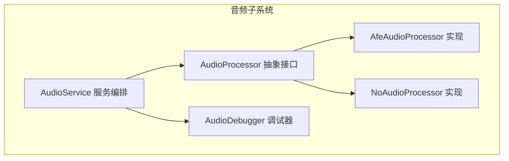
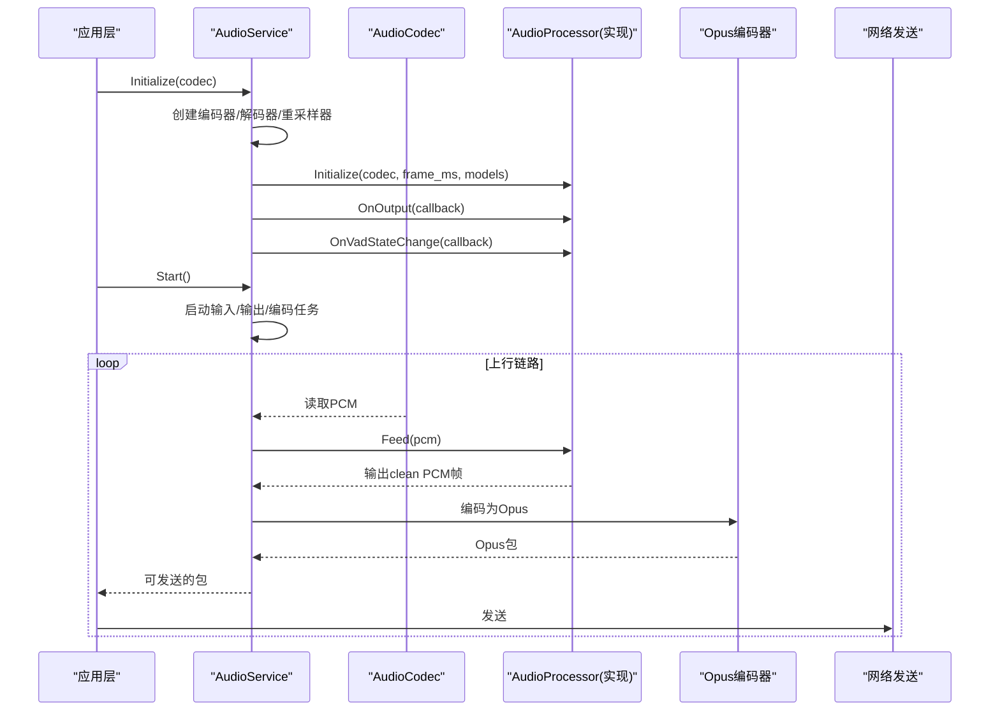
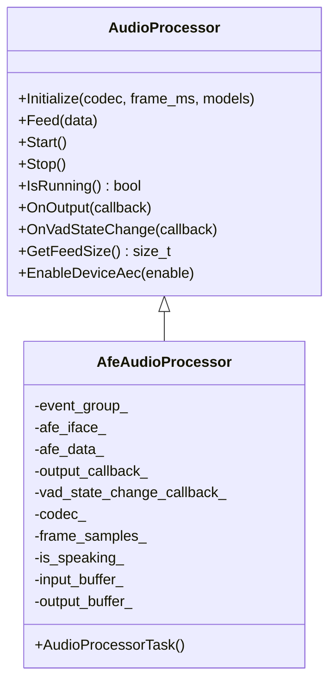
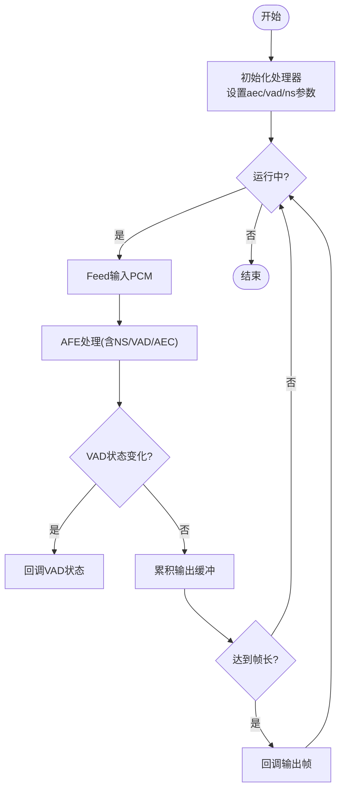
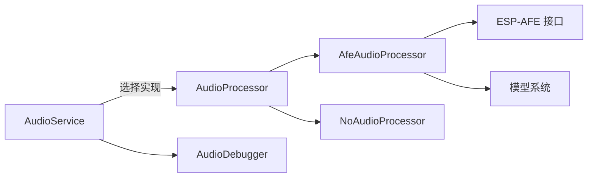

# 音频处理器API

<cite>
**本文引用的文件**   
- [audio_processor.h](file://main/audio/audio_processor.h)
- [afe_audio_processor.h](file://main/audio/processors/afe_audio_processor.h)
- [afe_audio_processor.cc](file://main/audio/processors/afe_audio_processor.cc)
- [no_audio_processor.h](file://main/audio/processors/no_audio_processor.h)
- [no_audio_processor.cc](file://main/audio/processors/no_audio_processor.cc)
- [audio_debugger.h](file://main/audio/processors/audio_debugger.h)
- [audio_debugger.cc](file://main/audio/processors/audio_debugger.cc)
- [audio_service.h](file://main/audio/audio_service.h)
- [audio_service.cc](file://main/audio/audio_service.cc)
- [README.md](file://main/audio/README.md)
</cite>

## 目录
1. [简介](#简介)
2. [项目结构](#项目结构)
3. [核心组件](#核心组件)
4. [架构总览](#架构总览)
5. [详细组件分析](#详细组件分析)
6. [依赖关系分析](#依赖关系分析)
7. [性能与延迟特性](#性能与延迟特性)
8. [自定义音频处理器开发指南](#自定义音频处理器开发指南)
9. [调试与质量评估](#调试与质量评估)
10. [故障排查](#故障排查)
11. [结论](#结论)

## 简介
本文件面向开发者，提供音频处理器模块的完整API文档。内容覆盖：
- AudioProcessor抽象接口的设计模式与扩展机制
- AFE Audio Processor与No Audio Processor的功能特性与配置选项
- 音频信号处理流水线（VAD、回声消除AEC、噪声抑制NS）集成方式
- 自定义音频处理器的实现规范（数据格式、延迟、内存优化）
- 音频质量评估指标与调试工具使用方法

## 项目结构
音频相关代码位于 main/audio 目录，核心包括：
- 抽象接口与处理器实现：audio_processor.h、processors/*
- 音频服务编排：audio_service.h/cc
- 调试工具：audio_debugger.*
- 流程说明：README.md

图表来源
- [audio_processor.h:1-27](file://main/audio/audio_processor.h#L1-L27)
- [afe_audio_processor.h:1-48](file://main/audio/processors/afe_audio_processor.h#L1-L48)
- [no_audio_processor.h:1-35](file://main/audio/processors/no_audio_processor.h#L1-L35)
- [audio_debugger.h:1-22](file://main/audio/processors/audio_debugger.h#L1-L22)
- [audio_service.h:105-195](file://main/audio/audio_service.h#L105-L195)

章节来源
- [audio_processor.h:1-27](file://main/audio/audio_processor.h#L1-L27)
- [audio_service.h:105-195](file://main/audio/audio_service.h#L105-L195)

## 核心组件
- AudioProcessor 抽象接口
  - Initialize(codec, frame_duration_ms, models_list)：初始化处理器，绑定编解码器与模型列表
  - Feed(data)：输入PCM帧数据
  - Start()/Stop()/IsRunning()：生命周期控制
  - OnOutput(callback)/OnVadStateChange(callback)：输出回调与VAD状态变更回调
  - GetFeedSize()：获取期望的输入分片大小
  - EnableDeviceAec(enable)：启用/禁用设备端AEC（若支持）

- AfeAudioProcessor
  - 基于ESP-AFE的语音增强链路，包含NS/VAD/AEC等能力
  - 内部维护事件组与任务，负责从AFE拉取结果并回调上层
  - 支持通过编译开关选择是否使用设备AEC

- NoAudioProcessor
  - 直通型处理器，不做复杂算法处理
  - 将输入按帧切分后直接输出，便于无算法场景或测试

- AudioDebugger
  - 可选UDP调试通道，将PCM数据发送到指定服务器用于离线分析

章节来源
- [audio_processor.h:11-24](file://main/audio/audio_processor.h#L11-L24)
- [afe_audio_processor.h:17-46](file://main/audio/processors/afe_audio_processor.h#L17-L46)
- [no_audio_processor.h:11-33](file://main/audio/processors/no_audio_processor.h#L11-L33)
- [audio_debugger.h:10-21](file://main/audio/processors/audio_debugger.h#L10-L21)

## 架构总览
AudioService 作为音频子系统的编排者，负责：
- 创建并管理编码器/解码器、重采样器
- 根据配置选择 AfeAudioProcessor 或 NoAudioProcessor
- 注册输出与VAD回调，驱动编码与发送队列
- 启动输入/输出/编码三个任务，形成并发流水线

图表来源
- [audio_service.cc:62-123](file://main/audio/audio_service.cc#L62-L123)
- [audio_service.cc:125-167](file://main/audio/audio_service.cc#L125-L167)
- [audio_service.h:105-195](file://main/audio/audio_service.h#L105-L195)

章节来源
- [audio_service.cc:62-123](file://main/audio/audio_service.cc#L62-L123)
- [audio_service.cc:125-167](file://main/audio/audio_service.cc#L125-L167)
- [audio_service.h:105-195](file://main/audio/audio_service.h#L105-L195)

## 详细组件分析

### AudioProcessor 抽象接口
- 设计要点
  - 统一输入输出契约：以 int16_t PCM 向量传递，单位帧长度由 GetFeedSize 告知
  - 回调解耦：输出与VAD状态通过函数对象注入，避免强耦合
  - 设备AEC开关：EnableDeviceAec 允许运行时切换设备端AEC（取决于实现）

- 关键方法语义
  - Initialize：完成内部资源准备与参数计算（如帧样本数）
  - Feed：接收上游PCM，内部缓冲并按帧产出
  - Start/Stop/IsRunning：控制运行态，保证线程安全
  - OnOutput/OnVadStateChange：设置回调，供上层消费
  - GetFeedSize：返回期望的输入块大小，便于上游对齐
  - EnableDeviceAec：按需开启/关闭设备AEC

章节来源
- [audio_processor.h:11-24](file://main/audio/audio_processor.h#L11-L24)

### AfeAudioProcessor 实现
- 功能特性
  - 基于ESP-AFE构建语音增强链路，支持噪声抑制(NS)、VAD、AEC
  - 自动根据输入声道与参考通道构造输入格式字符串
  - 支持加载外部模型或通过默认路径初始化
  - 内部任务循环拉取处理结果，触发VAD状态变化与输出回调
  - 支持通过编译开关 CONFIG_USE_DEVICE_AEC 启用设备AEC

- 配置项与行为
  - afe_config_init 指定类型与性能模式
  - aec_mode/vad_mode/vad_min_noise_ms 等参数可调
  - ns_init/ns_model_name/afe_ns_mode 控制噪声抑制
  - memory_alloc_mode 可选择PSRAM分配以降低SRAM压力
  - 当未启用设备AEC时，内部会启用软件VAD；启用设备AEC时会关闭软件VAD

- 线程与同步
  - 使用事件组控制任务启停
  - Feed 使用互斥锁保护输入缓冲，避免与 Stop 竞态
  - 输出缓冲按目标帧长切分，减少拷贝与分配

图表来源
- [audio_processor.h:11-24](file://main/audio/audio_processor.h#L11-L24)
- [afe_audio_processor.h:17-46](file://main/audio/processors/afe_audio_processor.h#L17-L46)

章节来源
- [afe_audio_processor.cc:13-75](file://main/audio/processors/afe_audio_processor.cc#L13-L75)
- [afe_audio_processor.cc:91-121](file://main/audio/processors/afe_audio_processor.cc#L91-L121)
- [afe_audio_processor.cc:135-187](file://main/audio/processors/afe_audio_processor.cc#L135-L187)
- [afe_audio_processor.cc:189-201](file://main/audio/processors/afe_audio_processor.cc#L189-L201)

### NoAudioProcessor 实现
- 功能特性
  - 直通处理，不做算法增强
  - 自动将立体声转换为单声道（若输入为双声道）
  - 按固定帧长切分输出，便于上层编码

- 适用场景
  - 无需AEC/NS/VAD的简单通路
  - 快速验证上层逻辑或进行基准测试

章节来源
- [no_audio_processor.cc:6-10](file://main/audio/processors/no_audio_processor.cc#L6-L10)
- [no_audio_processor.cc:12-37](file://main/audio/processors/no_audio_processor.cc#L12-L37)
- [no_audio_processor.cc:67-71](file://main/audio/processors/no_audio_processor.cc#L67-L71)

### AudioDebugger 调试器
- 功能特性
  - 通过UDP将PCM数据发送至配置的服务器地址
  - 支持在构建期通过宏开关启用/禁用
  - 提供简单的日志记录与错误提示

- 使用建议
  - 在开发阶段开启，配合上位机脚本进行波形/频谱分析
  - 生产环境建议关闭以减少开销

章节来源
- [audio_debugger.cc:16-43](file://main/audio/processors/audio_debugger.cc#L16-L43)
- [audio_debugger.cc:54-66](file://main/audio/processors/audio_debugger.cc#L54-L66)

### 音频流水线集成（VAD/AEC/NS）
- VAD
  - AfeAudioProcessor 内部监听 VAD_SPEECH/VAD_SILENCE 状态变化，并通过 OnVadStateChange 回调通知上层
  - AudioService 将VAD状态映射到 voice_detected_ 并转发给上层回调

- AEC
  - 可通过编译开关 CONFIG_USE_DEVICE_AEC 启用设备端AEC
  - 运行时调用 EnableDeviceAec(true/false) 动态切换，内部会相应启用/禁用AEC与VAD

- NS
  - 若存在噪声抑制模型，则初始化并启用网络模式噪声抑制

图表来源
- [afe_audio_processor.cc:135-187](file://main/audio/processors/afe_audio_processor.cc#L135-L187)
- [audio_service.cc:101-110](file://main/audio/audio_service.cc#L101-L110)

章节来源
- [afe_audio_processor.cc:13-75](file://main/audio/processors/afe_audio_processor.cc#L13-L75)
- [audio_service.cc:101-110](file://main/audio/audio_service.cc#L101-L110)

## 依赖关系分析
- AudioService 依赖 AudioProcessor 抽象接口，具体实现由编译配置决定
- AfeAudioProcessor 依赖 ESP-AFE 接口与模型系统
- NoAudioProcessor 仅依赖 AudioCodec 与标准库
- AudioDebugger 可选依赖网络栈与配置宏

图表来源
- [audio_service.cc:25-29](file://main/audio/audio_service.cc#L25-L29)
- [audio_service.cc:95-99](file://main/audio/audio_service.cc#L95-L99)
- [afe_audio_processor.cc:30-38](file://main/audio/processors/afe_audio_processor.cc#L30-L38)

章节来源
- [audio_service.cc:25-29](file://main/audio/audio_service.cc#L25-L29)
- [audio_service.cc:95-99](file://main/audio/audio_service.cc#L95-L99)

## 性能与延迟特性
- 帧时长
  - 全局采用 OPUS_FRAME_DURATION_MS=60ms，影响端到端延迟与编码效率
- 任务与队列
  - 输入/输出/编码三任务并行，队列容量上限已定义，避免内存暴涨
- 内存策略
  - AfeAudioProcessor 支持 PSRAM 分配以降低SRAM占用
  - 输出缓冲预分配与移动语义减少拷贝与分配
- 重采样
  - 当硬件采样率非16kHz时，使用重采样器统一到16kHz，确保算法一致性

章节来源
- [audio_service.h:39-46](file://main/audio/audio_service.h#L39-L46)
- [audio_service.cc:86-93](file://main/audio/audio_service.cc#L86-L93)
- [afe_audio_processor.cc:57-58](file://main/audio/processors/afe_audio_processor.cc#L57-L58)
- [README.md:14-84](file://main/audio/README.md#L14-L84)

## 自定义音频处理器开发指南
- 数据格式要求
  - 输入/输出均为 std::vector<int16_t> PCM
  - 采样率通常为16kHz，声道数由 AudioCodec 暴露的 input_channels 决定
  - 帧长度通过 GetFeedSize 返回，上游需按该大小喂入数据
- 处理延迟限制
  - 建议保持每帧处理时间小于等于帧时长（例如60ms），避免队列积压
  - 避免在回调中进行阻塞操作，必要时使用异步队列
- 内存使用优化
  - 预分配输出缓冲，减少频繁分配
  - 使用移动语义传递大对象，降低拷贝成本
  - 对大数据路径考虑PSRAM分配（参考 AfeAudioProcessor）
- 线程安全
  - Feed 与 Stop 之间需避免TOCTOU问题，建议在锁内检查运行态
  - 回调执行上下文可能来自后台任务，注意不可重入与耗时操作
- 回调约定
  - OnOutput：每次回调一个完整帧
  - OnVadStateChange：仅在状态变化时回调，避免抖动
- 设备AEC
  - 若平台支持设备AEC，可在 EnableDeviceAec(true) 时启用，并在 false 时恢复VAD

章节来源
- [audio_processor.h:15-23](file://main/audio/audio_processor.h#L15-L23)
- [afe_audio_processor.cc:91-107](file://main/audio/processors/afe_audio_processor.cc#L91-L107)
- [no_audio_processor.cc:12-37](file://main/audio/processors/no_audio_processor.cc#L12-L37)

## 调试与质量评估
- 音频调试器
  - 启用条件：构建宏 CONFIG_USE_AUDIO_DEBUGGER
  - 配置项：CONFIG_AUDIO_DEBUG_UDP_SERVER（格式 IP:PORT）
  - 用法：在合适位置调用 Feed(const std::vector<int16_t>& data) 发送PCM
- 质量评估指标
  - 端到端延迟：从麦克风采集到网络发送的时间
  - 丢帧率：队列满导致的丢弃比例
  - CPU占用：各任务CPU使用率
  - 内存峰值：SRAM/PSRAM使用量
  - VAD准确率：误报/漏报统计
- 定位手段
  - 使用 AudioDebugger 抓取原始/处理后PCM进行离线分析
  - 结合日志标签（TAG）与事件组状态判断运行态
  - 观察队列长度与回调频率，识别瓶颈点

章节来源
- [audio_debugger.cc:16-43](file://main/audio/processors/audio_debugger.cc#L16-L43)
- [audio_debugger.cc:54-66](file://main/audio/processors/audio_debugger.cc#L54-L66)
- [audio_service.h:98-103](file://main/audio/audio_service.h#L98-L103)

## 故障排查
- 常见问题
  - 无输出：检查 IsRunning 状态与回调是否注册
  - 卡顿/爆音：检查 GetFeedSize 与上游喂入是否对齐
  - VAD不触发：确认模型加载与VAD初始化成功
  - AEC无效：确认编译开关与 EnableDeviceAec 调用顺序
- 诊断步骤
  - 打印初始化日志与AFE配置
  - 抓取PCM流对比前后效果
  - 监控队列长度与任务堆栈使用情况

章节来源
- [afe_audio_processor.cc:13-75](file://main/audio/processors/afe_audio_processor.cc#L13-L75)
- [audio_service.cc:101-110](file://main/audio/audio_service.cc#L101-L110)

## 结论
本模块通过统一的 AudioProcessor 抽象接口实现了可扩展的音频处理管线。AfeAudioProcessor 提供完整的语音增强能力（NS/VAD/AEC），NoAudioProcessor 提供轻量直通方案。AudioService 负责任务编排与队列调度，结合调试器可实现端到端的开发与质量评估。遵循本文的开发指南与最佳实践，可高效定制与优化音频处理流程。