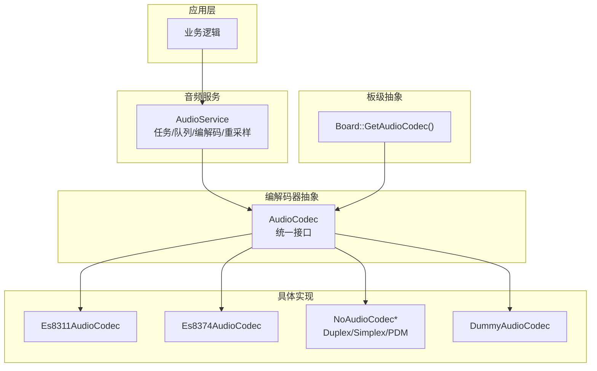
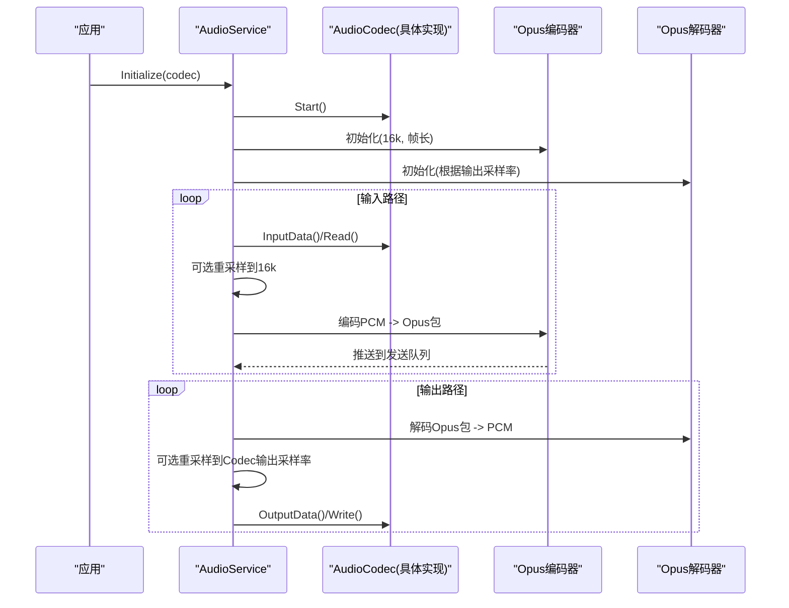
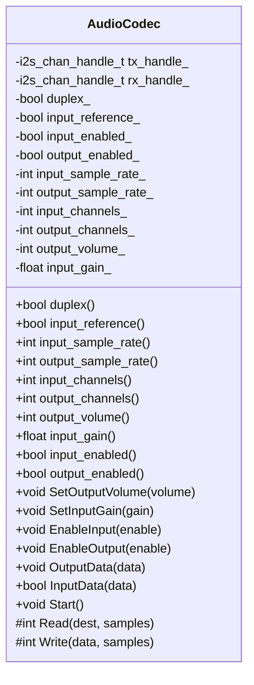
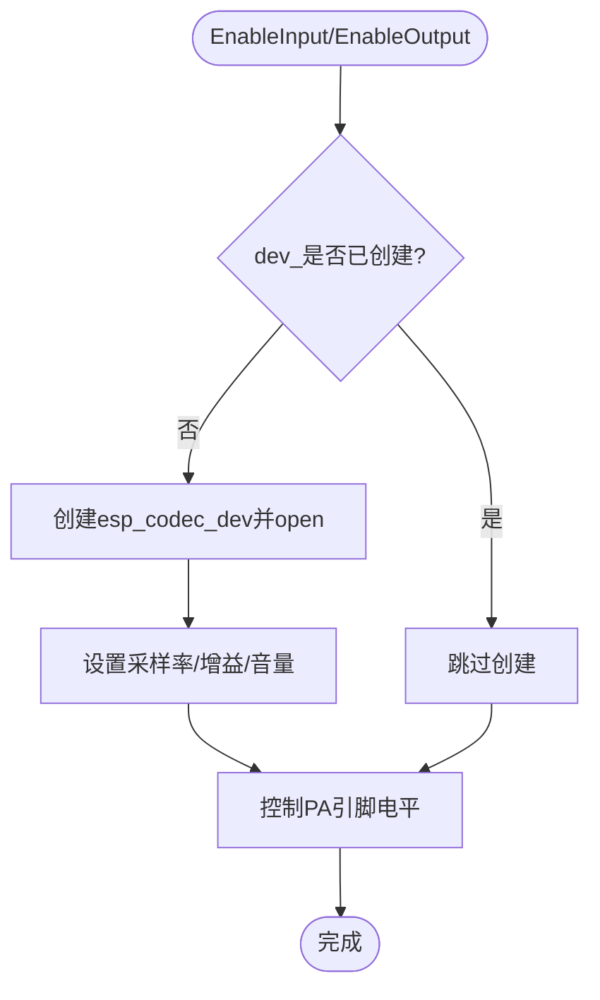
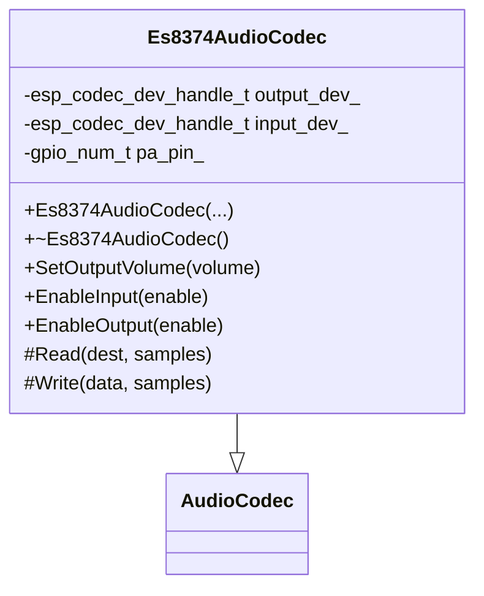
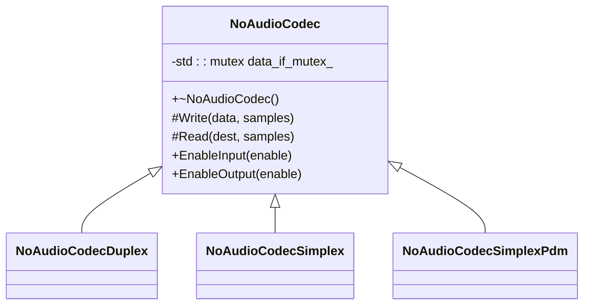
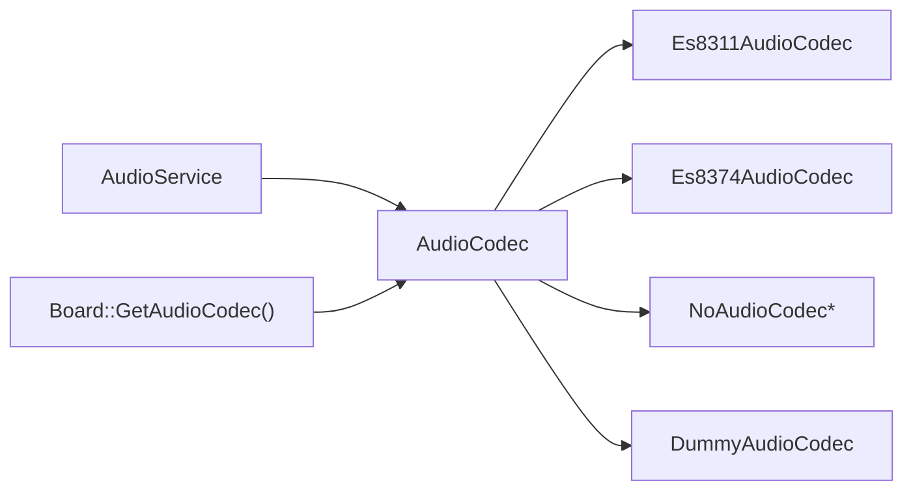

# 音频编解码器API

<cite>
**本文引用的文件**   
- [audio_codec.h](file://main/audio/audio_codec.h)
- [es8311_audio_codec.h](file://main/audio/codecs/es8311_audio_codec.h)
- [es8311_audio_codec.cc](file://main/audio/codecs/es8311_audio_codec.cc)
- [es8374_audio_codec.h](file://main/audio/codecs/es8374_audio_codec.h)
- [es8374_audio_codec.cc](file://main/audio/codecs/es8374_audio_codec.cc)
- [no_audio_codec.h](file://main/audio/codecs/no_audio_codec.h)
- [no_audio_codec.cc](file://main/audio/codecs/no_audio_codec.cc)
- [dummy_audio_codec.h](file://main/audio/codecs/dummy_audio_codec.h)
- [dummy_audio_codec.cc](file://main/audio/codecs/dummy_audio_codec.cc)
- [audio_service.h](file://main/audio/audio_service.h)
- [audio_service.cc](file://main/audio/audio_service.cc)
- [board.h](file://main/boards/common/board.h)
- [board.cc](file://main/boards/common/board.cc)
</cite>

## 目录
1. [简介](#简介)
2. [项目结构](#项目结构)
3. [核心组件](#核心组件)
4. [架构总览](#架构总览)
5. [详细组件分析](#详细组件分析)
6. [依赖关系分析](#依赖关系分析)
7. [性能与功耗特性](#性能与功耗特性)
8. [故障排查指南](#故障排查指南)
9. [结论](#结论)
10. [附录：开发指南与示例](#附录开发指南与示例)

## 简介
本文件面向“音频编解码器抽象层”的完整API文档，覆盖以下目标：
- AudioCodec基类的设计模式与接口定义（生命周期、I/O、音量/增益控制等）
- 具体编解码器实现（ES8311、ES8374、NoAudioCodec、DummyAudioCodec等）的特性与配置项
- 音频设备注册机制、动态切换与错误处理策略
- 自定义音频编解码器的开发指南（硬件适配、驱动集成、性能优化）
- 音频路由、音量控制与格式转换的API使用要点与流程说明

## 项目结构
音频子系统位于 main/audio 下，包含：
- 抽象层：audio_codec.h 定义统一接口
- 具体实现：codecs 目录下多种硬件编解码器实现
- 上层服务：audio_service.h/cc 负责任务调度、编码/解码、重采样、唤醒词与VAD等
- 板级抽象：boards/common/board.h/cc 提供 GetAudioCodec() 获取当前板载音频设备

图表来源
- [audio_service.h:105-195](file://main/audio/audio_service.h#L105-L195)
- [audio_codec.h:17-59](file://main/audio/audio_codec.h#L17-L59)
- [es8311_audio_codec.h:13-40](file://main/audio/codecs/es8311_audio_codec.h#L13-L40)
- [es8374_audio_codec.h:13-39](file://main/audio/codecs/es8374_audio_codec.h#L13-L39)
- [no_audio_codec.h:10-41](file://main/audio/codecs/no_audio_codec.h#L10-L41)
- [dummy_audio_codec.h:6-14](file://main/audio/codecs/dummy_audio_codec.h#L6-L14)
- [board.h:49-85](file://main/boards/common/board.h#L49-L85)

章节来源
- [audio_codec.h:17-59](file://main/audio/audio_codec.h#L17-L59)
- [audio_service.h:105-195](file://main/audio/audio_service.h#L105-L195)
- [board.h:49-85](file://main/boards/common/board.h#L49-L85)

## 核心组件
- AudioCodec 抽象基类
  - 职责：统一输入输出接口、音量/增益控制、通道/采样率属性访问、双工标志等
  - 关键方法：SetOutputVolume、SetInputGain、EnableInput、EnableOutput、OutputData、InputData、Start
  - 内部状态：duplex_/input_reference_/sample rates/channels/volume/gain/enabled flags
  - 纯虚接口：Read/Write 由具体实现完成底层I/O

- NoAudioCodec 系列
  - 直接基于ESP-IDF I2S/PDM进行读写，适合无外部CODEC或仅I2S/PDM麦克风的场景
  - 提供 Duplex、Simplex、SimplexPdm 三种形态

- Es8311AudioCodec / Es8374AudioCodec
  - 基于 esp_codec_dev 框架，封装 I2S + I2C 控制路径
  - 支持PA引脚控制、独立输入/输出设备句柄（部分实现）

- DummyAudioCodec
  - 空实现，用于测试/仿真链路

章节来源
- [audio_codec.h:17-59](file://main/audio/audio_codec.h#L17-L59)
- [no_audio_codec.h:10-41](file://main/audio/codecs/no_audio_codec.h#L10-L41)
- [es8311_audio_codec.h:13-40](file://main/audio/codecs/es8311_audio_codec.h#L13-L40)
- [es8374_audio_codec.h:13-39](file://main/audio/codecs/es8374_audio_codec.h#L13-L39)
- [dummy_audio_codec.h:6-14](file://main/audio/codecs/dummy_audio_codec.h#L6-L14)

## 架构总览
AudioService 作为音频数据流的中枢，管理：
- 输入任务：从 Codec 读取PCM，可选重采样至16k，喂给唤醒词/语音处理器
- 输出任务：从播放队列取PCM，通过 Codec 写出
- Opus编解码任务：将PCM编码为Opus包入发送队列；将网络Opus包解码为PCM入播放队列
- 事件与回调：VAD变化、唤醒词检测、发送队列可用通知
- 电源管理：空闲时关闭输入/输出以省电

图表来源
- [audio_service.cc:62-123](file://main/audio/audio_service.cc#L62-L123)
- [audio_service.cc:125-167](file://main/audio/audio_service.cc#L125-L167)
- [audio_service.cc:230-288](file://main/audio/audio_service.cc#L230-L288)
- [audio_service.cc:290-325](file://main/audio/audio_service.cc#L290-L325)
- [audio_service.cc:327-446](file://main/audio/audio_service.cc#L327-L446)

章节来源
- [audio_service.h:105-195](file://main/audio/audio_service.h#L105-L195)
- [audio_service.cc:62-123](file://main/audio/audio_service.cc#L62-L123)

## 详细组件分析

### AudioCodec 基类设计
- 设计模式
  - 模板方法：公共流程在基类中组织，具体I/O由子类实现 Read/Write
  - 工厂/注册：通过 Board::GetAudioCodec() 返回具体实例，便于按板型切换
- 接口概览
  - 生命周期：Start() 启动底层I2S通道；EnableInput/EnableOutput 按需启停
  - 控制：SetOutputVolume/SetInputGain
  - I/O：OutputData/InputData 调用 Write/Read
  - 查询：duplex/input_reference/sample rates/channels/volume/gain/enabled
- 复杂度与线程安全
  - 多数实现使用互斥锁保护 data_if_ 相关操作，避免并发冲突
  - 典型时间复杂度：O(n) 对每帧样本进行线性读写

图表来源
- [audio_codec.h:17-59](file://main/audio/audio_codec.h#L17-L59)

章节来源
- [audio_codec.h:17-59](file://main/audio/audio_codec.h#L17-L59)

### Es8311AudioCodec
- 特性
  - 双工I2S通道创建，复用同一esp_codec_dev实例
  - 支持PA引脚控制（可反相），MCLK可选
  - 通过 audio_codec_i2s_data / i2c_ctrl / gpio_if 组合驱动
- 关键流程
  - 构造：设置参数、创建I2S通道、创建codec_if/data_if/gpio_if
  - UpdateDeviceState：根据输入/输出使能状态打开/关闭设备并控制PA电平
  - Read/Write：仅在对应方向启用时执行实际I/O
- 错误处理
  - 使用 ESP_ERROR_CHECK 与日志记录失败路径

图表来源
- [es8311_audio_codec.cc:70-98](file://main/audio/codecs/es8311_audio_codec.cc#L70-L98)
- [es8311_audio_codec.cc:158-188](file://main/audio/codecs/es8311_audio_codec.cc#L158-L188)
- [es8311_audio_codec.cc:190-202](file://main/audio/codecs/es8311_audio_codec.cc#L190-L202)

章节来源
- [es8311_audio_codec.h:13-40](file://main/audio/codecs/es8311_audio_codec.h#L13-L40)
- [es8311_audio_codec.cc:7-68](file://main/audio/codecs/es8311_audio_codec.cc#L7-L68)
- [es8311_audio_codec.cc:100-156](file://main/audio/codecs/es8311_audio_codec.cc#L100-L156)
- [es8311_audio_codec.cc:158-202](file://main/audio/codecs/es8311_audio_codec.cc#L158-L202)

### Es8374AudioCodec
- 特性
  - 分别创建输入/输出 esp_codec_dev 句柄，独立控制
  - 支持PA引脚控制，开启/关闭时设置电平
- 关键流程
  - 构造：创建I2S通道、data_if/ctrl_if/gpio_if、分别new出output_dev_/input_dev_
  - EnableInput/EnableOutput：open/close对应设备并设置参数
  - Read/Write：仅在对应方向启用时执行I/O

图表来源
- [es8374_audio_codec.h:13-39](file://main/audio/codecs/es8374_audio_codec.h#L13-L39)
- [es8374_audio_codec.cc:7-74](file://main/audio/codecs/es8374_audio_codec.cc#L7-L74)
- [es8374_audio_codec.cc:134-200](file://main/audio/codecs/es8374_audio_codec.cc#L134-L200)

章节来源
- [es8374_audio_codec.h:13-39](file://main/audio/codecs/es8374_audio_codec.h#L13-L39)
- [es8374_audio_codec.cc:7-74](file://main/audio/codecs/es8374_audio_codec.cc#L7-L74)
- [es8374_audio_codec.cc:76-132](file://main/audio/codecs/es8374_audio_codec.cc#L76-L132)
- [es8374_audio_codec.cc:134-200](file://main/audio/codecs/es8374_audio_codec.cc#L134-L200)

### NoAudioCodec 系列
- 适用场景
  - 无外部CODEC芯片，直接使用I2S（标准模式）或PDM麦克风
- 主要类型
  - NoAudioCodecDuplex：单I2S端口双工
  - NoAudioCodecSimplex：两个I2S端口，分别用于扬声器与麦克风
  - NoAudioCodecSimplexPdm：扬声器I2S + PDM麦克风
- 关键点
  - 写入时进行音量缩放（平方律映射），读入时进行位宽转换与限幅
  - 通过互斥锁保护I2S通道启用/禁用与读写

图表来源
- [no_audio_codec.h:10-41](file://main/audio/codecs/no_audio_codec.h#L10-L41)
- [no_audio_codec.cc:19-76](file://main/audio/codecs/no_audio_codec.cc#L19-L76)
- [no_audio_codec.cc:79-216](file://main/audio/codecs/no_audio_codec.cc#L79-L216)
- [no_audio_codec.cc:218-282](file://main/audio/codecs/no_audio_codec.cc#L218-L282)
- [no_audio_codec.cc:285-386](file://main/audio/codecs/no_audio_codec.cc#L285-L386)

章节来源
- [no_audio_codec.h:10-41](file://main/audio/codecs/no_audio_codec.h#L10-L41)
- [no_audio_codec.cc:19-76](file://main/audio/codecs/no_audio_codec.cc#L19-L76)
- [no_audio_codec.cc:79-216](file://main/audio/codecs/no_audio_codec.cc#L79-L216)
- [no_audio_codec.cc:218-282](file://main/audio/codecs/no_audio_codec.cc#L218-L282)
- [no_audio_codec.cc:285-386](file://main/audio/codecs/no_audio_codec.cc#L285-L386)

### DummyAudioCodec
- 用途：占位实现，Read/Write不执行任何I/O，便于链路验证
- 特点：简单设置 duplex/input_channels/sample rates 等元信息

章节来源
- [dummy_audio_codec.h:6-14](file://main/audio/codecs/dummy_audio_codec.h#L6-L14)
- [dummy_audio_codec.cc:1-20](file://main/audio/codecs/dummy_audio_codec.cc#L1-L20)

## 依赖关系分析
- 模块耦合
  - AudioService 依赖 AudioCodec 抽象，不感知具体实现细节
  - 各具体 Codec 依赖 ESP-IDF I2S 与 esp_codec_dev 框架
  - Board 提供 GetAudioCodec() 作为运行时装配点
- 外部依赖
  - FreeRTOS 任务/事件组/定时器
  - ESP_OPUS 编解码库
  - ESP-AE 重采样库
- 潜在循环依赖
  - 未见明显循环依赖；AudioService 通过回调与队列解耦

图表来源
- [audio_service.h:105-195](file://main/audio/audio_service.h#L105-L195)
- [board.h:49-85](file://main/boards/common/board.h#L49-L85)

章节来源
- [audio_service.h:105-195](file://main/audio/audio_service.h#L105-L195)
- [board.h:49-85](file://main/boards/common/board.h#L49-L85)

## 性能与功耗特性
- 任务划分
  - 输入/输出/编解码分属不同任务，降低阻塞风险
- 队列与背压
  - 发送/播放/解码/编码队列有上限，防止内存暴涨
- 重采样
  - 输入侧若非16k则重采样；输出侧若解码采样率与Codec不一致则重采样
- 功耗管理
  - 空闲超时自动关闭输入/输出，减少功耗
  - 双工模式下保持TX时钟以避免RX卡死

章节来源
- [audio_service.cc:125-167](file://main/audio/audio_service.cc#L125-L167)
- [audio_service.cc:682-698](file://main/audio/audio_service.cc#L682-L698)
- [audio_service.cc:448-482](file://main/audio/audio_service.cc#L448-L482)

## 故障排查指南
- 常见问题定位
  - 编解码失败：检查 Opus 初始化返回值与日志
  - 重采样失败：确认源/目标采样率与通道数配置
  - 无声音/无声：检查 EnableOutput/EnableInput 状态与PA引脚电平
  - 卡顿/爆音：检查队列长度限制与任务优先级
- 建议步骤
  - 查看日志TAG：AudioService、Es8311AudioCodec、Es8374AudioCodec、NoAudioCodec
  - 确认 I2S GPIO 与 MCLK/BCLK/WS/DIN/DOUT 配置正确
  - 对于PDM麦克风，确认平台支持 PDM RX

章节来源
- [audio_service.cc:62-123](file://main/audio/audio_service.cc#L62-L123)
- [audio_service.cc:327-446](file://main/audio/audio_service.cc#L327-L446)
- [es8311_audio_codec.cc:54-68](file://main/audio/codecs/es8311_audio_codec.cc#L54-L68)
- [es8374_audio_codec.cc:64-74](file://main/audio/codecs/es8374_audio_codec.cc#L64-L74)
- [no_audio_codec.cc:368-386](file://main/audio/codecs/no_audio_codec.cc#L368-L386)

## 结论
该抽象层通过统一的 AudioCodec 接口屏蔽了不同硬件差异，配合 AudioService 的任务化数据流管理与重采样/编解码能力，实现了跨板型的音频通路。具体实现覆盖了主流CODEC与直连I2S/PDM方案，具备完善的错误处理与功耗管理策略。

## 附录：开发指南与示例

### 自定义音频编解码器开发指南
- 继承 AudioCodec
  - 实现 Read/Write 完成底层I/O
  - 根据需要重写 EnableInput/EnableOutput/SetOutputVolume/SetInputGain
  - 在构造中设置 duplex_/input_reference_/sample rates/channels 等元信息
- 硬件适配
  - I2S：参考 NoAudioCodec 系列，配置 channel、slot、GPIO
  - CODEC芯片：参考 Es8311/Es8374，使用 esp_codec_dev 与 i2c_ctrl/gpio_if
- 驱动集成
  - 确保 I2S 通道创建成功，必要时启用/禁用通道
  - 若带PA，注意控制逻辑（极性、时序）
- 性能优化
  - 合理设置DMA描述符与帧数
  - 使用互斥锁保护共享资源
  - 避免频繁open/close，尽量复用设备句柄
- 错误处理
  - 所有底层调用建议使用 ESP_ERROR_CHECK 或无中止版本
  - 记录关键路径日志以便定位问题

章节来源
- [audio_codec.h:17-59](file://main/audio/audio_codec.h#L17-L59)
- [no_audio_codec.cc:19-76](file://main/audio/codecs/no_audio_codec.cc#L19-L76)
- [es8311_audio_codec.cc:7-68](file://main/audio/codecs/es8311_audio_codec.cc#L7-L68)
- [es8374_audio_codec.cc:7-74](file://main/audio/codecs/es8374_audio_codec.cc#L7-L74)

### 音频设备注册与动态切换
- 注册机制
  - 通过 Board::GetAudioCodec() 返回具体实现，可在不同板型文件中创建不同Codec实例
- 动态切换
  - 运行时可通过替换 Board 实例或注入不同 Codec 指针实现切换
  - AudioService 仅持有 AudioCodec 指针，无需关心具体类型

章节来源
- [board.h:49-85](file://main/boards/common/board.h#L49-L85)
- [audio_service.cc:62-64](file://main/audio/audio_service.cc#L62-L64)

### 音频路由、音量控制与格式转换
- 音频路由
  - 输入：Mic -> Codec.Read -> (可选重采样) -> 唤醒词/处理器 -> Opus编码 -> 发送队列
  - 输出：接收队列 -> Opus解码 -> (可选重采样) -> Codec.Write -> Speaker
- 音量控制
  - 通用：AudioCodec::SetOutputVolume
  - 具体实现：Es8311/Es8374 通过 esp_codec_dev_set_out_vol；NoAudioCodec 软件缩放
- 格式转换
  - 输入重采样：当 codec->input_sample_rate != 16000 时启用
  - 输出重采样：当解码采样率与 codec->output_sample_rate 不一致时启用

章节来源
- [audio_service.cc:86-93](file://main/audio/audio_service.cc#L86-L93)
- [audio_service.cc:448-482](file://main/audio/audio_service.cc#L448-L482)
- [es8311_audio_codec.cc:158-164](file://main/audio/codecs/es8311_audio_codec.cc#L158-L164)
- [es8374_audio_codec.cc:134-137](file://main/audio/codecs/es8374_audio_codec.cc#L134-L137)
- [no_audio_codec.cc:218-239](file://main/audio/codecs/no_audio_codec.cc#L218-L239)