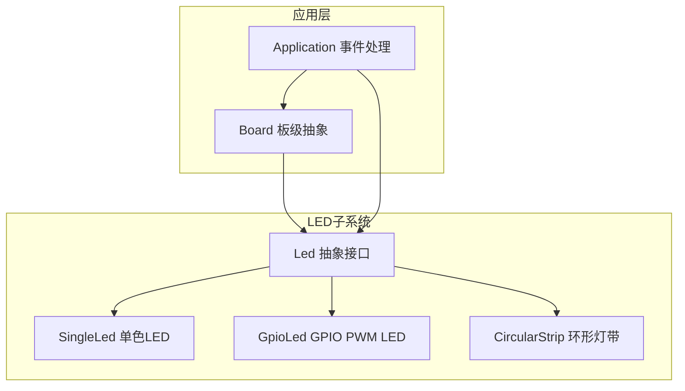
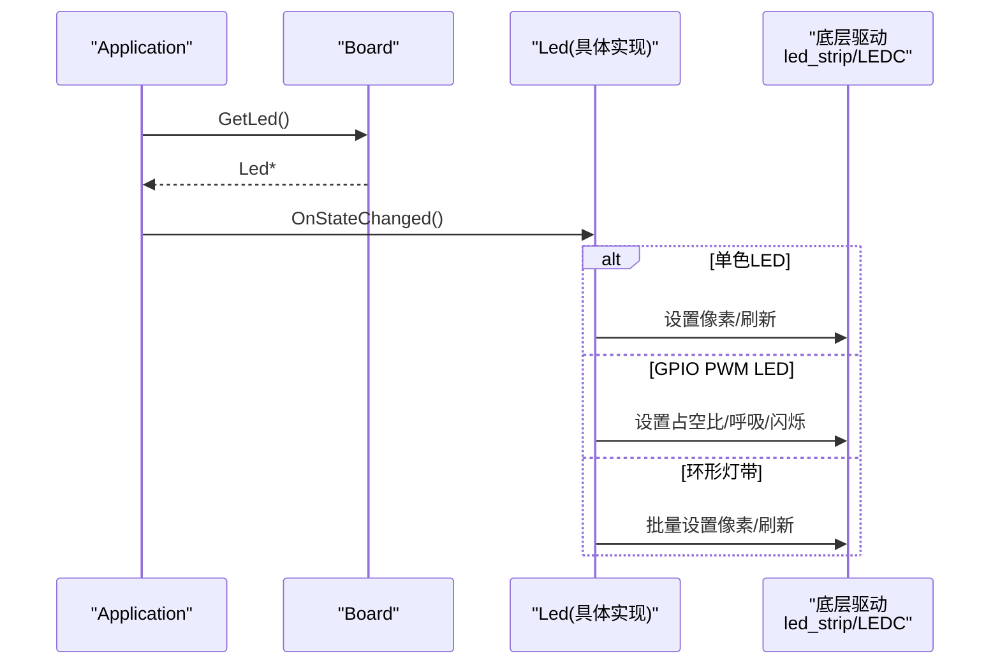
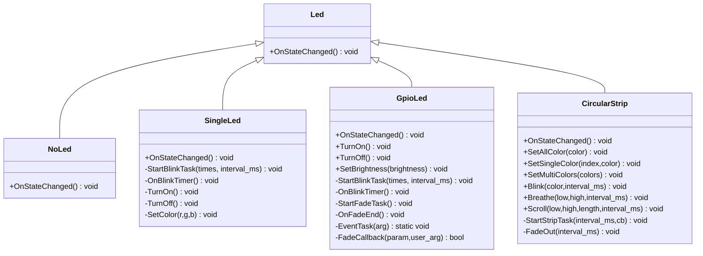
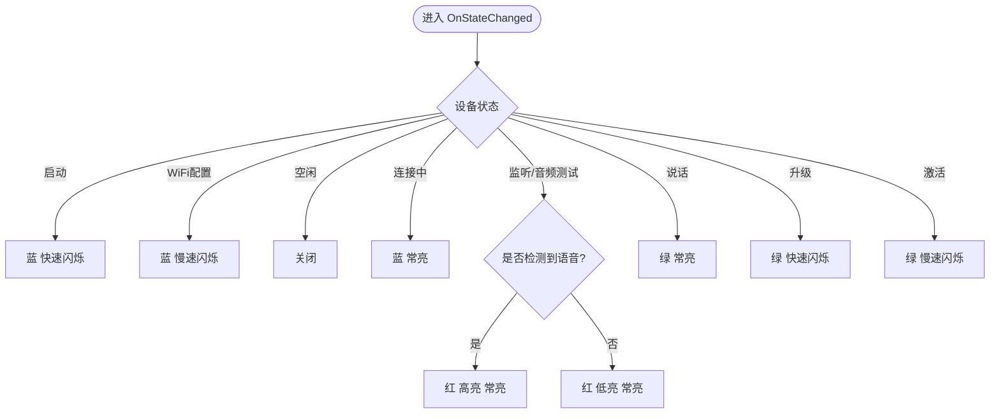
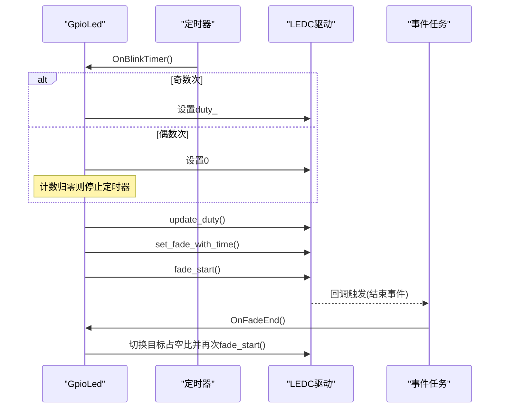
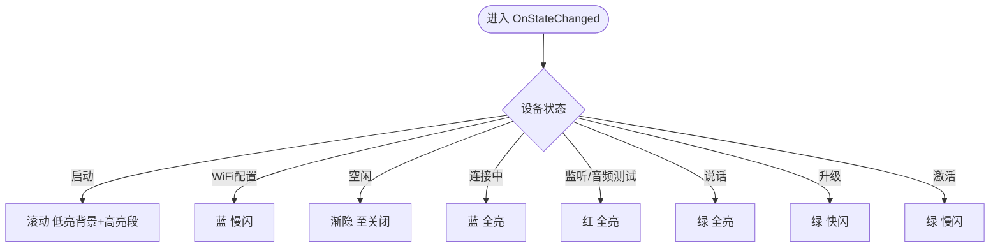
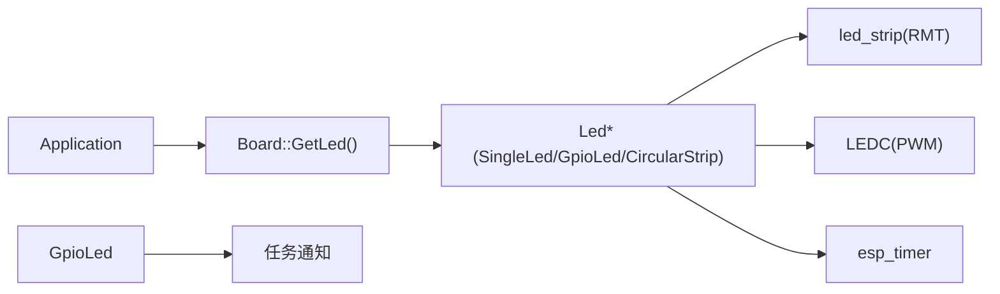

# LED指示灯系统

<cite>
**本文引用的文件**   
- [main/led/led.h](file://main/led/led.h)
- [main/led/single_led.h](file://main/led/single_led.h)
- [main/led/single_led.cc](file://main/led/single_led.cc)
- [main/led/gpio_led.h](file://main/led/gpio_led.h)
- [main/led/gpio_led.cc](file://main/led/gpio_led.cc)
- [main/led/circular_strip.h](file://main/led/circular_strip.h)
- [main/led/circular_strip.cc](file://main/led/circular_strip.cc)
- [main/application.cc](file://main/application.cc)
- [main/boards/common/board.h](file://main/boards/common/board.h)
- [main/boards/common/board.cc](file://main/boards/common/board.cc)
</cite>

## 目录
1. [简介](#简介)
2. [项目结构](#项目结构)
3. [核心组件](#核心组件)
4. [架构总览](#架构总览)
5. [详细组件分析](#详细组件分析)
6. [依赖关系分析](#依赖关系分析)
7. [性能与功耗考虑](#性能与功耗考虑)
8. [故障排除指南](#故障排除指南)
9. [结论](#结论)
10. [附录：状态到LED效果映射表](#附录状态到led效果映射表)

## 简介
本技术文档聚焦于LED指示灯系统的抽象接口设计与多种LED类型的实现，包括单色LED、RGB灯带（环形灯带）以及GPIO PWM驱动的LED。文档深入说明设备状态与LED效果的映射关系（如启动、联网、语音交互、升级、激活等），并提供自定义LED效果和动画的编程指南，解释低功耗模式下的控制策略，以及硬件适配方法与常见问题的排查技巧。

## 项目结构
LED子系统位于 main/led 目录下，提供统一的抽象接口 Led，并包含以下具体实现：
- 单色LED（基于WS2812驱动的单像素）
- GPIO PWM LED（基于LEDC的亮度/呼吸/闪烁）
- 环形灯带（基于WS2812的多像素动画）

应用层通过 Board::GetLed() 获取当前板级LED实例，并在设备状态变化时调用 OnStateChanged() 更新显示效果。

图表来源
- [main/led/led.h:1-18](file://main/led/led.h#L1-L18)
- [main/led/single_led.h:11-36](file://main/led/single_led.h#L11-L36)
- [main/led/gpio_led.h:13-47](file://main/led/gpio_led.h#L13-L47)
- [main/led/circular_strip.h:19-50](file://main/led/circular_strip.h#L19-L50)
- [main/boards/common/board.h:65-71](file://main/boards/common/board.h#L65-L71)
- [main/application.cc:860-870](file://main/application.cc#L860-L870)

章节来源
- [main/led/led.h:1-18](file://main/led/led.h#L1-L18)
- [main/boards/common/board.h:65-71](file://main/boards/common/board.h#L65-L71)
- [main/application.cc:860-870](file://main/application.cc#L860-L870)

## 核心组件
- Led 抽象接口：定义统一的状态回调 OnStateChanged()，用于根据设备状态更新LED效果；同时提供 NoLed 空实现以兼容无LED的板子。
- SingleLed：基于ESP-IDF led_strip驱动的单像素WS2812，支持颜色设置、常亮、关闭、单次/多次/连续闪烁，内部使用定时器周期切换像素状态。
- GpioLed：基于ESP-IDF LEDC（PWM）驱动，支持占空比设置、常亮/关闭、闪烁、呼吸渐变（fade），通过回调+任务通知实现平滑过渡。
- CircularStrip：基于led_strip的多像素WS2812环带，支持全亮、单点/多点着色、闪烁、渐隐、呼吸、滚动等动画，内部维护颜色缓冲与定时器回调。

章节来源
- [main/led/led.h:1-18](file://main/led/led.h#L1-L18)
- [main/led/single_led.h:11-36](file://main/led/single_led.h#L11-L36)
- [main/led/single_led.cc:14-43](file://main/led/single_led.cc#L14-L43)
- [main/led/gpio_led.h:13-47](file://main/led/gpio_led.h#L13-L47)
- [main/led/gpio_led.cc:28-89](file://main/led/gpio_led.cc#L28-L89)
- [main/led/circular_strip.h:19-50](file://main/led/circular_strip.h#L19-L50)
- [main/led/circular_strip.cc:10-42](file://main/led/circular_strip.cc#L10-L42)

## 架构总览
LED子系统与应用层的交互流程如下：
- Application 在设备状态变化或VAD事件发生时，通过 Board::GetLed() 获取当前板级LED实例，并调用其 OnStateChanged()。
- 各LED实现根据设备状态选择对应的颜色/亮度/动画，并通过底层驱动（led_strip或LEDC）输出到硬件。

图表来源
- [main/application.cc:860-870](file://main/application.cc#L860-L870)
- [main/boards/common/board.h:65-71](file://main/boards/common/board.h#L65-L71)
- [main/led/single_led.cc:122-167](file://main/led/single_led.cc#L122-L167)
- [main/led/gpio_led.cc:206-254](file://main/led/gpio_led.cc#L206-L254)
- [main/led/circular_strip.cc:196-245](file://main/led/circular_strip.cc#L196-L245)

## 详细组件分析

### 抽象接口与空实现
- Led 抽象类定义了 OnStateChanged() 纯虚函数，所有具体LED实现必须覆盖该方法以响应设备状态变化。
- NoLed 作为空实现，适用于无LED的板卡，避免运行时错误。

图表来源
- [main/led/led.h:1-18](file://main/led/led.h#L1-L18)
- [main/led/single_led.h:11-36](file://main/led/single_led.h#L11-L36)
- [main/led/gpio_led.h:13-47](file://main/led/gpio_led.h#L13-L47)
- [main/led/circular_strip.h:19-50](file://main/led/circular_strip.h#L19-L50)

章节来源
- [main/led/led.h:1-18](file://main/led/led.h#L1-L18)

### 单色LED（SingleLed）
- 硬件驱动：使用ESP-IDF led_strip（RMT）驱动WS2812单像素。
- 关键能力：
  - 设置颜色（r,g,b）
  - 常亮/关闭
  - 单次/多次/连续闪烁（定时器周期切换像素）
- 状态映射：
  - 启动/配置WiFi：蓝色快速闪烁
  - 空闲：关闭
  - 连接中：蓝色常亮
  - 监听/音频测试：红色（有语音检测为高亮，否则低亮）常亮
  - 说话：绿色常亮
  - 升级/激活：绿色快速/慢速闪烁

图表来源
- [main/led/single_led.cc:122-167](file://main/led/single_led.cc#L122-L167)

章节来源
- [main/led/single_led.h:11-36](file://main/led/single_led.h#L11-L36)
- [main/led/single_led.cc:14-43](file://main/led/single_led.cc#L14-L43)
- [main/led/single_led.cc:122-167](file://main/led/single_led.cc#L122-L167)

### GPIO PWM LED（GpioLed）
- 硬件驱动：使用ESP-IDF LEDC（PWM）驱动，支持13位分辨率与4kHz频率，可配置输出反相与通道。
- 关键能力：
  - 设置亮度（占空比）
  - 常亮/关闭
  - 闪烁（定时器周期切换占空比）
  - 呼吸渐变（fade_up/fade_down循环，回调+任务通知）
- 状态映射：
  - 启动/配置WiFi：默认亮度快速/慢速闪烁
  - 空闲：低亮度常亮
  - 连接中：默认亮度常亮
  - 监听/音频测试：根据语音检测调整亮度并启动呼吸
  - 说话：较高亮度常亮
  - 升级/激活：中等亮度快速/慢速闪烁

图表来源
- [main/led/gpio_led.cc:144-171](file://main/led/gpio_led.cc#L144-L171)
- [main/led/gpio_led.cc:173-195](file://main/led/gpio_led.cc#L173-L195)
- [main/led/gpio_led.cc:197-205](file://main/led/gpio_led.cc#L197-L205)
- [main/led/gpio_led.cc:206-254](file://main/led/gpio_led.cc#L206-L254)

章节来源
- [main/led/gpio_led.h:13-47](file://main/led/gpio_led.h#L13-L47)
- [main/led/gpio_led.cc:28-89](file://main/led/gpio_led.cc#L28-L89)
- [main/led/gpio_led.cc:144-171](file://main/led/gpio_led.cc#L144-L171)
- [main/led/gpio_led.cc:173-195](file://main/led/gpio_led.cc#L173-L195)
- [main/led/gpio_led.cc:197-205](file://main/led/gpio_led.cc#L197-L205)
- [main/led/gpio_led.cc:206-254](file://main/led/gpio_led.cc#L206-L254)

### 环形灯带（CircularStrip）
- 硬件驱动：使用ESP-IDF led_strip（RMT）驱动WS2812多像素环带。
- 关键能力：
  - 设置全部/单个/多个像素颜色
  - 闪烁（整体开关）
  - 渐隐（按帧减半亮度直至全灭）
  - 呼吸（在低/高颜色间线性过渡）
  - 滚动（高亮段沿环移动）
- 状态映射：
  - 启动：滚动（低亮背景+高亮短条）
  - WiFi配置：蓝色慢闪
  - 空闲：渐隐至关闭
  - 连接中：蓝色常亮
  - 监听/音频测试：红色常亮
  - 说话：绿色常亮
  - 升级/激活：绿色快/慢闪

图表来源
- [main/led/circular_strip.cc:196-245](file://main/led/circular_strip.cc#L196-L245)
- [main/led/circular_strip.cc:99-118](file://main/led/circular_strip.cc#L99-L118)
- [main/led/circular_strip.cc:120-156](file://main/led/circular_strip.cc#L120-L156)
- [main/led/circular_strip.cc:158-177](file://main/led/circular_strip.cc#L158-L177)

章节来源
- [main/led/circular_strip.h:19-50](file://main/led/circular_strip.h#L19-L50)
- [main/led/circular_strip.cc:10-42](file://main/led/circular_strip.cc#L10-L42)
- [main/led/circular_strip.cc:196-245](file://main/led/circular_strip.cc#L196-L245)

## 依赖关系分析
- 应用层依赖 Board 抽象获取 LED 实例，并在状态变化时调用 OnStateChanged()。
- 各LED实现依赖 ESP-IDF 驱动：
  - SingleLed/CircularStrip 依赖 led_strip（RMT）
  - GpioLed 依赖 LEDC（PWM）
- 线程与定时器：
  - 使用 esp_timer 周期性触发闪烁/动画回调
  - GpioLed 使用任务通知从ISR回调切换到任务上下文执行呼吸逻辑

图表来源
- [main/application.cc:860-870](file://main/application.cc#L860-L870)
- [main/boards/common/board.h:65-71](file://main/boards/common/board.h#L65-L71)
- [main/led/single_led.cc:14-43](file://main/led/single_led.cc#L14-L43)
- [main/led/gpio_led.cc:28-89](file://main/led/gpio_led.cc#L28-L89)
- [main/led/circular_strip.cc:10-42](file://main/led/circular_strip.cc#L10-L42)

章节来源
- [main/application.cc:860-870](file://main/application.cc#L860-L870)
- [main/boards/common/board.h:65-71](file://main/boards/common/board.h#L65-L71)

## 性能与功耗考虑
- 驱动选择与资源占用：
  - led_strip（RMT）适合多像素动态效果，但频繁刷新会占用CPU与DMA资源。
  - LEDC（PWM）适合单路亮度控制，呼吸/闪烁由硬件完成，CPU开销较低。
- 定时器与互斥锁：
  - 所有LED实现均使用互斥锁保护共享状态，避免并发冲突。
  - 定时器回调尽量轻量，复杂逻辑放入任务上下文（如GpioLed的呼吸）。
- 低功耗策略：
  - 空闲态建议降低亮度或使用渐隐/关闭，减少能耗。
  - 升级/激活等高负载阶段提升性能级别，完成后恢复低功耗。
  - 可通过 Board::SetPowerSaveLevel() 调整系统功耗级别，间接影响LED刷新策略。

章节来源
- [main/application.cc:314-321](file://main/application.cc#L314-L321)
- [main/application.cc:369-382](file://main/application.cc#L369-L382)
- [main/application.cc:993-1011](file://main/application.cc#L993-L1011)
- [main/boards/common/board.h:35-40](file://main/boards/common/board.h#L35-L40)

## 故障排除指南
- LED无响应
  - 检查初始化GPIO是否为无效引脚（如GPIO_NUM_NC），此时应使用 NoLed 以避免未定义行为。
  - 确认 led_strip_new_rmt_device 或 LEDC 初始化是否成功，查看日志中的错误码。
- 闪烁/呼吸异常
  - 检查定时器是否被正确启动/停止，避免重复启动导致状态混乱。
  - GpioLed的呼吸需确保回调与任务通知正常，若中断回调未触发，检查LEDC回调注册与任务优先级。
- 颜色/亮度不正确
  - WS2812颜色格式为GRB，注意顺序。
  - LEDC占空比范围与分辨率匹配，避免溢出或精度不足。
- 卡顿或掉帧
  - 减少每帧像素写入次数，批量设置后一次性刷新。
  - 将复杂动画逻辑移至定时器回调或任务，避免阻塞主循环。

章节来源
- [main/led/single_led.cc:14-43](file://main/led/single_led.cc#L14-L43)
- [main/led/gpio_led.cc:28-89](file://main/led/gpio_led.cc#L28-L89)
- [main/led/circular_strip.cc:10-42](file://main/led/circular_strip.cc#L10-L42)

## 结论
LED子系统通过统一的抽象接口屏蔽了不同硬件差异，提供了丰富的状态指示与动画能力。开发者可根据板级需求选择合适的LED实现，并通过 OnStateChanged() 灵活定制状态到效果的映射。结合低功耗策略与合理的驱动使用，可在保证用户体验的同时优化系统功耗与性能。

## 附录：状态到LED效果映射表
- 启动（kDeviceStateStarting）
  - SingleLed：蓝色快速闪烁
  - GpioLed：默认亮度快速闪烁
  - CircularStrip：滚动（低亮背景+高亮段）
- WiFi配置（kDeviceStateWifiConfiguring）
  - SingleLed：蓝色慢速闪烁
  - GpioLed：默认亮度慢速闪烁
  - CircularStrip：蓝色慢闪
- 空闲（kDeviceStateIdle）
  - SingleLed：关闭
  - GpioLed：低亮度常亮
  - CircularStrip：渐隐至关闭
- 连接中（kDeviceStateConnecting）
  - SingleLed：蓝色常亮
  - GpioLed：默认亮度常亮
  - CircularStrip：蓝色全亮
- 监听/音频测试（kDeviceStateListening/kDeviceStateAudioTesting）
  - SingleLed：红色（有语音检测为高亮，否则低亮）常亮
  - GpioLed：根据语音检测调整亮度并呼吸
  - CircularStrip：红色全亮
- 说话（kDeviceStateSpeaking）
  - SingleLed：绿色常亮
  - GpioLed：较高亮度常亮
  - CircularStrip：绿色全亮
- 升级（kDeviceStateUpgrading）
  - SingleLed：绿色快速闪烁
  - GpioLed：中等亮度快速闪烁
  - CircularStrip：绿色快闪
- 激活（kDeviceStateActivating）
  - SingleLed：绿色慢速闪烁
  - GpioLed：中等亮度慢速闪烁
  - CircularStrip：绿色慢闪

章节来源
- [main/led/single_led.cc:122-167](file://main/led/single_led.cc#L122-L167)
- [main/led/gpio_led.cc:206-254](file://main/led/gpio_led.cc#L206-L254)
- [main/led/circular_strip.cc:196-245](file://main/led/circular_strip.cc#L196-L245)