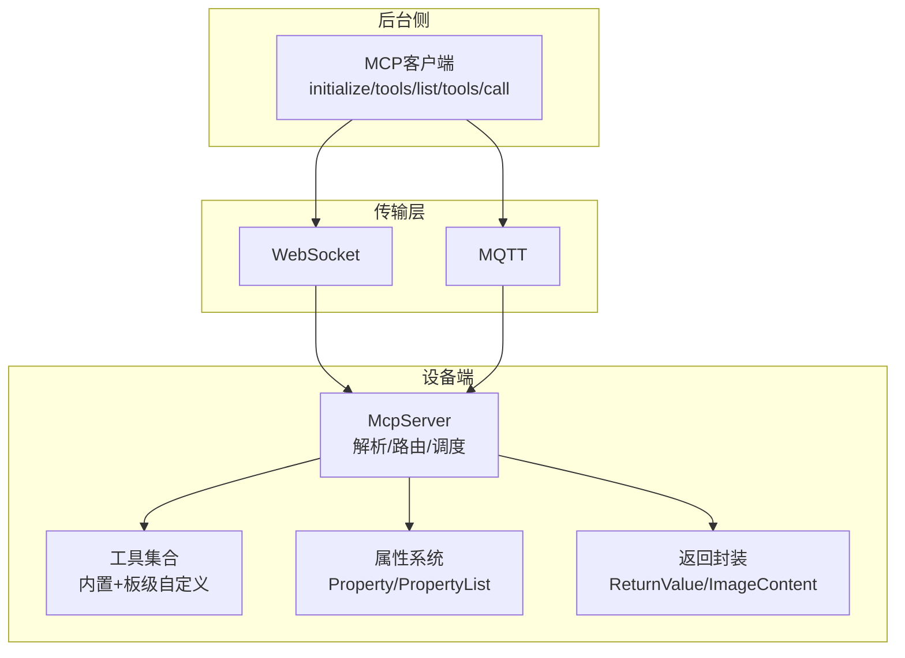
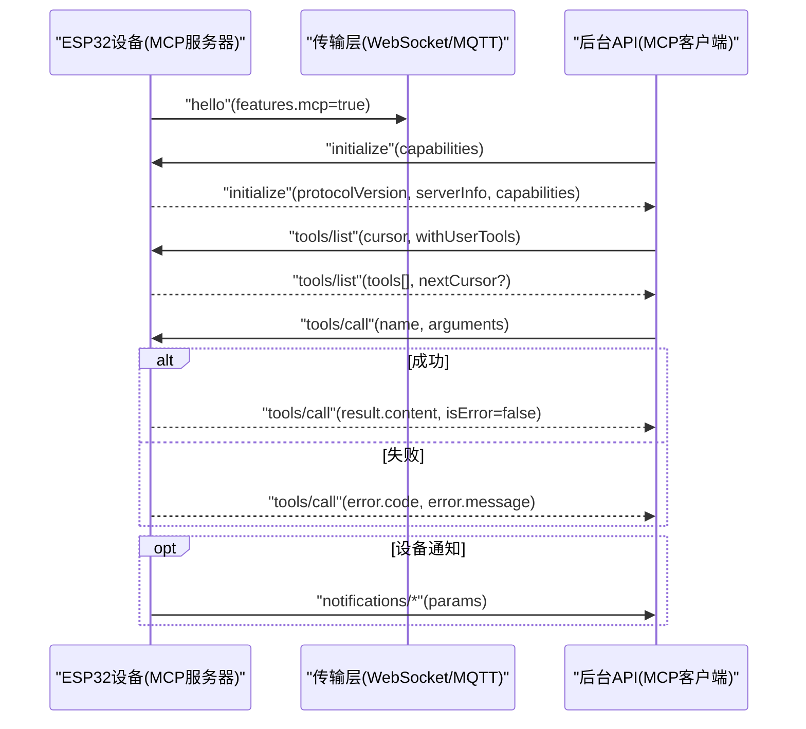
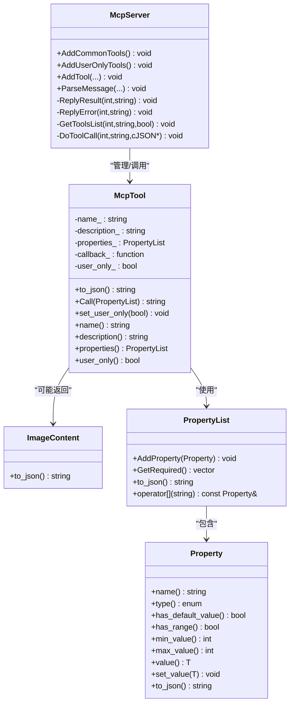
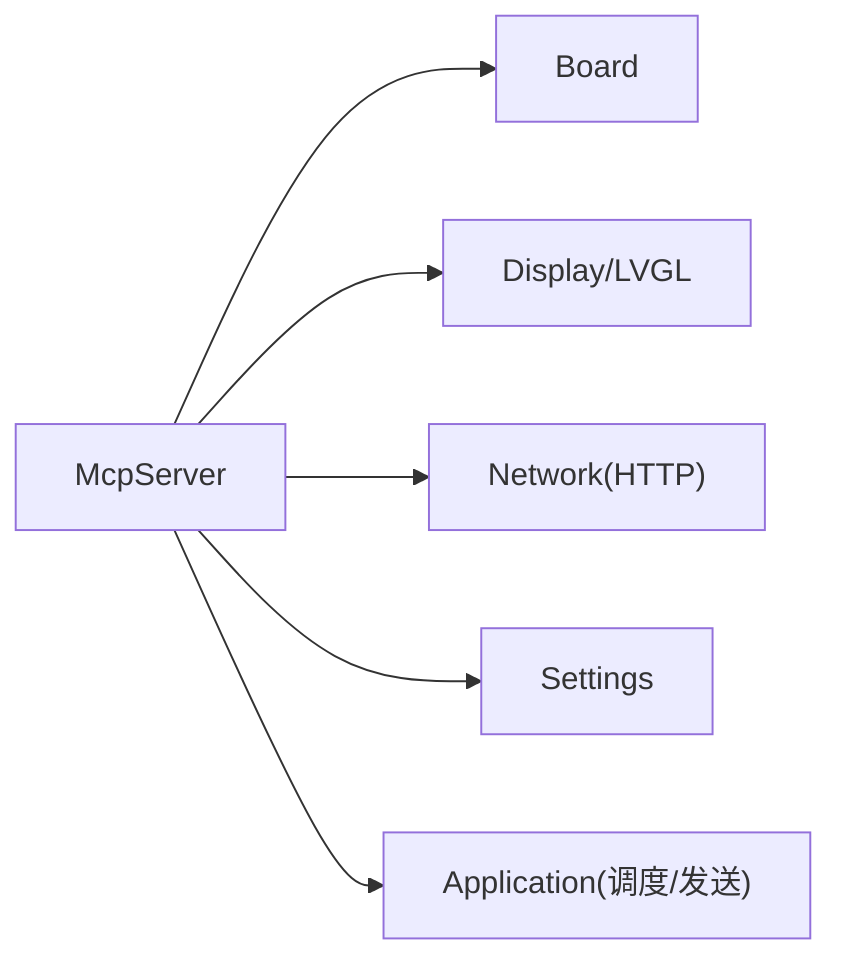

# MCP协议规范

<cite>
**本文引用的文件**   
- [mcp-protocol.md](file://docs/mcp-protocol.md)
- [mcp-protocol_zh.md](file://docs/mcp-protocol_zh.md)
- [mcp-usage.md](file://docs/mcp-usage.md)
- [mcp-usage_zh.md](file://docs/mcp-usage_zh.md)
- [mcp_server.h](file://main/mcp_server.h)
- [mcp_server.cc](file://main/mcp_server.cc)
- [press_to_talk_mcp_tool.h](file://main/boards/common/press_to_talk_mcp_tool.h)
- [press_to_talk_mcp_tool.cc](file://main/boards/common/press_to_talk_mcp_tool.cc)
- [esp_hi.cc](file://main/boards/esp-hi/esp_hi.cc)
</cite>

## 目录
1. [引言](#引言)
2. [项目结构](#项目结构)
3. [核心组件](#核心组件)
4. [架构总览](#架构总览)
5. [详细组件分析](#详细组件分析)
6. [依赖关系分析](#依赖关系分析)
7. [性能与可扩展性](#性能与可扩展性)
8. [故障排查指南](#故障排查指南)
9. [结论](#结论)
10. [附录：协议示例与最佳实践](#附录协议示例与最佳实践)

## 引言
本规范面向在该项目中实现和使用MCP（Model Context Protocol）的开发者，系统性阐述协议的设计理念、消息格式、交互流程、版本管理、连接建立过程、工具发现机制、参数验证规则，以及JSON-RPC请求/响应、错误处理与异步调用支持。同时给出工具描述语言（TDL）的语法规范、约束验证方式，并提供完整协议示例与最佳实践。

## 项目结构
本项目将MCP作为设备侧能力暴露的标准接口，通过底层传输（WebSocket/MQTT）承载JSON-RPC 2.0消息。设备端以单例服务注册“工具”，后台侧作为客户端进行初始化、工具发现与调用。

图表来源
- [mcp_server.cc:350-433](file://main/mcp_server.cc#L350-L433)
- [mcp_server.h:314-342](file://main/mcp_server.h#L314-L342)

章节来源
- [mcp-protocol.md:1-271](file://docs/mcp-protocol.md#L1-L271)
- [mcp-protocol_zh.md:1-270](file://docs/mcp-protocol_zh.md#L1-L270)

## 核心组件
- McpServer：MCP会话入口，负责解析JSON-RPC、路由方法、工具列表分页、参数校验、结果/错误封装与发送。
- McpTool：工具元数据与执行器，包含名称、描述、输入Schema、回调函数、是否用户可见等。
- Property/PropertyList：工具参数的类型系统与约束（布尔/整数/字符串；可选默认值；整数范围限制）。
- ReturnValue/ImageContent：统一返回值封装，支持文本、布尔、整数、cJSON对象及图片内容。

章节来源
- [mcp_server.h:16-312](file://main/mcp_server.h#L16-L312)
- [mcp_server.cc:300-561](file://main/mcp_server.cc#L300-L561)

## 架构总览
MCP基于JSON-RPC 2.0，消息被封装在基础传输消息体中。设备启动后通过hello消息通告能力（含mcp=true），随后由后台发起initialize建立会话，再使用tools/list发现工具，最后通过tools/call调用具体功能。设备也可主动发送通知（无id）。

图表来源
- [mcp-protocol.md:220-271](file://docs/mcp-protocol.md#L220-L271)
- [mcp-protocol_zh.md:215-270](file://docs/mcp-protocol_zh.md#L215-L270)
- [mcp_server.cc:350-433](file://main/mcp_server.cc#L350-L433)

## 详细组件分析

### 协议设计与消息格式
- 外层包裹：session_id、type="mcp"、payload为JSON-RPC 2.0负载。
- JSON-RPC字段：jsonrpc="2.0"、method、params、id、result或error。
- 版本协商：initialize返回protocolVersion="2024-11-05"，serverInfo包含设备名与固件版本。
- 能力交换：initialize可携带capabilities（如vision.url/token），设备据此配置摄像头解释URL。

章节来源
- [mcp-protocol.md:7-36](file://docs/mcp-protocol.md#L7-L36)
- [mcp-protocol_zh.md:7-36](file://docs/mcp-protocol_zh.md#L7-L36)
- [mcp_server.cc:384-395](file://main/mcp_server.cc#L384-L395)
- [mcp_server.cc:331-348](file://main/mcp_server.cc#L331-L348)

### 连接建立与会话初始化
- 设备先发送hello并声明features.mcp=true。
- 后台收到后发送initialize，携带capabilities（可选vision）。
- 设备解析capabilities并回复protocolVersion、capabilities、serverInfo。

章节来源
- [mcp-protocol.md:41-100](file://docs/mcp-protocol.md#L41-L100)
- [mcp-protocol_zh.md:41-106](file://docs/mcp-protocol_zh.md#L41-L106)
- [mcp_server.cc:331-348](file://main/mcp_server.cc#L331-L348)
- [mcp_server.cc:384-395](file://main/mcp_server.cc#L384-L395)

### 工具发现与分页
- tools/list支持cursor分页与withUserTools开关。
- 当nextCursor非空时，客户端需继续拉取下一页。
- 工具列表按“常用优先”顺序排列以提升提示缓存命中率。

章节来源
- [mcp-protocol.md:102-146](file://docs/mcp-protocol.md#L102-L146)
- [mcp-protocol_zh.md:108-148](file://docs/mcp-protocol_zh.md#L108-L148)
- [mcp_server.cc:452-506](file://main/mcp_server.cc#L452-L506)
- [mcp_server.cc:33-126](file://main/mcp_server.cc#L33-L126)

### 工具调用与参数验证
- tools/call要求name和arguments存在且类型正确。
- 服务端依据工具定义的PropertyList对参数进行强类型匹配与必填校验，缺失或类型不匹配将返回错误。
- 工具回调在主线程调度执行，异常将被捕获并转为错误响应。

章节来源
- [mcp-protocol.md:147-189](file://docs/mcp-protocol.md#L147-L189)
- [mcp-protocol_zh.md:150-195](file://docs/mcp-protocol_zh.md#L150-L195)
- [mcp_server.cc:508-561](file://main/mcp_server.cc#L508-L561)

### 通知机制
- 设备可发送无id的通知（如notifications/state_changed），后台无需应答。

章节来源
- [mcp-protocol.md:191-208](file://docs/mcp-protocol.md#L191-L208)
- [mcp-protocol_zh.md:197-214](file://docs/mcp-protocol_zh.md#L197-L214)

### 类与数据结构设计

图表来源
- [mcp_server.h:16-312](file://main/mcp_server.h#L16-L312)
- [mcp_server.h:314-342](file://main/mcp_server.h#L314-L342)

章节来源
- [mcp_server.h:16-312](file://main/mcp_server.h#L16-L312)
- [mcp_server.h:314-342](file://main/mcp_server.h#L314-L342)

### 工具描述语言（TDL）与类型系统
- 属性类型：boolean、integer、string。
- 可选与必填：未提供默认值的属性视为必填；生成inputSchema.required。
- 约束：integer支持minimum/maximum；设置值时会进行范围检查。
- 输出Schema：每个工具生成inputSchema.type="object"，包含properties与required。

章节来源
- [mcp_server.h:52-156](file://main/mcp_server.h#L52-L156)
- [mcp_server.h:158-206](file://main/mcp_server.h#L158-L206)
- [mcp_server.h:208-270](file://main/mcp_server.h#L208-L270)

### 错误处理与异步调用
- 错误路径：参数缺失/类型不匹配、未知工具、方法未实现、工具回调抛出异常等，均返回JSON-RPC错误对象。
- 异步调用：工具回调通过Application::Schedule在主线程执行，避免阻塞网络接收线程。

章节来源
- [mcp_server.cc:435-450](file://main/mcp_server.cc#L435-L450)
- [mcp_server.cc:508-561](file://main/mcp_server.cc#L508-L561)

### 典型工具注册与使用示例
- 通用工具：音量、屏幕亮度、主题切换、拍照等。
- 用户专属工具：重启、固件升级、屏幕快照上传、预览图片、资产下载URL设置等。
- 板级扩展：例如ESP-HI的机器狗动作控制、灯光控制等。

章节来源
- [mcp-usage.md:96-125](file://docs/mcp-usage.md#L96-L125)
- [mcp-usage_zh.md:61-115](file://docs/mcp-usage_zh.md#L61-L115)
- [esp_hi.cc:300-390](file://main/boards/esp-hi/esp_hi.cc#L300-L390)
- [press_to_talk_mcp_tool.cc:10-29](file://main/boards/common/press_to_talk_mcp_tool.cc#L10-L29)

## 依赖关系分析
- McpServer依赖Board、Display、Settings、Network等硬件抽象与服务，用于获取设备状态、截图、HTTP上传等。
- 工具回调通常通过Board实例访问音频编解码器、背光、相机、显示等子系统。
- 工具注册分为“公共工具”（AI可调用）与“用户专属工具”（需显式开启），二者共享同一注册接口但标记不同。

图表来源
- [mcp_server.cc:13-19](file://main/mcp_server.cc#L13-L19)
- [mcp_server.cc:128-298](file://main/mcp_server.cc#L128-L298)

章节来源
- [mcp_server.cc:13-19](file://main/mcp_server.cc#L13-L19)
- [mcp_server.cc:128-298](file://main/mcp_server.cc#L128-L298)

## 性能与可扩展性
- 工具排序优化：将常用工具置于列表前部，提升提示缓存命中概率。
- 分页策略：tools/list按最大负载大小切分，返回nextCursor供客户端继续拉取。
- 异步执行：工具回调通过主线程调度，避免阻塞网络收发。
- 可扩展点：新增工具仅需调用AddTool/AddUserOnlyTool，并在InitializeTools中完成注册。

章节来源
- [mcp_server.cc:33-40](file://main/mcp_server.cc#L33-L40)
- [mcp_server.cc:452-506](file://main/mcp_server.cc#L452-L506)
- [mcp_server.cc:550-561](file://main/mcp_server.cc#L550-L561)

## 故障排查指南
- 常见错误码与场景：
  - 方法未实现：返回Method not implemented。
  - 参数缺失/类型不匹配：返回Missing valid argument / Invalid arguments。
  - 未知工具：返回Unknown tool。
- 定位建议：
  - 检查initialize是否正确传递capabilities（尤其是vision.url/token）。
  - 确认tools/list是否启用withUserTools以获取用户专属工具。
  - 核对工具名称与参数键名是否与注册一致。
  - 查看日志TAG为"MCP"的输出，定位解析与执行阶段问题。

章节来源
- [mcp_server.cc:429-433](file://main/mcp_server.cc#L429-L433)
- [mcp_server.cc:508-561](file://main/mcp_server.cc#L508-L561)
- [mcp_server.cc:331-348](file://main/mcp_server.cc#L331-L348)

## 结论
MCP在本项目中提供了统一的设备能力暴露与调用标准，基于JSON-RPC 2.0实现跨传输层的互操作。通过清晰的会话初始化、工具发现与调用流程，配合严格的参数类型与约束校验，既保证了可靠性，又具备良好的可扩展性。推荐所有新接入的IoT控制采用MCP协议。

## 附录：协议示例与最佳实践

### 协议示例（节选）
- 初始化会话：
  - 请求：{"jsonrpc":"2.0","method":"initialize","params":{"capabilities":{...}},"id":1}
  - 响应：{"jsonrpc":"2.0","id":1,"result":{"protocolVersion":"2024-11-05","capabilities":{"tools":{}},"serverInfo":{"name":"...","version":"..."}}}
- 工具发现：
  - 请求：{"jsonrpc":"2.0","method":"tools/list","params":{"cursor":"","withUserTools":false},"id":2}
  - 响应：{"jsonrpc":"2.0","id":2,"result":{"tools":[...],"nextCursor":"..."?}}
- 工具调用：
  - 请求：{"jsonrpc":"2.0","method":"tools/call","params":{"name":"self.audio_speaker.set_volume","arguments":{"volume":50}},"id":3}
  - 成功响应：{"jsonrpc":"2.0","id":3,"result":{"content":[{"type":"text","text":"true"}],"isError":false}}
  - 失败响应：{"jsonrpc":"2.0","id":3,"error":{"code":-32601,"message":"Unknown tool: ..."}}

章节来源
- [mcp-protocol.md:60-189](file://docs/mcp-protocol.md#L60-L189)
- [mcp-protocol_zh.md:61-195](file://docs/mcp-protocol_zh.md#L61-L195)

### 最佳实践
- 命名规范：工具名建议使用“模块.功能”风格，便于分类与检索。
- 描述清晰：description应简明扼要，帮助模型理解何时调用。
- 参数最小化：仅暴露必要参数，并为可选参数提供合理默认值。
- 安全边界：敏感操作（重启、升级、截图上传）注册为用户专属工具，默认不向AI暴露。
- 分页健壮：客户端需正确处理nextCursor，直到为空。
- 错误友好：服务端返回明确的错误信息，便于上层重试或提示用户。

章节来源
- [mcp-usage.md:18-46](file://docs/mcp-usage.md#L18-L46)
- [mcp-usage_zh.md:18-34](file://docs/mcp-usage_zh.md#L18-L34)
- [mcp-protocol.md:209-218](file://docs/mcp-protocol.md#L209-L218)
- [mcp-protocol_zh.md:209-218](file://docs/mcp-protocol_zh.md#L209-L218)