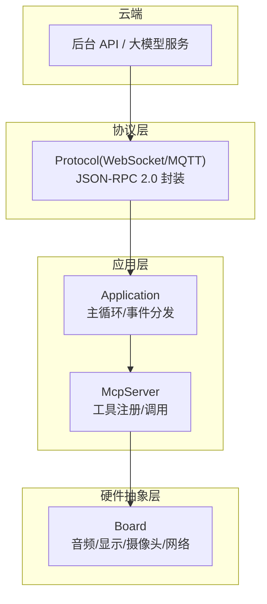
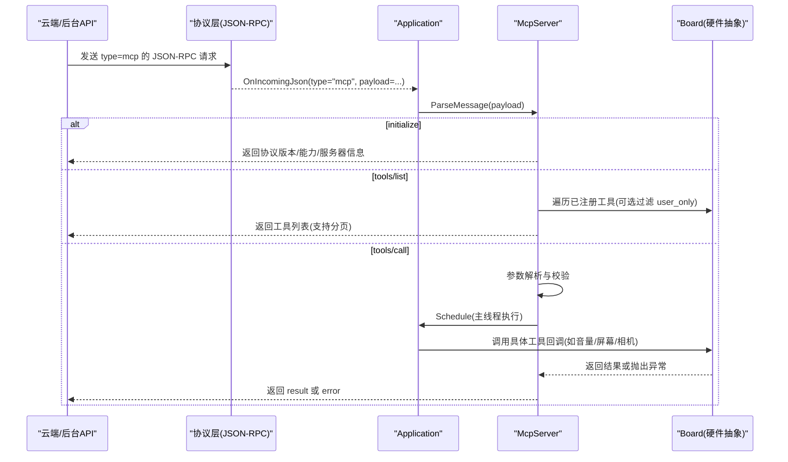
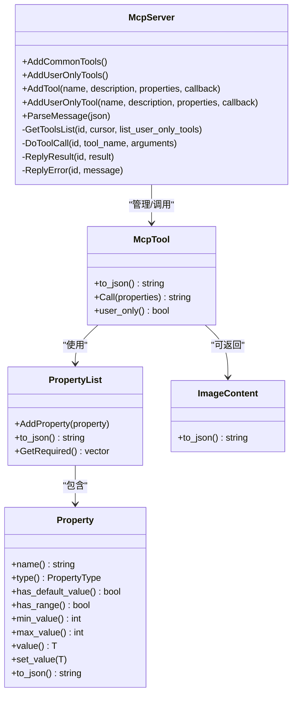
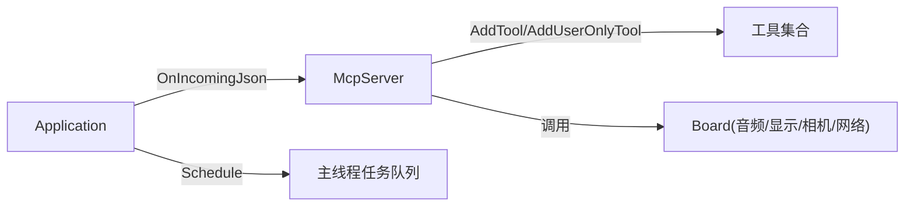
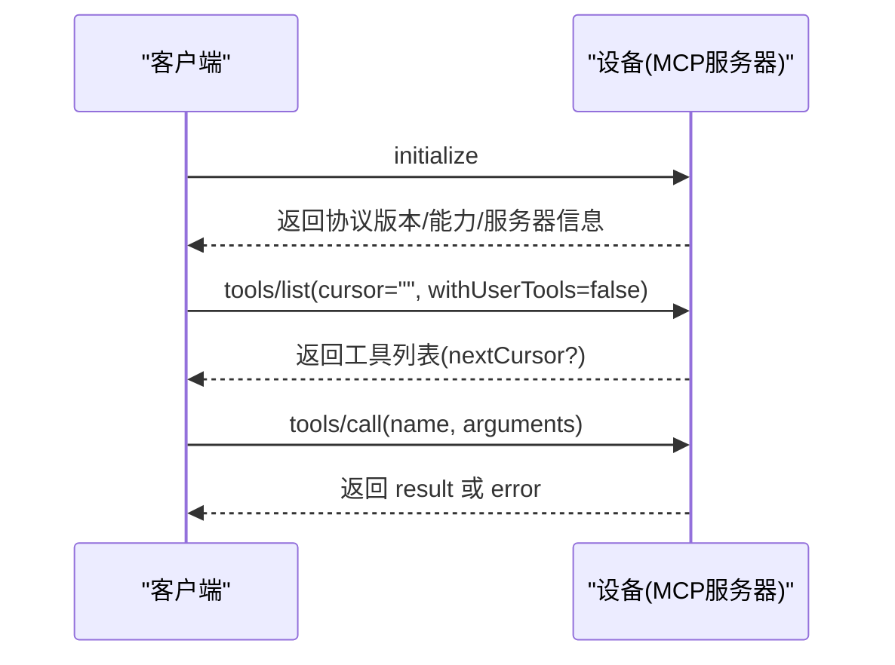

# MCP设备控制系统

<cite>
**本文引用的文件**   
- [mcp_server.h](file://main/mcp_server.h)
- [mcp_server.cc](file://main/mcp_server.cc)
- [application.h](file://main/application.h)
- [application.cc](file://main/application.cc)
- [board.h](file://main/boards/common/board.h)
- [board.cc](file://main/boards/common/board.cc)
- [mcp-protocol_zh.md](file://docs/mcp-protocol_zh.md)
- [mcp-usage_zh.md](file://docs/mcp-usage_zh.md)
</cite>

## 目录
1. [简介](#简介)
2. [项目结构](#项目结构)
3. [核心组件](#核心组件)
4. [架构总览](#架构总览)
5. [详细组件分析](#详细组件分析)
6. [依赖关系分析](#依赖关系分析)
7. [性能与优化建议](#性能与优化建议)
8. [故障排查指南](#故障排查指南)
9. [结论](#结论)
10. [附录](#附录)

## 简介
本技术文档围绕 MCP（Model Context Protocol）设备控制系统，系统性阐述协议设计理念、消息格式与交互流程；深入解析设备端 MCP 服务器的实现机制（工具注册、参数解析、异步执行）；详解内置工具能力（扬声器控制、屏幕亮度/主题、拍照与图像预览、系统信息、固件升级等）；提供自定义工具开发指南（定义、权限控制、错误处理）；并说明云端 MCP 如何扩展大模型能力以支撑智能家居与桌面操作场景。文末给出最佳实践与性能优化建议，帮助开发者快速落地稳定高效的设备控制方案。

## 项目结构
MCP 相关代码主要位于 main 目录下：
- 协议与服务器：mcp_server.h/cc 实现 MCP 服务端逻辑与工具管理
- 应用主循环：application.h/cc 负责初始化、事件分发、MCP 消息路由
- 硬件抽象：boards/common/board.h/cc 提供设备状态、系统信息、显示/摄像头等能力接口
- 文档：docs/mcp-protocol_zh.md、docs/mcp-usage_zh.md 描述协议与用法

图表来源
- [application.cc:473-610](file://main/application.cc#L473-L610)
- [mcp_server.cc:350-433](file://main/mcp_server.cc#L350-L433)
- [board.h:49-85](file://main/boards/common/board.h#L49-L85)

章节来源
- [mcp-protocol_zh.md:1-270](file://docs/mcp-protocol_zh.md#L1-L270)
- [mcp-usage_zh.md:1-115](file://docs/mcp-usage_zh.md#L1-L115)
- [application.cc:96-100](file://main/application.cc#L96-L100)
- [mcp_server.cc:33-126](file://main/mcp_server.cc#L33-L126)

## 核心组件
- McpServer：单例式 MCP 服务器，负责工具注册、参数校验、方法路由、结果/错误响应、分页工具列表生成。
- Application：应用主循环与事件调度，接收底层协议 JSON 消息并将 type=mcp 的消息转发给 McpServer 处理。
- Board：硬件抽象，提供音频、显示、摄像头、网络、系统信息等能力，供工具回调访问。
- 协议封装：基础通信（WebSocket/MQTT）承载 JSON-RPC 2.0 负载，MCP 消息通过 type="mcp" 的 payload 传递。

章节来源
- [mcp_server.h:314-342](file://main/mcp_server.h#L314-L342)
- [mcp_server.cc:350-433](file://main/mcp_server.cc#L350-L433)
- [application.cc:565-570](file://main/application.cc#L565-L570)
- [board.h:49-85](file://main/boards/common/board.h#L49-L85)

## 架构总览
MCP 在设备侧采用“协议解耦 + 工具化”的设计：
- 协议层仅负责传输与类型分发，不关心业务细节
- McpServer 暴露统一的 tools/list 与 tools/call 接口，屏蔽具体工具差异
- 工具通过 AddTool/AddUserOnlyTool 注册，支持用户可见/不可见（AI 不可见）两类
- 工具回调在主线程安全执行，避免并发竞争

图表来源
- [application.cc:565-570](file://main/application.cc#L565-L570)
- [mcp_server.cc:350-433](file://main/mcp_server.cc#L350-L433)
- [mcp_server.cc:508-560](file://main/mcp_server.cc#L508-L560)

## 详细组件分析

### MCP 协议设计与消息格式
- 外层消息：type="mcp"，payload 为 JSON-RPC 2.0 对象
- 标准方法：initialize、tools/list、tools/call
- 参数与返回：
  - initialize：客户端 capabilities（如 vision.url/token），设备返回协议版本、capabilities、serverInfo
  - tools/list：cursor 分页，withUserTools 控制是否包含用户专用工具
  - tools/call：name + arguments，返回 content 数组（text/image）与 isError 标志
- 通知：method 以 notifications/ 开头时，设备可主动推送，无需 id 字段

章节来源
- [mcp-protocol_zh.md:1-270](file://docs/mcp-protocol_zh.md#L1-L270)
- [mcp-usage_zh.md:1-115](file://docs/mcp-usage_zh.md#L1-L115)
- [mcp_server.cc:384-433](file://main/mcp_server.cc#L384-L433)

### 设备端 MCP 服务器实现
- 工具注册
  - AddCommonTools：添加常用工具（设备状态、音量、屏幕亮度/主题、拍照等），优先置于列表前以提升提示缓存命中率
  - AddUserOnlyTools：添加仅限用户可见的工具（系统信息、重启、固件升级、屏幕截图/预览、资源下载 URL 设置等）
  - AddTool/AddUserOnlyTool：统一注册入口，支持 user_only 标记
- 参数解析与校验
  - PropertyList/Property：声明参数名、类型、默认值、取值范围；自动序列化 inputSchema
  - DoToolCall：按声明匹配 arguments，缺失必填参数则报错；支持布尔/整数/字符串
- 异步执行
  - 工具回调通过 Application::Schedule 在主线程执行，保证 UI/硬件访问安全
- 结果与错误
  - ReplyResult/ReplyError：构造 JSON-RPC 响应并通过 Application::SendMcpMessage 回发
  - 工具返回值支持 bool/int/string/cJSON*/ImageContent*，统一包装为 content 数组

图表来源
- [mcp_server.h:16-312](file://main/mcp_server.h#L16-L312)
- [mcp_server.h:314-342](file://main/mcp_server.h#L314-L342)
- [mcp_server.cc:300-319](file://main/mcp_server.cc#L300-L319)

章节来源
- [mcp_server.cc:33-126](file://main/mcp_server.cc#L33-L126)
- [mcp_server.cc:128-298](file://main/mcp_server.cc#L128-L298)
- [mcp_server.cc:300-319](file://main/mcp_server.cc#L300-L319)
- [mcp_server.cc:452-506](file://main/mcp_server.cc#L452-L506)
- [mcp_server.cc:508-560](file://main/mcp_server.cc#L508-L560)

### 内置工具详解
- self.get_device_status：返回设备实时状态（音频、屏幕、电池、网络等）
- self.audio_speaker.set_volume：设置音量（0-100）
- self.screen.set_brightness：设置屏幕亮度（0-100）
- self.screen.set_theme：切换主题（light/dark）
- self.camera.take_photo：拍照并基于问题解释图片内容（需配置云端视觉能力）
- self.get_system_info：获取系统信息（芯片、分区、OTA、显示等）
- self.reboot：重启设备
- self.upgrade_firmware：从指定 URL 下载并安装固件后重启
- self.screen.get_info：屏幕尺寸、是否单色等
- self.screen.snapshot：截取屏幕并以 multipart/form-data 上传到指定 URL
- self.screen.preview_image：从 URL 下载图片并在屏幕预览
- self.assets.set_download_url：设置资源包下载地址

章节来源
- [mcp_server.cc:45-126](file://main/mcp_server.cc#L45-L126)
- [mcp_server.cc:130-298](file://main/mcp_server.cc#L130-L298)
- [board.cc:70-178](file://main/boards/common/board.cc#L70-L178)

### 自定义工具开发指南
- 工具定义
  - 使用 AddTool 或 AddUserOnlyTool 注册，命名建议“模块.功能”，便于分层管理
  - 使用 PropertyList/Property 声明参数类型、默认值、取值范围
- 权限控制
  - user_only=true 的工具不会出现在 AI 可见的工具列表中，适合系统维护类操作
- 错误处理
  - 参数缺失/越界将触发 ReplyError
  - 工具内部抛出的异常会被捕获并转为错误响应
- 返回值
  - 支持 bool/int/string/cJSON*/ImageContent*，统一包装为 content 数组
- 示例路径
  - 参考 ESP-Hi 示例中的 AddTool 用法（无参/带参）

章节来源
- [mcp-usage_zh.md:18-59](file://docs/mcp-usage_zh.md#L18-L59)
- [mcp_server.cc:300-319](file://main/mcp_server.cc#L300-L319)
- [mcp_server.cc:508-560](file://main/mcp_server.cc#L508-L560)

### 云端 MCP 与大模型能力扩展
- 视觉能力
  - initialize 中 capabilities.vision.url/token 用于配置云端图片解释服务
  - 设备侧 camera.Explain(question) 会调用该 URL 进行图片理解
- 智能家居/桌面操作
  - 通过 tools/call 调用设备工具，结合大模型意图识别，实现语音/文本驱动的设备控制
  - 用户专用工具可用于运维（重启、升级、截图上传等），AI 不可见，降低误用风险

章节来源
- [mcp-protocol_zh.md:61-106](file://docs/mcp-protocol_zh.md#L61-L106)
- [mcp_server.cc:331-348](file://main/mcp_server.cc#L331-L348)
- [mcp_server.cc:100-122](file://main/mcp_server.cc#L100-L122)

## 依赖关系分析
- Application 负责协议层回调分发，将 type=mcp 的消息交给 McpServer 处理
- McpServer 依赖 Board 提供的硬件能力（音频、显示、摄像头、网络、系统信息）
- 工具回调通过 Application::Schedule 在主线程执行，确保对 UI/硬件的访问安全

图表来源
- [application.cc:565-570](file://main/application.cc#L565-L570)
- [mcp_server.cc:300-319](file://main/mcp_server.cc#L300-L319)
- [mcp_server.cc:550-560](file://main/mcp_server.cc#L550-L560)

章节来源
- [application.cc:473-610](file://main/application.cc#L473-L610)
- [mcp_server.cc:350-433](file://main/mcp_server.cc#L350-L433)
- [board.h:49-85](file://main/boards/common/board.h#L49-L85)

## 性能与优化建议
- 工具排序与提示缓存
  - 常用工具优先注册，提升大模型提示缓存命中率，减少首字延迟
- 参数校验前置
  - 利用 Property 的范围与默认值，尽早拒绝非法参数，避免无效调用
- 异步与主线程执行
  - 耗时操作尽量通过 Application::Schedule 在主线程执行，避免阻塞网络/音频通道
- 分页与载荷限制
  - tools/list 支持 nextCursor 分页，避免单次响应过大导致丢包或超时
- 资源释放与内存管理
  - 工具返回 cJSON* 或 ImageContent* 时注意生命周期，避免悬垂指针

章节来源
- [mcp_server.cc:33-44](file://main/mcp_server.cc#L33-L44)
- [mcp_server.cc:452-506](file://main/mcp_server.cc#L452-L506)
- [mcp_server.cc:550-560](file://main/mcp_server.cc#L550-L560)

## 故障排查指南
- 常见错误码与原因
  - Method not implemented：未实现的方法名
  - Missing params/name/arguments：tools/call 缺少必要字段
  - Unknown tool：工具名称不存在
  - Missing valid argument：缺少必填参数或类型不匹配
- 定位步骤
  - 检查 JSON-RPC 结构与 method 是否正确
  - 核对工具名称与参数 schema
  - 查看日志输出（ESP_LOGE/ESP_LOGI）确认失败点
- 恢复策略
  - 重试 tools/list 刷新工具列表
  - 修正参数后重新调用 tools/call
  - 必要时重启设备或升级固件

章节来源
- [mcp_server.cc:429-433](file://main/mcp_server.cc#L429-L433)
- [mcp_server.cc:508-560](file://main/mcp_server.cc#L508-L560)

## 结论
MCP 设备控制系统以 JSON-RPC 2.0 为基础，通过“工具化”的方式将设备能力标准化暴露给云端与大模型。设备端 McpServer 提供了完善的工具注册、参数校验、异步执行与错误处理机制；配合 Board 抽象，可灵活适配多种硬件平台。通过合理设计工具命名、权限与参数约束，并结合分页与主线程调度，可实现低延迟、高可靠的设备控制体验。

## 附录
- 典型交互序列图（概念性）

[此图为概念性流程图，不对应具体源码文件]