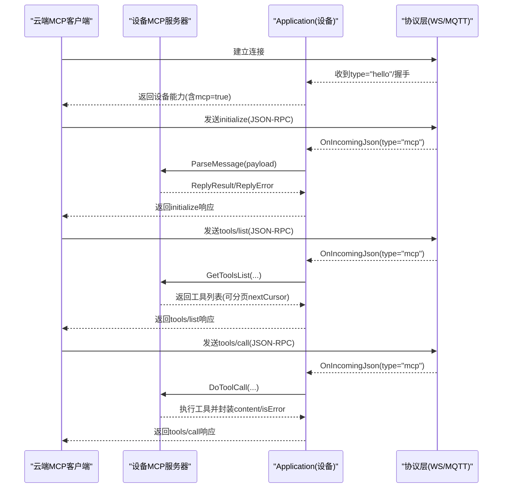
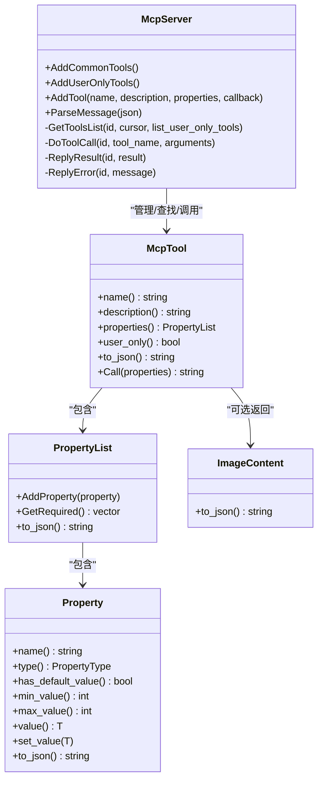
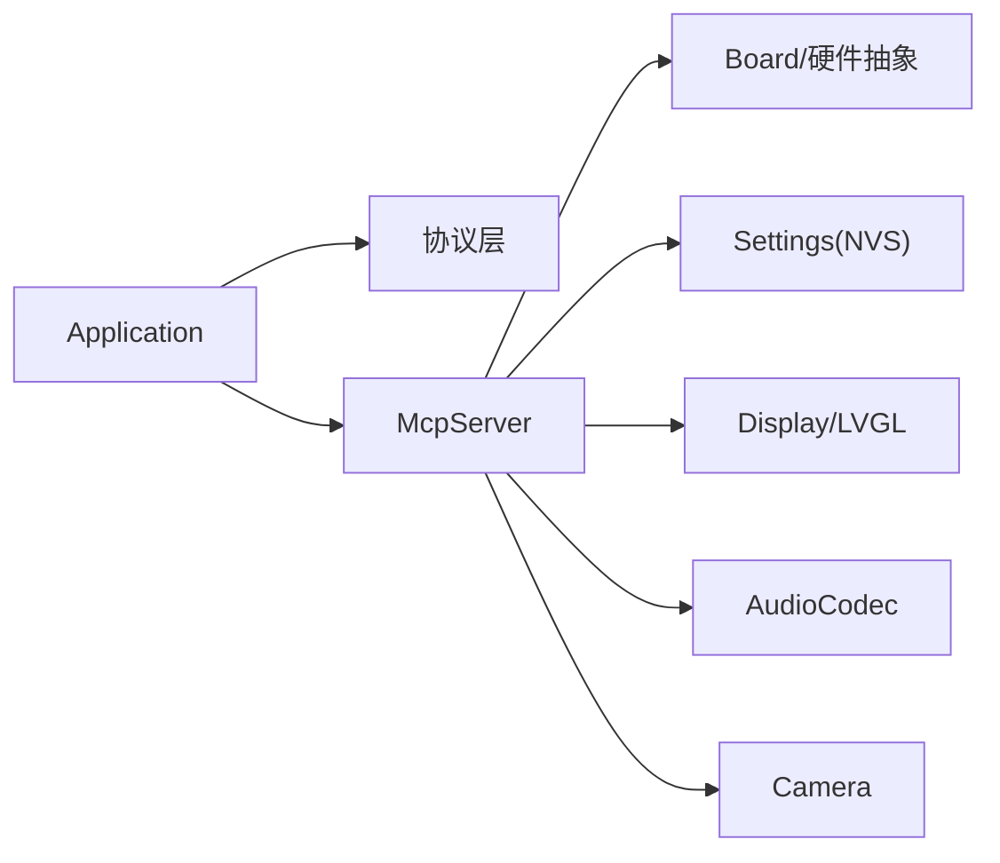

# 云端MCP集成

<cite>
**本文引用的文件**   
- [mcp-protocol_zh.md](file://docs/mcp-protocol_zh.md)
- [mcp-usage_zh.md](file://docs/mcp-usage_zh.md)
- [mcp_server.h](file://main/mcp_server.h)
- [mcp_server.cc](file://main/mcp_server.cc)
- [application.h](file://main/application.h)
- [application.cc](file://main/application.cc)
- [settings.h](file://main/settings.h)
- [settings.cc](file://main/settings.cc)
</cite>

## 目录
1. [简介](#简介)
2. [项目结构](#项目结构)
3. [核心组件](#核心组件)
4. [架构总览](#架构总览)
5. [详细组件分析](#详细组件分析)
6. [依赖关系分析](#依赖关系分析)
7. [性能与扩展性](#性能与扩展性)
8. [故障排查指南](#故障排查指南)
9. [结论](#结论)
10. [附录：集成示例与部署要点](#附录集成示例与部署要点)

## 简介
本文件面向“云端如何扩展大模型能力并通过 MCP 协议实现智能家居控制、PC桌面操作等高级功能”的目标，结合仓库中设备端 MCP 服务器实现与应用层消息路由，给出端到端的集成说明。重点包括：
- 云端侧的 MCP 客户端职责（连接管理、工具发现与调用、结果处理）
- 设备端 MCP 服务器的注册、解析、调度与返回机制
- 跨平台工具开发思路（Windows API、macOS 系统集成、Linux 命令执行）在云端服务中的落地方式
- 云端服务架构设计要点（负载均衡、会话管理、安全认证）
- 完整集成示例与部署注意事项

## 项目结构
本项目在设备端实现了 MCP 服务器，负责接收来自后台（云端）的 JSON-RPC 2.0 请求，并调用设备能力（如音频、屏幕、相机等）。应用层通过统一的消息分发将 MCP 负载交给 MCP 服务器处理；同时，MCP 服务器通过应用层将响应回发至云端。

```mermaid
graph TB
subgraph "云端"
Cloud["云端服务<br/>MCP客户端/网关"]
end
subgraph "设备端"
App["Application<br/>事件循环/协议接入"]
Proto["协议层<br/>WebSocket/MQTT"]
McpSrv["McpServer<br/>工具注册/解析/调度"]
Tools["内置工具集<br/>设备状态/音量/屏幕/相机等"]
NVS["Settings(NVS)<br/>持久化配置"]
end
Cloud < --> Proto
Proto --> App
App --> McpSrv
McpSrv --> Tools
McpSrv --> NVS
```

图示来源
- [application.cc:473-610](file://main/application.cc#L473-L610)
- [mcp_server.cc:350-450](file://main/mcp_server.cc#L350-L450)
- [settings.cc:1-92](file://main/settings.cc#L1-L92)

章节来源
- [application.cc:473-610](file://main/application.cc#L473-L610)
- [mcp_server.cc:350-450](file://main/mcp_server.cc#L350-L450)
- [mcp-protocol_zh.md:1-270](file://docs/mcp-protocol_zh.md#L1-L270)

## 核心组件
- Application（应用主循环与协议接入）
  - 负责初始化显示、音频、网络，启动 OTA 激活流程，选择 WebSocket/MQTT 协议栈，并在收到 type=mcp 的 JSON 时转发给 MCP 服务器处理。
- McpServer（MCP 服务器）
  - 提供工具注册接口（公共工具与仅用户可见工具），解析 initialize/tools/list/tools/call 等方法，完成参数校验、回调执行与结果封装，并通过 Application 发送响应。
- Settings（NVS 设置）
  - 用于持久化配置项（例如资源下载 URL、MQTT 配置等），被 MCP 工具或 OTA 流程使用。

章节来源
- [application.h:43-176](file://main/application.h#L43-L176)
- [application.cc:96-100](file://main/application.cc#L96-L100)
- [application.cc:565-569](file://main/application.cc#L565-L569)
- [mcp_server.h:314-342](file://main/mcp_server.h#L314-L342)
- [mcp_server.cc:33-126](file://main/mcp_server.cc#L33-L126)
- [mcp_server.cc:128-298](file://main/mcp_server.cc#L128-L298)
- [settings.h:1-28](file://main/settings.h#L1-L28)
- [settings.cc:1-92](file://main/settings.cc#L1-L92)

## 架构总览
从云端视角，MCP 客户端需要实现以下职责：
- 连接管理：基于 WebSocket 或 MQTT 建立长连接，处理重连与心跳
- 会话管理：维护 session_id、请求 id 映射、工具列表缓存与分页游标
- 工具发现与调用：按协议顺序发起 initialize → tools/list → tools/call
- 结果处理：解析 content 数组与 isError 标志，支持文本与图片内容
- 安全与鉴权：TLS、Token/证书、访问控制策略



图示来源
- [mcp-protocol_zh.md:215-267](file://docs/mcp-protocol_zh.md#L215-L267)
- [application.cc:565-569](file://main/application.cc#L565-L569)
- [mcp_server.cc:350-450](file://main/mcp_server.cc#L350-L450)
- [mcp_server.cc:452-506](file://main/mcp_server.cc#L452-L506)
- [mcp_server.cc:508-560](file://main/mcp_server.cc#L508-L560)

## 详细组件分析

### 云端MCP客户端实现要点
- 连接管理
  - 支持 WebSocket 与 MQTT 两种传输，需实现自动重连、断线恢复、超时重试
  - 建议维护连接池与会话上下文，避免并发冲突
- 会话管理
  - 为每个设备维护独立会话，记录 session_id、last_cursor、已加载工具清单
  - 对 tools/list 的分页进行增量拉取，避免重复请求
- 工具调用
  - 严格遵循 JSON-RPC 2.0 格式，携带 method、params、id
  - 对 tools/call 的参数进行 schema 校验（类型、必填、范围）
- 结果处理
  - 成功：result.content 数组，支持 text/image 类型
  - 失败：error.code/message，需区分方法不存在、参数错误、执行异常
- 安全与鉴权
  - 传输层 TLS；应用层 Token/证书；服务端侧限流与白名单

章节来源
- [mcp-protocol_zh.md:1-270](file://docs/mcp-protocol_zh.md#L1-L270)
- [mcp-usage_zh.md:1-115](file://docs/mcp-usage_zh.md#L1-L115)

### 设备端MCP服务器（McpServer）
- 工具注册
  - AddCommonTools：常用工具优先注册，利于提示词缓存命中
  - AddUserOnlyTools：系统级/管理员专用工具，默认对 AI 不可见
  - 自定义工具应在板级 InitializeTools 中注册
- 消息解析
  - 校验 jsonrpc=2.0、method、params、id
  - 支持 initialize、tools/list、tools/call，忽略 notifications
- 参数校验与执行
  - 根据工具 PropertyList 定义进行类型匹配与范围检查
  - 通过 Application::Schedule 在主线程执行回调，保证 UI/硬件一致性
- 结果封装
  - 支持 bool/int/string/cJSON* 以及 ImageContent（Base64 图片）
  - 统一包装为 result.content 数组与 isError=false



图示来源
- [mcp_server.h:16-47](file://main/mcp_server.h#L16-L47)
- [mcp_server.h:58-206](file://main/mcp_server.h#L58-L206)
- [mcp_server.h:208-312](file://main/mcp_server.h#L208-L312)
- [mcp_server.h:314-342](file://main/mcp_server.h#L314-L342)
- [mcp_server.cc:33-126](file://main/mcp_server.cc#L33-L126)
- [mcp_server.cc:128-298](file://main/mcp_server.cc#L128-L298)
- [mcp_server.cc:350-450](file://main/mcp_server.cc#L350-L450)
- [mcp_server.cc:452-506](file://main/mcp_server.cc#L452-L506)
- [mcp_server.cc:508-560](file://main/mcp_server.cc#L508-L560)

章节来源
- [mcp_server.h:16-47](file://main/mcp_server.h#L16-L47)
- [mcp_server.h:58-206](file://main/mcp_server.h#L58-L206)
- [mcp_server.h:208-312](file://main/mcp_server.h#L208-L312)
- [mcp_server.h:314-342](file://main/mcp_server.h#L314-L342)
- [mcp_server.cc:33-126](file://main/mcp_server.cc#L33-L126)
- [mcp_server.cc:128-298](file://main/mcp_server.cc#L128-L298)
- [mcp_server.cc:350-450](file://main/mcp_server.cc#L350-L450)
- [mcp_server.cc:452-506](file://main/mcp_server.cc#L452-L506)
- [mcp_server.cc:508-560](file://main/mcp_server.cc#L508-L560)

### 应用层消息路由（Application）
- 初始化阶段注册公共与仅用户工具
- 协议层 OnIncomingJson 中识别 type=mcp，并将 payload 转交 McpServer::ParseMessage
- 通过 SendMcpMessage 将 MCP 响应写回协议层

章节来源
- [application.cc:96-100](file://main/application.cc#L96-L100)
- [application.cc:565-569](file://main/application.cc#L565-L569)
- [application.h:111-112](file://main/application.h#L111-L112)

### 跨平台工具开发（云端侧）
- Windows API 调用
  - 通过 C++/C# 调用 Win32 API 或 COM 组件，封装为 HTTP/gRPC 工具供 MCP 客户端调用
  - 注意权限提升、UI 交互沙箱、进程间通信（命名管道/共享内存）
- macOS 系统集成
  - 使用 Objective-C/Swift 桥接 Cocoa/AppKit，暴露本地服务（HTTP/Unix Socket）
  - 利用 AppleScript/Shortcuts 自动化桌面任务
- Linux 命令执行
  - 以最小权限运行受控命令，采用白名单与参数校验，避免注入
  - 输出标准化为 JSON，必要时分块返回
- 通用约束
  - 所有工具需具备幂等性与超时控制
  - 输入参数遵循 JSON Schema，返回统一 content/isError 结构

[本节为概念性指导，不直接分析具体代码文件]

### 云端服务架构设计要点
- 负载均衡
  - 多实例无状态部署，按设备 ID 或会话粘性路由到后端处理器
  - 工具执行可能涉及本地资源，需考虑就近部署或边缘节点
- 会话管理
  - 维护设备在线状态、工具缓存、分页游标、最近一次调用上下文
  - 支持多路复用与并发限制
- 安全认证
  - 双向 TLS、JWT/OAuth2、设备证书绑定
  - 细粒度授权：哪些工具对 AI 可见、哪些仅用户可用
- 可扩展性
  - 工具注册中心：云端动态发现与版本管理
  - 异步编排：长耗时任务走队列与回调通知

[本节为概念性指导，不直接分析具体代码文件]

## 依赖关系分析
- Application 依赖协议层（WebSocket/MQTT）与 McpServer
- McpServer 依赖 Board/Audio/Display/Camera 等硬件抽象，并通过 Settings 读写 NVS
- 工具回调可能触发网络 I/O（如截图上传、预览图下载）



图示来源
- [application.cc:473-610](file://main/application.cc#L473-L610)
- [mcp_server.cc:13-19](file://main/mcp_server.cc#L13-L19)
- [mcp_server.cc:33-126](file://main/mcp_server.cc#L33-L126)
- [mcp_server.cc:128-298](file://main/mcp_server.cc#L128-L298)

章节来源
- [application.cc:473-610](file://main/application.cc#L473-L610)
- [mcp_server.cc:13-19](file://main/mcp_server.cc#L13-L19)
- [mcp_server.cc:33-126](file://main/mcp_server.cc#L33-L126)
- [mcp_server.cc:128-298](file://main/mcp_server.cc#L128-L298)

## 性能与扩展性
- 工具排序优化：常用工具靠前，提高提示词缓存命中率
- 工具列表分页：防止单次响应过大，使用 nextCursor 增量获取
- 主线程执行：工具回调通过 Application::Schedule 在主线程执行，避免 UI/硬件竞态
- 图片内容：ImageContent 内部 Base64 编码，适合小图；大图建议走直链或分片
- 资源下载：assets 与屏幕截图上传均通过 HTTP 接口，注意超时与重试

章节来源
- [mcp_server.cc:33-40](file://main/mcp_server.cc#L33-L40)
- [mcp_server.cc:452-506](file://main/mcp_server.cc#L452-L506)
- [mcp_server.cc:550-560](file://main/mcp_server.cc#L550-L560)
- [mcp_server.h:16-47](file://main/mcp_server.h#L16-L47)
- [mcp_server.cc:189-242](file://main/mcp_server.cc#L189-L242)

## 故障排查指南
- 常见错误码与定位
  - Method not implemented：检查 method 是否拼写正确
  - Missing params / Invalid arguments：核对 JSON-RPC 参数结构与类型
  - Unknown tool：确认工具名称与可见性（AI 可见 vs 仅用户）
  - Payload size limit：工具列表过大导致截断，检查 nextCursor 继续拉取
- 日志与调试
  - 关注 McpServer 的 ESP_LOGE/ESP_LOGW 输出
  - 在 Application 的 OnIncomingJson 分支打印原始 payload
- 常见问题
  - 工具回调抛异常：确保在回调内捕获异常并返回错误信息
  - 图片上传失败：检查目标 URL 可达性与 Content-Type multipart/form-data 构造

章节来源
- [mcp_server.cc:350-450](file://main/mcp_server.cc#L350-L450)
- [mcp_server.cc:452-506](file://main/mcp_server.cc#L452-L506)
- [mcp_server.cc:508-560](file://main/mcp_server.cc#L508-L560)
- [application.cc:565-607](file://main/application.cc#L565-L607)

## 结论
本项目在设备端提供了完善的 MCP 服务器实现，配合应用层的消息路由，形成稳定的“云端—设备”工具调用闭环。云端侧应围绕连接与会话管理、工具发现与调用、结果处理与安全认证构建 MCP 客户端，并结合跨平台工具服务扩展出智能家居与 PC 桌面控制能力。通过合理的架构设计与性能优化，可实现高可用、可扩展的云端 MCP 集成方案。

[本节为总结性内容，不直接分析具体代码文件]

## 附录：集成示例与部署要点

### 云端MCP客户端工作流（参考）
- 连接建立后，先发送 initialize，再 tools/list（支持分页），最后按需 tools/call
- 对 tools/call 的结果，解析 content 数组，支持 text 与 image 类型
- 遇到错误时，依据 error.message 进行重试或降级

章节来源
- [mcp-protocol_zh.md:1-270](file://docs/mcp-protocol_zh.md#L1-L270)
- [mcp-usage_zh.md:1-115](file://docs/mcp-usage_zh.md#L1-L115)

### 关键API与数据结构路径
- 工具注册与调用入口
  - [mcp_server.h:314-342](file://main/mcp_server.h#L314-L342)
  - [mcp_server.cc:300-319](file://main/mcp_server.cc#L300-L319)
- 消息解析与响应
  - [mcp_server.cc:350-450](file://main/mcp_server.cc#L350-L450)
- 工具列表分页
  - [mcp_server.cc:452-506](file://main/mcp_server.cc#L452-L506)
- 工具执行与主线程调度
  - [mcp_server.cc:508-560](file://main/mcp_server.cc#L508-L560)
- 应用层MCP路由
  - [application.cc:565-569](file://main/application.cc#L565-L569)
- 设置持久化
  - [settings.h:1-28](file://main/settings.h#L1-L28)
  - [settings.cc:1-92](file://main/settings.cc#L1-L92)

### 部署建议
- 云端服务
  - 容器化部署，水平扩展，按设备ID做会话粘性
  - 引入消息队列承载长耗时工具执行
  - 配置 TLS 与鉴权中间件
- 设备端
  - 合理划分工具可见性（AI 可见/仅用户）
  - 对网络 I/O 增加超时与重试
  - 监控堆内存与任务优先级，避免阻塞主线程

[本节为实践性指导，不直接分析具体代码文件]