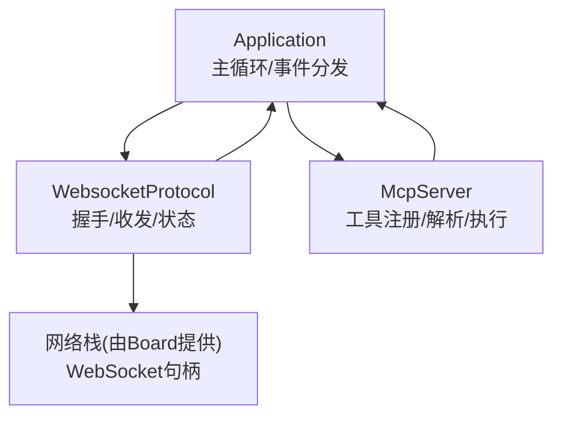
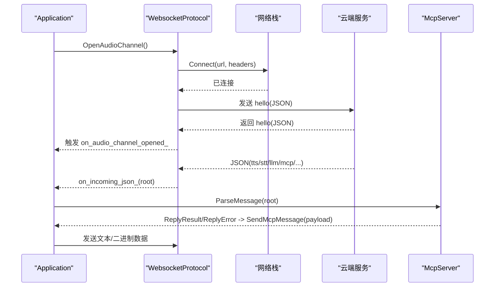
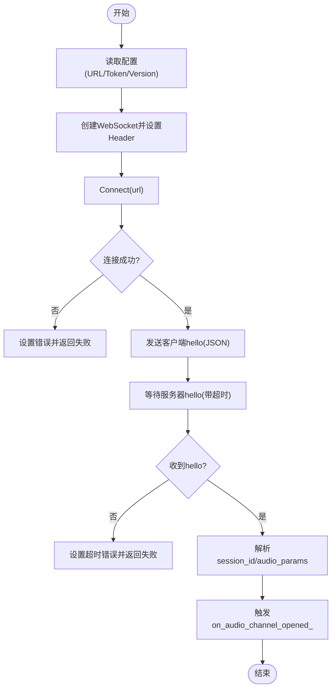
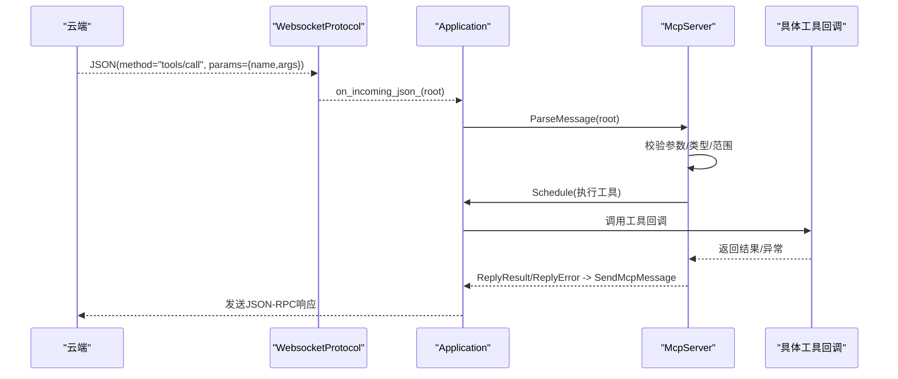
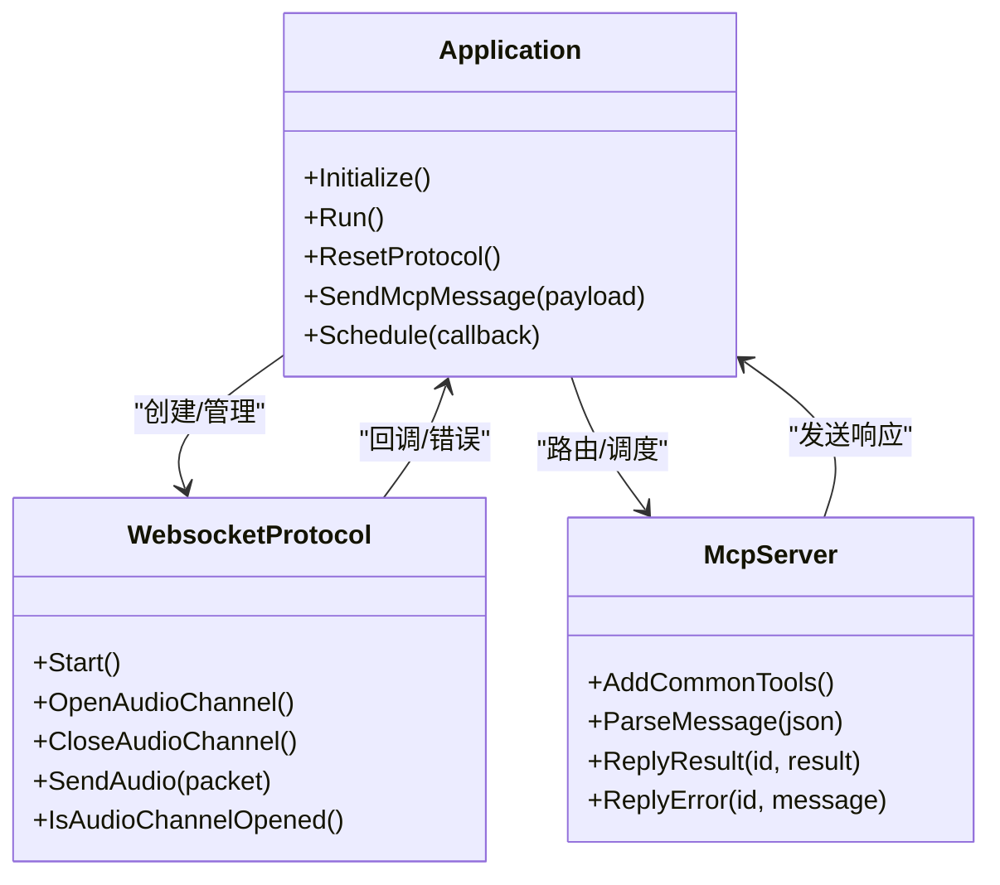

# 云端客户端实现

<cite>
**本文引用的文件**   
- [application.h](file://main/application.h)
- [application.cc](file://main/application.cc)
- [websocket_protocol.h](file://main/protocols/websocket_protocol.h)
- [websocket_protocol.cc](file://main/protocols/websocket_protocol.cc)
- [mcp_server.h](file://main/mcp_server.h)
- [mcp_server.cc](file://main/mcp_server.cc)
</cite>

## 目录
1. [简介](#简介)
2. [项目结构](#项目结构)
3. [核心组件](#核心组件)
4. [架构总览](#架构总览)
5. [详细组件分析](#详细组件分析)
6. [依赖关系分析](#依赖关系分析)
7. [性能考量](#性能考量)
8. [故障排查指南](#故障排查指南)
9. [结论](#结论)
10. [附录：完整代码示例与最佳实践](#附录完整代码示例与最佳实践)

## 简介
本文件面向“云端MCP客户端”的ESP32端实现，聚焦以下目标：
- WebSocket连接的建立与维护（握手、心跳检测、自动重连、错误恢复）
- 工具调用的异步处理（请求队列、并发控制、超时管理）
- 结果处理与缓存策略（响应格式化、错误重试、性能优化）
- 高级能力（连接池、负载均衡、监控告警）的实现建议与参考路径

本项目采用事件驱动与任务调度模型，应用层通过协议抽象统一接入WebSocket或MQTT。MCP（Model Context Protocol）在设备侧以“工具注册+调用”的方式扩展大模型能力，并通过WebSocket文本通道承载JSON-RPC消息。

## 项目结构
围绕云端MCP客户端的关键代码位于以下模块：
- 应用主循环与事件分发：application.h/cc
- 协议抽象与WebSocket实现：protocols/websocket_protocol.h/cc
- MCP服务端（设备侧）与工具系统：mcp_server.h/cc

图示来源
- [application.cc:165-259](file://main/application.cc#L165-L259)
- [websocket_protocol.cc:83-201](file://main/protocols/websocket_protocol.cc#L83-L201)
- [mcp_server.cc:350-433](file://main/mcp_server.cc#L350-L433)

章节来源
- [application.h:43-176](file://main/application.h#L43-L176)
- [application.cc:165-259](file://main/application.cc#L165-L259)
- [websocket_protocol.h:13-32](file://main/protocols/websocket_protocol.h#L13-L32)
- [websocket_protocol.cc:83-201](file://main/protocols/websocket_protocol.cc#L83-L201)
- [mcp_server.h:314-342](file://main/mcp_server.h#L314-L342)
- [mcp_server.cc:350-433](file://main/mcp_server.cc#L350-L433)

## 核心组件
- Application
  - 负责初始化显示、音频、网络回调；维护主事件循环；调度跨线程任务；管理协议生命周期与状态机。
- WebsocketProtocol
  - 基于WebSocket的协议实现，负责OpenAudioChannel握手、发送/接收二进制音频与JSON文本、解析服务器hello、设置超时与错误码。
- McpServer
  - 设备侧MCP服务：工具注册、参数校验、tools/list分页、tools/call执行、结果封装并回传至Application以发送到云端。

章节来源
- [application.h:43-176](file://main/application.h#L43-L176)
- [application.cc:473-610](file://main/application.cc#L473-L610)
- [websocket_protocol.h:13-32](file://main/protocols/websocket_protocol.h#L13-L32)
- [websocket_protocol.cc:83-201](file://main/protocols/websocket_protocol.cc#L83-L201)
- [mcp_server.h:314-342](file://main/mcp_server.h#L314-L342)
- [mcp_server.cc:350-433](file://main/mcp_server.cc#L350-L433)

## 架构总览
从“云端MCP客户端”视角，整体交互如下：
- 应用启动后，根据配置选择WebSocket或MQTT协议；当需要语音会话时，打开WebSocket音频通道并完成握手。
- 云端通过WebSocket文本通道下发JSON消息，包括TTS/STT/LLM/MCP等类型。
- MCP消息经Application路由到McpServer进行解析与执行，工具返回结果再经由Application发回云端。

图示来源
- [websocket_protocol.cc:83-201](file://main/protocols/websocket_protocol.cc#L83-L201)
- [application.cc:473-610](file://main/application.cc#L473-L610)
- [mcp_server.cc:350-433](file://main/mcp_server.cc#L350-L433)

## 详细组件分析

### WebSocket连接建立与维护
- 连接建立
  - 读取配置URL、Token、版本；构造Authorization与协议头；创建WebSocket实例并Connect。
  - 发送客户端hello（包含features、transport、audio_params），等待服务器hello并解析session_id与音频参数。
- 数据收发
  - 文本通道用于JSON控制消息（如mcp/tts/stt/llm/system/alert）。
  - 二进制通道用于opus音频流，支持多版本二进制协议。
- 超时与错误
  - 使用事件组等待服务器hello，超时则设置错误并返回失败。
  - 断开回调触发on_audio_channel_closed_，上层可据此关闭音频通道并重置状态。
- 心跳检测与自动重连（当前实现要点）
  - 当前实现未内置显式心跳包；但通过last_incoming_time_记录最近一次收到数据的时间，并在IsAudioChannelOpened中结合IsTimeout判断通道是否可用。
  - 自动重连未在WebSocket层直接实现；建议在Application层监听网络断开事件，必要时重新调用OpenAudioChannel完成重连。

图示来源
- [websocket_protocol.cc:83-201](file://main/protocols/websocket_protocol.cc#L83-L201)

章节来源
- [websocket_protocol.cc:83-201](file://main/protocols/websocket_protocol.cc#L83-L201)
- [websocket_protocol.cc:112-173](file://main/protocols/websocket_protocol.cc#L112-L173)
- [websocket_protocol.cc:175-201](file://main/protocols/websocket_protocol.cc#L175-L201)

### 工具调用的异步处理（队列、并发、超时）
- 请求入口
  - 云端通过WebSocket文本通道发送JSON-RPC方法tools/call，Application将type为mcp的消息交给McpServer.ParseMessage。
- 参数校验与绑定
  - McpServer对arguments进行类型匹配与范围检查，缺失必填参数或越界会立即返回错误。
- 异步执行
  - 工具执行被Schedule到主任务上下文，避免阻塞网络/音频线程，保证UI与状态机一致性。
- 并发控制
  - 当前实现按顺序在主任务中串行执行工具调用，天然具备简单并发控制。
- 超时管理
  - 工具层未内置超时机制；可在工具回调内部自行实现超时逻辑，或在Application层增加统一的工具调用超时包装。

图示来源
- [application.cc:521-607](file://main/application.cc#L521-L607)
- [mcp_server.cc:350-433](file://main/mcp_server.cc#L350-L433)
- [mcp_server.cc:508-560](file://main/mcp_server.cc#L508-L560)

章节来源
- [application.cc:521-607](file://main/application.cc#L521-L607)
- [mcp_server.cc:350-433](file://main/mcp_server.cc#L350-L433)
- [mcp_server.cc:508-560](file://main/mcp_server.cc#L508-L560)

### 结果处理与缓存策略
- 响应格式化
  - McpServer将工具返回值统一封装为JSON-RPC result或error对象，并通过Application.SendMcpMessage发送。
- 错误重试
  - 当前未实现自动重试；可在上层（如云端侧）对tools/call进行幂等性设计与重试。
- 性能优化
  - tools/list支持分页（nextCursor），避免单次负载过大。
  - 常用工具优先注册，利用提示词缓存提升响应速度。
  - 工具执行在主任务中串行，降低锁竞争与内存抖动。

章节来源
- [mcp_server.cc:435-450](file://main/mcp_server.cc#L435-L450)
- [mcp_server.cc:452-506](file://main/mcp_server.cc#L452-L506)
- [mcp_server.cc:33-126](file://main/mcp_server.cc#L33-L126)

### 连接池管理与负载均衡（实现建议）
- 连接池
  - 可在Application层维护一个WebSocket连接池，按会话ID或设备ID复用连接，减少握手开销。
  - 连接池需考虑最大空闲时间、健康检查、容量上限与淘汰策略。
- 负载均衡
  - 若后端存在多个WebSocket节点，可在连接前通过DNS或多地址轮询/加权选择目标；或使用网关层做七层负载均衡。
- 容灾与降级
  - 当WebSocket不可用时，可尝试切换至MQTT+UDP通道（若配置允许），保障基本功能可用。

[本节为概念性建议，不直接分析具体文件]

### 监控与告警（实现建议）
- 指标采集
  - 统计连接成功率、握手耗时、断线次数、工具调用QPS/延迟分布、错误码占比。
- 告警规则
  - 连续握手失败、长时间无心跳、工具调用超时率超阈、内存泄漏趋势等。
- 上报方式
  - 通过HTTP或WebSocket将指标上报至监控系统；也可复用现有alert消息通道。

[本节为概念性建议，不直接分析具体文件]

## 依赖关系分析
- Application依赖
  - Board（网络、显示、音频）、Ota、AudioService、McpServer、Settings。
- WebsocketProtocol依赖
  - Board提供的网络接口（CreateWebSocket）、cJSON、FreeRTOS事件组。
- McpServer依赖
  - Application（SendMcpMessage/Schedule）、Board（设备能力访问）、Settings（持久化）。

图示来源
- [application.h:43-176](file://main/application.h#L43-L176)
- [websocket_protocol.h:13-32](file://main/protocols/websocket_protocol.h#L13-L32)
- [mcp_server.h:314-342](file://main/mcp_server.h#L314-L342)

章节来源
- [application.h:43-176](file://main/application.h#L43-L176)
- [websocket_protocol.h:13-32](file://main/protocols/websocket_protocol.h#L13-L32)
- [mcp_server.h:314-342](file://main/mcp_server.h#L314-L342)

## 性能考量
- 音频通道
  - 在连接前切换到高性能模式以降低延迟；注意与服务端采样率不一致可能导致的重采样失真。
- 工具调用
  - 将耗时操作放入低优先级任务或异步队列，避免阻塞主循环。
- 消息体积
  - tools/list分页限制单包大小，防止溢出。
- 资源释放
  - 断开连接后及时释放WebSocket与相关资源，避免内存泄漏。

章节来源
- [application.cc:504-519](file://main/application.cc#L504-L519)
- [mcp_server.cc:452-506](file://main/mcp_server.cc#L452-L506)

## 故障排查指南
- 无法连接
  - 检查URL/Token/版本配置；确认网络可达；查看GetLastError日志。
- 握手超时
  - 确认服务器hello是否在超时时间内返回；检查防火墙/代理拦截。
- 工具调用失败
  - 检查参数类型与必填项；关注ReplyError中的message；确认工具回调是否抛出异常。
- 音频无声/卡顿
  - 核对server_sample_rate与设备输出采样率；观察IsAudioChannelOpened是否为真；检查网络丢包。

章节来源
- [websocket_protocol.cc:175-201](file://main/protocols/websocket_protocol.cc#L175-L201)
- [mcp_server.cc:508-560](file://main/mcp_server.cc#L508-L560)

## 结论
该云端MCP客户端在ESP32上实现了稳定的WebSocket握手与音视频通道管理，并通过MCP工具系统扩展了设备能力。当前实现侧重简洁与稳定，心跳与自动重连可通过上层策略增强；工具调用采用主任务串行执行，便于调试与资源控制。后续可按建议引入连接池、负载均衡与监控告警，进一步提升可用性、可扩展性与可观测性。

## 附录：完整代码示例与最佳实践
以下为可直接落地的参考路径与要点（不包含具体代码内容）：
- WebSocket连接建立与维护
  - 参考：[websocket_protocol.cc:83-201](file://main/protocols/websocket_protocol.cc#L83-L201)
  - 要点：读取配置、设置Header、Connect、发送hello、等待服务器hello、解析参数、设置超时与错误。
- 工具调用流程
  - 参考：[application.cc:521-607](file://main/application.cc#L521-L607)、[mcp_server.cc:350-433](file://main/mcp_server.cc#L350-L433)、[mcp_server.cc:508-560](file://main/mcp_server.cc#L508-L560)
  - 要点：JSON-RPC解析、参数校验、主任务调度、结果封装与回传。
- 连接池与负载均衡（建议）
  - 在Application层维护连接池，按会话复用；在连接前选择后端节点；结合健康检查与淘汰策略。
- 监控告警（建议）
  - 采集关键指标并上报；定义告警规则；通过现有alert通道或独立通道上报。

章节来源
- [websocket_protocol.cc:83-201](file://main/protocols/websocket_protocol.cc#L83-L201)
- [application.cc:521-607](file://main/application.cc#L521-L607)
- [mcp_server.cc:350-433](file://main/mcp_server.cc#L350-L433)
- [mcp_server.cc:508-560](file://main/mcp_server.cc#L508-L560)