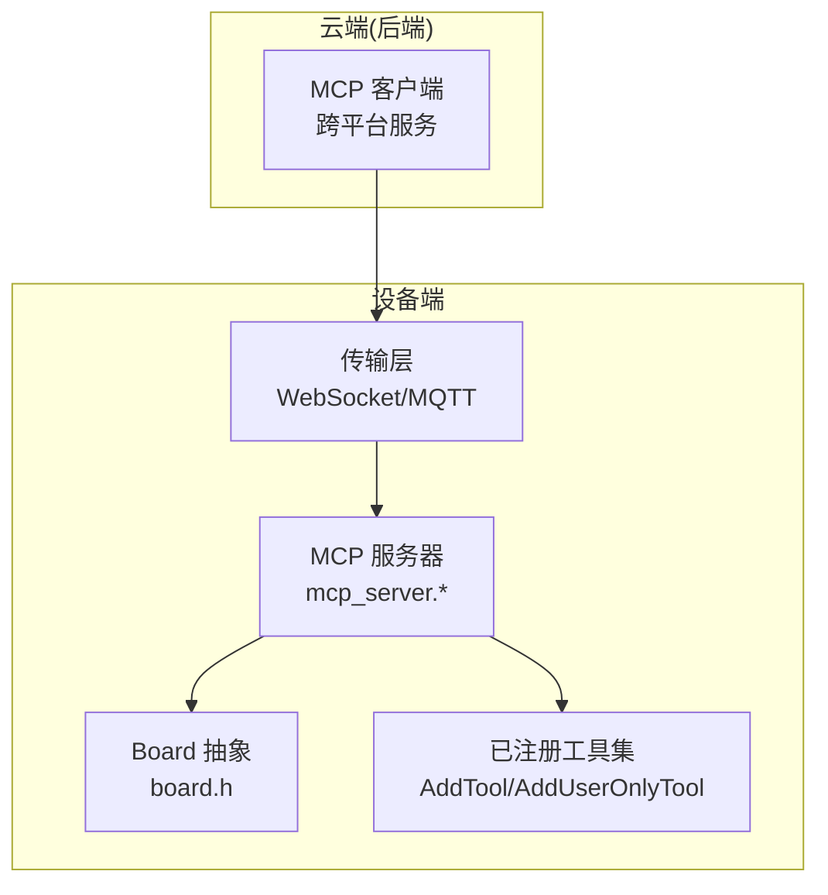
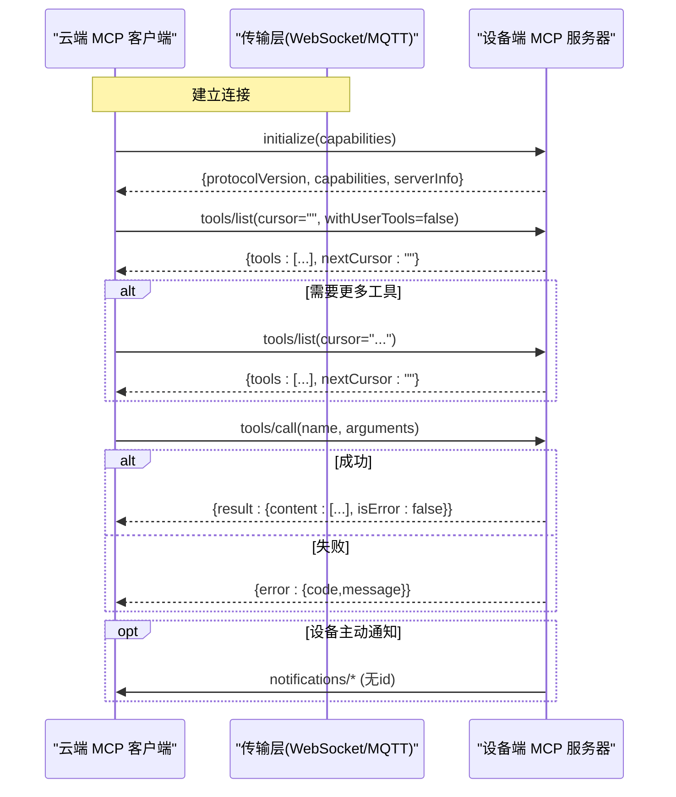
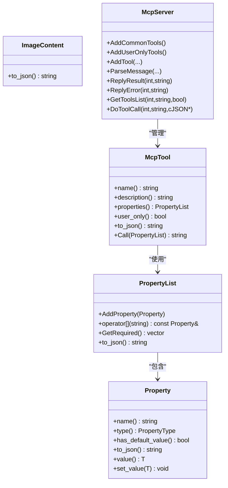
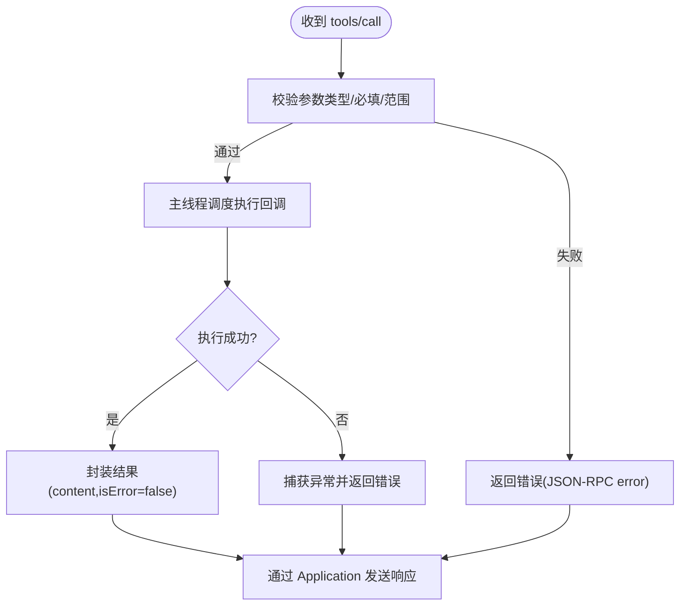
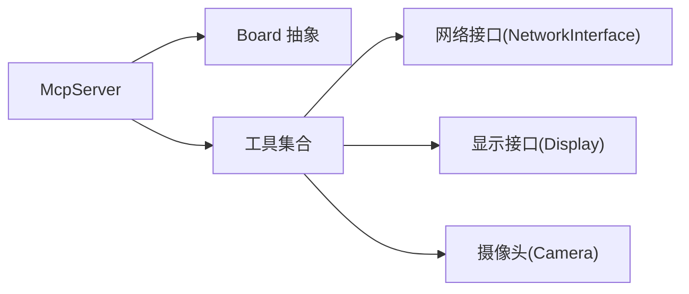
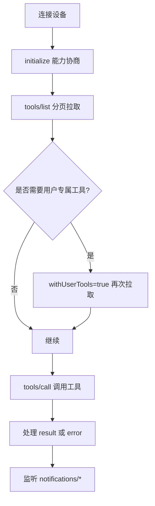
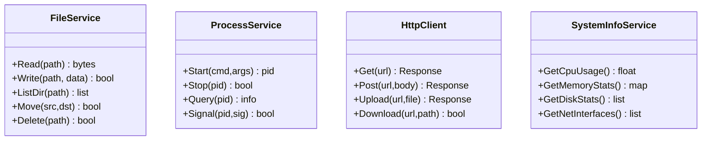

# 跨平台工具开发

<cite>
**本文引用的文件**   
- [README.md](file://README.md)
- [mcp_server.h](file://main/mcp_server.h)
- [mcp_server.cc](file://main/mcp_server.cc)
- [mcp-protocol.md](file://docs/mcp-protocol.md)
- [mcp-usage.md](file://docs/mcp-usage.md)
- [board.h](file://main/boards/common/board.h)
</cite>

## 目录
1. [引言](#引言)
2. [项目结构](#项目结构)
3. [核心组件](#核心组件)
4. [架构总览](#架构总览)
5. [详细组件分析](#详细组件分析)
6. [依赖关系分析](#依赖关系分析)
7. [性能与可扩展性](#性能与可扩展性)
8. [安全与沙箱机制](#安全与沙箱机制)
9. [跨平台与兼容性指南](#跨平台与兼容性指南)
10. [故障排查](#故障排查)
11. [结论](#结论)
12. [附录：示例与最佳实践](#附录示例与最佳实践)

## 引言
本指南面向希望在云端实现“跨平台工具调用”的开发者，目标是基于现有工程中的 MCP（Model Context Protocol）能力，构建可在 Windows、macOS、Linux 等平台上运行的云端服务，统一发现并调用设备侧工具。文档将围绕以下主题展开：
- 云端如何以 MCP 协议与设备交互，完成工具发现与调用
- 系统 API 抽象与封装思路（文件、进程、网络等）
- 安全沙箱与权限控制策略
- 跨平台差异处理与兼容性建议
- 具体示例：系统信息获取、文件管理、应用控制等

## 项目结构
本项目在设备端实现了 MCP 服务器，提供工具注册、参数校验、分页列举与调用执行等能力；云端作为 MCP 客户端，负责连接、会话初始化、工具列表拉取与工具调用。

图表来源
- [mcp-protocol.md:1-271](file://docs/mcp-protocol.md#L1-L271)
- [mcp_server.cc:1-561](file://main/mcp_server.cc#L1-L561)
- [board.h:75-92](file://main/boards/common/board.h#L75-L92)

章节来源
- [README.md:1-173](file://README.md#L1-L173)
- [mcp-protocol.md:1-271](file://docs/mcp-protocol.md#L1-L271)
- [mcp_usage.md:1-186](file://docs/mcp-usage.md#L1-L186)

## 核心组件
- MCP 服务器（设备端）
  - 工具注册与管理：支持普通工具与用户专属工具两类
  - 参数校验与类型约束：布尔、整数、字符串，支持默认值与范围限制
  - 工具列表分页：按最大负载大小进行分页返回
  - 错误与结果统一封装：JSON-RPC 2.0 标准格式
- Board 抽象（设备端）
  - 提供网络、显示、摄像头、电池、系统信息等能力的统一接口
- MCP 协议文档（设备端与云端共同遵循）
  - 定义消息格式、交互流程、方法名与参数约定

章节来源
- [mcp_server.h:1-345](file://main/mcp_server.h#L1-L345)
- [mcp_server.cc:1-561](file://main/mcp_server.cc#L1-L561)
- [mcp-protocol.md:1-271](file://docs/mcp-protocol.md#L1-L271)
- [mcp-usage.md:1-186](file://docs/mcp-usage.md#L1-L186)
- [board.h:75-92](file://main/boards/common/board.h#L75-L92)

## 架构总览
下图展示了云端 MCP 客户端与设备端 MCP 服务器的主要交互序列，包括初始化、工具列表发现、工具调用与通知。

图表来源
- [mcp-protocol.md:1-271](file://docs/mcp-protocol.md#L1-L271)
- [mcp_server.cc:350-561](file://main/mcp_server.cc#L350-L561)

## 详细组件分析

### 类与职责（设备端）
- Property / PropertyList：描述工具输入参数的元数据，包含类型、默认值、取值范围等，并生成 JSON Schema 片段
- ImageContent：用于图片内容的 Base64 编码与 JSON 序列化
- McpTool：封装工具名称、描述、参数 schema、回调函数以及是否仅用户可见
- McpServer：单例，负责解析 JSON-RPC 请求、分发到对应工具、构造响应并通过 Application 发送

图表来源
- [mcp_server.h:1-345](file://main/mcp_server.h#L1-L345)

章节来源
- [mcp_server.h:1-345](file://main/mcp_server.h#L1-L345)

### 工具注册与调用流程（设备端）
- 工具注册
  - 普通工具：通过 AddTool 注册，默认对 AI 模型可见
  - 用户专属工具：通过 AddUserOnlyTool 注册，仅在 withUserTools=true 时列出
- 参数校验
  - 根据工具定义的 PropertyList 自动校验必填项、类型与范围
- 调用执行
  - 主线程调度执行，异常捕获后返回错误消息
- 结果封装
  - 文本或图片内容，统一包装为 content 数组与 isError 标志

图表来源
- [mcp_server.cc:508-561](file://main/mcp_server.cc#L508-L561)

章节来源
- [mcp_server.cc:33-298](file://main/mcp_server.cc#L33-L298)
- [mcp_server.cc:508-561](file://main/mcp_server.cc#L508-L561)

### 云端 MCP 客户端设计要点
- 连接与会话
  - 建立 WebSocket 或 MQTT 连接
  - 发送 initialize 携带 capabilities（如 vision.url/token）
- 工具发现
  - 循环调用 tools/list，处理 cursor 分页
  - 按需启用 withUserTools 以获取用户专属工具
- 工具调用
  - 构造 name 与 arguments，等待 result 或 error
- 通知处理
  - 接收 notifications/* 消息，无需回复

章节来源
- [mcp-protocol.md:1-271](file://docs/mcp-protocol.md#L1-L271)
- [mcp-usage.md:1-186](file://docs/mcp-usage.md#L1-L186)

## 依赖关系分析
- 设备端
  - McpServer 依赖 Board 抽象获取系统信息、网络、显示、摄像头等能力
  - 工具回调中可能访问 Board::GetNetwork()->CreateHttp(...) 进行网络操作
- 云端
  - 依赖 MCP 协议文档约定的方法与字段，不直接耦合设备端实现细节

图表来源
- [mcp_server.cc:1-561](file://main/mcp_server.cc#L1-L561)
- [board.h:75-92](file://main/boards/common/board.h#L75-L92)

章节来源
- [mcp_server.cc:1-561](file://main/mcp_server.cc#L1-L561)
- [board.h:75-92](file://main/boards/common/board.h#L75-L92)

## 性能与可扩展性
- 工具排序与缓存
  - 常用工具优先注册，有助于利用提示词缓存提升响应速度
- 分页限制
  - tools/list 单次返回受最大负载大小限制，需客户端配合分页拉取
- 异步执行
  - 工具回调在主线程调度执行，避免阻塞消息解析线程
- 扩展点
  - 新增工具只需注册，无需修改核心路由逻辑
  - 通过 Board 抽象可快速接入新硬件能力

章节来源
- [mcp_server.cc:33-40](file://main/mcp_server.cc#L33-L40)
- [mcp_server.cc:452-506](file://main/mcp_server.cc#L452-L506)
- [mcp_server.cc:550-561](file://main/mcp_server.cc#L550-L561)

## 安全与沙箱机制
- 用户专属工具隔离
  - 用户专属工具默认不出现在常规工具列表中，需显式开启 withUserTools
  - 适用于重启、固件升级、屏幕快照上传等高权限操作
- 参数校验与范围限制
  - 工具参数支持最小/最大值约束，防止越界配置
- 资源与内存保护
  - 大对象下载前检查状态码与长度，分配内存失败时抛出异常
  - 图片预览采用流式读取，降低一次性内存占用
- 云端侧建议（通用实践）
  - 鉴权与授权：对 withUserTools 的访问进行身份验证与权限控制
  - 白名单与速率限制：限制敏感工具调用频率与来源 IP
  - 输入清洗与路径/URL 校验：拒绝非法 URL、注入字符与越权路径
  - 沙箱化执行：在容器或受限环境中运行工具，限制文件系统、网络与 CPU/内存配额
  - 审计与告警：记录敏感操作日志，触发风控策略

章节来源
- [mcp-protocol.md:209-218](file://docs/mcp-protocol.md#L209-L218)
- [mcp_server.cc:152-169](file://main/mcp_server.cc#L152-L169)
- [mcp_server.cc:244-283](file://main/mcp_server.cc#L244-L283)
- [mcp_server.cc:189-242](file://main/mcp_server.cc#L189-L242)

## 跨平台与兼容性指南
- 云端跨平台目标
  - 语言无关：基于 HTTP/WebSocket 与 JSON-RPC 2.0 的 MCP 协议，天然跨平台
  - 操作系统差异：Windows、macOS、Linux 均可实现 MCP 客户端与服务编排
- 云端系统 API 抽象建议
  - 文件操作：封装统一的 FileService（读/写/列目录/移动/删除），内部按平台选择底层 API
  - 进程管理：封装 ProcessService（启动/停止/查询/信号），屏蔽 OS 差异
  - 网络请求：封装 HttpClient（GET/POST/上传/下载/超时/重试/证书校验）
  - 系统信息：封装 SystemInfoService（CPU/内存/磁盘/网络接口/进程数）
- 兼容性与降级策略
  - 可选能力探测：云端先调用轻量工具（如系统信息）判断能力，再决定是否启用高级功能
  - 版本协商：云端维护工具版本矩阵，动态适配不同设备能力
  - 错误回退：当某工具不可用时，返回明确错误码，由上层决定降级路径
- 典型场景映射
  - 系统信息获取：云端调用 self.get_system_info（用户专属）
  - 文件管理：云端通过自研 FileService 在本地或远端存储上执行，再将结果通过 MCP 返回给设备展示
  - 应用控制：云端通过 ProcessService 启停应用，结合 MCP 通知反馈状态

[本节为概念性指导，不直接分析具体源码文件]

## 故障排查
- 常见错误定位
  - 参数缺失或类型不符：检查 tools/call 的 arguments 是否符合 inputSchema
  - 未知工具：确认工具名称是否正确且已注册
  - 网络异常：检查 HTTP 状态码与响应体长度，关注内存分配失败
  - 方法未实现：确保云端只调用已实现的 method
- 日志与调试
  - 设备端通过 ESP_LOGE/INFO/WARN 输出关键路径
  - 云端记录请求/响应与异常堆栈，便于复现问题

章节来源
- [mcp_server.cc:424-433](file://main/mcp_server.cc#L424-L433)
- [mcp_server.cc:443-450](file://main/mcp_server.cc#L443-L450)
- [mcp_server.cc:244-283](file://main/mcp_server.cc#L244-L283)

## 结论
借助 MCP 协议，云端可以以统一的方式发现并调用设备端工具，屏蔽底层硬件与传输差异。通过合理的工具分类、参数校验与分页机制，既能保证安全性，又能提升可扩展性与性能。在云端侧，建议采用系统 API 抽象与沙箱化执行策略，确保跨平台一致性与稳定性。

[本节为总结性内容，不直接分析具体源码文件]

## 附录：示例与最佳实践

### 云端 MCP 客户端工作流（概念图）

[此图为概念流程图，不直接映射具体源码文件]

### 云端系统 API 抽象（概念类图）

[此图为概念类图，不直接映射具体源码文件]