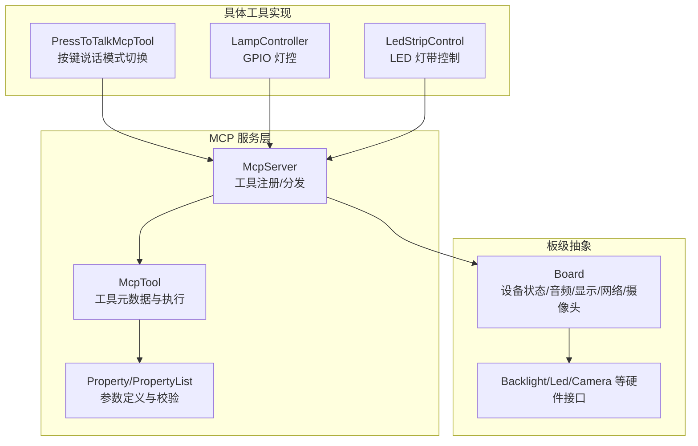
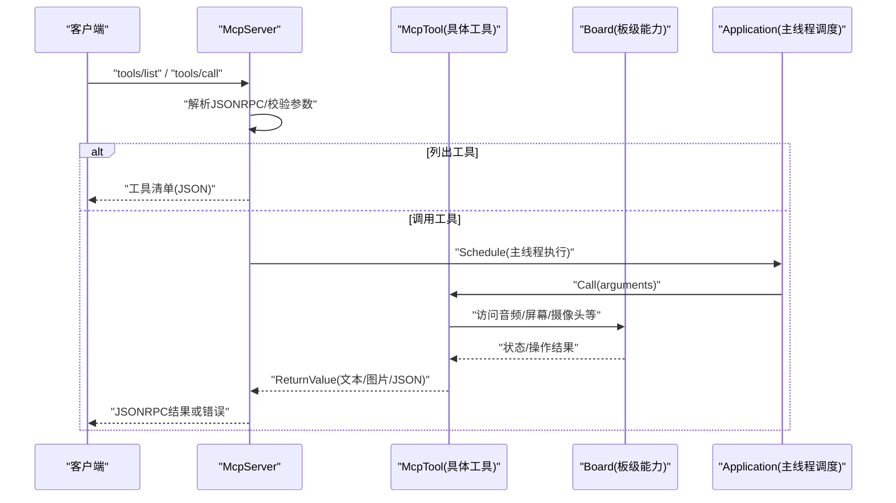
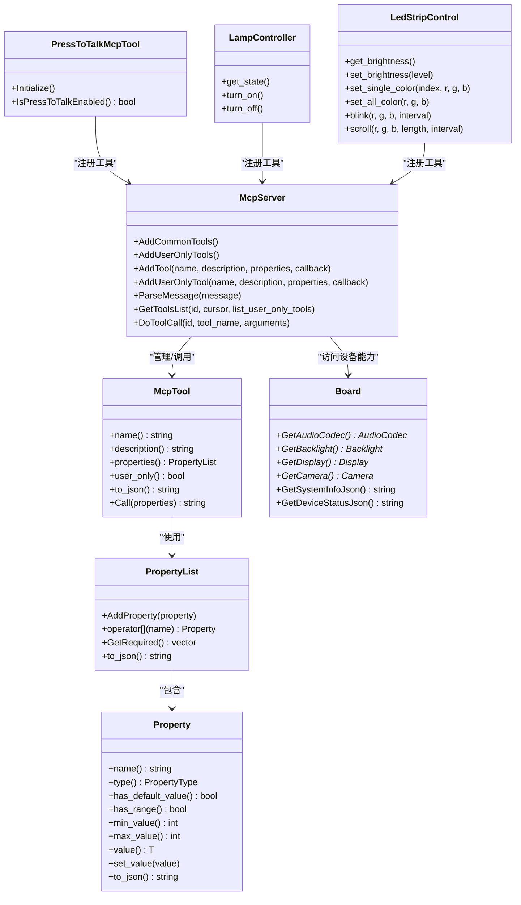
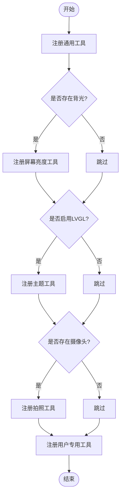

# 内置工具详解

<cite>
**本文引用的文件**   
- [mcp_server.h](file://main/mcp_server.h)
- [mcp_server.cc](file://main/mcp_server.cc)
- [board.h](file://main/boards/common/board.h)
- [board.cc](file://main/boards/common/board.cc)
- [press_to_talk_mcp_tool.h](file://main/boards/common/press_to_talk_mcp_tool.h)
- [press_to_talk_mcp_tool.cc](file://main/boards/common/press_to_talk_mcp_tool.cc)
- [lamp_controller.h](file://main/boards/common/lamp_controller.h)
- [led_control.h](file://main/boards/df-k10/led_control.h)
- [led_control.cc](file://main/boards/df-k10/led_control.cc)
- [df_k10_board.cc](file://main/boards/df-k10/df_k10_board.cc)
</cite>

## 目录
1. [简介](#简介)
2. [项目结构](#项目结构)
3. [核心组件](#核心组件)
4. [架构总览](#架构总览)
5. [详细组件分析](#详细组件分析)
6. [依赖关系分析](#依赖关系分析)
7. [性能与最佳实践](#性能与最佳实践)
8. [故障排查指南](#故障排查指南)
9. [结论](#结论)
10. [附录：API参考](#附录api参考)

## 简介
本文件面向开发者与集成方，系统化梳理并说明本项目中已实现的 MCP（Model Context Protocol）内置工具。内容覆盖工具分类、功能描述、参数与返回值规范、调用流程、错误处理、性能与安全注意事项，并提供完整的 API 参考与使用场景示例。读者无需深入底层即可理解如何发现、调用与维护这些工具。

## 项目结构
MCP 工具由统一的服务器框架注册与管理，通用工具在启动时优先注册以利用提示缓存；用户专用工具通过“仅用户可见”的标记进行隔离。板级能力（如 LED、GPIO、摄像头等）通过 Board 抽象暴露给上层工具。

图示来源
- [mcp_server.h:314-342](file://main/mcp_server.h#L314-L342)
- [mcp_server.cc:33-126](file://main/mcp_server.cc#L33-L126)
- [board.h:49-85](file://main/boards/common/board.h#L49-L85)
- [press_to_talk_mcp_tool.cc:10-29](file://main/boards/common/press_to_talk_mcp_tool.cc#L10-L29)
- [lamp_controller.h:7-45](file://main/boards/common/lamp_controller.h#L7-L45)
- [led_control.cc:19-124](file://main/boards/df-k10/led_control.cc#L19-L124)

章节来源
- [mcp_server.h:1-344](file://main/mcp_server.h#L1-L344)
- [mcp_server.cc:1-561](file://main/mcp_server.cc#L1-L561)
- [board.h:1-93](file://main/boards/common/board.h#L1-L93)
- [board.cc:1-179](file://main/boards/common/board.cc#L1-L179)

## 核心组件
- McpServer：MCP 协议服务端，负责工具列表管理、参数解析、调度执行与结果返回。
- McpTool：单个工具的封装，包含名称、描述、输入 Schema、回调与“仅用户可见”标记。
- Property/PropertyList：参数类型与约束声明，支持布尔、整数、字符串及范围限制。
- Board：板级抽象，提供音频、背光、显示、网络、摄像头等能力，供工具统一访问。
- 板级工具实现：如 PressToTalkMcpTool、LampController、LedStripControl 等，按需注册到 MCP 服务。

章节来源
- [mcp_server.h:50-206](file://main/mcp_server.h#L50-L206)
- [mcp_server.h:208-312](file://main/mcp_server.h#L208-L312)
- [mcp_server.h:314-342](file://main/mcp_server.h#L314-L342)
- [board.h:49-85](file://main/boards/common/board.h#L49-L85)

## 架构总览
下图展示了从客户端发起工具调用到设备侧执行的完整链路，包括参数校验、主线程调度与结果回传。

图示来源
- [mcp_server.cc:350-433](file://main/mcp_server.cc#L350-L433)
- [mcp_server.cc:508-560](file://main/mcp_server.cc#L508-L560)
- [mcp_server.h:272-312](file://main/mcp_server.h#L272-L312)

## 详细组件分析

### 通用工具（AI 可见）
以下工具在启动时优先注册，便于 AI 快速发现并使用。

- self.get_device_status
  - 功能：获取设备实时状态（音频、屏幕、电池、网络等）。
  - 参数：无。
  - 返回：JSON 对象（设备状态）。
  - 备注：建议作为控制设备前的第一步查询。
  - 章节来源
    - [mcp_server.cc:45-53](file://main/mcp_server.cc#L45-L53)
    - [board.cc:70-178](file://main/boards/common/board.cc#L70-L178)

- self.audio_speaker.set_volume
  - 功能：设置扬声器音量。
  - 参数：volume（整数，0-100）。
  - 返回：布尔（成功/失败）。
  - 章节来源
    - [mcp_server.cc:55-64](file://main/mcp_server.cc#L55-L64)

- self.screen.set_brightness
  - 功能：设置屏幕亮度。
  - 参数：brightness（整数，0-100）。
  - 返回：布尔。
  - 条件：仅在设备存在背光模块时可用。
  - 章节来源
    - [mcp_server.cc:66-78](file://main/mcp_server.cc#L66-L78)

- self.screen.set_theme
  - 功能：设置屏幕主题（light/dark）。
  - 参数：theme（字符串）。
  - 返回：布尔。
  - 条件：仅在启用 LVGL 且存在主题管理器时可用。
  - 章节来源
    - [mcp_server.cc:80-98](file://main/mcp_server.cc#L80-L98)

- self.camera.take_photo
  - 功能：拍照并根据问题生成图像信息。
  - 参数：question（字符串）。
  - 返回：JSON 对象（图像信息与解释）。
  - 条件：仅在设备具备摄像头时可用。
  - 章节来源
    - [mcp_server.cc:100-122](file://main/mcp_server.cc#L100-L122)

### 用户专用工具（仅用户可见）
此类工具带有“仅用户可见”标记，默认对 AI 不可见，适合系统管理与维护。

- self.get_system_info
  - 功能：获取系统信息（芯片、分区、应用版本等）。
  - 参数：无。
  - 返回：JSON 对象。
  - 章节来源
    - [mcp_server.cc:130-136](file://main/mcp_server.cc#L130-L136)
    - [board.cc:70-178](file://main/boards/common/board.cc#L70-L178)

- self.reboot
  - 功能：重启设备。
  - 参数：无。
  - 返回：布尔。
  - 注意：异步执行，避免阻塞。
  - 章节来源
    - [mcp_server.cc:138-149](file://main/mcp_server.cc#L138-L149)

- self.upgrade_firmware
  - 功能：从指定 URL 下载并安装固件，完成后重启。
  - 参数：url（字符串）。
  - 返回：布尔。
  - 注意：异步执行，需确保网络可用。
  - 章节来源
    - [mcp_server.cc:152-169](file://main/mcp_server.cc#L152-L169)

- self.screen.get_info
  - 功能：获取屏幕信息（分辨率、是否单色等）。
  - 参数：无。
  - 返回：JSON 对象。
  - 条件：仅在 LVGL 显示可用时可用。
  - 章节来源
    - [mcp_server.cc:173-187](file://main/mcp_server.cc#L173-L187)

- self.screen.snapshot
  - 功能：截取屏幕并以 multipart/form-data 上传至指定 URL。
  - 参数：url（字符串）、quality（整数，1-100，默认80）。
  - 返回：布尔。
  - 条件：仅在启用截图功能时可用。
  - 章节来源
    - [mcp_server.cc:189-242](file://main/mcp_server.cc#L189-L242)

- self.screen.preview_image
  - 功能：预览远程图片（GET 下载后显示）。
  - 参数：url（字符串）。
  - 返回：布尔。
  - 条件：仅在 LVGL 显示可用时可用。
  - 章节来源
    - [mcp_server.cc:244-283](file://main/mcp_server.cc#L244-L283)

- self.assets.set_download_url
  - 功能：设置资源下载 URL（持久化保存）。
  - 参数：url（字符串）。
  - 返回：布尔。
  - 章节来源
    - [mcp_server.cc:288-297](file://main/mcp_server.cc#L288-L297)

### 板级与用户扩展工具

- PressToTalkMcpTool（按键说话模式）
  - 工具名：self.set_press_to_talk
  - 功能：在“长按说话”和“单击说话”模式间切换。
  - 参数：mode（字符串，取值为 press_to_talk 或 click_to_talk）。
  - 返回：布尔。
  - 行为：读取/写入 vendor 配置区，持久化当前模式。
  - 章节来源
    - [press_to_talk_mcp_tool.h:1-29](file://main/boards/common/press_to_talk_mcp_tool.h#L1-L29)
    - [press_to_talk_mcp_tool.cc:10-57](file://main/boards/common/press_to_talk_mcp_tool.cc#L10-L57)

- LampController（GPIO 灯控）
  - 工具名：
    - self.lamp.get_state：获取灯的电源状态（返回 JSON）。
    - self.lamp.turn_on：打开灯。
    - self.lamp.turn_off：关闭灯。
  - 参数：无。
  - 返回：布尔或 JSON。
  - 行为：直接操作 GPIO 输出电平。
  - 章节来源
    - [lamp_controller.h:7-45](file://main/boards/common/lamp_controller.h#L7-L45)

- LedStripControl（LED 灯带控制，DF-K10 板）
  - 工具名：
    - self.led_strip.get_brightness：获取亮度等级（0-8）。
    - self.led_strip.set_brightness：设置亮度等级（0-8），持久化保存。
    - self.led_strip.set_single_color：设置单个 LED 颜色（index, red, green, blue）。
    - self.led_strip.set_all_color：设置所有 LED 颜色（red, green, blue）。
    - self.led_strip.blink：闪烁（red, green, blue, interval）。
    - self.led_strip.scroll：跑马灯（red, green, blue, length, interval）。
  - 参数：详见各工具描述。
  - 返回：布尔或整数。
  - 行为：基于 CircularStrip 驱动，内部映射等级与实际亮度。
  - 章节来源
    - [led_control.h:1-19](file://main/boards/df-k10/led_control.h#L1-L19)
    - [led_control.cc:19-124](file://main/boards/df-k10/led_control.cc#L19-L124)
    - [df_k10_board.cc:250-254](file://main/boards/df-k10/df_k10_board.cc#L250-L254)

### 类图（代码结构）

图示来源
- [mcp_server.h:50-206](file://main/mcp_server.h#L50-L206)
- [mcp_server.h:208-312](file://main/mcp_server.h#L208-L312)
- [mcp_server.h:314-342](file://main/mcp_server.h#L314-L342)
- [board.h:49-85](file://main/boards/common/board.h#L49-L85)
- [press_to_talk_mcp_tool.h:1-29](file://main/boards/common/press_to_talk_mcp_tool.h#L1-L29)
- [lamp_controller.h:7-45](file://main/boards/common/lamp_controller.h#L7-L45)
- [led_control.h:1-19](file://main/boards/df-k10/led_control.h#L1-L19)

## 依赖关系分析
- 工具注册顺序：通用工具优先插入，以提升提示缓存命中率；自定义/板级工具随后追加。
- 参数校验：Property 支持整型范围限制，非法值将抛出异常并被捕获为错误响应。
- 执行上下文：工具回调在主线程中执行，避免跨线程访问硬件导致的竞态。
- 能力探测：部分工具仅在特定硬件/编译选项存在时注册（如 LVGL、摄像头、背光）。

图示来源
- [mcp_server.cc:33-126](file://main/mcp_server.cc#L33-L126)
- [mcp_server.cc:128-298](file://main/mcp_server.cc#L128-L298)

章节来源
- [mcp_server.cc:33-126](file://main/mcp_server.cc#L33-L126)
- [mcp_server.cc:128-298](file://main/mcp_server.cc#L128-L298)

## 性能与最佳实践
- 工具排序与缓存：通用工具靠前注册，利于提示缓存命中，降低首字延迟。
- 参数边界检查：尽量使用 Property 的范围限制，减少无效调用与异常分支。
- 异步与优先级：耗时操作（如拍照、升级固件）应降优先级或异步执行，避免阻塞主循环。
- 内存与网络：截图与图片预览涉及较大内存分配与网络 I/O，需关注堆空间与超时策略。
- 幂等性：重复调用同一工具应尽量保证幂等（如设置亮度、开关灯）。
- 安全：用户专用工具默认对 AI 隐藏，避免被自动触发；固件升级需校验 URL 合法性与完整性。

[本节为通用指导，不直接分析具体文件]

## 故障排查指南
- 常见错误
  - 未知工具：检查工具名是否正确，确认该工具在当前板级/编译选项下是否注册。
  - 缺少参数：根据工具定义的必填项补全参数，注意类型匹配。
  - 参数越界：整数参数超出最小/最大值将被拒绝，调整至合法区间。
  - 硬件未就绪：摄像头/背光/LVGL 相关工具需在对应硬件存在时方可使用。
- 定位方法
  - 查看日志标签（MCP、LedStripControl、PressToTalkMcpTool 等）定位错误位置。
  - 先调用 self.get_device_status 与 self.get_system_info 了解设备状态。
  - 对于网络相关工具（snapshot、preview_image、upgrade_firmware），检查网络连接与目标 URL 可达性。

章节来源
- [mcp_server.cc:508-560](file://main/mcp_server.cc#L508-L560)
- [mcp_server.cc:350-433](file://main/mcp_server.cc#L350-L433)
- [led_control.cc:19-124](file://main/boards/df-k10/led_control.cc#L19-L124)
- [press_to_talk_mcp_tool.cc:10-57](file://main/boards/common/press_to_talk_mcp_tool.cc#L10-L57)

## 结论
本项目通过统一的 MCP 工具框架，将设备能力以标准化方式暴露给上层应用与 AI。通用工具优先注册以提升交互效率，用户专用工具用于系统管理与维护。借助清晰的参数 Schema、严格的类型与范围校验以及主线程调度的执行模型，整体具备良好的可维护性与稳定性。建议在集成时遵循最佳实践，结合设备状态查询与错误处理，构建健壮的人机交互体验。

[本节为总结，不直接分析具体文件]

## 附录：API参考

### 通用工具一览
- self.get_device_status
  - 参数：无
  - 返回：JSON（设备状态）
  - 章节来源
    - [mcp_server.cc:45-53](file://main/mcp_server.cc#L45-L53)
    - [board.cc:70-178](file://main/boards/common/board.cc#L70-L178)

- self.audio_speaker.set_volume
  - 参数：volume（整数，0-100）
  - 返回：布尔
  - 章节来源
    - [mcp_server.cc:55-64](file://main/mcp_server.cc#L55-L64)

- self.screen.set_brightness
  - 参数：brightness（整数，0-100）
  - 返回：布尔
  - 章节来源
    - [mcp_server.cc:66-78](file://main/mcp_server.cc#L66-L78)

- self.screen.set_theme
  - 参数：theme（字符串，light/dark）
  - 返回：布尔
  - 章节来源
    - [mcp_server.cc:80-98](file://main/mcp_server.cc#L80-L98)

- self.camera.take_photo
  - 参数：question（字符串）
  - 返回：JSON（图像信息与解释）
  - 章节来源
    - [mcp_server.cc:100-122](file://main/mcp_server.cc#L100-L122)

### 用户专用工具一览
- self.get_system_info
  - 参数：无
  - 返回：JSON（系统信息）
  - 章节来源
    - [mcp_server.cc:130-136](file://main/mcp_server.cc#L130-L136)
    - [board.cc:70-178](file://main/boards/common/board.cc#L70-L178)

- self.reboot
  - 参数：无
  - 返回：布尔
  - 章节来源
    - [mcp_server.cc:138-149](file://main/mcp_server.cc#L138-L149)

- self.upgrade_firmware
  - 参数：url（字符串）
  - 返回：布尔
  - 章节来源
    - [mcp_server.cc:152-169](file://main/mcp_server.cc#L152-L169)

- self.screen.get_info
  - 参数：无
  - 返回：JSON（屏幕信息）
  - 章节来源
    - [mcp_server.cc:173-187](file://main/mcp_server.cc#L173-L187)

- self.screen.snapshot
  - 参数：url（字符串）、quality（整数，1-100，默认80）
  - 返回：布尔
  - 章节来源
    - [mcp_server.cc:189-242](file://main/mcp_server.cc#L189-L242)

- self.screen.preview_image
  - 参数：url（字符串）
  - 返回：布尔
  - 章节来源
    - [mcp_server.cc:244-283](file://main/mcp_server.cc#L244-L283)

- self.assets.set_download_url
  - 参数：url（字符串）
  - 返回：布尔
  - 章节来源
    - [mcp_server.cc:288-297](file://main/mcp_server.cc#L288-L297)

### 板级与用户扩展工具一览
- self.set_press_to_talk（PressToTalkMcpTool）
  - 参数：mode（字符串，press_to_talk 或 click_to_talk）
  - 返回：布尔
  - 章节来源
    - [press_to_talk_mcp_tool.cc:10-57](file://main/boards/common/press_to_talk_mcp_tool.cc#L10-L57)

- self.lamp.*（LampController）
  - 工具：get_state、turn_on、turn_off
  - 参数：无
  - 返回：布尔或 JSON
  - 章节来源
    - [lamp_controller.h:7-45](file://main/boards/common/lamp_controller.h#L7-L45)

- self.led_strip.*（LedStripControl，DF-K10）
  - 工具：get_brightness、set_brightness、set_single_color、set_all_color、blink、scroll
  - 参数：详见工具描述
  - 返回：布尔或整数
  - 章节来源
    - [led_control.cc:19-124](file://main/boards/df-k10/led_control.cc#L19-L124)
    - [df_k10_board.cc:250-254](file://main/boards/df-k10/df_k10_board.cc#L250-L254)