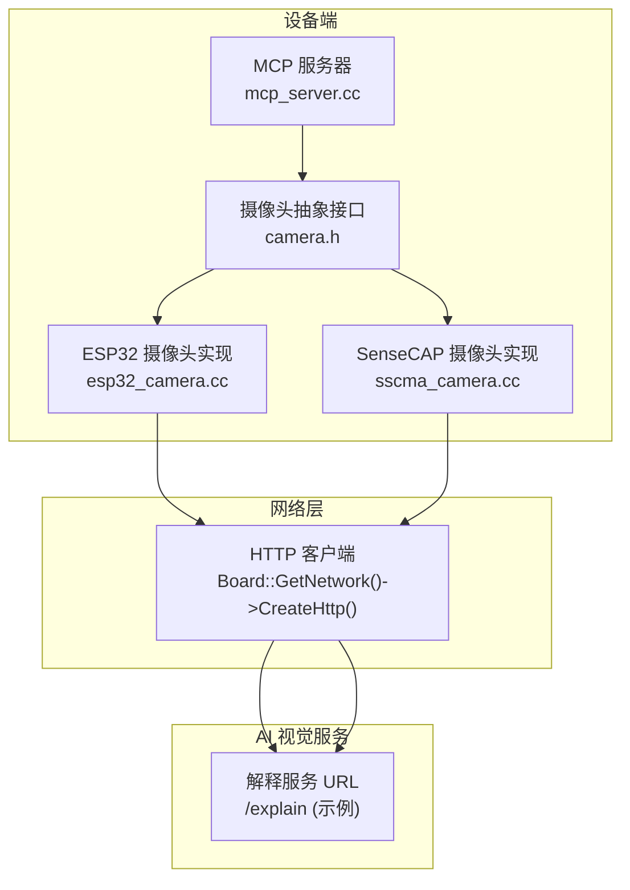
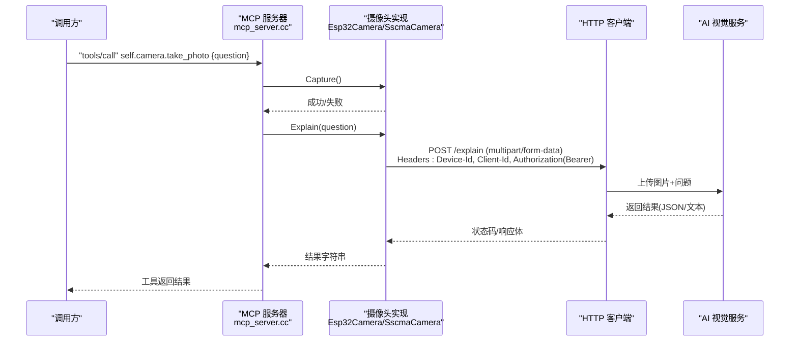
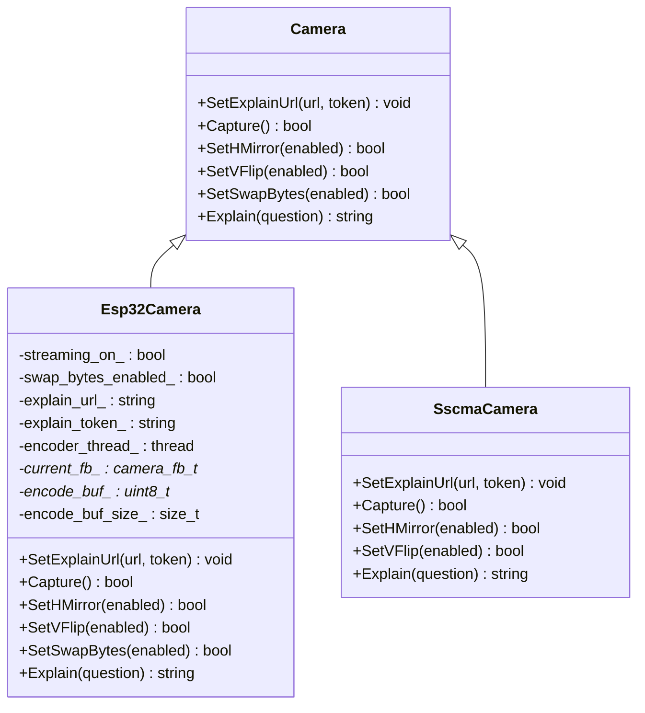
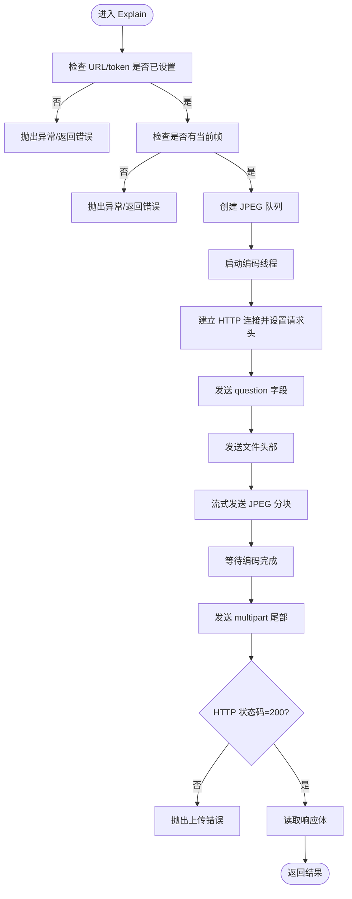
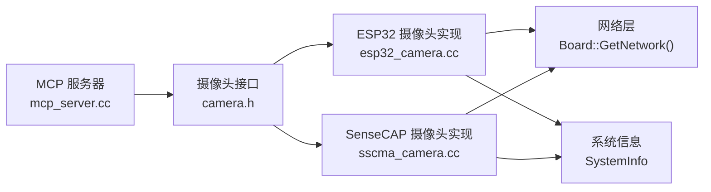

# 摄像头控制工具

<cite>
**本文引用的文件**   
- [camera.h](file://main/boards/common/camera.h)
- [esp32_camera.h](file://main/boards/common/esp32_camera.h)
- [esp32_camera.cc](file://main/boards/common/esp32_camera.cc)
- [sscma_camera.h](file://main/boards/sensecap-watcher/sscma_camera.h)
- [sscma_camera.cc](file://main/boards/sensecap-watcher/sscma_camera.cc)
- [mcp_server.cc](file://main/mcp_server.cc)
- [mcp-usage.md](file://docs/mcp-usage.md)
- [websocket_zh.md](file://docs/websocket_zh.md)
</cite>

## 目录
1. [简介](#简介)
2. [项目结构](#项目结构)
3. [核心组件](#核心组件)
4. [架构总览](#架构总览)
5. [详细组件分析](#详细组件分析)
6. [依赖关系分析](#依赖关系分析)
7. [性能与资源考虑](#性能与资源考虑)
8. [故障排查指南](#故障排查指南)
9. [结论](#结论)
10. [附录：API与配置参考](#附录api与配置参考)

## 简介
本文件面向使用 xiaozhi-esp32 项目的开发者与集成者，系统化说明“摄像头控制工具”的能力与实现。重点覆盖：
- self.camera.take_photo 工具的调用方式、question 参数的作用、拍照流程与返回格式
- 摄像头与 AI 视觉服务的集成机制（URL 配置、token 认证、异步处理）
- 典型应用场景（物体识别、场景描述、OCR 文字识别等）
- 权限管理、隐私保护与安全最佳实践

## 项目结构
与摄像头能力相关的代码主要分布在以下位置：
- 通用摄像头抽象接口：main/boards/common/camera.h
- ESP32 平台摄像头实现：main/boards/common/esp32_camera.{h,cc}
- SenseCAP Watcher 平台摄像头实现：main/boards/sensecap-watcher/sscma_camera.{h,cc}
- MCP 工具注册与调用入口：main/mcp_server.cc
- 文档与协议参考：docs/mcp-usage.md、docs/websocket_zh.md

图示来源
- [mcp_server.cc:100-122](file://main/mcp_server.cc#L100-L122)
- [camera.h:6-14](file://main/boards/common/camera.h#L6-L14)
- [esp32_camera.cc:155-322](file://main/boards/common/esp32_camera.cc#L155-L322)
- [sscma_camera.cc:677-743](file://main/boards/sensecap-watcher/sscma_camera.cc#L677-L743)

章节来源
- [mcp_server.cc:100-122](file://main/mcp_server.cc#L100-L122)
- [camera.h:6-14](file://main/boards/common/camera.h#L6-L14)
- [esp32_camera.cc:155-322](file://main/boards/common/esp32_camera.cc#L155-L322)
- [sscma_camera.cc:677-743](file://main/boards/sensecap-watcher/sscma_camera.cc#L677-L743)

## 核心组件
- 摄像头抽象接口 Camera
  - 定义统一的摄像头能力：设置解释服务 URL/token、拍照、镜像/翻转、字节序交换、图像解释。
- ESP32 摄像头实现 Esp32Camera
  - 基于 ESP-IDF esp_camera 驱动，支持 RGB565/YUV/JPEG 等像素格式；将帧编码为 JPEG，通过 HTTP multipart/form-data 上传至 AI 服务并返回结果。
- SenseCAP 摄像头实现 SscmaCamera
  - 通过 SSCMA 客户端获取 JPEG 数据，解码预览，并以相同 multipart 协议上传到 AI 服务。
- MCP 工具 self.camera.take_photo
  - 在 MCP 服务器中注册，接收 question 参数，触发 Capture + Explain，返回服务端解析后的文本或 JSON。

章节来源
- [camera.h:6-14](file://main/boards/common/camera.h#L6-L14)
- [esp32_camera.h:22-44](file://main/boards/common/esp32_camera.h#L22-L44)
- [esp32_camera.cc:54-130](file://main/boards/common/esp32_camera.cc#L54-L130)
- [sscma_camera.cc:566-651](file://main/boards/sensecap-watcher/sscma_camera.cc#L566-L651)
- [mcp_server.cc:100-122](file://main/mcp_server.cc#L100-L122)

## 架构总览
self.camera.take_photo 的端到端流程如下：
- 上层通过 MCP tools/call 调用 self.camera.take_photo，传入 question
- MCP 回调执行 camera->Capture() 获取最新帧
- 随后 camera->Explain(question) 将图片编码为 JPEG，以 multipart/form-data 上传至 AI 视觉服务
- 服务端返回文本或结构化结果，MCP 将其作为工具返回值回传

图示来源
- [mcp_server.cc:100-122](file://main/mcp_server.cc#L100-L122)
- [esp32_camera.cc:155-322](file://main/boards/common/esp32_camera.cc#L155-L322)
- [sscma_camera.cc:677-743](file://main/boards/sensecap-watcher/sscma_camera.cc#L677-L743)

## 详细组件分析

### 类与接口关系

图示来源
- [camera.h:6-14](file://main/boards/common/camera.h#L6-L14)
- [esp32_camera.h:22-44](file://main/boards/common/esp32_camera.h#L22-L44)
- [sscma_camera.h:65](file://main/boards/sensecap-watcher/sscma_camera.h#L65)

章节来源
- [camera.h:6-14](file://main/boards/common/camera.h#L6-L14)
- [esp32_camera.h:22-44](file://main/boards/common/esp32_camera.h#L22-L44)
- [sscma_camera.h:65](file://main/boards/sensecap-watcher/sscma_camera.h#L65)

### 工具 self.camera.take_photo 详解
- 功能概述
  - 使用板载摄像头拍摄当前画面，并将图片连同问题提交给 AI 视觉服务进行解释，返回结果。
- 参数
  - question: 字符串类型，向 AI 提出的关于图片的问题（如“图中有什么物体？”、“请描述场景”、“识别图中的文字”）。
- 返回值
  - 由 AI 服务返回的文本或 JSON 字符串（例如包含 success/result/message 字段），具体格式取决于服务端实现。
- 调用路径
  - MCP 层：AddTool("self.camera.take_photo", ...) -> 回调中执行 Capture() 与 Explain(question)
  - 摄像头层：根据平台实现选择 Esp32Camera 或 SscmaCamera
- 关键行为
  - 降低任务优先级以避免阻塞主循环
  - 若未设置解释服务 URL/token，将抛出异常或返回错误信息
  - 若未捕获到帧，将抛出异常或返回错误信息

章节来源
- [mcp_server.cc:100-122](file://main/mcp_server.cc#L100-L122)
- [esp32_camera.cc:155-162](file://main/boards/common/esp32_camera.cc#L155-L162)
- [sscma_camera.cc:677-680](file://main/boards/sensecap-watcher/sscma_camera.cc#L677-L680)

### 拍照与解释流程（Esp32Camera）
- 拍照 Capture
  - 获取最新帧，丢弃旧帧以保证实时性
  - 对 RGB565 格式准备编码缓冲，可选字节序交换
  - 尝试在 LVGL 显示上预览（RGB565 时有效）
- 解释 Explain
  - 校验是否已设置解释服务 URL/token
  - 校验是否存在当前帧
  - 启动编码线程，将原始帧转换为 JPEG 分块
  - 通过 HTTP multipart/form-data 上传 question 与 file
  - 等待编码器完成，检查状态码并读取响应

图示来源
- [esp32_camera.cc:155-322](file://main/boards/common/esp32_camera.cc#L155-L322)

章节来源
- [esp32_camera.cc:59-130](file://main/boards/common/esp32_camera.cc#L59-L130)
- [esp32_camera.cc:155-322](file://main/boards/common/esp32_camera.cc#L155-L322)

### 解释服务集成机制
- URL 与 Token 配置
  - 通过 MCP initialize 的 capabilities.vision.url 与 capabilities.vision.token 下发
  - MCP 解析后调用 camera->SetExplainUrl(url, token)
- 请求头与认证
  - 自动添加 Device-Id、Client-Id
  - 若提供 token，则添加 Authorization: Bearer <token>
  - Content-Type: multipart/form-data; boundary=...
  - Transfer-Encoding: chunked
- 表单内容
  - 字段 question：字符串
  - 字段 file：文件名 camera.jpg，类型 image/jpeg
- 响应处理
  - 检查 HTTP 状态码是否为 200
  - 读取响应体作为工具返回值

章节来源
- [mcp_server.cc:331-348](file://main/mcp_server.cc#L331-L348)
- [esp32_camera.cc:236-246](file://main/boards/common/esp32_camera.cc#L236-L246)
- [sscma_camera.cc:706-712](file://main/boards/sensecap-watcher/sscma_camera.cc#L706-L712)

### 典型应用场景
- 物体识别
  - question 示例：“图中有哪些物体？请列出名称和数量。”
- 场景描述
  - question 示例：“请用一句话描述当前场景。”
- OCR 文字识别
  - question 示例：“识别图中的所有可见文字并按行输出。”
- 其他扩展
  - 结合屏幕截图工具 self.screen.snapshot 可将 UI 界面内容上传进行分析
  - 结合主题/亮度控制工具可优化展示效果

章节来源
- [mcp-usage.md:107](file://docs/mcp-usage.md#L107)
- [mcp_server.cc:100-122](file://main/mcp_server.cc#L100-L122)

## 依赖关系分析
- 模块耦合
  - MCP 层仅依赖 Camera 抽象接口，不感知具体平台实现
  - 摄像头实现依赖 Board 提供的 Display、Network、SystemInfo 等能力
- 外部依赖
  - ESP-IDF esp_camera 驱动（ESP32 平台）
  - FreeRTOS 队列与线程用于异步编码
  - HTTP 客户端用于上传与接收响应
- 潜在循环依赖
  - 无直接循环依赖；MCP 通过 Board 获取 Camera，Camera 通过 Board 获取 Network/Display

图示来源
- [mcp_server.cc:100-122](file://main/mcp_server.cc#L100-L122)
- [camera.h:6-14](file://main/boards/common/camera.h#L6-L14)
- [esp32_camera.cc:236-246](file://main/boards/common/esp32_camera.cc#L236-L246)
- [sscma_camera.cc:706-712](file://main/boards/sensecap-watcher/sscma_camera.cc#L706-L712)

章节来源
- [mcp_server.cc:100-122](file://main/mcp_server.cc#L100-L122)
- [camera.h:6-14](file://main/boards/common/camera.h#L6-L14)
- [esp32_camera.cc:236-246](file://main/boards/common/esp32_camera.cc#L236-L246)
- [sscma_camera.cc:706-712](file://main/boards/sensecap-watcher/sscma_camera.cc#L706-L712)

## 性能与资源考虑
- 内存分配
  - RGB565 编码缓冲与预览缓冲均使用 SPIRAM 分配，避免 PSRAM 碎片化
  - JPEG 分块按 16 字节对齐分配，减少拷贝开销
- 并发与阻塞
  - 编码在独立线程中进行，主线程负责网络 I/O，避免长时间阻塞
  - 使用队列传递 JPEG 分块，解耦编码与传输
- 预览体验
  - RGB565 可直接预览；JPEG 预览需解码，默认跳过预览以减少延迟
- 网络与超时
  - 使用分块传输，适合大图片上传；建议服务端具备合理的超时与重试策略

[本节为通用指导，无需特定文件引用]

## 故障排查指南
- 常见错误与定位
  - “未设置解释服务 URL 或 token”：检查 MCP initialize 的 capabilities.vision 是否正确下发
  - “未捕获到相机帧”：确认 Capture() 成功且 streaming_on_ 为真
  - “HTTP 连接失败/状态码非 200”：检查网络连通性与服务端地址、端口、证书
  - “JPEG 编码失败或输出为空”：检查像素格式与编码器回调是否正常
- 日志关键字
  - “Failed to connect to explain URL”
  - “Failed to upload photo, status code: ...”
  - “JPEG encoding time: ... ms”
- 快速自检清单
  - 确认已在 MCP initialize 中设置 vision.url 与 vision.token
  - 确认设备具备摄像头硬件且初始化成功
  - 确认服务端接受 multipart/form-data 且字段名为 question/file
  - 确认 Authorization 头格式为 Bearer <token>

章节来源
- [esp32_camera.cc:155-162](file://main/boards/common/esp32_camera.cc#L155-L162)
- [esp32_camera.cc:247-260](file://main/boards/common/esp32_camera.cc#L247-L260)
- [esp32_camera.cc:310-313](file://main/boards/common/esp32_camera.cc#L310-L313)
- [sscma_camera.cc:677-680](file://main/boards/sensecap-watcher/sscma_camera.cc#L677-L680)
- [sscma_camera.cc:713-716](file://main/boards/sensecap-watcher/sscma_camera.cc#L713-L716)
- [sscma_camera.cc:733-736](file://main/boards/sensecap-watcher/sscma_camera.cc#L733-L736)

## 结论
本项目通过统一的摄像头抽象与 MCP 工具封装，实现了跨平台的拍照与视觉解释能力。self.camera.take_photo 提供了简洁的调用方式，question 参数灵活适配多种视觉任务。借助 HTTP multipart/form-data 与 Bearer token 认证，设备可安全地将图像与问题发送至云端 AI 服务，获得即时反馈。建议在部署时关注内存与并发、网络稳定性以及隐私合规，以获得更稳健的用户体验。

[本节为总结性内容，无需特定文件引用]

## 附录：API与配置参考

### 工具定义与参数
- 工具名：self.camera.take_photo
- 参数
  - question: 字符串，向 AI 提出的关于图片的问题
- 返回值
  - 文本或 JSON 字符串（由服务端决定）

章节来源
- [mcp_server.cc:100-122](file://main/mcp_server.cc#L100-L122)
- [mcp-usage.md:107](file://docs/mcp-usage.md#L107)

### 摄像头接口方法
- SetExplainUrl(url, token): 设置 AI 视觉服务 URL 与 token
- Capture(): 捕获当前帧
- SetHMirror(enabled)/SetVFlip(enabled): 水平镜像/垂直翻转
- SetSwapBytes(enabled): 可选，RGB565 字节序交换
- Explain(question): 将当前帧编码并上传，返回服务端结果

章节来源
- [camera.h:6-14](file://main/boards/common/camera.h#L6-L14)
- [esp32_camera.h:37-43](file://main/boards/common/esp32_camera.h#L37-L43)
- [sscma_camera.h:65](file://main/boards/sensecap-watcher/sscma_camera.h#L65)

### 请求头与认证
- 必选
  - Device-Id: 设备 MAC 地址
  - Client-Id: 设备 UUID
  - Content-Type: multipart/form-data; boundary=...
  - Transfer-Encoding: chunked
- 可选
  - Authorization: Bearer <token>（当提供 token 时）

章节来源
- [esp32_camera.cc:236-246](file://main/boards/common/esp32_camera.cc#L236-L246)
- [sscma_camera.cc:706-712](file://main/boards/sensecap-watcher/sscma_camera.cc#L706-L712)
- [websocket_zh.md:85-86](file://docs/websocket_zh.md#L85-L86)

### 表单字段
- question: 字符串
- file: 二进制 JPEG 数据，文件名 camera.jpg，类型 image/jpeg

章节来源
- [esp32_camera.cc:263-277](file://main/boards/common/esp32_camera.cc#L263-L277)
- [sscma_camera.cc:687-699](file://main/boards/sensecap-watcher/sscma_camera.cc#L687-L699)

### 权限管理与隐私保护最佳实践
- 最小权限原则
  - 仅在需要时启用摄像头；在不需要时停止预览与采集
- 用户授权与提示
  - 在应用层增加明确的拍照提示与用户确认步骤
- 数据安全
  - 使用 HTTPS 与 Bearer token 认证
  - 避免在本地持久化敏感图像；必要时加密存储并限制访问
- 合规与审计
  - 记录必要的操作日志（不包含图像内容）
  - 遵循当地隐私法规，提供关闭摄像头功能的途径

[本节为通用指导，无需特定文件引用]