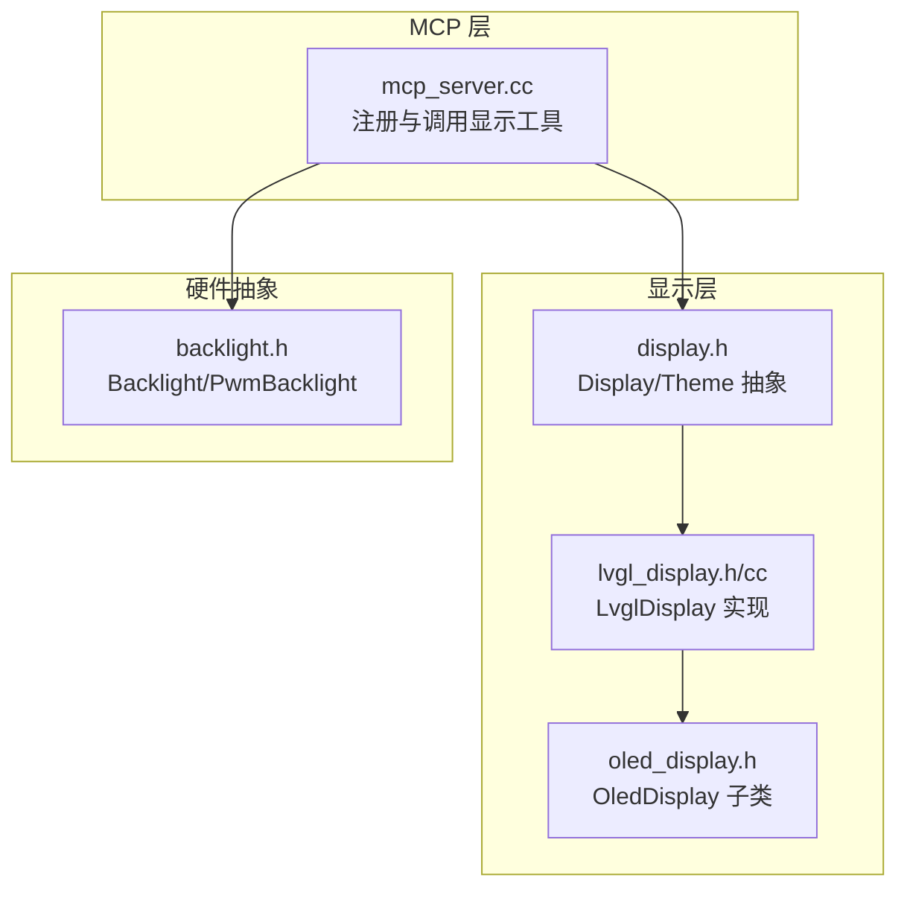
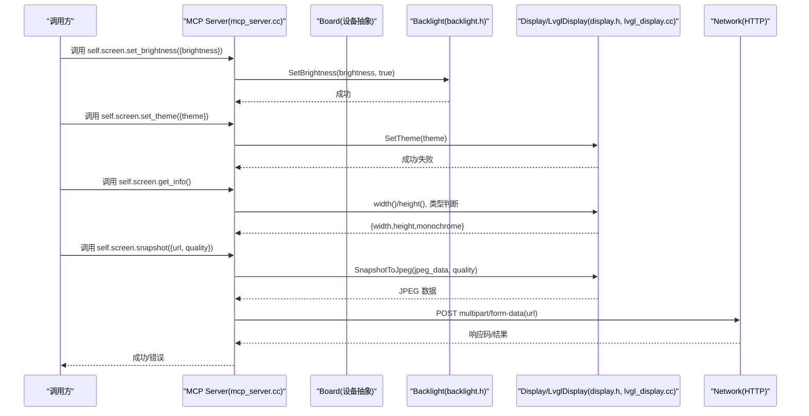
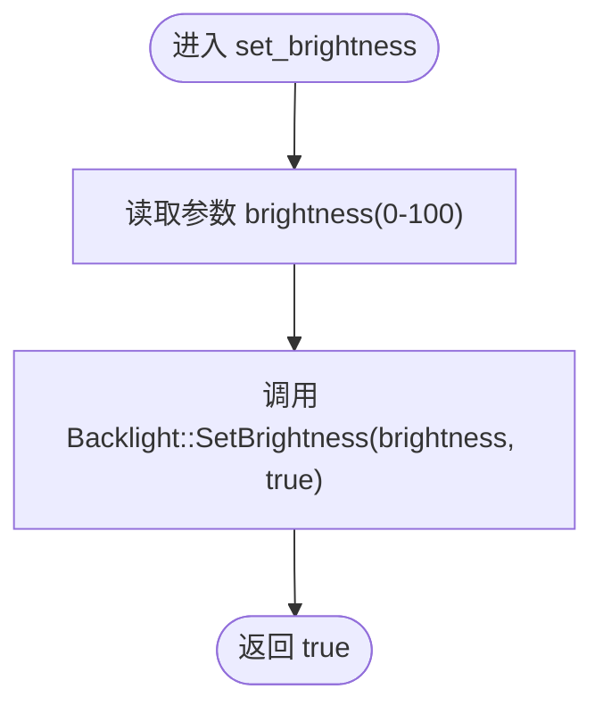
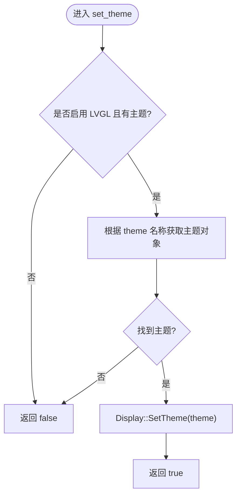
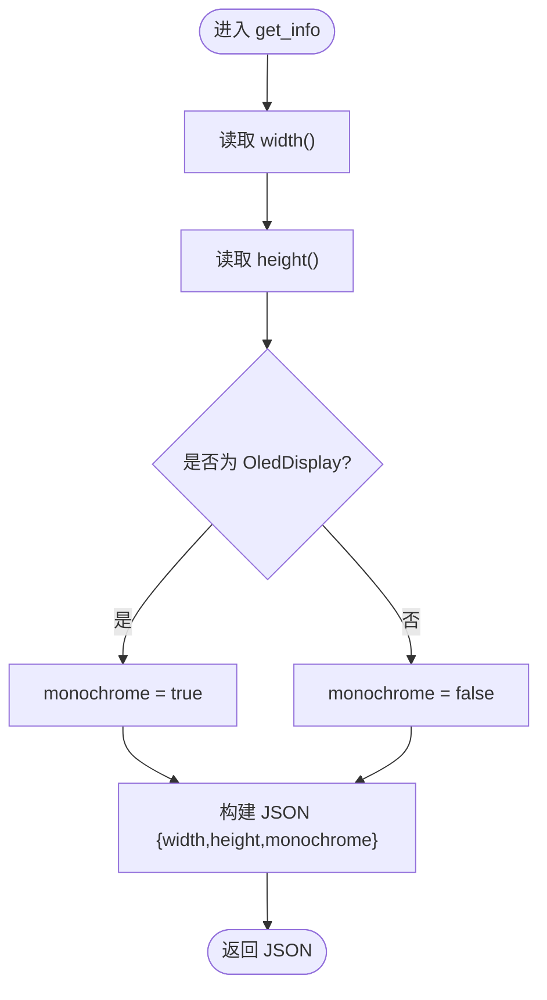
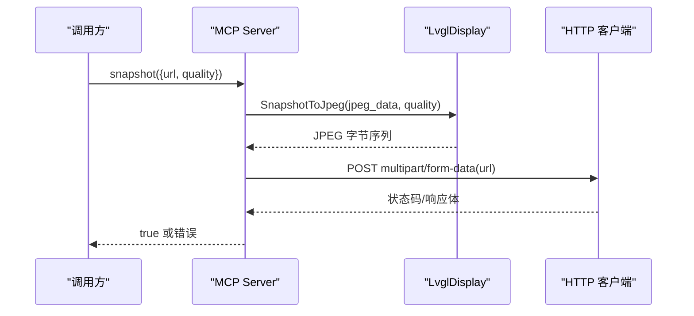
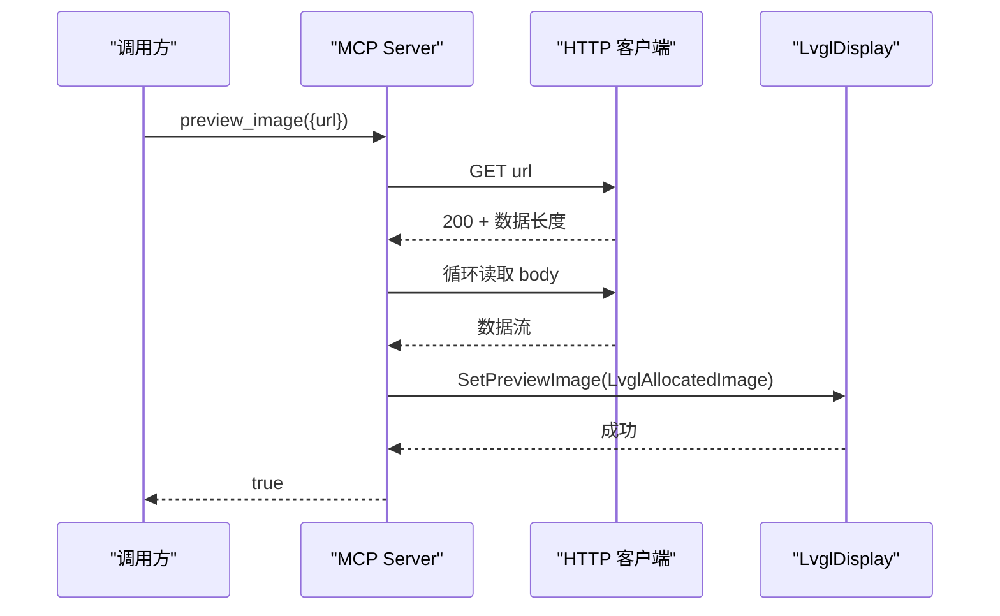
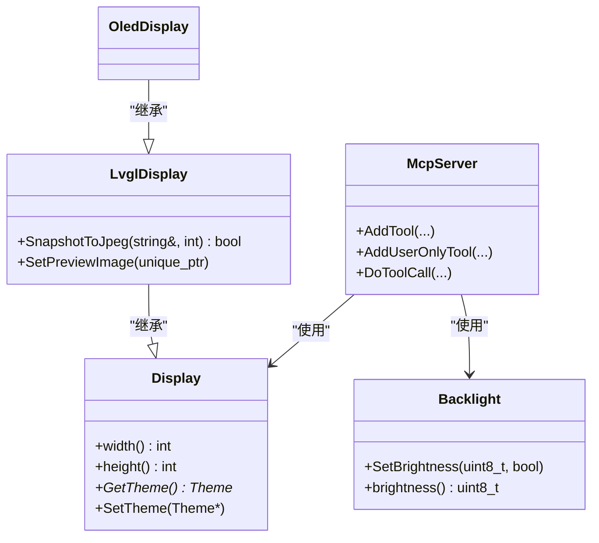

# 显示控制工具

<cite>
**本文引用的文件**   
- [mcp_server.cc](file://main/mcp_server.cc)
- [lvgl_display.h](file://main/display/lvgl_display/lvgl_display.h)
- [lvgl_display.cc](file://main/display/lvgl_display/lvgl_display.cc)
- [display.h](file://main/display/display.h)
- [oled_display.h](file://main/display/oled_display.h)
- [backlight.h](file://main/boards/common/backlight.h)
</cite>

## 目录
1. [简介](#简介)
2. [项目结构](#项目结构)
3. [核心组件](#核心组件)
4. [架构总览](#架构总览)
5. [详细组件分析](#详细组件分析)
6. [依赖关系分析](#依赖关系分析)
7. [性能与资源考量](#性能与资源考量)
8. [故障排查指南](#故障排查指南)
9. [结论](#结论)
10. [附录：API 参考与使用示例](#附录api-参考与使用示例)

## 简介
本文件聚焦于“显示控制工具”的完整说明，覆盖以下能力：
- 屏幕亮度调节：self.screen.set_brightness（参数范围 0-100）
- 主题切换：self.screen.set_theme（支持 light/dark）
- 屏幕信息获取：self.screen.get_info（返回分辨率、是否单色屏等）
- 屏幕截图上传：self.screen.snapshot（JPEG 质量设置、multipart/form-data HTTP 上传）
- 图片预览：self.screen.preview_image（从 URL 下载并展示）

这些工具通过 MCP 协议暴露给上层调用方，底层由背光驱动、LVGL 显示栈与网络模块协作完成。

## 项目结构
与显示控制相关的代码主要分布在如下位置：
- MCP 工具注册与调用入口：main/mcp_server.cc
- LVGL 显示抽象与实现：main/display/lvgl_display/*.h, *.cc
- 显示基类与主题接口：main/display/display.h
- OLED 子类（用于判断单色屏）：main/display/oled_display.h
- 背光控制抽象：main/boards/common/backlight.h

图表来源
- [mcp_server.cc:66-98](file://main/mcp_server.cc#L66-L98)
- [display.h:18-61](file://main/display/display.h#L18-L61)
- [lvgl_display.h:15-50](file://main/display/lvgl_display/lvgl_display.h#L15-L50)
- [oled_display.h:10-39](file://main/display/oled_display.h#L10-L39)
- [backlight.h:10-27](file://main/boards/common/backlight.h#L10-L27)

章节来源
- [mcp_server.cc:66-98](file://main/mcp_server.cc#L66-L98)
- [display.h:18-61](file://main/display/display.h#L18-L61)
- [lvgl_display.h:15-50](file://main/display/lvgl_display/lvgl_display.h#L15-L50)
- [oled_display.h:10-39](file://main/display/oled_display.h#L10-L39)
- [backlight.h:10-27](file://main/boards/common/backlight.h#L10-L27)

## 核心组件
- 背光控制 Backlight/PwmBacklight：提供 SetBrightness(brightness, permanent) 接口，brightness 为 0-100 的整型值。
- 显示抽象 Display/LvglDisplay/OledDisplay：定义主题切换、状态栏更新、截图等能力；OledDisplay 用于识别是否为单色屏。
- MCP 工具集：在 mcp_server.cc 中注册 self.screen.* 系列工具，封装对背光与 LVGL 的调用。

章节来源
- [backlight.h:10-27](file://main/boards/common/backlight.h#L10-L27)
- [display.h:18-61](file://main/display/display.h#L18-L61)
- [lvgl_display.h:15-50](file://main/display/lvgl_display/lvgl_display.h#L15-L50)
- [mcp_server.cc:66-98](file://main/mcp_server.cc#L66-L98)

## 架构总览
下图展示了从 MCP 工具到显示子系统的关键调用路径。

图表来源
- [mcp_server.cc:66-98](file://main/mcp_server.cc#L66-L98)
- [mcp_server.cc:171-242](file://main/mcp_server.cc#L171-L242)
- [lvgl_display.cc:234-274](file://main/display/lvgl_display/lvgl_display.cc#L234-L274)
- [backlight.h:10-27](file://main/boards/common/backlight.h#L10-L27)

## 详细组件分析

### 亮度调节：self.screen.set_brightness
- 功能：设置屏幕亮度，参数 brightness 取值范围为 0-100。
- 行为：当设备存在背光时注册该工具；内部调用背光驱动的 SetBrightness(brightness, permanent=true)。
- 返回值：布尔值表示是否成功。

图表来源
- [mcp_server.cc:66-78](file://main/mcp_server.cc#L66-L78)
- [backlight.h:10-27](file://main/boards/common/backlight.h#L10-L27)

章节来源
- [mcp_server.cc:66-78](file://main/mcp_server.cc#L66-L78)
- [backlight.h:10-27](file://main/boards/common/backlight.h#L10-L27)

### 主题切换：self.screen.set_theme
- 功能：切换 UI 主题，支持 theme="light" 或 "dark"。
- 行为：仅在启用 LVGL 且当前显示对象具备主题管理器时可用；通过主题管理器查找对应主题并应用到显示对象。
- 返回值：若主题有效则返回 true，否则返回 false。

图表来源
- [mcp_server.cc:80-98](file://main/mcp_server.cc#L80-L98)
- [display.h:39-40](file://main/display/display.h#L39-L40)

章节来源
- [mcp_server.cc:80-98](file://main/mcp_server.cc#L80-L98)
- [display.h:39-40](file://main/display/display.h#L39-L40)

### 屏幕信息：self.screen.get_info
- 功能：返回屏幕宽度、高度以及是否为单色屏。
- 行为：基于 LvglDisplay 实例的 width()/height() 与运行时类型判断（OledDisplay 视为单色）。
- 返回格式：JSON 对象，包含字段：
  - width: 整数
  - height: 整数
  - monochrome: 布尔值（true 表示单色屏）

图表来源
- [mcp_server.cc:171-187](file://main/mcp_server.cc#L171-L187)
- [oled_display.h:10-39](file://main/display/oled_display.h#L10-L39)
- [lvgl_display.h:15-50](file://main/display/lvgl_display/lvgl_display.h#L15-L50)

章节来源
- [mcp_server.cc:171-187](file://main/mcp_server.cc#L171-L187)
- [oled_display.h:10-39](file://main/display/oled_display.h#L10-L39)
- [lvgl_display.h:15-50](file://main/display/lvgl_display/lvgl_display.h#L15-L50)

### 屏幕截图：self.screen.snapshot
- 功能：截取当前屏幕为 JPEG，并以 multipart/form-data 方式 POST 到指定 URL。
- 参数：
  - url: 字符串，目标上传地址
  - quality: 整数，JPEG 编码质量，默认 80，范围 1-100
- 行为：
  - 仅在配置 CONFIG_LV_USE_SNAPSHOT=y 时可用
  - 调用 LvglDisplay::SnapshotToJpeg 生成 JPEG 数据
  - 构造 multipart/form-data 请求体，字段名为 file，文件名 screenshot.jpg，Content-Type image/jpeg
  - 发送 POST 请求，检查响应码是否为 200，并返回结果
- 返回值：成功返回 true，异常抛出错误消息

图表来源
- [mcp_server.cc:188-242](file://main/mcp_server.cc#L188-L242)
- [lvgl_display.cc:234-274](file://main/display/lvgl_display/lvgl_display.cc#L234-L274)

章节来源
- [mcp_server.cc:188-242](file://main/mcp_server.cc#L188-L242)
- [lvgl_display.cc:234-274](file://main/display/lvgl_display/lvgl_display.cc#L234-L274)

### 图片预览：self.screen.preview_image
- 功能：从给定 URL 下载图像并在屏幕上预览。
- 参数：
  - url: 字符串，图像地址
- 行为：
  - 发起 GET 请求，校验状态码 200
  - 按 Content-Length 分配内存并循环读取
  - 将数据包装为 LvglAllocatedImage 并设置到显示对象进行预览
- 返回值：成功返回 true，异常抛出错误消息

图表来源
- [mcp_server.cc:244-283](file://main/mcp_server.cc#L244-L283)
- [lvgl_display.h:23](file://main/display/lvgl_display/lvgl_display.h#L23)

章节来源
- [mcp_server.cc:244-283](file://main/mcp_server.cc#L244-L283)
- [lvgl_display.h:23](file://main/display/lvgl_display/lvgl_display.h#L23)

## 依赖关系分析
- McpServer 依赖 Board 以获取背光与显示对象，依赖 LvglThemeManager 管理主题，依赖 Network 进行 HTTP 操作。
- LvglDisplay 依赖 LVGL 库进行截图与渲染，依赖 image_to_jpeg_cb 进行 JPEG 编码。
- OledDisplay 作为 LvglDisplay 的子类，用于在 get_info 中判定单色屏。

图表来源
- [mcp_server.cc:66-98](file://main/mcp_server.cc#L66-L98)
- [mcp_server.cc:171-242](file://main/mcp_server.cc#L171-L242)
- [display.h:28-61](file://main/display/display.h#L28-L61)
- [lvgl_display.h:15-50](file://main/display/lvgl_display/lvgl_display.h#L15-L50)
- [oled_display.h:10-39](file://main/display/oled_display.h#L10-L39)
- [backlight.h:10-27](file://main/boards/common/backlight.h#L10-L27)

章节来源
- [mcp_server.cc:66-98](file://main/mcp_server.cc#L66-L98)
- [mcp_server.cc:171-242](file://main/mcp_server.cc#L171-L242)
- [display.h:28-61](file://main/display/display.h#L28-L61)
- [lvgl_display.h:15-50](file://main/display/lvgl_display/lvgl_display.h#L15-L50)
- [oled_display.h:10-39](file://main/display/oled_display.h#L10-L39)
- [backlight.h:10-27](file://main/boards/common/backlight.h#L10-L27)

## 性能与资源考量
- 截图流程涉及 LVGL 帧缓冲拷贝、RGB565 字节序交换与 JPEG 编码，可能占用较大内存与 CPU 时间。建议在低优先级任务或空闲时段执行。
- 上传过程采用 multipart/form-data，需确保网络稳定与服务器端正确解析。
- 图片预览需要一次性分配与接收完整图像数据，建议关注 Content-Length 与堆内存可用性。

[本节为通用指导，不直接分析具体文件]

## 故障排查指南
- 亮度无效：确认设备存在背光（Backlight 非空），且传入 brightness 在 0-100 范围内。
- 主题切换失败：确认已启用 LVGL 且主题名称为 "light" 或 "dark"；若主题不存在，工具返回 false。
- get_info 未返回：确认运行环境为 LVGL 板卡；对于非 LVGL 平台不会注册该工具。
- snapshot 失败：
  - 检查编译配置是否启用 CONFIG_LV_USE_SNAPSHOT=y
  - 检查 URL 可达性与服务器端 multipart/form-data 解析逻辑
  - 检查返回状态码是否为 200
- preview_image 失败：
  - 检查 URL 可访问性与状态码 200
  - 检查 Content-Length 与实际数据一致性
  - 检查堆内存分配是否成功

章节来源
- [mcp_server.cc:66-98](file://main/mcp_server.cc#L66-L98)
- [mcp_server.cc:171-242](file://main/mcp_server.cc#L171-L242)
- [lvgl_display.cc:234-274](file://main/display/lvgl_display/lvgl_display.cc#L234-L274)

## 结论
显示控制工具通过 MCP 层统一暴露，向上提供简洁易用的 API，向下对接背光与 LVGL 显示栈。亮度与主题控制适用于日常交互优化；get_info 便于上层了解设备显示能力；snapshot 与 preview_image 为远程诊断与内容展示提供了关键支撑。合理配置与资源管理可进一步提升稳定性与用户体验。

[本节为总结性内容，不直接分析具体文件]

## 附录：API 参考与使用示例

### API 定义与参数
- self.screen.set_brightness
  - 参数：brightness（整数，0-100）
  - 返回：布尔值
- self.screen.set_theme
  - 参数：theme（字符串，"light" 或 "dark"）
  - 返回：布尔值
- self.screen.get_info
  - 返回：JSON 对象
    - width：整数
    - height：整数
    - monochrome：布尔值
- self.screen.snapshot
  - 参数：url（字符串）、quality（整数，1-100，默认 80）
  - 返回：布尔值
- self.screen.preview_image
  - 参数：url（字符串）
  - 返回：布尔值

章节来源
- [mcp_server.cc:66-98](file://main/mcp_server.cc#L66-L98)
- [mcp_server.cc:171-242](file://main/mcp_server.cc#L171-L242)
- [mcp_server.cc:244-283](file://main/mcp_server.cc#L244-L283)

### 典型使用场景
- 自动调光：根据环境光传感器或时间段动态调整 brightness。
- 夜间模式：用户触发后切换 theme 为 "dark"，提升可读性与护眼效果。
- 远程巡检：定时调用 snapshot 将屏幕截图上传至监控服务，便于问题定位。
- 图文播报：通过 preview_image 展示来自服务器的图片或二维码等内容。

[本节为概念性说明，不直接分析具体文件]