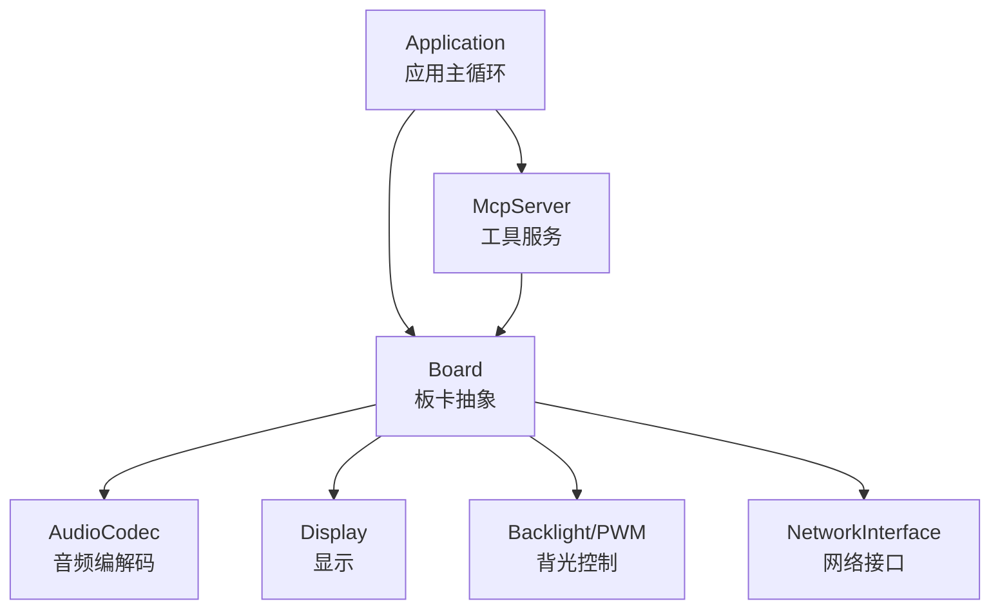
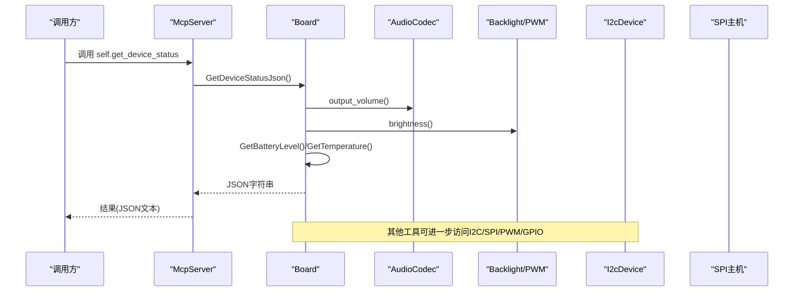
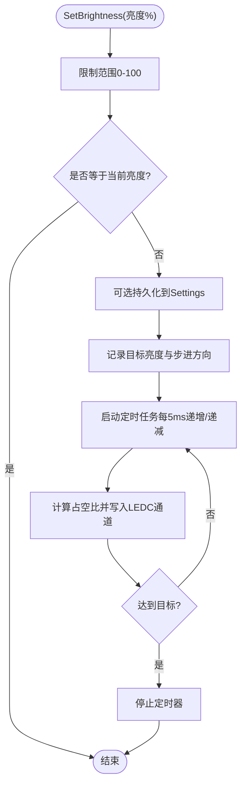
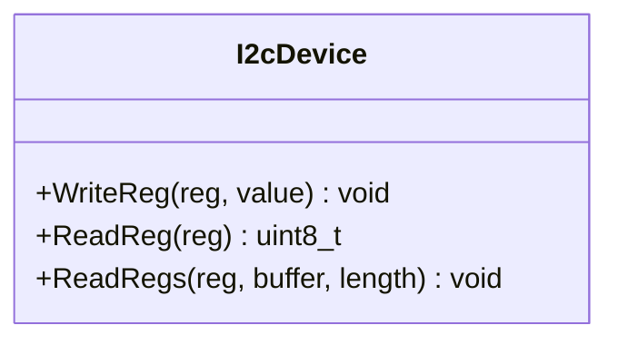
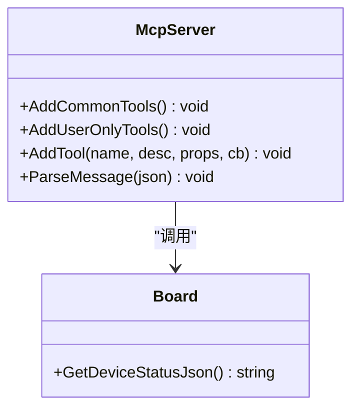
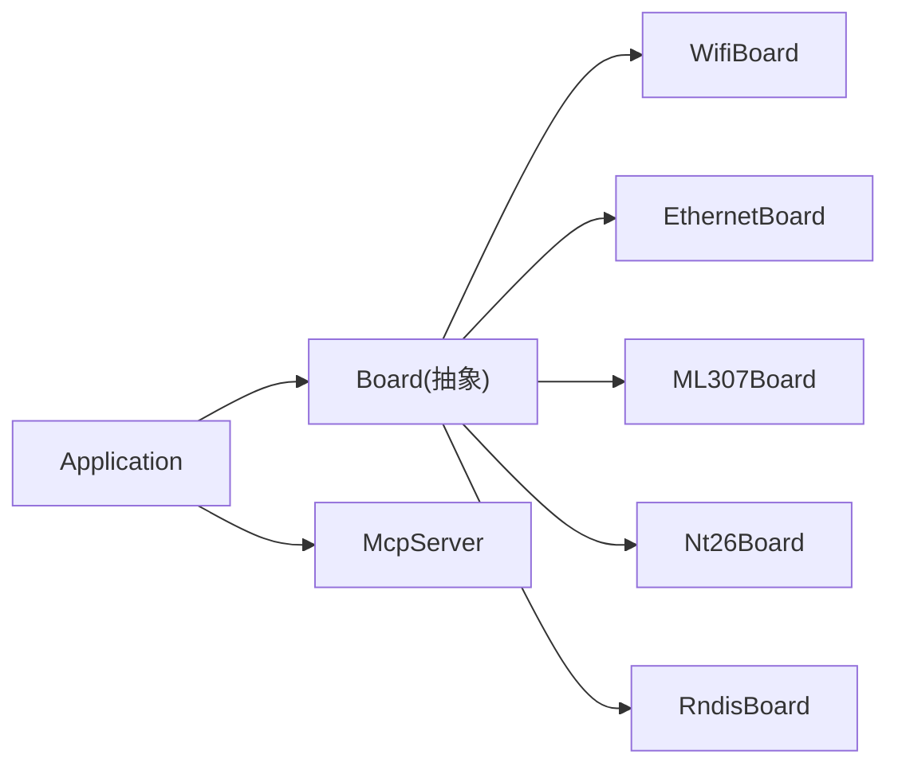

# 硬件控制工具

<cite>
**本文引用的文件**   
- [application.h](file://main/application.h)
- [application.cc](file://main/application.cc)
- [mcp_server.h](file://main/mcp_server.h)
- [mcp_server.cc](file://main/mcp_server.cc)
- [board.h](file://main/boards/common/board.h)
- [wifi_board.cc](file://main/boards/common/wifi_board.cc)
- [ethernet_board.cc](file://main/boards/common/ethernet_board.cc)
- [ml307_board.cc](file://main/boards/common/ml307_board.cc)
- [nt26_board.cc](file://main/boards/common/nt26_board.cc)
- [rndis_board.cc](file://main/boards/common/rndis_board.cc)
- [backlight.h](file://main/boards/common/backlight.h)
- [backlight.cc](file://main/boards/common/backlight.cc)
- [i2c_device.h](file://main/boards/common/i2c_device.h)
- [i2c_device.cc](file://main/boards/common/i2c_device.cc)
- [df_k10_board.cc](file://main/boards/df-k10/df_k10_board.cc)
- [custom-board.md](file://docs/custom-board.md)
- [esp32_bread_board_lcd.cc](file://main/boards/bread-compact-esp32-lcd/esp32_bread_board_lcd.cc)
</cite>

## 目录
1. [简介](#简介)
2. [项目结构](#项目结构)
3. [核心组件](#核心组件)
4. [架构总览](#架构总览)
5. [详细组件分析](#详细组件分析)
6. [依赖关系分析](#依赖关系分析)
7. [性能与功耗优化](#性能与功耗优化)
8. [故障排查指南](#故障排查指南)
9. [结论](#结论)
10. [附录：设备状态查询 self.get_device_status](#附录设备状态查询-selfget_device_status)

## 简介
本文件面向硬件控制工具的开发者与集成者，系统梳理本项目中GPIO、LED、背光PWM、I2C/SPI总线、传感器读取、执行器控制等能力，并重点说明设备状态查询工具 self.get_device_status 的返回值格式与使用场景。文档以代码级事实为依据，结合架构图与流程图帮助读者快速上手与排障。

## 项目结构
- 应用层主循环与事件分发位于 Application，负责初始化显示、音频、网络、MCP工具注册等。
- Board 抽象统一了不同板卡的硬件访问接口（音频、显示、背光、电池、温度、网络等），并提供 GetDeviceStatusJson 用于生成设备状态JSON。
- MCP 服务器提供工具调用机制，self.get_device_status 即通过该机制暴露设备状态。
- 通用驱动与外设封装包括 I2cDevice、Backlight(PWM)、以及各具体板卡实现（如 df-k10 的 IO 扩展器）。

图表来源
- [application.h:43-176](file://main/application.h#L43-L176)
- [board.h:49-85](file://main/boards/common/board.h#L49-L85)
- [mcp_server.h:314-342](file://main/mcp_server.h#L314-L342)

章节来源
- [application.h:43-176](file://main/application.h#L43-L176)
- [board.h:49-85](file://main/boards/common/board.h#L49-L85)

## 核心组件
- Application：应用生命周期管理、事件循环、协议接入、MCP工具注册入口。
- Board：硬件抽象层，屏蔽不同板卡差异，提供统一的设备状态与资源访问。
- McpServer：工具注册与调用框架，支持参数校验、返回类型多态、用户可见性控制。
- I2cDevice：I2C设备读写封装，简化寄存器操作。
- Backlight/PwmBacklight：基于LEDC的PWM背光控制，支持平滑过渡与持久化。

章节来源
- [application.cc:61-163](file://main/application.cc#L61-L163)
- [mcp_server.h:50-206](file://main/mcp_server.h#L50-L206)
- [i2c_device.h:6-16](file://main/boards/common/i2c_device.h#L6-L16)
- [backlight.h:10-36](file://main/boards/common/backlight.h#L10-L36)

## 架构总览
下图展示了从上层工具调用到硬件控制的完整路径：MCP工具 -> Board -> 具体硬件驱动（I2C/SPI/PWM/GPIO）。

图表来源
- [mcp_server.cc:46-53](file://main/mcp_server.cc#L46-L53)
- [wifi_board.cc:301-357](file://main/boards/common/wifi_board.cc#L301-L357)
- [backlight.cc:84-121](file://main/boards/common/backlight.cc#L84-L121)
- [i2c_device.cc:22-35](file://main/boards/common/i2c_device.cc#L22-L35)

## 详细组件分析

### GPIO 与 LED 控制
- 内置LED：Board::GetLed 提供统一访问点，具体实现由板卡决定；在应用侧可通过 Board::GetInstance().GetLed() 获取并进行状态更新。
- 按键输入：部分板卡通过IO扩展器或直连GPIO读取按键电平，例如 df-k10 使用 TCA9555 IO 扩展器进行输入输出配置与电平读取。
- 自定义GPIO：可在板卡配置头文件中定义引脚宏，并在板卡初始化中完成方向与默认电平设置。

章节来源
- [board.h:71-75](file://main/boards/common/board.h#L71-L75)
- [df_k10_board.cc:67-107](file://main/boards/df-k10/df_k10_board.cc#L67-L107)

### PWM 输出与背光控制
- PwmBacklight 基于 ESP-IDF LEDC 定时器与通道，将百分比亮度映射为占空比，并通过定时器周期推进实现平滑渐变。
- 典型用法：在板卡构造中创建 PwmBacklight 实例，并通过 SetBrightness 设置目标亮度；GetDeviceStatusJson 会读取当前亮度值。

图表来源
- [backlight.cc:46-82](file://main/boards/common/backlight.cc#L46-L82)
- [backlight.cc:84-121](file://main/boards/common/backlight.cc#L84-L121)

章节来源
- [backlight.h:10-36](file://main/boards/common/backlight.h#L10-L36)
- [backlight.cc:46-121](file://main/boards/common/backlight.cc#L46-L121)
- [esp32_bread_board_lcd.cc:191-197](file://main/boards/bread-compact-esp32-lcd/esp32_bread_board_lcd.cc#L191-L197)

### I2C 总线通信
- I2cDevice 封装了设备地址、时钟速度、寄存器读写等操作，便于在板卡中复用。
- 常见用途：音频编解码器、传感器、IO扩展器等均通过 I2C 访问。

图表来源
- [i2c_device.h:6-16](file://main/boards/common/i2c_device.h#L6-L16)
- [i2c_device.cc:8-35](file://main/boards/common/i2c_device.cc#L8-L35)

章节来源
- [i2c_device.h:6-16](file://main/boards/common/i2c_device.h#L6-L16)
- [i2c_device.cc:8-35](file://main/boards/common/i2c_device.cc#L8-L35)

### SPI 总线通信
- SPI 主机初始化与面板IO配置在板卡初始化流程中完成，常用于LCD屏驱动。
- 示例参考自定义板卡文档中的 InitializeSpi 与 LCD SPI IO 配置。

章节来源
- [custom-board.md:184-236](file://docs/custom-board.md#L184-L236)

### 传感器读取与执行器控制
- 传感器：通过 I2cDevice 或专用驱动类读取寄存器数据，再转换为物理量。
- 执行器：可通过GPIO开关、PWM调光/调速、或经IO扩展器批量控制。
- 实际案例：
  - df-k10 使用 TCA9555 IO 扩展器进行输入输出控制。
  - atoms3r-echo-pyramid 通过 I2C 控制RGB灯带与扬声器复位。

章节来源
- [df_k10_board.cc:78-107](file://main/boards/df-k10/df_k10_board.cc#L78-L107)
- [atoms3r-echo-pyramid.cc:158-187](file://main/boards/atoms3r-echo-pyramid/atoms3r_echo_pyramid.cc#L158-L187)

### MCP 工具与设备状态查询
- McpServer 提供 AddTool/AddUserOnlyTool 注册工具，支持参数类型与范围校验，返回多种类型（布尔、整数、字符串、JSON、图像）。
- self.get_device_status 工具在初始化时注册，内部调用 Board::GetDeviceStatusJson 汇总设备信息。

图表来源
- [mcp_server.h:314-342](file://main/mcp_server.h#L314-L342)
- [mcp_server.cc:46-53](file://main/mcp_server.cc#L46-L53)
- [board.h:84](file://main/boards/common/board.h#L84)

章节来源
- [mcp_server.h:50-206](file://main/mcp_server.h#L50-L206)
- [mcp_server.cc:46-53](file://main/mcp_server.cc#L46-L53)

## 依赖关系分析
- Application 依赖 Board 提供的音频、显示、背光、网络等资源。
- McpServer 在 Application 初始化阶段被注入常用工具与用户专属工具。
- Board 的具体实现（如 WifiBoard、EthernetBoard、ML307Board）各自实现 GetDeviceStatusJson，聚合不同子系统状态。

图表来源
- [application.cc:96-99](file://main/application.cc#L96-L99)
- [wifi_board.cc:301-357](file://main/boards/common/wifi_board.cc#L301-L357)
- [ethernet_board.cc:256-302](file://main/boards/common/ethernet_board.cc#L256-L302)
- [ml307_board.cc:225-258](file://main/boards/common/ml307_board.cc#L225-L258)
- [nt26_board.cc:226-258](file://main/boards/common/nt26_board.cc#L226-L258)
- [rndis_board.cc:197-247](file://main/boards/common/rndis_board.cc#L197-L247)

章节来源
- [application.cc:96-99](file://main/application.cc#L96-L99)
- [board.h:49-85](file://main/boards/common/board.h#L49-L85)

## 性能与功耗优化
- 电源模式切换：
  - 连接音频通道前切换到高性能模式以降低延迟；关闭通道后切回低功耗模式。
  - 激活完成后降低功耗等级，减少空闲能耗。
- 背光控制：
  - 使用PWM平滑渐变避免突变电流冲击，同时提升用户体验。
- 网络与任务调度：
  - 主循环采用事件组等待，避免忙轮询；关键任务在独立任务中运行，保证实时性。

章节来源
- [application.cc:504-520](file://main/application.cc#L504-L520)
- [application.cc:314-321](file://main/application.cc#L314-L321)
- [backlight.cc:46-82](file://main/boards/common/backlight.cc#L46-L82)

## 故障排查指南
- 工具调用失败：
  - 检查 McpServer 是否正确注册工具；确认参数类型与范围是否符合定义。
- 设备状态为空或缺字段：
  - 确认 Board 对应实现是否提供了相应资源（如背光、电池、温度）。
- I2C/SPI 通信异常：
  - 检查设备地址、时钟频率、引脚分配与上拉电阻；查看错误码日志。
- 背光不亮或闪烁：
  - 确认LEDC通道与引脚配置正确，输出极性设置符合硬件设计。

章节来源
- [mcp_server.h:50-206](file://main/mcp_server.h#L50-L206)
- [i2c_device.cc:8-35](file://main/boards/common/i2c_device.cc#L8-L35)
- [backlight.cc:84-121](file://main/boards/common/backlight.cc#L84-L121)

## 结论
本项目通过 Board 抽象与 McpServer 工具机制，将底层硬件能力（GPIO、PWM、I2C、SPI）以统一接口暴露给上层应用与AI助手。self.get_device_status 作为设备健康与状态的核心入口，为后续控制与诊断奠定基础。遵循本文档的最佳实践，可实现稳定、高效且易维护的硬件控制系统。

## 附录：设备状态查询 self.get_device_status
- 工具名称：self.get_device_status
- 功能描述：返回设备的实时状态，包括音频扬声器音量、屏幕亮度与主题、电池电量与充放电状态、网络类型与信号强度、芯片温度等。
- 返回值格式（JSON字符串）：
  - audio_speaker.volume：整数，表示当前音量。
  - screen.brightness：整数，表示当前背光亮度（0-100）。
  - screen.theme：字符串，仅当屏幕高度大于64时存在，表示当前UI主题名。
  - battery.level：整数，电池百分比（若支持）。
  - battery.charging：布尔，是否正在充电（若支持）。
  - battery.discharging：布尔，是否正在放电（若支持）。
  - network.type：字符串，网络类型（如 wifi、ethernet、cellular、rndis）。
  - network.ssid：字符串，WiFi SSID（仅WiFi类型）。
  - network.signal：字符串，信号强度分级（如 strong/medium/weak 或 very weak/weak/unknown）。
  - network.state：字符串，以太网连接状态（connected/disconnected，仅以太网）。
  - network.ip：字符串，IP地址（若可用）。
  - chip.temperature：浮点数，芯片温度（若支持）。
- 使用场景：
  - 在控制设备前先查询状态，确保参数合法（如音量范围）。
  - 监控设备健康度，辅助告警与自动恢复策略。
  - 为AI助手提供上下文信息，以便更智能地响应指令。

章节来源
- [mcp_server.cc:46-53](file://main/mcp_server.cc#L46-L53)
- [wifi_board.cc:301-357](file://main/boards/common/wifi_board.cc#L301-L357)
- [ethernet_board.cc:256-302](file://main/boards/common/ethernet_board.cc#L256-L302)
- [ml307_board.cc:225-258](file://main/boards/common/ml307_board.cc#L225-L258)
- [nt26_board.cc:226-258](file://main/boards/common/nt26_board.cc#L226-L258)
- [rndis_board.cc:197-247](file://main/boards/common/rndis_board.cc#L197-L247)