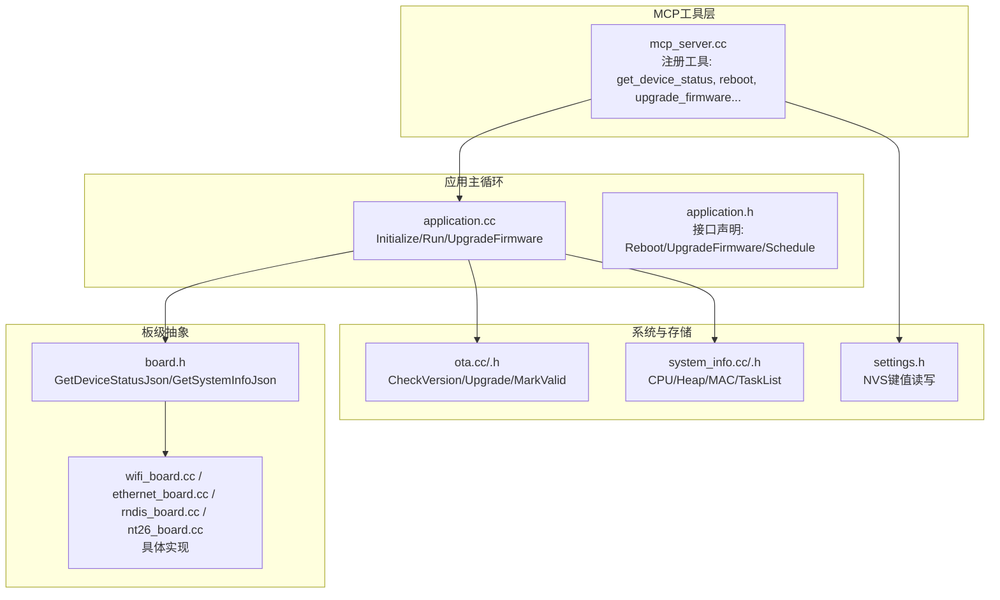
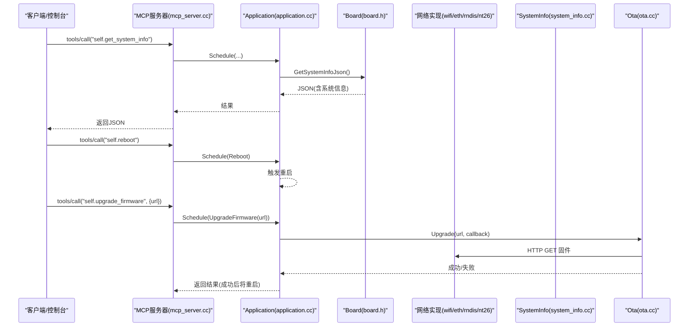
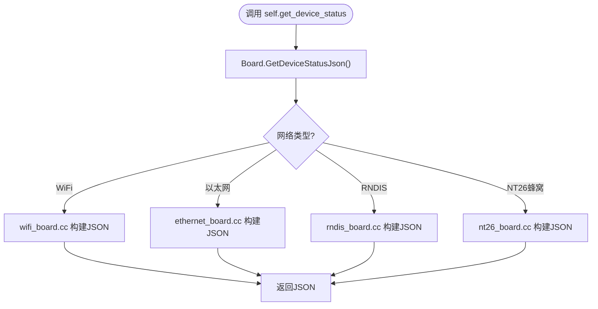
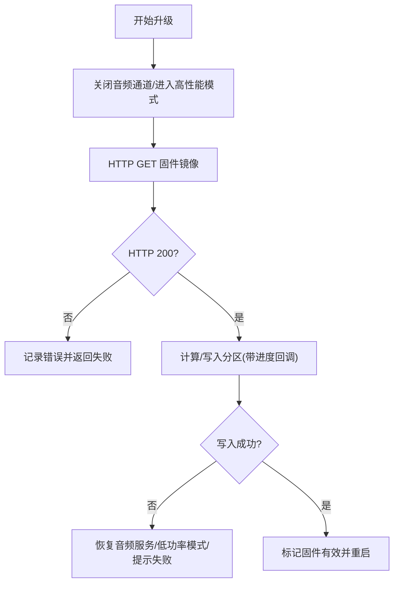
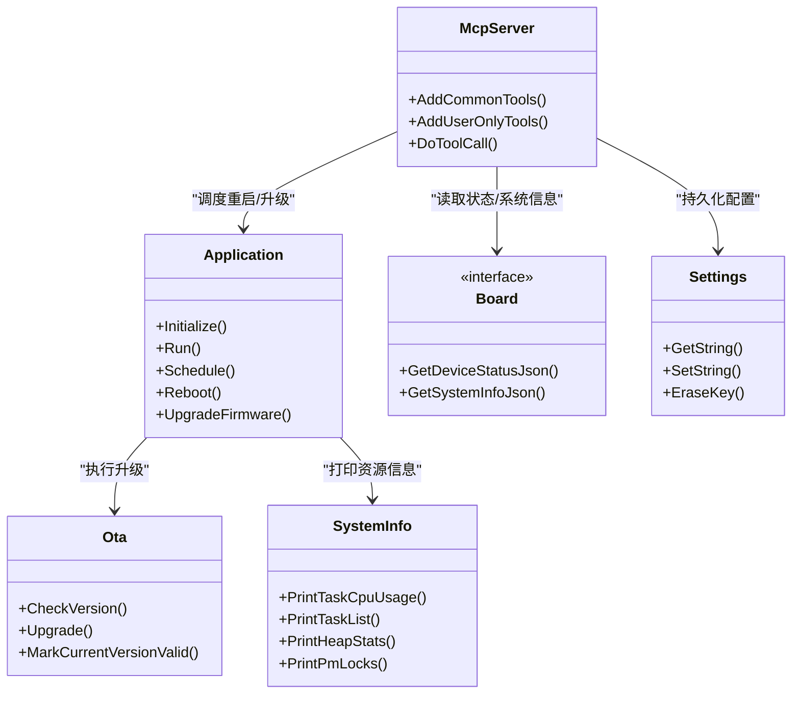

# 系统管理工具

<cite>
**本文引用的文件**   
- [mcp_server.cc](file://main/mcp_server.cc)
- [application.h](file://main/application.h)
- [application.cc](file://main/application.cc)
- [system_info.h](file://main/system_info.h)
- [system_info.cc](file://main/system_info.cc)
- [ota.h](file://main/ota.h)
- [ota.cc](file://main/ota.cc)
- [board.h](file://main/boards/common/board.h)
- [wifi_board.cc](file://main/boards/common/wifi_board.cc)
- [ethernet_board.cc](file://main/boards/common/ethernet_board.cc)
- [rndis_board.cc](file://main/boards/common/rndis_board.cc)
- [nt26_board.cc](file://main/boards/common/nt26_board.cc)
- [settings.h](file://main/settings.h)
</cite>

## 目录
1. [简介](#简介)
2. [项目结构](#项目结构)
3. [核心组件](#核心组件)
4. [架构总览](#架构总览)
5. [详细组件分析](#详细组件分析)
6. [依赖关系分析](#依赖关系分析)
7. [性能与资源监控](#性能与资源监控)
8. [故障诊断与排错](#故障诊断与排错)
9. [安全与注意事项](#安全与注意事项)
10. [结论](#结论)
11. [附录：常用工具清单](#附录常用工具清单)

## 简介
本文件面向设备运维、远程管理与故障诊断等实际场景，系统化梳理本项目中的“系统管理工具”能力，包括：
- 设备信息查询：音频、屏幕、电池、网络、芯片温度等状态汇总
- 网络状态监控：WiFi/以太网/蜂窝（NT26）连接状态与信号质量
- 文件系统操作：资源包下载与分区写入（Assets）、固件升级（OTA）
- 系统资源监控：任务CPU使用率、堆内存统计、PM锁信息
- 设备配置管理：参数读写（Settings/NVS）、配置备份恢复思路、系统重启
- 关键系统管理工具的安全考虑：self.reboot、self.upgrade_firmware

## 项目结构
围绕系统管理能力，代码主要分布在以下模块：
- MCP 工具层：对外暴露 self.* 工具（查询、控制、升级、重启等）
- 应用主循环：事件驱动调度、网络回调、激活流程、升级入口
- 板级抽象：各网络类型（WiFi/以太网/RNDIS/NT26）的状态JSON输出
- 系统信息：Flash、MAC、任务CPU、堆、PM锁等
- OTA：版本检查、固件下载、写分区、回滚保护
- Settings：NVS键值存储，用于持久化配置（如资源包下载URL）

图示来源
- [mcp_server.cc:128-169](file://main/mcp_server.cc#L128-L169)
- [application.cc:96-100](file://main/application.cc#L96-L100)
- [application.h:107-112](file://main/application.h#L107-L112)
- [board.h:81-85](file://main/boards/common/board.h#L81-L85)
- [wifi_board.cc:301-340](file://main/boards/common/wifi_board.cc#L301-L340)
- [ethernet_board.cc:256-302](file://main/boards/common/ethernet_board.cc#L256-L302)
- [rndis_board.cc:197-234](file://main/boards/common/rndis_board.cc#L197-L234)
- [nt26_board.cc:189-228](file://main/boards/common/nt26_board.cc#L189-L228)
- [system_info.h:9-21](file://main/system_info.h#L9-L21)
- [system_info.cc:18-57](file://main/system_info.cc#L18-L57)
- [ota.h:10-32](file://main/ota.h#L10-L32)
- [ota.cc:267-288](file://main/ota.cc#L267-L288)
- [settings.h:7-26](file://main/settings.h#L7-L26)

章节来源
- [mcp_server.cc:128-169](file://main/mcp_server.cc#L128-L169)
- [application.cc:96-100](file://main/application.cc#L96-L100)
- [board.h:81-85](file://main/boards/common/board.h#L81-L85)
- [system_info.h:9-21](file://main/system_info.h#L9-L21)
- [system_info.cc:18-57](file://main/system_info.cc#L18-L57)
- [ota.h:10-32](file://main/ota.h#L10-L32)
- [ota.cc:267-288](file://main/ota.cc#L267-L288)
- [settings.h:7-26](file://main/settings.h#L7-L26)

## 核心组件
- MCP 工具注册与调用
  - 公共工具：设备状态查询、音量调节、屏幕亮度/主题、拍照（可选）
  - 用户专属工具：系统信息、重启、固件升级、屏幕截图/预览、资源包下载URL设置
- 应用主循环与调度
  - Initialize 阶段注册工具、启动网络、设置网络事件回调
  - Run 主循环处理事件、定时打印堆信息、执行异步任务
- 板级状态聚合
  - 不同网络类型（WiFi/以太网/RNDIS/NT26）分别实现 GetDeviceStatusJson
- 系统信息与资源监控
  - Flash大小、最小空闲堆、当前空闲堆、MAC地址、任务CPU使用率、任务列表、PM锁
- OTA 升级
  - 版本检查、下载、写入更新分区、标记有效、失败回退
- 配置持久化
  - Settings 基于 NVS 的键值存储，支持字符串/整型/布尔读写与擦除

章节来源
- [mcp_server.cc:33-126](file://main/mcp_server.cc#L33-L126)
- [mcp_server.cc:128-169](file://main/mcp_server.cc#L128-L169)
- [application.cc:61-100](file://main/application.cc#L61-L100)
- [application.cc:165-259](file://main/application.cc#L165-L259)
- [board.h:81-85](file://main/boards/common/board.h#L81-L85)
- [system_info.h:9-21](file://main/system_info.h#L9-L21)
- [system_info.cc:59-158](file://main/system_info.cc#L59-L158)
- [ota.h:10-32](file://main/ota.h#L10-L32)
- [ota.cc:267-288](file://main/ota.cc#L267-L288)
- [settings.h:7-26](file://main/settings.h#L7-L26)

## 架构总览
系统管理工具通过 MCP 协议暴露给上层（例如云端或本地控制台），由 Application 主循环统一调度。板级抽象负责将硬件状态序列化为 JSON；系统信息模块提供底层资源指标；OTA 模块负责固件升级；Settings 提供持久化配置。

图示来源
- [mcp_server.cc:128-169](file://main/mcp_server.cc#L128-L169)
- [application.cc:96-100](file://main/application.cc#L96-L100)
- [board.h:81-85](file://main/boards/common/board.h#L81-L85)
- [system_info.cc:18-57](file://main/system_info.cc#L18-L57)
- [ota.cc:267-288](file://main/ota.cc#L267-L288)

## 详细组件分析

### 设备信息查询工具
- 功能要点
  - self.get_device_status：聚合音频、屏幕、电池、网络、芯片温度等
  - 各板级实现差异：WiFi/以太网/RNDIS/NT26 的网络字段不同
- 数据流
  - MCP 工具 -> Board.GetDeviceStatusJson() -> 具体网络实现 -> JSON 返回

图示来源
- [mcp_server.cc:45-53](file://main/mcp_server.cc#L45-L53)
- [board.h:84](file://main/boards/common/board.h#L84)
- [wifi_board.cc:301-340](file://main/boards/common/wifi_board.cc#L301-L340)
- [ethernet_board.cc:256-302](file://main/boards/common/ethernet_board.cc#L256-L302)
- [rndis_board.cc:197-234](file://main/boards/common/rndis_board.cc#L197-L234)
- [nt26_board.cc:189-228](file://main/boards/common/nt26_board.cc#L189-L228)

章节来源
- [mcp_server.cc:45-53](file://main/mcp_server.cc#L45-L53)
- [board.h:84](file://main/boards/common/board.h#L84)
- [wifi_board.cc:301-340](file://main/boards/common/wifi_board.cc#L301-L340)
- [ethernet_board.cc:256-302](file://main/boards/common/ethernet_board.cc#L256-L302)
- [rndis_board.cc:197-234](file://main/boards/common/rndis_board.cc#L197-L234)
- [nt26_board.cc:189-228](file://main/boards/common/nt26_board.cc#L189-L228)

### 网络状态监控
- WiFi
  - 包含 SSID、RSSI、信道、IP、MAC 等
- 以太网
  - 包含连接状态、IP、MAC 等
- RNDIS
  - 仅标识类型为 RNDIS
- NT26 蜂窝
  - 包含 CSQ、IMEI、ICCID、注册状态等

章节来源
- [wifi_board.cc:271-282](file://main/boards/common/wifi_board.cc#L271-L282)
- [ethernet_board.cc:282-295](file://main/boards/common/ethernet_board.cc#L282-L295)
- [rndis_board.cc:228-231](file://main/boards/common/rndis_board.cc#L228-L231)
- [nt26_board.cc:189-196](file://main/boards/common/nt26_board.cc#L189-L196)

### 文件系统操作（资源包与固件）
- 资源包（Assets）
  - 支持从指定 URL 下载并写入分区，校验头部与校验和，再映射到内存供 UI 使用
- 固件升级（OTA）
  - 通过 HTTP 获取固件镜像，写入下一个可更新分区，完成后标记有效并重启

图示来源
- [application.cc:980-1022](file://main/application.cc#L980-L1022)
- [ota.cc:267-288](file://main/ota.cc#L267-L288)

章节来源
- [application.cc:980-1022](file://main/application.cc#L980-L1022)
- [ota.cc:267-288](file://main/ota.cc#L267-L288)

### 系统资源监控
- 任务CPU使用率：采样两次系统状态，计算任务运行时间占比
- 任务列表：打印所有任务名称与状态
- 堆统计：当前空闲堆与历史最小空闲堆
- PM锁：打印电源管理锁信息

章节来源
- [system_info.h:9-21](file://main/system_info.h#L9-L21)
- [system_info.cc:59-158](file://main/system_info.cc#L59-L158)

### 设备配置管理（参数读写、备份恢复、重启）
- 参数读写
  - Settings 封装 NVS，支持字符串/整型/布尔读写与擦除
  - 示例：设置资源包下载URL（self.assets.set_download_url）
- 备份恢复
  - 可通过遍历NVNS命名空间导出/导入（概念性建议，需自行扩展）
- 系统重启
  - self.reboot：在主线程安全地延迟后触发重启

章节来源
- [settings.h:7-26](file://main/settings.h#L7-L26)
- [mcp_server.cc:287-298](file://main/mcp_server.cc#L287-L298)
- [mcp_server.cc:138-149](file://main/mcp_server.cc#L138-L149)

## 依赖关系分析
- McpServer 依赖 Board 获取设备状态与系统信息
- Application 负责调度与生命周期管理，持有 Ota、AudioService、Protocol 等
- 各 Board 实现依赖各自网络栈与传感器/外设
- SystemInfo 直接调用 ESP-IDF 系统API
- OTA 依赖网络栈进行HTTP下载，并操作ESP OTA分区

图示来源
- [mcp_server.cc:128-169](file://main/mcp_server.cc#L128-L169)
- [application.h:107-112](file://main/application.h#L107-L112)
- [board.h:81-85](file://main/boards/common/board.h#L81-L85)
- [system_info.h:9-21](file://main/system_info.h#L9-L21)
- [ota.h:10-32](file://main/ota.h#L10-L32)
- [settings.h:7-26](file://main/settings.h#L7-L26)

章节来源
- [mcp_server.cc:128-169](file://main/mcp_server.cc#L128-L169)
- [application.h:107-112](file://main/application.h#L107-L112)
- [board.h:81-85](file://main/boards/common/board.h#L81-L85)
- [system_info.h:9-21](file://main/system_info.h#L9-L21)
- [ota.h:10-32](file://main/ota.h#L10-L32)
- [settings.h:7-26](file://main/settings.h#L7-L26)

## 性能与资源监控
- 周期性堆统计：主循环每10秒打印一次空闲堆与历史最小堆，便于发现泄漏或峰值占用
- 任务CPU使用率：通过两次系统状态快照计算任务耗时占比，定位热点任务
- 电源策略：在连接/通话时切换到高性能模式，空闲时切换到低功耗模式

章节来源
- [application.cc:248-257](file://main/application.cc#L248-L257)
- [system_info.cc:59-158](file://main/system_info.cc#L59-L158)

## 故障诊断与排错
- 常见问题定位
  - 网络问题：查看网络事件回调与状态JSON（SSID/RSSI/IP/CSQ等）
  - 升级失败：检查HTTP状态码、分区可用空间、校验和、日志提示
  - 资源不足：关注最小空闲堆与任务CPU使用率
- 实用命令（通过MCP工具）
  - self.get_system_info：获取系统信息
  - self.get_device_status：获取设备状态
  - self.screen.snapshot：截图上传（若启用LVGL快照）
  - self.assets.set_download_url：设置资源包下载地址

章节来源
- [mcp_server.cc:128-169](file://main/mcp_server.cc#L128-L169)
- [application.cc:261-297](file://main/application.cc#L261-L297)
- [ota.cc:267-288](file://main/ota.cc#L267-L288)

## 安全与注意事项
- self.reboot（系统重启）
  - 风险：中断正在进行的对话/升级/IO，可能导致数据不一致
  - 建议：仅在维护窗口或确认无关键任务时使用；必要时先关闭音频通道与网络会话
  - 实现位置参考：[mcp_server.cc:138-149](file://main/mcp_server.cc#L138-L149)
- self.upgrade_firmware（固件升级）
  - 风险：来自不可信源的固件会破坏系统；升级过程中断电会导致变砖
  - 建议：
    - 严格校验URL来源与签名（建议在服务端完成签名验证）
    - 升级前确保电量充足、网络稳定
    - 升级失败自动回退机制已内置（未成功则不标记有效）
  - 实现位置参考：[mcp_server.cc:151-169](file://main/mcp_server.cc#L151-L169)、[application.cc:980-1022](file://main/application.cc#L980-L1022)、[ota.cc:267-288](file://main/ota.cc#L267-L288)
- self.assets.set_download_url（资源包下载URL）
  - 风险：恶意资源包可能包含异常内容
  - 建议：限制为受信任域名；下载前后校验完整性（已有头部与校验和校验逻辑）
  - 实现位置参考：[mcp_server.cc:287-298](file://main/mcp_server.cc#L287-L298)
- 权限控制
  - 用户专属工具（self.reboot/self.upgrade_firmware等）应配合访问控制（如白名单/鉴权）避免被非授权调用

章节来源
- [mcp_server.cc:138-169](file://main/mcp_server.cc#L138-L169)
- [application.cc:980-1022](file://main/application.cc#L980-L1022)
- [ota.cc:267-288](file://main/ota.cc#L267-L288)
- [mcp_server.cc:287-298](file://main/mcp_server.cc#L287-L298)

## 结论
本项目通过 MCP 工具层将设备信息查询、网络监控、文件系统操作、系统资源监控与配置管理等系统级能力标准化暴露，结合 Application 的事件驱动与板级抽象，形成可扩展、可观测、可维护的系统管理方案。针对高风险操作（重启、升级），建议引入严格的权限与来源校验，并结合日志与监控完善运维闭环。

## 附录：常用工具清单
- self.get_device_status：获取设备实时状态（音频/屏幕/电池/网络/温度等）
- self.audio_speaker.set_volume：设置扬声器音量
- self.screen.set_brightness：设置屏幕亮度
- self.screen.set_theme：切换屏幕主题（若支持）
- self.camera.take_photo：拍照并解释（若支持）
- self.get_system_info：获取系统信息（平台/版本/MAC/任务/堆等）
- self.reboot：重启系统
- self.upgrade_firmware：从指定URL升级固件
- self.screen.get_info：获取屏幕尺寸/是否单色等信息
- self.screen.snapshot：截取屏幕并上传至指定URL（若启用快照）
- self.screen.preview_image：预览图片（若启用）
- self.assets.set_download_url：设置资源包下载URL

章节来源
- [mcp_server.cc:33-126](file://main/mcp_server.cc#L33-L126)
- [mcp_server.cc:128-169](file://main/mcp_server.cc#L128-L169)
- [mcp_server.cc:171-298](file://main/mcp_server.cc#L171-L298)