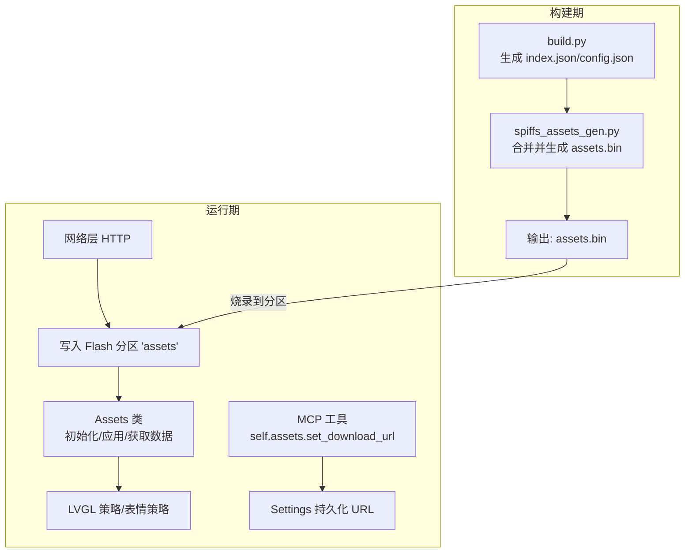
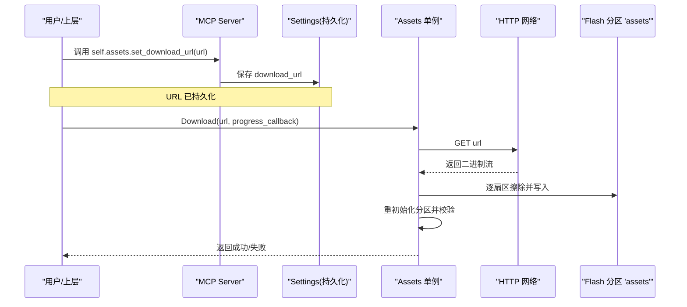
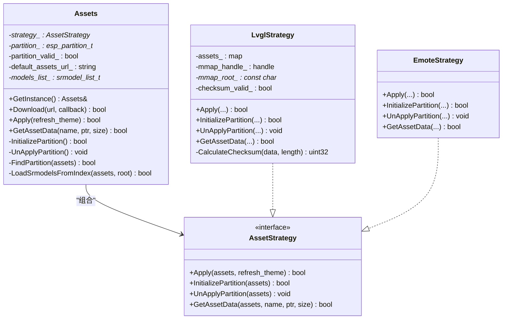
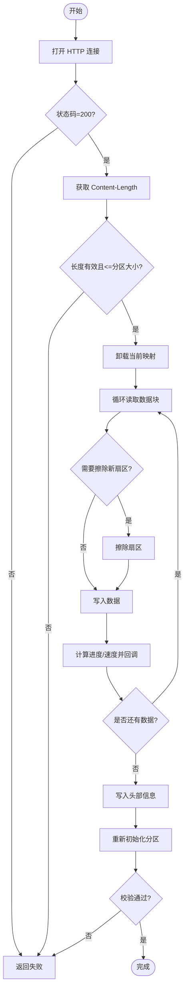
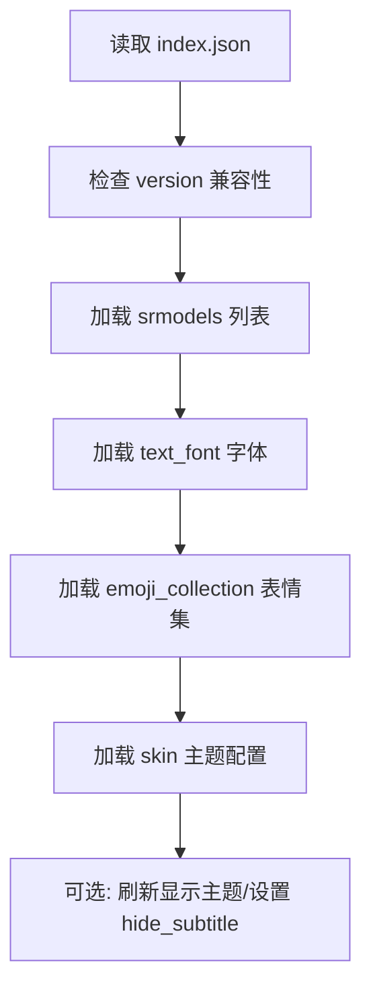
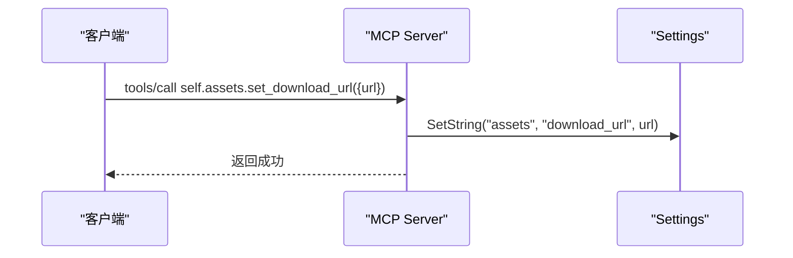
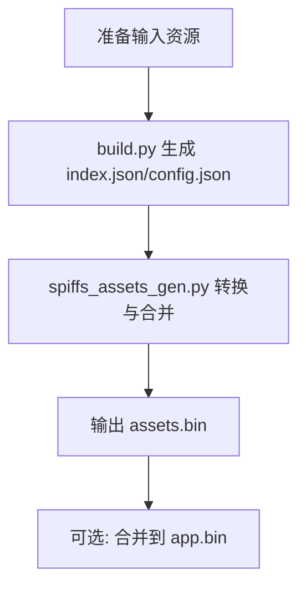
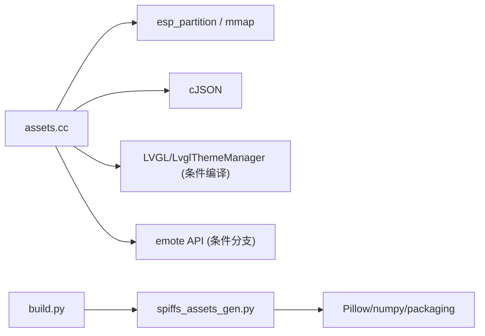

# 资源管理工具

<cite>
**本文引用的文件**   
- [assets.h](file://main/assets.h)
- [assets.cc](file://main/assets.cc)
- [mcp_server.cc](file://main/mcp_server.cc)
- [CMakeLists.txt](file://main/CMakeLists.txt)
- [build.py](file://scripts/spiffs_assets/build.py)
- [spiffs_assets_gen.py](file://scripts/spiffs_assets/spiffs_assets_gen.py)
- [README.md](file://scripts/spiffs_assets/README.md)
</cite>

## 目录
1. [简介](#简介)
2. [项目结构](#项目结构)
3. [核心组件](#核心组件)
4. [架构总览](#架构总览)
5. [详细组件分析](#详细组件分析)
6. [依赖关系分析](#依赖关系分析)
7. [性能与存储优化](#性能与存储优化)
8. [故障排查指南](#故障排查指南)
9. [结论](#结论)
10. [附录](#附录)

## 简介
本文件面向“资源管理工具”的开发者与集成者，系统性说明静态资源下载、配置文件管理、多媒体资源处理等能力。重点覆盖：
- self.assets.set_download_url 工具的配置方法与调用流程
- 资源包（assets.bin）的构建、组织、命名规范与版本策略
- 运行时分区映射、校验与应用流程
- 多语言包、UI素材更新、固件资源分发等典型场景
- 缓存策略、下载失败重试、存储空间优化等技术细节

## 项目结构
资源管理相关代码主要分布在以下位置：
- 运行时资源加载与下载：main/assets.h、main/assets.cc
- MCP 工具注册（self.assets.set_download_url）：main/mcp_server.cc
- 构建期资源打包脚本：scripts/spiffs_assets/build.py、scripts/spiffs_assets/spiffs_assets_gen.py
- CMake 集成与默认资源下载逻辑：main/CMakeLists.txt

图表来源
- [build.py:340-400](file://scripts/spiffs_assets/build.py#L340-L400)
- [spiffs_assets_gen.py:534-648](file://scripts/spiffs_assets/spiffs_assets_gen.py#L534-L648)
- [assets.h:23-87](file://main/assets.h#L23-L87)
- [assets.cc:130-212](file://main/assets.cc#L130-L212)
- [mcp_server.cc:287-298](file://main/mcp_server.cc#L287-L298)

章节来源
- [assets.h:23-87](file://main/assets.h#L23-L87)
- [assets.cc:130-212](file://main/assets.cc#L130-L212)
- [mcp_server.cc:287-298](file://main/mcp_server.cc#L287-L298)
- [build.py:340-400](file://scripts/spiffs_assets/build.py#L340-L400)
- [spiffs_assets_gen.py:534-648](file://scripts/spiffs_assets/spiffs_assets_gen.py#L534-L648)

## 核心组件
- Assets 单例：提供 Download、Apply、GetAssetData 等接口，内部通过策略模式适配 LVGL 或表情显示两种资源访问方式。
- 策略 LvglStrategy：将 assets.bin 映射到内存，解析索引表，按名称快速定位资源；支持校验和验证与主题刷新。
- 策略 EmoteStrategy：针对表情显示设备，通过 emote API 挂载与读取资源。
- MCP 工具 self.assets.set_download_url：以用户工具形式暴露，用于设置资源包的下载地址并持久化。
- 构建脚本：build.py 负责收集资源、生成 index.json 与配置；spiffs_assets_gen.py 负责格式转换、合并、打包为 assets.bin。

章节来源
- [assets.h:23-87](file://main/assets.h#L23-L87)
- [assets.cc:130-212](file://main/assets.cc#L130-L212)
- [mcp_server.cc:287-298](file://main/mcp_server.cc#L287-L298)
- [build.py:340-400](file://scripts/spiffs_assets/build.py#L340-L400)
- [spiffs_assets_gen.py:534-648](file://scripts/spiffs_assets/spiffs_assets_gen.py#L534-L648)

## 架构总览
资源管理在“构建期”与“运行期”两个阶段协作完成：
- 构建期：根据输入资源生成 index.json 与 assets.bin，包含文件清单、偏移、尺寸等信息，并对整体计算校验和。
- 运行期：启动时查找名为 “assets” 的分区，将其映射到内存，校验完整性后建立名称到资源的映射；应用时解析 index.json 并加载字体、表情、皮肤等资源。
- 在线更新：通过 MCP 工具设置下载 URL，运行时从网络拉取新的 assets.bin，擦写对应分区，重新初始化并应用。

图表来源
- [mcp_server.cc:287-298](file://main/mcp_server.cc#L287-L298)
- [assets.cc:428-615](file://main/assets.cc#L428-L615)

## 详细组件分析

### Assets 类与策略模式
Assets 采用策略模式封装不同平台/显示后端对资源分区的访问差异：
- LvglStrategy：使用 esp_partition_mmap 将分区映射到内存，解析头部元数据（文件数、校验和、长度），遍历 mmap_assets_table 建立 name->offset/size 的映射，并按需读取资源。
- EmoteStrategy：通过 emote_display 提供的挂载与读取接口访问资源。

图表来源
- [assets.h:23-87](file://main/assets.h#L23-L87)
- [assets.cc:130-212](file://main/assets.cc#L130-L212)

章节来源
- [assets.h:23-87](file://main/assets.h#L23-L87)
- [assets.cc:130-212](file://main/assets.cc#L130-L212)

### 资源下载与分区写入流程
- 打开 HTTP 连接，校验状态码与内容长度
- 预分配内部缓冲区，按扇区大小进行擦除与写入
- 记录进度与速度回调
- 完成后写入头部信息，重新初始化分区并校验

图表来源
- [assets.cc:428-615](file://main/assets.cc#L428-L615)

章节来源
- [assets.cc:428-615](file://main/assets.cc#L428-L615)

### 资源索引与加载（index.json）
- 构建期由 build.py 生成 index.json，字段包括 version、srmodels、text_font、emoji_collection、icon_collection、layout 等
- 运行期 Apply 会解析 index.json，加载语音模型、文本字体、表情集合、皮肤背景图等，并可刷新显示主题与隐藏字幕等配置

图表来源
- [assets.cc:214-358](file://main/assets.cc#L214-L358)
- [build.py:279-306](file://scripts/spiffs_assets/build.py#L279-L306)

章节来源
- [assets.cc:214-358](file://main/assets.cc#L214-L358)
- [build.py:279-306](file://scripts/spiffs_assets/build.py#L279-L306)

### MCP 工具 self.assets.set_download_url
- 作为用户工具注册，接受参数 url
- 将 URL 保存到 Settings 命名空间 assets 下的 key download_url
- 上层可据此触发 Assets.Download 执行在线更新

图表来源
- [mcp_server.cc:287-298](file://main/mcp_server.cc#L287-L298)

章节来源
- [mcp_server.cc:287-298](file://main/mcp_server.cc#L287-L298)

### 构建与打包流程（assets.bin）
- build.py 负责：
  - 复制/处理唤醒模型、字体、表情集合、图标与布局
  - 生成 index.json 与 config.json
  - 调用 spiffs_assets_gen.py 完成最终打包
- spiffs_assets_gen.py 负责：
  - 图像格式转换（SPNG/SJPG/QOI/Raw）
  - 合并所有资源，生成 mmap 表头与校验和
  - 输出 assets.bin 及可选的合并到 app.bin

图表来源
- [build.py:340-400](file://scripts/spiffs_assets/build.py#L340-L400)
- [spiffs_assets_gen.py:534-648](file://scripts/spiffs_assets/spiffs_assets_gen.py#L534-L648)

章节来源
- [build.py:340-400](file://scripts/spiffs_assets/build.py#L340-L400)
- [spiffs_assets_gen.py:534-648](file://scripts/spiffs_assets/spiffs_assets_gen.py#L534-L648)

### 资源文件组织结构与命名规范
- assets.bin 头部包含：文件数量、校验和、数据长度，随后是固定长度的 mmap_assets_table 数组，每个条目包含：
  - asset_name（固定长度，不足补零）
  - asset_size、asset_offset
  - asset_width、asset_height（图片资源）
- 每个资源数据前带有魔数字节，用于运行时校验
- 文件名最大长度受配置控制（name_length），超出将被截断并告警

章节来源
- [assets.cc:130-185](file://main/assets.cc#L130-L185)
- [spiffs_assets_gen.py:443-461](file://scripts/spiffs_assets/spiffs_assets_gen.py#L443-L461)

### 版本管理与兼容性
- index.json 中包含 version 字段，运行时校验版本号，若大于支持版本则拒绝加载并提示升级固件
- 建议遵循语义化版本策略，并在发布说明中明确兼容范围

章节来源
- [assets.cc:228-234](file://main/assets.cc#L228-L234)

### 实际应用场景
- 多语言包管理：将各语言文案与本地化资源纳入 assets.bin，通过 index.json 中的 text_font 与 emoji_collection 等字段驱动 UI 渲染
- UI 素材更新：替换背景图、图标、表情等，无需重新编译固件，通过在线下载更新
- 固件资源分发：结合 OTA 与资源包更新，实现“固件+资源”解耦发布

[本节为概念性说明，不直接分析具体文件]

## 依赖关系分析
- 运行时依赖：ESP-IDF 分区与 mmap、cJSON、LVGL（可选）、emote 显示库（可选）
- 构建期依赖：Python 3.6+、Pillow、numpy、packaging、qoi-conv（可选）、外部 LVGL 转换脚本（按需下载）

图表来源
- [assets.cc:1-18](file://main/assets.cc#L1-L18)
- [spiffs_assets_gen.py:1-22](file://scripts/spiffs_assets/spiffs_assets_gen.py#L1-L22)

章节来源
- [assets.cc:1-18](file://main/assets.cc#L1-L18)
- [spiffs_assets_gen.py:1-22](file://scripts/spiffs_assets/spiffs_assets_gen.py#L1-L22)

## 性能与存储优化
- 内存映射：LVGL 策略使用 esp_partition_mmap 避免整包拷贝，降低 RAM 占用与启动时间
- 校验加速：对数据段计算校验和，确保一致性；日志记录耗时便于评估
- 扇区粒度写入：按 Flash 扇区擦写，减少不必要的擦写次数
- 资源拆分：支持图片按行拆分（split_height），利于大分辨率资源加载
- 分区容量规划：构建脚本会对比 assets.bin 大小与分区大小，给出推荐分区尺寸

章节来源
- [assets.cc:138-172](file://main/assets.cc#L138-L172)
- [assets.cc:465-582](file://main/assets.cc#L465-L582)
- [spiffs_assets_gen.py:590-601](file://scripts/spiffs_assets/spiffs_assets_gen.py#L590-L601)

## 故障排查指南
- 找不到 assets 分区：检查分区表是否正确定义名为 “assets” 的分区
- 校验和不匹配：确认构建端与运行端使用的 assets.bin 一致，未损坏
- 资源缺失：核对 index.json 中字段与实际资源名一致，注意 name_length 截断
- 下载失败：检查网络连通性与 URL 可达性，关注状态码与 Content-Length
- 分区写入失败：检查剩余可用扇区与对齐，避免越界擦写
- 主题刷新异常：确认 LVGL 主题管理器可用，必要时关闭自动刷新再手动刷新

章节来源
- [assets.cc:44-51](file://main/assets.cc#L44-L51)
- [assets.cc:169-172](file://main/assets.cc#L169-L172)
- [assets.cc:428-455](file://main/assets.cc#L428-L455)
- [assets.cc:531-558](file://main/assets.cc#L531-L558)

## 结论
资源管理工具通过“构建期打包 + 运行期映射 + 在线更新”的闭环，实现了资源与固件解耦、灵活迭代与高效加载。借助 MCP 工具，可在设备侧动态设置资源下载地址并完成安全可靠的分区更新。配合合理的资源组织与版本策略，可有效支撑多语言、UI 素材与多媒体资源的持续演进。

[本节为总结性内容，不直接分析具体文件]

## 附录

### self.assets.set_download_url 配置方法
- 工具名：self.assets.set_download_url
- 参数：url（字符串）
- 行为：将 URL 持久化至 Settings 命名空间 assets 下的 download_url 键
- 后续步骤：上层读取该值后调用 Assets.Download(url, callback) 执行下载与分区更新

章节来源
- [mcp_server.cc:287-298](file://main/mcp_server.cc#L287-L298)
- [assets.cc:428-615](file://main/assets.cc#L428-L615)

### URL 格式要求与存储路径
- URL 格式：HTTP/HTTPS 均可，需可被设备网络栈访问
- 目标路径：设备侧写入 Flash 分区 “assets”，而非任意文件系统路径
- 构建期下载：CMake 支持从 URL 下载默认资源包到构建目录，供离线构建使用

章节来源
- [CMakeLists.txt:1230-1283](file://main/CMakeLists.txt#L1230-L1283)
- [assets.cc:428-455](file://main/assets.cc#L428-L455)

### 资源更新机制
- 在线更新：设置 URL -> 下载 -> 擦写分区 -> 重新初始化 -> 应用资源
- 离线更新：构建期生成 assets.bin 并烧录到分区
- 回滚策略：建议在应用层维护上一份资源快照或双分区方案（仓库未内置）

章节来源
- [assets.cc:428-615](file://main/assets.cc#L428-L615)

### 资源文件组织结构与命名规范
- 根级文件：index.json（必需）
- 可选资源：srmodels.bin、text_font.bin、表情图片、图标、布局 JSON 等
- 命名规范：
  - 文件名不超过 name_length（默认 32），超长会被截断并告警
  - 资源数据前缀魔字节用于运行时校验
  - 图片资源支持 .png/.jpg 转换为 .spng/.sjpg 或 .sqoi，或 Raw 格式

章节来源
- [build.py:279-306](file://scripts/spiffs_assets/build.py#L279-L306)
- [spiffs_assets_gen.py:443-461](file://scripts/spiffs_assets/spiffs_assets_gen.py#L443-L461)
- [assets.cc:198-212](file://main/assets.cc#L198-L212)

### 版本管理策略
- index.json.version：运行时校验，仅支持 <= 1 的版本
- 建议：
  - 主版本号变更时，同步升级固件以兼容新资源格式
  - 次版本号变更时，保持向后兼容，避免破坏现有字段

章节来源
- [assets.cc:228-234](file://main/assets.cc#L228-L234)

### 缓存策略与下载失败重试
- 缓存策略：
  - 构建期：CMake 检测到本地已有文件则跳过下载
  - 运行期：资源通过 mmap 常驻内存，避免重复 IO
- 下载失败重试：
  - 当前实现未内置重试逻辑，建议在调用层封装重试与退避策略
  - 关键错误点：HTTP 状态码、Content-Length 校验、扇区擦写/写入失败、校验和不匹配

章节来源
- [CMakeLists.txt:1230-1283](file://main/CMakeLists.txt#L1230-L1283)
- [assets.cc:428-615](file://main/assets.cc#L428-L615)

### 存储空间优化建议
- 合理选择图片压缩格式（SPNG/SJPG/QOI）与 split_height
- 精简表情与图标资源，移除冗余文件
- 调整 assets 分区大小，避免过大导致 mmap 失败
- 定期清理无用资源，减小 assets.bin 体积

章节来源
- [spiffs_assets_gen.py:590-601](file://scripts/spiffs_assets/spiffs_assets_gen.py#L590-L601)
- [assets.cc:138-145](file://main/assets.cc#L138-L145)