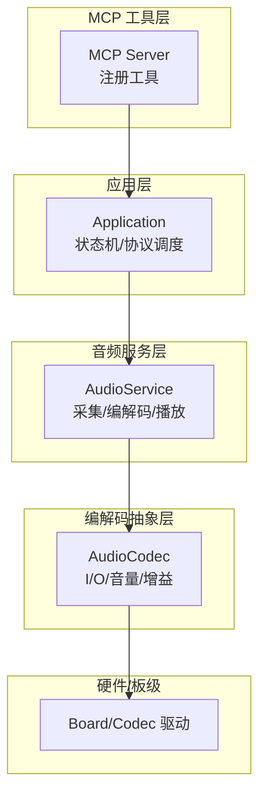
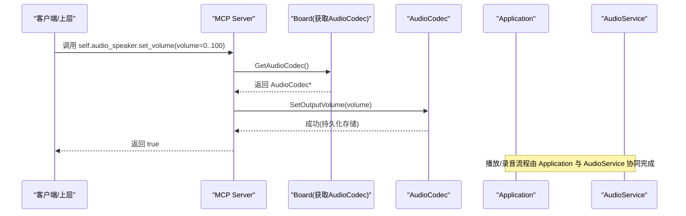
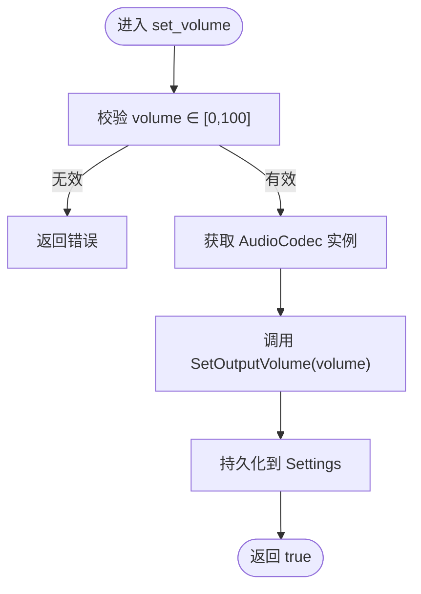
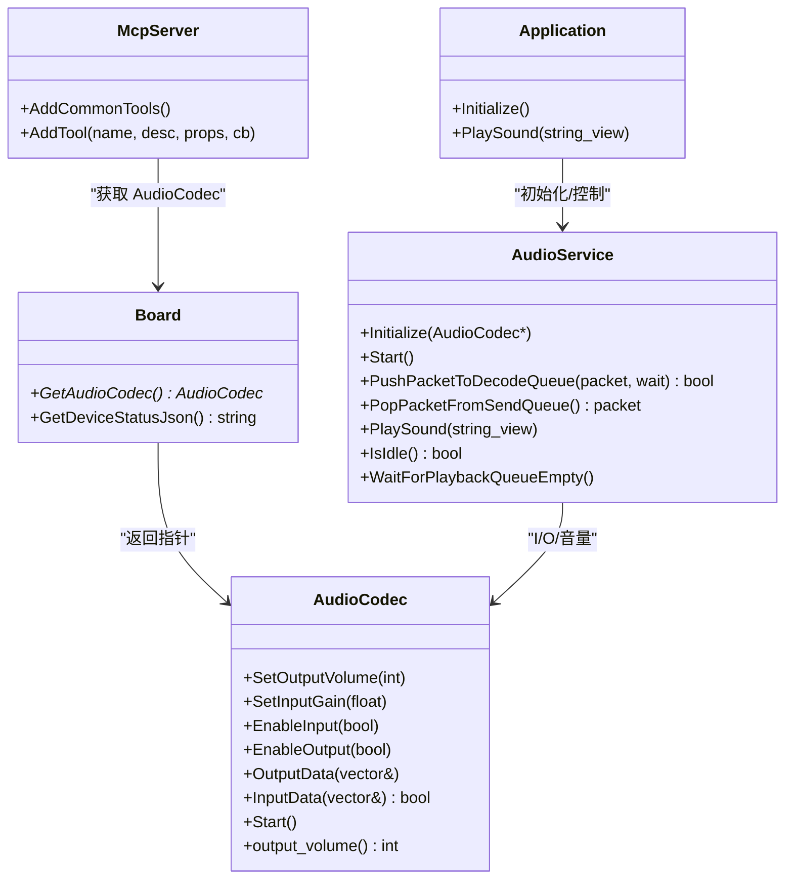

# 音频控制工具

<cite>
**本文引用的文件**   
- [mcp_server.cc](file://main/mcp_server.cc)
- [audio_codec.h](file://main/audio/audio_codec.h)
- [audio_codec.cc](file://main/audio/audio_codec.cc)
- [audio_service.h](file://main/audio/audio_service.h)
- [audio_service.cc](file://main/audio/audio_service.cc)
- [application.cc](file://main/application.cc)
- [device_state.h](file://main/device_state.h)
</cite>

## 目录
1. [简介](#简介)
2. [项目结构](#项目结构)
3. [核心组件](#核心组件)
4. [架构总览](#架构总览)
5. [详细组件分析](#详细组件分析)
6. [依赖关系分析](#依赖关系分析)
7. [性能与配置要点](#性能与配置要点)
8. [故障排查指南](#故障排查指南)
9. [结论](#结论)
10. [附录：常用场景与调用示例](#附录常用场景与调用示例)

## 简介
本文件面向开发者与集成者，系统化梳理本项目中的“音频控制工具”，重点覆盖：
- 扬声器音量调节（含范围、持久化、错误处理）
- 播放控制（TTS/音效播放、解码与重采样）
- 录音管理（采集、编码、发送队列）
- 音频状态查询（当前音量、播放/录音状态等）
- 关键工具 self.audio_speaker.set_volume 的使用方法与注意事项

## 项目结构
音频相关能力主要分布在以下模块：
- MCP 工具层：对外暴露工具接口，如设备状态查询与音量设置
- 音频服务层：负责采集、编解码、播放、唤醒词、VAD 等
- 音频编解码抽象层：统一输入输出、音量、增益、开关等硬件无关接口
- 应用层：编排协议、状态机与音频服务的协作

图表来源
- [mcp_server.cc:33-78](file://main/mcp_server.cc#L33-L78)
- [application.cc:61-86](file://main/application.cc#L61-L86)
- [audio_service.h:105-136](file://main/audio/audio_service.h#L105-L136)
- [audio_codec.h:17-59](file://main/audio/audio_codec.h#L17-L59)

章节来源
- [mcp_server.cc:33-78](file://main/mcp_server.cc#L33-L78)
- [application.cc:61-86](file://main/application.cc#L61-L86)
- [audio_service.h:105-136](file://main/audio/audio_service.h#L105-L136)
- [audio_codec.h:17-59](file://main/audio/audio_codec.h#L17-L59)

## 核心组件
- MCP 工具
  - self.get_device_status：返回设备实时信息，包含音频扬声器当前音量等
  - self.audio_speaker.set_volume：设置扬声器音量（0-100），内部通过 AudioCodec::SetOutputVolume 实现并持久化
- 音频服务 AudioService
  - 提供录音/播放任务、Opus 编解码、重采样、唤醒词检测、VAD 回调、播放音效等
- 音频编解码抽象 AudioCodec
  - 统一 InputData/OutputData、EnableInput/EnableOutput、SetOutputVolume/SetInputGain、Start 等

章节来源
- [mcp_server.cc:45-64](file://main/mcp_server.cc#L45-L64)
- [audio_service.h:105-136](file://main/audio/audio_service.h#L105-L136)
- [audio_codec.h:17-59](file://main/audio/audio_codec.h#L17-L59)

## 架构总览
从外部工具到硬件的完整链路如下：

图表来源
- [mcp_server.cc:55-64](file://main/mcp_server.cc#L55-L64)
- [audio_codec.cc:40-46](file://main/audio/audio_codec.cc#L40-L46)
- [application.cc:61-86](file://main/application.cc#L61-L86)

## 详细组件分析

### 工具：self.audio_speaker.set_volume
- 功能：设置扬声器音量
- 参数
  - volume：整数，范围 0-100
- 行为
  - 通过 Board 获取 AudioCodec 实例，调用其 SetOutputVolume
  - 将音量写入 Settings 持久化，重启后仍生效
- 返回值
  - 成功返回 true；若参数校验失败或执行异常，MCP 框架会返回错误消息
- 使用建议
  - 在未知当前音量时，先调用 self.get_device_status 获取当前值，再决定增减策略
  - 避免频繁设置同一值，减少不必要的 I/O

图表来源
- [mcp_server.cc:55-64](file://main/mcp_server.cc#L55-L64)
- [audio_codec.cc:40-46](file://main/audio/audio_codec.cc#L40-L46)

章节来源
- [mcp_server.cc:55-64](file://main/mcp_server.cc#L55-L64)
- [audio_codec.cc:40-46](file://main/audio/audio_codec.cc#L40-L46)

### 工具：self.get_device_status
- 功能：返回设备实时信息，包括音频扬声器当前音量、屏幕、电池、网络等
- 用途
  - 回答“当前音量是多少”等问题
  - 作为控制类工具的前置步骤（例如先查音量再调高/调低）

章节来源
- [mcp_server.cc:45-53](file://main/mcp_server.cc#L45-L53)

### 音频服务 AudioService
职责概览
- 音频采集与处理：读取麦克风数据，可选 AFE/处理器，VAD 状态回调
- 编码与发送：将 PCM 编码为 Opus，推入发送队列供协议层取走
- 解码与播放：接收远端 Opus，解码为 PCM，必要时重采样，推入播放队列
- 唤醒词：支持多种唤醒模型，触发事件回调
- 音效播放：解析 OGG 片段，送入解码队列播放
- 电源管理：空闲时关闭 I2S 输入/输出以降低功耗

关键数据结构与复杂度
- 多队列缓冲：decode/send/playback/testing/encode 队列，容量受常量限制
  - 时间复杂度：入队/出队均为 O(1)
  - 空间复杂度：与帧数上限成正比，内存占用可控
- 线程模型：输入任务、输出任务、Opus 编解码任务并行，通过条件变量协调

重要接口
- ReadAudioData：按指定采样率读取 PCM，必要时进行通道合并与重采样
- PushPacketToDecodeQueue / PopPacketFromSendQueue：与协议层交互
- PlaySound：播放内置音效（OGG）
- EnableWakeWordDetection / EnableVoiceProcessing / EnableAudioTesting：模式切换
- IsIdle / WaitForPlaybackQueueEmpty：状态查询与同步

章节来源
- [audio_service.h:105-195](file://main/audio/audio_service.h#L105-L195)
- [audio_service.cc:62-123](file://main/audio/audio_service.cc#L62-L123)
- [audio_service.cc:184-228](file://main/audio/audio_service.cc#L184-L228)
- [audio_service.cc:290-325](file://main/audio/audio_service.cc#L290-L325)
- [audio_service.cc:327-446](file://main/audio/audio_service.cc#L327-L446)
- [audio_service.cc:506-529](file://main/audio/audio_service.cc#L506-L529)
- [audio_service.cc:633-654](file://main/audio/audio_service.cc#L633-L654)
- [audio_service.cc:656-680](file://main/audio/audio_service.cc#L656-L680)

### 音频编解码抽象 AudioCodec
职责概览
- 统一 I/O 接口：InputData/OutputData
- 音量与增益：SetOutputVolume/SetInputGain
- 开关控制：EnableInput/EnableOutput
- 启动初始化：Start 中加载持久化音量并做基础校验

关键属性与方法
- output_volume_：默认 70，Start 时从 Settings 恢复，过小则回退到 10
- SetOutputVolume：更新内存值并持久化
- duplex/input_channels/output_channels/input_sample_rate/output_sample_rate：描述硬件能力与格式

章节来源
- [audio_codec.h:17-59](file://main/audio/audio_codec.h#L17-L59)
- [audio_codec.cc:29-46](file://main/audio/audio_codec.cc#L29-L46)

### 应用层 Application 与音频协作
- 初始化阶段：获取 Board 的 AudioCodec，初始化并启动 AudioService，注册回调（发送队列可用、唤醒词、VAD）
- 协议回调：收到远端音频包时，放入解码队列；打开/关闭音频通道时调整功耗等级与 UI 状态
- 播放控制：PlaySound 委托给 AudioService；AEC 模式切换时可能关闭音频通道

章节来源
- [application.cc:61-86](file://main/application.cc#L61-L86)
- [application.cc:498-519](file://main/application.cc#L498-L519)
- [application.cc:1117-1119](file://main/application.cc#L1117-L1119)

## 依赖关系分析
- MCP 工具依赖 Board 获取 AudioCodec，进而调用其 SetOutputVolume
- AudioService 依赖 AudioCodec 完成 I/O，同时依赖 ESP-IDF 的 Opus 编解码与重采样库
- Application 协调协议与 AudioService，管理设备状态与资源生命周期

图表来源
- [mcp_server.cc:33-78](file://main/mcp_server.cc#L33-L78)
- [audio_codec.h:17-59](file://main/audio/audio_codec.h#L17-L59)
- [audio_service.h:105-136](file://main/audio/audio_service.h#L105-L136)
- [application.cc:61-86](file://main/application.cc#L61-L86)

章节来源
- [mcp_server.cc:33-78](file://main/mcp_server.cc#L33-L78)
- [audio_codec.h:17-59](file://main/audio/audio_codec.h#L17-L59)
- [audio_service.h:105-136](file://main/audio/audio_service.h#L105-L136)
- [application.cc:61-86](file://main/application.cc#L61-L86)

## 性能与配置要点
- 采样率与帧长
  - 编码器固定 16kHz 单声道，帧长 60ms（可配置宏）
  - 解码器根据远端协商动态重建，必要时进行输出重采样以匹配硬件输出采样率
- 队列与延迟
  - 解码/播放/发送队列有最大长度限制，防止内存暴涨
  - 输入任务每 10ms 轮询一次，兼顾实时性与 CPU 占用
- 功耗管理
  - 无输入/输出超过阈值自动关闭 I2S 通道，降低功耗
- 重采样
  - 当输入/输出采样率与系统期望不一致时启用重采样，注意轻微音质影响

章节来源
- [audio_service.h:39-76](file://main/audio/audio_service.h#L39-L76)
- [audio_service.cc:448-482](file://main/audio/audio_service.cc#L448-L482)
- [audio_service.cc:682-698](file://main/audio/audio_service.cc#L682-L698)

## 故障排查指南
- 设置音量无效
  - 检查 volume 是否在 0-100 范围内
  - 确认 MCP 工具调用是否成功返回 true
  - 查看日志中是否有“Set output volume to ...”记录
- 播放无声
  - 确认 Output 已开启且未因超时被关闭
  - 检查解码队列是否为空，是否存在解码错误日志
  - 核对服务器采样率与设备输出采样率是否一致，避免失真提示
- 录音无数据
  - 确认 Input 已开启，ReadAudioData 是否返回成功
  - 双声道输入需转换为单声道后再处理
- 唤醒词不触发
  - 检查唤醒词模型是否加载成功，是否启用了唤醒词检测
- 状态查询
  - 使用 self.get_device_status 获取当前音量、网络、屏幕等信息辅助定位问题

章节来源
- [audio_codec.cc:29-46](file://main/audio/audio_codec.cc#L29-L46)
- [audio_service.cc:290-325](file://main/audio/audio_service.cc#L290-L325)
- [audio_service.cc:327-446](file://main/audio/audio_service.cc#L327-L446)
- [audio_service.cc:184-228](file://main/audio/audio_service.cc#L184-L228)
- [mcp_server.cc:45-53](file://main/mcp_server.cc#L45-L53)

## 结论
本项目通过 MCP 工具层对音频能力进行了标准化封装。self.audio_speaker.set_volume 提供了直观、安全的音量控制入口，配合 self.get_device_status 可实现闭环控制。AudioService 与 AudioCodec 分层清晰，既保证了跨板适配性，又实现了高效的采集/编解码/播放流水线。结合状态机与协议回调，系统可在语音播报、音乐播放、录音上传等场景中稳定工作。

## 附录：常用场景与调用示例

### 场景一：语音播报（TTS）
- 流程
  - 服务端下发 TTS 音频流
  - Application 将其推入解码队列
  - AudioService 解码并重采样后播放
- 参考路径
  - [application.cc:498-519](file://main/application.cc#L498-L519)
  - [audio_service.cc:327-446](file://main/audio/audio_service.cc#L327-L446)

### 场景二：本地音效播放（提示音）
- 流程
  - 调用 Application.PlaySound -> AudioService.PlaySound
  - 解析 OGG 片段，送入解码队列播放
- 参考路径
  - [application.cc:1117-1119](file://main/application.cc#L1117-L1119)
  - [audio_service.cc:633-654](file://main/audio/audio_service.cc#L633-L654)

### 场景三：录音上传
- 流程
  - AudioService 采集 PCM -> 编码为 Opus -> 推入发送队列
  - Application 从发送队列取出并通过协议发送到服务端
- 参考路径
  - [audio_service.cc:184-228](file://main/audio/audio_service.cc#L184-L228)
  - [audio_service.cc:394-446](file://main/audio/audio_service.cc#L394-L446)
  - [application.cc:61-86](file://main/application.cc#L61-L86)

### 场景四：音量控制最佳实践
- 先查询当前音量，再按需增减
- 确保 volume 在 0-100 之间
- 关注返回结果与日志，必要时重试

章节来源
- [mcp_server.cc:45-64](file://main/mcp_server.cc#L45-L64)
- [audio_service.cc:633-654](file://main/audio/audio_service.cc#L633-L654)
- [audio_service.cc:394-446](file://main/audio/audio_service.cc#L394-L446)
- [application.cc:61-86](file://main/application.cc#L61-L86)