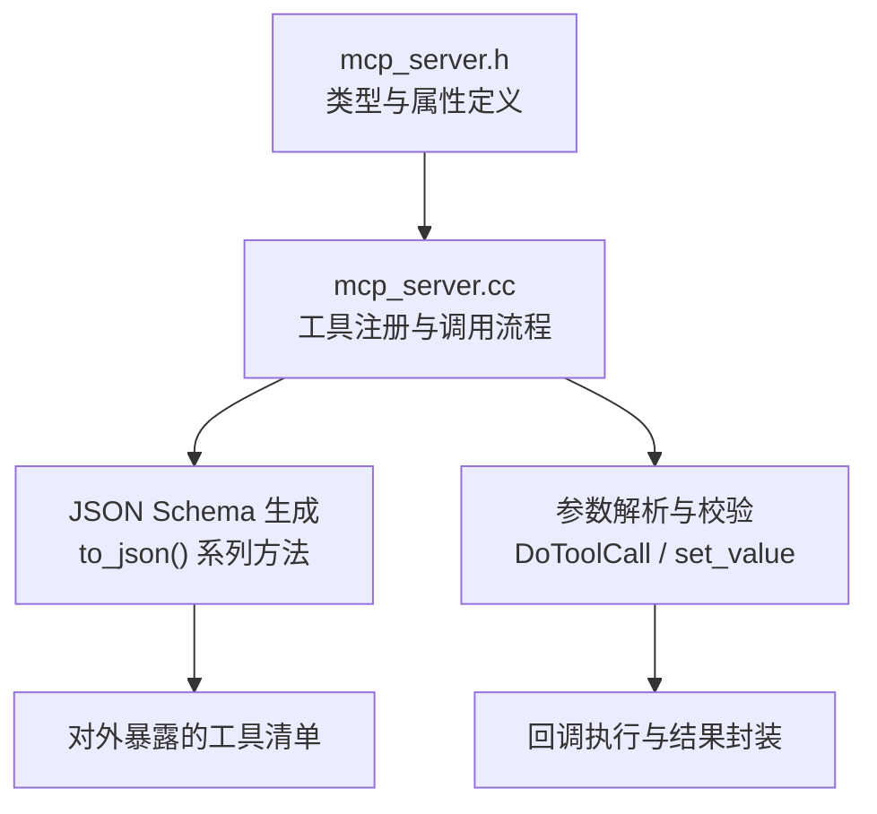
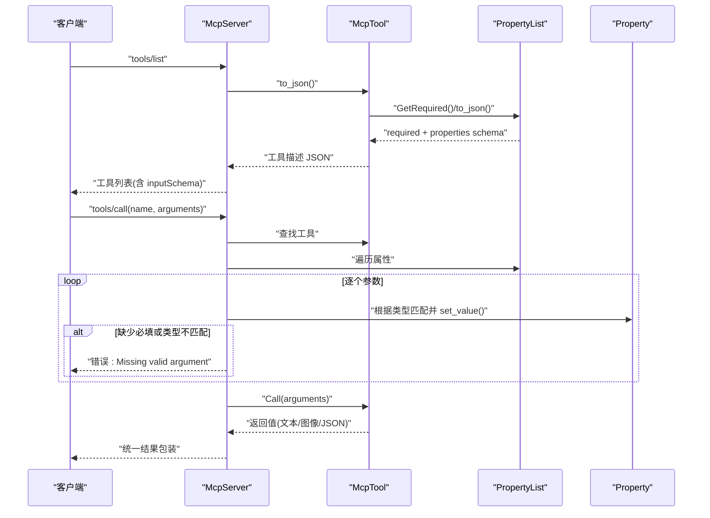
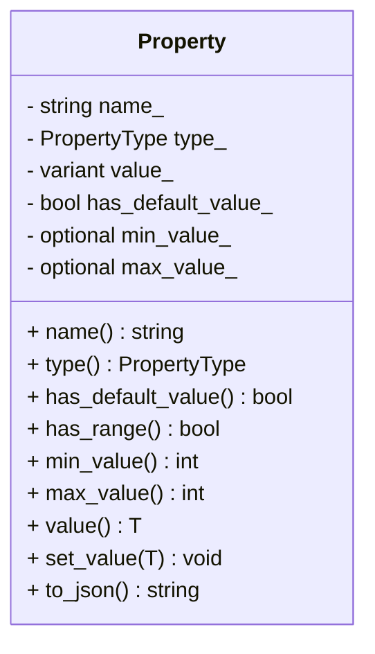
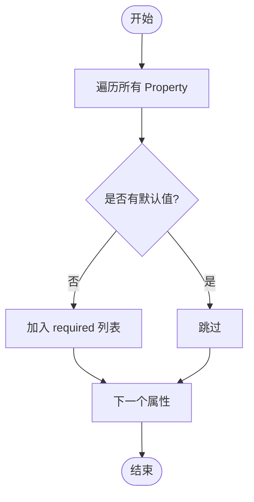
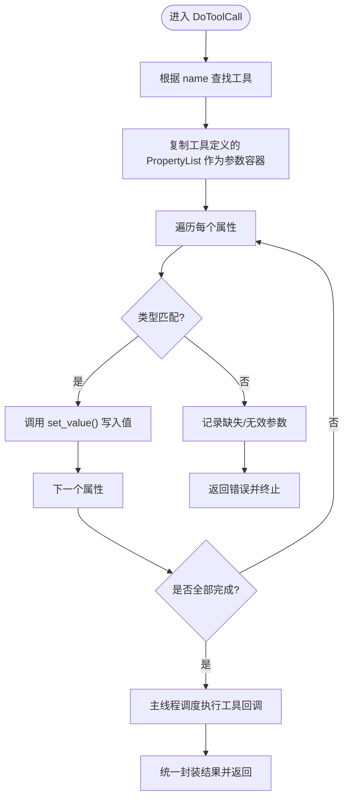

# 参数验证与类型系统

<cite>
**本文引用的文件**   
- [mcp_server.h](file://main/mcp_server.h)
- [mcp_server.cc](file://main/mcp_server.cc)
</cite>

## 目录
1. [简介](#简介)
2. [项目结构](#项目结构)
3. [核心组件](#核心组件)
4. [架构总览](#架构总览)
5. [详细组件分析](#详细组件分析)
6. [依赖关系分析](#依赖关系分析)
7. [性能考量](#性能考量)
8. [故障排查指南](#故障排查指南)
9. [结论](#结论)
10. [附录：最佳实践与示例](#附录最佳实践与示例)

## 简介
本文件聚焦于代码库中的“参数验证与类型系统”，围绕 Property 类及其相关机制，系统性阐述以下主题：
- 类型系统：基础类型、复合类型、自定义类型的定义与使用方式
- 参数验证规则：必填字段、默认值、范围限制、格式校验等
- 复杂参数处理：数组、对象、枚举的定义与解析现状与建议
- 最佳实践：错误提示、用户友好性、安全性考虑
- 完整验证规则与示例路径（以源码位置标注代替直接代码片段）

## 项目结构
与参数验证和类型系统相关的核心实现集中在 MCP 服务器模块中，主要包含：
- 类型与属性描述：Property、PropertyList、McpTool
- 工具注册与调用流程：McpServer
- JSON Schema 生成与工具列表/调用分发

图表来源
- [mcp_server.h:52-156](file://main/mcp_server.h#L52-L156)
- [mcp_server.h:158-206](file://main/mcp_server.h#L158-L206)
- [mcp_server.h:208-270](file://main/mcp_server.h#L208-L270)
- [mcp_server.cc:508-560](file://main/mcp_server.cc#L508-L560)

章节来源
- [mcp_server.h:52-156](file://main/mcp_server.h#L52-L156)
- [mcp_server.h:158-206](file://main/mcp_server.h#L158-L206)
- [mcp_server.h:208-270](file://main/mcp_server.h#L208-L270)
- [mcp_server.cc:508-560](file://main/mcp_server.cc#L508-L560)

## 核心组件
- Property：表示单个参数的元数据与运行时值，支持类型、默认值、范围约束，并提供 JSON Schema 序列化。
- PropertyList：管理一组 Property，提供必填字段推导与整体 JSON Schema 序列化。
- McpTool：将名称、描述、输入参数模式与回调绑定，负责生成工具描述 JSON 并包装调用结果。
- McpServer：工具注册、工具列表分页返回、工具调用分发与参数校验入口。

章节来源
- [mcp_server.h:52-156](file://main/mcp_server.h#L52-L156)
- [mcp_server.h:158-206](file://main/mcp_server.h#L158-L206)
- [mcp_server.h:208-270](file://main/mcp_server.h#L208-L270)
- [mcp_server.cc:33-126](file://main/mcp_server.cc#L33-L126)
- [mcp_server.cc:128-298](file://main/mcp_server.cc#L128-L298)

## 架构总览
下图展示了从工具注册到参数校验与调用的端到端流程，以及 JSON Schema 的生成过程。

图表来源
- [mcp_server.cc:396-432](file://main/mcp_server.cc#L396-L432)
- [mcp_server.cc:508-560](file://main/mcp_server.cc#L508-L560)
- [mcp_server.h:232-270](file://main/mcp_server.h#L232-L270)
- [mcp_server.h:181-206](file://main/mcp_server.h#L181-L206)

## 详细组件分析

### Property 类：类型系统与验证
- 支持的类型
  - 布尔型：kPropertyTypeBoolean
  - 整型：kPropertyTypeInteger
  - 字符串型：kPropertyTypeString
- 构造与默认值
  - 无默认值：必填字段
  - 带默认值：可选字段
- 范围限制（仅整型）
  - 最小值/最大值在构造时声明
  - set_value<int>() 在赋值时进行边界检查，越界抛出异常
- JSON Schema 输出
  - type、default、minimum、maximum 等字段按需输出

图表来源
- [mcp_server.h:52-156](file://main/mcp_server.h#L52-L156)

章节来源
- [mcp_server.h:52-156](file://main/mcp_server.h#L52-L156)

### PropertyList：集合管理与必填字段推导
- 维护一组 Property
- GetRequired()：自动收集没有默认值的属性名作为 required 列表
- to_json()：聚合各属性的 JSON Schema 片段为对象

图表来源
- [mcp_server.h:181-189](file://main/mcp_server.h#L181-L189)

章节来源
- [mcp_server.h:158-206](file://main/mcp_server.h#L158-L206)

### McpTool：工具描述与结果封装
- 持有 name、description、properties、回调函数
- to_json()：生成符合规范的 inputSchema（type=object，properties，required）
- Call()：将回调返回值统一封装为 content 数组（文本或图像），并标记 isError=false

章节来源
- [mcp_server.h:208-270](file://main/mcp_server.h#L208-L270)

### McpServer：参数解析与校验流程
- tools/list：返回工具列表及每个工具的 inputSchema
- tools/call：
  - 按工具定义的属性顺序，逐一从传入的 arguments 中取值
  - 类型匹配：bool/int/string 分别对应 cJSON_IsBool/cJSON_IsNumber/cJSON_IsString
  - 通过 Property::set_value<T>() 写入值；整型会触发范围检查
  - 若某必填参数缺失或类型不匹配，立即返回错误
  - 校验通过后，在主线程调度执行工具回调，并将结果统一包装返回

图表来源
- [mcp_server.cc:508-560](file://main/mcp_server.cc#L508-L560)

章节来源
- [mcp_server.cc:508-560](file://main/mcp_server.cc#L508-L560)

## 依赖关系分析
- 类型与校验逻辑集中在 mcp_server.h 的 Property/PropertyList/McpTool 中
- 参数解析与校验流程在 mcp_server.cc 的 DoToolCall 中实现
- JSON 序列化依赖 cJSON，用于生成 inputSchema 与响应体
- 工具注册与调用由 McpServer 统一管理

图表来源
- [mcp_server.h:52-270](file://main/mcp_server.h#L52-L270)
- [mcp_server.cc:508-560](file://main/mcp_server.cc#L508-L560)

章节来源
- [mcp_server.h:52-270](file://main/mcp_server.h#L52-L270)
- [mcp_server.cc:508-560](file://main/mcp_server.cc#L508-L560)

## 性能考量
- 工具列表分页：为避免单次响应过大，工具列表采用 nextCursor 分页策略，减少网络传输压力
- 参数校验在调用前进行，尽早失败，避免不必要的回调执行
- 回调在主线程执行，确保对 UI/显示等资源访问的一致性

章节来源
- [mcp_server.cc:452-506](file://main/mcp_server.cc#L452-L506)
- [mcp_server.cc:550-560](file://main/mcp_server.cc#L550-L560)

## 故障排查指南
- 常见错误
  - 缺少必填参数：当某个属性未提供且无默认值时，返回“Missing valid argument”
  - 类型不匹配：传入值类型与声明不一致（如期望整数却传字符串）
  - 范围越界：整型参数超出 minimum/maximum 范围时抛出异常并被捕获返回
- 定位建议
  - 检查工具定义中属性的类型与默认值设置
  - 核对调用方传入的 arguments 键名与大小写
  - 关注日志输出的具体错误信息（例如越界提示）

章节来源
- [mcp_server.cc:538-548](file://main/mcp_server.cc#L538-L548)
- [mcp_server.h:112-121](file://main/mcp_server.h#L112-L121)

## 结论
当前系统的参数验证与类型系统以 Property 为核心，提供了基础类型、默认值与整型范围约束，并通过 PropertyList 自动生成 required 列表与 inputSchema。McpServer 在工具调用前完成严格的参数校验与类型转换，确保回调执行的健壮性与一致性。对于更复杂的参数形态（数组、对象、枚举），当前实现尚未原生支持，但可通过扩展 Property 与解析流程逐步完善。

## 附录：最佳实践与示例

### 类型系统说明
- 基础类型
  - 布尔型：适合开关、标志位
  - 整型：适合数值配置，可附加 minimum/maximum 范围
  - 字符串型：适合自由文本、URL、标识符
- 复合类型
  - 当前未原生支持数组、对象、枚举
  - 建议：将复杂结构拆分为多个简单属性，或在字符串中约定 JSON 子结构并在业务层解析
- 自定义类型
  - 可在回调中对字符串进行二次解析（如 JSON 字符串），实现“伪自定义类型”

### 参数验证规则
- 必填字段：未提供默认值的属性视为必填
- 默认值：提供默认值的属性为可选
- 范围限制：仅整型支持 minimum/maximum，set_value 时强制校验
- 格式校验：当前未内置正则/格式校验，建议在回调中进行业务级校验

### 复杂参数处理方法
- 数组：可用字符串承载 JSON 数组，在回调中解析
- 对象：可用字符串承载 JSON 对象，在回调中解析
- 枚举：用字符串配合业务层白名单校验，或使用整型+注释约定

### 错误提示与用户友好性
- 明确错误消息：区分“缺失参数”、“类型不匹配”、“范围越界”
- 提供修正建议：在文档或工具描述中给出示例与约束说明
- 分层校验：先做类型与必填校验，再做业务格式校验

### 安全性考虑
- 严格类型与范围校验，防止越界与非法输入
- 回调内对 URL、路径等外部输入进行合法性检查
- 控制资源访问权限，敏感操作需用户授权（user_only 工具）

### 示例路径（不含代码内容）
- 音量设置（整型范围）
  - 参考：[mcp_server.cc:55-64](file://main/mcp_server.cc#L55-L64)
- 屏幕亮度（整型范围）
  - 参考：[mcp_server.cc:68-78](file://main/mcp_server.cc#L68-L78)
- 主题切换（字符串）
  - 参考：[mcp_server.cc:83-98](file://main/mcp_server.cc#L83-L98)
- 拍照提问（字符串）
  - 参考：[mcp_server.cc:102-121](file://main/mcp_server.cc#L102-L121)
- 固件升级（字符串，可选）
  - 参考：[mcp_server.cc:152-169](file://main/mcp_server.cc#L152-L169)
- 屏幕截图上传（字符串+整型范围）
  - 参考：[mcp_server.cc:190-242](file://main/mcp_server.cc#L190-L242)
- 预览图片（字符串）
  - 参考：[mcp_server.cc:244-282](file://main/mcp_server.cc#L244-L282)

章节来源
- [mcp_server.cc:55-64](file://main/mcp_server.cc#L55-L64)
- [mcp_server.cc:68-78](file://main/mcp_server.cc#L68-L78)
- [mcp_server.cc:83-98](file://main/mcp_server.cc#L83-L98)
- [mcp_server.cc:102-121](file://main/mcp_server.cc#L102-L121)
- [mcp_server.cc:152-169](file://main/mcp_server.cc#L152-L169)
- [mcp_server.cc:190-242](file://main/mcp_server.cc#L190-L242)
- [mcp_server.cc:244-282](file://main/mcp_server.cc#L244-L282)